# P86：86.01_服务器部署：服务器部署的代码文件需求、服务开启86 - AI前沿技术分享 - BV1PUmbYSEHm

那么接下来呢最后我们就到了这个啊，服务器的部署加小程序的这样的一个测试了，那么我们之前的所做的这个TENSORFLOW，serving的这样的一个哎，把它进行一个服务的开启，我们就可以去访问它接口了。

那现在呢我们通常会把我们的这些接口呢，部署在这样一个服务器当中。

那么所以这里的学习目标呢，啊我们的是了解小程序的简单的一个流程，以及我们的这个服务器部署的这样的一个啊，有哪些东西需要部署在服务器上面能理解吧。

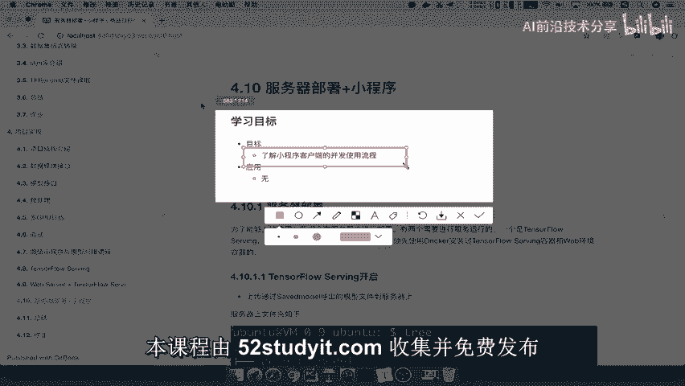

那我们来看服务器部署的话呢，一般我们会肯定会使用在这个上线去使用，那所以呢我们在服务器上面要安装的这些，这个服务呢，一个是tensorflow serving。

另外一个就是flex web，能理解吧，有两个服务是在这个成这个服务器上面安装的。

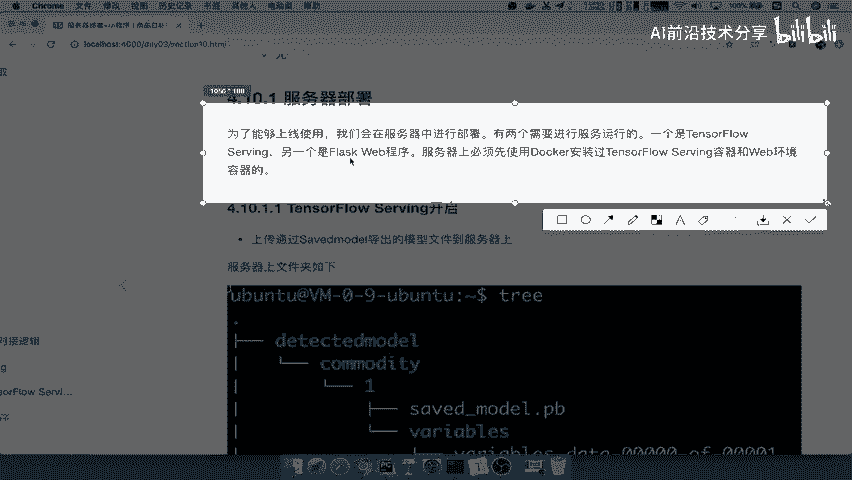

那么我们接下来看tensorflow serving开启，那么你要将什么东西传到我们的服务器当中呢。

我们导出的模型是要去传到服务器上面，能理解吧，啊通过我们的server save model导出的模型。

那么我们服务器上的这样的一个目录的结构。

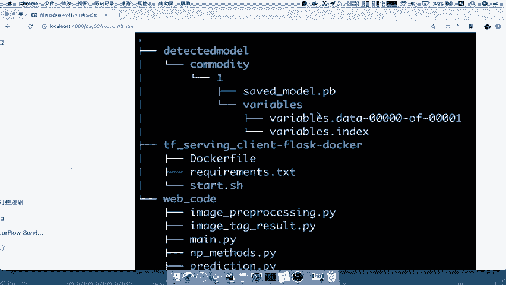

我们会由模型的文件的结构，以及我们的docker这服务器的docker这样的一个文件啊，就是我们要安装web环境的时候，跟tensorflow serving进行统一在一起。

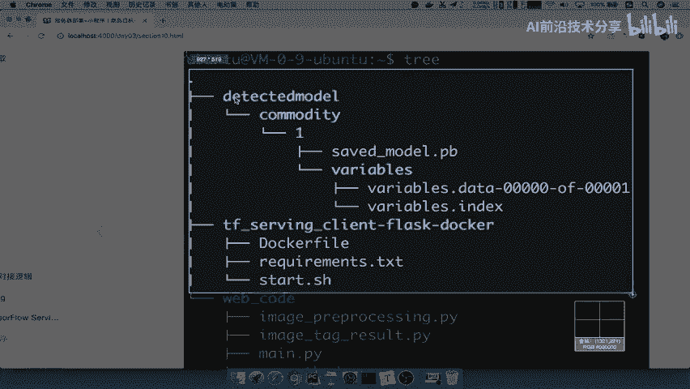

以及我们的web code能理解吧，好那我们现在呢登上我们的服务器去看一下。

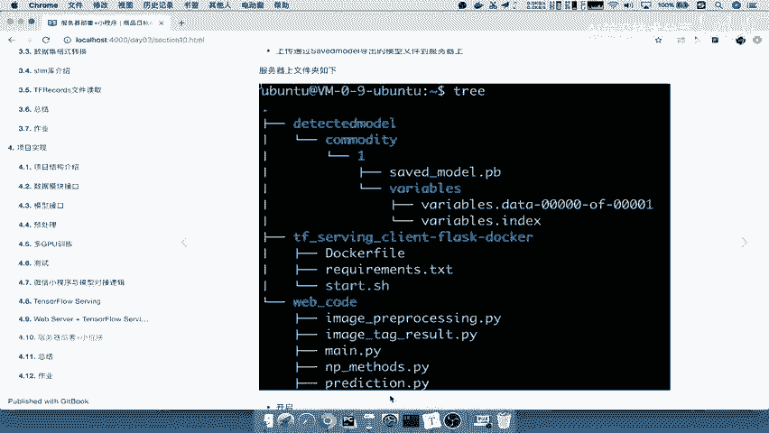

好那我们假设登这个服务器，输入下密码，好登上服务器之后呢，我们来看一下这个远程服务器当中，其实就有三个文件夹，我们需要把模型的文件夹创创建好之后，将模型放在我们的这个文件夹下面。

我们进去看就是我们下面的这一个commodity。

那么这commodity呢，我们就可以去通过这个命令去开启，能理解吧，哎通过这个命令run杠P，将我们的两个端口你都可以去看齐，指定模型名，指定它的目径路径以及我们的模型名字。

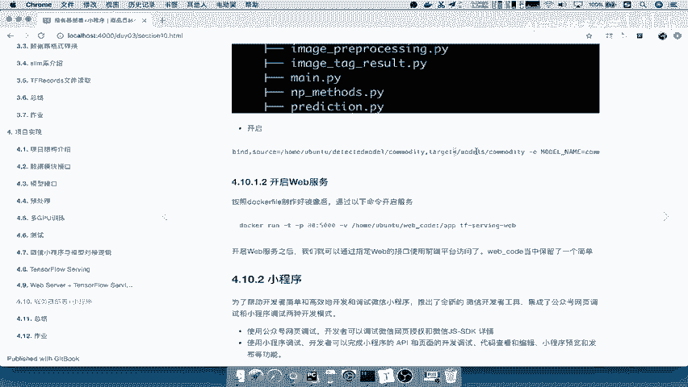

还有你最后的一个服务，那这个开启之后呢，我们可以看到将我们的这个PS啊，docker PS可以看到在我们的这个服务器当中。

我们就已经开启了这样的一个服务了，能理解吧。

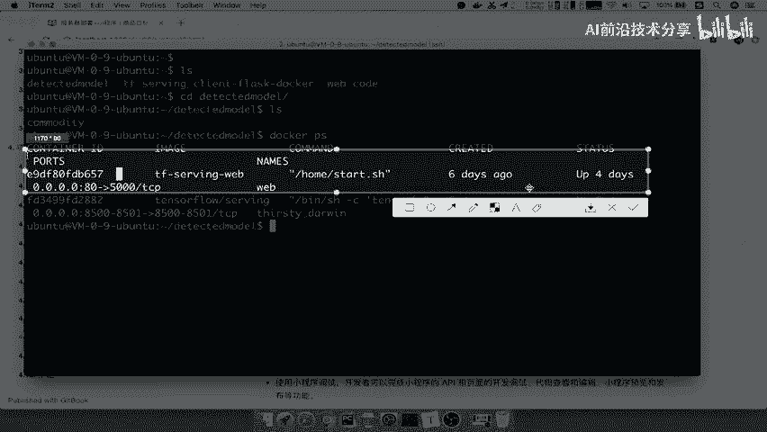

好那除了这个呢，我们说了，这只是我们去访问模型的输入输出接口的，那我们来开启这个web服务是为了什么，提供给我们的用户去进行开发使用的，能理解吧，那web服务呢我们也是通过制作好的这个镜像啊。

当然是你的这个tensflow serving加flash的一个环境。

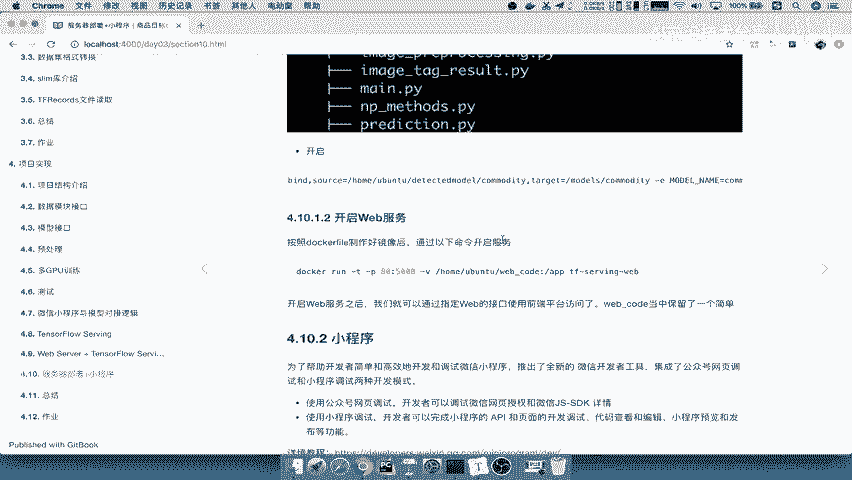

这个在我们的这个文件夹目录，那么我们的web code呢当中就有这样的一个，我们从这进入上一级目录。

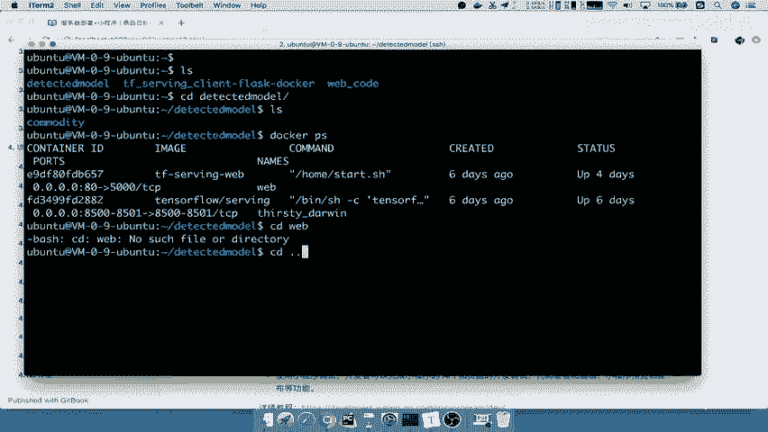

那么这个web code当中，就是我们所放进去的一些这个程序文件，那所以你在这个目录里面呢，哎指定开启我们这个web code里面啊，指定一个app开启我们的main程序，好指定一个名称。

那么这样的话我们来看刚才所输入的docker PS，是不是可以看到有另外一个叫tensor floor，serving web的一个程序啊，那你说这两个啊，这两个程序一个是serving。

一个是server web，那么这两个一个是模型的输入输出，一个是提供给外面接口使用的，能理解吧，那所以我们接着呢，这两个服务在我们的这个服务器当中开启之后，你只需要在我们的小程序当中哎去进行。

比如说我们平台啊，假如说你的平台是这个小程序，那我们就可以用小程序使用，那我默认呢这个web服务当中啊，就已经有了一个简单的我们建立一个啊HTTP，那么我们可以通过这个接口去访问。

这也是我们默认啊在这个开启web服务时候，给了一个简单的界面，你可以在这上传，这是我们之前演示的，能理解吧，但如果你不想通过web的一些服务器开启的话，你可以去使用小程序啊，这一页小程序呢进行开启。

那这个小程序呢其实它已经开服，提供了一些这个提供我们开发者去调试使用的，一些简单的工具，那么它有一个微信开发者工具。

那也就是在这个地方啊，你可以去用一下调试一下，那么这里面呢包括他新建的这些模型呢。

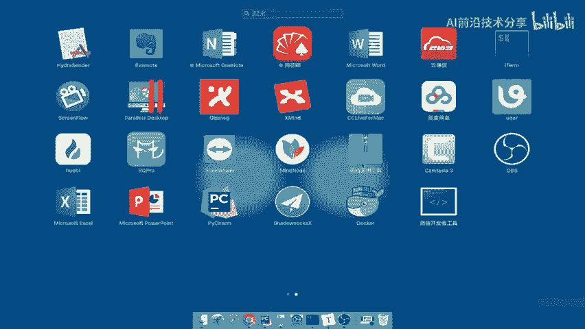

都已经有现成的代码，那你要做的呢，你可以去请求一下。

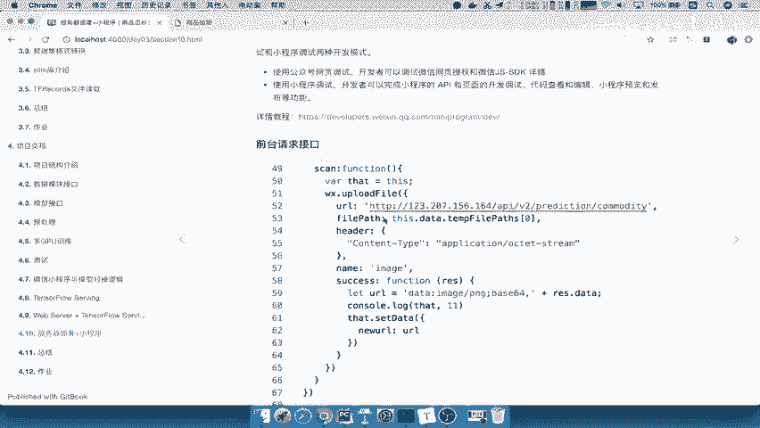

这个我们的这个后台的这些代码，web服务器的后台代码。

这样的一个逻辑能理能理解吧，啊就是一个接口而已好，那么这关于小程序这一段呢，我们毕竟不是我们这个整个模型进行的，这个建立的一个重点啊，所以只是说借助一个平台好，那么这就是我们完整的所需要。

在服务器部署上面所做的事情，那么所以我们在这里总结一下，我们要去进行服务器的一个部署，那么这个部署呢我们就可以去指定两个服务吧，一个服务呢就是我们的TENSORFLOW的一个serving。

服务提供模型的这样的一个提供模型，然后另外一个是我们的web服务，就是将我们的serving客户端，设备客户端即进行一个这样的一个内嵌吧，啊内嵌一个server客户端对吧，内嵌在web服务当中好。

那么这是两个，那么你要上传的文件，包括你的模型文件对吧，以及你的web code，其实最主要的啊，最主要的就是我们的这个prediction，就是我们的一个获取数据吧，哎就是client的一个代码。

web以及client ent代码好，那么这就是我们所说的服务器部署要传进去了，其实非常简单啊，你因为在这个服务呢通过docker去开启，很方便好。

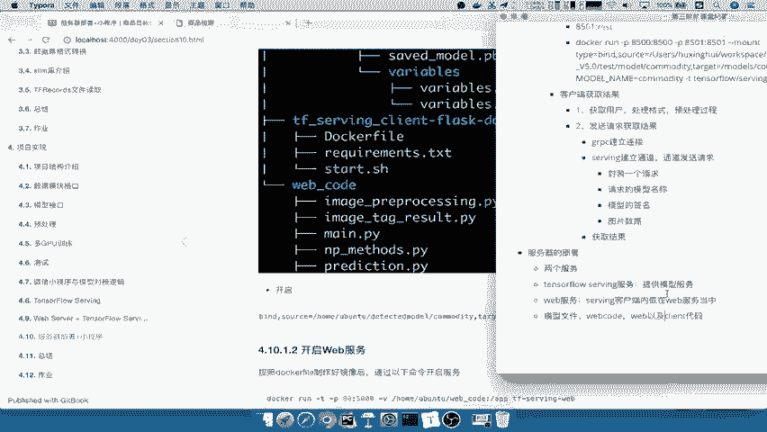