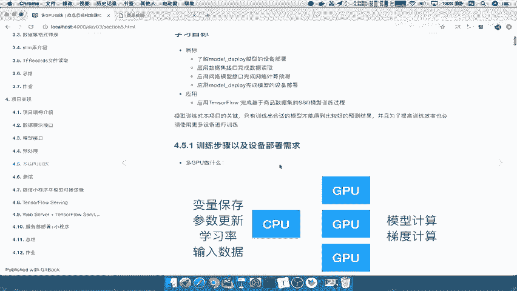
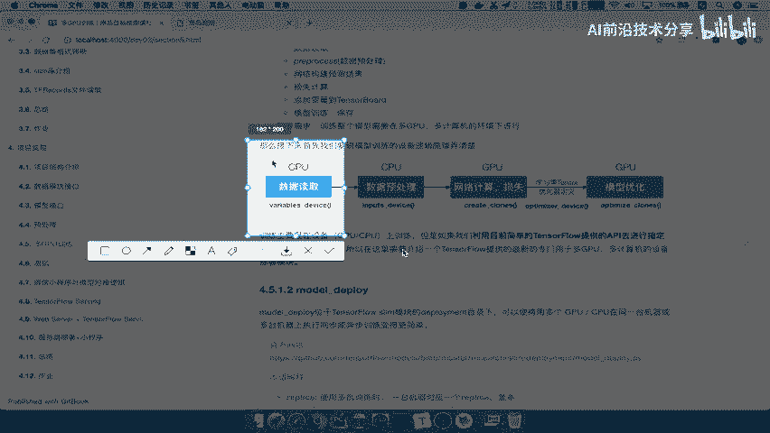
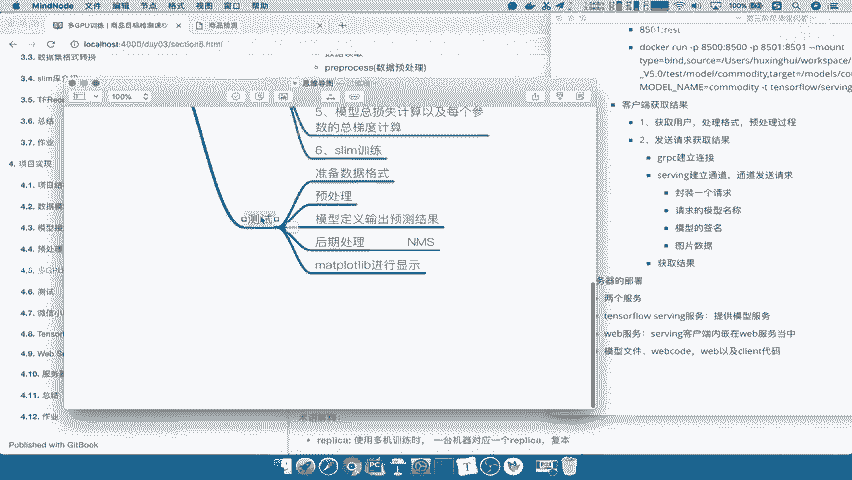
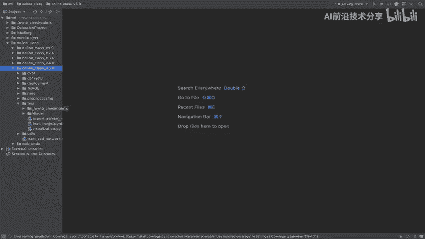
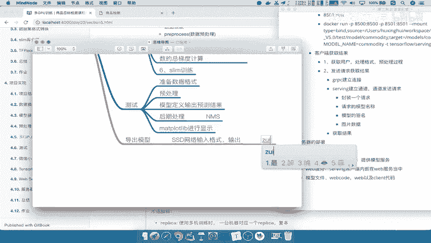
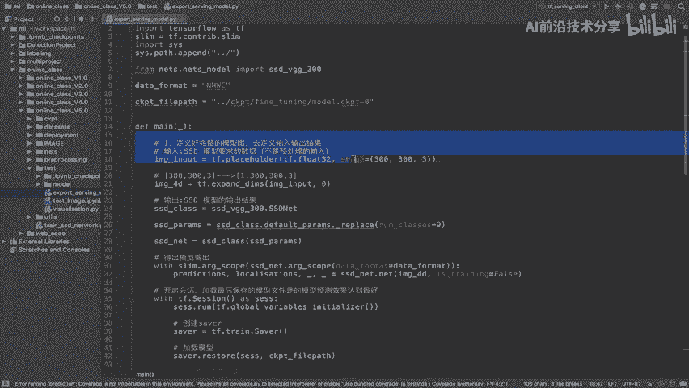
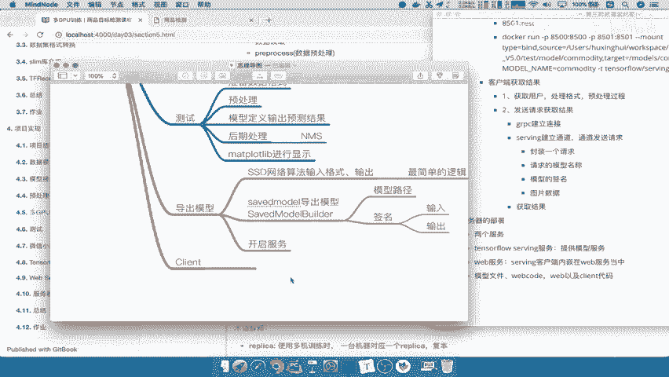
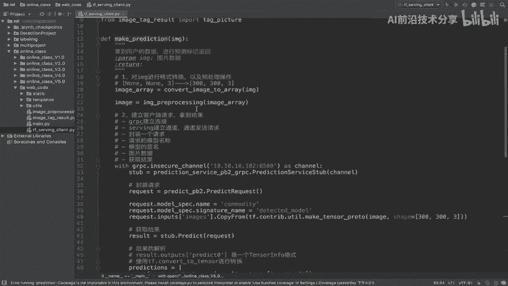
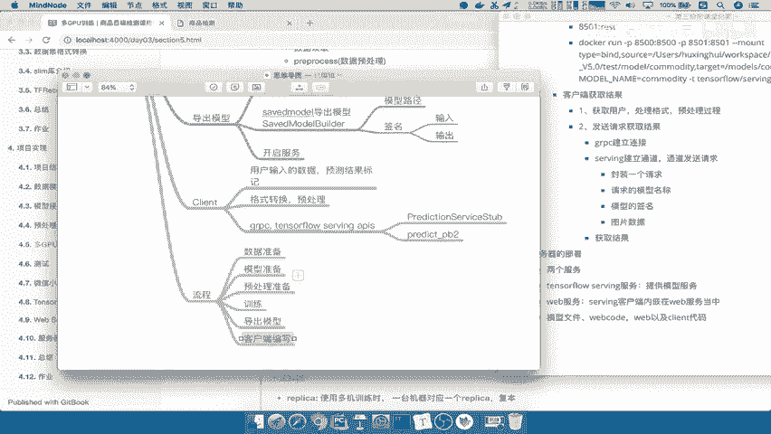

# P87：87.02_项目总结87 - AI前沿技术分享 - BV1PUmbYSEHm

好，那么这样呢，我们整个我们的整个项目呢就结束了，所以呢这就是我们说怎么去将我们一个目标，检测的这样的一个模型实现对吧，以及数据集到我们的算法，到我们的整个这个训练流程，到我们的部署项目啊。

这样就算结束了，那么最后呢我们之前前面的这两步道都总结过，所以我们最后总结一下我们项目实现啊，这项目实现里面啊，以及用到的一些技术点的总结好，那我们新建这样的一个文稿。

那么在这里呢也就是说项目的一个实现总结，那这里总结呢我们主要是先从技术点啊，就是说项目我们用到了哪些技术点得知道对吧，那么项目属性训练的话，我们肯定只是用TENSORFLOW进行一个训练对吧。

TENSORFLOW以及加我们的这个slim啊，你可以加，因为slim呢可以相当于说啊，是他的个一个子库对吧，那么大家slave的话，这是我们的一个训练流程啊，训练训练。

我们可以把这个呢复制到外面去剪切一下啊，训练的这个，那么以及我们在训练当中会使用的是deploy，是不是也进行一个部署吧，哎设备的指定部署，这个要清楚，我们需要去进行多PU多GPU的是这个训练。

那么这是训练的，那么测试呢我们会用到的这些就是MDPOLIB，进行画图啊，当然这些是这个不是特别重要的，只是你在实现的细节上面，那以及我们在部署的时候，怎么去部署我们的模型。

我们使用的就是TENSORFLOW啊，Tensorflow serving，那这个要知道，那么这个TENSORFLOWSERY开启模型的时候，我们需要去有模型文件吧，啊需要有这样的一个模型文件。

那以及serving的一个客户端，对吧，好，我们把客户端这个地方呢也写到这里，serving客户端，编写这客户端呢我们需要去请求哎，请求模型的这样的一个结果。

那这是使用tensorflow serving，那以及我们把客户端呢会内嵌在啊，我们内置这个或者说这个web web服务去托管了，server服务，serving客户端，逻辑能理解吧。

这就是我们的这样的一个训练部署，所用到的一些关键技术啊，包括这其中使用的通信接口，通信的这个协议，我们使用的JGRPC进行一个通信嘛对吧，它的这个通通信的这样的一个优点呢。

就是它的这个性能要比这种通过Rest提供的，接口性能要高很多，能理解吧，好那么这就是它的一个整个技术点，那么我们简单的再去总结一下，我们训练的整个流程，那么这个对于训练的流程来说啊，我们有这么几大步骤。

第一步是不是通过建立这样的一个，我们还是回到这个训练这里啊。

第一步我们是不是建立一个模型的配置啊，哎将配置你的设备对吧。

哎配置设备我们在这里简总结，第一步呢设备的配置以及一些变量，全局变量初始化吧，那要指定设备，我们可以通过使用这样的一个variable device好，这一般呢我们是在CPU，第二步，当我们指定好之后。

我们去获取网络的一些数据，以及我们进行数据的预处理，那所以第二步数据的获取预处理，以及正负样本标记对吧，那这个我们还是一样通过CPU去进行，那这里面涉及到很多点啊，我们就不说了。

那第三个当我们获取这个数据之后呢，我们需要去进行的就是，将我们模型复制到不同的GPU上面去吧，哎每一个克隆每一个设备都要复制一份，以及我们的损失计算网络结果的定义，对吧好。

那也就是说我们会进行进行模型计算，定义损失结果定义就相当于定义结果啊，计算一些占量，那么以及复制模型，复制模型到我们的cloud，知道cloud是什么，就代表我们的设备对吧。

那这里面呢我们应该是在GPU上面啊，GPU每个GPU去复制一份，当然CPU你有多个，你可以去选择进行复制到多个CPU当中，那当你去定义好这些操作之后，接着我们就要去进行学习率优化器的指定吧，对吧。

学习率优化器指定，那么这个我们在CPU当中去进行，最后最终啊这些东西指定好了，我们就要去模型损失总损失计算，以及我们的每个需要观察的变量对吧，你的每个变量的或者说就是参数吧，参数的总梯度对吧。

应该是每个参数啊，以及每个参数的总梯度计算，梯度计算，这样的话你有了这些梯度，有了这损失，你是不是可以去进行优化了，最后呢我们只要去进行啊，slim的一个训练就OK了，这是我们训练的这样的一个流程。

那么接下来我们写一下我们测试的流程，测试呢，我们就把它包含在我们去导出模型的时候啊，啊我们可以把这个单独拿去吧，测试呢我们首先要准备数据的一个格式对吧，数据格式接着还是一样的预处理。

那接着我们到这个模型来定义输出，输出我们要输出结果吧，输出预测结果，那么这个预测结果，当我们输入一个图片进去之后，我们要就进行一个处理过程，那这个我们就叫做后期处理，那这里面包含着一些NM能理解吧。

好以及我们最后后期处理的结果，我们需要去用我们的MATTPOLIB去进行这个显示，好，将我们的这个标记结果显示到这上面去，那这些训练测试，当我们导出模型的时候。

我们直接去干嘛，导出模型，我们说应该是最简单的一个模型的定义，它只需要去进行。

将我们的来我们的模型的SSD网络的输入定义好，以及得出SSD网络的输出吧，SSD网络输出以及输输入啊，输入格式以及输出能理解吧，我们说导出模型一定是导出最简单的啊。

最简单的逻辑，也就是说处理包括一些这个我们的这格式。

不需要在这里面进行一个转换，能理解吧，所以最后呢我们所要进行的一个啊，C的model导出模型能理解吧，它使用的就是你的输入输出啊，最简单的直接算法，网络算法的输入输出格式能理解吧。

那这个co model里面要用的一些，比如说这里面的啊，你的save model builder对吧，Save model builder，看看我们主要是这个东西，这样的一个东西去建立啊。

那这里面要求的你的模型的啊路径呀，包括什么，你的这些签名是吧，签名的话里面有输入输出哎这两个东西，那么这是导出模型，当我们导出模型，我们就去可以去开启开启服务了对吧，开启服务，开启服务之后。

我们要访问模型怎么办，我们需要进行一个客户端编写啊，这个客户端呢我们说了。

主要是进行一个这样的一个绘画的建立啊，相当于是呃一个这个IP啊，那我们进行web code当中，serving可互通安，那这里面我们说了，你要去进行一个完整的一个逻辑。

你的逻辑应该是用户输入的数据，一直到我们的预测结果标记，我们最好都在这个什么呢，客户端当中去进行一个输出，能理解吧，那最后呢我们在用户输入数据呢做预处理呀，格式转换，因为用户输入的图片。

它的格式不一定是数组的，所以格式转换，然后到我们的我们把这里格式调一下啊，我们粘贴出来，然后呢我们在这里写上啊，到这个预测结果标记格式的转换呀，预处理呀，然后我们接着使用GRPC。

以及我们一个tensor floor，Serving tensorflow，一个ser loving的APIS里面有这么两个API，是不是进行一个获取通道，你的这个本地IP吧，好那么这里我们简单写一下。

以及这样的一个predict p2，那这样的话这就是我们的客户端啊，这客户端编写，客户端编写呢我们要把它分配在我们的web啊，这个啊托管在啊，通过在外部的一个服务产品好。

这就是我们最终的一个项目的实现总结，那整个流程呢，从我们的这一刚开始的这样的模型，数据准备对吧，我们最后呢将一个流程写完，流程从数据准备到我们的这个模型定义啊，模型这个或者说模型准备吧。

那到我们的预处理准备，最后到我们的训练，然后到我们的导出模型测试，我们就不写了，导出模型，然后叫做客户端，客户端编写，这样的一个过程拿到放到web服务能理解吧。

好那么这个呢我们保存一下本地文件，我们这里就是说项目实现啊，这刚才已经有了项目的实现总结好。