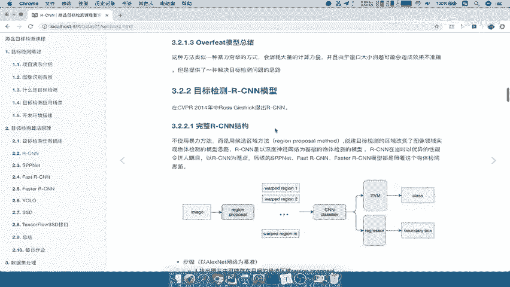
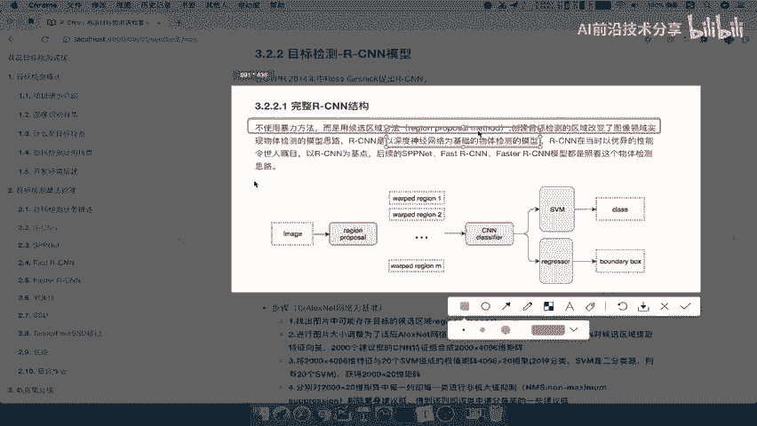
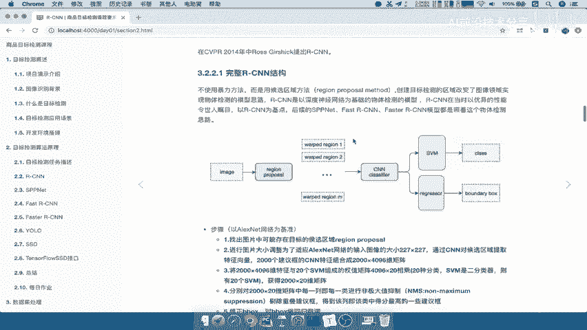
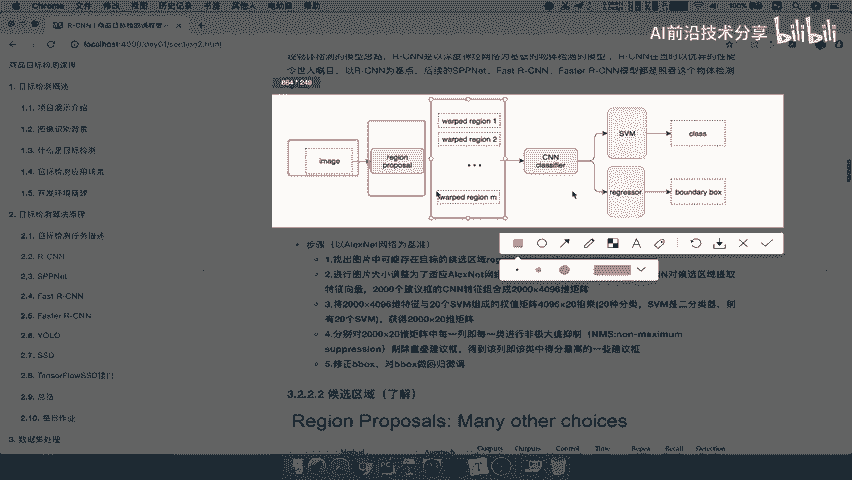
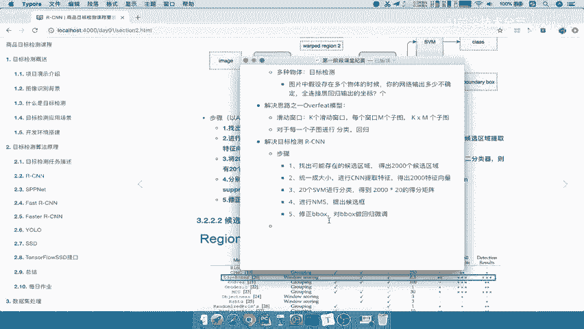

# P9：9.02_RCNN：步骤流程介绍9 - AI前沿技术分享 - BV1PUmbYSEHm

好，那么刚才我们讲的over feat模型呢，指的是怎么去解决唉，这种目标检测多个对象的时候，好，那么现在呢我们接下来就要讲的一个新的，这样的一个算法呢，叫做RCNN，那么这个算法呢非常重要啊。

那么首先呢在这个CVPR一个论坛会议上啊，这个14年提出了这样的一个RCN啊，由这个人去提出的，那么我们先来看一下这个SEN，整个完整的结构是什么对吧，先有一个整体的认识，然后我们再去看一下每一部分啊。

都是怎么去做的好，那么我们来看一下完整的RCN结构。

是这个样子的啊，它长的是这个样子，那么这中间呢我们看一下这段话，解释的是什么意思，它不使用暴力的方法，而是使用候选区域方法，什么意思呢，over feat我们说它是一种滑动窗口的方式，唉。

通过这样一个窗口滑动来暴力的选取候选框吧，但是呢这种方法我们刚说了，哎他的这样的效果呢，哎或者说它的计算量是非常大的，并且它的效果不一定好，所以创建目标检测的这样的一个区域啊。

它改变了这样的一个图像的这样的一个物体，识别的物体检测的一个模型思路，所以呢而且RCN还是第一个，以神经网络为基础的物体检测的模型，非常非常重要啊，以神经网络为基础的。

前面o feed只是提供了解决思路，他没有提出这样用神经网络去解决。

能理解吧，好那么所以呢以牙CN为这样的一个基点啊，后续的这些网络全都照这个啊，为基础为发展的好。

那我们来看一下RCN的一个结构，首先一张图片呢输入进去啊，然后呢提取出region proposal叫做候选区域，然后选区域诶，同样它还是得出我们的很多个，子子的一个区域吧，哎子区域。

然后呢进行一个CNN的分类，那么这个地方呢，每一个候选区都要进行一个CN的分类，最终啊我们通过这样的一个s v m regression啊，把它进行一个分类和回归好，那么这就是它的完整结构。

我们来看一下RCN这个结构的完整的步骤，我们先来理解一下啊。

完整的步骤，在这里，我们对着这个步骤去看一下他一步步怎么做的，中间提到的这些数字什么的，我们先不管好，第一步我们来看，找出图片中存可能存在的目标的候选区域，Region proposal，什么意思呢。

那么我们来看一下啊，我们把这个在这里呢也进行记录一下，它的一个步骤，第一步就是找出可能存在的候选区，这个步骤就跟我们的over feit模型是一样的，先呢找出N个对吧，N个这样的一个模型。

这样的一个区域，然后接着往下啊，这个能理解吧，那么接着要干嘛呢，他要对图像大小呢进行统一的调整，为了适应alex net，我们知道呢在这个分类的网络里面的时候呢，啊我们说CN的各种架构。

它会要求你的图片输入的大小是固定的啊，固定的，那这里我们记住一个这样的一个数字啊，就可以了，那么通过CN对候选区域提取特征向量，那么他呢一般会得出2000个候选区域，然后2000个建议宽哎。

得出CN的这样2000个这这样一个特征啊，好那我们这里写上它一般会得出啊，就是原来的这些算法呢会2000个候选区，得出2000个候选器，接着第二步就是通啊，统一成，大小，然后呢进行CN提取特征啊。

得出2000个特征向量，哎这些我们都知道2000个特征向量对吧，哎那么接着这个特征向量拿来干什么呢，哎他要与20个SVM组成啊，组成的这样的一个全职矩阵的进行一个分类，SVM呢我们知道是一个分类器。

它用这个分类器去给我们的2000个这样的一个，什么特征矩阵进行一个分类，那么他会获得二两千乘以20的，这样的一个维度的矩阵，好，这部分呢这里面的数字我们只要记住一个，20个啊。

20个SVM来看一下20个SVM进行啊，这个分类得到我们就先写一下结果，2000×20的，得分，得分矩阵好，这是第三步，我们来看第四步，第四步呢分别对这个矩阵呢进行一个啊，非最大非极大抑制啊。

非极大NMS，剔除这样的一个候选的这样的一个建议宽好，那我们这里呢直接进行NMS啊，剔除候选框，最终最后一步就要修正b box，对b box进行回归好我们这里直接粘贴过来好。

那么这就是我们RCN的整个过程，整个流程，那么我们接下来要做的事情，就是对于这整个流程去进行啊，每一步的一个讲解，看一下他到底在做什么，每一步能理解为什么能够去进行检测目标好。

