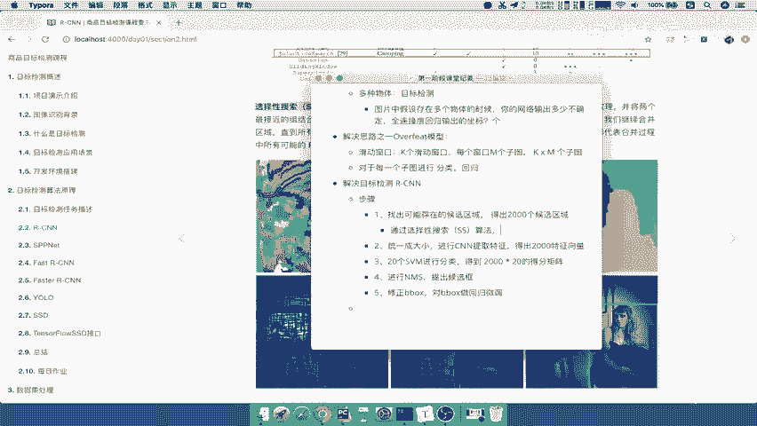
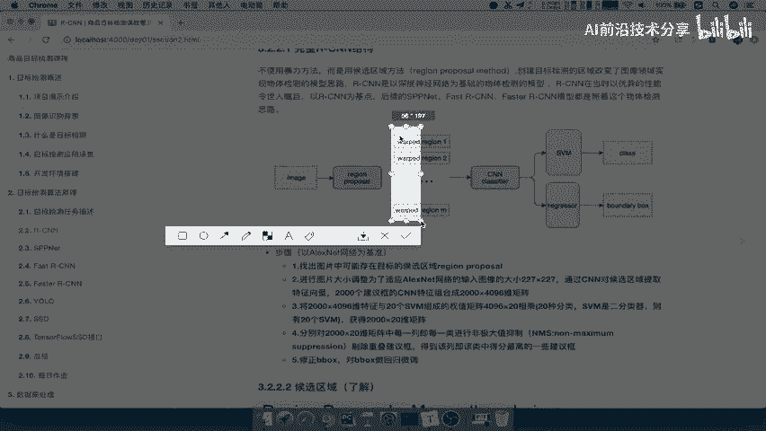
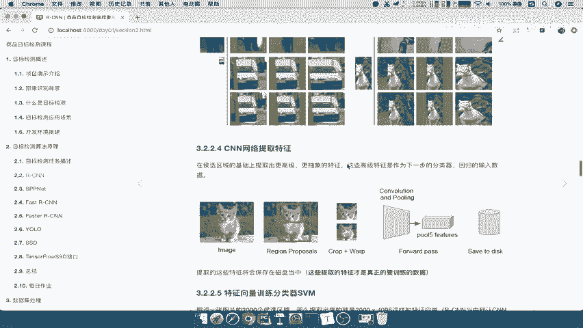
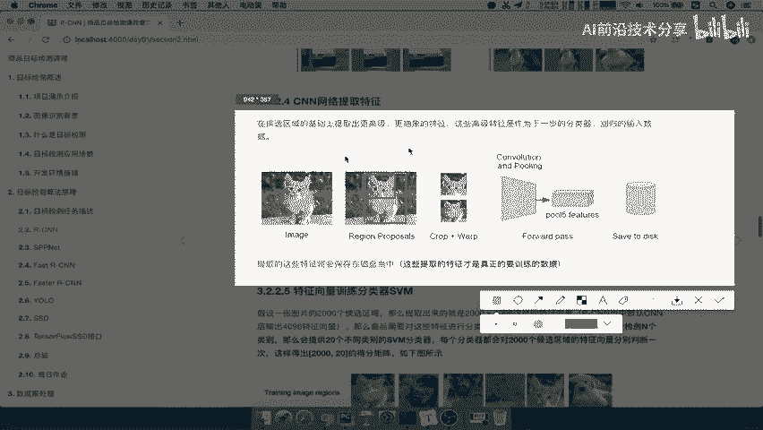
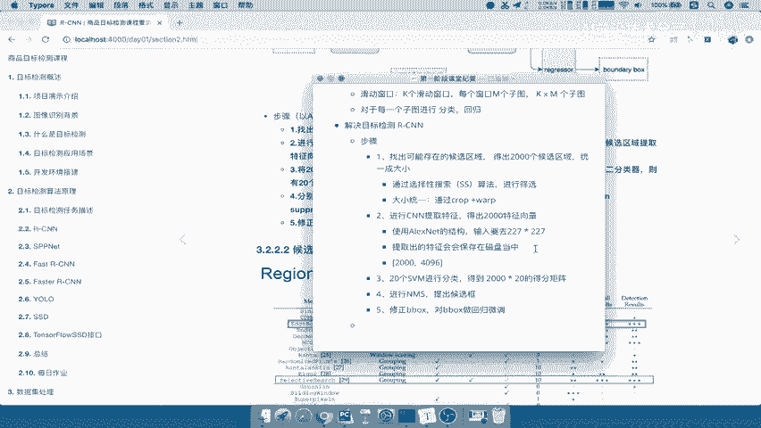

# 零基础入门！一口气学完YOLO、SSD、FasterRCNN、FastRCNN、SPPNet、RCNN等六大目标检测算法！—深度学习_神经网络_计算机视觉 - P10：10.03_RCNN：候选区域以及特征提取10 - AI前沿技术分享 - BV1PUmbYSEHm

首先呢我们就来看第一个啊，第一个步骤，那么这个地方呢候选区域，我在这个地方写了一个了解啊，说明这部分内容呢我们作为一个了解就OK了，那么为什么呢，因为在这个选择出啊，这个候选区域呢。

其实是通过一个叫做选择性搜索的，这样的一个算法，那么这个地方呢region proposal，其实有很多很多的方法去进行筛选，那么其中最有效的一个呢啊，目前被采用比较多的就是选择性搜索了。

那么在RCN当提出来的时候呢，没有其他的一些解决办法，我只能去干嘛，通过其他的一些搜索方法，来找到哎这样的一个候选区域，那么这个过程呢是什么样的过程，我们理解就可以，那么什么意思呢。

它基本上是通过像素之间的一个关系，比如说我在这张图当中，我找到唉相似的附近的一些像素组成一个小块，看到这里图中是不是诶每一部分的一个小块组，像素是差不多的类似的，然后再利用旁边。

像素块跟像素块之间的一些联系，然后再组成一个大的像素块，那么这样的话呢我就可以慢慢慢慢的，是不是提出了一些哎结合出来这些候选区啊，当然你不会最终形成这么一点啊，我们可以比如说形成多一点。

然后提供给我们的这样一个后续的一些算法，能理解吧，所以它的主要目的是在于，来筛选出一些像素比较相近的一些块啊，一些块，然后作为候选区好那我们这里呢写一下啊，通过选择性搜索也称之为SS算法进行啊。

这一个有效的。

进行筛选好，那么接下来我们再继续看到这张图当中，是要干嘛呢，看到我们region n这几个区域，前面都有一个叫wept。

什么意思呢，就是在第二步当中的前面，它会进行图片大小的调整，会把我们的图片大小统一调成什么呢，RCN在最初的时候使用的CNN的网络，是用alex net的啊，所以我们这里写一下。

它这个地方使用alex net的结构好，那么它的输入要求刚才说了多少啊，227×227，那所以在这个之前要干嘛呢，要把每一个候选区域统一成大小啊，因为你在这里利用像素之间的关系。

你所把它标定的这个区域是一个什么，它的形状啊，包括这个像素的大小，是不是它的这个总共像素的一个值的数量，都不一样嘛，所以他要用这个方法，那么这个方法呢这叫做grab加web，这个也是作为一个了解啊。

它就是固定的一个图像的一些缩放啊，目的是什么呢，就是尽量的使得你的图片在统一成固，定大小的时候，避免它最大的一个扭曲，但是它肯定还是会发生一些弯曲的现象，那么这就是他们这两个的作用，什么意思呢。

比如说啊我们来看这张图片，在这张图中，我们比如说候选区域提出了这样的一个块，然后呢经过我们两个部分哎，第二个是我们通过第二种算法呢，哎第一就是说我们现在的这种club，将web的这种算法。

它的这个扭曲程度，会比第一个扭曲程度要小一些，然后再看这里啊，这里可能还不明显，我们看这个车这个车的第二种，第二种方法是比第一种方法要好吧，对不对，哎他的这样的一个变形程度就没有那么明显。

包括这个啊骑着马的这个这张图片好，那么这就是crop加web的作用啊，只知道它的作用是干嘛，通过输入固定大小的就OK了啊，其他的细节不用去理解了啊，所以这两部分内容候选框是选择性搜索。

以及QUB加web作为了解内容就OK好，那么所以呢我们把统一成大小啊，把它放到这个地方，那么大小统一啊，通过crop加WARP好，那么这样的话呢，我们这个啊第一步骤就完全讲完了啊，那么第二步骤我们说了。

你输入到CN当中，目的是为什么提取特征向量，这个我们都知道就是经过这个图片，经过这个CN之后啊，我的目的是要提示出一些高级的抽象的特征嘛，这些特征才能代表你这张图片的一些典型的，一些地方好。

那所以我们来看到在这个区域基础上。

经过这两步之后，我们直接经过CN网络，这些网络提出的唉，就是我们的最后一个特征，那么这个特征在RCN提出的时候，他说了要保存在这一个磁盘当中好，那么为什么这个地方为什么要保存在磁盘当中。

后续我们会解释哎，我们在讲后面分类的时候会讲了，为什么要保存起呢，好那么所以我们这个地方要记住了，提取出的特征，会保存，会保存在磁盘当中，那么这个地方提取的这个特征，这个特征大小是多少呢。

那么RCN的这样的一个结构，它固定的大小就是4096，每一个候选区注意啊，每一个候选区域都要经过CN网络特征提取，那所以得出多少个2000个特征矩阵嘛，所以是不是得出2000×4076。

2000个候选器得出4096啊，4096个特征它是固定大小的，4096能理解吧，好那么这样的话呢我们就知道了，CN呢主要是提供提取特征，并且提取的特征会存储在磁盘当中。

