# 零基础入门！一口气学完YOLO、SSD、FasterRCNN、FastRCNN、SPPNet、RCNN等六大目标检测算法！—深度学习_神经网络_计算机视觉 - P12：12.05_RCNN：非极大抑制（NMS）12 - AI前沿技术分享 - BV1PUmbYSEHm

那我们来看一下啊，NM到底是怎么去做的，你想想我们2000×20这样一个得分矩阵，是不是相当于是有2000个，每一个候选区都有20个得分嘛，但是你想想你最终得出多少个候选框，你想你拍一张照。

你这张照输入进去，你最终判定类别，你说你得出，我检测出这个图片里面有1000个类别，有1500个类别，有2000个类别啊，怎么可能对不对，所以你肯定要去筛选一些可能性大的，这些候选框。

比如说我这个图像本身就只有两个对象，你2000个候选框，你得出2000个对象吗，你只能得出两个这样的一个对象，所以就是非极大抑制的。

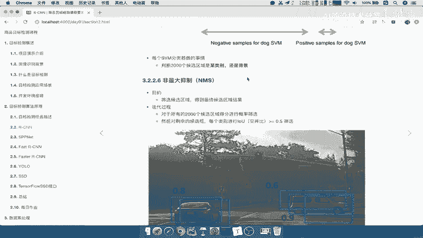

这个最大的作用能理解吧，他的目的就是筛选候选框，得到我们最终这张图片，推荐几个候选框到我们最终的这个结果好，那么这个过程怎么样呢，它是这样的一个迭代过程的，对2000个会选关进行一个概率的一些筛选。

然后对剩余的候选项进行IOU的一个比交，并比的比较。

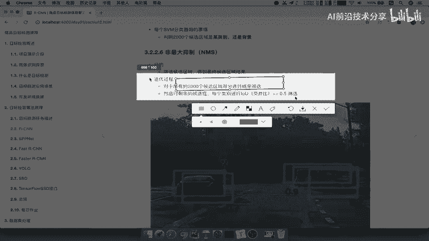

什么意思呢，我们来看一下，这里有一张图啊，这里有一张图，一共呢五个候选框，假设啊，我们现在呢整个这个S这个RCN，他就推荐了五个后循环啊，就从前到后得了五个候选文化，我们不没有2000个啊。

假设只有五个好，我们把这个过程拿过来，我们直接啊截屏下来解释一下这个过程，假设呢我们把这个地方标定一下啊，这里标成A啊，这里标成这里标成B吧，C，D，那么然后呢这边呢是A，好这里再来一个。

CTRLCCTRLV啊，变成一假设啊，我们的这个整个RCN啊，R杠CNN，那他呢得出五个候选区啊，五个，我们以少一点来去理解啊，不不搞2000个，那么怎么去做这个NMS呢，A b c d e。

首先第一步我们刚说了，它是作为一个概率筛选，我们已经得到一个评分了吧，那么对于每一个啊，对于ABCDE候选框来讲，它得出每个候选框的最大分数，来比较这五个哪个大好，从五个，这那个候选后。

这个区域选出这个score分数最大的，哪里来的school啊，是不是我们前面说SMM给他们打了一个分啊，每个混缺席是不是有20个打分啊，那选出它最大的，选出它最大，选出它最大的。

对每一列的最大的进行一个筛选好，那么得出最大的假设啊，假设现在得出最大是B，假设啊假设为B来看到为B的话，那现在就又开始了，让剩余的剩余的，比如说AC，DE分别与我们写，下面分别与B进行交并比计算。

还记得交并比啊，是不是这个框重叠的程度。

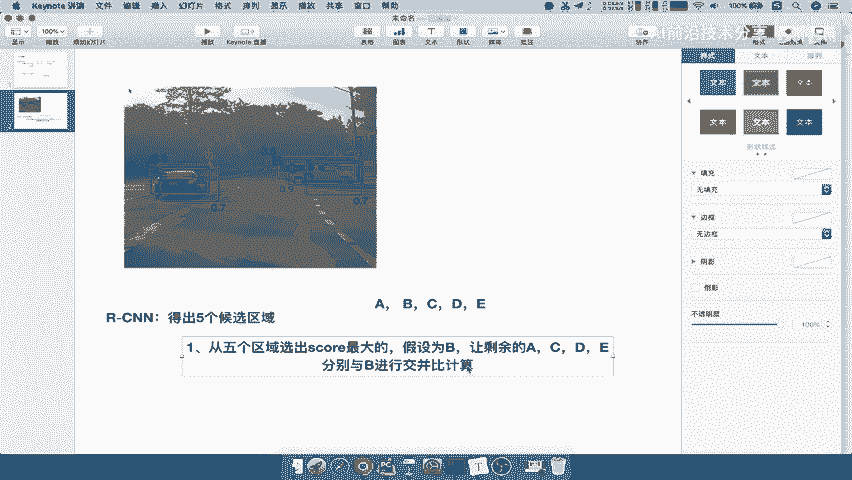

除以它们两个框的共同的大小，所以你从这张图当中啊，假如说你从这张图当中你能看出什么，是不是AE与B的重合程度是不是为零啊，他们俩没有交集吧，所以是零除以它们俩的共同的面积。

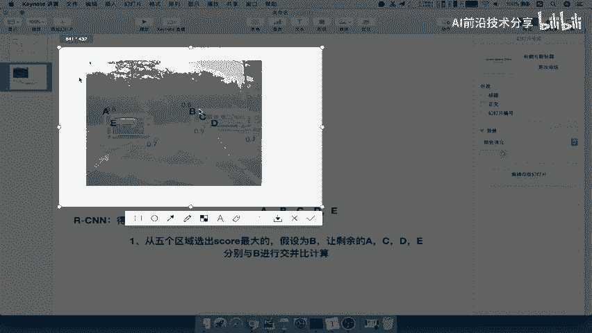

是不是零除以任何数还是零啊，所以我们这个地方，所以我们计算比如说C和D的重合程度，比如说要进交并比大于有一个阈值，我们会设定一个阈值，阈值呢一般会为0。5，好假设什么呢，C和D满足C和D满足。

那么现在要做的事情就是去除，去除CD这个地方啊。

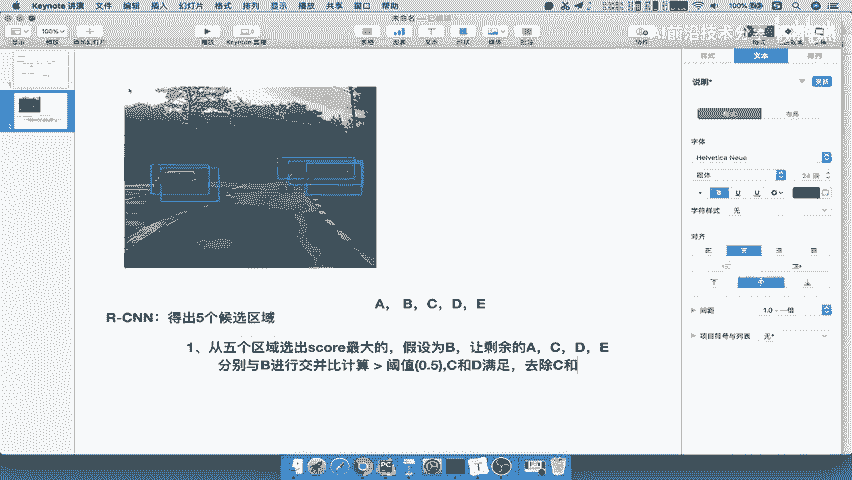

我们就在图当中啊，图当中可能这个C啊C应该是更合适的吧。

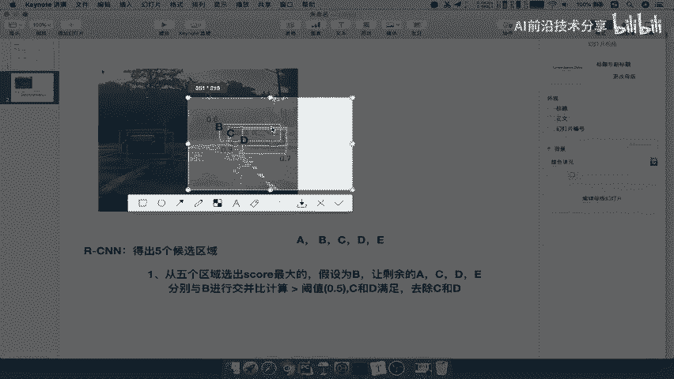

所以我们把这个改一下吧，假设是为C啊，我们要按这个图来讲啊，所以让剩余的ABDE，然后与他B和D是满足的对吧，B和D是满足的，去除啊，B和D好，也就是说B和D删掉了，保留了C，那这两个混选框没了。

是不是对于这个对象是不是来讲，你是不是就只保留了一个吧，哎所以呢我们来讲保留啊，预测C好，那第二个就是C，但是你想想啊，他刚才做的事肯定是对于某一个对象预测来讲，把所有周围的所有的东西全去除了吧。

但是你不仅只有一个对象吧，所以你要循环的循环第二次，筛选怎么筛选呢，我要在A和什么呢，BCD都没了，A和E中，A和E中，筛选最大的，那么A和E我们看一下，大概知道哎A可能那A的得分高好。

然后因为其他候选框都没有了，我们只有五个啊，如果说你画多一点对吧，你可以再画一些好，比如说A的得分最高，然后呢E与A的注意啊，BD去除了我们不要了啊，E与A的这个IOU啊，为比如说它也是0。6啊。

大于我们的阈值0。5，好好，所以呢删除E得出A，删除E得出A1个获取一个预测结果，你看五个候选框，就这样被我们用利用NM4NM啊，非极大抑制过滤掉，是不是就要得出两个推进区域了。

你想想如果说我们这个地方再来看啊。

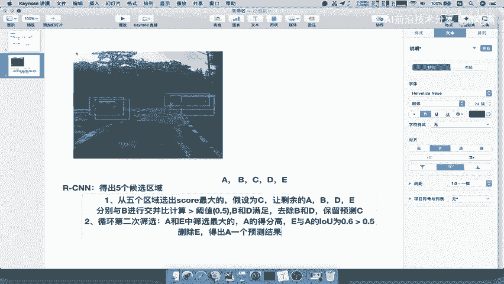

怎么理解这个过程啊，比如说现在啊我画了两个红色的啊，红色的是有物体的，我比如说画这里吧，两个红色的是有物体的，比如说这里又有一辆车，然后这一辆车有物体的，那现在你你的候选框哎，我现在又有又有多个候选框。

你想想我们预测的结果，我们预测的结果是不是要肯定要靠近啊，假如说你模型训练好了，你预测结果是不是都靠近它，那所以你这样整个通过这里有五个六个，七个八个九个十个11个11个候选区域。

是不是你进行一个哎NMS非极大抑制去的话，你觉得你会得出几个，是不是得出四个，是不是得出四个，每次都选出是这个什么得分最高的哎，这部分筛选两个，这部分筛选一个，这部分筛选一个，这部分筛选两个。

这部分也筛选两个哎，这样的话你是不是就得出了四个推荐区域，所以我们的推荐区域，一个图片当中的它的一个什么，这个预测结果肯定是很少的。

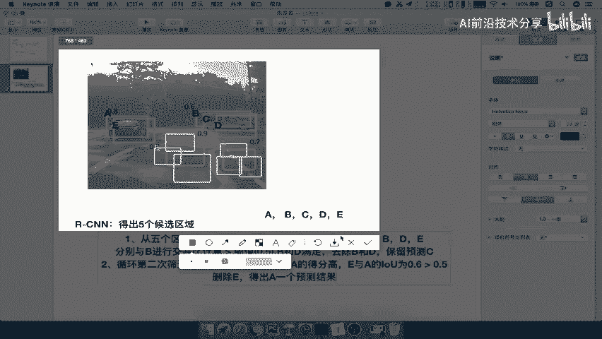

不可能有2000个不可能对吧，所以这就是啊我们所说的NM4非极大抑制，对这个过程一定要去理解，理解非IJ那个啊理解NM的整个过程，如果说我叫你自己去实现，写一个我给你的这些得分。

你自己去写一个这样的一个NMS的，这样的一个算法，是不是也可以去写啊，这个地方有很多符号啊，我们直接把这个地方拿过来，当然这里面的这个符号啊，跟这个原图当中符号不是对应的啊。

跟我们刚才讲的是对应的就OK了，好这就是看一下啊，这有滑动窗口这么几个获取窗口，一轮一轮的去迭代啊，这迭代整个过程最终找到啊，一些目标检测比较高的一些得分的区域，并且其他区域都删除掉，好这就是NMS。

那我们说NMS处于这个算法当中的，一个比较重要的决策，就是CN进行一个什么呢，分类提取特征之后，SVM是要进行打分的啊，先进行SVM打分，打分之后呢，这里写打分啊，打分之后要进行2000个筛选。

筛选出若干个这个若干个不是定的啊，就要看你到底预测的准不准确，预测的准，那你有多少物体，是不是就有多少库存啊，如果预测不准。

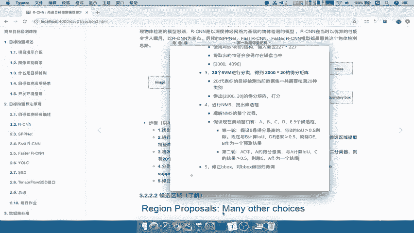

预测不准的意义是什么呢，就比如说我预测这一块就有好几个窗口。

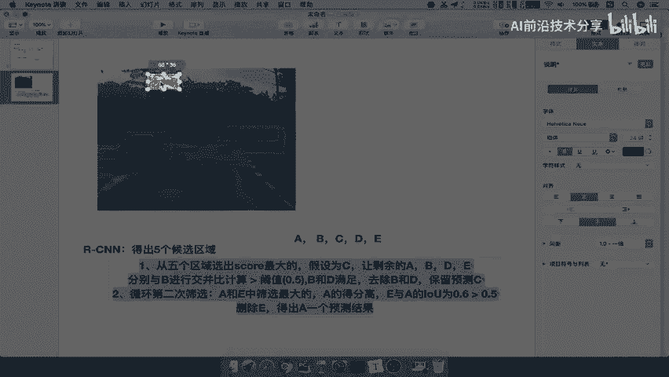

那么这块又没有物体。

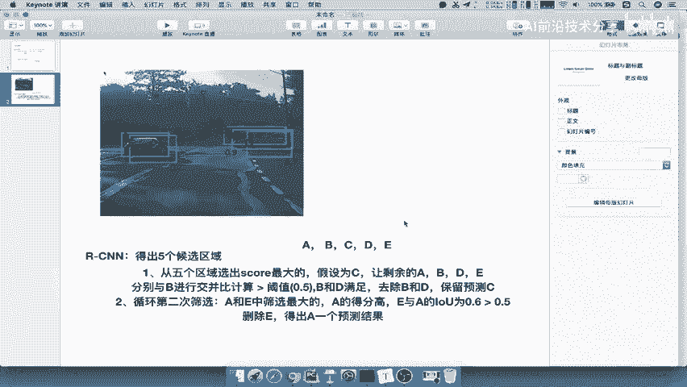