# 零基础入门！一口气学完YOLO、SSD、FasterRCNN、FastRCNN、SPPNet、RCNN等六大目标检测算法！—深度学习_神经网络_计算机视觉 - P14：14.07_RCNN：训练过程与测试过程介绍14 - AI前沿技术分享 - BV1PUmbYSEHm

那么接下来我们有一个重点，就是对于任何的一些网络神经网络来讲，都是不是要去训练吧，对不对，训练好的参数才能作来作为一个预测过程，那所以我们接下来讲的就是，RCN的一个训练过程啊，RGUCN的训练过程。

那么我们来看一下这个训练过程是什么样的呢，那么RCN的训练过程分为这么几个部分啊，准备部分，正负样本的准备，预训练，网络微调网络训练，SVM训练边框啊，回归系，那这个我们来一步一步的看啊。

正负样本准备什么意思呢，我们用CSS这个方法获取的2000个候选区，并不会所有的候选区都拿去进行训练啊，所以我们一般会这样筛选出一个正负样本。

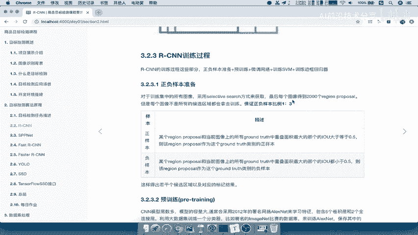

什么意思呢，正样本就是region某个啊，2000个里面某一个每一个都要去进行判断的，某个region proposal，与当前图像上的所有的grand truth。

比如说有三个ground truth，如果重叠面积大于哎，最大的那个IU大于等于0。5的，我说明这个region proposal它是一个这一样的好。

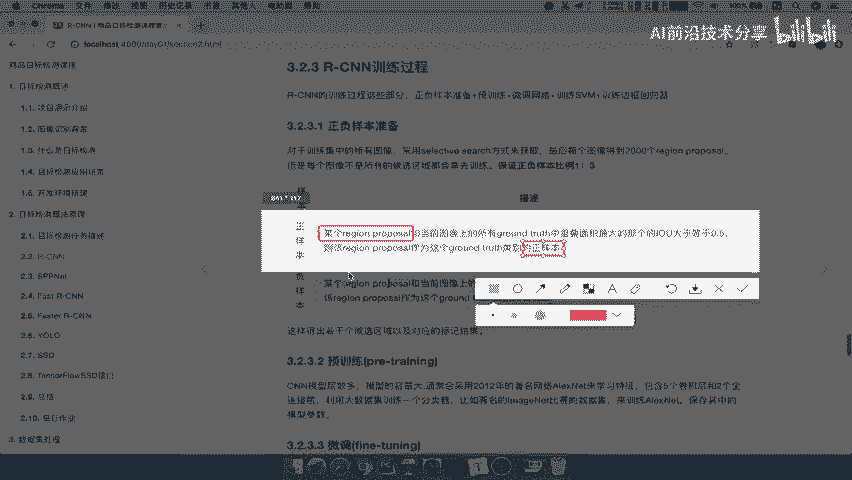

如果我们的某个origin process，与所有的gt它的IOU值都小于0。5，那么对不起，你这个region proposal我标记负样本，也就是说这个样本不好怎么理解呢，也就是在这里面。

假设说啊对于这张图我们来标记一下啊，标记一下我们的这样本吗，就是gt吧，gt是在这里的这个图的，gt是在这红色的是gt，那你现在有个样本，有个样本是这个这个地方。

你想想这个region proposal啊，这是你的这个推荐获选区域与所有的gt的重合，就IOU值是不是都等于零啊，那这个样本我们称之为负样本，是不是就这些哎，跟他跟一些目标的这样的一个框啊。

它的重合重的几乎没有的，这些都是负样本，而只有这些与它重合大于0。5%的，比如说啊这个大于0。5，这个也大于0。5好，比如说这个也大于0。5的，那这些候选区域是不是就比较好啊，哎我们称之为正样本。

所以呢我们会标记正负样本好，那么这个地方的正负样本标记，就是这样的一个过程，那标记的它要保证正样本啊，跟负样本的比例是一比三的好，那所以呢这一个步骤啊要记住了，标记好之后呢。

我们接下来就会用到给后面的网络去训练了，首先我们要提到两个的名词，叫做预训练和微调码了，微调网络预训练什么意思呢，来先看预训练。

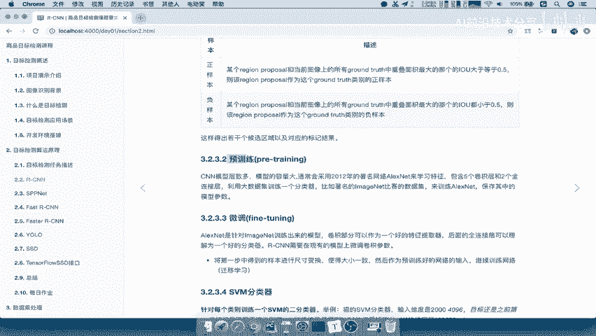

预训练也就意味着啊，我们的CN的模型参数太多了，你通常呢我不会直接拿一个，你自己随机初始化的CN去拿去进行训练，而是用一些什么呢，已有训练好的模型，比如说通常会采用一些对吧。

2012年的这样的一个网络呢，它是采用alex net的一个学习特征，我们把这变成红色啊，那么他呢在这个image net比赛的一些数据集，来训练网络，保存其中的CN的参数，注意啦是保存CN的参数。

这就叫做预示量，就别人已经训练，拿一些大量的数据集去训练好的一个什么呢。

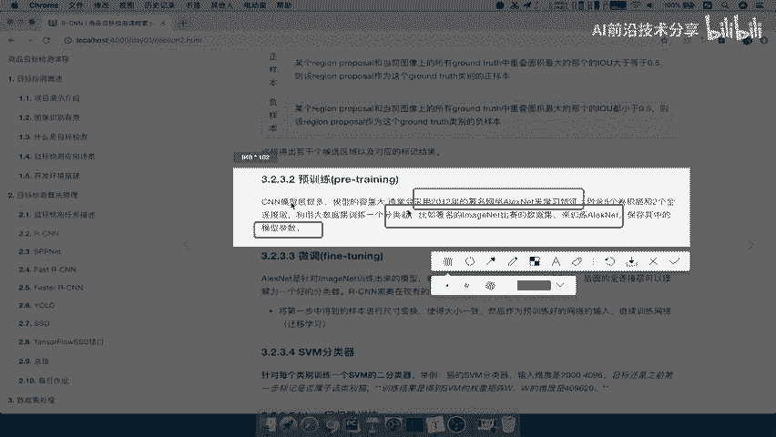

一个CN的模型的参数能理解吧，哎所以我们是要在这个基础之上去进行，调整的啊，不是说你一开始就拿CN进行进行训练，那你训练的结果肯定不好，因为这个参数太多了，你的样本必须非常非常大。

所以一般会采用啊在这个基础之上去行这类，所以训练过程一般呐，最重要的就是预训练啊，加上微调这两个东西，那微调是什么意思呢，微调就是我把刚才这个CN拿过来拿过来，然后将我们提取好的特征，提取好的特征啊。

就相当于是给我们的这个分类啊，就是后面的全连层层理解成一个分类器，用这个alex net，在我们现在第一步得到的这个样本的，进行尺寸变化啊，这个正负样本得到了，然后进行尺寸变化，使得大小一致。

然后作为已经训练好的image net的这个网络，再继续训练一个新的啊这个参数，这就是这个微调网络，也叫做FINTURNING啊，FTNING好，这就是微调就是什么呢，预训练是已经啊。

别人别人已经在大数据集上训练好的，is好的CNN网络参数，我们的微调是要，利用标记好的样本训练啊，然后呢这个输入到这个，比如这里吧，我们记着model1啊，Model1，然后呢输入到model1当中。

输入到model1当中啊，继续训练得出啊，model啊，这个model2就指特指的是我们的CNN网络了，能理解吧，也就是说我们是在这个基础之上再去用，我们现在的啊正负样本。

当前啊我们的啊当前我们业务的数据集，我们呢进行正负样本标记，正负样本标记好的样本放到这里，是不是，那么这就是预训练和微调，这两个，一定要理解这个过程是什么样的一个区别啊，所以一般微调我们也可以称之为啊。

你有可能听过迁移学习啊，其实就是迁移学习，微调其实就是迁移学习好，那么这两个调整好之后，我们说了，这相当于只是把你的CNN网络跟这个哎。

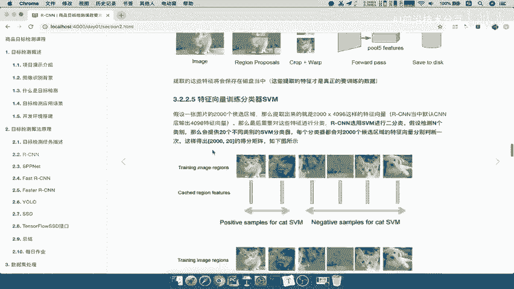

全连接层给训练好吧。

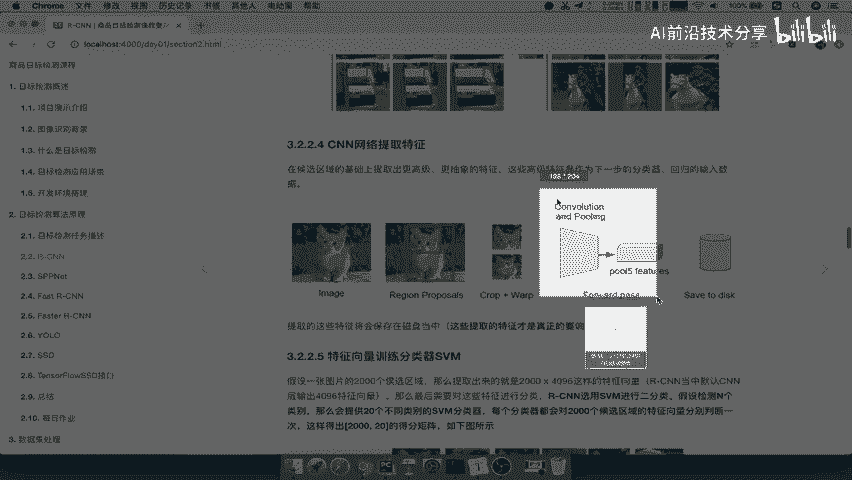

这些训练好没有用吧，我们还得干嘛呢，来看到进行SVM分类器的训练，和我们b box的一个训练能理解吧，那么所以在这个地方。

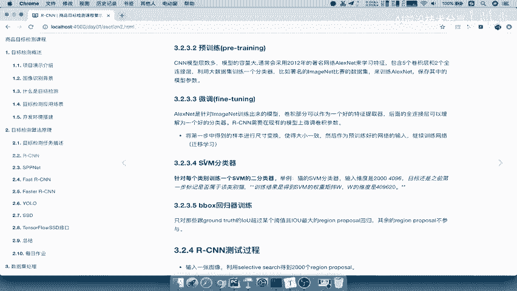

SVM分类器，它是要针对每个类别都会限训练出一个分类器，我们说了，你有20个类别，就20个分类器，每个类别都会训练出一个分类器。

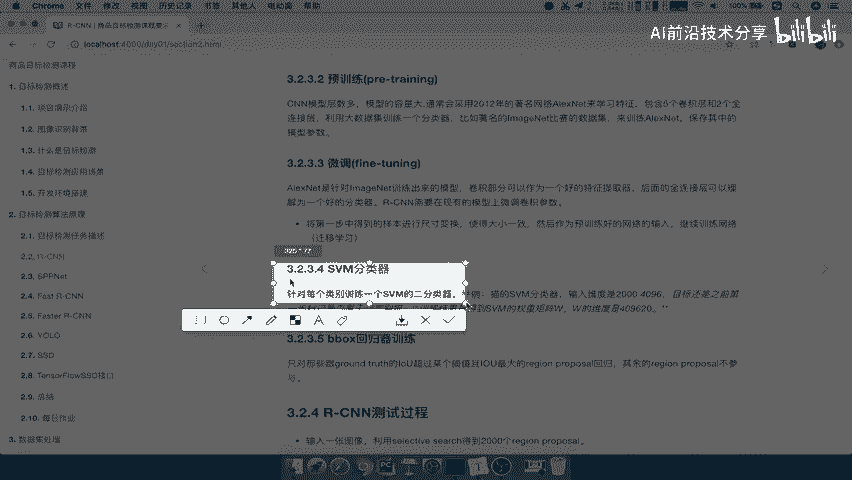

举例，比如说猫的SNN分类器输入是2000400，4096的，那目标就是之前第一步标记是否属于猫的啊，比如说这几个是属这个里面啊，有100个候选框是属于猫的，然后其他的1000个候选框都不属于猫的。

然后用这两部分的数据去进行训练，一个猫的s vi好，我们这里呢可以举个例子啊，训练SVM分类器，每个类别训练一个分类器，咱们训练的呢，比如说啊我们的标这个正负样本标记结果吧，正负样本标记结果好了之后啊。

比如说100个100个猫的候选框，就是它的目标类别是in猫的，我们也标记了啊，是自这样的一个手动标记的，然后呢这个比如说1300个，或者说900个是非猫的好，是飞猫的这样的一个呃样本。

我们用这个样本去训练一个SVM去训练分类器，那么他就会得到啊得到我们的一个权重。

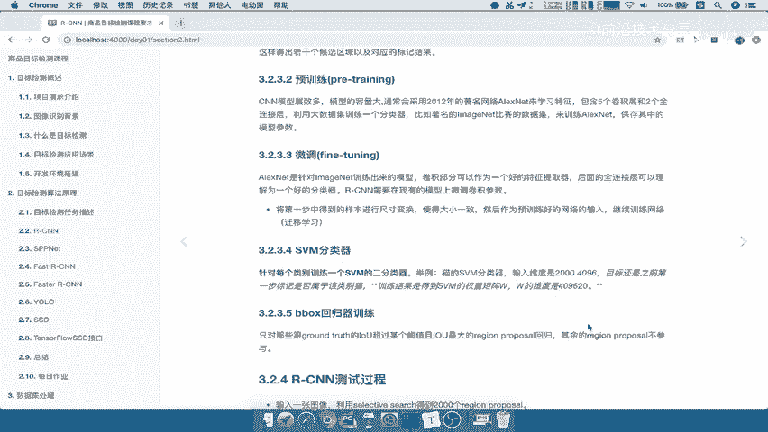

得到SVM的权重，就是4096×20好。

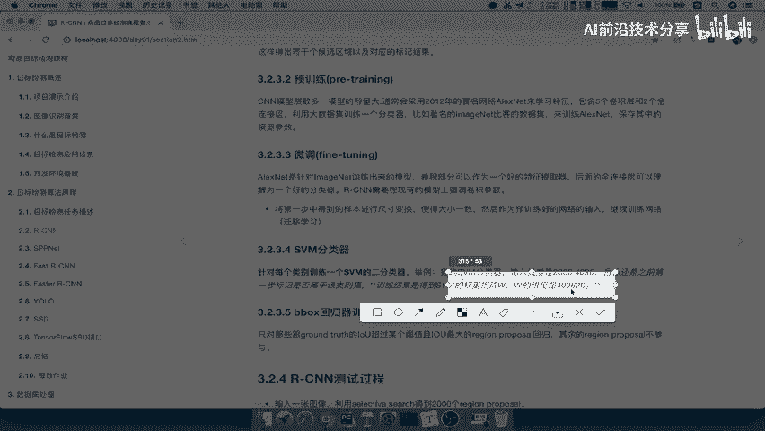

那么这个总共的啊，总共得到409620的SVM权重，为什么是4096×20啊，因为我们的特征假设是四呃，2000对吧，我们这里是特征2000×4096啊，或者说假设是N个吧，M个。

那么你呢每一个SVM都要训练出哎，四这个M个，所以呢你想想一个SVM就应该有多少啊，是不是要一直它要输出到20个，这样的一个类别吧，对不对，那所以就是4096乘以个啊，20好，那我们来看一下啊。

那这就是训练SVM的一个分类器啊，SVM的分类器，那么训练好之后，是是不是你就预测更加准确了吧，好那么接着在这个训练之后呢，我们还得训练b box，b box训练是最简单的，因为它的训练呢肯定是很少。

什么意思啊，它只对那些跟ground truth IO u值超过阈值，并且IO最大的region proposal回归，说明呢它会筛选出比如说1000多个这个候选框，我会筛出十个。

20个这样的一个region proposal，去进行一个回归回归训练，然后训练一个比较好的回归器啊，就是训练出一个回归的参数权重哎也是一样的，回归训练，回归训练它干嘛呢进行啊这一个筛选候选框。

这个过程呢就是只对跟ground truth，这就不是我们的这个样本标记了啊，不是我们的正负样本标记了，而是要去进行一个特定的筛选，重位移值，而且这个阈值非常大啊，你有可能0。70。80。9对吧好。

那么训练得到，回归的参数，好得到回馈参数，这个参数就可以拿来进行一个预测了，好那么这样的话我们训练过程啊，就是这样的几步，包括正负样本准备预训练，微调网络，重点是预训练和微调网络。

一定要清楚它们之间的区别是什么啊，预训练就是在一现有的模型对吧，就是有一个现有的模型参数，微调网络在这，现有的用我们现在标记好的样本去进行训练，再训练出CN的一个最终啊。

我们在训练cs v m在训练这个啊，我们的边框回归器好，训练好了，我们说了，是不是拿来预测参数都有了吧，CN的参数，SVM的参数，b box的参数都有了，接着你就可以预测了，预测测试过程就非常简单了。

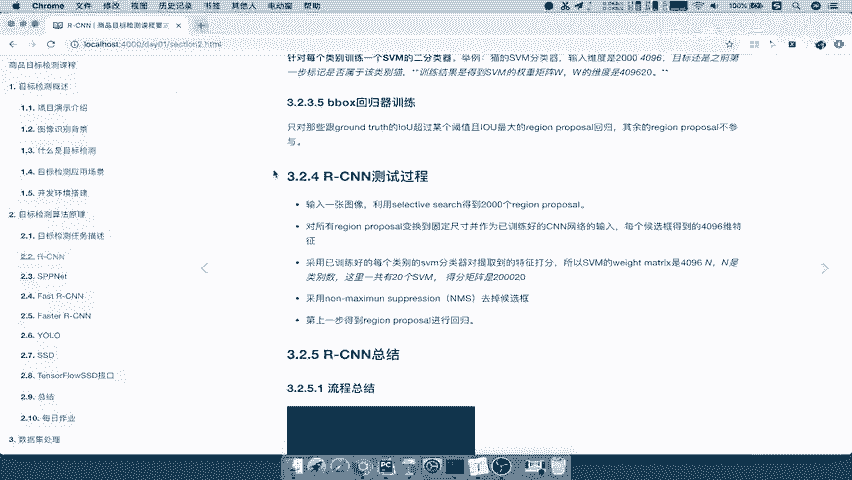

就是我们刚才啊在讲RCN的整个过程，输入图像得出2000个候选区域，对这里面的候选区域进行一个尺寸的调整，输入网络得出4096维度的特征吧，2000×4096，然后对这2000个特征进行打分。

得到200020的一个SVM的一个得分矩阵，最终用n ms注意训练过程不需要NM，然后进行回归，得到我们刚才的这个几个候选框之后，回归这几个混取关啊，预测混取关就是我们刚才所分析的那个步骤了。

好这就是RCN的测试过程。

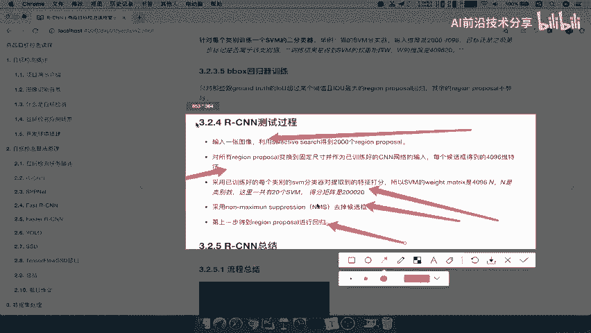

测试过程我们就不用说了啊，测试好，这里我们写一下RGCN的测试过程，它就是我们刚才前面讲解的这个，RCNN的步骤啊，同，好，这样的话呢，我们把RCNN的这样的一个训练过程啊。

一定要记住它是这样的一个训练。

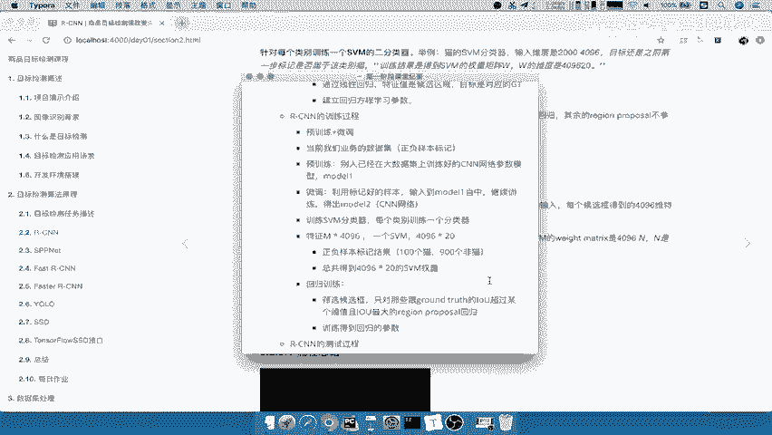