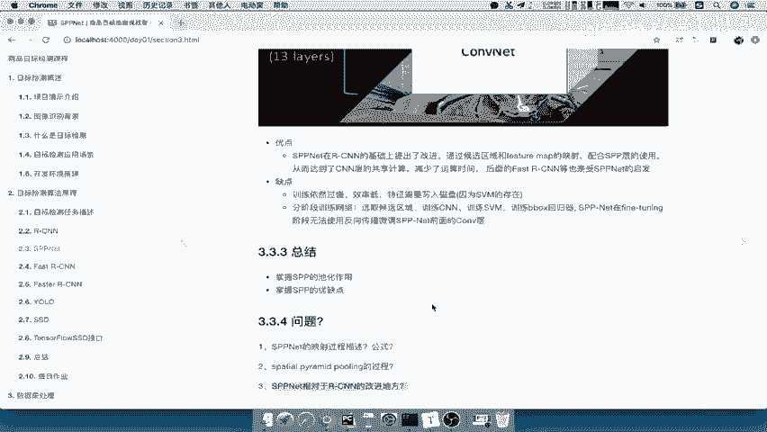

# 零基础入门！一口气学完YOLO、SSD、FasterRCNN、FastRCNN、SPPNet、RCNN等六大目标检测算法！—深度学习_神经网络_计算机视觉 - P19：19.04_SPPNet：总结、优缺点与问题自测19 - AI前沿技术分享 - BV1PUmbYSEHm

那么我们来总结一下s p p net啊，那么我们来看一下这个整个结构。

还是同样利用这个啊相似的一个图，首先我们一张图输入进去。

直接经过CN得出特征图，然后我们的SPP层，是要把我们的这个特征区域啊，获选区域映射到特征图上面，每一个特征图进行一个哎4×42乘二，1×1的一个类似，是不是候选区域啊，唉然后每一个或每一个候选区。

得到的这个固定的长度，也就是说这个地方呢哎类似一个金字塔啊，也是4×42乘2×1乘一，类似金字塔，每一个都要输入到全连接层，然后经过后面的s v MB box regression。

这个我们在RCN当中全部是详细讲过了，所以呢这个过程就能理解了好，那么所以这个SPV的完整结构就是改善了啊，这个第一个卷积运算少了，然后呢第二个就是我们的这个特征的长度。

不用再去把图像变形了吧，是不是啊，我们的s p p net。

RCN是不是要经过一个club加web，将图像进行一个变形啊。

得到统一的长度哎就不需要这部分好，那么我们来总结一下。

SPP的一个net的一个什么优缺点。

优点呢就是在RCN基础上改进了，通过一个映射，然后配合SPP的层的使用，是不是减少了计算时间，也避免了一些图片的变形变化，那么缺点嗯还是一样，SRCN当中哪些缺点他没有去改善的。

还是一样，有这些缺点能理解吧，这个也不用去详细说了啊。

缺点就是训练依然过慢啊，特征依然需要写入磁盘，然后呢分阶段训练还是要进行的，你分阶段训练基本上没有变，对不对，训练CN训练SVM训练b box啊，再翻turning还是一样，没办法去使用前面的CNN层。

你SVM跟CNN是不能结合一起使用的啊。

好那么这个就是我们的s p p net一个总结好。

那么最终呢，我们要掌握的就是磁化的一个作用啊，它的一个池化层的一个作用，以及它的一个优缺点好，那么最终还是一样的。

我们啊你自己呢去检测一下，你到底有没有掌握这个。

你拿这个问题，s p p net的映射过程描述公式公式是什么啊。

我是不是我们这个地方的一个公式，左上角右下角是不一样的啊，不一样的好，然后呢SPP层的这样的一个过程是什么样，就是四乘块四块22块11的一块SB站，相对于RCNN它的改进的地方在哪里好。

这就是我们的s p p net，是不是我们前面RCN讲了这个详细啊，你后面的这个算法呢理解起来啊就非常简单。

就不用那么痛苦了对吧，因为其他部分人都讲解过了。

你只要讲解它改善的这个地方是不是就可以了，对吧好。

