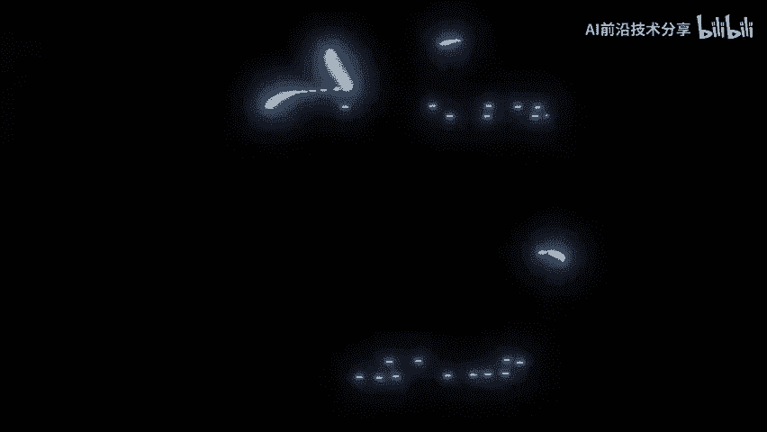
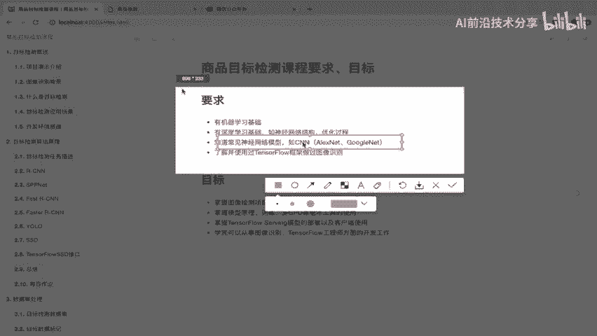
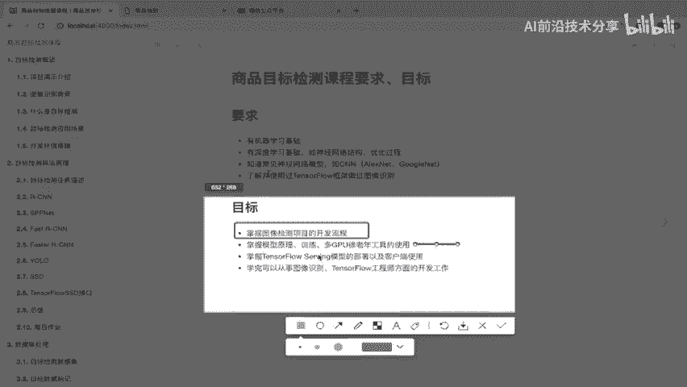

# 零基础入门！一口气学完YOLO、SSD、FasterRCNN、FastRCNN、SPPNet、RCNN等六大目标检测算法！—深度学习_神经网络_计算机视觉 - P1：1.目标检测课程要求 - AI前沿技术分享 - BV1PUmbYSEHm

目标检测的一个课程，那我们啊如果有同学了解过啊，知道呢，它是一个哎基于我们的这个现在比较火的，深度学习啊，机器学习以及人工智能相关技术去做的，一个生啊，或者计算机视觉方面的。

那么我们首先啊先在上这课课之前呢，我们先明确了要求以及我们的目标是什么，就学了这个课程，我提前先掌握哪些技术，以及我学了之后啊，能够去做一些什么，那么首先我们来看这个要求。

那么要求呢，第一个就是对这个机器学习基础有一定的了解，那比如说我提到的一些算法，比如说啊你角色树啊，随机森林啊啊，或者说你这一个相应的回归啊，回归的这样的线性回归算法，逻辑回归都得去有啊。

有一定的理解啊，包括你用过这些second learn的一个库啊，进行这个编写一些模型训练过好，那还除了这个机器学习相关的呢，还有这个深度学习相关基础啊，如神经网络啊，神经网络的结构。

你的这个常见的一些结构，它的优化过程，还有呢，第三点就是我们的神经网络的一些这个，基础模型啊，比如说分类的基础模型CN啊，这个卷积神经网络，这个是最最基础的一个分类模型。

那么相应的呢还有它的相应的一些架构啊，比如说alex net啊，google net这些都得有一定的了解，那么除了这几个比如说基础之外啊，我们这个算法基础，还有就是我们的框架啊。

TENSORFLOW这个框架必须得啊，你得去用过这个框架，它的框架的一些这个模块怎么去使用，你做过使用它，去做过一些图像识别的一些工作啊，你简单的一些图像识别都可以，那这就是我们的要求。

如果说你这个这些部分啊。

你没有这个达到这要求呢，你上这个课程呢可能会非常吃力啊，好那么接下来就是我们上完这个课程之后啊。

所要掌握的一个目标，那就是说那么这个目标呢，就是说我们可以去进行一个图像识别或者，图像检测的一个项目的一个开发流程啊，这个你就可以掌握了，那以及第二点模型的原理以及训练啊，怎么去建立一个模型。

怎么去训练，怎么使用我们的这个GPU啊，这里是GPU这个训练工具的一个使用，多GPU训练工具的使用，然后我们还能掌握模型怎么去线上去部署的，以及我们客户端怎么去跟这个模型的这样的，一个服务器进行交互。

那么学完之后我们可以从事的就有很多了啊，同TENSORFLOW的相关工程师对吧，你这个图像识别，图像检测，或者你的这个机器视觉相关的一些开发工作。

好，那这就是啊我们课程的一个要求和目标啊，这个一定要记清楚了啊，省得你在这上这个课之后呢，那你也没有掌握的，你也得回头再来看一下啊。

