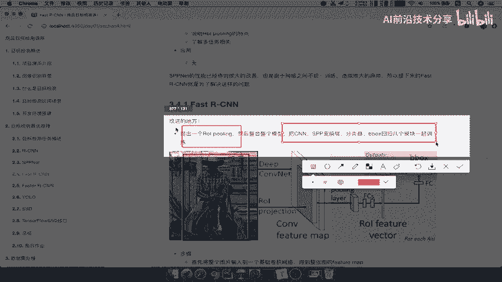

# 零基础入门！一口气学完YOLO、SSD、FasterRCNN、FastRCNN、SPPNet、RCNN等六大目标检测算法！—深度学习_神经网络_计算机视觉 - P20：20.01_FastRCNN：改进之处以及网络流程20 - AI前沿技术分享 - BV1PUmbYSEHm

好那么刚才我们把s p p net给讲完了，接下来我们要进入了另外一个这样的一个，变种的算法对吧，Fast s e n，那么我们这个地方的学习目标呢。

就是要了解啊我们的fast r cn的特点结构特点，然后呢知道啊他的改善在哪里啊，说明它的一些特点以及了解多任务损失好。

那我们现在来回想一下s pp net。

它的性能是不是已经得到了一些比较大的改善，是不是卷积不用在很多地方都进行计算了吧，好那么但是有一个特点，就是它的网络之间不统一训练，并且造成了很大的麻烦，而且你的磁盘的这个存储是不是要很大呀。

哎把特征给存储下来，所以接下来fast CNN呢，他就是为了解决这样的一个问题。

好所以呢它的出发点要知道，那首先我们第一点就是fast s e n，它的改进的地方有在哪里好。

我们来看一下它改进的地方，第一个就是提出了一个ROOI的polling层，然后整合了整个模型，把CN啊SP变换成分类器，b boss回归啊，回归归结到一起来做这样立一个训练，那这样的话。

是不是使我们的结构更加为一体了吧，啊，更加整整整紧凑一些啊。

好那我们来看一下fast z n呢，它的整个图以及它的整个步骤是什么样的呢，我们对照这个图先来简单说一下，首先一张图片呢，我们的候选区域还是要跟我们的这个卷积层啊。

卷积层得到feature map进行一个projection，就是映射啊，就是映射还是刚才那个步骤啊，还是跟svb net一样，只不过映射之后我们的这个特征啊，或者说对于每一个这样的一个感兴趣的区域。

注意啊，对于每一个感兴趣的区域，注意这两个词ROI一般就是region of interest啊，就是ROI区域，然后呢又提出一个IO polling啊，r i polling啊。

这个呢跟这两个是有区别的啊，加了一个POLIN是不一样的意思，这个是类似于SPP变换层的啊，那对于每一个候选区域，都要经过后续的这么多步骤，跟我们前面讲解的是不一样的。

它经过一个ROI polling好，经过FC全连接得出两个结果，经过我们的这样的一个vector对吧，相当于是得出了一个vector，然后经过我们的F1哎，看到他是不是有一个叫soft max。

还是不是SVM了，不是了，经过一个regression好，也不是了啊，regression啊还是一样的，就b box它的一个回归好，所以我们来看到这两个的这样的一个改善地方，以及它的步骤就在这里了。

将整个图片输入到卷积，得到feature map，还是要提取候选区域映射或选区域，然后经过一个oo polling，它的目的也是一样，得到固定长度的特征向量好。

最终我们将这个特征向量进行一个soft max分类啊，输出K个类别，加上背景类好，bounding box的regress好，这一部分呢我们直接啊把它粘贴过来。

我们来写一下s spp net的一个或者说啊S啊，或者fast fast啊，不是fast啊啊fast r cn它的一个这个改进有哪两点，提出ROI ping好，这个要区别于啊区区别区别于ROI好。

然后呢这个加哪个地方改进了SVM替换成了，什么呢，Soft max，soft max分类，好，那么所以它的步骤呢，就是我们刚才复制过来的这几个步骤，好，我们就在这个地方啊，就不要这样去写吧。

好那我们接下来就要去讲解这个ROIPOLLY，哎，它到底是怎么去做的，凭什么这个后面对吧，哎凭什么把把在这里翻成这个东西呢，然后呢又为什么要把这个东西改成soft max呢。

