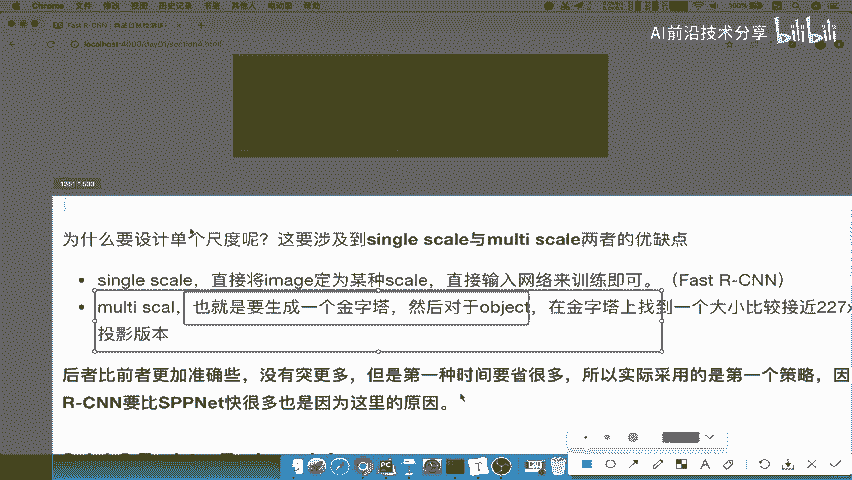

# 零基础入门！一口气学完YOLO、SSD、FasterRCNN、FastRCNN、SPPNet、RCNN等六大目标检测算法！—深度学习_神经网络_计算机视觉 - P21：21.02_FastRCNN：RoI pooling结构以及SPP对比21 - AI前沿技术分享 - BV1PUmbYSEHm

来看一下ROOIPOLLY，首先第一个，其实它就是一个简单版的SPP层啊，就前面提过了，他的目的为了减少计算时间，得出固定的长度向量，也就是说还是一样减少计算时间啊。

也是为了得出固定长长度的一个向量，好我们呢把这个提出来，ROI polling目的是什么呢，这个然后呢把这个ROI ping啊进行一个设置啊，它的目的，那然后再来说这个r y polling。

跟SPB层有什么区别呢，看到两张图你就能理解了。

SPP层我们分成442乘211的模块。

而ROI pulling啊，注意啊，这是ROI polling啊，POLLY呢它分成44的模块，当然这个大小不一定是4×4啊，大小不一定是4×4好。

那么也就是说原来是金字塔的这样的一个分块，对吧好，原来s pp是这种金字塔的金字塔，金字塔型的这个4×4，2×21乘一，那么我们的r i ping改成了什么，单个这样的一个啊。

变换单个是单个这样的一个块吧，好比如说4×4啊，我们可以记为呢一个K乘以M，注意啦，我们可以称称之为K乘以M，也就是说这个值不一定是固定4×4啊，我们可以改的好，那所以呢r i ping池化层啊。

它会就有效的去将这一个啊，ROI区域内特征转换成具有H乘以W，固定空间的一个特征的一个向量，好，注意了，就是将ROY之间感兴趣区域，通过这样的一个ping映射到固定长度的，那么HW就是它们的超参数啊。

可以独立于任何的这样的一个RI，比如说这个K乘以M是这个可选的一个参数好，那么我们来看啊，s pp得出的一共多少21，假设说21×256，或者21乘以其他的，那你这个地方有可能非常小。

那会造成呢什么一个案例。

一个结果呢啊或造成一个问题，换成一个问题，问题K和M过小，你的这一个全连接层要求输入比较大，什么意思呢，我们来理解啊，比方说我们的输入呢，这个最后一层就是7×7乘以512啊。

这个就跟前面五二百五十六是一样理解的，然后呢使用polling会调整啊，它的这个假如说这里面的HW，跟我们输入层的要求不一致，什么意思呢，来经过ping我们的ROI ping得出是不是77，512。

然后呢ROI的这个区域呢只有66的大小，也就是说啊这个地方ply啊，应该是这个全连接层要求的输入是7×7，但是你的大小是6×6的一个网格啊。

也就是说这个地方你变成了6×6啊，比如说6×6，你的这个地方呢6×6，但是FC要求77怎么办，7×7的输入要求。

那么怎么办呢，他会这样把每个网格呢会大小取整，6÷7=0。85，6÷7=0。85，什么意思呢，就是说我的比例就0。85，我按照这个比例将我们原来的图哎，给它划分成七个网格，00。5，然后再加0。5。

再加0。5，再加0。5，再加0。5，一直到我们的这个六的位置，会把它划分成七个，能理解什么意思吧，就强行将这里，这咳这里一共有啊一个两个三个了，好四个五个六个123456，原来是不是有六个六个6×6嘛。

现在我强行把它分成七份，那你每每一份的比例是不是要小一些了啊，所以呢就是说6÷7就是你每一份的比例了，能理解吧，好就是再加一个好比例就不一样了。

那么所以呢每个汽车网格就变成01234，567好，那么这就是啊我们的解决办法啊，解决办法就是分割啊，进行动态调整，H乘以啊，动态调整，动态动态调整，那么你的长宽就是6÷7，然后6÷7长，宽啊是67好。

那么这是整个过程啊，R one pulling，那现在知道它的过程就是只用单个的块，不用很多个金字塔的键对称的快吧好，那么下面的这张图呢，也是显示了这个坡顶层的一个过程啊。

我们在前面没有看到这个地方要重新刷新一下，我们来看一下这个层，假设你的候选区域是这么大，候选区域这么大，然后对于这四个地方啊，进行一个重新再看一下啊，这四个啊这个候选区域，然后分成了一个2×2的网格哎。

选出最大的，然后把这个地方这就是我们的输出，最终就是输出这样的一个啊，候选区域的这样的一个提取的特征的过程好，那我们这里问题就来了，为什么我们在这要取采取单个什么单个块，而不是多个这样的一个啊。

4×42乘二，1×1都给用，为什么呢，这里有一个解释。

就是说为什么设计单个尺度就是single scale，和multi scale两者的优缺点，single score就是直接将image变成一个score，直接输入网络来训练，非常简单啊，便捷。

MODESCOUT要产生一个金字塔，你可能对于特征提取啊，或者说这个提取的这个内容呢，会稍微啊要更加要细致一点，对不对，细致一些，但是呢算法总是要做一些权衡，什么意思呢。

后者比前面的准确性啊没有突出很多，所以呢但是时间要节省很多，你就在时间啊，速度和我们的精确度来进行一个平衡，那所以我们还是选择了single，他们还是选择了single skr。

因为因为这里准确度比它没有高多少，但是速度快了很多，那我们宁愿选择速度啊，能理解我这句话说的什么意思吧，好所以呢采取的就是第一个啊这个策略，所以呢我们的哎RCN啊。

或者说fast r cn它的这样的一个快速度快啊。

这个快很多好，那么所以我们这里啊有一个问题就是single score啊，就是相比s spp net的采取方式好，这就是问题了，涉及它的两点啊，优化，或者说我们总结就是速度与精度的一个权衡啊。

选择了单维度的啊，single scale好，SYNCL也就称作ROI啊，Polly，好那么这就是我们说的啊，这样你个过程S这个fast s e n的ROI，polling的整个过程啊。

也采取了单个块以及km过小的时候呢。

