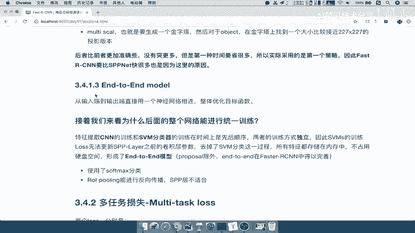
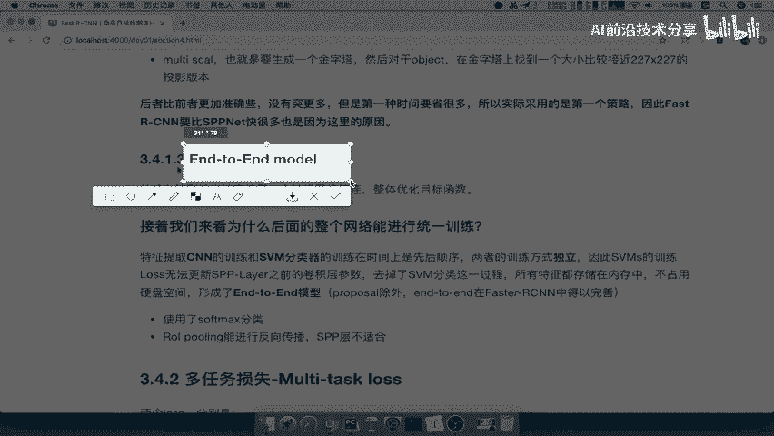
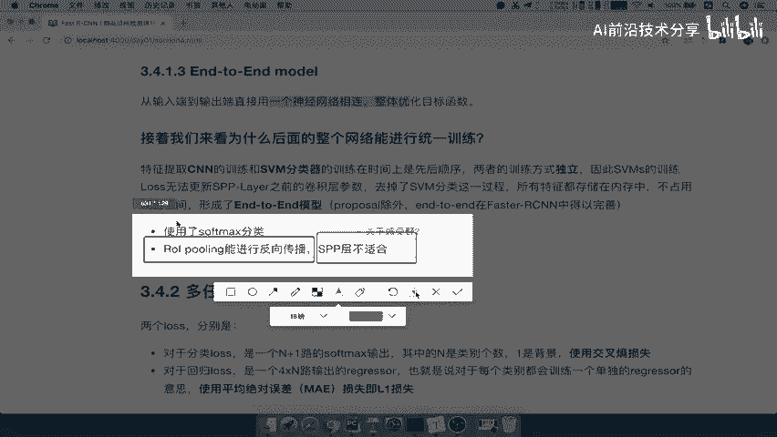
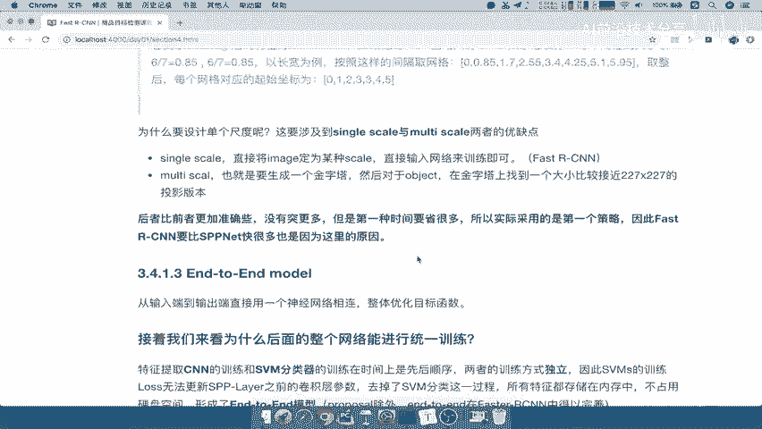
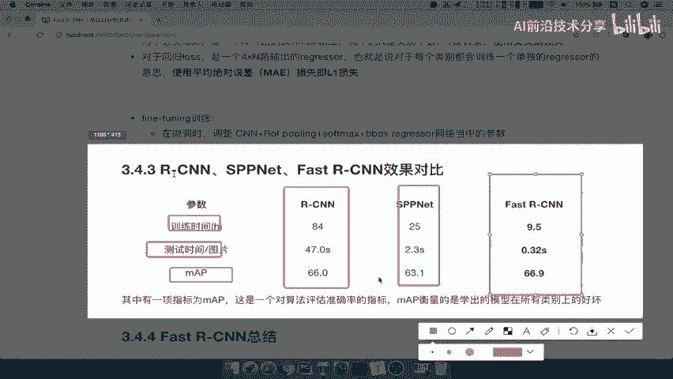
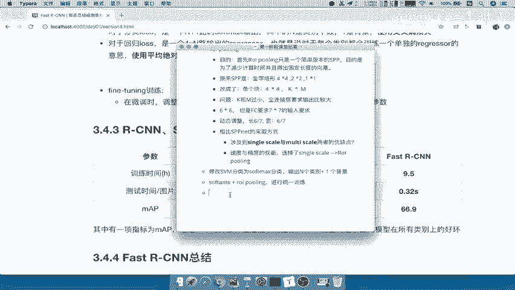

# 零基础入门！一口气学完YOLO、SSD、FasterRCNN、FastRCNN、SPPNet、RCNN等六大目标检测算法！—深度学习_神经网络_计算机视觉 - P22：22.03_FastRCNN：多任务损失22 - AI前沿技术分享 - BV1PUmbYSEHm

好我们继续啊，刚才呢我们已经讲完了这个ROI ping啊，它的整个过程，那么接着我们来看另外一个改善的地方，是在哪里啊，是不是把这个分类器SVM变成了soft mars，哎这也是它的一个改进之处。

那到底这个改进之处有什么好处呢，它会结合着另外一个哎，一起会来得到一个比较好的结果，什么意思呢，也就是说fast r cn，我们可以把它称之为一种叫做end to end model。

之前我们说在这个呃算法的一个分类的时候，我们说分一个两步走的，还有一个就是end to end，end to end呢我们是end to end，我们的是指的是这个啊，一个是YOO，一个SSD。

但是呢我们没把fast c，还有faster cr cn归过来，是因为呢它不算一个完整的end to end。

只不过说哎在这里啊，它也可以类似啊，称之为end to end好，那么什么意思呢，enter and model是指输入端到输出端，直接用一个网络相连，整体优化目标，也就是说。

我可以把这整个网络放在一起进行训练，不需要单独训练很多很多的模型，那fast sn是怎么去做的呢，我们来看一下。

先来看的啊，提取CN的训练和SVM的训练器，是必须得分开的啊，两个地方的这个训练是必须独立啊，你SVM的这个特征存储在我们的内存当中对吧，形成的这样的一个磁盘好，那么对于fast r cn来讲。

它使用了soft max分类，这是它的一个特点，Soft and mask，肯定是能够与网络进行一起训练的对吧，它只不过是加了一个函数而已，而r o r ping就能够进行反向传播。

而前面的s p p net，svb net里面SVP层就不太适合，关于这里啊，关于这里有一个详细的啊，你可以去了解一下，当然我们就不会去详细说，为什么进能进行反向筹包，那是在这个数学里面的一些啊。

相关的概念推导的过程，那所以这个地方你也可以自己去了解好，那我们把这个呢啊写一下啊，写一下，这里会有一个啊关于啊感受眼的东西，这个呢自己去了解，我们不去讲了，只要记住RIPY呢是能够进行反向传播的。

SPP层呢啊不太适合好，我们把这个呢保存一下。

关于ROIPOOLING啊，能够反向反向传播，好那么这样的话呢我们称之为fast的SEN呢，它是一个end to end的模型，那么所以他在训练的时候，我们要衡量损失其实又简单了。

soft mars衡量损失，regression衡量损失一直反向传播，从后面到前面啊，我们的反向传播从直接后面到前面，一直到我们的CCONV吧，到卷积层吧，哎这里也是就一直进行参数的更新。

那所以我们的损失就要知道是哪两部分。

很简单，对于分类lose，我们用一个N加一的SOFTMAX输出，也就是说最后一层的神经元啊，你的最后叶层啊神经元应该是有N加一个，这个N代表的是你的类别数，比如说20个类别，100个类别对吧。

总共100类别，总共20个类别，那加一一就是指的背景，20个加一个，为什么在这里加上背景呢，因为你的proposal proposal就是推荐的区域吧，region proposal吧。

region proposal推荐的区域有可能啊，它应该是会被标记为零，就是什么都没有，什么都没有，代表着，你这个类别就不是20个类别当中的一个吧，哎所以呢它会加一个类别，注意了，这个地方是一个细节啊。

必须得加一个类别，你最后输出是20一个类别，这个proposal输入进去，soft max属于比如说前20个还是最后一个，什么都不是能理解吧，因为区域可以什么都不是对吧，什么都不是，类别都不是啊。

好最后使用交叉熵损失，这个不用提了啊，交叉商损失，那对于回归的损失呢，我们也是一样的啊，对于回归来讲呢，他会去训练啊，每个类别会训练一个单独的regression啊，就相当于我对于这个猫的类别。

我训练一个regression，对于狗的类别训练一个regression去回归，使得猫狗的每一个对应的这样一个候选框，都能够预测准确啊，这个呢啊我们使用的这样的一个平均绝对误差，即L1损失啊。

平均绝对误差也之前呢这个在RCN当中，我们说了，他使用是均方误差对吧，在这个多fast r cn里面啊，它使用的是MA1啊，就是平均绝对误差，要知道这两个之间的区别啊。

好我们保存一下这个多任务损失，好那么这个多任务损失呢在这个呃翻tony的时候，也是微调的时候呢，也就是通过CN加OOPOLIN，加soft mars加b box regression。

可以一起进行训练了，除了哪一个region proposal，就是说除了我们的候选区域的一个筛选过程，就是通过SS方法筛选的好，那么这就是我们的这个fast s e n，它的一个多任务的损失。

那么fast i cn他改进了这些，在s p p net之后又改进了一些，那它们之间三个算法的对比。

我们来看一下训练时间，测试的时间和我们的精确度啊，这是对一个算法的精确度的评估，我们看下RCN训练时间八十四秒，s p p net训练时间25秒啊，25小时啊，25小时，注意啦。

fast r cn它只需要9。5小时，注意啦，这个应该是在我们的，还是在work2007的上面的一个数据啊，然后测试时间你说一张图片输入进去，然后一直到什么筛选啊，NM啊，然后直接到这个输出结果。

这个RCN用了47秒，一张图片进去47秒，而s p p net用了2。3秒，而我们的fast r cn用了多少秒，0。32秒，这个时间基本上用户就不会去感觉啊，这个时间等待时间，你我输入一个图片。

你给我推荐的目标检测结果哎，不会那么显得时间长了，而我们的准确度也有了大大的提高对吧，当然这个提高呢，相对于RCN呢没什么太大提高啊，但总体来讲，他们三个的这个准确度呢都不是很高啊，66分九六十三。

一六十六。0啊，其中sb net呢这个结果最差好，这就是我们说了这个啊，fast sn以及它的这个soft max的一个改进啊，他的多任务损失。

还有它的一个对比好，那么所以呢，就是修改修改SVM分类为这个SOFTMAX分类输出，一定要注意的是N个类别再加一个背景，因为你的proposal有可能什么都不是，必须得去进行分类好。

那么所以呢他们就可以soft max，加上我们的啊R这个ROI pulling啊，就可以进行统一训练啊，反向传播了，那么还有它与其他的这个算法的一个对比，我们就不说了啊，这就是啊roy polling。

