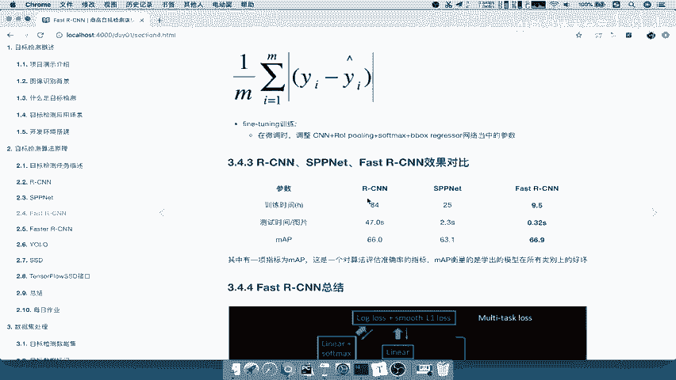
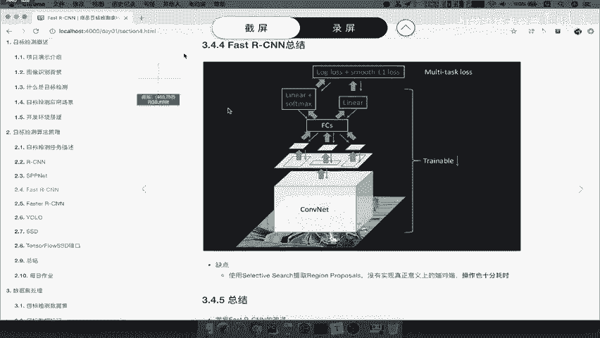
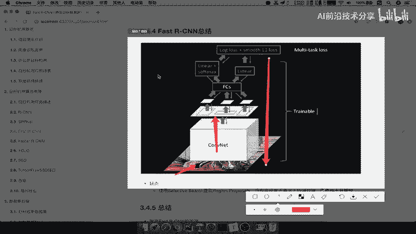
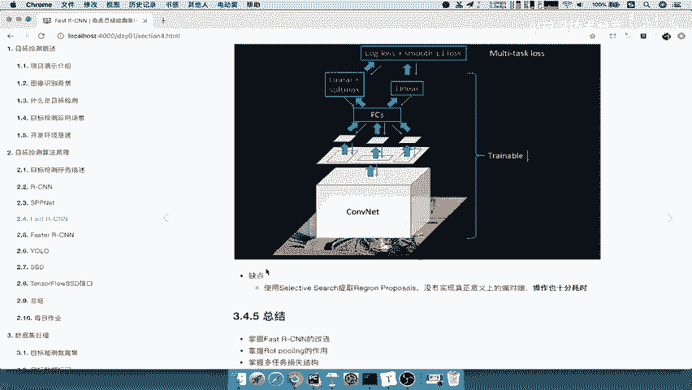
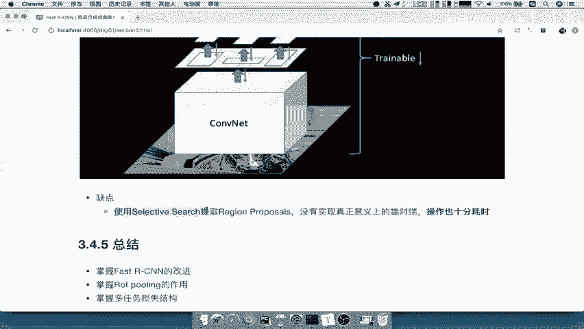
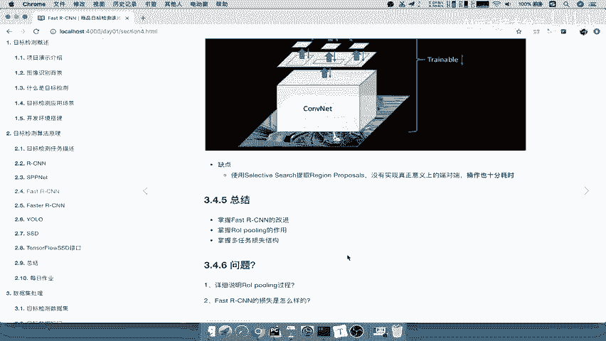

# 零基础入门！一口气学完YOLO、SSD、FasterRCNN、FastRCNN、SPPNet、RCNN等六大目标检测算法！—深度学习_神经网络_计算机视觉 - P23：23.04_FastRCNN：总结与问题自测23 - AI前沿技术分享 - BV1PUmbYSEHm

我们来总结一下fast r cn，那么还是同样用这一张图来看。

开始还是一样，图片输入到卷积得到特征图，我们的候选区域映射到特征图上面，然后用S这个ROIPOLLY啊进行，只得到一个这样的一个向量对吧，输入到FC层，就是全连接层。

最终LIN加j soft max对吧，哎你的这个线性回归啊，得到这两个损失，共同两个损失返回来进行一个训练更新，这个网络当中的所有参数，除了我们的区域推荐之外能理解吧，好那这就是它的一个总结。

那所以我们最后来看一下它的缺点，缺点就只有啊。

大部分呢目前来讲是只有一个了，就是使用selective search提取我们的region proposal，这个里面还是没有实现真正意义上的端到答案，大可以称理解成端到端了。

但是呢他这个地方还有一个部分没有加进来啊，所以操作也比较耗时，所以呢改进就很明显了，我们接下来的算法肯定就要是改进这个selective search，这样的一个算法。

把它变为我们整个网络的一个整体就OK了。

好那所以对于此部分啊，fast s e n来讲，我们要去这个总结的，就是fast sn的一个改进之处啊，第一点你的ROI ping，第二点呢soft max啊，可以进行一个多任务损失了。

那么掌握IO ping的一个作用啊，它的作用主要是能够进行反向传播吧，然后以及我们的这个ping层的这样的一个，km的参数啊，其实啊它的一个大小是可以调整的，然后以及多任务损失。

一个是soft master的交叉商损失，还有那样一个通过这个平均误差对吧，平均绝对误差进行损折，刚才这里没有显示出来啊，在这个地方N分之一啊，就是相当于是你的每一个啊。

每一个的坐标的相差的绝对值除以的总和，除以一个平均有多少个这样的一个区域好，那么这个问题呢就是啊还是一样的，对于这个fast dn，我们要就是哪些问题，你自己对了，你能不能回答出来。

说明ao poling的过程，以及他的一个损失是什么样的啊，这个相信大家应该都能回答出来。

好那么这个fast p n啊。