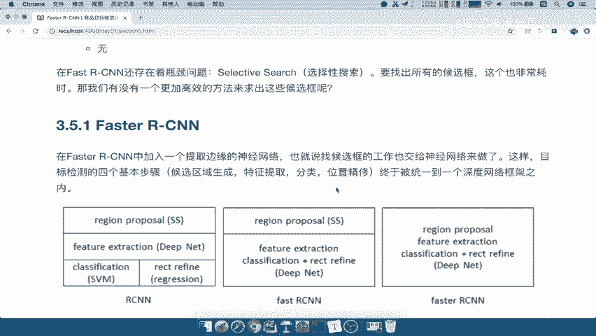
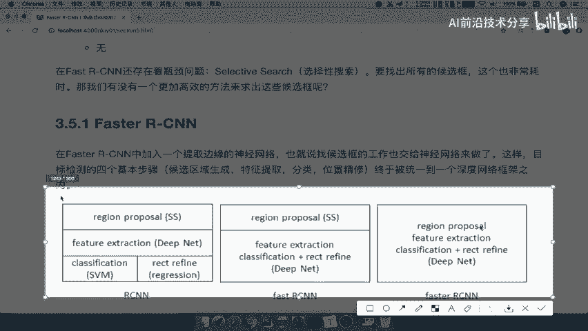
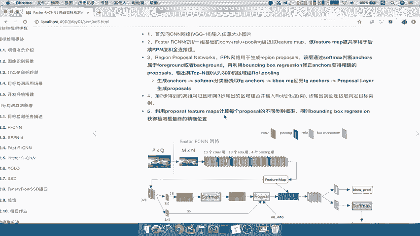

# 零基础入门！一口气学完YOLO、SSD、FasterRCNN、FastRCNN、SPPNet、RCNN等六大目标检测算法！—深度学习_神经网络_计算机视觉 - P24：24.01_FasterRCNN：网络结构与步骤24 - AI前沿技术分享 - BV1PUmbYSEHm

好那么接下来我们就要看faster r cn了，那么这个跟之前我们讲的fast r cn啊，它们之间有什么样的一个联系，或者说它的改进之处啊是在哪里。

那我们刚才说了fast r cn的它的一个缺点是什么，是不是由于我们使用的SS搜索吧，选择性搜索导致我们这个过程也非常缓慢，而且搜索的这个非候选框呢耗时好，那所以faster r cn。

那它的改进之处肯定就是要去除这个吧，好所以我们来看一下，这里有一张图，这张图呢就记录了RCN到fast r cn，和到faster r cn的这样的一个整个过程的变化。

看一下一开始RCN啊，它里的region proposal里面包括feature extraction，还有SVM是不是都分开了，后来fast r c e n。

是不是把region proposal单独拿开，然后后面变成一个整体了吧，哎提供RY以及你的这个soft max，那么faster r cn呢，哎它的改进就是，把这所有的一部分都合并成一个网络好。

那么这个过程是怎么做的呢，它相当于呢把这个region proposal。

作为自己网络的一部分了，那他怎么做的呢，来看到这里，有一个对faster r cn的一个简介，fast r cn呢我们可以看成啊，是一个叫区域生成网络，加fast r cn的网络的一个模型好。

所以这个地方我们直接先来写一下，我们接着就是fast r cn cn它的这个选择性搜索，选择性搜索这个速度慢，那所以改进就是faster r CNN啊，它的这个地方呢就是可以看成一个候选，区域生成网络。

就是区域生成网络加fast r cn后，区域区域生成网络加后续加这个fast，AST啊，RCN网络由这两个东西组成的，那么fast r cn我们不说了吧对吧，这个刚才已经说明它的整个结构好。

那所以重点就在于这个区域生成网络，也叫做RPN啊，RPN讲到这里，region proposal network啊去生成网络，我们简单来看一下，它这个结构呢跟我们的fast r cn。

其实看起来在这里看是没有什么太大区别的，比如说image到CN啊，到feature map，feature map直接到这里，一个feature map，又到这边到proposal这边对吧。

哎那也就是说原来的proposal由选择性搜索得，现在由我们整个网络得了，这边就是region proposal network，那我们先来看一下，这faster r cn的整个流程是什么样的。

那么这个流程呢，我们会对照着这一张清楚的图来看好，我们把它放小一点啊。

好，首先我们来对照这一张图，第一步，整张图片向V基金啊，就像这个CN当中输入一个任意大的小的图片，图片大小不定啊，你不用再去之前输入也是不定的，因为有RY存在嘛，好那么输入进去经过我们的CNN网络。

13个卷积，13个RU4个POLIN，好，得出我们的注意，Feature map，这是我们的第一步，第二步呢，接下来呢我们就要使用这个feature map被共享，用于后面的RPN层，我们说了。

region proposal network和我们的这个全连接层，或者说其他的ROI层，那么这应该是ROI啊，RPN和RY，那么我们来看左边这个地方的分支啊，左边这个地方分支，我们把它框出来。

这一部分就是feature map进入到我们的RPN当中，RPN用于干嘛呢，它的目的是用于生成region proposal，也就是说原来用SS选择器搜索生成的区域推荐。

用我们用这个RPN网络就能够推荐出来了，那么这个过程详细的啊，怎么去得来的，我们等下再说，那么这是第一分叉了啊，分叉了feature map，那么feature map被共享还要用一一个地方。

就是第二步得到的高维特征图，和第三步输出的区域推荐，也就这个地方得出的是特征图，这个地方呢proposal得出的就是RPN，得出的就是区域推荐，propose直接得出区域推荐好特征图。

跟区域推荐进行一个唉合并啊，或者映射啊，那么这个过程就是fast的SEN了吧，啊fast r cn呢，那么接着往后就一样了，结果经过一个ROI pulling啊，然后呢。

形成一个固定大小的这样的一个特征向量，每一个这个候选区域都是这样，然后经过b box的这样的一个soft max，还有我们的这个啊b box regression好。

这就是我们的整个流程了，所以我们把这呢保存一下，faster r cn流程介绍，我们在这地方啊，就简单的总结一下，这中间又涉及了很多，我们就先不说啊，那我们来总结一下它的步骤，第一我们直接放进里面啊。

第一输入啊任意大小图片，这张图片输入进去之后，我们要经过经过我们的CN网络，输出特征图，那么第二个就是输出这个特征图，特征图走向分成两部分，后面两步，好我们把这个呢放到这里。

那第二就是我们的特征图经过什么呢，RPN虚拟生成，网络生成，候选区域为什么能得到候选区，因为你训练过了啊，所以我们这一直讲的都是一个啊，这样的一个结果流程啊，得到候选区域。

然后第三步就是候选区域与我们的特征图好，共同输入到啊我们的ROI p point in好，得到每个候选区域的特征图，然后进行我们的soft max分类啊分类，然后呢b box的一个预测好。

这就相当于是啊我们的整个步骤啊，所以我们只要关注哪一个是不是RPN就够了，RPN是怎么去做的，怎么去生成候选区的，行了吧，后面的这个内容是不是我们都讲过了，他这一个就进行分类一个预测啊。

他们训练好的分类器，训练好的预测这样的一个回归器，OK啦好，那么所以我们接下来重点就在于，RPN网络到底是怎么，生成，候选区域的好。

