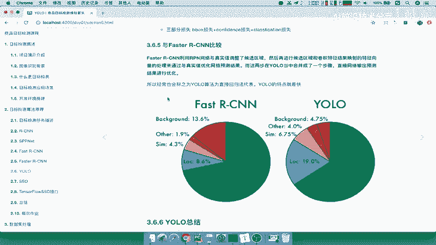
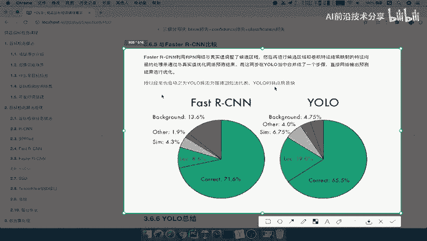

# 零基础入门！一口气学完YOLO、SSD、FasterRCNN、FastRCNN、SPPNet、RCNN等六大目标检测算法！—深度学习_神经网络_计算机视觉 - P30：30.04_YOLO：总结30 - AI前沿技术分享 - BV1PUmbYSEHm

好那么我们接下来呢就要去比较一下啊，yo跟faster r cn的之间的一个啊进一个区别，那么这里有一张图啊，那么这张图里面呢就标记着啊我们的fast r cn啊。

当然不是faster了，fast r cn和YL之间它的一个准确度啊，以及我们的这样的一个其他的啊背景，比如说它对于同样的一个数据集，它的这样一个准确度，你的这个定位的这样的一个偏移，还有其他的背景啊。

你你的结果是什么，那么从这张图我们可以看到准确呢，YOO是没有fast r cn的，所以呢我们的优乐呢只有一个特点，就是速度快啊，它只保证了速度快，但没有去保证这个准确率呢，能够达到一个比较好的效果。

相对于faster r cn呢还会有一定的啊误差啊，他的结果还会差一些好。

那所以最后呢我们把优乐呢会进行总结一下啊，那么它的优点速度快啊。

速度快，准确率，缺点就是准确率会打折扣啊，那么yo对于相互靠近的物体呢，对这个挨在一起中间的一些什么意思呢，很多物体会落在同一个格子上，那你说两个物体它本身是两个格子吧。

但是你只对一个格子进行了一个标记为框，还有很小群体检测的效果就不好了，能理解吧，哎你小的这些这些格子肯定就检测效果，不是非常理想了。

这就是它的一个总结好，那么我们这个优乐的这样的一个网络结构，以及输出结果77乘30的一个E要理解啊，这里就比较啊稍微简单一些好。

