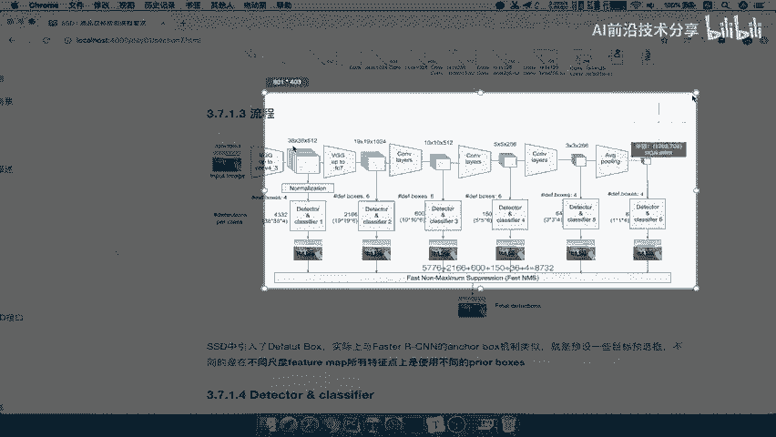

# 零基础入门！一口气学完YOLO、SSD、FasterRCNN、FastRCNN、SPPNet、RCNN等六大目标检测算法！—深度学习_神经网络_计算机视觉 - P32：32.02_SSD：localization与confidence32 - AI前沿技术分享 - BV1PUmbYSEHm

default boxes得出来大小之后啊，得出的每一个候选框之后呢，Anchor，那么接下来怎么办，我们想fast r cn当中他的default boss是干嘛，是用我们的标记结果跟它进行一个什么。

进行一个修正，进行一个这个背景，还是这个物体的一个概率预测啊，进行一个标记，那么我们的yo当中呢就直接得出这个结果，进行一个回归就OK了吧，进行一个损失计算好，那么我们这个地方是怎么去做呢。

你既然得出了这75个候选框，那么我就需要两个东西叫localization和confidence，来在网络预测的时候，来代表每一个候选框的结果是怎么样的，那我们来看到这里。

我们刚才得到了localization是什么，5×5乘12的，就是5×5乘二百二十五十六。

得到5×5乘以12，为什么是五乘以乘5×12呢，也就来看一下，在这里它可以把它分为三个部分，5×5乘以四，5×5乘以四，5×5乘以四加起来是不是5×5乘以12，是不是相当于把这几个重在一起啊。

那么为什么是四，因为每一个像素点，我们来看每一个像素点哎，它有四个位置的值，我们就代表这里的一个来看到这一个地方，像素点的四个值就代表它的位置值，并且这个点你想想有多少个候选框，是不是三个候选框。

也就是说这几个候选官，或者啊代表着这一个候选框，一个候选框，一个候选官，一个候选框，5×5，25个，四个位置的值，25个，40位置值，25个，四个位置的值，来看看一共有多少个空间宽了。

你是不是有75个候选框的，每个四啊的四个位置值，通过什么5×5乘四来表示的话，能不能能不能理解啊，是不是，这里是四个，这里四个，这里四个，这里四个，每一个像素点都有四个吧，这里也每个像素点四个。

这也没有三素点好，这就是得出了四个值，这是我们的localization，就网络直接输出的这些值的好。

Localize alization，那我们输出的这个值呢是要去拿去一样的，跟我们的这个yo一样，拿去进行回归，哎那几个损失还记得吧，那还有一个就是confidence。

我们每一个候选框都会有confidence的，那我们来看一下这里5×5乘21，就是说每一个候选框，注意啊，每个候选框都会给它对应一个20一个啊，20一个，每个候选框候选框对应20一个概率值。

那么所以这里有这里有25个21，二十五二十一二十五，21是不是一共75个啊，哎七一共75×21，那么也可以把它理解啊，这也是五乘以，这也是我们前面经过卷积得到的结果，5×5乘以63。

我们可以理解成是什么，21乘以把它把它拆开了，他是把这个图给拆开了，拆开了这个三个部分啊，其实合在一起就是这样的好，那么其中就会得到每一个候选框的，每个类别的概率，那么这样的话就相当于是得到了位置。

得到的概率，接下来你去进行什么，进行NMS是不是就OK啦。

好得到confidence，得到是吧，get我们的confidence吧，CONDNCE好，得到的一个每一个候选框的四个位置，每一个候选框的20一个概率值，那么是不是就可以进行置信度的一个过滤。

其实就是概率的一个过滤，然后再经过NMS进行一个非最大抑制，进行过滤，所以我们可以看到他呢跟我们的yo，唯一不同的地方就是候选框是我们自己去，也是自己去生成的，只不过利用了网络生成的两个这样的一个。

定位和置信度好，那么所以我们在这里呢我们总结一下，四个位置偏移啊偏移，还有我们的三个这样的一个置啊，置信度啊，那这里呢我们就是一共75个会选关，乘以四个位置偏移，我们相当于是啊，在这个地方也等于70。

得五个获选关乘以20一个位置偏移，可以理解成5×5乘63，这样大小好，那么我们想一想，yo当中的这些东西是要拿去干什么的呀，他这是训练之后我们才得出这些结果，然后拿过MNMS去进行一个啊得出结果了。

那其中呢对于我们这个网络当中，会出现了很多中当中的一些，什么叫pre box啊，什么叫default boxes啊，那么我们来看经过这一波过滤操作之后，就过滤置信度，就是过滤这个概率比较小的这些候选框。

那么我们称之为prairie prairie boxes，第一个ground truth boxes，都好说，就是你物这个图片当中啊，真正的包含的哪一个物体的一个物体框。

default boxes是我们的计算生成的，类似于fast r cn计算生成的这样的一个四个点，每个点四个，或者说每个点六个的b box是事先指定，而筛选过置信度之后，剩下的可能性高的b box呢。

我们是拿去真正作为回归，作为刚才我们在yo当中的这样一个，训练过程的，就是prairie prairie boxes，所以啊一定要清楚default boxes和prairie boxes。

它们之间的一个啊区别，就是在这里筛选出来的才叫prairecord box好，这一点呢就是prairie啊，boxes和我们的这个default LT boxes好，那么所以呢我们可以想象到。

SSD当中提供了这样的一个候选框，加我们预测的概率，预测的位置得直接进行回归训练，就可以得到我们的这样的一个结果了，好这就是我们的SSD当中的detect classify。

这也是我们的这样的一个SSD，网络当中的一个重点，那我们现在就要来想一下SSD当中，它有多个detector classify到底有什么用，我们想fast r cn的候选框是不是只有一个部分。

它只有在最后的输出结果，来得出每个像素的候选框，而我们是什么。

通过每一个候选框，看一下每一个特征图都会得出候选框。

哎，这个地方呢，就是意味着它避免了优路当中的一个特点，什么呢，你的这个候选框呢得出来一个之后，你的标记的时候只有一个点啊。

只有一个点，那这个地方呢，我们每一个特征图都会得出候选框，那么这样的话会考虑的比较细，大物体小物体都会包含进去，哎你的这个结果呢预测的会选框越多，而且你的计算结果呢也会更准确一些。

这就是我们的SSED当中的多个，detected的CLASSIFI，容易观察到SSE当中的这些更小的物体，也就是它每一个特征图的一个结果好。

