# 零基础入门！一口气学完YOLO、SSD、FasterRCNN、FastRCNN、SPPNet、RCNN等六大目标检测算法！—深度学习_神经网络_计算机视觉 - P33：33.03_SSD：训练与测试流程总结33 - AI前沿技术分享 - BV1PUmbYSEHm

好，那么我们来说一下SSD的网络，这样的一个训练流程与测试流程，那么训练流程呢和测试流程之前已经介绍过了，那么这里其实也是一样的，主要是一个样本的标记，因为你要训练就要拿你的候选框。

你的这个标记的结果之间进行一个训练，对比训练对吧，那么训练流程呢就是输入到输出。

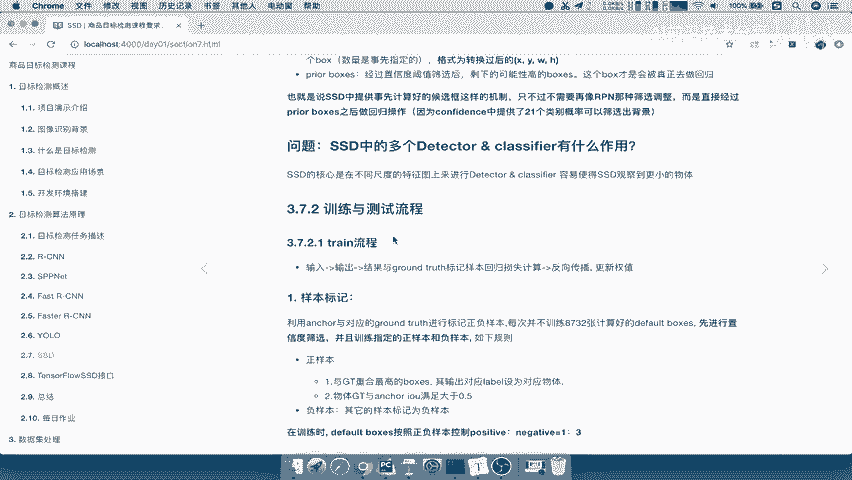

那么结果我们要去与grand truth进行一个标记，样本的关choose标记的一个样本进行回归。

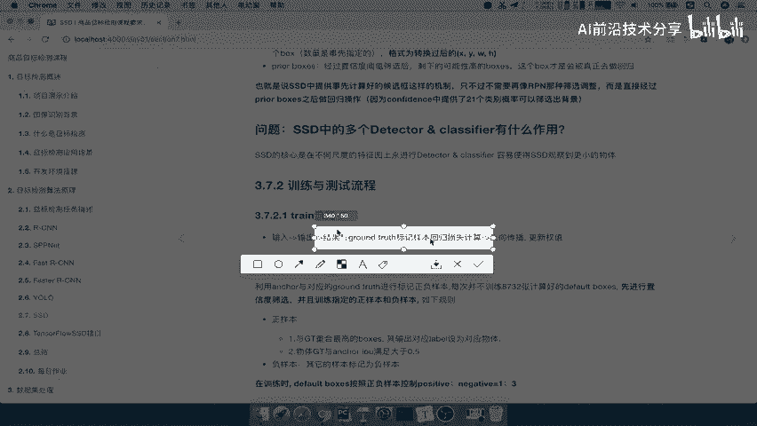

进行损失计算啊，这也就是我们优路当中右边对吧，在我们YU当中右边每一个预测结果对吧。

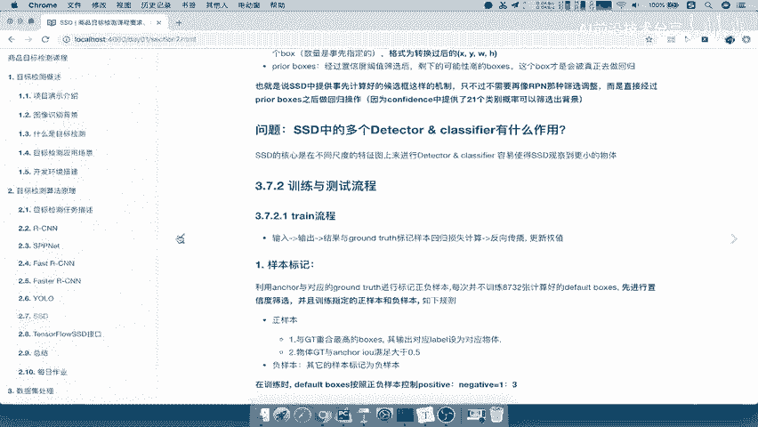

你每个网格的预测结果，都要对应的一个gt标记啊，它是啊原来是什么样的。

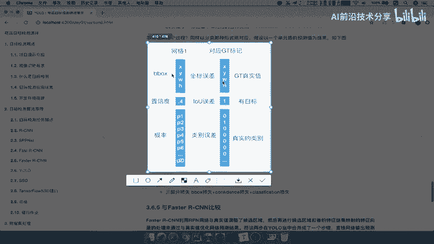

就是什么样的对吧一零，那所以SSD也是一样的。

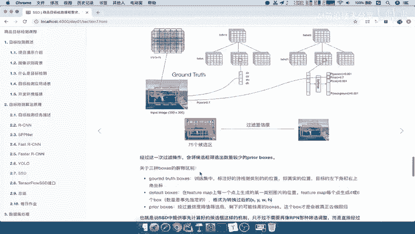

只不过呢我们标记的样本框呢可能就很多，比如说这里有8732个，假如说87328732，进行一个置信度筛选之后呢，变成了3000个候选啊，3000个pre prae box好。

这3000个我们要对应标记啊，标记3000个，3000个，对应啊这个gt的结果能理解吧，哎每一个这个样本框呢，都要进行一个对应的标记，然后两两进行一个损值计算，那所以呢这个样本标记呢。

这里面的这个啊我们可以看一下，在与gt重合度高的box啊，这里面有一些与gt重合包高的一些box，意思还有大于IOU大于0。5的，我们把它标记成正样本，其他的都标记负样本。

并且保证正负样本的比例为一比三。

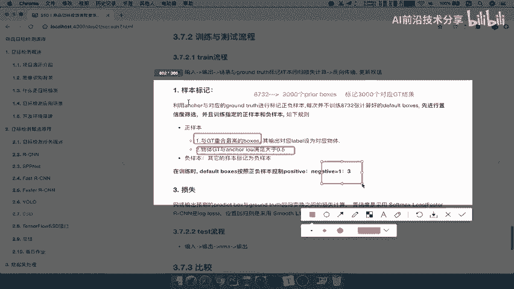

这个一比三也是一个经验，结果好，那这个是正负样本标记SSD啊，样本标记，那么他的损失呢还是一样的，跟YL一样，就是我们的predf box里面的一些啊。

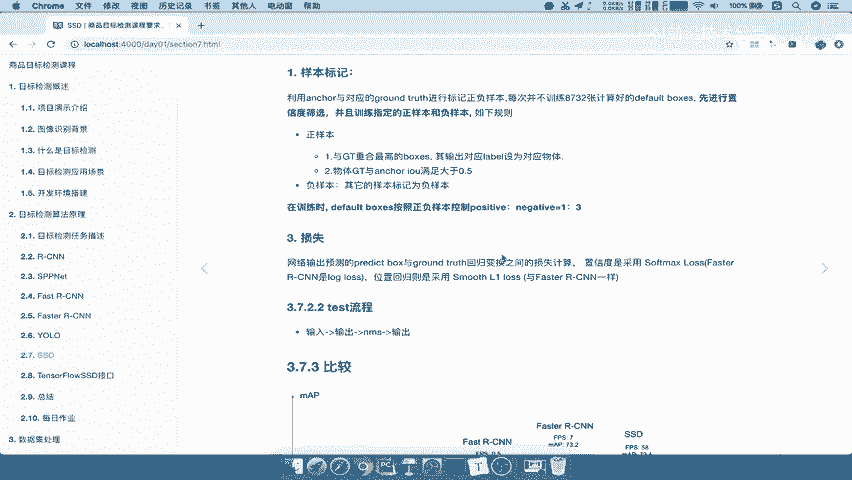

比如说log lose，就是说我们的soft max lose。

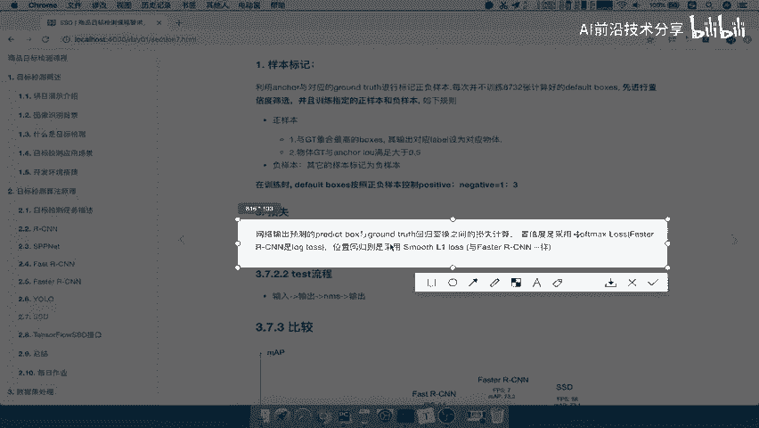

是不是我们的localization，在这个地方应该是confidence它的一个损失吧，每一个b box的损失吧，还有LOGALIZATION的损失是不是这两个哎。

所以采用的都是这种与fast r cn当中的一些回归，它的误差损失都是一样的好，那么测试流程就非常简单，你的模型训练好了之后，参数都有啦，那你输入输出输出已经提供了那么多的候选框，进行NM。

然后输出NM提供了哪些类别的预测结果吧，预测的一些结果好，那么这就是SSD的一个训练过程，那么我们来再来看一下刚才那张图。

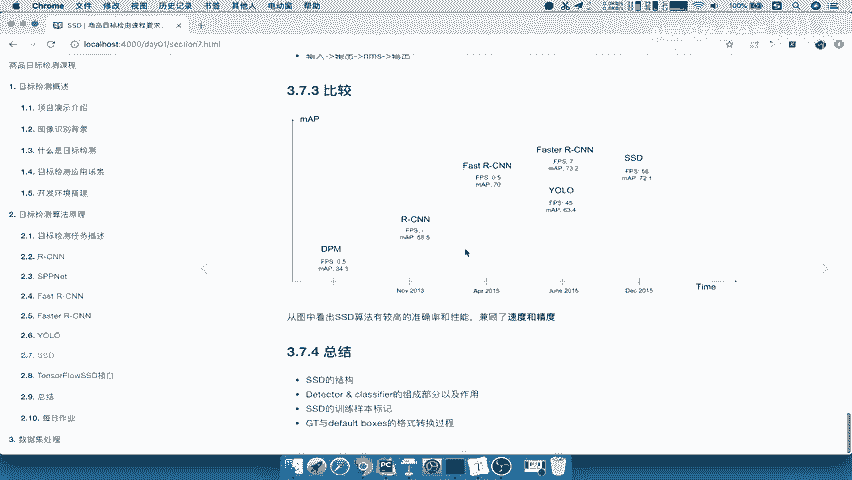

我们看到SSD是处于到什么一个位置呢，他是不是处于最右边，它的准确率呢是比较高的，看到准确率比较高的速度也是非常非常快的啊，在这种的程度上面，所以我们一般得出来SSD算法呢。

会得到了较高的准确率性和性能啊。

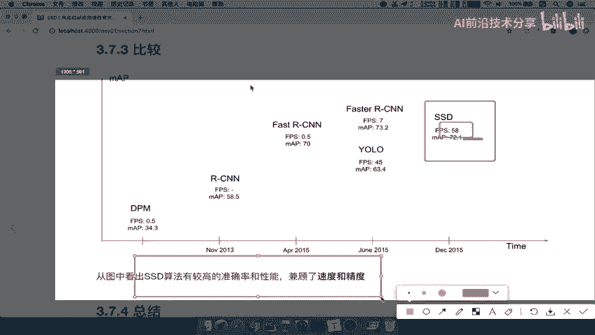

它兼顾了速度以及精度，好好那么这样的话呢，我们也把SSD的整个过程给讲完了，那么其中最重要的就是它也是一个网络，这个网络呢会输出候选框，候选框对应的位置，候选框对应的执行度，然后标记样板进行训练。

就OK了啊，不需要那么很多麻烦的事情啊，好那么这个地方呢我们的这个写一下它的总结，就是兼顾了速度啊，速度与，进度，那么最终我们总结一下SSD的单纯的结构啊，我们SSD的结构我们知道了啊。

每一个特征图的大小，都会对应不同的detect classify，然后我们重点就是detect classify，里面的组成部分有什么候选框的生成，以及confidence的一个结果。

这个预测结果以及我们的localization的四个位置，就每一个候选框都会有这些SSD的样本标记啊，也是一样的，就是对于每个b box进行一个标记训练，那么gt与d box的这样的一个转换格式。

转换过程就是相当于你怎么去把gt啊，并成一个我们的候选框当中的这些，比如说默认有没有这样的一个，看到这里有没有这样的一个正样本，有没有这样的一个负样本，哎你要去合适的按照这些公式呢去计算啊。

这样一个变化过程好。

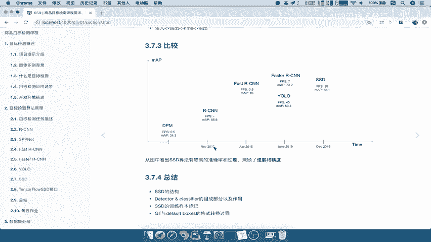