# 零基础入门！一口气学完YOLO、SSD、FasterRCNN、FastRCNN、SPPNet、RCNN等六大目标检测算法！—深度学习_神经网络_计算机视觉 - P36：36.01_目标检测数据集介绍36 - AI前沿技术分享 - BV1PUmbYSEHm

那么接下来我们就进入到这个，第二阶段的一个学习，那么第二阶段呢，我们主要做的是数据集的一个处理，那么在这个过程当中呢。

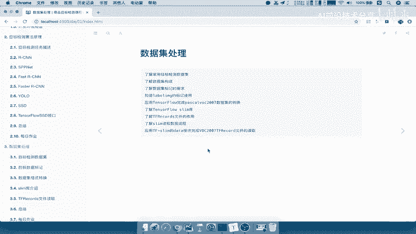

我们要做的就是啊，前面这部分，了解一些常见的数据集以及数据集格式啊，标记需求，你要自己动动手去标记，然后呢，我们要应用TENSORFLOW，去完成数据格式的一些转换啊，包括your slam库啊。

哎包括我们要实现用slam库进行一个啊，数据集的一个读取，这个啊，我们这个过程呢，就要有一些动手写代码的过程了。

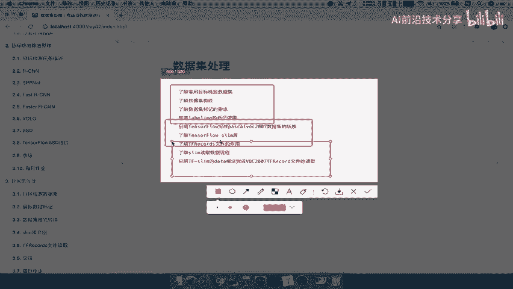

好那么首先我们第一个来看啊，在这一部分当中，我们先来看目标检测的数据集，那目标检测数据集呢，我们学习目标就是了解一些常用的数据集，就OK了对吧，了解数据集的结构，那么常用的数据集呢。

我们这里来看到有一个叫做帕斯卡啊，Visual object classes homepage，那么这个呢就是我们之前在讲算法的时候，经常提到的一个什么呀，work啊，Work2007。

Work2012，那所以我们通常所使用的数据集呢，都是啊这个数据集。

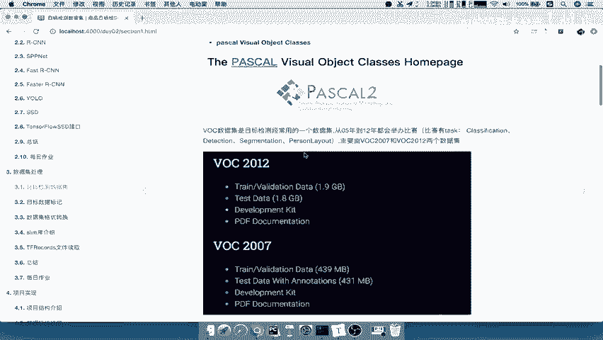

这个数据其实比较有代表性，很多比赛啊或者很多的结构要训练新的模型，我们都会去使用这样的一个数据集去做训练的，并且我们做微调的时候，你的预训练模型怎么来啊，都是拿一些这些啊这些公开的数据集进行训练。

训练好的模型啊，然后提供给别人去用，对吧啊，进行一个微调，那么我们看啊在这里面有这个它的一个目录啊，有20072012的数据集，那么我们的这个在课堂当中啊，基本上演示的时候。

也会选择一些2007的数据也做一些介绍，只不过它这两者基本是相同的。

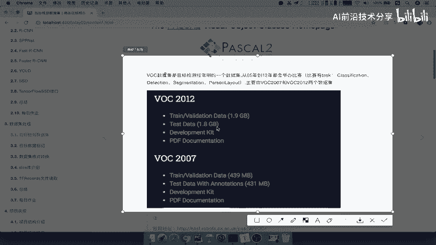

只不过它的一个数据集啊，它的一个大小不一样，那么这个是啊很多的这个比赛啊。

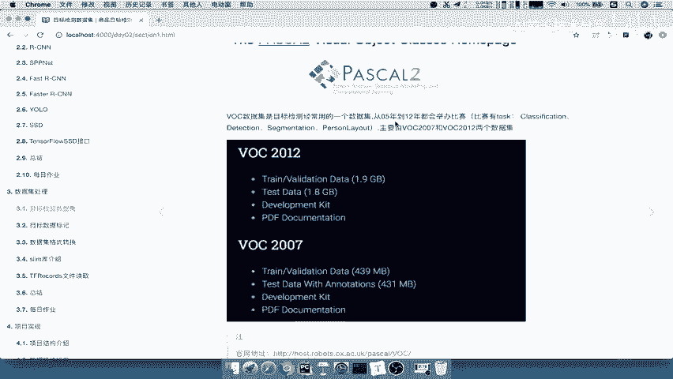

都会去学采用的，那么这里有它的一个官网地址，那么官网地址有这个啊，这是它的一个官网地址，然后另外一个地址是什么呢。

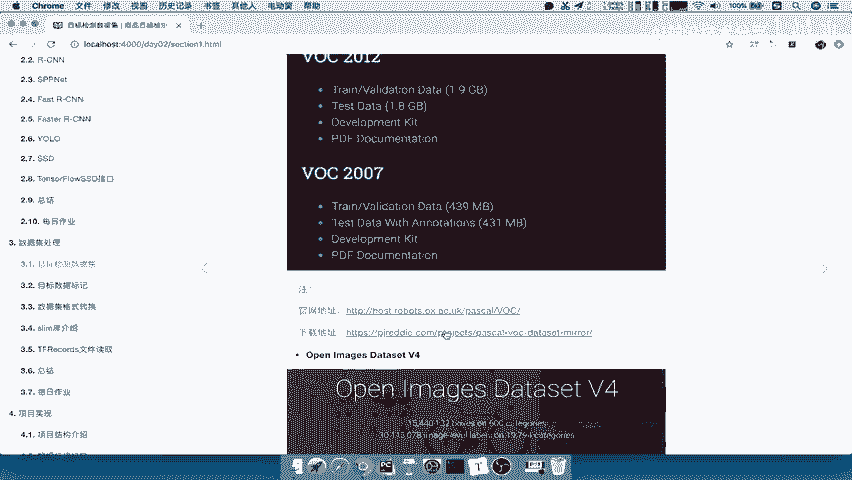

因为官网地址的这个下载链接啊不是特别好找，所以呢我们直接找一个它的一个下载地址，比较好的，哎你直接可以在这里面去下载好。

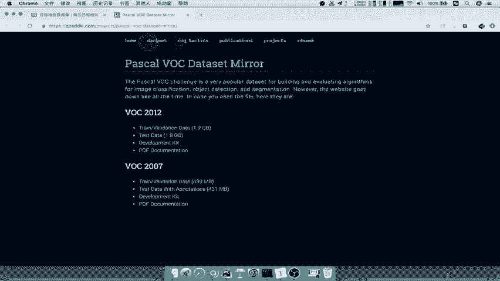

那么这是第一个数据叫做pasta啊，work数据集，那么还有一个数据是比较新的啊。

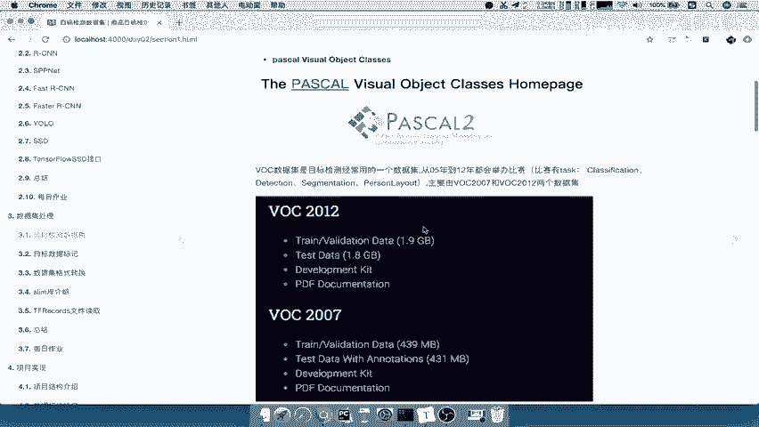

就最近的18年啊，或者说在应该是在16年吧，他呢已经发布了一些数据，相对于帕斯卡呢要迟一些，那么它开放了一个，在2018年开发一个新的叫open images dataset v4啊，V4版本。

它这里面也有很多的，包括了什么190万张图片，针对于600个类别啊，也就是说你之前我们提到什么20个六边对吧，这里有一共600个类别啊，包括一共有多少个边框的标记，这也是目前的来讲呢，这个是最大的啊。

最大的一个注释的数据集，这些里面的都是专业注释人员动手标志的啊，绘制的，所以呢你会发现这个工作量呢，其实是非常大的啊，等下我们会说，那这两个数据集呢我们选用哪一个呢，帕斯卡啊，帕斯卡work。

因为他的这个有一些处理的这个啊，结果或者库啊，可以翻面的去进行一个处理啊，包括呃通常所用的啊一些网络上的模型啊，我们也喜欢用这个passa work的一个数据集好，但你想要用它也可以啊。

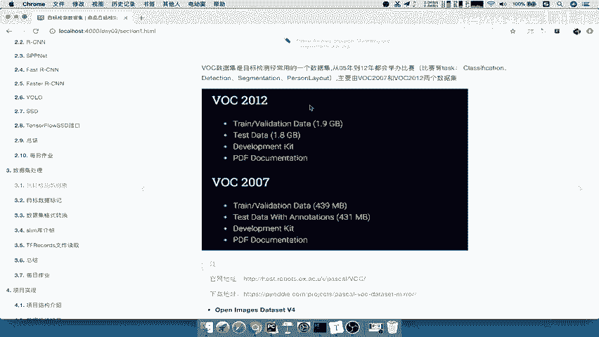

只不过你自己在处理的时候呢，你可以去再根据数据集格式去处理，那我们就来介绍一下，介绍一下我们的帕斯卡work数据集，password数据集呢它2007啊，总共有9963只图片。

并且一共是提供了20个对象。

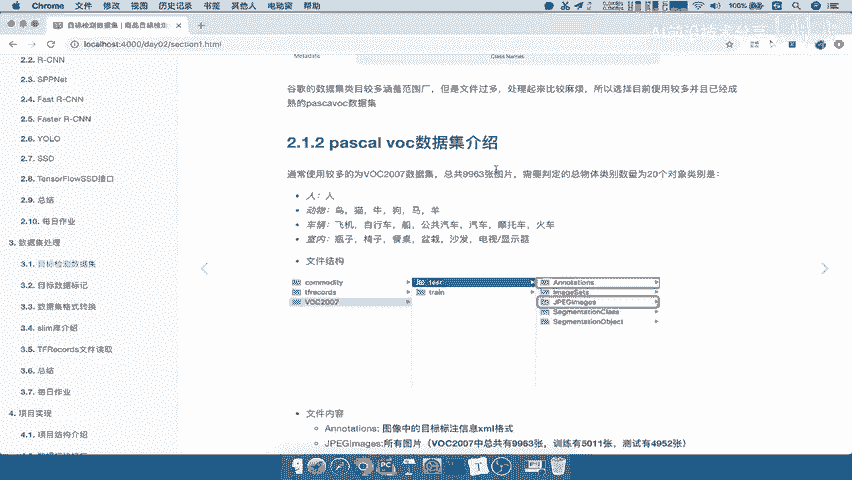

里边也是说我们之前提到的20个对象对吧，那这哪20个对象呢，类别是人啊，只标记了一个人，然后包括动物里面有鸟啊，猫牛啊，车辆飞机自行车等等，室内的瓶子椅子，餐桌等等啊。

这就是它一张图片标注的哪一些物体类别好。

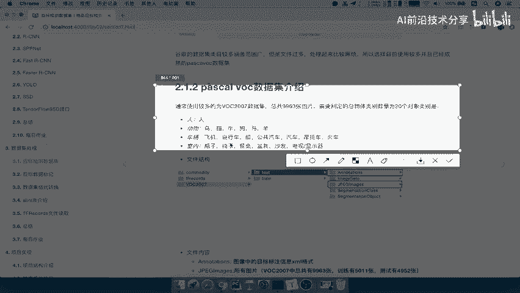

那这个数据集呢我也给大家去下载好了啊，如果这你想去网上下载也可以对吧，那下载好呢，在我们的这个文件当中，我们来看一下，在我们的image当中，这是项目啊，然后呢work2007啊。

我们随便选一个叫train text啊，它原始的目录呢是提供了这么几个目录啊。

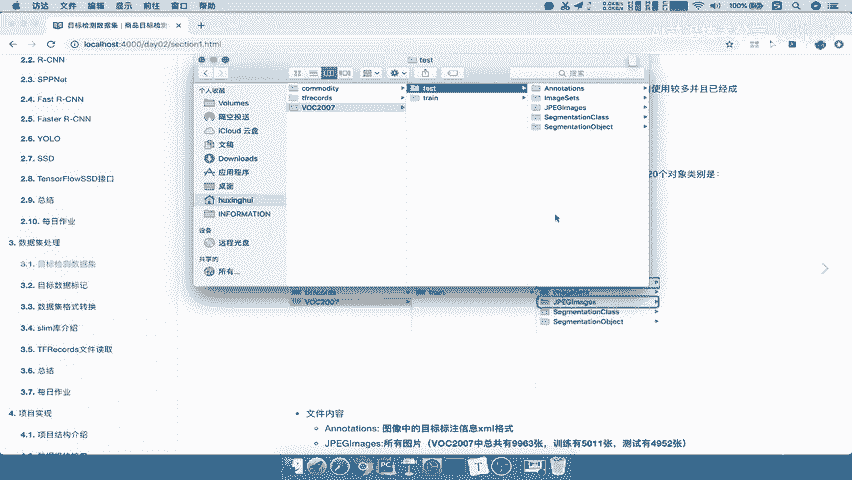

原始提供这么几个目录，那么这几个目录分别代表什么意思呢，annotation表示我们标注的结果，image size不用管了，j p EG image就是我们的图像。

等下我们会看segmentation class，三个MENTATION的object都是我们作为分割用的啊，但是我们是做去做目标检测。

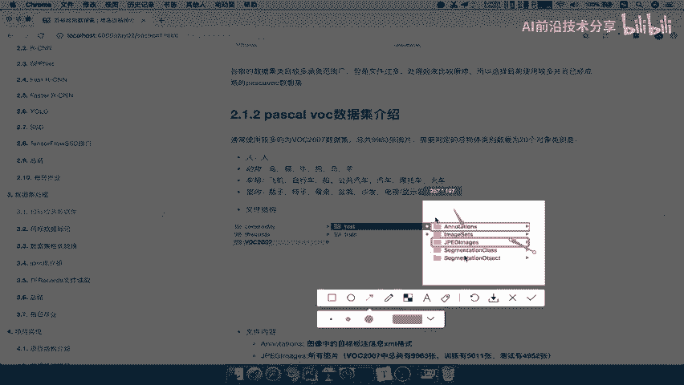

那么我们来看一下这两个文件内容分别是什么，annotation里面是注释的XML文件，JPEG里面是所有图片文件，9963张，训练5011章啊，这个测试有4952张。

我们来看一下这个就是annotation，这就是JPG，JPG里面呢就是一些就是一些常见的一些图片吧，哎里面有哪些物体呢，我们都可以看得清楚对吧，哎就是哪一些这个常见的图片啊，都是网上常见的图片好。

然后呢AUDITATION就是对于看一下它的命名，JPG是00001JPG，对应着我们的图片的这个注释文件，就是00001点XML，你看一下，这就是001的注释文件，这也是0002的注释文件。

这就是003的，那么其他的目录呢，我们不管啊就可以啊，你可以选择性的把它给进行删除都可以啊，我们在这里也可以把它进行一个删除，就保留这两个就OK了啊，这里面这是我们的两个文件的一个介绍吧。

好那么关键的在于XML里面到底是什么东西，我们说了，在我们在讲目标检测算法的时候，一定要去进行一个什么目标检测算法里面，物体的一个标记吧，那其实就是我们在准备数据集的过程。

那这里面我们先来看XML文件当中啊，当中有哪些东西，那么它是一个标记物体检测的结果。

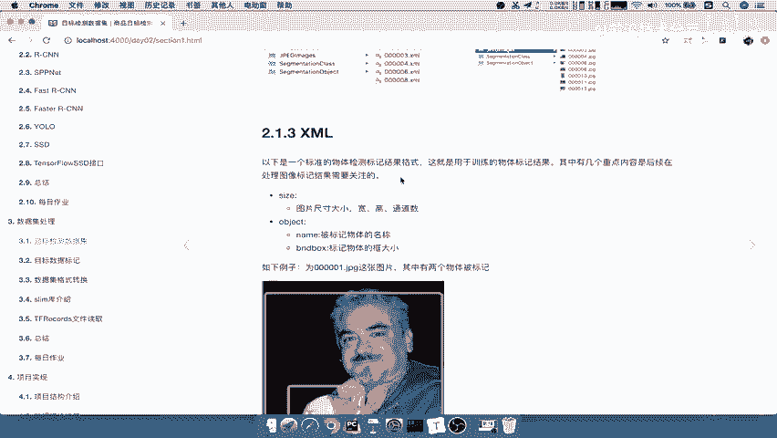

比方说对于0011的这样的一个图片，他呢我标记出了两个东西，一个是人。

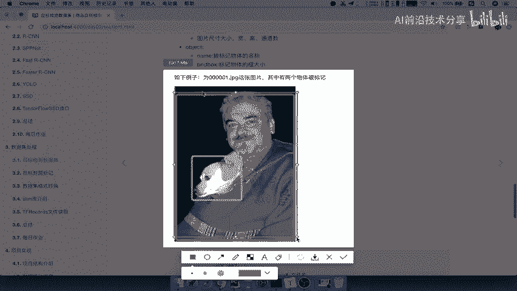

一个是狗，是不是这两个物体啊，那这两个物体标记结束之后，它会保存在我们的XML格式当中，会以这样的一个格式去显示的，那我们打开我们的annotation，比如说这里是训练文件啊，我们拿测试文件来看一下。

打开，那么这个XML文件里面就记录了，我们被标记的物体的这些属性，我们一一来看一下这个当中啊，我们有这么几个内容。

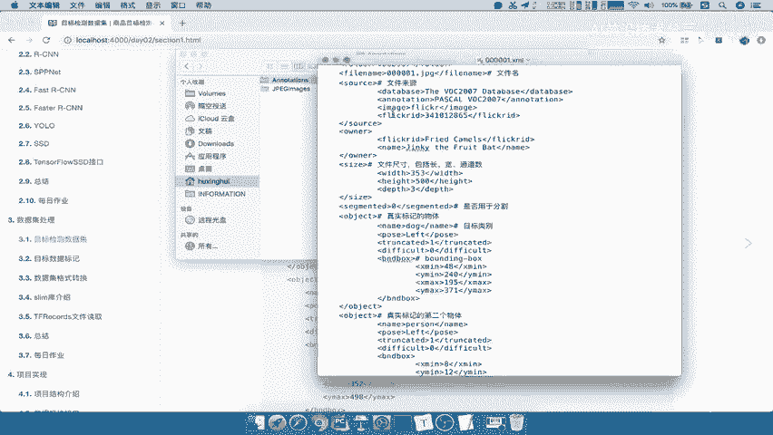

Folder，File name source，这些前面的这个东西啊，全部都不用管，都是它标记的时候记录一些属性，你的图片名字啊，包括你的数据集名字啊，还有你的数据集的一个来源，好，你的创始人是谁对吧。

你的这个地方好，那么重要的是观察size，请问这个size是什么，包含了这张图片的什么长宽通道数啊，这个非常重要，长宽通道数，那么以及我们这个图片是否用于分割啊，这个一般的我们都不去观察。

然后再看一个重点内容，就是object以XML的文件格式，如果你这个图片里面有多个物体，它会有多个object，刚才我们是不是标记了两个啊，有两个吧，真实标记物体它的名字是什么，它的位置。

还有什么trunk的difficult这一部分啊，这里面三个也不用太不用关注它，只是记录一下它的属性，那么我们重点关注的是什么呢，就是name以及b n d box。

这里的bn d box我们可以称之为呢，就是我们之前说的基T就是grand truth啊，就是我们的真实值，也就是说这个物体被标记在哪里，dog它是在X命令Y命令x max y max，还记得这个值吧。

这就是我们介绍过的吧，就是我们的极坐标的这样的一个表示方式吧，啊就这个坐标点的啊，四十八二百四，195，370是相对于这张图片的啊。

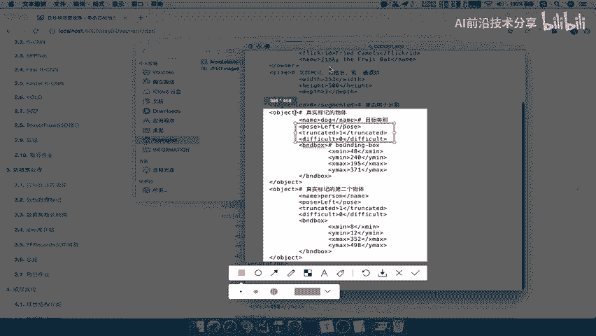

这张图片的好，那么我们来看到这个地方的这个object。

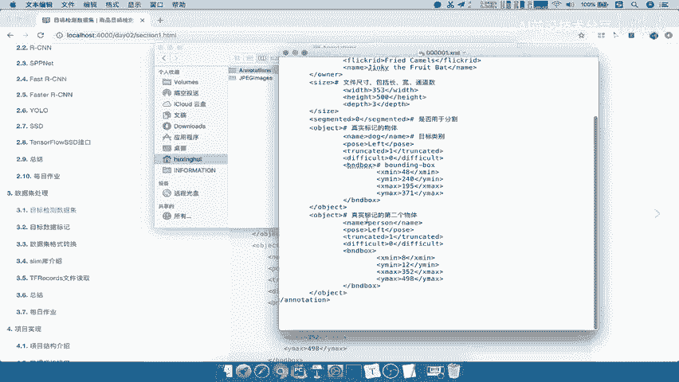

第二个物体，比如说person啊，person这个人呢他的他的这样的一个标记的啊，结果X命令Y命令x max和y max能理解吧。

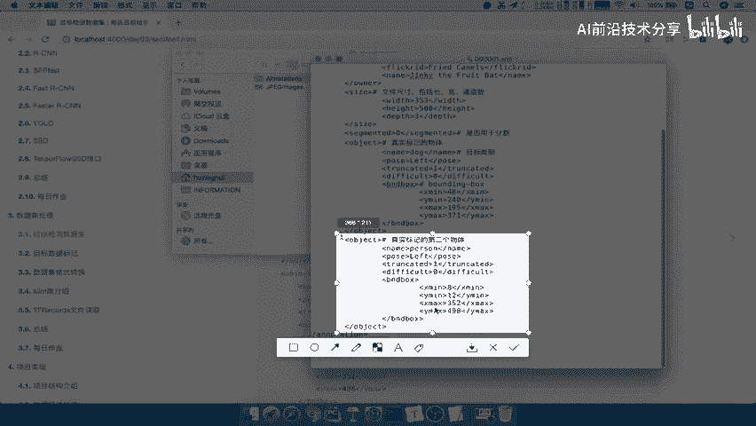

好这就是我们的这个啊标记的啊，标记的结果，那么这样的话呢我们的XM当中，XML当中呢就有了我们这个物体啊，这个图片当中的物体标记，所以你只要关注两个东西，一个是size，一个是object。

当中被标记的名称以及被标记的物体框的大小，好那么这就是我们记录的啊，图片每个图片有对应的一个标记，这个过程就是我们俗称的啊，打标签的一个过程啊，打标签的过程好。

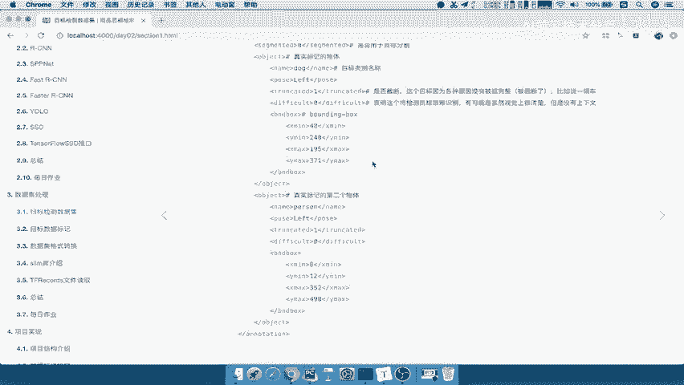