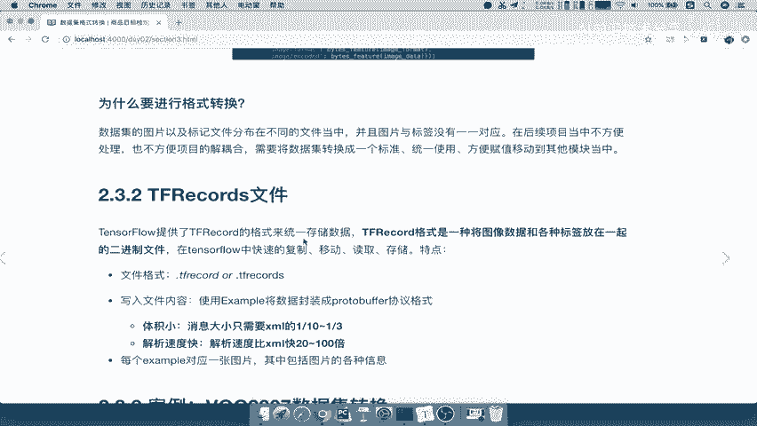

# 零基础入门！一口气学完YOLO、SSD、FasterRCNN、FastRCNN、SPPNet、RCNN等六大目标检测算法！—深度学习_神经网络_计算机视觉 - P38：38.01_数据集格式转换介绍38 - AI前沿技术分享 - BV1PUmbYSEHm

保存好我们的这个图片，以及我们的这个XML数据之后呢，接下来我们就要做的事情，就是数据集格式的一个转换，那么在这里呢我们要掌握的一个目标。

就是了解tf records文件的一个作用啊，我们知道它的一个作用，为什么这样处理，以及呢，我们应用TENSFLOW完成这样的一个数据集转换，注意了，我们是用这个啊work2007啊去做一个转换。

那么我们首先来看一下，为什么我们要进行一个格式的转换，转换到一个称之为tf records的文件，那我们来看一下，这里有两个这样的一个图片。

左边呢就是我们要存储的相关内容，以及我们一开始存在这个磁盘当中，是不是一张图片，一张图片，以及还有一个XML文件吧，XML文件当中保存的，是不是我们的图片的相关一些属性啊，包括你的像素啊。

呃你的这个长度啊，宽度啊，通道数啊，还有这张图片里面的一些对象啊，相关的一些属性，那么我们想这些内容是不是很多很多啊，当你去想要当你去训练个模型，想要去读取数据的时候，你会写的这个业务是比较复杂的。

所以我们目的是想要让我们的这个格式，数据这个格式的转换代码，与我们模型使用数据之间进行一个啊，相当于是进行一个解耦合，我们想要这个转换的代码呢能够更加简洁一些，也就是说我直接读取就好了。

我模型只要负责去读取哎，输出啊，只要返回数据就行了，我们不需要写太多的这样的转换代码，就一开始我把它写先写好，那我们看转换后的这样的一个格式呢，它就会很方便，整体呢会变得非常简洁。

只要一个这样的一个称之为train，点example的这样的一个东西啊，一个函数就能够把它返回到一个类里面，然后呢我们再去读取的时候是非常简单的啊，处理起来也非常简单，所以我们想要做这样的一件事情。

能理解吧，好那么我们把这俩保存一下。

那所以呢刚才我们说的说的这些啊，在这个地方我们已经写了一个是呢，我们的这个逻辑呢要把它分开。

然后呢数据集图片当中呢，我们标记文件跟我们的图片是不是分开的，是不是在不同的文件夹里面，那么图片与标签没有一一对应，我们想要这个后续呢项目处理呢不是非常方便，所以你要想要把这个数据集转换一个统一标准。

统一使用，方便复制移动啊，到其他模块，比如说你把这个格式转换好之后，你提供给别人啊，别人训练模型要你这数据你提供给它，它不需要写参考或者写太多的一些逻辑了，他只要知道你的这个协议保存的是什么样子的。

就OK啦，好那所以这就是我们的前提，那么接下来我们要介绍的就是tf tf records文件，那么tf records文件呢，它是一个提供了这样一个格式来存存储的啊，提特斯flow。

那么这种格式它的特点我们来看一下，它是将一种图像数据跟各种标签放在一起的。

二进制二进制文件，以及它能够快速的复制移动读取存储等等特点，那我们重点来看一下这个东西，刚才说了，将一种图像和你的标签放在一起。

那也就是说原来我们的文件，打开我们的这个项目当中啊，比如说这个项目image当中，我们来看work2007test里面，XML跟图片是不是分开的，你要读取的时候，还要把图片跟我们的标签文件一一对应起来。

我这个图片呢有哪些对象可以一一对应，你这读取是会非常麻烦，它呢就可以把这个图像跟标签放在一起，变成这样的一个协议，那所以啊我们方便后续的一些人的处理好，那这就是他的点，那么我们保存的文件格式呢。

这里面TENSORFLOW当中你可以保存tf records，也可以保存tf record啊，这两个都可以，那写入的文件内容是使用一个example，将我们的数据封装成一个PROTOBUFFER协议啊。

这个协议也是一个比较高效的协议，那么这个协议的特点呢，它的体积呢会比较小，它会比我们的什么JS啊，XML这些文件的存储格式啊，大家都知道的，这些格式的存储的一个大小呢，会要小到1/10到1/3。

那么解析的速度呢也比这些文件快，所以呢这个PROTOBUFFER也是谷歌的提供的，这样的一个非常快速啊，非常这样的一个跨平台的，这样的一个啊文件格式啊，他的速度啊毋庸置疑好。

那么每一个example对应一个图片，包括图片当中的一个信息，这当然是对他的一个协议的相关的一个介绍啊。

好那么这就是我们说为什么要进行格式转换。

