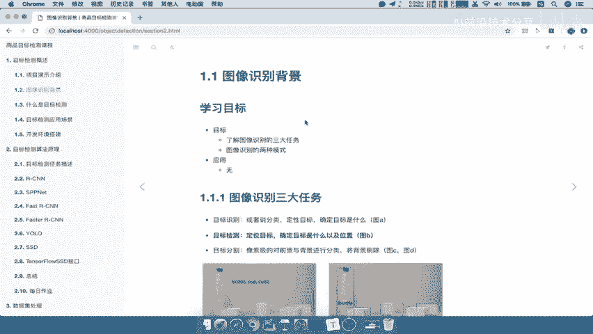

# 零基础入门！一口气学完YOLO、SSD、FasterRCNN、FastRCNN、SPPNet、RCNN等六大目标检测算法！—深度学习_神经网络_计算机视觉 - P3：3.图像识别背景3 - AI前沿技术分享 - BV1PUmbYSEHm

好，那么接下来呢我们就要去介绍一下图像识别，它的一个背景，那么什么是目标检测，这个我们待会再说，等我们介绍了整个识别的整个领域对吧，他呢处于什么样的一个角色。

那么这里的目标啊，学习目标就是要掌握啊，或者说了解啊，了解图像识别的这三大任务啊，以及图像识别的两种模式。

那么首先我们来看一下，图像识别的三大任务是什么，图像识别三大任务，这里呢给出了三个这样的一个定义。

那么我们来看一下目标识别，目标检测以及目标分割，什么是目标识别呢，它或者说是说出这样一个分类定性你的目标，确定目标是什么，目标检测它是定位目标，以及我的目标在什么位置，就是图片当中什么位置。

目标分割就是我要对前景与背景进行一个分类，将背景剔除好，那么这三句话分别代表什么意思呢，我们通过一个图来进行理解，我们来看一下这里有这张图啊，这张图里面呢有四个小模块啊，有四个小块。

那第一个image classiication，就是图这样的一个目标分类，目标分类意思，这张图片什么类别里面，比如说它是有这个矿泉水瓶bottle，还有你的杯子cup唉。

那么他就是说我输出类别OK了就可以了，那目标检测是我们说的第二个目标检测，Object localization，就说目标定位也称为目标定位，那么他要得出什么呢，除了你这个图片当中有哪些类别之外。

还得需要知道你这个目标的物体的位置在哪里，需要把它标记出来，当然我们这个标记啊，是通过一个具体的坐标去进行标记，不是说这只是说我们在看的时候呢，他给他画了一个这样框框啊，这样的一个呃直观的一下感受。

好两个讲完对吧，那接下来是什么目标分割，目标分割呢有包含两种啊，包含两种，那么跟我们看第一种，第一种，它是不是将这些物体与我们的背景分开了吧，而第二种呢就是这个物体啊，我们背景直接去区分开了。

直接把背景剔除，然后直接把我们的物体给标记出来，并且是它的物体的整个形状啊，物体整个形状好，那么这就是图像识别的这样的一个三个啊，领域啊。

三大任务好，那么所以呢我们紧接着呢，我们就简单的啊总结一下图像识别的三大任务，这里啊都是了解内容啊，只你知道这么几个这个任务就即可好，第一个就是目标识别，我们需要哎这个目标的一个类别输出类别吧。

我们的目标检测是要输出类别以及物体的物体，在图片当中的位置，然后我们再来看目标的一个分割，分割呢，那你就需要与啊把物体把物体形状描述出来，把物体形状描述出来，然后呢你除了把这个形状描述出来，还得去干嘛。

哎或者你还得把背景吧啊，背景背景进行这个标记吧，或者说剔除都可以啊，好这就是三大任务，那么我们的重点呢当然是这个目标检测，后面我们会说啊，这个目标检测为什么在这里我们会讲目标检测。

明显这个目标这个分割啊会好一些对吧，哎它进行像素之间的一个分割好，那么我们接下来看第二个，这是图片这样的一个识别的发展啊，图像识别的发展，那么它的发展呢，我们通过两种模式来进行介绍啊。

这个有同学可能听说过，一个就是通用场景的，还有一个就是垂直场景好，这两个场景的，一个是通用啊识别的模式，图像识别的的两种这样的一个应用场景吧，场景模式，第一个就是应用通用场景，还有一个就是垂直。

那么这两个什么意思呢，为什么要介绍他们，这两个，也就是我们要明确一下，我们做的东西到底属于一个这样，什么样的一个角色对吧，通用场景呢就以谷歌，微软FACEBOOK，百度等等这些大的it企业对吧。

这些互联网企业呢，他们拥有大量的啊人力财力物力，包括它能够收集到很多很多的数据，那么这样的话呢它能够做一些通用的产品，比如说我对这一个通用的一个物体识别，我拍张照，随便我去识别一个物体啊。

比如说你现在就对这个某个场景吧，你就随便在你周围拍个场景诶，他要识别这个场景里面有哪些，可能做这些呢是比较擅长的，或者说他这个啊每个平台啊，比如说阿里，他这个平台里面来很多由商家的数据对吧。

比如说商品的数据诶，他也可以做这样的一个检测，还有呢这个百度啊，或者这个腾讯等等，那么他们所做的呢就是想去搭建一个平台，想让呢别人去用他们的这些产品，我们可以看到这里给了一个百度云的啊。

百度云上面它其实也有一些图像技术开放的。

比如说图像技术啊，内容审核，自然语言啊，语言这个地方我们就不管了啊，那我们只关注图像里面，它也可以文字识别，人脸检测，图像识别，还有图像搜索，但是啊你进去点进去之后啊，你可以发现这些功能。

如果说在特定的场景，你某个公司的场景不一样的话，这些东西能不能用啊，肯定不能用，一原因是什么，一就是这个公司的数据，你百度掌不掌握了没有，不掌握一般机密的数据不会给这些大公司对吧。

二呢也就是说他呢也不可能去把所有的行业的，所有的场景，各个场景都给它使用出来啊，都给他置个实现出来好，那所以呢这里就是说这些大公司搭建平台，可以是可以，但是他们这些平台上的通用功能。

能够达到一个简单的一个效果就OK了没了，你只是相当于是，你如果说真正的去这个企业赚钱开发用的，那肯定是不够的啊，远远不够，那所以呢我们要做的各种图像识别目标检测，我们要基于什么呢，具体公司业务。

你这个公司做什么的对吧，它识别什么，它检测什么，哎，那你就可以去使用你这个公司的私密的，一个数据对吧，去搭建你的数据集，然后去进行训练，那么所以我们也称之为一些垂直场景。

在垂直领域呢就相当于你具体一个医疗领域，铃木产业，那你想没有你想象不到的检测场景，只有你哎你没有你这个做不到啊，只有你想象不到，那么所以医疗影像的一个检测，或者木板树种的检测识别，那你想想这种场景。

百度他们或者阿里他们，他也没有这个数据啊，他怎么去做呢，所以我们大多数呢做检测开发的，所以基本上都是一种垂直场景的开发啊，通用场景呢你用用这个大厂商的就够了啊，所以呢垂直应用场景呢行业的特质啊。

会往往被忽略，所以呢这个垂直领域的行业啊，在这个大量的公司，正在开发相当多的一些图像应用好。

这就是我们介绍的这样图像识别的一个发展啊，通用场景，垂直场景好。

