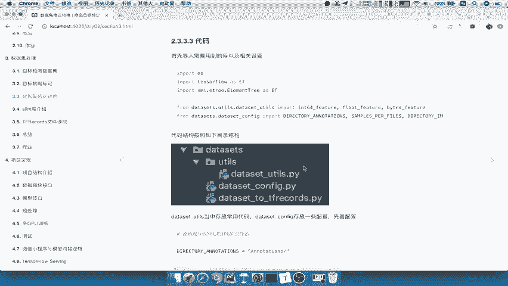

# 零基础入门！一口气学完YOLO、SSD、FasterRCNN、FastRCNN、SPPNet、RCNN等六大目标检测算法！—深度学习_神经网络_计算机视觉 - P40：40.03_格式转换：文件读取以及存储逻辑40 - AI前沿技术分享 - BV1PUmbYSEHm

那我们就去实现一下我们的第一个步骤，那么首先呢我们会去建立这样的一个文件夹。

对吧好，那我们在这个关闭啊，关闭我们之前的这样的一个代码的结构，我们在这里新建一个项目结构，那项目的这样的一个文件夹，Online class，比如说在线课程对吧好，在这个下面。

我们是不是要新建一个我们的data size目录，Data size，那么我们的数据呢也把它存在统一的啊，存在这个image的目录里面，也就是按照这个啊项目当中的这个结构image目录。

那么我们在这里呢直接把这个image呢，我们把它直接复制过来，在我们的image当中啊，我们把这个复制过来，放到我们的online class里面，注意了啊，看到我们把它直接复到这里，这样的话呢。

我们现在目前的这个啊文件夹里面，就有两个这样的一个啊这个目录了，那我们等这个复制完成，好那么复制完成之后呢，我们紧接着就要去进行写一个代码。

那么首先我们第一个呢就直接去创建一个DATASET，to tf records的文件能力吧。

哎把这个代码呢这个逻辑先写好好，那我们在这个啊我们这个导入的这个online class当中，新建一个在data size里面新建一个Python的文件啊，我们data size。

比如说我们就按它的名字啊，dataset dataset to tf recor好，那么这个啊我们写好了之后呢，就到这个创建好之后呢，我们第一个。

首先呢我们把这个tf records的这个TTENSORFLOW，给导入进来对吧，其他的我们遇到什么需要导入的包呢，我们再导入啊，import一下TENSORFLOWSTF好，那这是我们的这样一个啊。

我们的这个库，那首先呢我们建立第一个就是run函数，要直接运行的这样的一个逻辑，好比如方DEFDEFINE一个run，那么刚才我们说了，这个run里面我们要去写什么呢，我们要去放进去的目录有哪一个。

一个就是你数据集的目录吧，啊比如说DATASET杠DIR，以及我们的这个输出数据集的目录，也就是说tf records目录存在哪，output啊，OUT啊。

output dir以及你的文件的这样的一个名字啊，就是我们的name，好比方说我们默认给它一个名字叫做data好，我们把这几个呢这个逻辑写好好，那这里我们介绍的就是运行啊，运行存储啊。

这个转换转换代码逻辑，那么这个逻辑这个地方的run主要做什么呢。

就是对于我们的来把这个地方复制过来，存入多个TFRECOR文件好。

然后呢每个文件固定N个样本DATASET，第二我们需要数据集的目录吧，数据集的目录，然后呢输出就是你的存储，tf records的存储目录，以及你的数据集名字，指定啊。

名字加这个指定名字以及你的train还是test对吧，train or test好，那返回呢这里有个run，我们就不返回了，好那么我们来看一下在这里怎么去做啊，我们怎么去做的，第一步。

首先呢我们可以去判断我们的data size目录啊，data size目录存不存在对吧，哎，第一步呢，我们就是判断我们的数据集目录是否存在啊，我们呢可以去创建一个啊目录，那么当我们判断好之后呢。

我们是不是要去将数据集目录下面的什么，一共有annotation，这里面是不是有annotation，里面存在存在一个ANO啊，annotation和我们的image吧。

哎JPGJPEG的一个images好，那所以我们就要去读取某一个文件，所以你要去存储，是不是要把它的所有文件读取出来啊，那所以我们在这里呢直接啊读取啊，某个文件夹下的所有文件名字列表。

所以呢这两个啊两个文件夹，这两个文件夹呢它们的文件数量是不一样的啊，是一样的啊，好构造好列表之后，我们第三步就要去循环这个列表吧，循环这个啊这个名字列表，我们要做的事情是什么，是不是循环这个列表。

每过每过每200张啊，这个你自己去定啊，你一百五两百三百都可以免，200个图片以及XML信息，那么我们就去啊就去存储一个文件当中，就存储到一个tf record的文件当中，好这就是我们的一个逻辑对吧。

那这是我们run函数逻辑啊，具体细节代码呢，这其他逻辑我们在其他函数当中去实现，那首先第一步骤判断这个文件存在啊。

那我们就用TENSORFLOW当中的g file，我们来看一下，这里面我们有g file，点exist是不是也可以创建这个目录。

是不存在吧，不存在，我们可以去创建一个，或者说你报此数据不存在也可以吧。

对吧好，那我们在这里呢直接if如果if tf点g file，点我们的exist啊，exist单出我们的这个什么哎，单出我们的这个data size d i r，如果它不存在，我们可以TF点g file。

点我们的make file drs啊，Drs，然后呢将我们的data set dr好，那这是第一个逻辑，那么紧接下来呢我们来看一下，去读某个文件夹下面的所有的文件列表，所以我们要去加我们的路路径啊。

这是我们的路径，这是我们的文件夹的名字，注意啦是annotation，所以我们要把这两个进行合并，能理解什么意思啊，就是它在哪个目录，这个目录以及这个目录下面的annotation。

但annotation呢我们就指定下一个配置文件，把这个annotation放到配置文件当中去读取，或者你做一个全局的一个变量也OK啊，也OK，那你这个地方的，或者说你为了方便也可以去创建啊。

我们直接创建一个，我们按照这个代码当中逻辑吧，好创建一个data set杠CONFIG，创建了一个CONFIG之后呢，我们需要去在这个CONFIG当中，指定我们的annotation的一个哎。

所以啊我们在这里啊，直接指定原始图片的XML和XML，我们把它放大一点，XML和图片的文件夹名字，那我们先第一个啊，我们就按照这个代码当中。

把这个直接复制过来了，我们直接把这两个directory annotations和direct images好。

我们在这里写上这两个文件夹的名字，这个目录名字不要搞错了啊，images和JPG，images和annotations好，那么我们接下来就去导入啊，导入我们的这个地方。

那么这个导入呢我们是从这个文件的啊，相对路径对吧，我们直接从data size里面导入就可以了吧，啊所以from data size文件夹啊，data size文件夹下面的什么data config吧。

点data干，data set configure啊，DATASET干configure，我们看有没有写错啊，data size下面的data config，然后呢我们import一下。

import一下我们的the directory annotations，和我们的directory images，好这两个拿过来了，那么紧接着我们就要去合并我们的目录，加我们的文件夹好。

所以我们直接import下一个OS吧，OS工具是可以去进行合并的，import os os点pass点join，join什么呢，第一个就是我们的文件夹的目录，加上我们的哎这个ORANNOTATIONS。

当然你可以用image是一样的啊，返回一个我们的文件的列表，注意了，返回一个文件的列表，那路径啊，或者是这样的一个path，好路径啊，路径之后呢，我们要去进行读取，那所以我们就要用一个OS点读取文件夹。

是不是list dir里面的所有文件吧，哎pass类似dir path，我们说了这个地方，当我们去读取所有文件的时候，所有文件时注意了，会打乱顺序的，打乱顺序打乱顺序，那么你要做的事情呢。

就要把这个顺序呢又要还到原来的这样顺序，从001~002到0003，所以呢我们可以去进行一个sorted啊，sorted将这个进行一个排序，按照文件的一个名字啊。

默认那所以返回的就是我们的file names，等于salted啊，这样的一个排序好，那么这样的话我们来看file names呢已经写好了啊，就是说我们的这个文件名字的列表准备好了。

接下来是不是就要去循环这个名字列表，去一一的每个文件，每个文件的读取存进去，每隔200个保存一次吧，好那么所以接下来就是我们首先要去循环啊，我们建立一个啊这个标记啊，I等于零。

那么我们当我们I小于我们的文件名字，列表的时候，就循环这样的一个列表，应该是我们的长度对吧好，当小于的这个的时候呢，我们应该在干什么呢，干什么呢，首先第一步是不是要创建一个tf record文件吧。

第一步创建创建一个tf record的文件，是应该有一个啊，有一个标记，有一个文件的，所这个第几个啊，有一个第几个文件的序号，也就是在这里面，我们来看看啊，在tf rex image里面。

work2007啊，应该是tf records里面好，这个应该是在这里面有一个test，000001啊，我们要把这个东西写进去，但是这个东西呢应该是怎么样标记的呢，第几个文件。

你想想我们创建了一个文件之后，是每个图片存到一个文件，那这样的话你要多少个，假如说你用的是这个测试的，是不是有四千五九百五十二，但不是吧，我们是循环标记，每隔，相隔啊200个文件。

200个图片内容存储一次，是不是要每隔200个存储文件存储一次啊，那所以我们在这里呢，要进行一个序号的一个循环，什么意思呢，我在这里要创建一个另外一个序号，什么样，我们班既定指定一个指标啊。

相当于是FDX等于零好，那我在这里呢就获取一下文件名字，那我们在这个获取文件名字的这样的一个，代码当中去获取，我们可以去新建一个这样的一个文件名字，我们叫做比如说get output name对吧。

比如说get gu output杠file name好，那么我们要获取这个输出的这个tf records文件，比如说你要指定它的哎output dir，你要知道它输出到哪一个文件名字啊，文件目录。

然后再加上你这个文件的名字。

注意了是数据集的名字，再加上什么，加上我们的索引嘛，是不是我们的索引，我们第一册文件是不是就是FDX，是不是第一个就是零啊，000吧，好那我们在这里把这个函数写一下，D放一个，好。

那么在这里我们把这个文这个地方的名字呢，写到这里对吧好，我们写一下解释，直接我们写到这里啊，我们获取输出的，获取输出的文件名字，这个输出路径，好然后呢你的数据集，数据集名字我们参考这种形式啊。

参考这种形式，这个API介绍一下，比如说这个pass卡吧，p work直接我们参考这个work杠2007杠test，或者or voc杠2007杠tree，能理解吧，然后呢这个标记呢就是从啊这个零啊。

一直到以上的这样一个数据啊，好那么我们返回呢就是这样的一个字符串吧，那么这个地方的字符串，我们直接就在return一个构造这样的一个输出目录，好，那我们写上一个这样的format。

我们按照一个format格式，第一个输入目录我们是百分号S，然后目录下面哪一个文件呢，也是文件里的名字，然后再加上你的什么呢，数据的一个下标啊，第几个文件，那这里面我们按照三个对吧。

我们可以写着按照03D啊，03D百分号D这样的一个形式，那么03D呢点我们的文件后缀名，TFRECOR文件，然后呢我们会把这些啊我们的信息填进来，output dr以及name以及我们的FDX能理解吧。

好，那这个就是我们构造的一个文件的一个名字了，那么紧接下来呢，我们把这个文件名字给进行一个返回，我们比如说就叫做返回一个TF点file file name，好。

等于这个get output file name，那么我们接下来这个文件获取好了，是第一个文件嘛，第一个文件要干嘛，存储200个图片进去吧，所以我们这里地方要进行一个记录了。

当你要存储200个文件的时候呢，我们要新建一个啊，新建一个，t f t f records文件的存储器，那么这个存储器怎么新建，就是在我们的这个API当中，在这里你要去存吧，你肯定要先进一个存储器。

而且不同的文件是不同的一个存储器的，因为你这第一个文件就用它，它是指定的，TF点Python I/O点tf record writer写进文件的名字，它这个方法就是write一个example。

一个example呢我们放入一个图片好，close一下我们的关闭好，我们在这里就直接啊with，比如说啊TF点Python杠IO点我们的tf react writer，写入到我们的指令。

打开我们的是tf file name，好as一下，比如说tf gutf record吧，tf rec c1啊RECORD杠WRITER好，那么这样的话呢，我们接着紧接着就要去干嘛呢，循环200次。

所以我们要循环一下，如果当我们的I是小于啊，那如果他没有循环到外面这个地方结束，也就是说它在这里没有循环到外面这个结束，并且AND，并且什么呢，我们在这里面应该做一个标记吧，你循环200次。

我应该标记一个200次，哎，比如说我们这里呢这等于零，当然你可以用I对吧，if i除以200等于等于零，我们会保存一次啊，那也可以，当然你最后那一最后呢你还有一个啊，有可能这个不是整200对吧。

那么所以呢，while i小于这个learn flix的时候，并且我们的JG小于小于我们总的样本，就是说我们要存储多少个样本数吧，存储200个吧，对不对，那这200个呢。

你可以把它放到我们的配置文件当中对吧，好比如说指定指定每个文件，每个TFREX文件的存储数量，图片数量，好在这。

我们可以把这个的变量拿过来啊，samples profiles啊。

一个文件200个，所以我们导入一下我们的samples，粘贴一下，那么我们把这个呢直接啊Y小于它啊，小于它都可就可以了，所以呢我们在这里可以打印一下，我们的啊这个记录文件吧，啊打印打印一下。

我们的整个整个转换的一个进度对吧，在转换，转换图片进度，图片进入了第几章啊，我们的第几章，然后呢总共有多少张也可以对吧，第几章，然后呢我们把这个符号啊格式化一下I第一章，比如说I加一张。

然后呢我们总共有啊有这么多的一个file names啊，我们一共有这么多图片，总共呢存进去了第一个，第二个，第三个对吧，当然你可以去在这个地方啊，在这个地方去进行一个循环也可以好。

那么我们接下来呢就要去干嘛呢，想想我们已经把这个逻辑写好了，现在是不是要取出图片的一个名字啊，你file names里面第I个的一个图片对吧，取出图片的名字好，取出图片的名字以及XML的名字吧。

以及XML，其实他们两个名字是不是一样的，File names，注意了，file names这个是个列表，我们取出第I个文件，是不是应该就是我们的file name了，哎file name。

比如说啊单独的一个single file name，Single，Single file name，那这个名字呢是什么，是不是什么什么点JPG吧，啊什么什么点XML吧，哎这个里面是XML好。

我们把这个single呢single file等于一个新点XML，但是我们还要取出图片的名字，图片名字跟XML名字的相似之处是在哪里啊，我们来看一下数据集，它们相似之处，前面的编号是不是一样的。

00001，这边是0001，所以你要去取出图片的话，你可以直接把图片取出来，图片的名字，比如说叫image干file name，干name吧，single file name里面应该是我们把它复制过来。

应该取第几个，来看到single分类应该是从我们的一开始，应该到第一负一负二负三负四点都不要吧，是不是从一开始到底四个亲情切片能理解吧，所以紧接下来我们就要去啊，把我们的这个文件名字传进去之后。

他要去读取这个图片内容，以及我们的XML文件内容啊，然后存入我们的文件，最后呢注意了，我们最后存好之后，就是说将一个图片存好了，这是不是一个图片啊，存储的是一个啊，默认每次存储一个。

默认每次存储构造一个构造一个图片文件，存储指定文件好解，接下来我们这个I和J是不是要进行一个，往上面一个加对吧，哎你I要加等于这个地方呢我们不写注释啊，I加加等于1J呢也要等于加等于一好。

那么我们这个循环之后呢，相当于每一次IJ都会增加对吧，哎他们两个数值应该是一样的啊，那么这个地方我们再来看对于我们的TFD来说，当你循环200次存储一个之后，我们FDS是不是也要加一次啊。

这是第零个文件，存储200个存储好了，接下来应该是第多少个了，哎应该在我们的循环当中啊，我们的存储文件的这样的一个序号，也要进行增加好，那所以呢进行增加，所以我们的FDX就是FDX等于加等于一好。

那么这样呢我们在外面，在这个地方是不是就可以打印一下，我们的所有图片数据集进行转换，成功完成所有图片数据集，包括我们的这个文件名字的转换，好我们把这里的格式化一下，我们的这个名字叫做数据集。

名字叫做内好，那么这样的话呢我们的整个逻辑就结束了。

也就是说我们第一个run函数当中的逻辑，是不是就OK啦，好。

