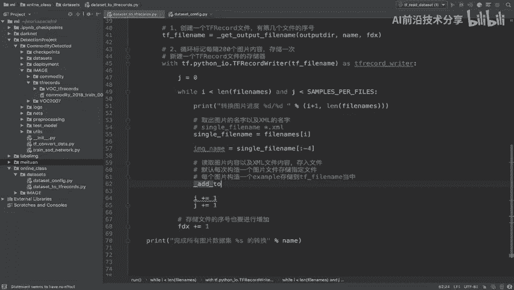
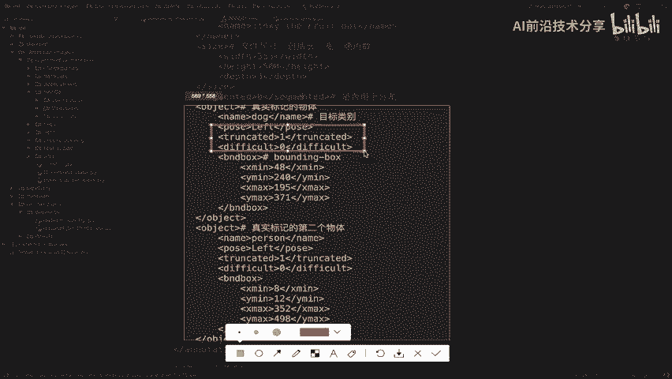
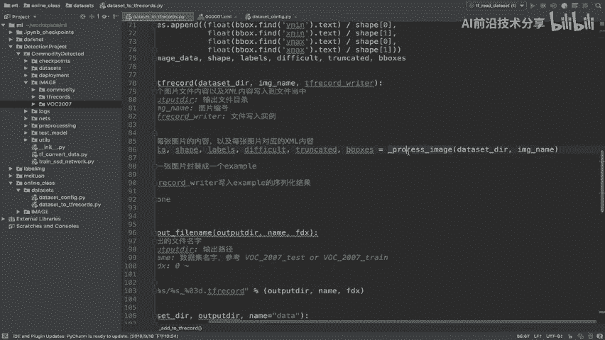

# 零基础入门！一口气学完YOLO、SSD、FasterRCNN、FastRCNN、SPPNet、RCNN等六大目标检测算法！—深度学习_神经网络_计算机视觉 - P41：41.04_格式转换：图片数据以及XML读取41 - AI前沿技术分享 - BV1PUmbYSEHm

刚才我们已经把第一个步骤的这个逻辑，已经写完了，那么我们简单的啊再次的这个回顾一下啊，那也就是说我们这里work2007，2007的啊，这样的一个数据及格式转换，第一个是不是我们要把这个文件对吧。

隔这个存储在多个tf records文件当中，record文件当中，的一个逻辑对吧，那么这个逻辑呢我们说了，要打开文件的一个列表，包括啊，然后呢把这个名字获取出来，每隔200个对吧。

循环200次之后存储进去了，然后呢，我们再次打开一个新的一个tf reg的文件，并且索引呢进行一个改变。

能理解吧，好那么接下来我们是不是重点是去在这个地方，现在我们是每隔一个图片文件循环一次，循环一次，循环一次，那么也就是说每一个图片存储到我们的T，用我们的这个什么tf react writer写进去。

注意了啊，是一个图片分装一个example，能理解吧。

也就是说我们在这个地方，在这里我们这里的建立存储器是干嘛呢，像这个文件当中，比如说D0001个文件，我们要写入200个文图片吧，那200个图片就要写写进去多少，200个example。

每个图鉴写入1example好，那所以我们接下来看这部分的逻辑，怎么去理解呢。

也就通过ADD d to tf record，那么这ADD to tf record呢，我们第一步就是将每张图片的XML，和我们的图片内容读取出来，读取之后每一个图片的内容分装成一个example。

然后把这个example序列化写进去，非常简单，这是一个图片，让你循环200次，写完这个文件是不是就可以出去了，对不对好，这是它的一个完整的逻辑。

那首先我们先把这个逻辑的一个函数呢，哎先把它写好。

那所以在这里我们要去，每个图片啊这个构造一个example存储，存储到这样的一个啊，也就是说TV file当中，好那我们在这里比如说就跟他面临的一样，ADD gto啊。

我们前面加的这样，你干好了，是因为外面我们不让它调用对吧，好ADD to。

然后呢，tf record干TFRECOR，那么我们要去写进去的这样的一个东西呢，就是你肯定是要把你输出的文件目路径给他讲，讲清楚啊对吧，你输出哪一个文件，以及你要存读取的文件的名字叫哪一个。

是不是你的image name哎这两个东西。

那还有一个就是你要想写入什么东西。

是不是我要先写入就是tf react的writer，对吧啊，所以我们要用这个东西写入进去好，那么这样的话呢，我们在这里返回值啊，我们这里先没有买返回值啊，在这个地方啊。

我们建立一个函数叫做ADD to tf records，好我们写一下这个函数的一个注释，这里呢就是添加一个图片到指定文件当中，添加一个图片文件，内容以及XML内容写入到，文件当中。

这个是你的输出文件目录图片，或者说你的这个图片的编号，我们的这个写入的一个句柄对吧，实例对吧，我们的文件写入实例好，那么也就是说我们在这个函数当中，要实现刚才所说的三个步骤，一个是读取每张图片的数据啊。

内容以及每张图片对应的XML，内容，这是第一步，第二步我们要将这每一个图片对吧，将每一张图片，图片分装成一个example，那么第三步就是说我们每一个example呢，哎用这个东西写入。

用tf react writer写入example的序列化，AMPLE的序列化，结果好，这是我们的三个逻辑啊，三个逻辑，那我们就一一的去实现这三个逻辑，我们这个地方呢return一个none好。

首先第一个逻辑就是读取每张图片内容。

以及叉ml的这样的一个内容，那么这个地方呢，我们要分装成单独的一个函数去实现，因为这个地方的步骤逻辑是比较多的，首先我们就来看第一步啊，我们先做现在做的啊是第一步，第二步我们等下再做。

那么第一步也就是说我要存到里面去，我要读取出来，那么也就是说你要读的image，那也就是说对于image和TF和这个XML文件来说，你要把哪些东西给读出来，有用的东西读出来吧，那这里呢我们写了一个需求。

哪些文件写入到哪些属性啊，写入到tf record文件当中，我们处理原则是能够有更详细的信息，我们都存入进去，目的是为了方便后来人读取相应的结果，你有什么信息在查表当中。

或者有什么信息对于图片的描述什么的，全都存进去，这样的话别人呢会获取到更多的信息，也方便于下次你不必要再去封装一次，再去写入1example一次，能理解吧啊你就相关的属性都可以写进去。

那这个就可以根据你自己去选择，但是有一些信息是必须得写进去的。

比如说啊我们在这里来看到。

在后面我们会将这些信息都要去写进去，比如说你图片的长宽高通道数啊，你的形状都会去写，以及我们的坐标，你的每一个b box框的坐标写不写要写，然后你图片包含的类别有哪一些数字列表。

你的这个类别包对应的这个数字是什么，对吧，我零代表什么，一代表什么，二代表什么，这个都是我们在处理时候通常用的。

用数字跟字符串进行对应，那还有的包含的字符串。

dog呀对吧，你还是是狗，是猫的一些字符串也给他写进去，可选的这些参数，也就是说这些参数呢有的参数可以选择去选用，我们之前看XML里面是不是有一些，difficult trket啊。

你可以写也可以不写format图片的格式，Jpg png，这是不是都是图片的属性，你都可以存进去。

所以我们的原则是，详细的信息都可以一次性全都写入啊，只要指定是具体的格式做就行了，所以我们目的就是要做这些，那以及呢我们当中的这个图片，以及我们的XML文件怎么去处理。

那么这就是process image的这样的一个逻辑代码，那我们简单来看一下此部分的逻辑代码啊。

Process image，也就是说我要去第一个读取，我要先读取图片吧，把图片的内容读取了，图片内容是非常简单的，就一个g file的一个fast g file，然然后read就OK了。

那重点就是处理XML文件吧，XML文件我们要用一道一个特殊的库。

叫叫做哎ET啊，就叫做这个东西。

我们在前面也写了啊，处理XML文件库，用一个叫elect element tree啊。

Element tree，那么它这里面有几个API，一个是解析成这个数站结构，把你的文件名传过来，然后获取跟部分，然后呢再去find和find all，去查询每个标签单下面的一个子标签。

那所以这里面的内容呢，就是他一个个去处理读取根路径。

然后呢我们找到里面的size，size里面包含的hit wide depths，哎长宽高啊，长宽通道数啊，以及我们object是不是重点。

还有object object里面有name，Trunk，Difficult，Bounding box，这些内容都要去存储出来，那所以我们会构造很多的一些列表。

分别装一些内容，box装一些。

然后呢difficult转到trunk labels和labels，text labels是指的什么意思呢。

就会把名字取出来的时候，比如说dog，我会把它dog对应啊对应的一些物体类别，或者物这个dog对应的它的数字都给存出来哎，这就是它的类别以及数字存进来，然后呢再去解析difficult。

解析trunk的解析。

我们的啊其他的比bounding box，那么有一个地方在处理bounding box的时候。

注意了y mini x mini y max x max的顺序必须保证这样。

因为我们前面的在说这个算法的时候，虽然没有说它的格式怎么样，在我们的算法当中呢，大多数呢它计算的时候，统计的时候一般是以我们来看下，它一般是以XYWH的这种形式去存储的啊，或者说它的计算格式是这种。

但是呢我们的XML文件当中的格式是，这是这种极坐标方式吧，哎你的两个坐标，这个左上角和右下角的坐标，那所以我们想要表达的意思就是什么呢，在这个地方，我们的这里，图片的这几个属性最好要去进行一个归一化。

或者说一个叫标准化的。

也就是说在这里，图片的信息要进行这样的一个处理，除以我们的宽和高，用每一个外mini就除以你的这样的一个宽，那我们的这个x mini啊就除以乘以一个长对吧，这个地方应该是除以你的这个长呃，高啊。

这也是高，这个是什么，s mini是横坐标嘛，除以你的长嘛，所以呢在这个地方他要去做这样的一个处理，以及方便于后面我们在模型当中，直接读取这种规划之后的数据，进行一个损失计算呀等等。

这也是一些相关相当于的一些公式里面，也要求的要进行这样的一个处理的。

能理解吧，好那包括啊我们可以举个例子啊，在SSD当中啊，JS4D当中应该是我们我们来看一下啊，处理的话我们找到一个例子。

比方说吧，在这里我们的YXYWH呢，基本上都是会经过一个长宽的一个除法运算，我们会把这个东西呢进行一个删除。

那在前面我们也说了，也是为了在这个进行回归运算的时候呢。

我们也为了变成一个规划啊，统1~1个0~1之间的一个值啊，除以我们的图片的一个这样的一个大小。

好，这就是我们的一个需求啊，好那所以呢这就是我们第一个process image的整个逻辑，那么接下来我们就要去实现这样的一个逻辑，代码好，那我们就按照这样的一个名字啊去进行编写。

那么在这里process image我们在这里加一个杠啊，process image dataset dir啊，当然这个地方呢就是指的是我们的这个什么，你的文件输出的啊，或者说你文件读取的一个路径啊。

在这里文件读取的路径，所以你在这个地方呢应该要传进来啊，把我们的这个在data size dir，以及我们image还有TVC都要去传进来。

那所以我们这个地方呢传的应该啊，我们把这个data size d r传进来，因为我们构造这个文件的时候呢，已经指定了它的输出路径了啊，注意啊，这个地方output dir好。

所以我们在这里呢指定应该是DATASET点啊，刚才我们这个地方传的参数有问题，好只纠正一下啊，好我们这样的话呢，把这两个把这个东传进去，把这里读取出来啊，我们复制一下define。

一个process image处理处理或者读取图片内容，以及我们的XML文件内容，好文件目录以及我们的文件名字，它的一个编号，好那返回的数据我们等下看有哪些要返回了。

首先第一步我们是不是要去处理我们的图片吧，啊一个是第一步读取，图片第二步呢我们读取，那么读取图片，首先由要找到图片对应的它的一个路径，加上它的一个图片的名字，所以我们构造图片的名字。

构造构造图片路径加啊，要读取的，读取的文件名，那么我们在这里直接用字符串构造DATASET的DR，是不是要加上我们的这个目录啊，啊我们的目录就是image的目录啊，我们的j p EG images。

再加上我们的image name是我的标号，再加上我们的一个点JPG，是不是就构造成了我们在work test里面的JPG，image里面的这样的一个编号，加点JPG，再加jpg images。

再加work207的目录吧，好那么这样的话我们返回一个file name，这个file name呢我们直接可以去进行一个啊，我们的读取了读取图片，读取图片呢我们要使用的工具呢。

就是我们的TF点g file即file，点我们的fast g FA fast g file呢，我们打开这个文件路径，File name，然后注意了，我们直接指定我们的读取的哦。

这样的一个格式以什么什么的进制方式读取，二进制方式对吧，RB你的这个只读，然后呢RB啊受到读取，然后呢我们再直接用他的read方法就可以了，返回的就是我们的image data。

是不是我们第一个数据读取好了，读取图片数据，第一个OK啦，那接着我们处理第二个读取XML，XML就要比较复杂一些了，它需要用一个对吧，需要使用这样的一个EET工具读取，那么T工具呢。

我们首先就要去导入这样的一个T工具，在这里吧，我们直接import一下XML，点e tree，点我们的element tree，e l element tree as我们一个大写的ET啊，E t。

好那么这个ET工具呢，我要首先第一步呢怎么做呢，首先要用这个pass去解析我们的文件名，然后解析成一个数。

解析成这样的一个树状结构，那么所以我们这个地方又要构造啊，构造XML文件名字，文件名字，那么XML文件名字呢，我们比如说file name杠XML等于DATASETDL。

加上我们的director images啊，director应该是annotations，不是images啊，Annotations，再加上我们的image name，当然这个name是编号。

再加上我们的，小写的XML能理解吧，好构造名字我们先变成一个树状结构，将图将在这个文件文件内容变成一个树状结构，那么ET点pa pass我们的file name看到没有。

返回一个就是我们的一个tree了对吧，TREE等于，那接着tree里面我们有说了，get RT是要去获取它的一个根啊，根路径啊，我们直接用root接收一下。

那么这个root呢我们就可以去解析root对吧，获取root，下的一些子节点，那我们来看一下这个文件啊，看一下XML文件的构成是什么样的，那么我们所要解析的是这样的一个文件，我们刚说了要存储哪些信息呢。

这些东西还有没有用呢，没有用了啊，我们就直接忽略了，忽略忽略size是不是你需要的一个东西啊。

所以我们第一个要去获取的就是size信息，好，我们在这里来，第一个就是，获取size信息，那么size信息root点，我们直接find啊，注意了，直接find，找到我们的size1这个size的字符串。

我们复制一下好字符串，返回的就是我们的一个形状啊，我们的size大小，注意了这个size啊，这个size是包含了什么呢，wiz和hit和depth3个这样的一个属性呢。

所以呢我们可以啊把它这三个装在一个shape啊，把把三个这样的一个长呃宽吧，宽高通道数，通道数在这个存在一个shape里面，那么这size里面的这一个WI子怎么去获取呢，其实非常简单，还是一样。

你以为你这个根还没有结束，这样你下面还有子节点，你可以size点我们的find find什么呢，直接find我们的hit就OK了啊，H e i g h t，我们把这个地方呢复制过来啊，这几个呃。

Wise hit，还有我们的，这个复制一下，再复制一下，我们然后把wiz也复制过来，W i d t h，还有我们的depths通道数，好这三个呢我们可以把它存在一个shape里面啊，那所以注意了。

size点find，这个结构呢并没有把它的这个内容取出来。

我们要用一个test啊，用一个test文本也说，在这个地方我们要取出每个标签的内容。

用点text好，点txt text获取出来，直接用这个啊，它不是一个方法，点text点text好，那么我们然后把这几个啊，这几个内容呢全部都进行分在一个列表里面，我们可以把它放在一个列表里面。

直接打个逗号啊，打个逗号好，放到一个列表，大家注意了，这个里面呢，你想你取出来是一个什么具体的一个数字吧，如果你不放心，你可以把它进行一个啊强转，它最好我们进行一个强转。

使它的格式变成一个int类型的int强转，这个也强转int强转，好，那么这这个整体呢，我们要用一个啊形这样的一个形状，比如说它的形状进行接收一下，好我们把这格式呢调整一下，那这样我们的形状。

三个这样的一个形状属性获取完成了，接着我们获取第二个重要的信息，就是说获取我们的object信息了，是不是在这里下面的这个object，其他的有一些我们信息就不读取了，什么三个metal的啊。

我们都不读取了。

对于object里面的我们这些信息呢，我们把这个数去了啊，这个没有什么太大作用啊，left什么的位置啊，只要用dog还这个name啊，name里面的dog，比如说trunit difficult啊。

你可选可不选。

然后呢body ding box都要去进行获取，那这个获取这个逻辑是不是也比较简单了，那所以获取object信息，我们直接读取的object，注意object它有可能是多个吧，多个object吧。

哎一个两个，所以我们要用的就是root里面的一个find all，Find all，Root，Find all，才能把这样的一个所有的object给找出来，OBJECT所有object找出来。

它是一个列表，那所以我们去循环这个列表，取出每一个object它的一个类吧，好所以呢我们在这里for我们的这个OBJIN好，取个名字叫OBJ，那所以关键内容就是我们要去解析每一个OB，OBJ吧。

那解析每一个OBJ，我们看一下这个OBJ，每一个每一个OBJ，OBJ都含有什么哪一些信息，我们把这个复制过来，比如说name信息，然后trunk的信息，以及我们的difficult信息。

还有我们的哎最重要的bounding box，bounding box里面注意的是存储了X命令，Y命令y max max y max好，我们写一下这里面的格式是x mini y mini。

x max y max好，那所以我们要解析第一个object ob j点，我们直接find什么呢，直接find我们的name就行了吧，Find，那find name呢直接text取出我们的名字。

也就是我们的目标的类别label啊，取出目标内部，取出目标label，但这是一个目标的label吧，那所以我们在前面呢创建一个列表，label等于一个列表。

这个label等于列表呢是要把我们的labels吧，labels等于列表，把我们的label都给放进去啊，我们这里应该是BELBE啊，那么这个label呢我们想做一个事情。

就是呢label就是我们具体的什么物体了吧，具体的物体物体类别，那对于这种数据呢，我们尽可能的将物体对应的数字，和物体对应的类别进行统一的一个存储，就是说对于如果你的这个数据集啊。

就是数据集类别种类非常多的话，比如说我们举个例子，比如说我指动物类，哎动物类，你有什么猫狗等等等等等，那然后呢我们在这个通常使用的时候，会把这每一个目标变成一个数字吧，哎数字与之对应，与之一一对应。

我们也要把这些数字以及它的一些类别，总的大的类别不猫属于动物哎，他这些信息也把它保存进去，当然这只是你自己的一个选择而已啊，不一定非要把这些东西存进去，就看你后面人怎么用了，他想要用到大的目标那边。

那你最好就用到，然后呢，你的数字呢你最好也给它一个大类别对吧，一般呢我们都是大的类别，大的一些商品类别比较大的一些这个物体类别，下面小，下面还有一些这个属于这个类别的啊，一些小的类别。

所以我们会在配置文件当中去做一个这样的。

一个字典形式啊，那所以就是我们在课件当中啊看到的这个东西，这个东西。

那这个东西我们就不自己去进行构造啊，也比较麻烦，直接放到我们的哎，放到我们的work，2007杠2007，物体属性好，那么这个物体类别的，物体类别以及它的编号对吧，我们都有了，包括没有物体类别的。

就是背景也给它列编号，所以我们只要把这个东西倒过来，注意了这一步啊，你可以选择去做的啊，选择去做，VCTRLV啊，接下来label取出来了，我直接取出与之对应的，与之对应的物体大类别好。

我们直接用这个work labors，直接我们啊它是一个字典，所以先取出字典，比如说这个对应的一个元组啊，然后我们再取出元组的第一个编号，对吧好，我们先取出我们一个字典当中label label传进来。

label传进来之后是一个元组元组，我们取出比如先取出编号，我们就可以取出我们的labels啊，我们比如说用一个编号啊，这是一个编号啊，这是一个物体的编号，我们把它给强转一下，强转一下之后呢。

我们把这个存到一个列表里面，我们再构造一个labels的干我们的这个列表吧，我们取个取个另外一点名字啊，labels点append，等于应该就用这个labels吧。

我们就直接用这个labels labels，点append，这样呢我们就把直接把这个数据吧，先放到这个labels里面，也就是说相当于我们只存储这个物体类别，对应的编号，一般的编号呢用的会比较多。

然后接着呢这样的话我们已经把什么呢，把我们的编号存储存存储进去了，接着我们要取出difficult d i f f c u LT，那么difficult也是一样的，我们先来看一下。

如果我们的这个difficult呢要存在啊，如果我们有的这个物体的这个对象呢，difficult trunk是不存在的啊，不存在的，所以呢我们来看一下啊，简单点，比如说啊判断一下，如果。

我们的OBJ点find，DIFF我们直接把这个复制过来好，如果我们的object find difficult的存在呢，我们直接将difficult的哎放到列表里面。

因为是每一个对象的difficult吧，所以再建一个列表difficulties啊，我们再加一个，S等于一个列表，那么如果存在，我们可以，这应该没有重复的啊，我们直接difficult点append。

我们的直接强转一下int对吧，将我们的object find difficult，点text，V点TXT好，如果哎else不存在，那么我们在这里difficult呢。

我们默认啊默认difficult点append0，如果说他呢这个其他的这个difficult，就是他这个属性呢没有啊，我们可以直接默认为零，同样我们在还有什么呢，还有我们的取出我们的TRUNKET。

同样把这个逻辑重新得复制一下，这个地方呢就不是这个了，我们直接是TRUNKET输复制一下trunk，Trunk，这也变成trunk，这也变成trunk，然后我们再新建一个TRKE的一个列表，好。

这几步啊，都是我们做的一个这样的一个判断的过程，好，我们把这三个物体的这样的一个对象啊，这个对象object了三个属性已经存进去了，那接下来我们还有重要的最后的一个东西，就是取出取出每一个对象的啊。

它的四个坐标值，四个位置好，那么首先还是一样，object点find，直接点find我们的find all啊，find的吧，直接find我们的bd box，好找出我们的b box。

注意b box上面含有的x mini和y mini，X max y max，我们所以接着我们要取出四个值啊，用取出下面吧子子标签吧，b box点find，我们直接按照之前定的这个顺序啊。

我们这个顺序呢，是因为在模型那边要求的这样的一个顺序，我们直接按照这个顺序过来，好，我们把这个呢直接复制过来了。

好这里呢我们构造的这样的一个列表啊，我们把这里复制一下。

构造一个列表，我看一下复制的话呢。

在这里应该是把这里组成这样的一个四个值吧，应该是放到打一个大括小括号，这样呢我们把四个值啊，四个值放在一个元组里面，什么意思呢，也就是说这是一个对象的四个属性，你不能把它统一的放到前后顺序。

应该这是一个对象吧，一个对象我用一个元组标记下一个对象，再用一个元组标记，最后我们统一的放到我们的整个b box框里面，是不是就可以了，所以我们在这里面b boxes等于一个列表，这是装所有的啊。

所有的对象的，那么所有的对象我们b boxes点append一下，好直接把我们的一个元组转进去，好我们把格式呢进行调整，好往回调整一下啊，然后呢缩进调整一下来，看到我们这样的话呢，就把强转一下。

我们的float除以我们的这个图片的长宽啊，长宽按照y mini x mini y max x max，按照这样的一个顺序进行一个存储顺序，存储顺序存储呢顺序按照这个顺序。

按照y mini x mei y max x max存储好，那么这一段这样的话呢。

我们把b box的panda也给它进去了，好那么接着我们要返回一些属性了。

那所以image的data啊，我们想一想我们刚才一共多少个属性，第一个这个return啊，在外面第一个是不是就是image data呀，对吧，我们把image data拿过来，要返回出去的，第二个。

我们取出了什么，是不是sheep，Sheep，取出来，然后还有我们的labels啊，取出来，Difficult，穿给的好，也就最后一个b box，我们把这几个属性全都给它返回出去。

那所以我们把这里呢image data啊，这个image i m a g e啊，然后这里呢也修改一下MAGE好，把这几个数据呢返回出来，CTRLC一下啊，我们这里呢返回到这里的地方，好，这样的话呢。

我们相当于处理一张图片的图片以及XML信息。

将它直接返回到我们的这样的一个结果，最终我们是要将这些信息封装到我们的example，当中，能理解吧。

