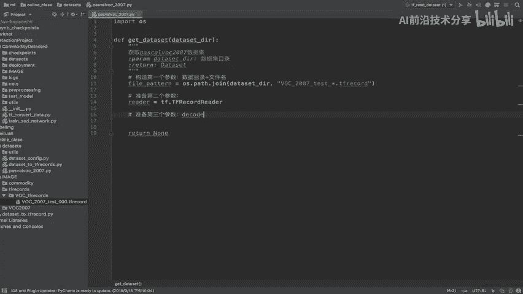

# 零基础入门！一口气学完YOLO、SSD、FasterRCNN、FastRCNN、SPPNet、RCNN等六大目标检测算法！—深度学习_神经网络_计算机视觉 - P44：44.02_TFRecord读取：Dataset准备44 - AI前沿技术分享 - BV1PUmbYSEHm

那么我们接下来直接新建一个这样的文件，我们在online class里面的data size里面新建一个new，一个PYTHFILE，我们取名叫做帕斯卡。

work杠2007的这样的一个read的读取逻辑好，我们在这里读取呢，我们直接啊按照刚才所说的，我们直接定义一个函数，比如说第一个get gu slam啊，直接get这个DATASET吧。

get dataset一个函数，那我们说了get dataset，我只要传进去一个什么呢，我们的数据集的目录以及你的文件文件，我在里面去指定，所以我们直接data set gun d r好。

我们自己指定，DIR我们这里写一下函数解释，获取数据集帕斯卡，work的一个数据集啊，2007好，那么这个就是我们的数据集目录好，返回呢就是一个data set协议，data set一个规范协议啊。

我们返回data好，return先一个NN啊，那么第一步呢也就是说怎么去做这个事情呢。

其实非常简单，就是我们的DATASET需要什么，我们就给他准备了第一个fl part的，就是你的原来的数据的一个路径加名字。

所以我们构造一下啊，我们直接构造构造数据，构造第一个参数就是我们的data source，就是我们的数据集目录加文件吧，目录加上文件名，那我们这里直接比如说FIGUP。

a t t e r n pardon等于，那么这里我们要用到，就是将目录与我们的名字啊匹配一下，然后我们直接导入我们的OS啊，OSOS点pass，点joy。

将我们的DATASETDIR与我们的文件夹名字好，那我们的这个文件夹名字呢，就是本身就叫做这个对吧，它是一个匹配啊，你要把所有的都读取出来，应该在tf records里面，所有的都读取出来。

所以呢我们直接按照work怎么匹配的，work杠2007test呢，我就直接指定了啊，test指定，然后我们干哎新啊，或者说你直接新就可以干新点TFRICORD，这样是不是就匹配好了。

是不是这个目录下面的，所有这个这种的类型的文件都读取出来，但是你这个地方到时候呢，我们在项目当中说要解耦合的时候对吧，哎或者说把这些这个变量呢，都以一些这种字符串啊去匹配好，那么第一个参数准备好了。

那么第二个参数来看reader，它是一个TFRECORREAD的一个东西。

那所以就是我们所说的这个东西好，我们直接准备第二个参数好，reader等于tf record reader，那么接着我们就准备哎准备decoder，准备第三个参数。

Decoder d c o d e r。

那么这个decoder分为两部分，我们说了，它分别为一个kiss等于two features的，一个是items to handles的，那这个地方我们就不自己去写了。

比较耗时间，那所以呢我们直接把这个这地方的两个地方呢，啊直接粘贴过来。

好我们把这里粘贴过来，那么kiss to features当中，就是指定你原来存储进去的所有的格式，你全都按原来的格式进行反解析啊，解析一个序列化之后格式啊，反序列化反序列化的格式，那么然后呢。

第二就是你要把讲反虚化了层的高级格式指定，也就是说你用户操作的这个格式在这里，那么其中有y mini x mini这些东西呢，我们是在这里来看到，原来我x mini y mini里面存的是什么。

是不是每一个里面都有多个对象的一个列表吧，是一个列表，一个列表，它在这里呢，我们会默认读取每个列表的第一个元素，或者第二个元素诶，放到这里面，就将第一个对象组成一个列表放大进去了，能理解吧，好。

那所以呢相当于啊相当于是原来是这种格式的，我们把刚才的这个文件打开，Java data set to。

这个地方相当于是从这里啊变成这样子了，然后呢我们反解析的时候，这个地方，我们把它放到上面吧，放到上面去解释，其中啊其中我们的这个包b box宽，并瓦是关，原来是从这个到那个对吧，现在不一样。

现在默认只读取一个，它返回值返回一个啊，返回一个，那么就相当于把这个把这个第二个删除掉啊，返回一个，它默认都读取第一个变成了好，变成了这样的一个格式，能理解吧，把这里变成一个这样的一个列表。

我们把这个放进删掉，把它翻掉，变成了二十三四十六，二百三十四十三都通通放在b box指定这里面了，包括其他的label啊，Difficult，还有trunk的，全部都在这里面好这两个参数指定好之后呢。

我们直接啊我们构造decoder了，decode构造decode。

我们要用的是什么呢，就是这样一个函数叫slim t f example。

点decode哎，点tf example decode，然后把你的两个参数传进去就OK了。

那么第一个参数就是keys to features，还有一个就是items to handles ds，返回一个DCODER等于这个值，那么接着我们直接参这几个参数，是我们直接需要自己去做的。

其他参数我们直接指进去了，那么我们就要用到TF点啊，slim点这个true这个data size啊，DATASET这个东西，slim点data set点data set大写的DATASET。

第二个是大写的，那所以我们先导入我们的slim就行了啊，我们把这个地方呢slay导入进来，那么我们这里直接slam点小写的DATASET，下面的大写的data set，我们看一下这里有没有问题啊。

小写的DATASET，大写的D第一个参数好，那我们接着呢就来一个参数，一个参数的去指定第一个参数是什么呢，我们把这个地方啊就先把这个删掉好，那么第一个参数就是我们的data set source啊。

Data set source data，我们把这个也直接把这个参数翻翻过来吧，这个参数我们没有写到前面DATASET，那么dataset source等于我们前面的，是不是我们的文件夹加路径啊。

哎第二个就是我们的reader了啊，我们把这个呢reader拿过来，以及我们的reader分装一下啊，那么然后是第三个参数decoder啊，decode我们直接用decode就OK了，比如说第三个参数。

那么后面几个参数我们就随意指定就行了对吧，直接指定name samples等于等于多少呢，我们一共有4952个，当然我们等下要把数据集呢，也得全部得给转换成功啊，然后呢我们的一个对于数据集当中。

你取出来的数据的一个描述的字典就OK了，然后把这个字典数据呢来数据集的描述，字典在这里写上数据集的描述，数据集返回的数据集返回的格式描述字典，这个你可以去自己写一下。

那么最后呢就是我们一共有多少个name classes啊，它这里没有提示，我们直接呢复制过来，name classes等于啊20个，Ok，那这样的话相当于是我们把这个数据。

DATASET的格式就已经返回出去了，那我们直接return data set，把我们的格式呢调整一下，好，这就是返回的所有的数据了，那么到时候你读取的provider的时候呢。

你直接去获取这里面的这个指定的名字就OK了，好那么这部分呢我们代码就写结束了啊，我们从一开介绍了一下他的逻辑，然后呢我们自己去写一下，那么我们最后呢总结一下啊，总结一下进行DATASET规范读取。

我们主要用的一个类是什么，Same name，点DATASET，点大写的data，小写的set好，那么这里面需要准备的这几个参数，我们必须得知道啊，必须得知道，包括DATASET。

干这个SOURCES以及reader，还有我们的decoder，这是比较几个重要的，那么其中我们会涉及到准备啊，这第二个参数对吧，我们把这个呢重要的API都粘贴到这里来啊，大家呢自己看这笔记的时候呢。

你直接看这个重要的API，你会不会去使用就OK了，还有包括这个，那么这其中呢会指定你两个，这样的一个数据格式啊，字典的一个数据格式，我们在这里面把粘贴进去，粘贴为成本好。

然后我把这个几个啊直接给这个加粗，这几个API是比较重要的好，那么这样的话我们准备DATASET规范。

