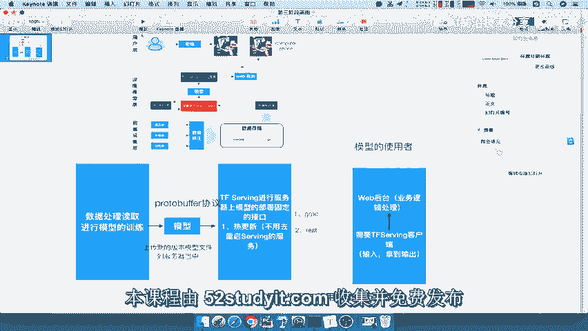
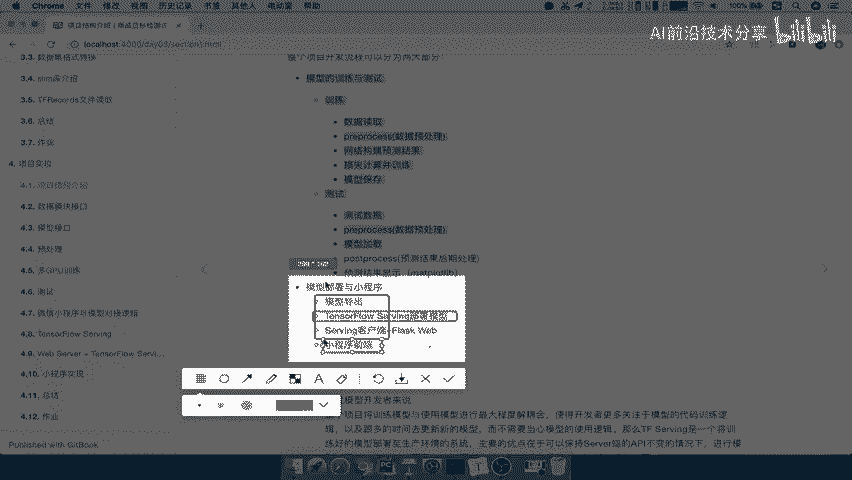
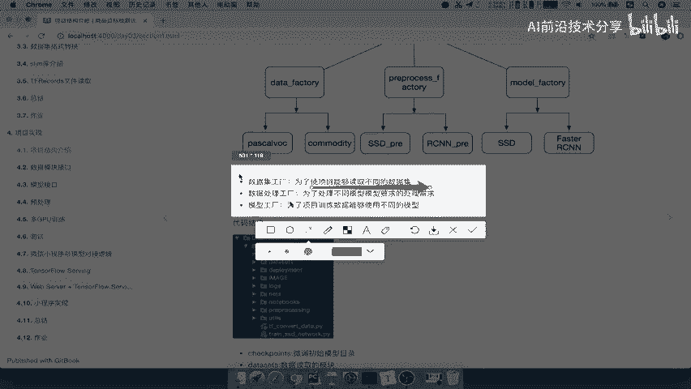

# 零基础入门！一口气学完YOLO、SSD、FasterRCNN、FastRCNN、SPPNet、RCNN等六大目标检测算法！—深度学习_神经网络_计算机视觉 - P48：48.02_训练与测试整体结构设计48 - AI前沿技术分享 - BV1PUmbYSEHm

好，那么我们刚才解释了我们整个项目的一个架构，对吧，以及我们这样的一个设计，那我们接着来看啊，所以我们整个开发流程呢，我们可以分为两部分啊，一部分呢就是相当于是模型的一个训练测试。

也就是我们刚才所说的这一部分啊。

这一部分的一个训练测试，那么我们这里主要是什么得出模型嘛。

那么另外一部分呢我们来看另外一部分。

主要就是模型的一个部署，当然这里面提到的小程序啊，只是我们一个借助的一个平台而已，所以我们的这个web的客户端，相关的一些代码编写啊，我们不管啊，我们不用去管。

所以呢我们大多数是比如说你TENSORFLOW，serving部署的这样的一个模型怎么去写对吧，这这样的代码以及我们的serving，客户端的代码去怎么编写，来看到这个两个地方，这个地方和这个地方啊。

应该是这三个，那么这关于这个什么flash web呀，它web的这个东西怎么去启动啊，怎么去用啊，这个东西啊你会就会对吧，那不会是没有关系的，对于我们做这个我们模型的开发者来讲啊。

我们的这种这个目标检测的项目来讲，是不需要掌握这种web的东西啊，相关去做的那更不用说了，小程序的前端。

这个我们都是拿来用一下就行了啊，我们都是已经弄好的好，那所以分为两个部分，那我们要关注的重点呢是在第一部分后面，都相当于是一些配置啊，啊包括你导出啊，怎么用啊对吧，接口怎么去解释。

那么我们重点还是在前面这个过程，模型的训练与测试，那么训练和测试呢，他会都有自己的一些步骤对吧，怎么去训练，怎么测试的一个流程，这个我们在后面呢会详细去说的。

那我们首先来看第一个部分，就是模型，模型的训练怎么办啊，怎么去训练，首先我们就要想到我们现在有什么东西啊，也就是说我们现在这个训练的架构怎么去设计，这是我们注意了啊，这是我们训练部分的啊。

不关什么部署啊，训练部分的代码，代码的架构设计，怎么去设计我们训练代码，现在我们要想我们现在有的几个模块呢，就是我们的数据模块啊，数据模模块，还有我们呢模型网络是不是这些啊。

还有什么我们的这些处理过程啊，每个模型呢它的预处理它的要求是不一样的啊，处理到不同的图片大小是不是也不一样啊，包括你处理，那所以我们想要做的事情，是设计这样的一个架构流程，我们把这个呢拿过来。

我们想要做的这个事情，就是说我训练和测试能够去使用这三个部分的，这样的一个东西，Data factory，process factory以及model factory，分别代表，比如说我们称之为啊。

数据工程与我们的预处理工厂，我们的模型工厂什么意思呢，我们要用训练的时候，比如说我想我这个想去训练一个模型的人啊，我们想去训练，那我想去干嘛呢，我想要去帕斯卡去训练。

拿帕斯卡数数据集work数据集去训练，然后呢我又想拿其他的commodity数据进行训练，还有呢比如说再有其他image的数据集训练，那么这个过程就涉及到你要选择数据集，而且当你数据集选择之后。

你要选择你的模型算法代码了，而你的算法模型吧，那么所以有可能会选择说SSD啊，还是faster s e n呢，还是一个更好的或者yo啊等等，那所以就是涉及到，我们去选择这么多东西的时候呢。

我们想要做的一个目的就是什么呢，我们要达到模型与数据之间解耦合，那么我们数据与数据，数据与数据也不会相互干扰吧，数据与数据不相干扰啊，或者数据与数据之间，不相互，这个是干扰，那么也就是说啊。

我们要去达到模型与模型之间，模型与数据之间解耦合，数据与预处理之间解耦合，接预处理跟我们模型有经验和解耦合，能理解什么意思吧，我可以在这个地方。

我在上方想要选择好，我现在就让你去试建立一个模型，我想要选择什么呢，好我随便挑一个好挑comedy的数据集好，我现在又挑一个挑RCN的这样一个这个算啊，RCN的算法在这边啊，在右边fast cn的算法。

然后呢对应的处理需求可能要用这个需求，我就可以去随意地享用这三部分的一个，每一部分去进行处理，能理解吧，我就可以随意的想要用任何一个去组成一个，新的模型好，这所以就是我们训练部分代码的逻辑。

相当于是三个工厂一样，我让每一个工厂能够取出我相应要的东西，然后组合组成我们一个新的这样一个模型，能理解吧，这就是我们需这个项目代码设计的架构，设计的一个初衷，只要我们假设说啊这个达到结耦合，当然是。

只要我们假设你现在有个新的数据集来了，新的数据集来了，好新的数据集来呢，我只不用管，我只要把这个新的数据集先准备好，Tv records，准备好对吧，我只要比如说我只要转准备好TFRECOR。

数据这个文件，然后呢我在这里再增加一个它的一个模块，或者说这个工厂下面的一个子模块吧，哎我只要把增加这个数据工厂，工程数据工厂下啊，增加数据工厂下的一个这个数据介绍啊，然后包括读取逻辑，OK了就OK了。

是不是就OK了，那你就不需要说关心啊，我到底模型还要不要模型，要不要去再重新做一遍对吧，你的这个使用它数据的时候，我是数据模型没有解耦合，那我还得去改这个模型，这个选择模型的时候呢。

它的一个之间的一个代码，那就不需要了，我只要去来了，新数据集在这里一替换好，我在这里还照样选择其他的东西，能理解吧，所以我们最终的目的，训练部分代价在这样的代码架构呢，主要就是模型与数据之间结耦合。

数据与预处理之间，结果和预处理与模型之间结耦合，三个三个之间都减两两之间解耦合，能理解吧，好所以这就是我们这个作为我们训练代码啊，要进行一个啊它的一个架构设计，就训练部分的代码架构设计。

那么所以呢我们这个看到这里。

我们的数据工程哎，为了能够读取不同的数据局，数据处理工程，能够处理不同模型数据的要求，然后呢模型工厂能够使用不同的模型。

就是这样的一个啊方法，那么我们的代码架构呢，在这个文档当中啊，我们给了这些代码的一个文件夹安排，这个文件夹安排呢我们先不用看那么多啊，不用看那么多，这也就是我们完整的一个架构。

那包括其中每一个目录的它的一个作用啊，每个目录的作用包括data size，重要的啊，data size模块。

PREPROCESSING模块，以及我们的这个nice模块啊，这三个模块是比较重要的，其他都是一些配置的相关的一些这个文件夹，到时候我们会一一的去添加。

那只要关注这三个，所以呢这就是我们整个文件夹的啊，它的这样一个构成，就是每个文件有自己的一个意义，那么训练代码架构设计意义呢，这个我们刚才已经说了好，那么这就是我们的训练部分的代码的架构设计，能理解啊。

不是部署的相关的一些这个其他的好。

