# 零基础入门！一口气学完YOLO、SSD、FasterRCNN、FastRCNN、SPPNet、RCNN等六大目标检测算法！—深度学习_神经网络_计算机视觉 - P50：50.02_数据接口：读取数据接口设计以及基类如何定义50 - AI前沿技术分享 - BV1PUmbYSEHm

那么接下来呢我们就要去实现这样的一个，读取的逻辑读取tf records，那么在这里我们首先就要设计一下，这个读取呢分为不同数据集，要设计一下我们这里怎么去啊，实现这样的一个代码。

那所以我们这里提出了一个我们数据模块的，最终呢我们是要通过TFREX去读取，会对应到不同的数据集类型，那也就说你帕斯卡数据集，还是我们的comedy数据集，能理解吧，那所以我们这样去设计一个鸡肋。

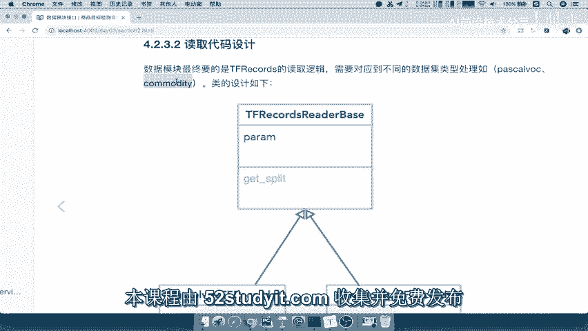

在这里我们把它拿过来。

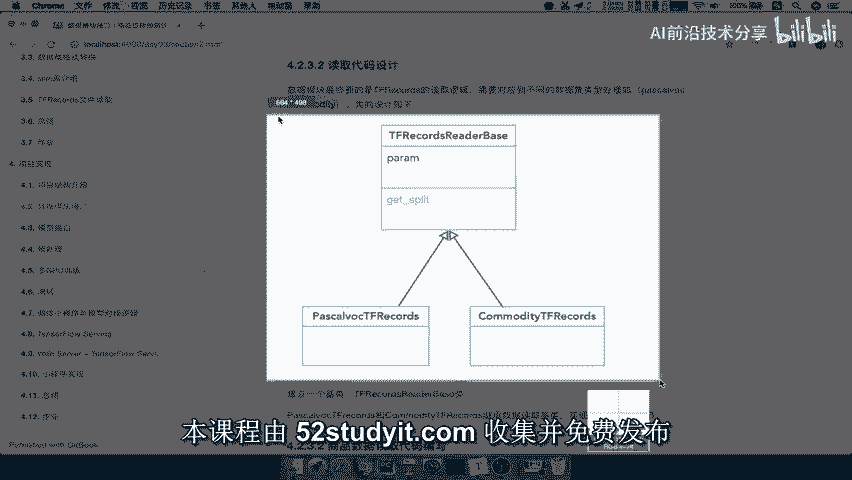

我们设计一个鸡肋干嘛呢，这个鸡肋作为我们的不同数据集的一个积累，那么这个鸡肋呢它比如说里面有一些参数。

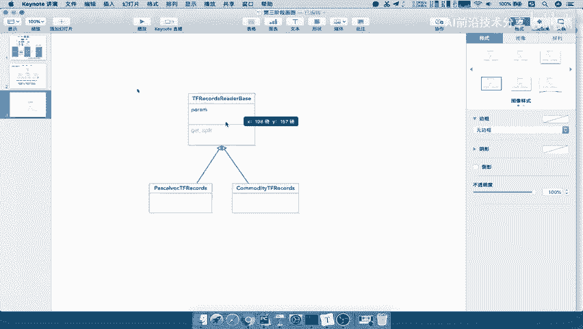

那么这些参数就是对应着我不同的数据集，不同的数据集，我的读取逻辑呢共同去继承这样的一个积累，然后呢我在读取的时候，我只要去选择这个鸡肋，对应的这样的一个什么哎，子比如说他的子子的对象对吧啊。

子类它子类呢去实例化的时候去读取它，它也去读取它各自的，所以我们只要去哎设计一个t f rex reader的，base的这样的一个积累，那么这个积累我们就可以拿来作为所有数据集。

我还可以再加数据集对吧，我们比如说在这边再加两个数据集，你只要把这些数据集呢都继承它，就数据集的类啊，读取的类继承它，我就可以去实现这样的一个哎。

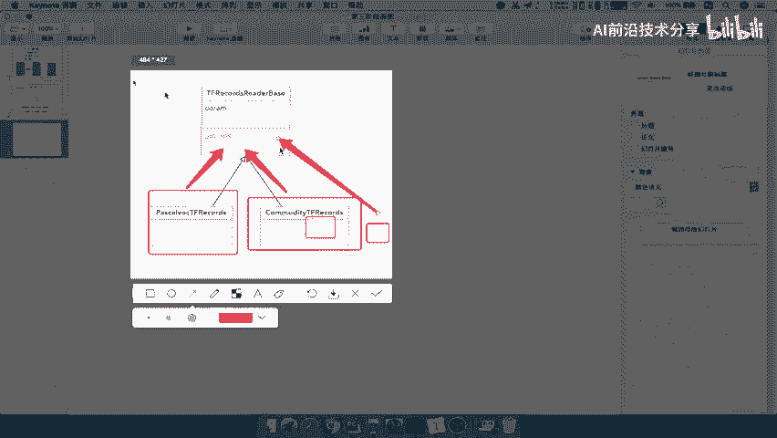

所有的这个读取了，那这是我们的思想，就是我们通过一个积累，去使得不同的数据集能够一起去啊，分发到不同的这个地方的实例化，那我们来看到我们的课件，那所以我们在这个地方呢怎么去做。

或者说我们这个类怎么去设计，也就是说re reader base怎么去设计呢。

那我们就要来看一下不同数据集，它们之间的一个读取特点啊，我们一定要根据真实的一个业务，那帕斯卡work2007是这样去读取的吧，那么这个地方啊，我们这个地方呢就不管了，这个地方先不管。

我们只看这里的读取，返回一个DATASET这样的一个这个数据的一个规范，那么我们来看一下这里面会用到的这些信息。

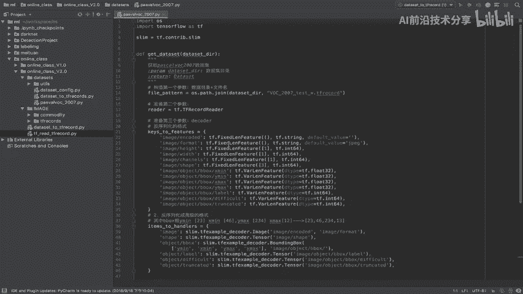

比如说我们的数据集的一个匹配的一个路径，对吧，它的文件名，然后呢我们数据集当中会用到哪些呀，如果我们把这个东西换成commodity，2018的数据集，你想你要替换哪一些，这中间要不要替换。

需不需要替换，不需要吧，然后呢我们要替换的东西都是一些，比如说community里面的总共的样本数，训练集和测试集的样本数是多少，然后他的描述是什么，然后它的一个类别数是什么。

比如说我们的community是八个类别，那在这里填八，所以我们在想对于这两种不同的数据集来说。

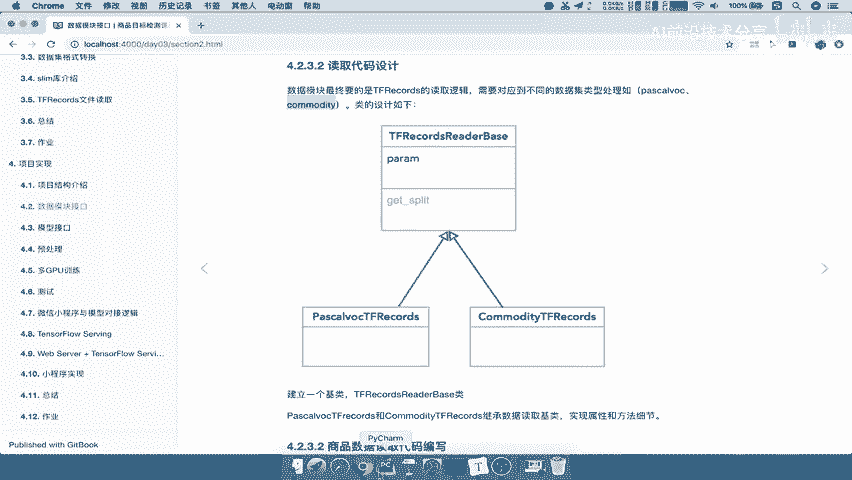

把这两个数据集的共同的东西啊。

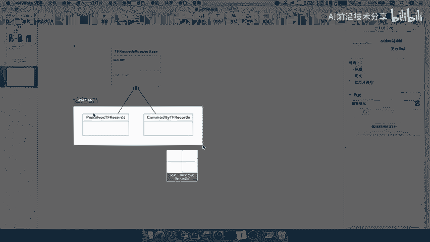

我们可以作为或者不同的东西，作为我们的参数吧，所以在这里我们说不同的数据集的配置，不同的数据集的配置作为一个初始参数，就类似于这地方的para啊，pa parameter啊。

parameter就是参数的意思，所以我们会增加我们的这样的一个属性来啊，增加一个属性，来使我们的这样的一个啊鸡肋呢或子类，都有自己的这样的一个配置参数，大多数对于数据集的一个描述能理解吧。

好这是我们通过刚才分析得出来的一个参数，那么我们当然要去获取，还要通过一个方法吧。

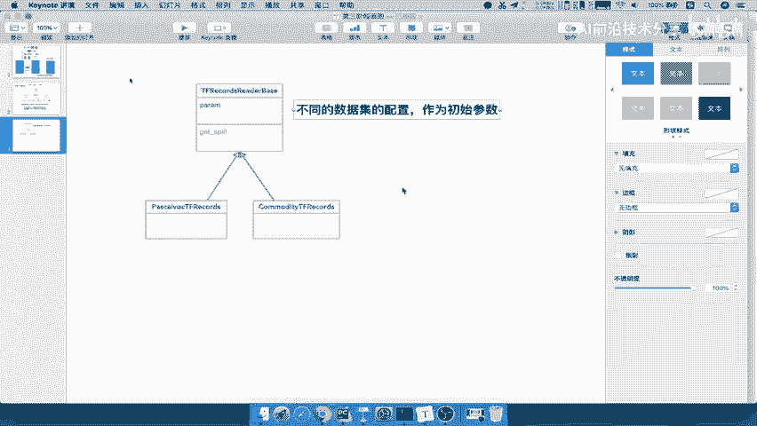

那所以我们可以在在积累当中定义一个方法，比如说就叫做这个方法啊，或者你其他名字共同去啊，只要子类调用这个方法就去获取我们的DATASET。

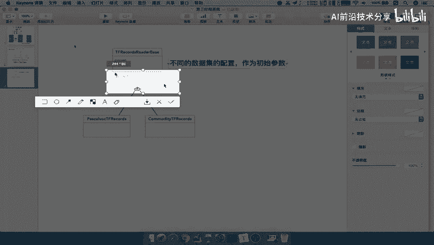

数据规范，能理解吧，所以这是我们的设计的一个初衷，看我们的这个数据集，它里面有哪一些需要去进行统一的，进行一个配置的好，那我们回到我们的这个课件当中，那所以呢我们的设计呢就是这样的啊。

建立两个子类继承它一个积累，所以我们第一就是要去定义这样的一个积累，那我们这个鸡肋放在哪里呢，啊我们的这个鸡肋放在哪里呢，一般我们把这种激烈啊。

都会放在我们的公用组件，也就是哪里啊啊YOUTUS里面，所以我们在这个地方，YOUTUS当中，DATASETYOUTUBE当中，我们去建立一个啊，建立一个数据及读取的积累，那么比方说我们的名字。

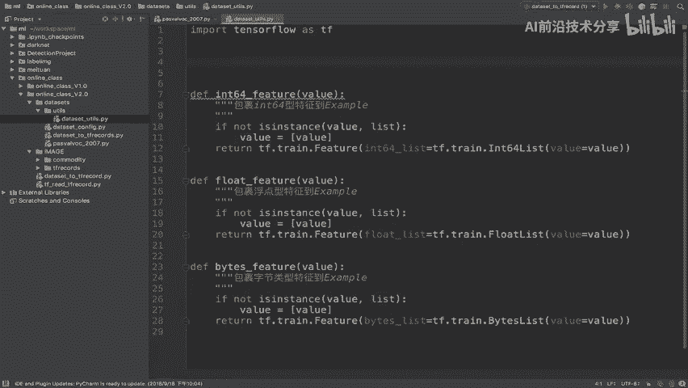

还是跟刚才所说的一样啊，class我们把这个名字复制过来。

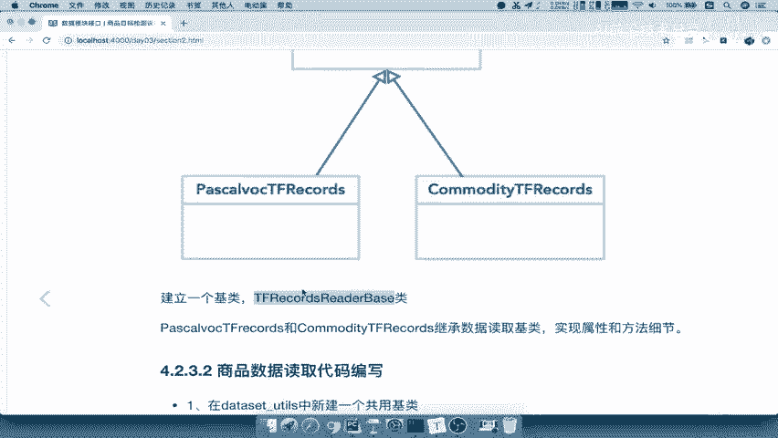

class定义一个这样的，那么它呢继承我们的object基类，好，那么这里呢是我们的数据及数据及积累，好积累，那么这个积累当中呢，我们有一些参数，比如说我们初始化的时候让它接收一个参数。

比如我们就叫做PAIM好，这个参数呢会到我们的哎这个类当中的，私有的方法啊，私有的这样的一个属性，PAIM好，这也是我们的第一个这样的一个啊属性，然后呢接着我们说了这个类呀，除了有这样的一个属性。

装入我们的不同数据集的吧，哎PARAMA啊，pam parameter是给不同数据集的，不同数据集的这个属性使用配置能理解吧，好那么接下来呢我们要建立一个方法，这个方法呢我们呢就直接取个名字对吧。

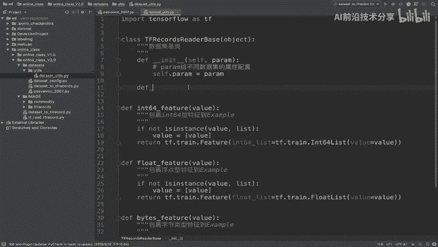

我们要通过这个方法去获取我们的数据吧。

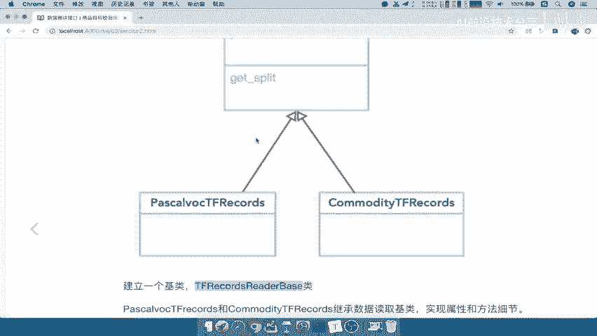

所以get杠data这个data get data呢我们取的名字叫data啊，那么我们说这个地方我们应该传什么参数，就是说我们鸡肋在运行这个使用这个地方啊，我们的这个子类在使用get data的时候。

应该传什么参数啊，所以我们就要涉及到哎passl work里面当中，我们是不是有传了一个data set dr啊，说我们这个地方要考虑把DATASETDIR，DATASET干DIR有没有加进来。

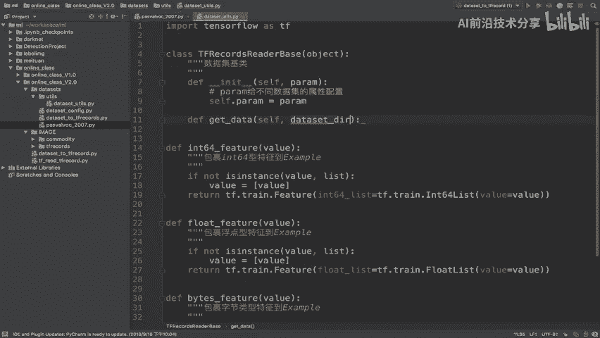

然后我们再看这里面到底还有没有需要，我们传的参数，有没有需要我们传的参数，我们仔细想一下，在这个模这个里面有没有需要再传，要继续再传的参数呢，我们可以看到其他参数，很多参数我可以作为一些属性。

比如说你的这些值，这不用，这可以通过配置文件读取，我们有一个地方，就是在VOC2007test这个地方来看到work，2007test，我是不是要指定你是train还是test吧。

能不能理解我在训练的时候，比如说我现在运行训练代码，现在运行训练代码，我是不是要指定一个哎训练训练的时候，我要指定读取训练数据集的代码，是不是就OK这个数据吧。

因为他的名字就是work这个什么commodity，2018，或者说work201007，Gtext，或者干train嘛好，那所以呢我们在这里直接啊，或者比如说你测试要指定测试的。

所以我们在这里要传一个参数，就说我要指定train还是text能理解吧，所以因为我传进去，我要求去训练的时候，我不指定train test，你怎么知道我要读取train的数据集。

还是读取test的数据集呢，你怎么知道是训练哎还是测试的数据集，你说你怎么知道不行呢，所以呢我们在这里啊保存一下训练读取的啊，训练数据及基类设计这个参数。

所以我们除了这个DATASET传进来之外，其他的当做我们的一些数据属性之外，我们的YOUTUS当中这个方法我们还得传一个，比如说train gun or杠test，传一下是train还是test。

能理解吧，所以呢我们在这里写一下，这个就是数获取获取数据规范，注意啊，这就返回数据规范，这里呢我们就return now，积累当中，这里就选择是train or test数据文件。

然后呢我们的DATASET就是我们的数据集目录，不同的数据集目录都可以传好，这样的话我们在DATASET干YOUTUBE当中，注意啊，我们把这个DATASET跟YOUTUS当中。

实现了我们这样的一个数据的一个积累吧，哎设计了这样的一个积累，那么包括它的方法和属性啊，方法和属性好，那么这就是我们第一步啊，在作为数据集的这一步好。

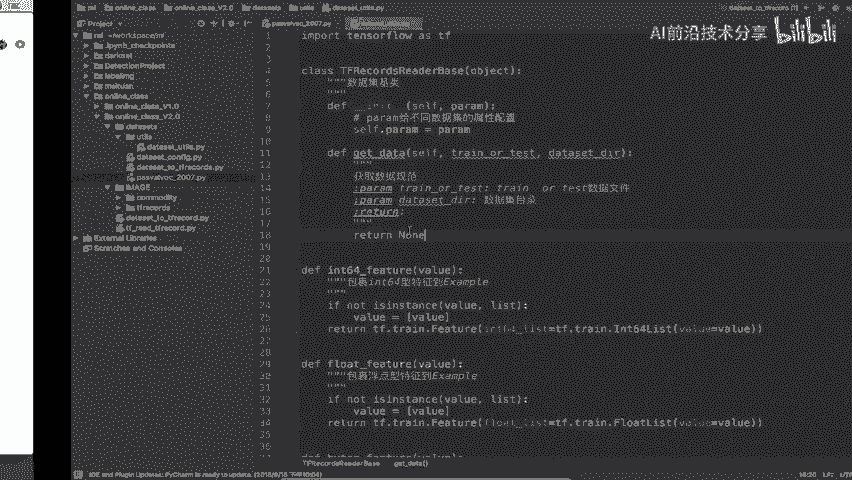

所以呢我们在这里先写一下读取，这是第一个我们总结一下，在这里第一个我们的第二个我们读取数据集，那么我们设计的设计一个读取数据的积累。

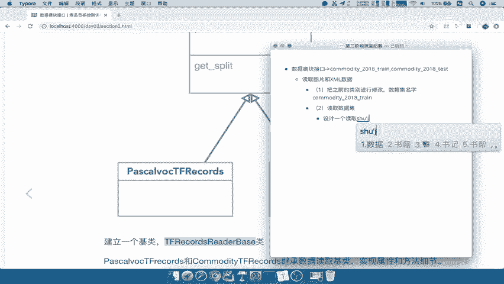

那么其中我们会有这样的一个方法啊。

我们把这个呢可以粘贴过去，好我们把这个粘贴过去，那么我们接着，接着呢我们再说了，这个地方呢我们需要去哎，放到我们的data set youtube当中，然后我们要去单独去处理每一个数据集读取类。

继承它它吧，哎所以呢接下来就是要去哎继承继承基类，继承基类，处理不同数据集类好。

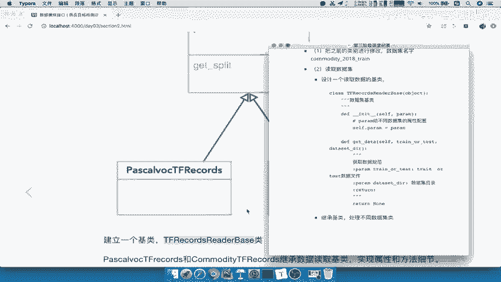