# 零基础入门！一口气学完YOLO、SSD、FasterRCNN、FastRCNN、SPPNet、RCNN等六大目标检测算法！—深度学习_神经网络_计算机视觉 - P52：52.04_数据接口：数据读取工厂逻辑实现52 - AI前沿技术分享 - BV1PUmbYSEHm

那么刚才呢我们把这个商品数据集，2018的这数据集的读取逻辑给改完了，那么我们再先总结一下刚才的这个流程啊，我们做了哪些事情，那么我们做设计了鸡肋之后呢，我们继承鸡肋。

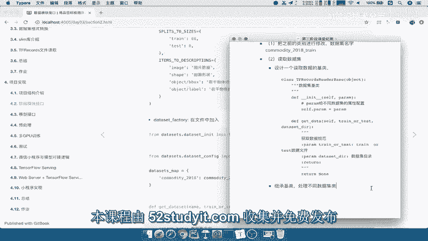

也就是说我们要去做不同的数据集的，一个继承啊，我们使用商品COMMODATE，tf records去继承我们的哎一个积累，计算机类呢，我们会在这个商品数据集建一个目录啊，DATASET目录。

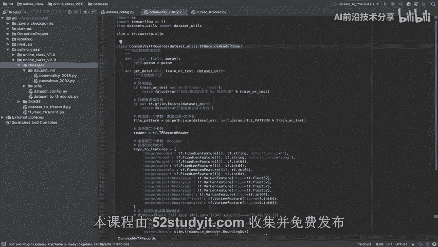

建一个dataset in it对吧，我们这里呢就建立一个啊data set杠INIT目录，那么在这个目录下面呢，我们去实现不同的数据及读取逻辑。

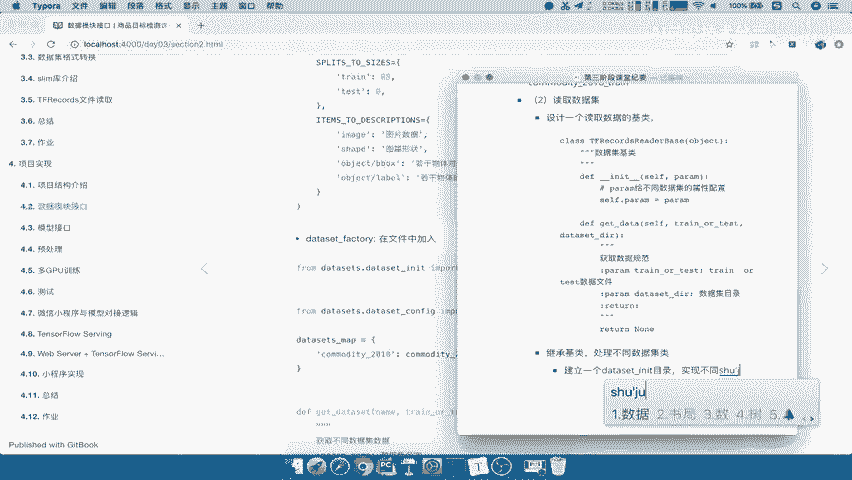

那么其中呢我们在这里啊，我们用了这样一个类去继承。

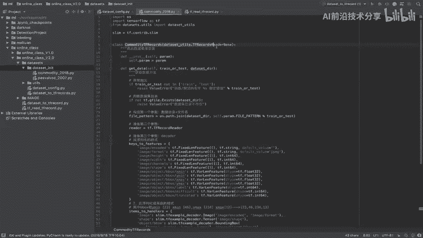

我们来把它粘贴过来，以及呢我们在这个类里面呢，我们去哎实现了属性以及我们的方法，PARAMER属性啊，我们用了一个什么命名字典吧，哎命名字典去实现命名字典去定义数据结构。

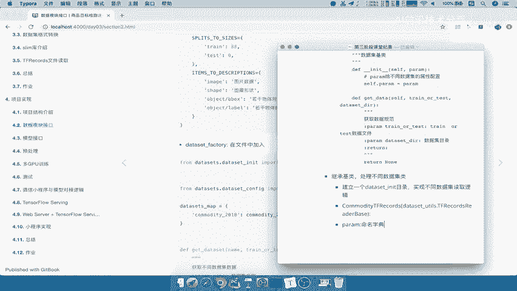

那我们的数据结构里面有这么几个方法，来看到我们有这么几个属性是要定义的。

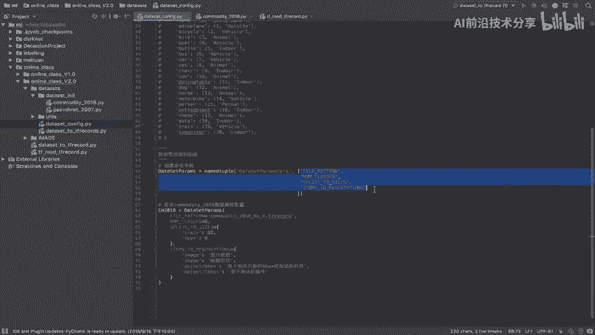

我们把它粘贴到这里来好，那这是我们的PARAMA对。

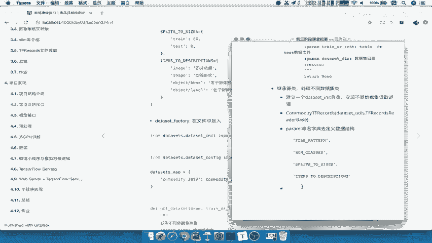

还有我们的方法，这个方法呢我们传进去的呢，就是数据集相关的路径，哎路径以及我们的训练还是测试吧。

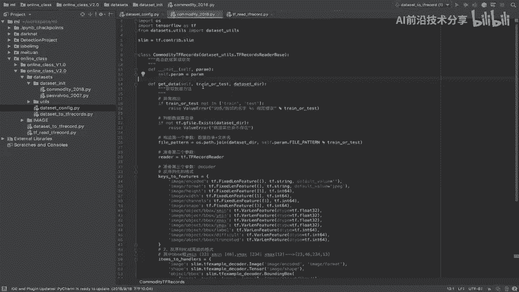

哎用户指定的好，那么这是我们的这个第一个这样的一个，参数指定，那么接下来我们要做什么呢，也就是说我们在定义好了，不同数据集的逻辑结构了，接下来你就要去做一个，就是对外提供一个接口了吧。

那么这个接口我们说前面在说了，是不是通过这个data set factory。

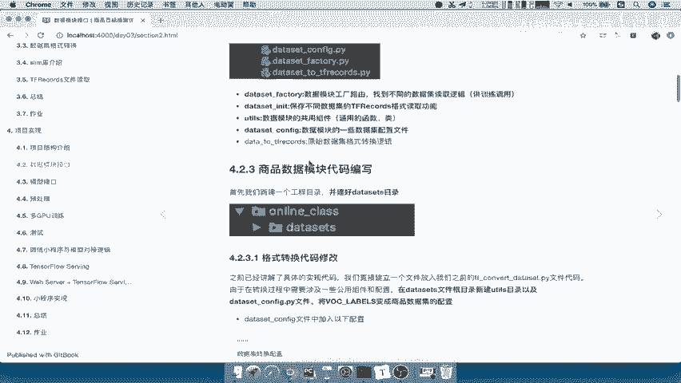

提供给别人去提供这样一个接口啊。

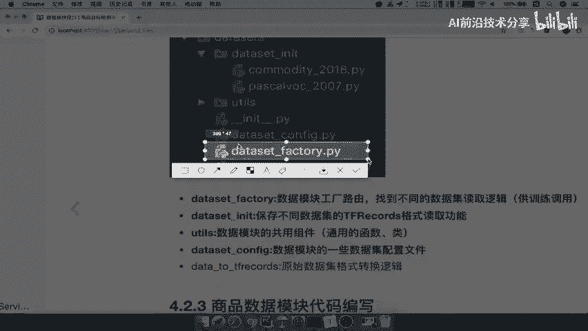

好，那所以我们接着就要在根目录下面，直接创建一个DATASET的factory目录，建立一个文件啊，在这里创建一个new一个data set杠FACTORY，注意是在我们的data sets啊。

这应该是创建文件啊，一个代码文件，这个我们的直接删掉，delete一个在我们的这里啊，创建一个Python代码文件对吧，DATASETFACTORY好，那我们在想这个工厂呢他要做些什么事情。

那么首先我们肯定是要导入我们数据集，这个文件夹是不是要导入，以及我们的配置的信息，数据的配置信息在CONFIG里面要不要导入。

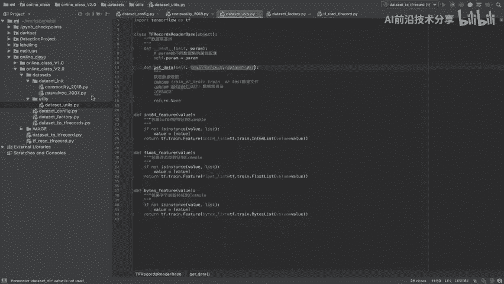

所以我们先简单的来过一眼我们的代码啊，我们先第一眼过过一下代码。

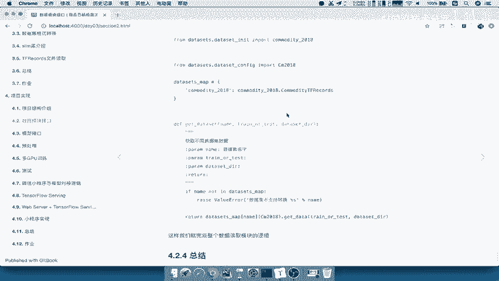

那么我们要把该导入的导入进来对吧，然后我们再定义一个函数，提供给外面训练的时候，调用的一个接口函数叫做get干data dataset，然后呢我指定让用户的去指定啊，训练的人去指定name。

以及你训练测试集以及DATASET一个DR，那所以我们接下来就要去在这里去调用，包括实现这个类的方法对吧。

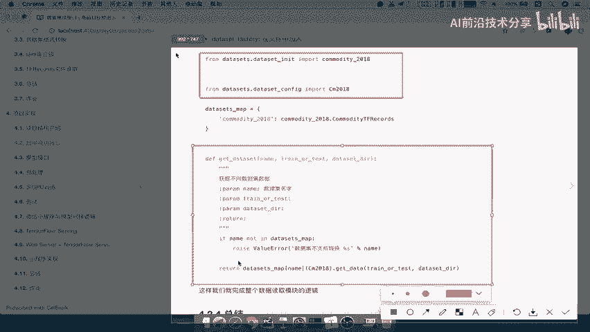

所以按照刚前刚才我们所看的代码，在这里先把啊我们的数据集先导入进来，数据集的处理逻辑from data sets，点我们的，Data set guinit。

import一下我们的什么COMMODITY杠，2018，是不是这个，然后还有我们的配置文件吧，配置文件是不是也要导入进来，所以我们直接在comedy。

在这个啊factory里面from我们的data sets，点我们的YOUTUS点，我们把直接啊把data set guconfig，直接import一下我们的这个参数，这个参数叫什么呢。

叫cm2018，所以我们在这里来调用一下factory啊，2018好，那么接下来我们就要去想想，怎么去实现这个逻辑，我们刚才所说的这个逻辑，我们自己分析一下，我们这里提供给训练开发的人提供什么接口呢。

就我们自己训练开发，我们要提供什么接口呢，是不是训练开发的人的一个逻辑，就是我要提供第一个，它要指定数据，肯定要指定一个数据，什么名字吧，什么数据我这里面得有吧对吧，所以第一个就是数据集名称。

第二个就是，数据名称指定了，我还得指定训练集和测试集，你训练和测试我怎么知道对吧，所以啊指定训练测试，还是测试，好第三个就是我们要指定它的数据集目录吧，就数据集目录的指定，所以我们定义的方法。

第一个get杠data set方法，那么这个里面我们要提的一个就是数据集名字，Data set name，以及我们的train or test，还有data set gd i r好，我们在这里写一下。

训练啊获取训练数据，获取不同的训练，不同的数据指定吧，指定指定这个数据名称的数据文件，那么dataset name呢就是我们的数据集名字，数据集名称名称，那么这个名称呢要存在于当前数据集对吧。

哎你的这个数据当中要存在，然后呢我们的train or test呢就是指定train啊，还是test数据集，data set dr就是数据及目录返回，就是返回我们的一个data set的一个数据规范吧。

还记得吧，数据规范好，那我们在这里return先return一个NN，那我们在这里调用一下呢，简单的去判断一下，如果我们的dataset name不存在，但是这个DATASET怎么去判断不存在呢。

所以跟刚才我们所说的，我们定义一个字典，在这里我们定义一个字典去接收一下，我们如果不在这个字典上面的数据集呢，我们直接报错误可以吧，所以我们直接定一个比如说data size的字典。

定义data size的字典，定义data set，种类的字典，那比如说我们data size，map等于一个字典，那么这个字典我们先保存的就是commodity，COMMODITYCMODITY杠。

2018，然后它的值呢就是我们所要调用函数，也就是说如果我指定好了这个数据集名称，我就让这个数据名称对应下面的这个文件，下面的这个类哎，去调用我们的初始化，去调用方法。

所以我们直接去把这个类的名字呢也拿过来，我们把这个类名字好，我们在CONFIG里面配置一下，就是commodity2018点，commodity tf records直接方法提供。

那如果你还有别的数据在这里配，再配置一个是不是就可以了，他下次用的时候，只要用这个训练的时候指定一下名字。

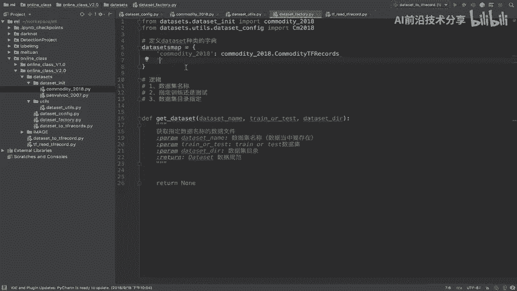

指定名字是不是就OK啦，所以我们的名字呢就指定成这个名字啊，指定我们的名字，这个数据的名字呢我们因为有train和test，所以我们在这里写一下吧，它的初始的名字呢就叫做啊名字叫做这个名称，数据集名称。

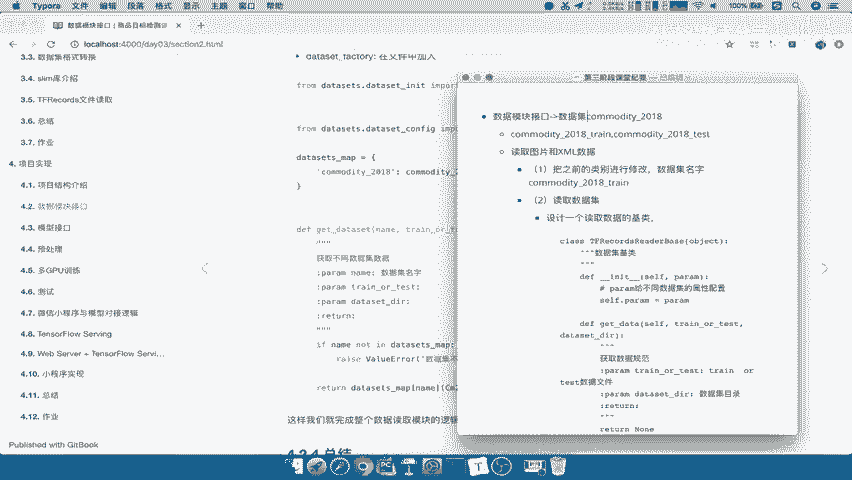

然后呢名称下面有train和test，哎，应该是这个样子对吧好，那么所以我们在这里该电set判断一下，如果我们用户传过来的name，Dataset name，如果不在我们的DATASETS的map。

Not in datasets map，我们用一个杠斜杠啊来注释一下，那如果不在这个字典里面呢，我们就要传承一个错误，比如说value error，报什么错误呢，也就是说数据集不知数。

或者说你所需要的数据集不存在对吧，你所输入的数据名称不存在，你所输入的输入的数据集名称不存在，那么这个名称呢我们把它打印出来，你所提供的不存在好，然后呢把我们的名称给它，哎。

把它传过来的名称给它放到这里啊，2%s好，那么我们接下来就要去调用一下，那这个调用非常简单，我们直接把dataset name直接用这个字典去获取吧，Datasets map。

我们直接返回dataset map里面，我直接指定dataset name，好把这个传过来，是不是就可以调用这个类了，这个类，然后这个类实例化的时候是不是要指定参数，请问这个地方指定参数是什么。

是不是PARAMA，所以我们PARAMA是不是可以传过来啊，将cm2018进行一个传递过来，那么传递过来之后呢，我们就直接调用它的方法就行了对吧，它下面有一个叫get data方法吧对吧。

get data方法，get data方法，然后指定trainor test，还有我们的DATASET，这样好，这样的话呢我们就把整个逻辑给写完了吧，那数据工厂怎么取，是按照这个字典取出对应数据名称。

下面的数据一些的类读取方法吧，是不是直接name，还有cm208，然后获取方法，这个接口我们其他的东西都不对外，不都都不对外的，进一个开放对吧，我只提供一个什么dataset factory。

我只要训练的人调用它，调用这个文件，然后调用这里面的方法是不是就OK了，哎所以呢这就是我们的这样的一个逻辑。

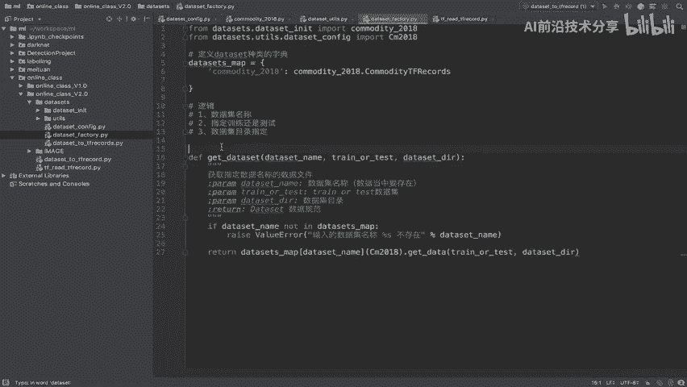

所以啊我们在这里总结一下，刚才的这样的一个第三步啊，第三步就是创建一个啊工数据，数据工厂作用的文件，那么这个文件呢，我们主要是去哎，去调用不同的数据集名称的一个这个路由吧，相当于是一个路由对吧。

到这个或者是一个逻辑吧。

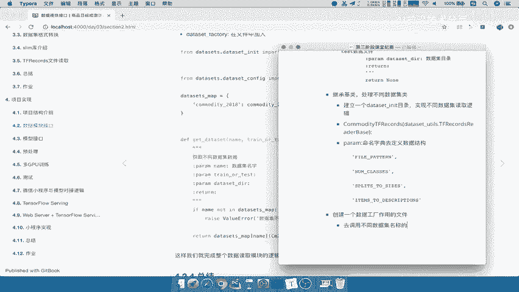

到这个不同的数据集器调用方法能理解吧。

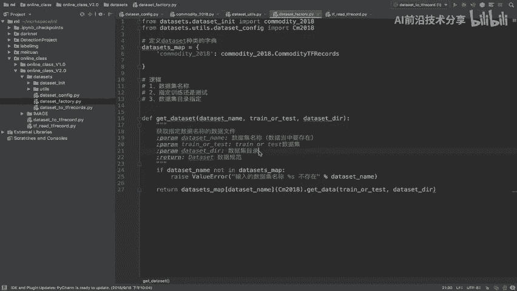

好，那么这就是我们的，创建一个数据工厂作用的文件好。

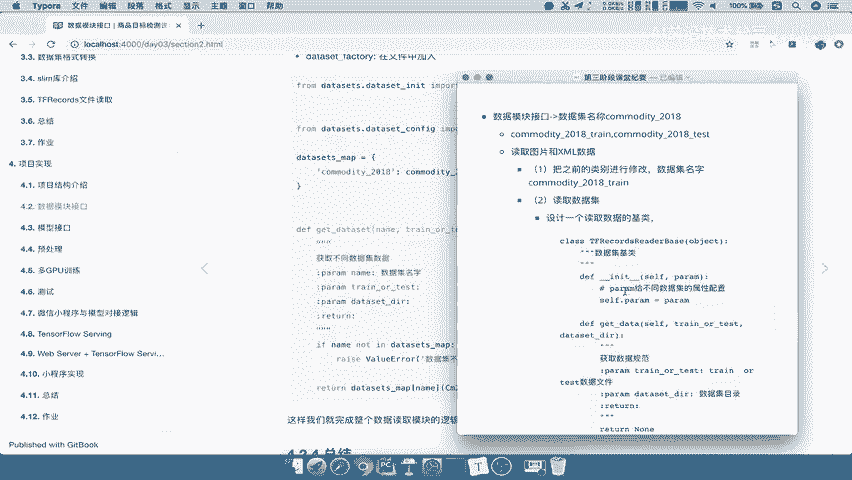