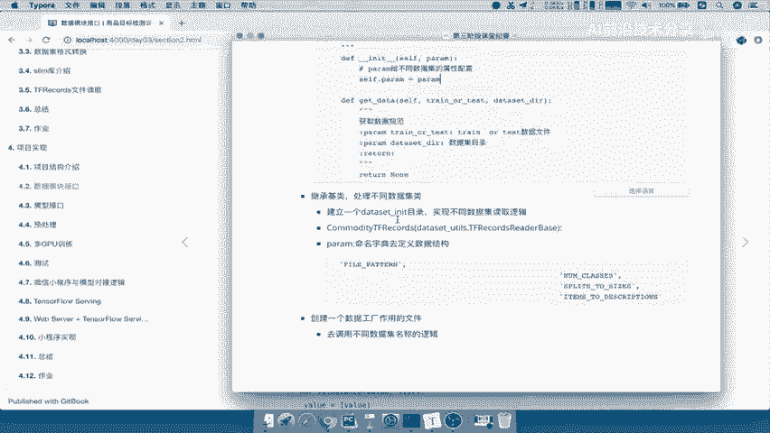

# 零基础入门！一口气学完YOLO、SSD、FasterRCNN、FastRCNN、SPPNet、RCNN等六大目标检测算法！—深度学习_神经网络_计算机视觉 - P53：53.05_数据接口：代码运行与数据模块总结53 - AI前沿技术分享 - BV1PUmbYSEHm

那么我们完成了这所有的逻辑呢，把dataset factory给提供了，提供出来了吧，那所以我们在外面训练时候，我们就调用dataset factory这样的一个类哎，来去实现。

那所以我们用之前我们的这个逻辑，tf read tf record啊，Read tf record，那我在这里是不是要去调用方法，所以我们把原来的给替换出来。

那么就导入from我们的data sets文件下面，import一下我们的DATASET啊，这个工厂data set guf AC t o r y t r y，那么导出这个TFACTORY之后呢。

我们直接去导入哎，这个里面下面有一个方法是不是要调用它，那么这个方法里面的参数怎么填，是不是要数据集的名字，以及数据集的这样的一个测试还是训练，还有我们的目录吧，所以我们这里非常简单。

在这个地方实现一下，在tf read啊，第一个就是我们的数据集名字，我们说这名字呢啊一定要在这个dataset factory里面好，我们把这个复制过来，在这粘贴一下，第二个是什么，训练还是测试集吧。

好我们呢只有一个训练对吧，测试集没有，那么所以在这里指定一个数据集的目录，当前image下面的来数据集的目录在TFRECOR下面，commodity tf recor吧，好所以我们把这个加进来。

T f r e c o r d s，以及c o m o d i t y gut f r e c o RDS，是不是就OK啦，好这就是我们要读取的这一个啊，这个逻辑好，那么我们现在呢运行一下。

数据集目录不存在，我们看下有没有写作image mage，然后呢t f r e c o RDS commodity啊，这里少了一个M，这少个M啊，好，然后呢我们再运行一下，那么这样的话。

是不是我们改了这样的一个逻辑结构之后，是不是同样还是把我们的数据给读取出来啊，打印出了tensor吧，好那么这样的话呢，我们整个数据模块的代码提供给外面的，就是这样的一个data factory。

Data factory，点get set就OK了。

能理解这个过程，那么最后呢我们来总结一下我们的数据模块啊，接口做了哪些事情，一个呢是把我们的读取图片和XML，数据给进行一个修改对吧，不过就简单修改了一个work labels吧。

是不是在这个地方把这个地方替换一下就OK了，数据转换好非常简单，就一个逻辑转换好了，重点在于我们的数据怎么去读取，那么读取的话，我们在这里就提到了一个设计一个鸡肋，那么这个鸡肋就是提供给不同的数据集。

读取的一个逻辑去继承吧，那所以我们这个鸡肋里面又有数据集的配置，参数以及获取方法了。

这个配置参数非常重要，在我们的data config里面进行配置的，来看到这里data config里面当初配置的这些属性，我们在每个数据集是不是只要换了一个数据集。

我就可以在这里增加一个我们的配置文件。

就OK啦，那所以你可以实现不同的一个读取，那继承基类必须得使用我们在在我们的啊，或者说在我们的这个数据读取的这个DATASET。

in it目录，我们会可以将你无数个实现每一个数据集，逻辑的代码都可以放到这个目录下啊，那是不是就可以在这里面可以放很多，很多数据集的读取录啊。

读取的一个逻辑吧，好这就是INIT，那所以呢在这里面要继承它的鸡肋对吧，继承基类，把字典的数据再配置定义好，以及把你的get data给实现好，能理解吧，那么最后呢我们提供给外面的接口的话。

只提供这样的一个数据工厂的这样的一个文件，能理解吧，哎数据工厂的这样的一个文件factory啊。

dataset factory它可以去调用啊，我去获取指定数据测试集，训练集啊，数据集这样的一个目录啊，就OK了，它就可以调用我们的数据了，好那这就是我们所说的啊。

把这个数据的模块的一个进行一个封装好，那么所以呢我们接下来就去总结一下啊。

我们用这个同样用这个插麦呢，去总结一下我们数据模块的相关的一些点。

数据模块哎总结，那么我们首先来讲对于数据模块，我们的设计是什么呢，是目的啊，目的就是使不同的啊使用不同的或者说调用吧，调用不同的数据集读取，是不是要调用不同的数据集啊。

所以我们会设计一个数据集的一个积累，那么这个基类呢啊我们在这里tf records base对吧，那么这个积累呢我们会有两个方法，一个呢就两个这样的一个属性，一个方法对吧。

一个是参数方法以及啊参数的属性，以及我们的get data set方法，一个是获取我们的数据集的一个属性对吧，你配置属性一个获取我们的数据集，那么数据积累我们的不同数据集要去继承啊，继承这样的一个积累。

继承基类，然后呢实现数据的读取操作。

那么这个读取操作呢，我们就可以是不是选择性的使它还是它对吧，这两个选择去读取，那么这是我们提供给外面的一个接口。

那么所以我们提供一个工程文件对吧，那这个我们叫data set，data set杠factory啊，文件给这个训练逻辑使用，是不是这样就OK了是吧，我们这样就实现了训练工程调用不同的数据集。

是不是又就实现了我们所最开始的一个初衷啊，在这里啊，也就是说我们项目结构当中。

我们data factory调用不同的数据集。

我们训练测试都可以去调用吗。

