# 零基础入门！一口气学完YOLO、SSD、FasterRCNN、FastRCNN、SPPNet、RCNN等六大目标检测算法！—深度学习_神经网络_计算机视觉 - P54：54.01_模型接口：接口设置以及模型工厂代码54 - AI前沿技术分享 - BV1PUmbYSEHm

那么接下来呢我们就要去实现一下，我们的网络模型的一些接口了，那么其实在这里啊，对于模型接口来讲，其实是最简单的一次这样的一个接口啊，为什么呢，因为我们的这个模型不需要我们自己去实现。

那它有一些这个现成的对吧，Tensorflow，它实现了一些各种各样的网络模型接口，你可以直接去使用，那么我们在这里啊，我们的设计呢还是一样，跟之前我们需要做的就是模型的建立一个接口。

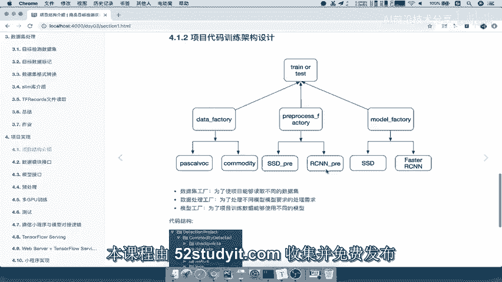

能够做一个这样的一个工厂，提供不同的模型给我们使用吗对吧。

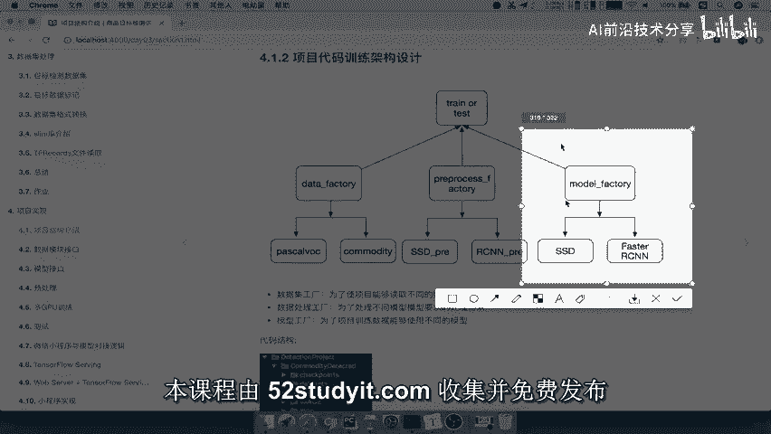

所以呢我们来看一下对于模型接口，我们这里的学习目标。

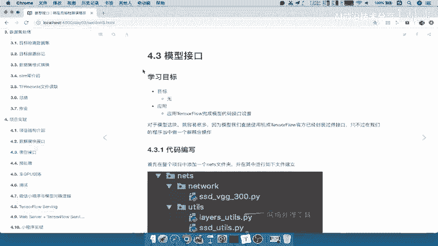

就是应用特斯完成模型代码的一个，接口的设置啊，并不是说我们自己去写了。

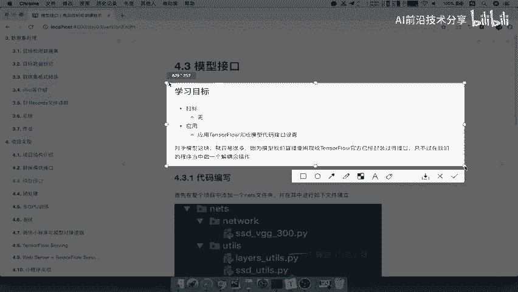

那对于这一块呢，我们的这个目录结构呢是什么样的。

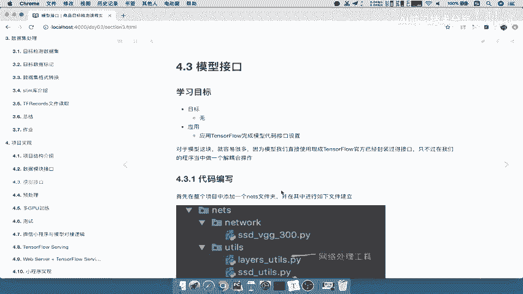

来看到我们整个项目呢，添加了一个叫nets的文件夹，这个文件夹下面我们会新建了这样的一个network啊，这样的一个网络，然后呢，我们的YOUTUS网络所需要的这些源码的工具，文件啊。

就是说但对于SSSDVGG的这样模型来讲，它需要这些这个基础组件，那比如说网络处理的工具，以及我们的这个b box的啊，一些编解码的工具好，那这是两个重要的文件夹。

那剩下这个呢就是我们要编写的这样的一个，网络工程对吧，我们会映射到不同的这样的一个网络好。

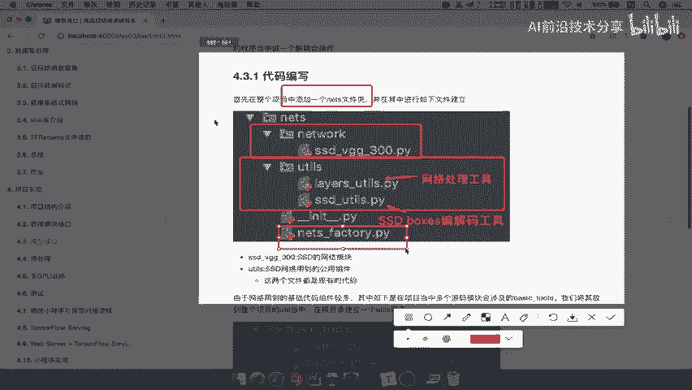

那么除了对于这一个这两个YOUTUS来讲啊，其实在这个SSDVG300当中，它还会用到很多其他的基础组件，就是说一些基更加基础的工具。

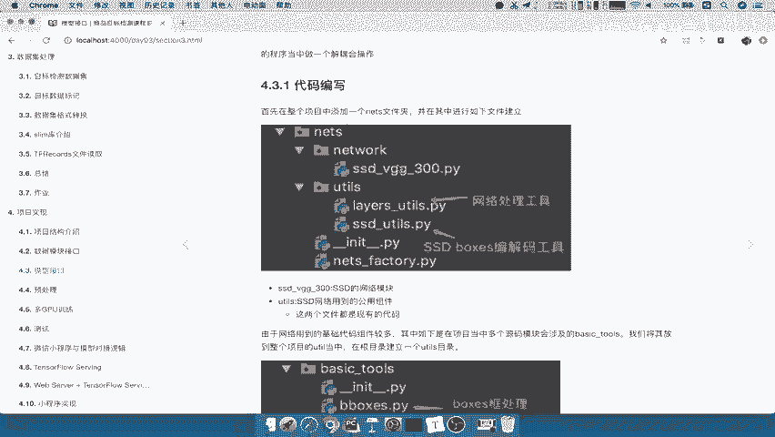

那么这些基础工具呢，它会在很多模块当中都会用，比如说预处理的模块，我们自己去测试的时候，也会去使用这些方法，所以我们将这些方法统一的放在，我们根目录下的YOUTUS，也就是说建立一个全局的YOUTUS。

将我们basic tools放进去啊，这些也是已经有现成的这样的一个工具了，不需要你自己去编写这些工具了，能理解吧，比如说你的b box宽的处理，其实在前面也会用到它，那么你的过滤方法。

NMMS这些方法也不需要你自己去写啊。

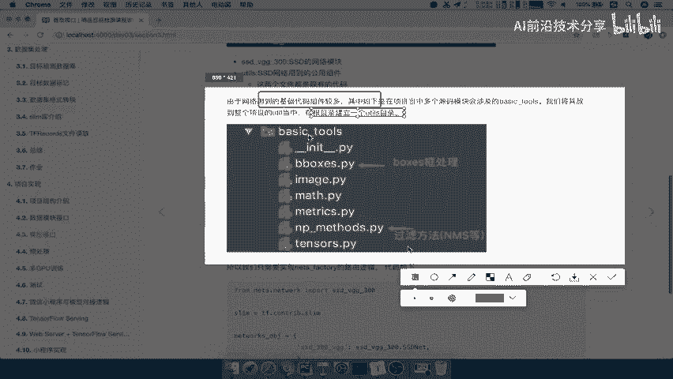

非极大一致好，那么这个这样的话呢，我们先来把这个目录结构呢来实现，然后再把这样的一个nest factory啊进行一个编写，那对吧，我们这样去按这样一个顺序去做，那首先呢我们对于这样的一个目录啊。

对于我们的这样的一个第二版本的，我们再复制一个版本过来对吧好，我们在这里复制添加一个版本，那么我们把它命名成3。0。

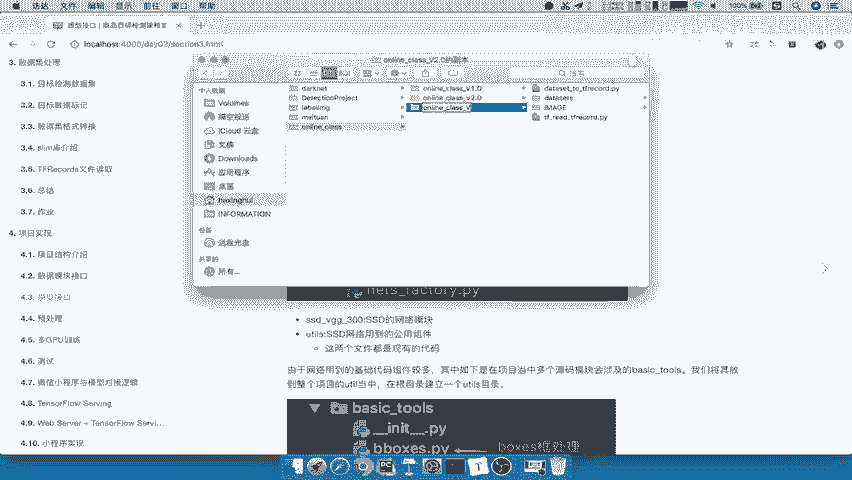

那么对于3。0来讲呢，我们直接从这边去进行一个操作，我说了，我们第一步先建立一个我们的啊，网络的模型文件嘛，好我们new一个directory，那么我们就取名叫NE，对于这nets下面我们有两个文件夹。

一个YOUTUS，一个啊，我们的net的network好，我们新建一个YOUTUS，还有一个，好我们就要做这个net model吧，我们去改一下，那么nice model里面放我们的模型文件。

那我们直接从啊这个项目当中啊，我们最开始的这个完整的项目当中拷过来，我们这复制过来啊，复制到nice model当中，然后呢我们的YOUTUS当中的这个工具，我们也要把它拷过来好。

那么这两个工具拷好了之后呢，对于我们这样的一个模块来讲，要实现它的一个这个文件夹啊，我们实现模块的话要新建一个啊杠杆INITINIT，点PY好，那对于之前的这个DATASET来讲呢。

也要新建一个这样的一个杠INITINITPY啊，好那么我们来看next model，还有包括我们的YOUTUBEYOUTUS当中啊，SSDVGG当中所用到的这个模块相关的啊，这个目录呢不能啊有错误。

包括啊我们的这个基础组件，所以呢接下来我们把基础组件呢，也直接复制过来，基础组件在YOUTUBE下面的basic tools好，我们复制一下，注意了，这个基础组件是我们很多模块都要去使用的。

所以我们在这里新建一个根目录，下面的一个YOUTUS，好，在这个YOUTUS下面，我们把basic tools复制进去，那么这些都是我们的一些工具的源码啊，他们是自己实现的，好我们来看一下。

这样的话我们完成了什么任务呢，就是net网络模块的这样的一个基础的一个啊，文件夹的组装，然后YOUTUS当中basic tools的一个设置好，那么这就是我们的一个简单的设置了，那么接着这是第一步骤啊。

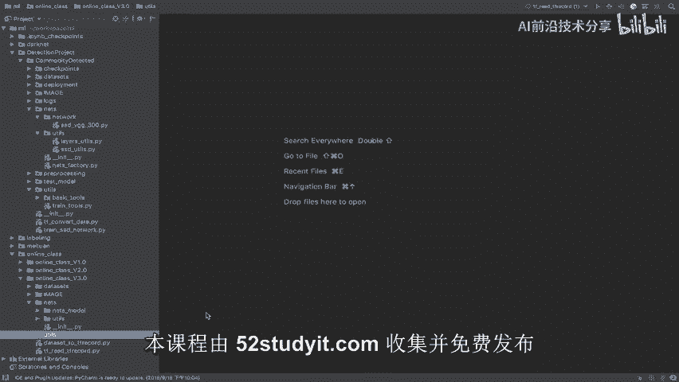

第一步骤，第二步骤就是我们要将next factory进行一个实现，在这里面实现我们的这样的一个路由的一个啊。

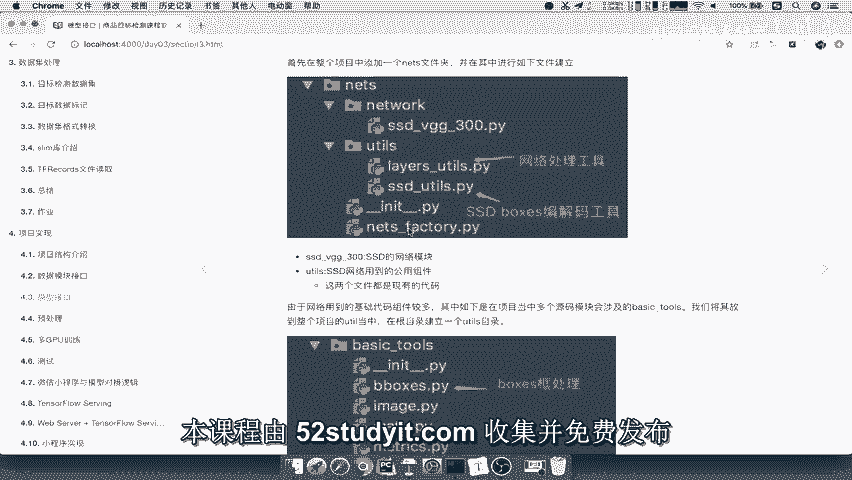

分配分发到不同的网络了吧，好那所以我们在nice下面新建一个，Let's get factory，点PY啊，好，那么这个文件夹就是我们实现的这样的一个啊。

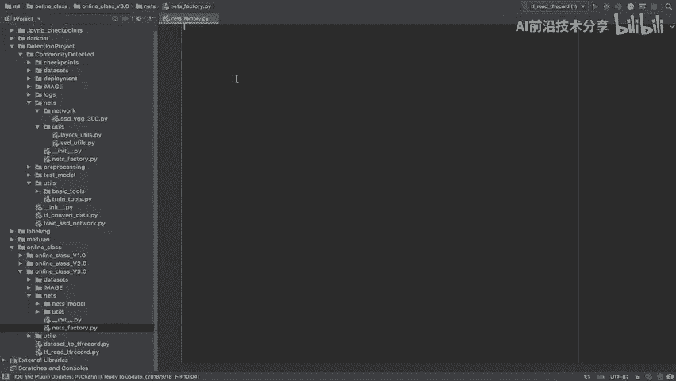

这个路由功能，那我们简单看一下代码。

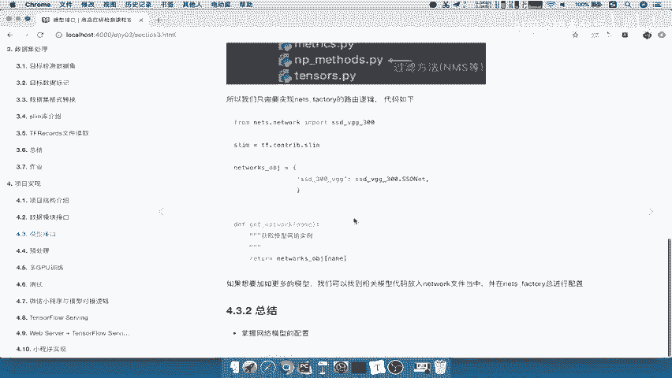

其实非常简单，我们把相应的你有哪些网络模型导过来，然后呢，我们直接建立一个这样的一个字典映射对吧，那你想选什么。

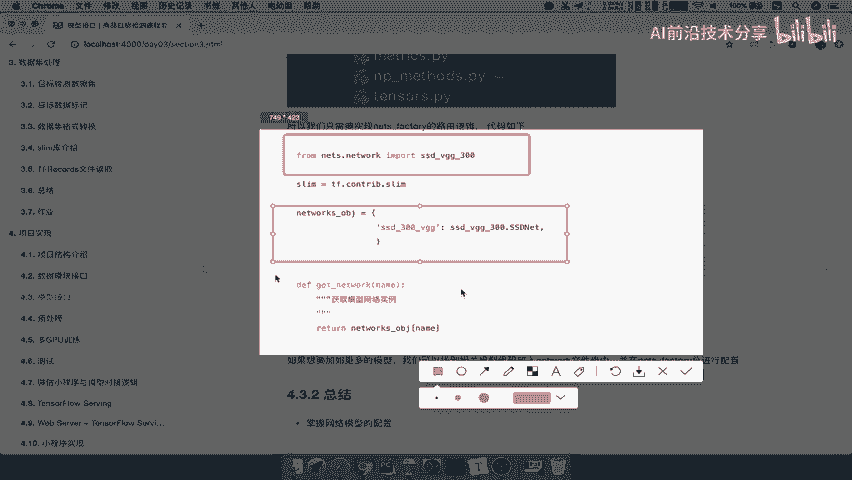

请填入你想要用的网络明星名字即可。

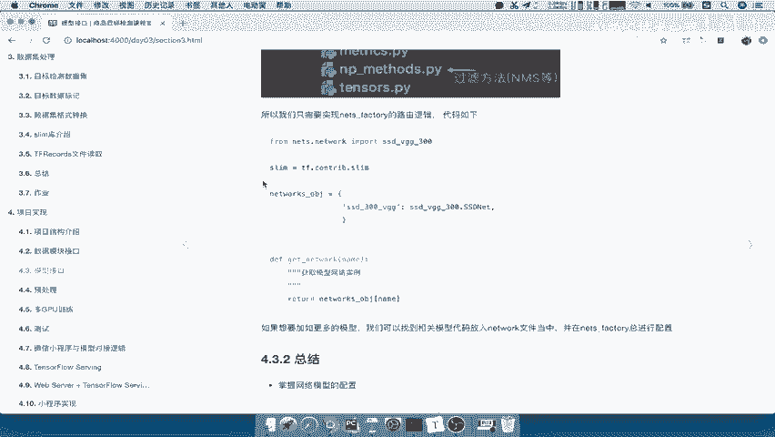

所以我们在这里呢直接啊，直接在这里我们自己自己去编写了，那首先呢我们就把我们需要导入的包呢啊，进行一个导入，比如说从from nets点我们的next杠model当中。

import一下我们的SSD杠VGG干三百三百，这是我们的这样的一个啊导入的网络，那所以我们要建立一个函数，这个函数干嘛的呢，去获取我们的啊，neural network对吧，我们直接写network。

那么这里我们想在训练的时候，他提提供什么参数给我们的，是不是要提供的一个，就是哎我训练提供网络名字是不是就可以了，网络名称吧，网络名称我们是不是就可以去进行选择了啊。

所以呢这就是我们需要提供给外面的一个，这样的一个参数，它需要指定的参数好，那么这里我们指定一个nets，那name，network name吧，network name好。

我们写一下这俩获取不同的网络模型，这里网络，模型的名称，那然后呢返回的就是一个啊我们的这个网络，我们直接return，那么所以我们怎么去选择网络呢，我们怎么知道有哪些网络，我们直接新建一个。

比如说叫做networks点的一个jt object，我们的这个字典成员当中呢，就有一个哎我们指定一个这个SSD，注意啊，这个名字也是其他的我们的这个用户啊，或者训练的时候提供的是提供的这样网络名字。

比如说SSDVGG300，他的这样的一个结果，就是我们使用这个网络模型，在这个网络模型当中呢，它会有很多方法，那么我们最重要的只是用这样的一个类啊，用这样的一个类，所以我们只要把这个类拿过来。

进行一个使用就行了，它在这个类里面有很多方法，我们前面介绍了啊，有一些这个损失函数啊对吧，你的b box的相关操作，那么我们把这个里面的点network SSD net拿过来。

也就是说我们会用这样的一个模型，文件当中的SSD net这个类去进行一个操作，所以我们这里就比较简单了，net object直接选择我们的network name。

这个network name必须得在这个啊object当中定义的好，那么这样的话呢，我们就把nets factory是不是定义好了啊，那么你再去使用的时候，训练时候使用直接get network。

直接指定网络模型名字，能理解吧，那所以我们在这里提供给外面的参数啊，一个是这个了好，那么我们这个阶段的这个编写呢就在这，因为我们训练过程还没说啊，所以我们这个地方也比较简单，我们直接在训练的时候。

再使用这个这个net factory的这个模型的这个代码啊。

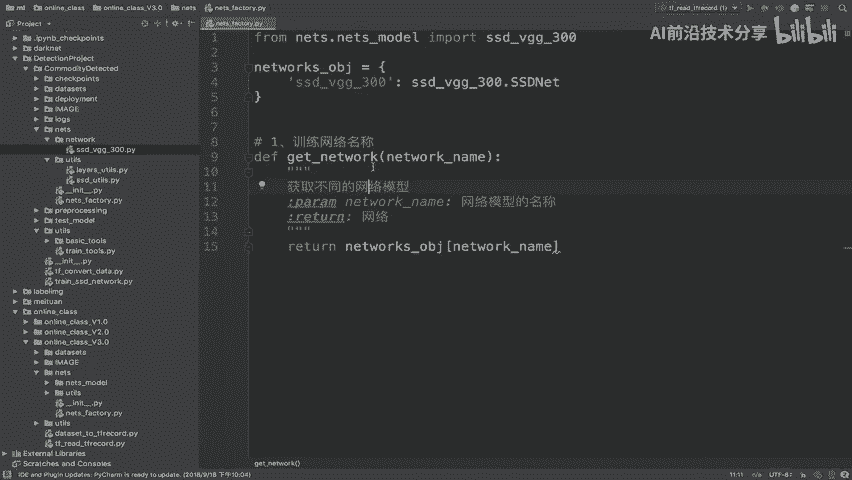