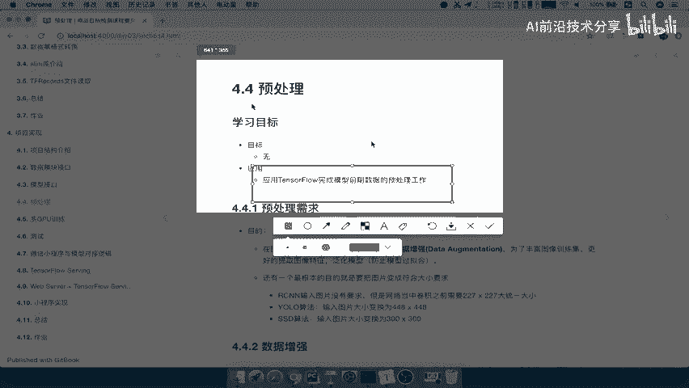
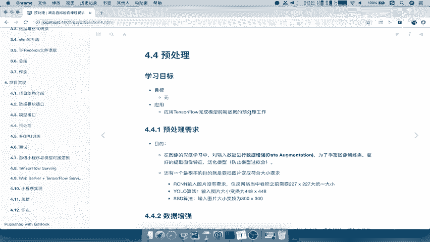
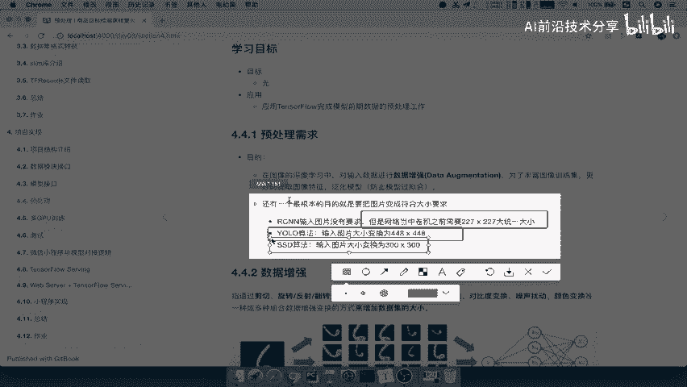
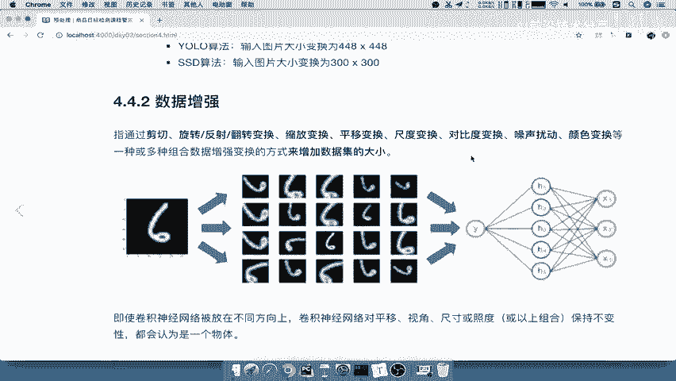
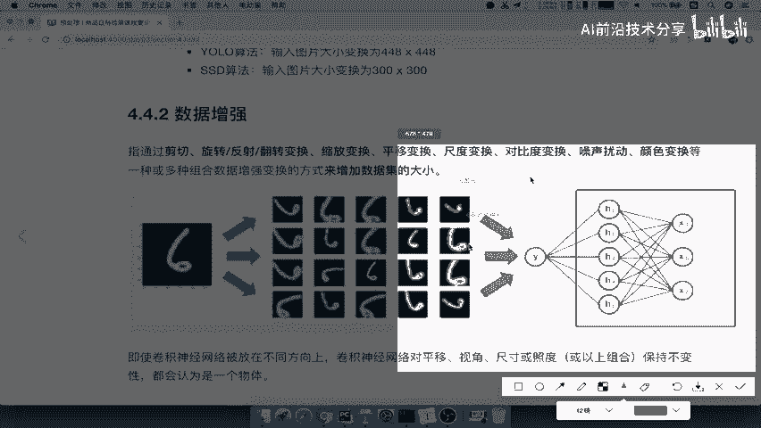

# 零基础入门！一口气学完YOLO、SSD、FasterRCNN、FastRCNN、SPPNet、RCNN等六大目标检测算法！—深度学习_神经网络_计算机视觉 - P55：55.01_预处理接口：预处理需求介绍、数据增强介绍55 - AI前沿技术分享 - BV1PUmbYSEHm

那么我们简单的总结一下，刚才模型接口所做的一些事情，那么我们的模型接口，首先是创建这样的一个啊，net的这样的一个目录啊，这是单独作为我们获取这个模块的目录，那在其中nets目录当中。

我们通过建立一个nice杠factory这样的一个文件啊，这样的代码通过这里面的函数来去获取啊，获取不同的模型吧，那么其中有它相关的一些模型文件啊，包括它的基础组件文件好，那这就是我们的模型接口。

那么接下来我们要讲的，另外一个重要的一个模块呢，就叫做预处理，对于预处理呢，其实我们提到啊，前面提到的不多，但是他同样是在我们整个这样的一个，训练过程中，充当一个非常非常重要的角色。

这个预处理不仅仅是说对于图片的一个简单的，我把它图片变形等等，我们可以看到。

那么预处理呢，我们那这里的要求就是完成应用TENSORFLOW呢啊，完成这样预处理工作，其实我们应该还要去掌握一些预处理，相关的一些概念和啊它的一些方法。

那么我们来先看一下预处理。

它的一个需求是什么，我们先看到这里的一句话，在图像的这个深度学习当中，对输入数据进行数据增强，这就是它的目的，数据增强，这是一个啊它的一个一个名词，专业名词，其实数据增强的是一个啊特别的一个领域啊。

它所以可以算作是一个单独的一个领域，那为了丰富其数据图像的这样的一个训练集，更好地提取图像特征，泛化模型，这就是它的目的，那么其中的泛化模型我们应该能理解对吧，防止过拟合，因为你数据少。

可能会造成你对这个数据太敏感了，对其他的数据呢就没有一个识别能力，那这是它的一个目的啊，其实根本性的目的呢，还有一个就是对于每一个算法来讲，是不是我们要求了，输入在算法当中的图片的大小。

是不是必须必须得固定的，那比如说RCN当中，在网络当中啊，卷积之前需要227×227，只不过我们通过一些方法啊，固定大小在网络当中，那yo的算法我们是固定的，448×448吧，SSD算法。

它固定的图像必须得是300×300，也就是说你拿到的这些图片。

必须是300×300的好，这就是我们的预处理需求，那么这呢我们把这句话呢拿过来，我们在这写上预处理模块，它的一个目的呢是对数据集进行数据增强啊，这样的一个概念我们会介绍的。

然后以及呢我们会为了丰富数据极限，提取可特征，防止过拟合，就是这页那个目的，还有一个就是给图片的大小进行缩小对吧，给图片的大小进行调整到算法需求的大小好，这就是我们预处理模块的一个需求和目的。

但这个目的需求到底是什么意思呢，对吧，他为什么要做一个数据增强，就会能够泛化模型，防止过拟合的呢，那所以我们接下来要讲的概念是数据增强，那首先我们先来看到数据增强，指的是通过什么呢，这一系列的方法。

剪切旋转以及缩放变换，你的平移变换等等，那么这些多种组合的变换方式，来增加数据集的一个大小，注意啦，所以这就是它的目的，增加数据集的大小，这叫数据增强，能理解吧，好通过我们来把这一块写上，数据增强。

什么是数据增强呢，我们通过一系列的操作啊，我们把这个呢称之为一系列操作，来目的增加数据集的大小，这就是它的一个定义，这一系列操作我们不写了啊，那我们来看这句话怎么去理解啊，来看到这里有一张图。

当我们把一个图片输入到这个网络当中的时候，我们会在这个过程当中哎进行一个数据增强，会将这个数据变换成看到变化成这个样子，变化成这个样子，然后呢再这样这样，那么这样的话，我们可以看到这张图像本来是一张。

现在变成了452十张图像，也像是相当于同一个物体，同一个这样的一个图片类别，我们变成了20种的图像输入到这种网络当中，这样是不是就增加你的数据集了，增加你的数据集大小了吧，好，那所以我们的这个数据增强。

就是这么一样的一个概念，增加数据集的一个大小啊，原来一张我现在变成20张，输入到网络，那么即使啊我们同学可能会疑问，对于这种图像我要变形了，变形了，输入进去，它的目这个网络识别能力还一样吧。

其实这就是网络的特点，卷积神经网络呢对这些平移等等，这些他的一些这个变换啊，保持一个不变形，它都会认为这些都是一个物体，虽然说你变形了对吧，那所以呢这就是它的一个根本性的一个原因啊。

就是说我们进行变形呢，并不会影响到这个网络好，那我们就要想了，为什么我们要在这里进行一个数据增强，为什么要进行数据增强，那刚才目的已经说了一个非常重要的概念，就是防止过拟合。

那么另外一个呢就是说为什么要去做，其实还有一个简单的原因就是数据集太少了，你数据集太少了，是不是我要进行一个增强过程，帮你数据扩充啊，哎也可以称之为数据扩充好，那我们重点来解释。

为什么这样做就能够达到好的效果的呢，来我们来通过一个例子啊，完整例子来去理解，那为什么要这样做呢，假设现在我给你两张图片输入到网络当中去，训练，一张呢是这样的一个啊福特的这样照片。

另外一张是雪佛兰的左右啊，颜色差不多，然后呢一个往左偏，一个往右偏，当我们把这个数据集输入到网络当中的时候，那么你的网络学到的是什么，你们想一想，我们想一想啊，学到的是什么。

是不是有可能是最大的一个特点，是不是一个向左边，一个向右边，那网络就知道哦，那我以后输入你一个车，可能向左的就有可能就是我们的福特，那么向右的也有可能就是我们的雪佛兰，能理解是没错吧。

那但是我们现在来了一个需求，假设你完成训练，我现在输入了一个这样的一个图像，品牌A也就是代表着这里面的福特品牌，A品牌B代表雪佛兰，那么我们输入这张图片之一进去之后呢，这个网络得出的结果。

你觉得它是福福特还是雪佛兰，那么他有可能最大的可能啊，可能会是这样的一个雪佛兰的这样一个品牌，也就是说品牌B的汽车为什么会发生这种现象，因为只有两张图片的时候，我们的神经网络呀。

它会去寻找最具或者说他的经过网络，他留下来的是最具代表性的特征，就是说最明显的特征它会留下来，那比如说方向是不是最明显的一个特征啊，能理解吧，哎他留下来了，那所以你输入进去的方向哦。

那可能得到雪佛兰并不是门这样的一个，这个福特，能理解吧，所以发生这种现象呢，就会寻找一个明显的特征，那么所以我们这里会写一下啊，神经网络会因为会寻找最为明显的特征，特征对于数据集来讲。

那所以呢如果数据集少，数据集少，那么你的这个代表性就弱对吧，你的这些代表性就弱，就很弱，你没有足够多的这样的数据来，你去除掉这样的一个明显的特征的影响，能理解吧，去除这些明显的特征，但这些又不是很重要。

所以你想想怎么办，想想怎么办，那其实非常简单吧，要么我去增加我们的什么，增加我们的这个数据集，直接我们这个啊直接啊在这个磁盘当中对吧，我多拍几张这种这个车的向右的图片。

这个车的向左的图片是不是就OK了啊，以我们的例子来讲，怎么解决，例子解决方式，我可以去第一种方法，我一哎去多拍几张收集或者收集对吧，或者我们称之为收集啊，向左向右的每个车型，向左向右的图片。

是不是这样的话，它就能够通过别的说明，这个方向，不一定是影响着我们的这样的一个网络的吧，那有可能是什么啊，有可能是这个其他的你的这个颜色呀，或者说你的这个啊牌子啊，哎品牌的识别对吧，所以我们来讲呢。

就是说对于这些解决方法去收集质量，那么如果说我们没有条件去收集怎么办，我们可以做一些什么变化，也就是说我可以做一些水平的翻转，比如说我把这张图片，把这个两张图片，每一张图片做一个水平向右向左的翻转。

是不是就得到我们的一个新的数据集了，哎那么没有这样的一个条件去收集的话啊，那么第二种就是进行并进行数据集的变换，进行数据集的变换操作，那么这样的话呢就可以增加增加，更多的数据集了，能理解什么意思吧。

那所以接下来我们就要提到的，就是数据增强的两种类型，什么类型的类别来看到，在机器学习或者深度学习过程当中呢，我们向模型输入的数据之前都会增加，去增强我们的数据集，也就是说我们应该在什么位置增强。

一般都是在输入模型的数据之前啊，输入模型之前，那么我们称之为两种增强方式，一种是离线增强，一种是在线增强，什么叫离线增强呢，我预先直接做变化之后，从根本上把数据集保存到我们的磁盘当中。

或者保存到我们的数据库当中，能理解吧，哎先变化好之后，那你这个数据集可以变化成，比如说你有十张图片，现在变成100张或者1000张图片，是不是就OK了，那还有一种叫在线增强，在线增强。

意思就是我不是在把数据集在本地直接增强，而是在输入到模型的时候，我对这个图片进行一个什么呢，变换操作能理解什么意思啊，比如说我现在输入的这个模型当中好，现在这张图片输入，我下次呢有可能输入之前呢。

我就是一个变换，是不是就有可能变成另外一张图片，这张图片是不是就代表第二个数据集，哎所以呢这一说对这同一张图片，我们会做一些随机的变换操作，相当于不同的数据集合，所以我们来说一下啊。

我们来总结一下数据增强的类型，我们好增数据增强类型，类型，那么我们增强类型的有两种，一种是离线增强，然后呢一种是在线增强，我们自己总结一下，那么这里面离线增强和在线增强，都是在输入模型。

在数据输入模型之前去做处理，你想你都输入模型了，那你增强有什么意义啊，没有意义了吧，哦那么所以离线增强就是直接做变换之后保存，保存在啊，本地啊，直接物理上啊，物理上理解成物理上增加数据集的大小。

增加数据集的大小，那么在线增强什么意思呢，也就是说我不是物理增加，你的这个磁盘当中的这个数据集呢不会变多，那所以我应该是什么呢，在输入模型的之前哎，做给每张图片做一些随机的随机执行吧。

执行一些随机的变化，这样的话呢，我们在输入之前就会得到各种各样的模型，各种各样的一个数据，能理解什么意思吗，我们来举个例子啊，输入这个网络来输入这个网络好。

假设就对于这个六这个模型啊，这个图片来讲，这个六啊，这个六这个图片想想，如果我们输入进去呢，不做一些变化，那你每次训练啊，因为我们知道这个训练是循环去训练的，每张图片都有可能被训练很多次对吧。

比如你1000张，可能循环几千的这样的一个迭代过程，你这个几千张都用了几次了，每一张都用几次，但每张用几次，你不做变换，是不是还是一张图片就六输入进去，六输入进去，六输入进去，那么我们做变换之后。

比如说第一次循环了六输入进去了，第二次进去我做了一个随机的变换，六这张图片我变成了一个变换，相当于是我这次输进去的不是六，而是变化一进去了好，下次迭代有可能做的一个随机的变化，又不一样了。

那么有可能变成了六图片二变换二。

那你想想第一次输入是六图片，第二次有可能随机变换就变成这种图片了，然后第三次呢也有可能又变成这种图片，你相当于是不是在这种需在线的，把我们的数据集增强了吧，能理解这个过程吗，好那么我们把这个保存一下。

在线增强，增强数据及理解桌面好，那么我们把它保存一下啊，那所以我们说了数据增强的类别，一种是直接离线，一种是啊在线增强好，那么这就是增强的类别，那么我们对于数据增强，我们刚才说了有这么多的方法对吧。

什么剪切旋转啊，变换等等，我们接下来就要具体看数据增强的技术当中，这些方法到底都代表什么意思，在这里啊，只要理解这些这个增强的技术就行了啊，那么下面这些方法呢，它是非常基础也非常强大的，被广泛。

在每个很多模型在训练的时候都会去用啊，各种各种模型，那比如说翻转其实非常简单，翻转呢在这个TORFLOW也有相应的API，叫做TF点，image点render，Flip left red。

就是说你是随机的，在这个图片输入网络之前，我会随机的给它，相当于我向上向下向左向右进行翻转，比如说下面这张图片左边是一个什么呢，最原始的图片，我可能会对于进行一个简单的翻转，那么比如说这个第二个图片。

就是我们的水平翻转，哎，我水平的向左向右的这样一个翻转，然后呢第三张图片就是我们的垂直翻转，把这个图片呢向上的反转，虽然说这样翻转，但是网络来讲还是认为这是一个物体能理解吧，还是一个类别。

这就是它的一个特点，只不过啊有可能因为位置不同的关系，而拍到了不同的这个照片效果吧，那这是翻转还有什么呢，旋转啊，旋转也是一样，旋转呢我们可以对这张图片，我可以哎下向右对吧，90度再向上90度。

或者说再向这个右90度，这是向左啊，向左90度能理解吧，所以呢这就是旋转啊，旋转的图片能看出来是向左啊，这里是向左，这是向上，这边是向右吧，是向右吧，好那么还有个剪裁。

剪裁呢我们会从原始图像呢剪裁一部分啊，剪裁这个随机剪裁关键的一些部分图片，比如说对下面的这一个图来讲，从左往右还是一样，我们的原始图片看到第二张图片应该是怎么样，是不是应该对于这张图片。

应该是检查了这一个部分吧，是不是检查这一部分注意剪裁好之后，一定会把它还原到原来的图片大小，能理解什么意思吧，你不原来的图片大小300×300，或者说多少多少乘以多少的，那你这个样本是不是就变小了啊。

肯定是一样的啊，那所以第三个我们可以看到，它应该是大概在这里在这个地方对吧，在这个地方进行了一个简单的检查，然后把它放大到我们同样的图片大小能理解吧，这就是我们数据增强的一些关键的新的技术，能理解吧。

那所以在输入之前，我做这些操作是不是就会随机的增多，增加了一些样本啊，哎你就不需要担心啊，我的样本不够怎么办，没有这样的一个你让他训练，他就会一段不断的去提供这种一种泛化的能力，能理解吧。

好那么还有其他方法，我们就不多做介绍了啊，平移啊，缩放等等这些方法，数据增强的效果是非常好的，所以呢它的这个在模型训练的时候，你会发现哎，他这种泛化的能力就变得明显变强了，什么意思呢。

我们看到一个两个alex moon net和google net，分别在我们的minister啊，mist数据集啊，mist的数据集，它的一个效果呈现下面，绿色和粉色代表没有增。

数据增强之前它的损失和准确率，绿色代表损失，红粉色代表准确率，来看到绿色代表损失，粉色代表准确率，你看这两个图片损失是不是这样的一个减少吧，这个准确率是不是这样增加。

alex net google net哎也是这样的，增加准确率增加损失减少，那么红色和蓝色代表数据增强之后的损失，我们可以看到ALEX那都当中发生了什么东西，是不是我们的红色和蓝色。

比我们的绿色和这种粉色，是不是要快速的，就能够达到一个损失比较小的效果，准确率比较高的效果，说明他的泛化能力就达强了，你的学习损学习能力变强了，你很快的就能够达到学习一个比较好的模型，效果，能理解吧。

并不是说这个两个不数据增强，它能够不能够学习效果，他可能学习的就比较慢，而且呢你没有泛化能力，可能会造成过拟合，能理解吧，那对于google net也是一样的，你可以看到这个红色跟蓝色相比。

于粉色和绿色是不是要快速的能够进行，达到一个比较好的效果吧，训练的好效果，这就是数据增强的一个效果啊，它的效果是非常非常好的，这我们通过这个例子也能体现出来吧，好。

那么这就是我们所说的数据增强的一个过程啊，好那么我们将数据增强的整个概念，包括我们物预处理啊，其实我们怎么理解啊，预处理我们就可以称之为一个数据增强过程，一般我们不会去强调说哦，预处理还是数据增强。

其实预处理也你把它往这个大的范围说呢，预处理包含了这个数据增强，还有其他一些操作，能理解吧，啊不用去强调这几个名词的这样的一个区别啊。

