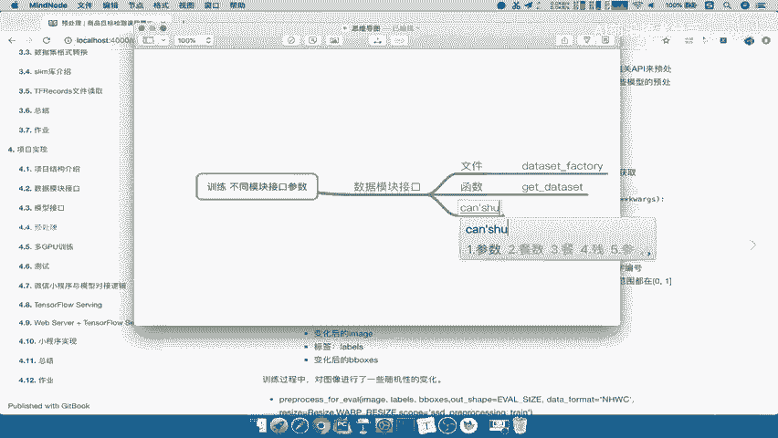

# 零基础入门！一口气学完YOLO、SSD、FasterRCNN、FastRCNN、SPPNet、RCNN等六大目标检测算法！—深度学习_神经网络_计算机视觉 - P58：58.04_数据接口、模型接口、预处理接口参数总结58 - AI前沿技术分享 - BV1PUmbYSEHm

那么接下来呢我们已经把数据模块接口，模型接口，以及我们预处理的模块接口呢给讲完了，那么我们接下来干嘛呢，去统一一下，我们每一个接口提供给训练的时候的参数，能理解吧，哎先把这些参数呢刚才我们只是每个模块。

每个模块的去贴讲了一下，那现在我们要去总结一下这个每个模块的参数，提供提供给哪些以后，我们就不用再去看这些模块里面的具体细节了，好那么我们在这里呢新建一个jim node，好我们新建一个文档。

在这里我们写上这个训练，训练不同这个不同模块接口参数，那么这个参数确定，我们第一个就来看数据模块接口对吧，数据模块接口。

那么它的名称呢叫什么，我们直接从这边来看，对于我们这个版本里面DATASET，DATASET杠factory，它的名称叫做啊。

这个里名字对吧，我们的这个文件文件是DATASET，data set杠FACTORY，然后呢以及我们的函数，函数就有个get dataset，那我们的参数也得写上。

参数呢，就是我们提供给它数据的这样的一个数据集。

名字吧，以及是否是训练DATASETDR，对吧好，所以我们把这一个拿过来，这个dataset name的数据及名字，然后呢我们这里面呢是参考这个SSDSSD杠啊，一个committed是吧。

common dt杠2018能理解吧。

参考这个名字，然后呢我们还有数据集是否是训练吧，哎是否训练是否训练。

好train or test，这个是我们的这个参数名字啊，我们把它拿进去，CTRLX好，那么然后呢对于这个是否训练。

还有一个就是我们的数据集，数据集目录。

好数据集目录，那那么这是第一个啊，我们的数据集数据模块的一个接口，接下来就是我们的模型接口。

那文件呢就是我们的。

来看到nets下面的nets factory吧，文件，net杠factory，我们的函数呢称之为get network吧，我们看到这里复制过来，Get network。

参数名字参数在这里。

Network name，好那这是我们的模型接口相关的，然后我们再提供的就是预处理接口。

预处理接口它特殊一点，我们因为返回了这样的一个函数对吧，因为里面参数实在是太多了。

那所以我们第一个就是get preprocessing啊，第一个就是总的一个预处理逻辑吧，啊我们把这里的文件，啊应该文件是FAC呃，preprocessing factory啊。

PREPROCESSING杠factory，然后呢把这个啊删除掉，那我们里面提供的函数就是我们的get processing啊，函数，好get processing呢，这里面去返回的这样的一个函数。

这个参数函数的一个参数是什么呢，参数为这两个，一个是name，一个是is train吧，is training啊，参数一个是name，一个是is training，TRARNING啊。

Is training，这个是我们的这个预处理名称，这个是是否是训练的处理，是否训练的处理过程好，那然后对于这个函数呢，它的返回是一个这样的一个processing funk，对啊。

那它返回processing funk这个funk要求的参数，我们把这些参数都拿过来好传到这里来，这image labels啊，b box我们把这个一一的去这个复制吧，直接这样去复制。

然后呢我们把这个复制过去，CTRLXCTRLV好，我们把data呢放到里面去，然后呢is training和星星K2X呢也放到这里，那么把这个呢这两个删掉。

这就是我们preprocessing funk，里面要提供的这样一些参数，那你把这些参数，我们在训练的时候再去详细介绍啊，你训练整个过程好，这样的话呢，我们统一的不将我们的训练的时候。

调用的这些不同模块的参数以及接口，都介绍完了啊，都总结完了，接下来我们就要去做的就是训练的整个过程啊，是比较复杂的，所以我们会去详细的去介绍好这部分。

