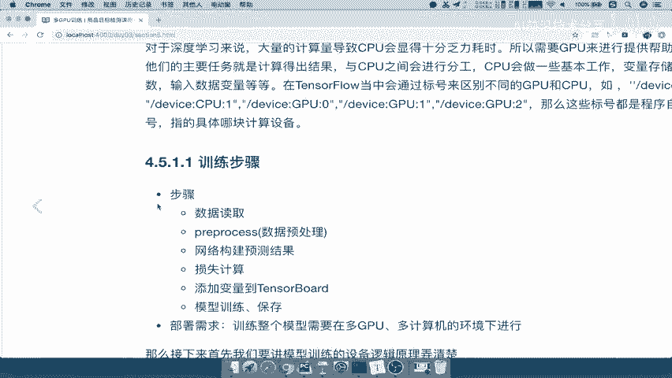

# 零基础入门！一口气学完YOLO、SSD、FasterRCNN、FastRCNN、SPPNet、RCNN等六大目标检测算法！—深度学习_神经网络_计算机视觉 - P59：59.01_训练：训练步骤与设备部署介绍59 - AI前沿技术分享 - BV1PUmbYSEHm

接下来我们就要进入这个GPU的训练过程了，那么在这里呢我们的学习目标是了解啊。

相关的这些部署设备怎么去弄的，然后呢以及我们网络模型接口，数据模型接口，它的这些使用唉，组成一个完整的训练过程，那么最后呢我们应用就是使用我们的特SL，完成我们基于商品数据集的一个SSD模型的。

训练过程，能理解吧，好那么我们首先来看这个多GPU训练，这个训练为什么要用多GPU进行训练呢，那所以我们先来看一下模型训练，它是我们整个项目的关键，只有你训练好，导出的这个模型是别人才能能用嘛。

好那我们就来看为什么要是多GPU训练，哎，我们多GU训练，那么都在干些什么事情呢。

我们参考这张图来说，然后把这张图呢复制在这里啊，我直接在这张图当中去说啊，好那么我们设备当中呢一般有呢CPUGPU，那么CPU呢通常我们也可以拿来训练模型，去计算模型的输出结果。

但是呢我们的CPU它的计算量，大量的计算量，导致CPU计算非常耗时，有可能你训练出这样的一个模型，可能你需要一个月对吧，你需要一个月，那这个时间是不是太长了，等你训练好了，这个模型可能都需要修改了吧。

所以我们需要一些更加速度计算啊，更快的这些设备，那么我们就要使用这个图形处理的这样，图像处理的一个显卡就叫做GPU，GPU呢它的这个效果要比CPU要快快很多啊，这个我们不去详细介绍。

他们怎么具体的一些细节了，那么GPU呢它大多数来帮我们做些什么事情，就是说我们拿这个设备过来做什么呢，看到这张图当中，CPU大多数做一些的事情，就是变量的一些保存，我们通常建立的这些变量。

而我把它存在CPU，我们参数的更新统一更新，让CPU去做，相当于它去作为一个中转站，或者说作为一个这样的一个观察的一样，其他的这些GPU干什么，相当于是劳工一样的，所以呢它主要是去进行一个啊模型计算呀。

梯度计算呀，这些计算量比较大的活都交给GPU去去干，能理解吧，那么所以呢通常我们也称之为啊，把这种呢我们称之为这种参数啊，我们称之为参数的这种设备啊参数，那么我们这种GPU呢我们也可以称之为啊工作。

那么这相当于是你的是parameter和job啊，工作的这样的一个设备好，那我们知道这两这个GPU和CPU，分别在我们训练当中呢会做一些什么事情，就知道我们该把哪些活安排给他，该把哪些活安排给他。

是不是就可以了，所以呢这就是我们的整个GPU啊，他要做些什么，那么通常我们在TENSORFLOW里面啊，如果你应有这样的基础，知道啊，他的这个设备命名会以这种device，Cpu 0device。

Cpu 1device，Gpu 0device，Gpu 1device，Gpu2，那么这些设备，它都是程序当中默认给它去进行标记的，那么这个标记过程我们不用管GPU，零对应的是哪一个显卡。

GPU1对应哪个情况啊，这也不用管，那默认你比如说你插了两个显卡，那么它默认哪一个接口开始从0~1，那一般的话，我们都会在每一个GPU上面进行运算的，能理解吧，好，那这就是我们说多PU到底呢。

做一些什么事情好。

我们把这个保存一下，多GPU啊，这个任务好，那么我们知道了这个训练过程当中啊，我们的CPU干什么，GPU干什么，那接下来就要看我们整个训练步骤是什么样的，就是说我们整个训练的流程。

在项目架构开始介绍的时候，我们已经说了吧，训练是不是按这个模型的这样的一个过程啊，那所以我们来看一下我们的训练步骤，如何跟我们的这样一个设备的一个部署，注意啊是设备的部署。

怎么在这个设备上进行计算来进行一个关联，首先我们看一下这个步骤。

数据读取啊，非常简单，然后呢预处理预处理到你的模型，构建直接预算机结果计算损失对吧，然后呢这些添加到我们的班，将我们的变量需要观察的这些损失，准确率。

以及一些相关的参数放到我们的TENSORBOARD里面，是不是通过summary去放放进去吧，那么以及我们模型的训练一个保存好。

这就是我们的训练步骤，那我们在想如何将这个训练步骤，跟我们的设设备的一个部署过程进行一个结合，那它的部署呢，就需要在多GPU和计算机的环境下进行，那么所以呢我们把这张图呢拿过来，我们先把这张图拷贝过去。

好然后在这边粘贴好，那么这边粘贴好之后呢，我们在这里把我们的训练步骤也给进行，粘贴过来，好我们把这训练步骤，好训练步骤呢放到这里，那么我们来看啊，数据读取，数据预处理这些活。

你应该觉得在这些活应该是什么事在做呢，包括你里面的一些变量的定义啊，变量的这些在哪一个位置上，我们通常默认如果说你没有设备的话，你默认全部都在CPU里面完成了，计算也是变量的值，也是在CPU当中。

在内存当中吧，那么如果说我们有GPU了。

我们会这样分开去干活，看到这张图GPU啊，CPU我们会将数据读取，数据预处理当中的一些变量，都会选择放到你当前这张这支电脑啊，这个电脑里面的默认那个CPU，如果你有两个，那么我可以两个都可使用。

那有一个我就使用一个，那么这些都是一些变量的啊，这些变量的张量，或者说我们的tensor张量的存储，tensor张量的存储，我们把这个值呢这个大小啊放大一点，tensor张量的存储都会存储在CPU。

那么接下来到这里，网络模型，看上面网络模型构建训练效果，或者说我们要去输入的网络模型，定义整个计算过程，我们说了TENSORFLOW当中呢，肯定就是一个先定义计算。

然后再run的地方再run的一个过程嘛，所以我们就把这个过程，把我们定义计算计算的这个任务，以及损失计算的任务全部都交给我们的GPU使用，所以我们在第三步骤的时候，我就可以把这个任务全部交给GPU了。

指定GPU好，你GPU你给我去计算这些东西，计算结果，然后让我去运行，能理解吧，哎我指定这样的一个设备去运行，需要指定设备去运行，那么我们得到了这些这个损失啊，比如说我们需要去优化唉。

这个过程应该知道啊，清楚优化这个过程，我们一般也会将学习力等等变量相关的定义诶，同样的还是他N是变量的存储，还是在我们的优化器当中能理解吧，还是在优化器当中，你只要定义的一些变量啊，这些值不用去运算的。

都是在默认CPU当中能理解吧，那我们最后要优化了，优化才是真正的整个运行的过程，所以你需要去计算每个设备上，每个GPU上面的损失大小，以及你的梯度大小，那这些我们比如说计算，定义计算操作。

这里是定义的这个添加吧，添加计算的任务，这是定义真正的计算的操作，每个设备计算的这样的一个结果，是计这个优化计算，以及我们的设这个相关的这些梯度啊，啊计算等等，我们都放在GPU当中去进行一个运行好。

那么这样的话呢，我们就将整个训练的整个流程当中，我们要做的事情，在每一个设备上的要做的事情都给指定好了，好那么这个事情怎么去做，我们说TENSORFLOW当中是不是提供了给我们啊。

TENSORFLOW啊，本身，TENSORFLOW本身提供了一些指定设备的，一些指定设备运算的操作，但是呢这些操作，如果在我们这样一个复杂的环境下面，进行去指定的话，非常麻烦。

所以我们需要一个新的这样的一个工具，还是叫做啊在model deploe d e p l o y，这也是TENSORFLOW这样开源的，一个专门用于部署设备的啊，部署设备的一个简单的一个库啊。

其实就是一个模块这样的一个库，这个库呢我们就可以拿来去进行部署，那么我们看的下面有一行东西我没有说吧，那么下面一行东西，就是我们再去整个训练过程中，分别指定不同的设备的函数。

Variable device，Input，Device，create comments和optimized colum等等，这些就是在指定你的设备，然后我在这个设备下面，进行定义。

能理解吧，好，那么这个保存一下，这个多GPU设备与训练流程的关系好，那么这样的话呢，我们就将啊将这样的一个我们怎么去做对吧，我们的训练过程弄用GPU，多GPU多GPU处于什么样的一个角色。

训练步骤怎么样做的，那我们好，接着呢总结一下，多GPU训练，那训练的话，我们这几个流程直接粘贴到这边来，好以及我们在这整个流程当中怎么去使用GPUCPU。

哎我们说了这个图呢也要掌握哎，每个GPUCPU都在干些什么事情。

好，我们把这边呢粘贴过来，然后呢把这个啊这个应该是按照本地的啊，本地的这样的一个保存的，到时候你们也不会看见啊，不会看见，所以呢这里就直接啊我就不粘贴过去了，那么这两张图呢啊。

一定要记清楚两张图的的这样的一个意义好。

那么这个我们的训练的这个过程介绍啊。