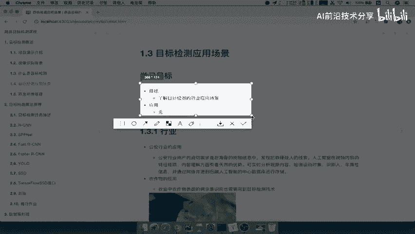
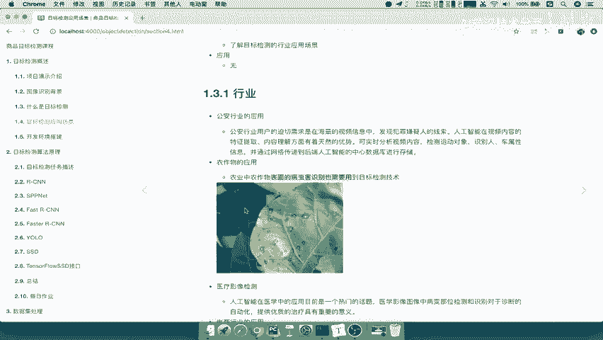
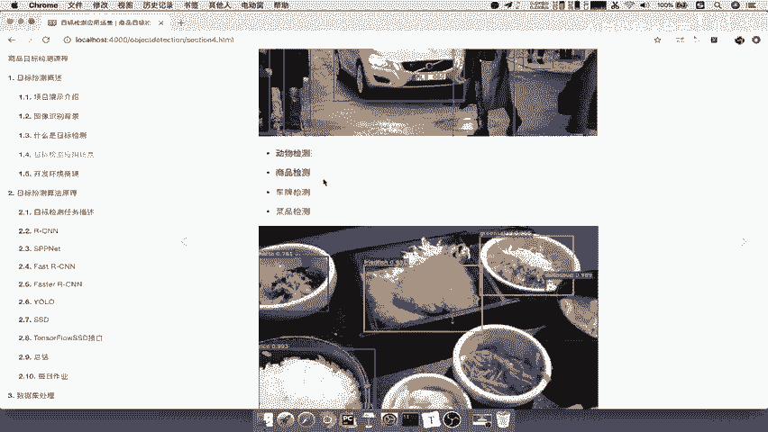
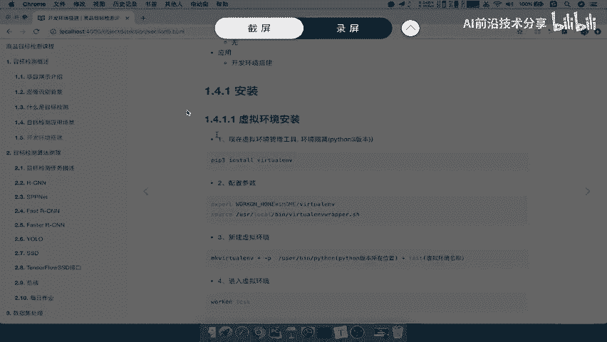

# 零基础入门！一口气学完YOLO、SSD、FasterRCNN、FastRCNN、SPPNet、RCNN等六大目标检测算法！—深度学习_神经网络_计算机视觉 - P5：5.目标检测应用场景5 - AI前沿技术分享 - BV1PUmbYSEHm

好，那么接下来呢我们要去介绍一下，目标检测的应用场景。

那么这里呢，我们只需要去了解目标检测的一个含义。

应用场景啊，知道具体有哪些应用可以去做好，那么这里呢我们第一个呢，先说这个行业的一个啊领域吧，那么比如说第一个公安含义的应用，那么这里呢我们可以去通过光里面的这些，视频啊或者图片去分析这里面的内容。

然后呢检测这里面是否有没有人去出现哎，一旦有人出现在某一个图片当中或视频当中，是不是就可以去哎定位到这个人哎，出现过哪些地方好，那这是公安含义的一个应用，那我们来看一下，第二个就是农作物的一个应用。

农作物应用呢它是可以去啊，作为这个表面的一个病虫害识别啊，那什么意思呢，比如说啊我们在这个农作物好很大的一块地，那么我们可以在这个旁边呢安装一个啊，或者近一点的地方安装一个摄像头啊等等。

那我这里呢我就可以拍摄一下哎，定时一个星期或者几天拍摄一个图片，来实时的观察到这些植农作物的，这些什么叶子的情况，哎，一旦检测到，比如说这个图当中的这些有病害的这个地方好。

一旦它有那标记，那这样的话我就可以发出这样的一个警示对吧，哎这个农作物已经开始慢慢的有一些情况了。

你可以去观察了好那这是农作物的应用，那还有一个就是也经常提到的啊，医疗影像的一个检测，那么这个也是目前比较火的一个话题啊，因为影像检测呢，其实跟这个上面农作物的应用其实差不多。

它都是通过这个哎我们把这个阴阳影像拿过来，然后呢通过对这个阴阳影像进行一个识别，检测到哎，比如说某个部位他的这个地方是有问题的啊，那我是不是就可以去提供一些，给医生提供一些更好的医疗的帮助啊。

好那这个就是医疗影像，还有一个也是啊电商行业应用，它也是应用场景比较广的，那么电商行业呢，这个里面啊都有无数个商品对吧，那假设说你这个走到街上啊，我看到一个某个商品，哎我或者说我看到某个品牌。

我觉得还不错，但是我并不知道什么名字，而且你还不敢去跟别人去搭讪对吧，我说这个你这个穿的是什么啊，哎也不是不是很好对吧，那所以你就哎比如说你偷拍一张，哎，我现在就传到某个这个商城里面，或者淘宝里面哎。

立马就能检测出我拍的这个主体是谁，当然你的拍照技术肯定要好，拍的这个主体是谁，以及哎比如说如果更细致一点，我还可以把你的品牌给检测出来，那这个就要根据你不同的模型识别出来了，那这样的话是不是。

你就得到你想要的一个识别结果了，或者说检测结果对吧，而这也是其中的一些应用啊，那这是属于行业的应用，那么具体的具体的对于这个我们就称为场景吧，就它的类别来讲。

那么有什么呢，比如说道路检测对吧，我们检测这个道路上面有没有行人对吧。

你的这个车辆等等，还有什么动物商品。

车牌等等啊，那还有一个也是菜品检测，这里也给了一张图，我们可以拍一张这个菜品的图片，检测这个菜单中啊，有哪一些这个类别啊，有哪一些这个菜是符合要求的对吧，你必须摆放哪些菜好，那比如说车型检测啊。

你拍一张车的照片对吧，主体是车啊，然后呢，你这个能够检测出，这个车是属于哪一个品牌的啊，或者哪一个型号的好，那么这就是我们的这个目标检测的应用场景啊，那所以我们说了，应用场景呢是其实是非常非常多的啊。

只有你具体到某一个公司的某个业务里面，那他具体用什么，你才能会啊去知道啊，原来这样也可以检测好，那么这就是目标检测应用场景，那么接着最后呢我们一起来看一下啊，就是开发环境搭建。

那么我们在讲正式的这些开发之前呢，啊，或者是相关的知识之前呢，先把环境搭好啊，这个环境的搭建啊，我就不带大家去一步一步的去搭建了，因为这搭搭建过程比较耗时间啊，我们也不好去进行的这个讲解，环境搭建呢。

我们会把相关的这个步骤啊，放到这个文件当中啊，你们自己去看，然后跟着这个步骤一步一步的去安装就可以了，那这里我们分为两部分啊，一个是虚拟环境安装，以及一个是安装包啊。

安装环境包，那么虚拟环境安装什么意思呢，这个啊它相当于是一个和虚拟环境隔离的工具。

你可以去把你的这个Python的环境啊，比如说你一个项目一个环境，一个项目环境。

一个环境啊，这样的话就避免了互相干扰，那这个安装过程，比如说第一步啊，这个呃先下载这样一个watch uv以及配置参数，新建一个虚拟环境，你就可以到这个虚拟环境当中去进行下载应用，当你去什么呢。

把这个这个安装好之后好。

那么接下来我们简单的演示一下啊，那么我们新建一个窗口。

好当你去把你的watch uv创建好时环境之后，比如说你work on一下啊，比如说m i3好，我们这个环境有m S3好，我就可以进入这个虚拟环境，它在你前面啊，就有这样的一个虚拟环境。

那么然后呢你这个要去退出对吧，这相关命令呢你可以去找DAIC啊，这不是我们的一个重点啊，好那么这也就啊这个你根据这个去进行介绍。

然后呢安装环境包里面是要用一个pub in store啊，杠r request txt，这个request txt txt是什么呢，是一个环境的一个依赖包的啊，这个相关介绍啊，比如说我们看到这里啊。

request点TXT里面就有我们所安装这些库的版本号啊，以及名字，那你只要干嘛呢。

在你的终端我们简单看一下，在你的终端直接pap in store in restore一下啊，干啥啊，request什么什么点TXT就OK了。

当然这个pip install啊是要在你的ml three里啊，比如说在你的m l three里面去啊，当然虚拟环境你自己命名啦，好在这样环境里面去PABINSER能理解吧。

这样的话呢你的环境就安装好了，好这些都不介绍了啊，那么这个详细细节呢，你自己去这个按照这个教程，那么其中有TENSL关于TENSORFLOW版版本啊。

就是TENSORFLOW呢它会有这个GPU和非GPU版本，如果我们刚才这样安装的话，它是非GPU版本的，如果你想安装GPU版本呢，那你这个地方注意了，这个地方呢。

我们就不能把这个地方下载的是TENSORFLOW，点等等。

等于1。8。0，我们需要有一个GPU版本环境搭建的一个PDF，看到这也就是我们GPU版本PDF，你按照这个什么呢。

里面的介绍的，一步一步一步的去进行一个安装就OK了啊，好那么这个环境安装呢我们就分为这两步，一步是把你的一个配置环境啊，虚拟环境安装好，然后在这种虚拟环境当中去安装，你所需要安装的库就OK了啊。

我们这简单写一下啊，环境安装，那这个地方呢就是一个虚拟环境安装，然后呢还有一个就是我们的TENSORFLOW啊，就是GPU版本啊，或者说我们的啊库安装，用pipe in store去进行下载就OK了。

那么这个库安装的当中啊，我们说了TENSORFLOW，TENSORFLOW啊，可选择哎GPU版本安装里面有详细的说明文件啊，说明安装步骤文件，那么我们这个操作当中啊，肯定是要安装GPU版本的。

因为我们会要到多GPU的一个训练吧，啊所以我们会安装GPU，所以你必须得把GPU安装完成好，那么这就是我们的这个安置装环境，还有一点要提的就是啊，就是我们的这个电脑啊，就说我们所叫的在的平台是什么样的。

那我们这里呢，我们选择的就是乌班图BONTU啊，我们这上面没有去写啊，你可以有16。04的这样的一个版本啊，在这上面去翻，或者你的Mark啊，Mark os都可以，MARGOS的谁。

那么还有windows呢，我不推荐啊，在这个windows上面哦，因为可能这个或多或少会遇到一些安装问题啊，所以呢你最好呢就选择乌班图啊，如果你没有Mark的话，你可以选择乌班图环境去安装好。

那么这就是按环境的一个安装啊。

