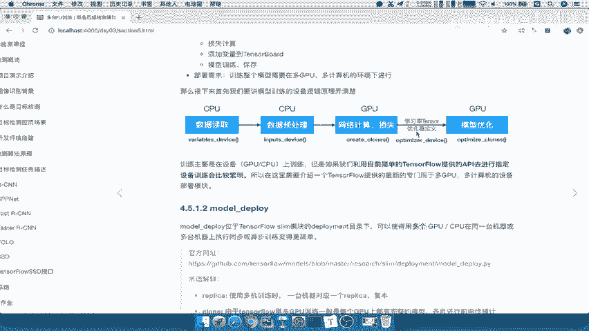

# 零基础入门！一口气学完YOLO、SSD、FasterRCNN、FastRCNN、SPPNet、RCNN等六大目标检测算法！—深度学习_神经网络_计算机视觉 - P60：60.02_训练：model_deploy介绍60 - AI前沿技术分享 - BV1PUmbYSEHm

下面呢我们就要来介绍一下这个model deploy，这样的一个库，那么这个库呢也是同样位于slam模块下面的，Deployment，那么这个文件呢啊我们也把它直接拿过来，作为我们项目的一部分啊。

在deployment这样的一个啊，model deployed这样的一个文件夹，那么这个库呢它可以使得我们多个GPU啊，或者多个CPU在同一个计算机上面计算，执行一些这样的一个操作，训练。

操作变得非常简单啊，比我们自己去执行设备要非常简单，那么这其中呢在model dep里面会涉及到很多术语，那么这个术语呢我们要简单介绍一下republic呢，哎republican呢。

它指的是你一台机器对应的一个啊，这样的一个republic，当然我们如果一个机机器的话，我们就不用管了对吧，一台机器，但一台机器上有可能有多个CPU，多个GPU吧，那么所以我们一般会什么呢。

clown这个clown就是克隆的意思，在TENSORFLOW我们多GPU训练怎么回事啊，是不是每一个这样的一个GPU训练，都要去进行指定吧，好，那么所以我们在每个GPU上面都会有特定的模型。

那么我们每一个模型会复制到各个GPU上面，然后各自这个GPU计算结果，将传播结果反向传播结果对吧，前向传播结果以及得到的梯度交给CPU，然后统一进行反向的强波的计算。

也就相当于每个GPU都会得到一份模型计算，能理解吧，那所以每一个GPU上的这样的模型，我们也做做叫做一个CHL，好这个词一定要记清楚这个词cl。

那么paramid server和windoworker server呢，它就相当于你如果你有多台服务器的话呢，会有一个又一台服务器端门，作为这样的一个参数的执行啊，执行保存你的参数变量值。

然后其他的这些计算机呢，都这个计算机上面的设备啊，全部都拿来进行计算好，所以我们这里重点是在于这个cloud啊，CLN这个词怎么理解，一定要知道了好，那我们所以呢把这个地方呢把我们的cloud给写上。

加我们的这个cloud好，我们这里写上我们的model dep，model deped的一个名词，D p r o y deployed，某名词当中有一个clown非常重要。

它指的是这个是每一个设计算设备对吧，每一个GPU，每个GPU好，我们都称之为一个cloud，那么一般是呢，这个每个GPU会会得到一个完整的复制的模型，然后呢这个复制的模型主要啊进行哎计算。

在设备上进行计算，能理解吧，哎那么这个计算当然这些名字呢都会统一啊，统一一起的，这个我们不用去管了。

那么这就是model deploy的一个啊介绍，那所以呢我们就先啊我们先做的事情，就把这个DEPLOG呢复制到我们，比如说我们这个地方。

那么这个我们再复制一份啊，复制一份的这个代码好online这个V3。0，我们再复制一份到这个V4。0，V4。0，那这样下呢。

我们这个数据呢就可以，直接把它刚才那个文件拷过来，把deployment考到我们的4。0的，这样的一个模块下面，好，这样我们就有了这样一个模块，就可以去使用了啊。

好那么我们接着来看这个model deplo呢。

提供给我们的哪些这样的一个代码，哪些函数，那么我们来看啊，它主要有两部分，一部分是deployment configure的一个类，作为一个初始的这样的一个设置，然后呢。

还有一个就是model depo里面定义的相关函数，不在这个类啊，一个是一个类，还有两个函数，那么这个类干什么呢，主要用于去指定我们变量配置，选择相关的一些设备，那也就是相当于在这个过程当中。

这些过程以及刚才所说的啊。

这两个，比如说这个他们都需要用我们的这个类，来去指定相关的设备配置，比如说我们刚才看到了variable device，Input device，optimize device好，那么它这个配置里面呢。

我们简单的看一下，它的这个里面的参数介绍是什么样的，Number close，你每一个计算设备的模型克隆数，也就是说你每台计算机的CPUGPU数能理解吧，如果你这一台计算机有四个。

那我就可能这个模型就控克制四份，复制四份能理解吧，那clock on CPU是否用在这个GPU上面训练，或者说只在CPU，那这就看你选择了吧，这是配置文件，你配置好它就会自己指定设备。

那么republic id就是指你某台计算机去部署的，那么相当于是某某默认啊，就是用我们的第零台计算机，作为我们的这样的一个参数啊，那number republic呢是你有多少台计算机可以用。

然后以及我们参数服务器的这些数量，也就是说你的这个作为一个存储参数的服务器，那么当然如果你是集群的方式，你可以指定一个机器作为参数存储，然后默认也是这一个。

然后呢worker job name就是你其他的这个参数啊，其他的作为计算设备的这些，那统一的名称叫做worker，然后PS就是work，就是PS的这样的一个job，就是parameter。

parameter server啊，参数服务器啊，这个呢其实我们后面这几个一般的来讲，我们都在一个服务器上面，然后呢多个GPU是不是就OK了啊，主要是用于GPU啊，你搞那么多台计算机也没有太大意义啊。

所以重要就是一台计算机，你要有多个GPU计算，最重要的是GPU的计算非常节约时间，所以你搞那么多服务器没有什么太大作用啊，你服务器那样，你只有CPU也没有用，能理解这句话好。

那所以呢一般来指定的就是前面这几个参数，我们都会去指定好，这也是我们的deplodepartment configure，参数介绍，那么我们接着来看一下这个variable device呢。

就指定你的全局变量啊，一些设变量的设备啊，啊我们都会默认在默认返回部署在CPU0，然后呢input就是我们数据根据数据输入变量的，也是在device，Cpu0，能理解吧。

好optimizer device，你的学习率变，优化器所定义的这些tensor也会在CPU0。

那么它还提供了一个这样的一个类的函数，叫class scope，返回你这一个计算机上面有多少个GPU的设备，命名空间，能理解吧啊返回多个GPU设备的空间名名字啊，返回多个GPU设备名称。

这样的话我们就可以取到固定的名称，它的名称就是按克朗0clin cloud，你有三个GPU。

就CN零CN1cloud，能理解吧，好这是返回多个GPU设备了，那么这个我们说了，Deployment configure，作为这个类主要是哎我们来写一下，这个主要是给予一些。

我们的初始或者是一些变量啊，我们要保存的变量配置的一些设备啊，包括指定设备环境，指定设备的环境，你的这个计算机数量，你的GPU数量等等，哪些作为服务器，哪些作为这个参数啊。

参数服务器如果你只有一台就不用管了，作为这个工作服务器好，这是第一个这样的一个类的介绍，那么在这个行这个文件当中还有两个函数，这两个函数分别就是负责这两块来看到，分别负责我们的在来这个这个地方。

两个需要去定义计算的时候，我们定义这些计算的操作。

在我们的GPU上面能对吧，所以在这个地方create columns，包括你创建我们的复制的模型啊，我们先得创建每一个模型，复制一个，这样每个GPU复制一个模型，然后对于这每一个GPU上的模型呢。

进行操作的训练，操作的定义就是说计算的定义能理解吧，这些定义都是要在我们的这个，run函数当中去执行，执行的时候，他就在这个设备上执行对吧，所以呢我们这两个函数来拿到这里来，在我们的这个这个当中啊。

在这里指令，然后呢在我们把optimizer，也给指定好，那么这就是我们的指定的这两个函数去啊指定，这里吧，我们这函数就把名字给记录下来就行了啊，好一个是这个create create columns。

Optimized colons，都是指的在指的复制复制模型吧，啊给每个GPU复制一个模型，定义这样的文字定义，然后呢，这边就是定义我们的这样的一个每个模型，运算优化的操作，运算优化的操作设备好。

这就相当于是我们指定了啊，指定了这样的一个过程好，这就是我们model deploy的它的一个函数介绍，其实在它的源码当中呢，也给我们提供了一个部署的一个相关流程，其实就跟我们刚才讲的一样。

首先你设备对吧，你的全局变量，然后呢你的输入的设备，你的优化等等能理解吧，你的优化的学习率等等，设备好。

