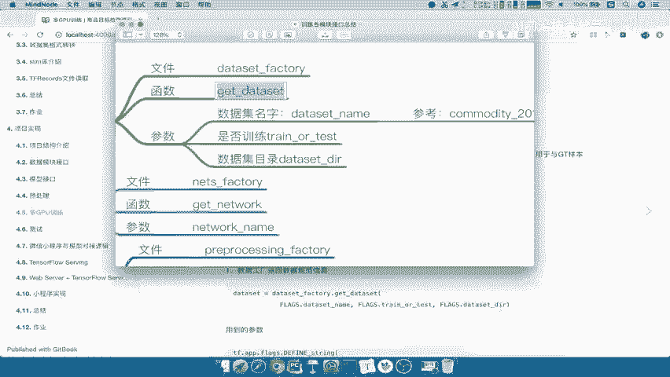
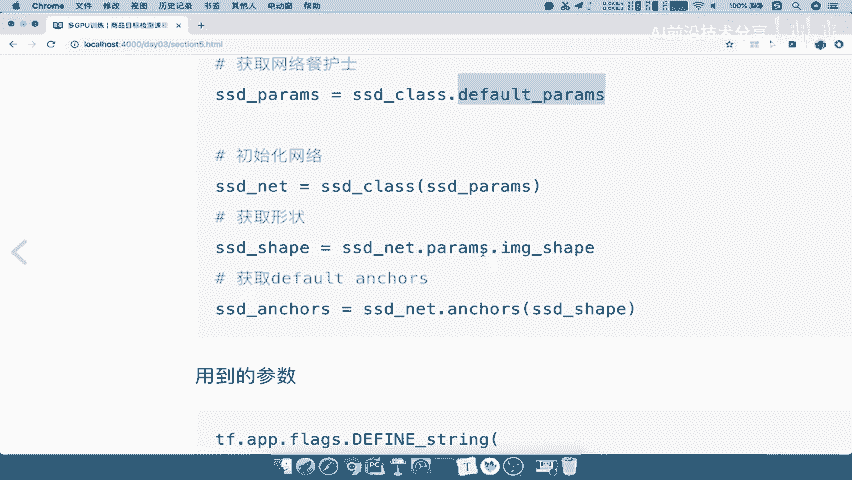

# 零基础入门！一口气学完YOLO、SSD、FasterRCNN、FastRCNN、SPPNet、RCNN等六大目标检测算法！—深度学习_神经网络_计算机视觉 - P64：64.06_训练：2数据模块与网络模型获取结果64 - AI前沿技术分享 - BV1PUmbYSEHm

好那么刚分析完了，这个我们货比数据对吧，获取图片数据要做些什么，那么所以根据这个需求呢，我们接下来要干嘛呢，第一个就是我们要将每个模块里面的数据，是不是要拿出来，你看第一个是不是图片的一个规范信息。

是不是要从我们的数据工厂里面拿，然后呢我们的这个预处理，预处理过程，数据增强，是不是要从我们的预处理的，这样的工厂里面去拿吧，然后还有一个就是我们要将b box里面的，这样的一个结果。

也就是说我们要将anchor box进行一个，这样的一个标记对吧，这里应该我们要写清楚啊，应该是anchor box，Angle box，就是我们默认的这些这个候选框，来进行正负样本不标记。

所以我们要从网络当中获取计算的，这样的默认计算的啊，这些候选框，所以我们有这几部分要做的，所以第一个获取我们的这个这个。

每个工厂的一个结果啊，所以第一大步骤就包含了，这三个结果的一个获取，能理解吧，好那所以呢我们在这里先啊。

对于每个模块的结果获取，每个模块结果获取，第一个是什么，第一个我们直接用个这个符号啊，第一个就是我们取出数据规范信息吧，对吧，哎通过通过数据工程，取出规范信息。

然后第二个呢我们要去获取网络计算的anchor，angles吧，结果然后第三步呢，第三步我们就要去获取预处理函数吧，获取预处理函数好，那么我们一步一步的去做，第一步获取公染，取出规范数据规范信息。

那么所以我们这里应该用到data set factory吧，好data set defactory里面的API用哪一个啊。

我们可以看到我们的API的安排是不是在get dataset。

所以我们在这里直接get dataset，get dataset里面有几个参数。

来看到我们当初定的参数的名字来参数，data set name name以及train or test是否是训练的，然后呢数据集目录吧，这三个参数我们都统一放在哪里哎。

flags里面就是命令行参数当中好。

所以我们将名字都拿过来，Dataset name，dataset name啊，然后呢这个train or test，然后呢我们的DATASETDR，这三个呢我们都在哎命令行参数定义。

所以呢这应该就是我们数据集相关的一些，这个配置了，那么直接定义第一个dataset name呢也是一个字符串，所以我们需要指定一个string吧，哎string类型啊。

所以呢我们在这里在这个下面TF点APP啊，我们直接复制过来吧，直接复制了，复制这个啊，复制这个，然后呢粘贴到这里，好那么我们这个name呢，我们指定一下我们的名字。

参数名字就叫做dataset name，还有我们这个默认的这个参数名字呢，我们就给上我们的数据集名字哎，比如说我们取出这个数据名字，MODITY杠COMMODITY杠，2018啊，这样一个数据的名字。

那这里就数据及名称，参数好，那么接下来呢我们要做的就是把第二个参数哎，定义好，第二个参数trainor test，它也是一个字符串吧，那所以这个字符串呢，我们也指定它是一个train啊。

默认给它一个train，这样吧，我们再复制一下，这里呢就是我们的train a test，好粘贴到这里来，默认我们是一个train t r AI n，以及我们的这个是否是训练集还是测试集。

接下来我们第三个参数DATASETDIR，我们DSDI是不是在这里啊，所以我们接下来是不是可以通过统一的flax，进行获取flex点，然后呢flex点flex点这个名字啊。

我们确认一下它是不是与我们上面定义的名字，是一样的啊，好那么这样的话第一个我们已经取出来了，返回就是一个DATASET这样的一个数据规范吧，所以我们直接定义data set。

这DATASET并不是所有的数据啊，而是一个数据规范，需要我们用后续的东西去取的吧，然后接下来我们就要去获取网络的anchors。

结果了，这个anchors，结果呢我们来分析一下这个网络。

Nets factory，它返回的是一个什么，我们在网络当中定义的返回。

它是不是返回直接是一个网络的一个类吧，我们单独在定义呢来看到我们的nice模块。

好我们返回应该是看这个factory啊，Factory nice，factory里面是不是返回的是一个模型的名字，它的一个sd d net哎。

也就是说返回是一个类，所以我们先来啊，Nt factory，点我们这个地方获取的名字啊，就是我们的get network，那么这样的话我们要定义你的网络名字叫什么，你的满网络名字是不是要去传进去啊。

那所以在这个地方，我们要涉及到将定义一个你的这样的一个，网络名字的这样的一个参数，也就是说model name我们直接在这里拿过来好，我们在这里进行一个进行网络相关配置好。

那么这个model name呢，默认我们就直接叫SSDVGG对吧，所以我们叫做flags点model name，那么这些东西返回的是一个SSD net吧对吧，哎SSD杠net好，接着这个net返回了。

我怎么去获取我们的anchors呢，哎这就要涉及到anchors怎么去获取，那么这里面我们要介绍的一个函数叫做sda net。

这个类当中有一个叫anchors函数，X呢需要你输入的图片形状，这个图片形状就是我们网络当中定义的。

这个形状是多少，那么这个形状怎么去获取呢，我们不是自己去查参数。

我们就是说网络自己定义的参数是什么，那我们来看一下网络当中设置的参数当中。

是不是有个叫做image sh，Image shape，三百三百，把一个元组放进去就OK了，所以我们要获取这个参数，是不是要获取SSD net里面的default net，default para嘛。

所以我们在这里获取对吧，获取默认网络参数，那所以SSD它的建立一个类啊，这个类呢我们直接sd d net，我们或者说这是个类吧，class杠class点，我们直接default。

把这个名字呢default paramid parameters好，这获取的名字呢我们取名，比如说啊叫做SSD杠PARAMS好，那么这个参数，这个参数是要作为我们初始化的时候，就网络你要用。

你可是是不是要初始化作为参数啊，所以我们在这里初始化网络，初始化网络name init函数，那所以SSD干class，我们传一个参数，就是我们的网络参数进去返回，我们可以称称之为一个SSD net好。

这才是真正的net net里面要干嘛呢，我们要去获取的是参数名字的sheep，那么这个地方呢提供了一个函数叫做parents啊，在这里面应该是不在这里啊，我们在这边看吧。

他这里面提供了一个叫做parents，也是说parameters呢，还是它默认的一个私有的属性，里面有一个image ship，我们也可以通过这里面的image shape去获取吧。

好所以呢我们直接获取默认的形状，好把这个我们关闭获取形状啊，用于输入到这个anchors参数，当ANX函数参数当中好，那所以SSD杠net点我们的PARAMS点。

我们的image干shape这些参数啊必须得一样啊，不要写错了，我们可以确认一下啊，确认一下你的这个PARAMMISE，还有image sh。

那么这image shape呢我们应该是小写啊，一个简短写啊，简写的，那么返回的一个SSD的GUSHEEP，它的网络的一个参数吧，所以最后我们可以获取anchors了。

那么所以我们用SSD杠net点我们的这个函数吧，我们刚才说的angle，输入的只是我们的网络形状就OK了，所以我们输入SSD干shape，然后获取返回我们的SSD杠anchors。

这个anchors我们说的是什么，是不是SSD网络当中啊，六层的所有，这个或者说它计算出来的默认这个候选框吧，我们可以称之为候选框好，那么这就是我们第二步，获取网络计算的这样的一个结果，那么这样的话呢。

我们在这里所使用的API都是我们都自己定义的，工厂的API了。

所以在这里我们简单的就来看一下啊，步骤一呢这个我们写好了，步骤二我们总结了说获取图片数据啊，以及我们要需要获取什么，直接粘贴到这里来啊，我们把这一部分粘贴这里，然后呢我们在这里写一下。

我们这里第一步我们首先就是要去每一层，将每个模块进行一个先获取吧，哎将一个每一个模块进行获取，那这个模块里面呢我们这里写一下啊，这模块里面呢我们有nets对吧。

有我们的dataset factory以及我们的啊，我们还有其他的把这名字复制下来，以及我们的nets factory，这个呢是获取数据集的描述信息。

然后呢nice factory是获取anchor box，他这目的是为了啊进行计算对吧，gt标记进行这个正负样本标记好。

