# 零基础入门！一口气学完YOLO、SSD、FasterRCNN、FastRCNN、SPPNet、RCNN等六大目标检测算法！—深度学习_神经网络_计算机视觉 - P65：65.07_训练：2网络参数修改、provider获取数据、预处理65 - AI前沿技术分享 - BV1PUmbYSEHm

好，那么刚才呢我们把这个啊，我们的网络参数给获取好了，但是呢这个参数，当时我们在这里有一个参数没有去进行修改，也就是在我们网络当中SSD class当中，我们来看一下，看到这个他的这个网络源码。

以及他的这样的一个定义，那我们看到这里面有一个参数呢叫做network啊，network的一个nb classes，这classes指的是你的网络输出的时候，它的这样的一个哎localization呢。

以及它的这样school定义，最后是不是SSD网络输出的这样的一个类啊，所以在这个时候我们类并没有去修改，所以你需要做的事情就是将我们的这个default。

这样一个PARAMS通过修改它的这样的一个参数，也就是你的类的数，注意啊，这是指定我们这个网络输出的时候，它的类别，那这个类别我们说过啊，可以用这个我们的数据集当中的类别，再加上一个。

那所以我们这个地方替换，通过这样的一个gun replace方法替换。

将non classes指定为九就OK了，好这个地方呢我们直接指定好，那么这样的话呢我们这个计算结果啊就OK了啊，那么数据接下来就是数据处理的这样函数，进行一个获取。

那我们说我们把数据处理的函数放在哪里呢，放在这一个processing factory里面吧，好我们通过调用这个这个函数点，我们里面的这个参数呢叫做get杠，哎prep。

我们直接通过PREPROCESSING，获取这个网络的这个我们的预处理函数，那么第一个参数呢还是同样的。

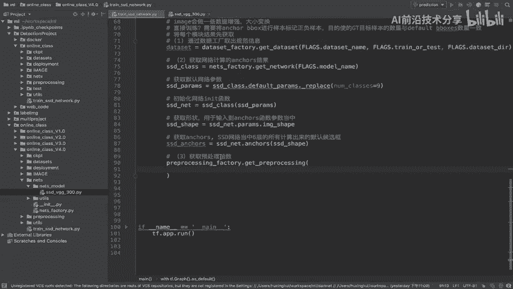

要看到我们的这样的一个，之前的一个接口参数啊，我们来打开，好我们直接从桌面去进行获取，那我们来看模型的这样的一个预处理接口当中，它的参数一个是预处理的名称，这个名称我们说它跟这个模型名称是不一样的。

哎也就说还是SSDVGG这样的好，那所以我们同样将我们的flex点，model name给获取出来，然后以及我们把这样的一个是否训练哎，is train training对吧。

那我们这个过程是不是训练过程呢，我们标记为true就OK了，好，那么这个地方呢就是我们获取这样的一个函数，那返回呢它是一个处理的函数，这个函数你已经指定is training点true。

他返回的应该是一个什么processing for train吧，好那我们这里呢取名字，比如说叫做image gun process，Preprocessing，干FN。

这是我们要用来处理的一个数据的函数了，好那么这样的话呢我们将把第一个步骤，也就是说我们要获取什么数据，先把这些网络的这个每个工厂里面的数据呢，给函数获取出来，那么接下来我们要去做的事情呢。

我们可以去打印一下我们的网络参数，那这里我们可以使用这样的一个啊，我们的train tools里面有一个叫做print啊，Configuration，建立一个函数呢，它可以打印我们的网络参数。

你直接填到你的内容进去就行了，那这行代码我们直接复制过来啊，打印打印网络相关参数，好那么这样是不是就OK了，那么接下来我们这个总的这第第二步当中，我们还有一些东西没有去做完。

那也就到了我们第二个处理过程来看到这里，我们把这些工厂啊，以及数据规范信息返回出来了，那数据有没有拿到呢，并没有吧，所以呢我们要将通过def，deploy config里面的input device。

指定我们将数据获取怎么获取啊，我们之前说过了，数据规范信息，是不是要通过provider去进行获取了，所以呢在这里我们要进行指定slim。

和我们的data set data provider去获取我们的数据，以及把这个数据进行预处理，真正的一个预处理，因为你数据才取取出来吧，通过get方法，然后对这个进行一个标签。

那所以我们把这四个步骤呢进行啊，每一步骤进行讲解，那么我们把这里啊继续我们的第一个大问题，或者说第一大步骤吧，在这里面我们来第二个的，2。1啊，2。2，那么我们把这几个步骤粘贴到这里来，注释一下。

那我们首先来看我们的数据并没有拿出来，所以我们要去用这个provider去拿，但是要拿出的这个数据这个变量已经有了，我们应该要指定什么设备去获取吧。

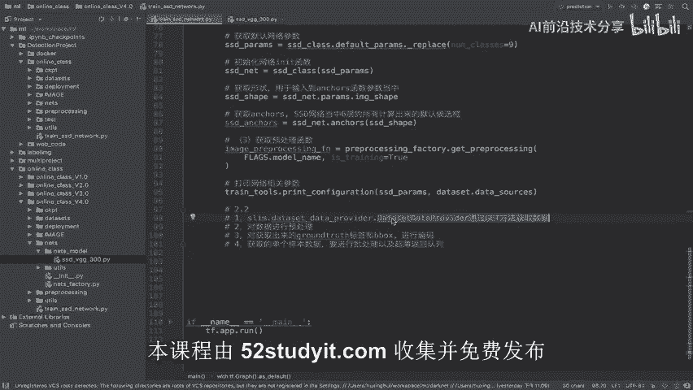

所以我们之前一直强调的说，你每的每一个步骤，都是要根据你在哪个设备里面去进行获取吧，那我们获取数据数据放在哪里呢，放在input device，就是CPU当中好，所以我们在这个地方指定。

来指定我们的这个设备。

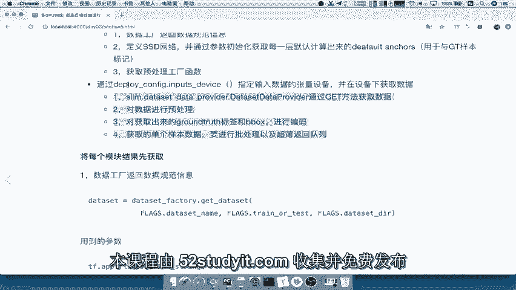

With tf device，然后指定这个input device是不是就可以了好，所以呢with tf点DEVICE，然后呢我们指定我们的deploy configure，点input杠。

我们的DEVICE好，这相当于就是指定了我们的设备了，CPU设备，那么然后我们会通常呢在这里面，每一个作用的这样的一个空间当中啊，或者说你每一部分的一个这个处理函数呢。

我们会在一个这个命名空间当中去运行，所以我们给当前啊，给当前操作举一个，作用域，名称好，那么这作用域名称呢我们之前已经讲过对吧，be with tf点啊。

我们的TENSORFLOW当中是不是有name杠scope好，那这个名称呢我就以当前的这个模型名字好，再加上我们的哎，我给它取一个这个部分叫做provider去进行获取，可不可以呀。

哎那我可以比如说叫干data杠provider啊，这个名字呢，你可以去随意的指定一个名字就OK了，那你在获取的时候，可以用他的名字默认获取这个空间的好，那么接下来我们就通过第一步，这个地方获取数据。

那么这个获取数据我们是不是已经熟悉了，那所以呢我们只要通过这个类这个类，然后呢我们的这几个参数分别是什么呢，第一个呢还是将我们的DATASET放进来，是不是我们这个地方的获取的DATASET。

数据规范信息。

第二个参数就是我们要去读取的，这样的一个线程数啊，我们通过在这里来指定来我们读取的线程数呢。

哎指定为比如说这四个好，我们在这里写上四。

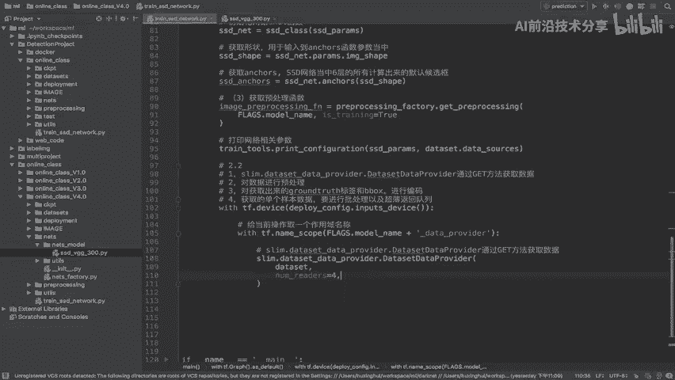

第三个参数，也就是说你的一些你的队列大小，以及你存放你在取这个provider的时候，你一次性取多少，那一般来讲呢我们都会以批次来为处理，也就是说我可以指定批次，每批次多少个数据的多少倍。

那所以我们这个地方呢，我看一下我们的批次，已经在这里看一下有没有定义啊，没有定义，那就说明我们每批次这个数据有没有定义啊，哎没有，在这里吧好，所以我们在这里先定义一个批次的，这样预处理的好。

我们在这里应该是网络，然后这是数据集，那我们在这里吧，TF点app点那这个批次的它是一个整形吧，那整形的话呢我们就取名integer就OK了，所以我们在这里粘粘复制一下，直接粘贴，那么粘贴的话。

这里改成我们的批次名称，Bench guy size，以及我们这里名这个地方的默认数字好，我们的每批一次获取样本数，那么接下来我们在这里就要指定这几个参数了。

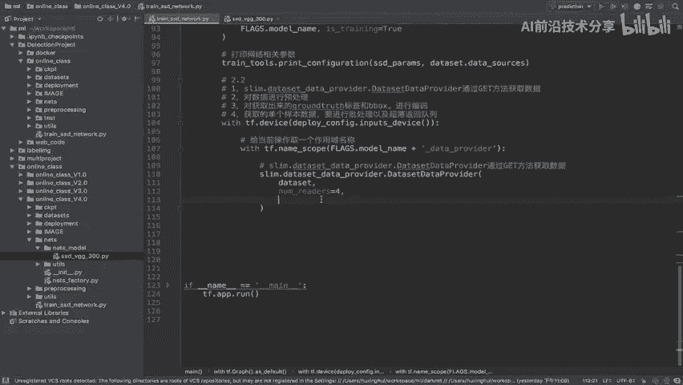

我们直接从这边复制过来，Common queen capacity，以及你的最小的队列和最大的队列。

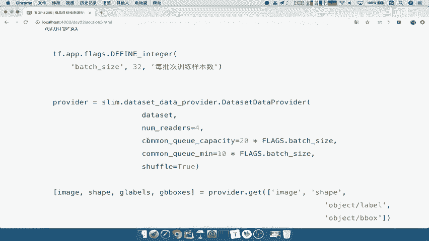

以及你是否默认打乱好，那么这个参数已经有了，那返回它是一个什么呢，provider吧，那我们说这个provider要通过干嘛呢，怎么去获取数据啊，通过啊get获取数据，那么provider点get数据。

那么这个get填入进去的这个东西是什么，是不是一个列表当中说了，然后呢指定你之前获取的这些名称嘛。

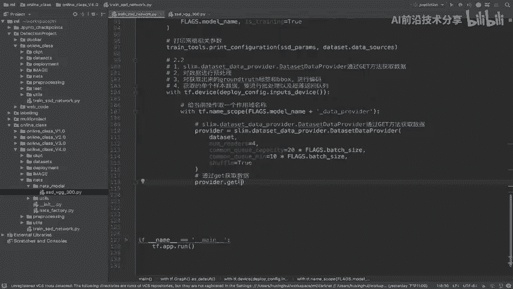

是不是你之前在存储读取的时候它名称，所以我们这个名称直接也从这边复制过来了，好那么我们的这个内容呢包括image以及shape。

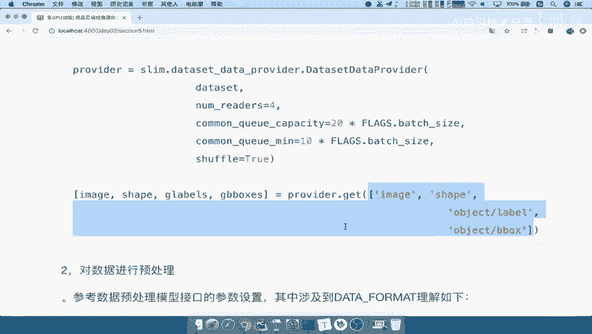

还有我们的image label和image，比box是我们需要去操作的，那么我们用一个列表将我们的image专装了image对吧，然后呢g labels比如说叫做或哦，第二个啊，第二个shapes。

第三个才是我们的labels，我们可以获取的是grand truth的labels，以及我们的哎GB boxes好，那这是我们四个这样的一个参数啊，在这里相当于是真正获取参数，那么我们获取这个参数呢。

这个相当于是把图片的数据，以及它的这个gt的b box获取出来了吧，那所以我们接下来要怎么办呢，要肯定要是要去进行一个预处理过程了。

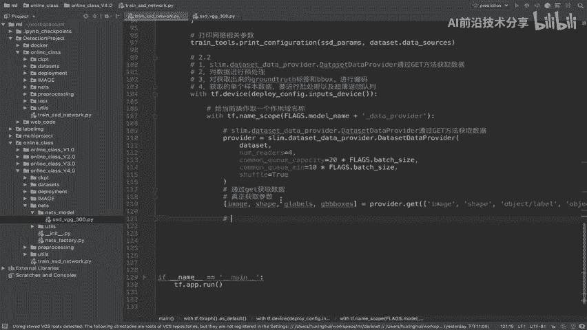

你获取出来数据要直接啊直接进行数据预处理，那么这个预处理我们预处理函数是哪一个呢，来看到这里，我们的预处理函数是image process preprocessing funk，好。

我们在这里调用这个函数，那我说这个函数就是我们之前所说的，在这里介绍API当中，它需要填入的参数就是包括你的图片，你的标签以及你的我们的这样的一个b boxes，所以我们可以想象在这里面。

你的参数是不是都已经获取出来了，有几个参数也获取了，image也获取了，还有我们第二个参数来看到labors是吧，那所以我们在这里填，应该是填g labors，以及我们再来看第三个参数b boxes。

所以我们这里谈传进去的是g boxes啊，这这直接写啊，g boxes一个G好，然后呢复制过来，那么第三个参数我们来看它是out sheep，也就是说你传出去的我们的模型的一个形状。

也就是说我们数据最终模型输入什么水呢，是不是三百三百三，所以我们这个地方的形状，是不是在这里获取的呀，三百三百三吧，所以我们在这里获取出来，那么接下来看第这样的一个参数，Data format。

那么这里我们需要去传一个参数，叫这个数据的一个格式，那么这个格式呢我们在这里先啊。

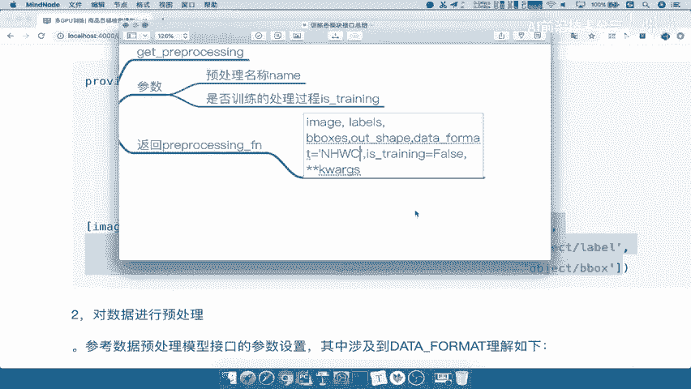

在这里先写上，我们这里啊把这写了吧，alt gun shape等于这个参数啊，它应该是传一个这样的一个字典的形式，然后呢我们的data杠for mart，等于我们在这里指定一下，我们传入数据格式。

这里提到有一个叫做这样的一个图片的像素，以及你的通道数的一个位置的一个参数，那么首先把这个参数我们先写好，我们比如说用我们定义一个全局的，这样的一个变量啊，比如说在这里定义，或者说我们在这个上面吧。

在这里我们第一个叫data杠，for mt等于这个参数呢我们是默认是NHWC啊，N h w c，所以把这个参数来放到我们的处理函数当中好，那么这样的话呢，我们这个处理函数算是把它定义完了。

那么这个处理函数返回的值呢，我们先来看一下它呢也会指定is the train啊，默认的啊也也可以啊，应该是默认的。

它是一个true啊，我们来看一下，当初呢我们在定义这个接口的时候，Paper cessing，然后呢，我们通过这个工厂默认放进去的，是不是一个true啊，所以他应该获取的是一个一个true好。

那所以我们在这里已经传进去了。

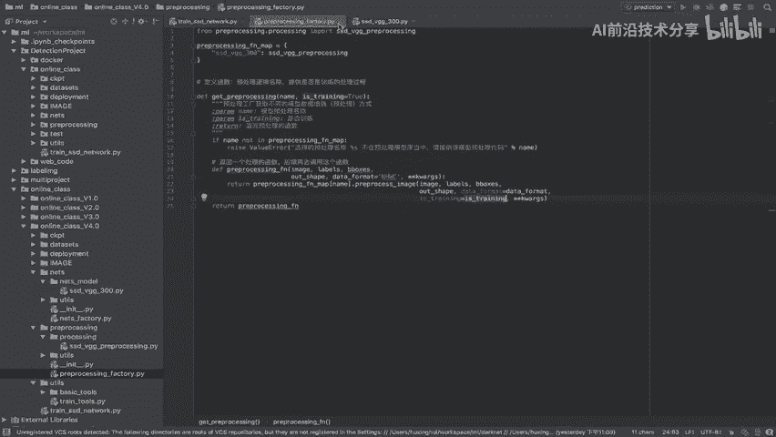

那我们接着来看这个地方的返回值，它的返回值有哪些呢，来看到这里，参数的返回，它应该是一个对处理信息给处理好之后，的参数吧，所以呢我们看到预处理接口在这个地方。

Preprocessing for train，它这个参数返回的有三个值，一个是图片，一个是标签以及变化后的b boxes，能理解吧，也是我处理之后呢，只返回图片的内容以及你的标签。

还有你的gt的这样的一个值吧。

所以我们直接接收这三个参数即可，那么这就是我们的image，然后呢我们的这个g labels啊，相当于是g labels以及GB box好，这是除预处理啊，注意啊是处理之后image的形状。

image的形状它应该从一个建立一个问号，none对吧，然后呢一个问号一个三到，变成了这样的一个数据形状啊，这个数据形状就是三百三百三好，这就是我们处理好的形状，那么这样的话呢。

我们的数据的这样的一个处理过程呢，我们先到这里，然后我们具体去详细讲这个data format这个公式，这个地方为什么要指定这样的一个data format格式。

