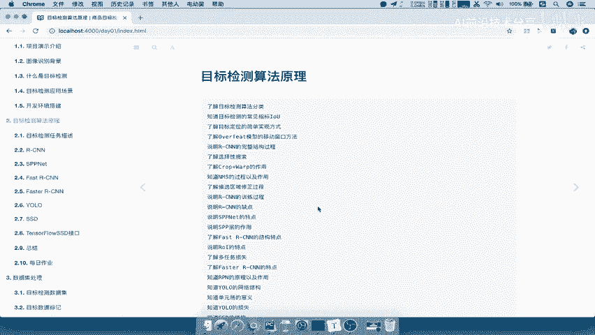
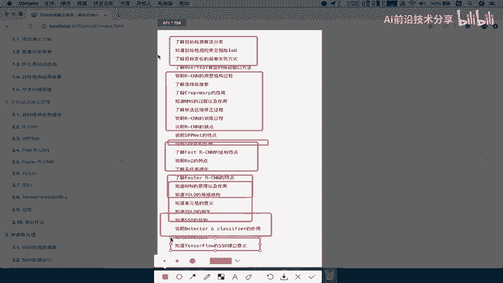
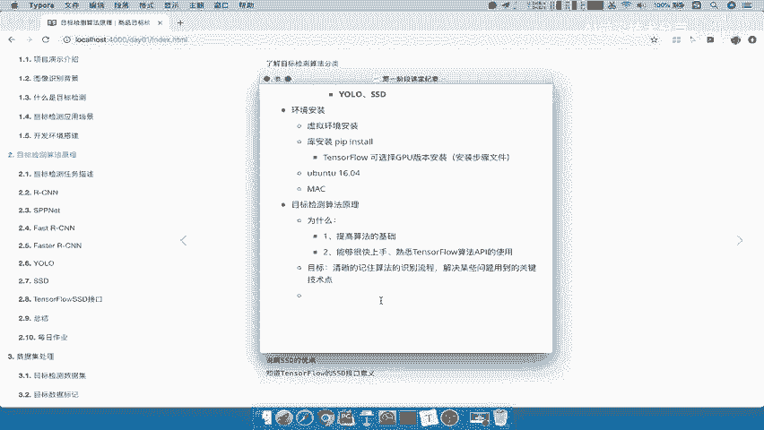

# 零基础入门！一口气学完YOLO、SSD、FasterRCNN、FastRCNN、SPPNet、RCNN等六大目标检测算法！—深度学习_神经网络_计算机视觉 - P6：6.目标检测算法原理铺垫6 - AI前沿技术分享 - BV1PUmbYSEHm

好，那么接下来呢，我们就要去讲解这个目标检测的算法原理。

那么在这个部分呢，我们有这么多啊都需要去啊了解呀，说明的一些这个知识点，那其中包括了目标检测相关的一些，简单的一些啊场景指标啊，包括你的简单的一些分类，还有我们的RSEN啊。

还有我们的s p p net以及fast sn和faster r cn啊，yo SSD这个那都是我们一一要介绍，以及最后的啊这个TENSFLOW的相关的一个接口好。

那么在正式讲解这些算法之前啊，我们先来明确两个问题，第一个就是为什么我们要去学习这些算法，哎这也是很多同学去关心的对吧，然后呢，第二个呢就是我们在讲解这个算法过程当中，你需要去掌握到什么样的一个程度啊。

或者说你要掌握什么东西，那我们在这里啊直接来写一下目标检测啊，算法原理，第一个就是我们的啊，为什么，那么为什么要去讲这个算法呢，好第一个呢肯定是，第一个就是为了把你的基础给打牢对吧。

哎我只清楚这个算法的原原理过程，哎，那你是不是要比别人呢，可能会更加啊有优势一些对吧，一就是啊提提高哎算法的一些基础，好那么第二个就是说我讲解这些算法，那么你需要去干什么的。

主要是不是要去用这个API去去做这个开发的呀，那所以这里就有个问题啊，当你去用这些这个API去用的时候呢，你如果没有去了解过这个算法的话，那你可能连这个API呢可能就不会用。

所以在这个地方我们就是第二点，就是为了能够熟悉啊，能够啊很快上手，或者说熟悉哎这个TENSORFLOW吧，或者其他的框架也可以啊，TENSORFLOW这个API算法AKI相关的使用，哎这是这一点啊。

非常重要，你如果说连这个算法不清楚啊，可能你这个API真的是不会用啊，而且你看到这些参数，包括你返回值到底该怎么去做啊，包怎么去进行运算好，那这就是为什么啊，好，那么接下来就是我们在这个讲解。

这个算法过程当中，你需要去掌握些什么好，那我们提出了就说我们要学完这些算法，难道是我们自己去实现这么多的一些算法吗，哎并不是在项目当中啊，我们是以快速的去了解这些算法的原理过程。

然后呢能够快速的去上手写项目吧，那所以我们的目标就是能够清晰的啊清晰的，记住我们的每个算法啊，每个算法吧，算法的啊，一个识别流程以及每一个算法都有自己的特点，你需要知道就是解决不同问题。

这个算法用了相关的什么技术啊，每一解决问题解决哎一些问题用到的关键哎，技术点你要知道清楚哎，我比如说我提出哪一个算法对吧，它用到了什么技术，哎，他怎么去进行一个解决这个问题的，哎这是必须要直接掌握的。

当然我们的程度呢并不是说啊，让大家自己去写这个算法啊，好那么所以呢基于这两点啊，我们去通过快速的把这些算法呢，去进行一个熟悉，对吧好，那么这也就是算法原理。

