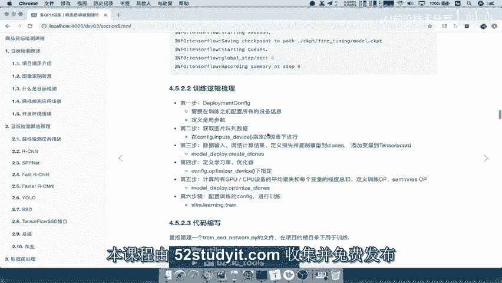

# 零基础入门！一口气学完YOLO、SSD、FasterRCNN、FastRCNN、SPPNet、RCNN等六大目标检测算法！—深度学习_神经网络_计算机视觉 - P70：70.12_训练：3复制模型、添加参数观察与4添加学习率和优化器70 - AI前沿技术分享 - BV1PUmbYSEHm

当我们所有的数据都拿到之后，批处理队列数据拿到之后，我们接下来干什么，就要回到我们的主线当中来，之前我们定了这五个，这几个步骤我们还记得吧。

第三步呢，也就是说数据拿到就要输入到网络当中，去指定网络去计算唉，计算你的输出结果，包括预测结果，还有我们要定义整个网络的损失，然后这些操作呢我们需要去干嘛呢，复制到N个设备当中。

也就是说复制到client当中，然后会给相应的每client的添加一个TENSORBOARD。

观察这个地方，我们来看一下，那这里我们怎么去做呢，在train tools里面啊，也提供了这样的一个比较方便的函数，直接把这几个步骤都，直接把所有的步骤都做完了，那我们首先来看一下这个函数。

然后再去看一下具体做些什么事情，这个函数呢叫做deplose summary，它会将我们的网络的配置，这个地方设备的配置是什么意思啊，是你的这个有多少个close吧，它需要复制多少份。

那然后呢bench queen就是我们的队列，队列的数据放进去，以及你的网络放进去，网络是要需要进行计算的，能理解吧，那summaries就是要你通过这个函数，要去添加一些变量值的观察。

在TENSORBOARD当中能理解吧，那然后bench ships，Bench ships，它意思是呢，我们要填入一个能够去指定bench queen里面大小，这个队列里面大小。

就是说每一个数据元素的数量啊，tensor元素数量以及flux，就我们一些参数会在里面去使用。

那么它会干嘛呢，返回三个参数，一个就是默认所有第一个啊，第一个cloud变量的操作结合，然后呢第一个clown的一个名字，以及所有cloud组成的这样一个设备名称，那么这一句。

这个函数在这里所做的意思是什么呢，我们想想，比如说我们现在有这么三个设备，一个两个三个啊，三个GPU我们在这里标记上，然后呢我要干什么事情呢，我们数据已经拿过来了吧，数据给你了，我要输入到网络当中。

然后直接得出预测结果吧，得出预测结果的tensor，得出预测结果，然后呢我会跟与目标值，就是我们刚才进行样本标记的进行损失，计算好我定义的这一系列的操作，然后我会把这些操作呢。

都给复制到三个CPU当中啊，三个GPU当中，假设你有这么多设备，那么每一个设备上面都是不是都有，我们相应的计算过程，是不是都在这个设备当中去做了，那然后呢我们通常在训练的时候会观察对吧，训练。

会观察结果，会观察变量啊，损失啊等结果，所以呢我们会默认选取一个，我们不可能三个GPU设备都去观察，四个都去观察对吧，我们只选择一个，当我选择这一个GPU，去观察这个GPU上面里面的变量。

它的一些这个变量的一些运算的这个值的情况，以及损失的情况，能理解吧，它会默认首选这样的一个默认第一个，所以第一个值它就返回所有变量的OP操作，那所有的第一个cloud里面的OP操作啊。

包括它的cloud的名称，然后呢first conscope吧，就是第一个设备的名称，我们前面说了吧，它就是以clown下标距标记的吧，以clown下标零，cloud下标一是不是去标记。

然后clouds呢，它指的是我们所有设备的输出以及名字，以及它所在的设备能理解吧，好那所以这就是我们的这个函数的作用。

能保存一下，这里呢就是我们的模型的复制与损失与观察吧，好那么我们来看一下，在这里我们需要去输入模型，输入网络模型，输入我们的参数等等，那我们现在呢就去将这个函数先写了，那么在train tooth里面。

Deploy summary。

我们把这个函数复制过来，那我们要注意了，我们的这个地方复制模型，就不是在这个设备里面了，能理解吧，哎我们要在给第三步，我们看一下是不是在这个地方啊，第三步对吧。

第三步呢我们会去复制模型到不同的GPU设备。

以及损失，还有变量的观察，所以我们使用的函数就是这个函数，那我们来看一下它需要什么参数，这个我们有这个是不是也有sad net也有吧，他需要这个网络summary，我们这没有summary。

我们说了它是一个tensor当中的一个摘要吧，哎摘要怎么去获取摘要呢，我们通过默认啊get collection去获取，那这个函数呢，在这里我们可以通过TF点get collection。

然后里面的graph kiss summaries能去获取好。

我这个呢就直接粘贴过来了，那所以我第一个是定义我们的摘要，定义好了，接着我们来看一下这个函数里面，还有哪一个没有的，就是bench ships，这个bch ships怎么理解。

也就是说bench ships到底是个什么东西，我们这里直接说，它代表的是我们解析这个bench queen的大小，但是呢这个大小指的是什么呢，我们这里是不是指定了获取五个阿尔法。

那么也就是说它是指的一个当然指的啊，指的是获取的一个默认队列大小，也就是这个R的大小，指，上面R的大小，那么这个大小是多大，我们刚才计算了是应该是多少，是不是19个tens啊。

所以呢我们这个地方我们可以去传进去啊，他这里要求呢是这样的一个格式，就是说bench ships它应该是一个形状，这个形状呢它是一个一维组成的，这样的一个列表啊，所以我们没有去写啊。

那所以呢我们在这里就直接去定义，我们的这样的一个大小，那么这个大小呢，我们bench shift的TCHBATCH等于，那我们这个地方呢直接写出我们的sheep吧，等于一一个是image。

然后再加三乘以，我们一共有多少个这样的一个值啊，有三个，这个每一个里面有六个，所以呢我们可以默认获取六个，当然这六个怎么来，是根据你网络的结构来输出结构了，所以呢我们可以用SSD anchors。

这个代表你一共有多少个呢，有六个，然后三个18对吧，所以呢我们接下来就直接通过这个函数，好把我们的参数写过来，接着它返回的值，我们说了一个更新的所有的OPS。

以及我们的第一个命名的这第一个默认的class，还有我们的所有的class的一个名称结合好。

我们把这个格式呢调一下，好那么有的同学呢可能就疑问，到底这个函数当中做了一些什么事情呢，我们可以去进train tools里面的这样的一个函数，去大概的看一下对吧，看一下他做的事情。

那么这个呢也是我们对于他的这样做了一个，简单的分装好，我们来看一下，这里有一个叫get这个get，Deploy lose summary，那么这里面干什么事情呢，他会去create cos。

Create cons，我们说是什么意思啊，是不是获取复制所所有的设备吧，然后得到设备名称，然后我们可以获取到一个设备，那么create class里面呢，它会让你去把模型的整个运算过程定义。

也就是说我去用模型net，然后去得到预测结果，预测结果与我们的标记结果，通过队列里面取出来，标记结果去干嘛呢，哎进行一个运算，损失好，我把这些操作定义好之后，传到create cos。

让所有模型都有这个操作，能理解吧，然后呢再去对于默认的第一个空间当中的啊，第一个这样的一个设备当中的所有的一些啊，函数啊，包括损失啊，全部都进行一个观察，添加到我们的summary当中。

这个我们就不说了啊，添加summary好，这就是他所干的事情，那么这样的话呢，我们这一步呢也算是给它进行一个完成了对吧，相当于是我们损失了变量都观察好了，那么接下来我们再来看你的损失变量等等。

都定义好了，接着是不是要我我要去干嘛呢，需要定义一些学习列去去进行训练，对不对，哎我要去进行把损失都添加好了，我就要去训练了，所以接下来要做的事情是定义学习率，以及我们的那这里应该还少个参数啊。

我们的flags里面应该会有带的一个参数，叫做这个参数，我们来看一下flags当中，flags当中来看到。

它会有一个参数叫做weight decay，那weight decay呢是指在我们网络定义的时候，它去运算定义整个网络，它会指定一个哎这样的一个函数，这个是什么意思呢，就是我们的网络误差惩罚下。

是在网络定义的时候添加了，能理解吧，啊，我们这个地方呢少了一个这样的一个。

添加一个啊，我们在这上面去添加一个好，我们在这里添加网络相关的配置，在这里添加，那么这相关配置就是防止过拟合的，让我们的网络呢误差惩罚一下，对吧好，那么接下来再继续回到我们刚才的第四步。

我们要去定义学习率以及优化器对象，哎tensor吧，好那么我们定义这些呢。

来继续回到我们的上面的这张图当中，看到这张图，我们说了。

GPU损失计算是不是在指定create comments里面去进行，然后我们会去将学习率tensor和优化器定义的，定义的话，我们会指定一个叫优化的一个设备。

还是默认CPU能理解吧，所以这个地方也是在optimizer device下面进行，那所以我在这个地方呢，我就会在指定这个上面设备下进行我们定义，那么定义的话我们用到两个函数叫做这个函数。

一个函数叫做configure learning rate，传进去，你的配置参数，这个配置参数等下我们会说有哪些，以及你的多少个样本，以及我们的全局步数能理解吧，哎我们的全局步数是不是一开始就定义了。

然后以及我们配置optimizer。

就两个函数，我们要知道他们两个的相关的参数啊，所以呢我们接着来看，在这个里面flex里面我们需要定义什么，也就是说学习率的时候。

我们前面在最开始我们定义了什么，学习率误差是不是在这里啊，所以我们接下来要把这几个都拿过来，也就说没开始决定的，好我们把这个呢缩进一下，那么对于这几个值我怎么去做呢。

那肯定就要用这几个东西去配置了吧，所以我们先将这些东西先配置好好，那么这里面会多一个叫学习力迭代的种类，以及你的优化器类型，学习力初始的学习类，终止学习率，那么这个优化器的种类。

学习的迭代种类就是你以哪一种方式，以指数的迭代的方式从它减到它为止，能理解吧，啊这个呢是我们如果你知道啊，这个TENSORFLOW相关的一些基础啊，深度学习基础的话。

你应该知道这个东西是什么意思啊，所以我们在这里不会去过多介绍了，好，那么这个里面呢我们直接加啊这个训练，训练学习率相关相参数，点一好，那么我们这里有这么几个参数了，这后面呢我们再flags传过。

传到里面去的时候呢，我们就不用担心这里面有没有去定义了。

那我们来看一下这里的代码呢也非常简单，指定一个设备使用这样的一个设备，我定义的learning rate就在这个设备设备上定义的，以及我们使用的learning rate在这里能理解吧。

最后呢我们会将learning rate添加到我们的summary当中。

好，这就是我们的这几步，所以我们将这个函数呢来放到这里。

进行一个注释啊，我们按照这个函数来讲，首先是不是要使用设备还是一样的，with a t f点DEVICE，指定这个设备是不是在我们的DEPLOTTINGCONFIG点，哎，我们的optimizer啊。

O p t i m i z e r，然后呢干DEVICE啊，它这里默认没有这样的一个提示啊，好那么这个optimizer device，然后呢，我们接下来在这个设备上指定学习率和优化器，或者定义吧。

它并不是说我就一直直接去预期了吧，那么学习率来看到使用TF的这这个配置下面的，所以我们应该是train tooth啊，在train tooth里面的config learning rate。

也就是在这里面，它这里面有一个叫做configure learning rate的，我们可以把这个函数名字呢复制过来，那我们来看一下这个函数的参数呢有这么三个，一个是我们的标志，这个命令行参数。

以及我们的每个迭代时候的样本数，也就我们的global step，所以我们在这里指定一个flex，第二个参数name samples，那所以我们就要决定了我们一共有多少个样本。

那怎么去获取我们这样一个多少样本呢，我们在DATASET还记得吗，里面是不是应该有一个这样的一个NSAMPLES的，这样的一个获取对象，所以我们可以直接，好DATASET，也就是说你的数据集啊。

整个的这样数据集的这样的一个多个样本，以及你迭代的全局部署，就是我们的global step好，所以呢我们在这里返回我们的一个learning GUI，a t e learning rate好。

我们将这个的格式调整，那么接下来我们定义优化器啊，优化器，那么优化器呢我们直接train tools，点我们的config optimizer，CONFOPTIMIZER呢，然后指定第一个参数flex。

第二个参数learning rate，那么这个learning rate就是我们刚才定义的learning rate，好，返回一个OPTIMIZE啊。

那这样的话我接着我们将要观察对吧，要观察学习率的变化情况，添加到我们的这个summary当中好，那么这个地方呢我们直接summary点ADD，是不是就OK了。

那么ADD的话我们会直接将learning rate以一种值形式，我们说了TENSORFLOW里面的TTF点summary，点SCALA吧对吧，TF点summary，Summary。

MMSUMMARY点我们的这个SCALA啊，这个函数，那么这个函数呢，第一个就是你放进去的一个名字，我们就以这个命名，然后把我们的值给传进来，Nerrate，这样的话。

我们也完成了学习率的相关优化器的定义，在指定设备上定义好，这是前面的，那所以呢我们到这里呢也去总结一下，我们刚才所做的事情，就是我要去计算损失，计算复制到不同的设备吧，哎复制模型到不同的设备。

那所以我们在这里来看到，写上我们的第三步骤，好定义我们的什么一些损失计算的过程吧，是不是定义损失计算过程啊，所以呢我们还会定义这个模型结计算结果损失，然后添复制到，复制到不同的模型。

那复制的部落模型呢我会观察观察，默认复制不同的一个设备啊，不同的一个设备不是复读到这个模型cloud好，那么观察啊默认一个CLN变量情况，那么这里面就有很多了对吧，你有这个这个损失啊等等。

还有其他的一些值，那么我们说这一步骤添加好了之后呢，我们需要去添加的参数有这么些对吧，我们把这个函数拿过来，这函数需要学会去掌握使用的，把它粘贴到这里来，那我们直接粘过来吧。

好包括呢这个格式呢我们可以去调整一下啊，好然后呢这一个，那么这是第三步的这样的一步骤，然后接着我们做了什么，接着我们需要去做的事情，把我们的学习率优化器给定义吧，哎定义学习率优化器这个定位。

学会学习率优化器也是在在默认的CPU设备进行，那这边都是在GPU设备进行，对吧好，那么所以我们这个地方的定义啊，包括使用我们使用设备啊，通过这个使用，然后呢以及我们再去定义CONFIG的时候啊。

我们使用的这个参数直接复制过来，然后呢还有这个参数，记到每个参数它的这个里面一些细节的啊，参数问题，参数怎么去填的，里面涉及到哪一些配置文件，那然后会涉及到学习力的定义，对学习率相关参数的添加。

那么这个添加呢我们直接在这里写上，添加这些参数，我们直接通这通过这里拷贝过来，好在这里，那以及在这里运行的时候也是有参数的吧，这个参数叫做我们的网络的误差项，惩罚项参数好，那么这样的话就OK了啊。

