# 零基础入门！一口气学完YOLO、SSD、FasterRCNN、FastRCNN、SPPNet、RCNN等六大目标检测算法！—深度学习_神经网络_计算机视觉 - P7：7.目标检测任务描述7 - AI前沿技术分享 - BV1PUmbYSEHm

那么现在呢我们首先第一个就要来看目标检测，任务的一个描述。

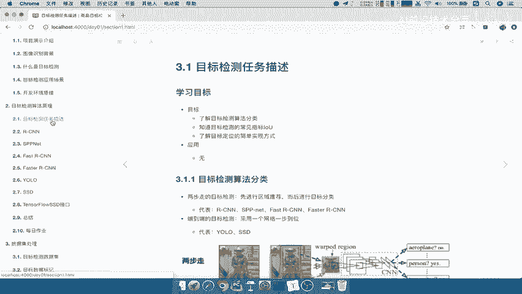

在这里我们的一个目标，就是了解目标检测的一个算法分类，然后呢目标检测的常见的一个指标，怎么去衡量这样的一个结果好坏，然后呢目标及定位的一种简单实现方式好。

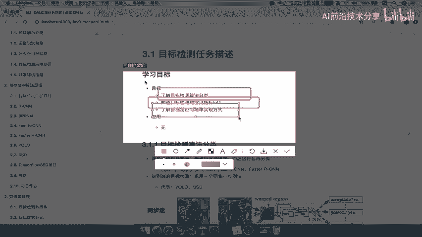

那我们首先来看目标检测的一个算法分类，那这算法分为两大种类别，第一个就是两步走的目标检测和。

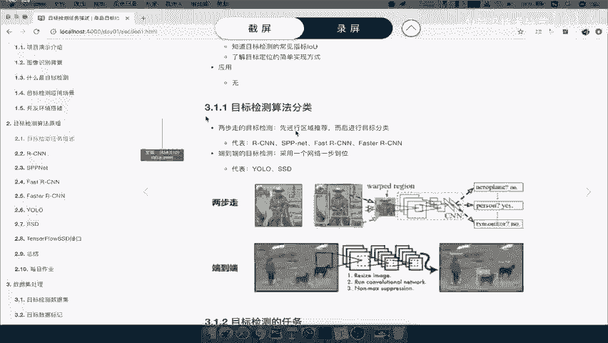

第二种就是端到端的目标检测。

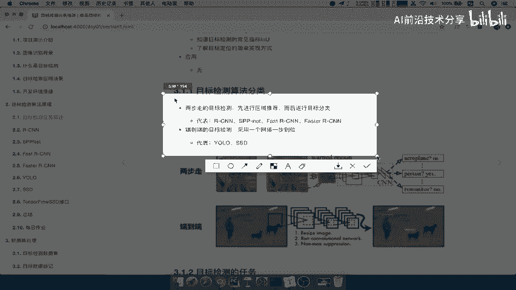

那么这两种有什么特点呢，第一个就是通过去推荐进行目标分类。

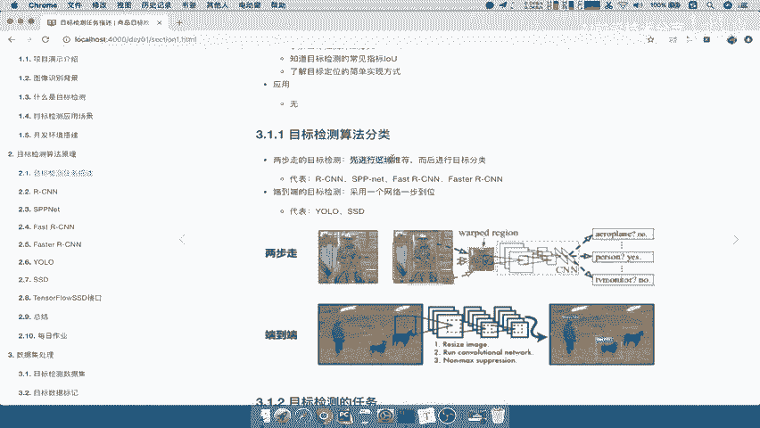

第二个呢就是说采用网络哎一步到位，那这是两个特点，那这两个有代表性的一些算法，我们在这遇列举了第一种啊，比如说上面有RCN啊对吧，还有fast r cn这个可以说是RCN的家族，然后第二端到端的这种啊。

比较快速或者识别准确率比较稍微高一些啊，那么这个代表呢有yo和SSD，那么这两种呢到底是什么意思呢。

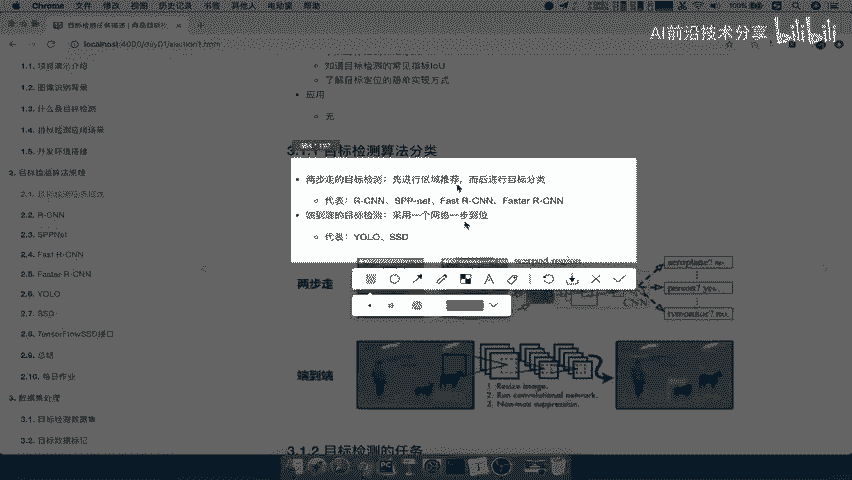

我们通过下面这张图来去进行理解。

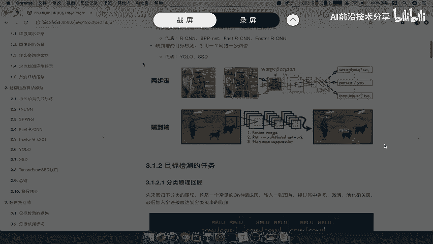

这张图呢标记了两步走的，第一个两步走的是什么呢，首先对于一张图片，我要检测这个图片当中的物体，我先进行一个区域推荐，区域推荐的话，我就先哎比如说我推荐这个区域，推荐这个区域，推荐这个区域哎。

我推荐这个区域可能会有一些物体，然后对于这推荐的区域进行一个分类操作，唉比如说它这个区域这个区域属于哪个类别，还属于person这个类别不属于这个啊，其他的啊，我们的马啊，或者其他的。

是不是就可以得出每一个区域的类别，是不是就相当于得到这个区域啊，哎以及它的物物体类别了吧，那这是两步走的啊，分为两步，端到端呢就不需要那么多步骤了，你只要输入一张图片好，你的网络定义好了。

图片输入到网络当中进行一个输出，输出结果就会把你的物体类别给得出来，有哪几个物体好得出来，以及每个物体的位置也给你得出来，能理解什么意思吧，所以端到端的会显得更加七，或者说它更加简洁一些。

更加方便一些啊，从一个点到另一个点直接输出了。

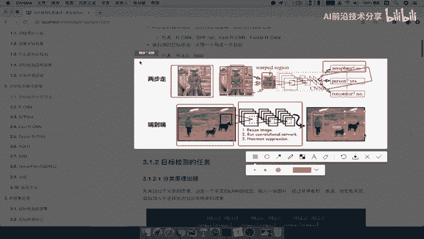

是不是就整个过程哎这就是端到端的好，那所以呢我们接着呢直接写一下啊，我们的这个，写在这里，算法的一个分类有两种啊，两步走，还有我们的这个端到端，两步走呢，哪两步，第一步是推荐区域吧。

然后再加我们的这一个，分类好，然后进行分类，那么接着呢端到端的就一个网络啊，直接从输入到输出，并且输出已经给你输入什么啊，类别哎，加位置，比如看这张图是不是给你的类别加位置，这就是算法的一个分类好。

那么接下来呢我们就要去讲一讲目标检测啊，它的一个任务是什么样的，前面我们一直强调的，它就是一个物体。

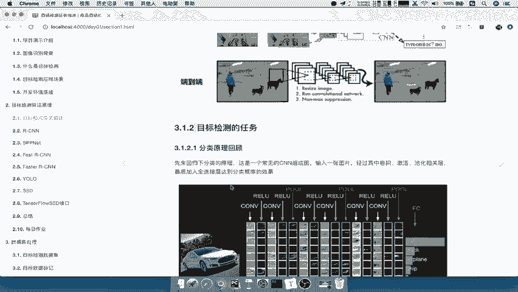

物体的位置吧，那么所以我们先来确定，再回忆一下我们的分类算法，分类算法是怎么去做的，我们的如果说做图像这个分类的时候，我们用的是CN的模型嘛。

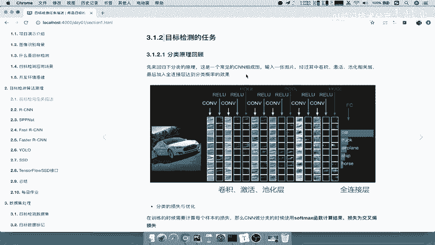

CN当中我们的结构我们来看这一张图，注意啊，这里是我们带大家去简单的复习一下分类，它的一个任务是怎么去做的，我们来看到当你输入一张图的时候。

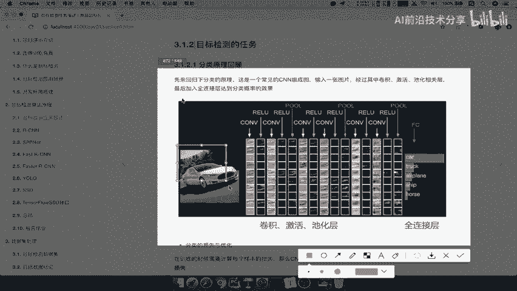

经过我们的卷积神经网络，是不是当中有卷积激活池化这些层吧，啊你要知道每一层之间一个E啊，最后经过一个全连接层进行输出，输出的结果，我们说了是你有多少，最后一层来讲你有多少类别。

是不是应该就要输出多少个值吧，好这就是分类啊，注意了，分类这个地方有多少类别需要识别啊，需要去进行分类的，那你就要输出多少个类别，那我们是输出什么啊，分裂的时候以什么东西去衡量呢。

就是说这里我怎么去得到它属于哪个类别，是不是用概率的思想，那所以我们分类的损失和优化，也就是说CN做分类的时候，它会使用一个soft max函数计算我们的结果。

也就是说在这个图的最后加一个soft max，得出每一个这样的一个类别的概率，然后嗯，通过这些概率与我们的目标值，进行一个这样的一个损失交叉商损失，所以我们在这里啊，我们的这个分类。

分类的这样的一个任务啊，他的一个任务描述，就是说我要得出每个类别的概率，这样的话我可以是比较啊，这样的一个得到最大概率，是不是就是得到你的这样的一个类别了，那当然它的分类的一个训练过程是什么样的。

是不是通过soft max那损失soft mars进行概率计算，然后呢通过这个概率计算之后呢，我们要去通过我们的交叉熵损失，衡量这也是我们啊这个我们已经知道了啊，他的一个啊训练过程。

以及我们的这样的一个输出结果好，这就是我们的分类啊，分类稍微要简单一些，那么对于分类呢，我们也知道它应该会有一些常见的模型。

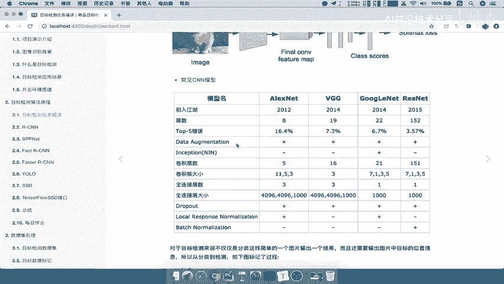

那么常见的模型呢有比如说alex net v gg，Google net resnet，在这里呢也列举了很多它的特点啊，那么这里我们直接看一个啊，就是说top5的一个错误啊。

那也就意味着我们的这个模型呢，那随着这个年代的越来越靠近啊，我们的模型呢就越来越改善，它的识别效果呢就会变得更加准确了，那么他的这样的一个错误率RESNET啊，他的错误率3。57啊。

我们也称之为RESNET呢，它是一个啊能够超过人的这样的一个识别，比如人看这张图片，你得出这张图片什么类别，它你的错误率比这个RESNET可能还会高一些啊。

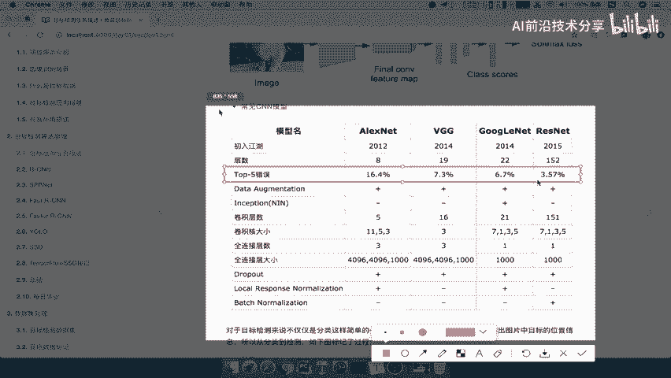

因为有的图片可能会更加模糊对吧，有可能你眼睛也看不清楚好，那么这是分类的，我们复习了一下分类的这样的一个哎，他的任务得出这样一个概率，那么分类的话就是得出一个这样的一个，目标类别。

前面我们就说了分类加定位啊，分类加定位，classification加localization，就是我们要分类得出啊，目标类别以及目标的位置，还有一个名词呢就是目标检测。

那么我们这里呢会提到一个叫分类加定位，一般呢我们去称之称这个啊，目标检测呢会把这个单独啊，单图片单中一个物体的时候，就假如说啊这图片就只有一个物体，你需要得出这个物体的类别加位置。

那么我们称之为分类加定位，如果说有多种吧，多种物体注意啊，这是详细的一个细节，多种物体的话，我们称之为目标哎检测，所以这里啊有一个简单的概念上的区分啊，一定要理解啊，分类加定位和目标检测有什么样的区别。

那我们说了目标检测呢，我们就不去说他怎么先去解决这个问题了啊，它可能比较复杂，有这么多对象对吧，你已经知道，虽然说知道这些算法的分类，那我们来看啊，对一个对象的时候，我们应该怎么做，怎么做好。

那也就是说我们的任务就是说要得出两个东西。

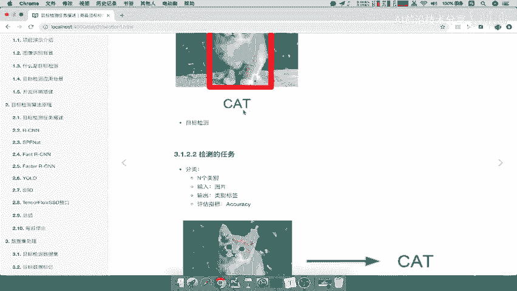

一个就是分类得出这一张图片当中，哎你的输出类别是什么，好cat我们可以通过什么去评估你的准确率，哎是不是从ACCURACCURACY呀，就是通过评估你的效果是不是就准确率啊，哎评估效果的准确率啊。

也就是说相对于你错误率啊，多少个错了多少个正确啊，哎accuracy，那么定位我们也说说了，这个定位的输出结果是不是这四个坐标吧，那所以我们的定位就是对于在这张图当中，我假设预测结果是XYWH。

然后呢我们就会有一个比较了，什么意思呢，我们原图当中会本身这个物体位置在这里，假设我去预测好，我把这个颜色换一下，框框的颜色换一下，比如说我预测的时候，我真实预测，预测在这里。

是不是与他真实的目标之间有一些偏差对吧，它的位置上偏差，那所以我们怎么衡量，我们这个预测框跟目标的一个宽的之间的，一个什么哎它的一个好坏程度，所以我们会用一个这样的一个什么，IOU的指标啊。

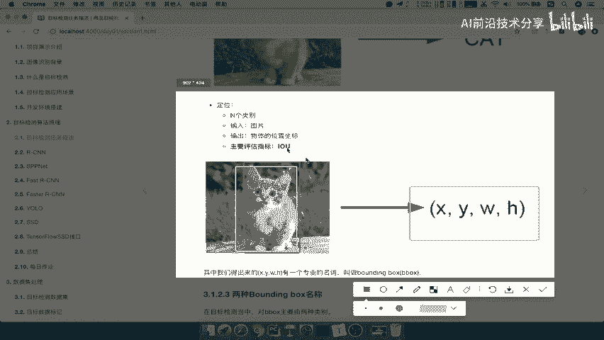

IOU指标好，那所以呢我们在这里写一下啊，注意啊，分类加定位的话，分类加定位的话呢，我们的分类，它的一个评估效果是不是准确率吧，Accuracy，那我们的定位呢我们会去有一个评估。

叫做IOU这个啊就是我们的定位，包括你输出的一个结果，那所以我们接下来就以分类加定位，这种单图中有一个物体的时候，我们就要去想各种办法去解决这个问题对吧，那IOU在这个过程当中。

我们涉及到两种bill boding box，什么意思呢，我们把这种框啊，我们一直称为它是一个什么啊，框住物体的一个框，那这个框有个专业术语，在目标这个分类定位或者目标检测当中，都是一样的。

都称之为bounding box啊，所有的这些目标宽啊，目标宽，我们可以在这写吧啊，目标框，目标的位置宽，我们有一个专业的啊名词叫做bounding box，绑定box也叫b box啊。

那么对于b box呢，我们通常有两种哪两种呢，就是一个叫做图片当中的真实标记的框，还有一个就是我们要预测的时候标记的框啊，也就是说本身这个物体会有一个位置对吧，哎它这个位置位置呢是要人为去标记的。

这就相当于得到到你的这个人为的数据集的，一个标记过程了啊，你标记的时候，标记一个物体的这样的一个真实位置，然后呢我们要预测的会有一个叫predict，body mouse啊，这两个需要去区分的啊。

有人说你的这个看到这些名词，你要知道他们俩之间的一个区别，好我们把它粘贴到这里，那我们接着来看，这就是两个物体，一个是啊预测值，一个是真实值啊，那么预测是真实帧，也称之为gt啊。

我们的预测值也predict body box，那我们继续回到我们刚才的IOUIOU，我们说了，它是衡量我们这两者之间的一个哎，它们之间的一个偏差，那到底是怎么去衡量的呢。

我们检测的这样的一个或者分类定位的一个啊，它的评价指标我们来看啊，交并比也称之为IOU啊。

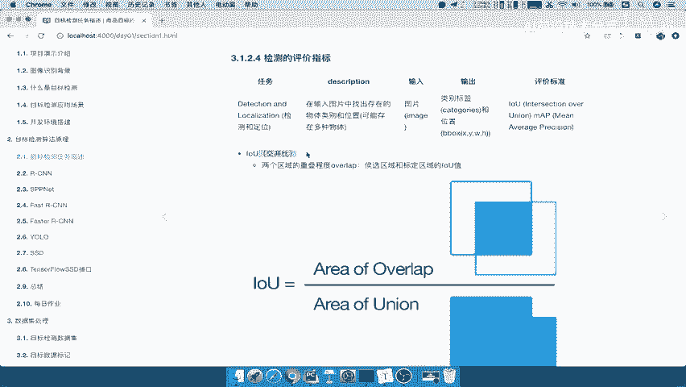

I o u，那么这个交并比呢，它是什么呢，衡量两个区域的重叠程度，以及你的这样的一个重叠程度的一个比例，什么意思呢，哎你看到这样的一个公式就立马就清楚了，什么意思啊，我的假如说这里是预测框啊。

然后呢我们再换一个，这里是我们的，再来一个我们再来一个这个真实观，这个颜色我们把它改一下，好预测真呃这个是预测的，黄色的是真实的，那么他们俩之间相交的一个面积，除以它们两个总的面积，我们就称之为IVU。

那我们想如果这两个框完全一模一样，请问多少是不是就一样，你的这个物体的这个位置，预测是不是百分之百准确啊。

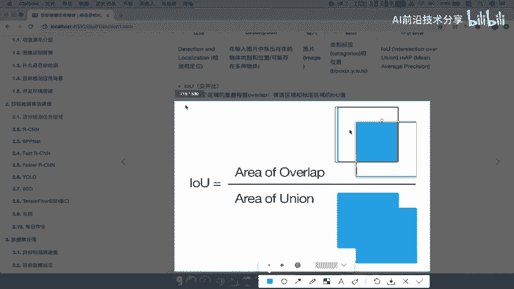

我们是对于这个位置来说的吧，是不是百分之百准确啊，所以啊我们的IOU就称之为啊，我们的I啊OU一般的这个O呢是小写的，IU是大写的交，并比它是两个区域的，两个区域的重叠程度啊，重叠程度，那么也就是说。

候选区域加我们的标定的区域的IOU值，等于重合的面积除以总啊，重合的重合的面积除以我们两个宽的，所有面积啊，这就是IOU啊，衡量它们之间的好，那么这个对于把我们目标检测，或者这种任务来说呢。

啊它有这样的一个评定方式，那么同理还有一个MVP啊，这MAP呢，也就是说这前面啊，我们以前在这个机器学习或者深度学习当中，会经常用到的啊一种这个评估表指标啊，我们后面都会去评价啊，用这种指进行评价好。

那么这样的话，我们就介绍了我们的这个目标检测的一个任务，描述啊，需要完成的两个东西，就是啊分类加定位以及定位的一个评估，是通过IOU评估的，那么接下来啊我们的点是什么。

如果让你去想要去定位这个图片当中的，这个目标，你怎么去做，也就是说目标顶定位呢，我们能够能不能想出一些比较简单的方式，去实现这样的一个定位，那么所以我们在这个地方呢，我们想想定位目标加定位。

我们要输出两个东西吧，一个就是分类，一个是定位你位置，一个是你的类别，一个是你的位置，所以我们想我们直接设计一个网络，让这个网络不仅仅是在这里输出我们的类别，我让这个网络呢也同理输出一个哎位置。

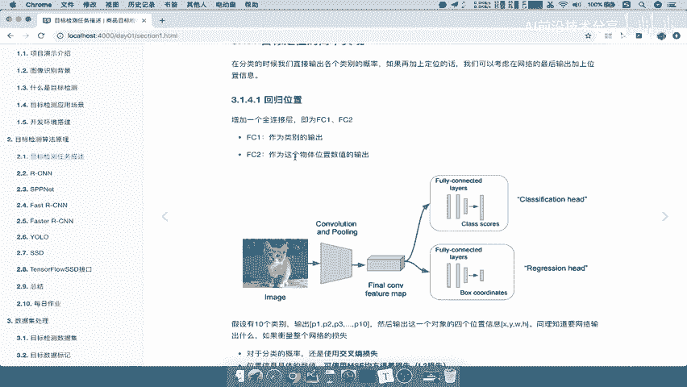

也就是说，我假设在我们的CNN网络当中的最后一层。

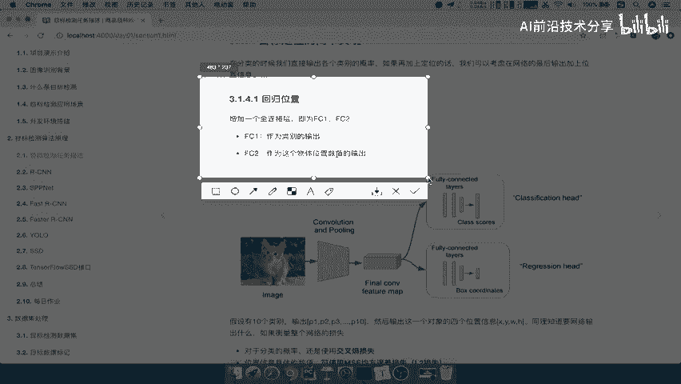

我加入一个全连接层，第一个全连接层来看到这个图。

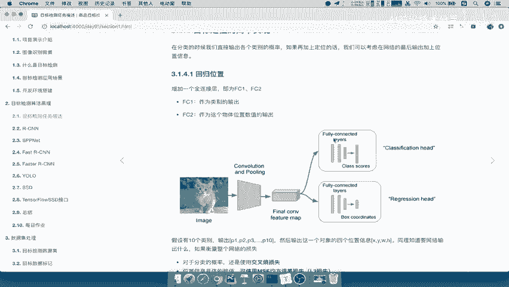

第一个全连接层，我们可以把它加入到哎一个分类，第二个全连接层呢，我们表示让它输出我们四个位置，哎，然后他输出四个位置，那也就是说我们让这个网络什么，输出两个结果吧，一个是分类。

一个是我们的这样的一个定位好，那这就是对于一张图来讲，假设有十个类别啊，我们看到这个例子，假设有十个类别啊，好那你这张图只有一个物体吧，我们说了啊，前提是只有一个物体。

那么你输出的是不是哎P1P2P3P10，是不是你十个物体的概率哎十个，物体的概率值，然后还要输出这一个对象的四个位置哎，也就是说这个物体的四个位置XYWH，或者说你的这个极坐标方式啊。

或者说你的这个中心点坐标方式都可以啊，同理要知道网络输出什么，如果想要衡量这一个整个网络的损失哎，那我们说分类的话，我们用交叉熵损失进行一个衡量，然后呢我们的这个位置信息。

具体的数值我们可以通过哎均方误差去衡量吧，啊或者说我们也称之为L2损失，MSE均方误差好，那么这个就是他们这个两个啊，我们要完成这两个任务，我们要解决的就是最后怎么去衡量。

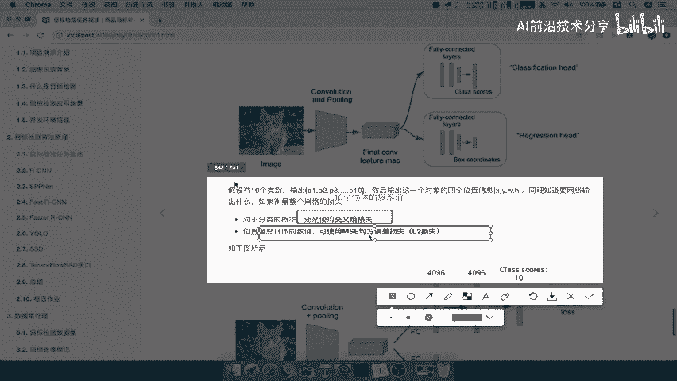

它们之间的一个损失好，所以呢你得到的这样的一个图呢。

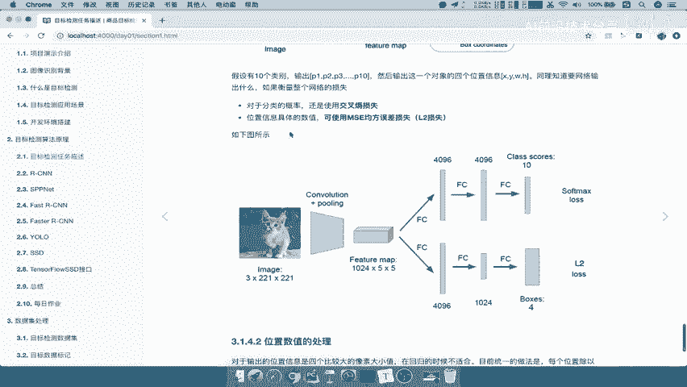

可能是这个样子的，看到你一个图片输入进去，经过你的网络输出，比如说十个类别的啊概率值，然后呢以及经过一个全连接层输出，这个物体的四个值，然后两个损失哎进行一个衡量，然后进行一个训练就OK了。

好那所以我们解决思路是什么。

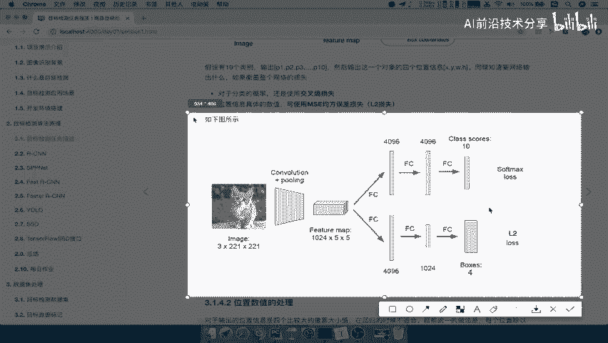

分类加定位的一个解决思路，好我可以让网络多输出一个全连接层，好那这个全连接层呢有两个，一个是输出概率值，一个是第二个是输出四个位置坐标哎，位置坐标，然后呢，你的位置坐标与我们的这个真实的目标值啊。

也就是说你标记了这个图片当中的，真实的一个目标，它是什么样的一个位置的哎，进行衡量损失，然后去不断优化是不是就可以了，好那所以呢这是对于我们这个一个物体的，很简单一个物体哎，你输出结果。

那么所以在这个衡量这个损失的过程当中啊，我们对于这个位置啊位置进行一个输出的时候，我们想位置这个损失用均方误差，我们说的这也相当于是个回归吧，哎相当于是个回归，那所以呢这里我们也可以写上啊。

一个回回归啊，回归的一个，算法输出好，那一般来讲我们回归呢，会对数据进行一个什么处理呢，啊，我们回归呢是比较这四个比较大的一些，像素值的大小，因为你想想我们的四个值，比如说这四个值都是像素值啊。

300啊，这个200，或者说你的这个长宽一百两百，这四个值与比如说你的预测值，还有你的这个真实值，比如说我稍稍微修改一下310好，然后呢这里我们修改为130，比如这里啊是我们的这个中心点坐标方式啊。

前面是XY的中心点坐标，然后后面是图片宽度，我们可以看到你的这个预测的结果，跟我们的真实结果有一定的这样一个误差诶，去衡量计算这个误差呢，我们对作为回归啊，一般呢会进行一个啊进行一个规划对吧。

或者说我们的这个标准化，所以会通常呢会进行一个统一的啊，除以一个这样的一个图片的宽长宽啊，当然这里呢是简单了解一下就OK了啊，简单了解一下，后面我们会在算法的时候呢进行详细的介绍好。

那么这样就是我们对于一个物体的时候，分类定位怎么做，其实非常简单了，就让我们的网络输出哎一个位置就OK了，好那么对于多种物体呢啊，对于这个多种物体的目标检测该怎么去做，等一下我们再进行介绍。

那最后我们这里总结一下，这个我们这里要掌握的是呢，算法的一个分类以及分类定位，以及目标检测的啊，它的之间的一个区别好，以及我们要知道一种简单的方式去解决，我们的分类定位怎么去做的啊，加一个全连接层。

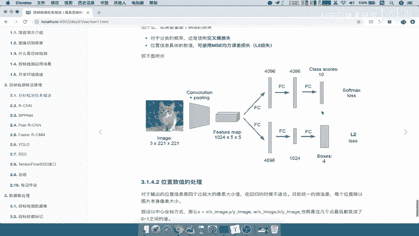