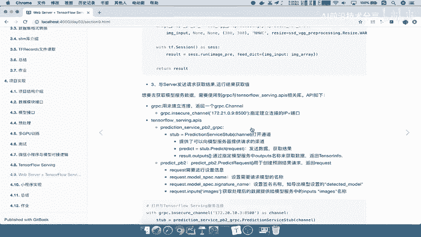
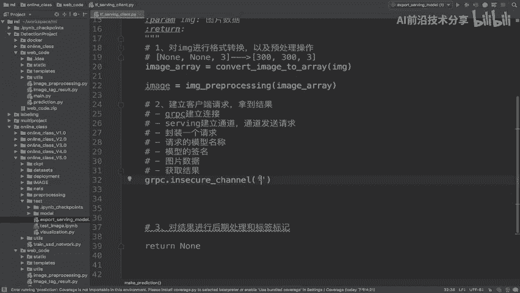
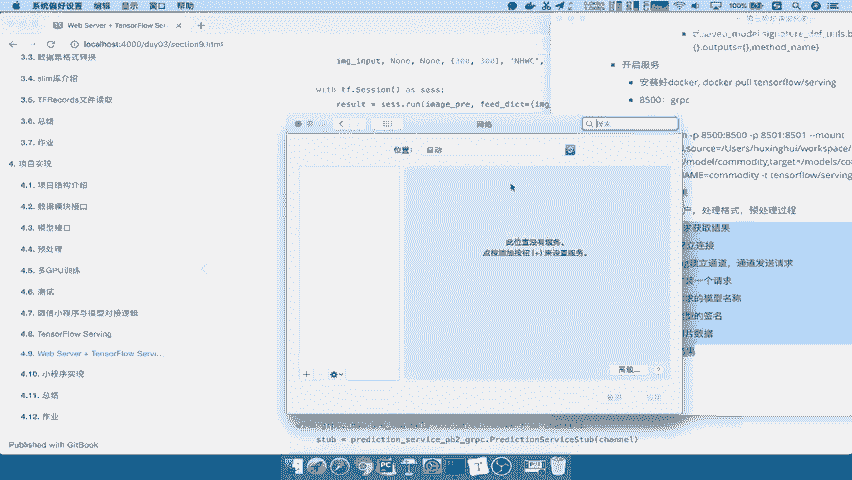
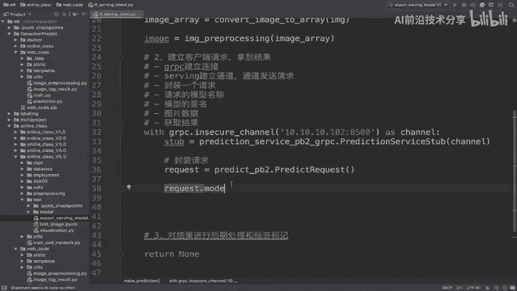
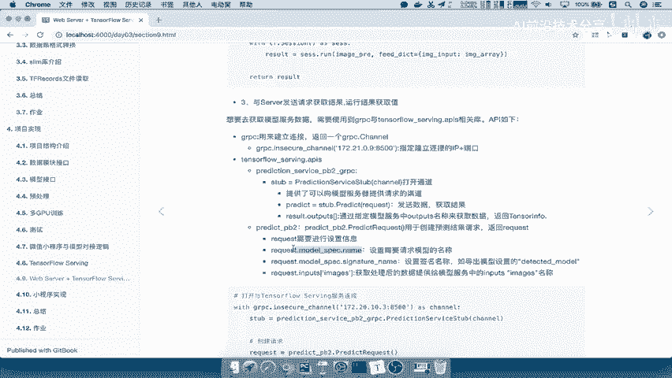
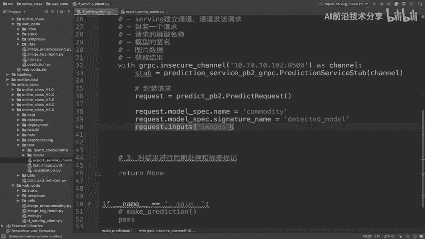
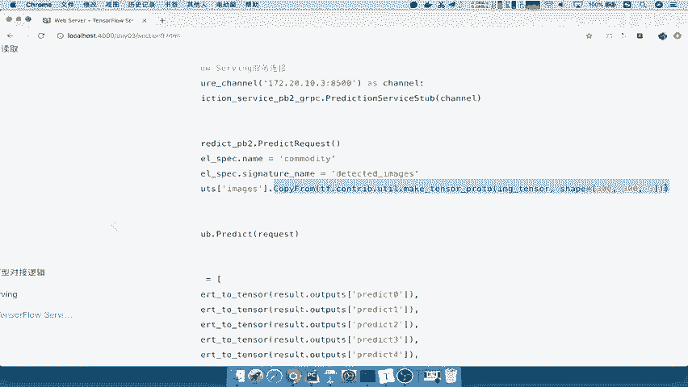
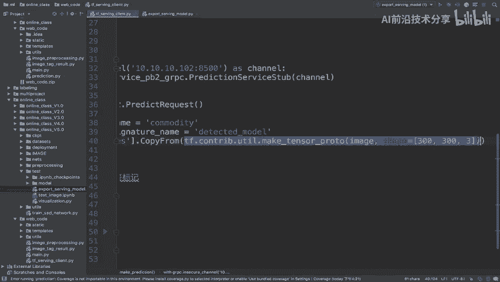
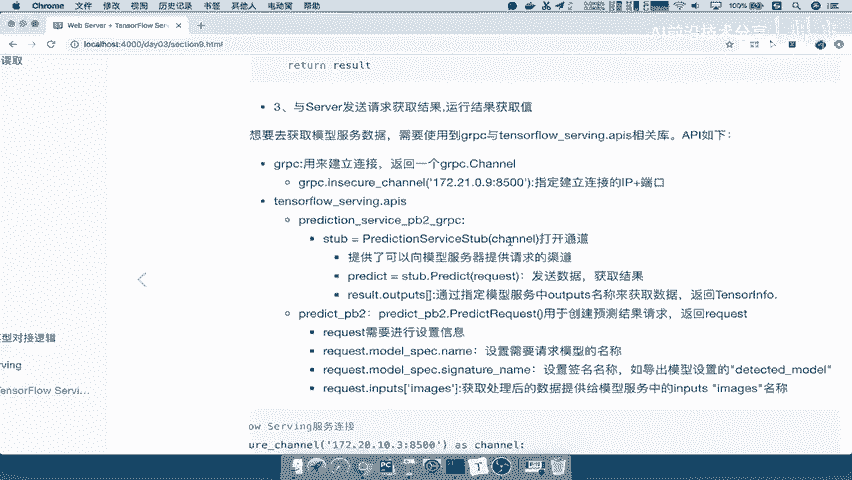

# 零基础入门！一口气学完YOLO、SSD、FasterRCNN、FastRCNN、SPPNet、RCNN等六大目标检测算法！—深度学习_神经网络_计算机视觉 - P83：83.04_Client：客户端建立连接获取结果代码83 - AI前沿技术分享 - BV1PUmbYSEHm

那我们接下来呢编写一下这个请求的代码好，那我们走，所以呢在这边在这边去进行一个编写，那首先我们说了，先去建立一个用户请求，那所以这个地方我们把这个过程拿过来啊，就按照这个流程去进行一个使用就行了。

好我们把这个呢格式调一下，注释掉这个部分啊，好把它进行注释，来第一步骤RGRPC建立连接，我们使用的gr pc里面有一个叫啊，In circuchannel，这个channel里面填写进去的。

就是你当前的本机的IP加地址。

所以呢我们先去在本地进行测试嘛，那所以我们在这里获取，像我们本地的这样一个IP啊，我们比如说获取网络来看一下我们的IP。

我们这里呢可以通过这个啊去获取，那也就是说我们这里它的IP为这个值，然后呢我们的端口是哪一个，我们说了，提供给我们端口是8500吧，8501是Rest风格的端口，那所以我就在这个请求的环境之下啊。

with一下啊，with一下呢，然后呢我as send channel c h a n n e l，那么接着我们说了，我们要通过serving去建立通道，serving的话。

我们建立通道使用的是这个prediction service，好，这个service里面有一个函数叫prediction pre diction service，hua stop这样的一个东西。

这个东西干嘛呢，将我们的通道去传进，将我们的这个channel传进去，它构造一个这样的一个通道，发发送请求对吧，打开这样请求，我们比如说叫做step好，那这是我们的第J1步，接着我们要去干嘛呢。

封装请求了，封装请求我们使用的是这个函数，predict pb2点，那么这个函数里面有一个叫做predict request，它可以返回这样的一个请求，request r e q u e s t好。

这个请求分啊，分专，这个请求呢我们需要干什么，进行一个把这个请求进行一个设置啊，设置第一个模型名称，在我们的request点，在它这个里面有个叫model的方法，那么这里他没有去它显示出来啊。

我们直接在这里models spec点name。

也就是说指定你需要请求模型的名字叫什么呢，这个名字怎么去获取啊，是不是我们在导出的时候设置的名字叫什么呀，我们能叫commodity吧，所以我们拿过来叫commodity。

接着第二个request里面还要需要设置的，就是我们的名称，签名名称也就是这个地方的模型的签名，签名的时候，我们名字叫什么，叫做这个在这里detected model吧，那所以我们先把这个部分拿过来。

signature签名名称，好我们把前面的request给它删除掉，他的签名名称等于右边这个地方的名称，复制过来，我们构造一个这样的一个好，那么最后我们关键就是在于你的数据哪里来了。

image是不是已经把数据传过来了，image数据传过来了，我们是不是要以把它用起来啊，放到我们的请求当中吧，request点它里面有一个input，其实就类似于这个input。

他们俩之间是不是映射之间的关系是不一样的，协议格式，所以呢我们要把input input获取这样的一个通道，获取相当于是获取我这里面的好，我把这个名字获取来，我传给你数据吧。

我要指定传给你的名称是什么对吧，所以我们把名称拿过来，那名称拿过来之后，我要去把这个里面的值放到这里面，那这里面我们会用到一个特殊的方法啊。

叫做copy from，这个服，Copy from，就是将我们的用户输入的数据进行一个拷贝。

到我们的这个什么呢，唉直接拷贝到我们的input当中，相当于把我们来看到image，我们把它放过来，image它是一个什么格式呢，肯定是三百三百三吧，已经调整过的格式。

然后注意不是把你tensor放进去，而是把我们的一个make tensor proto，这样的一个tensor proto的一个协议放进去。

把这个东西输入进去，为什么是这个格式啊，因为这边要求你建立的时候，是不是一个builder tensor inf啊，所以在这里把这个数据放到我们的通道，好，这样啊，我们可以算是相当于把我们的数据的准备。

准备好了，接着我们到哪里啊，是不是获取结果啊，哎获取结果，那么获取结果我们是怎么获取的啊，通过这个函数就获取了，来看到它的stop里面有一个叫做predict，去进行获取，能理解吧。

所以我们会在这个地方通过STB点predict，它的这个方法将我们的请求放进去，放到通道里面，返回一个predict，比如说result吧，I e s u l t，这就是我们的结果，能理解吧。

