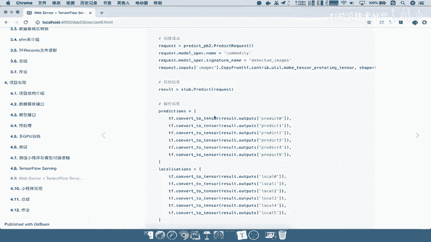
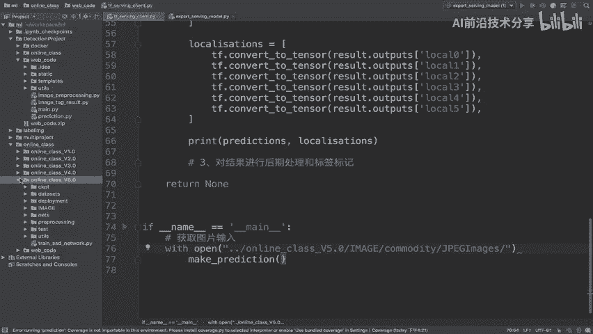
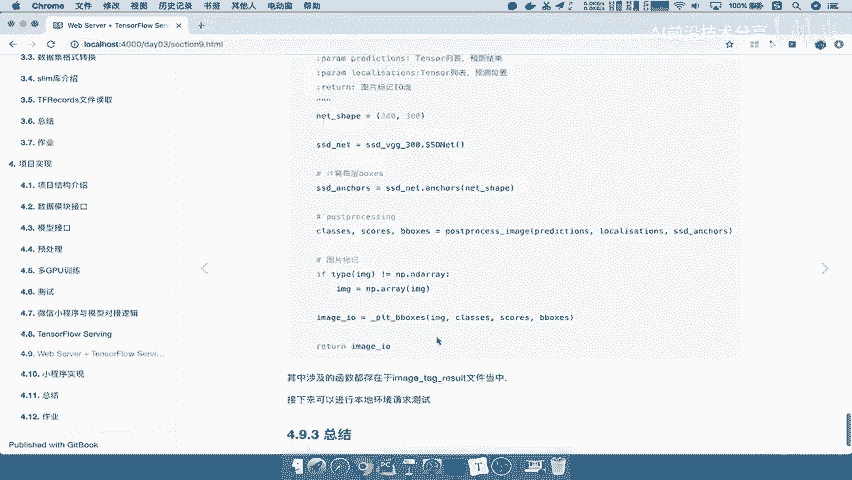
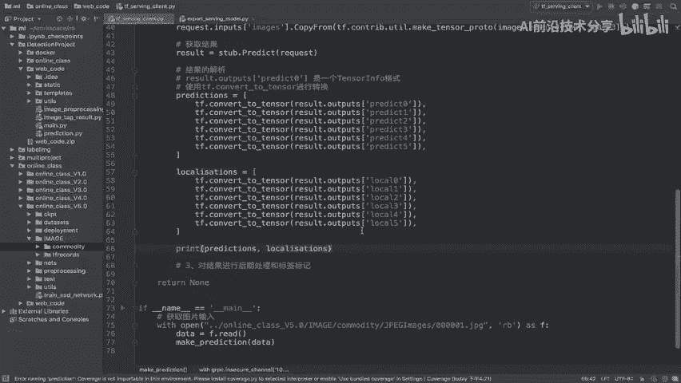

# 零基础入门！一口气学完YOLO、SSD、FasterRCNN、FastRCNN、SPPNet、RCNN等六大目标检测算法！—深度学习_神经网络_计算机视觉 - P84：84.05_Client：结果解析84 - AI前沿技术分享 - BV1PUmbYSEHm

那么获取好结果呢，我们还要重要的是对它进行解析，怎么去解析参考，我们在导出模型的时候，怎么去导出的，能理解吧，所以呢我们在这里解析模型呢，我们就要按照result里面RESULTRA。

result里面呢我们有两个东西，一个是predict，一个是local吧，我们所以要把这两个东西呢，我们可以单独给拿出来，怎么去拿参考，我们来看一下，这里呢我们直接通过result outputs。

相当于他这边的output ts能理解吧，我们output ts直接把指定名字的直接拿过来好，把它拿过来之后，注意你拿到的并且不是一个tensor，而是一个tensor info。

所以我们要如果想要直接拿到tensor的结果，你需要有一个TF点，convert to tensor的一个过程能理解。

所以我们比方说首先进行一个结果的解析，结果的解析，那么这个结果解析，我们首先比如说我们要获取predict，因为我们有两部分，一个是predict，一个是我们的localization嘛。

所以我们在这prediction是，等于我们把刚才的结果解析成一个列表，相当于是变成了一个tensor组成列表吧，result r e s u i t点，这里面有一个outputs方法，那么获取。

那比方说我们先获取一个predict0，好predict0，那么这个获取的predict0呢，我们就可以使用它进行一个解析，注意它不是一个tensor格式啊。

这个是一个是一个tensor infold格式，那所以我们需要使用TF点convert to tensor啊，去进行转换好，那所以我们在这里进行转换，TF点CCONVERT杠，然后呢这个tensor啊。

我们直接方法翻到这里，Convert to tensor，这样我们相当于解析出了prediction里面的第一个，那接着后面几个部分是不是也一模一样的了，所以呢我们在这里直接啊，我们直接通过这个获取。

一共有六个，那所以我们把这名字改一下，比如三啊一啊，12345，那接着呢我们还要构造一个在result当中，还有一个prediction吧，哎还有个localization啊，我们把这个呢完整复制过来。

这里我们命名叫local lisa t i n s好，localization呢，这里面就不是predict0了，而是我们的local0，注意名字不能有误啊，local0log零。

好我们把这里改成一改成二好，那么我们看两个，写两个相当于除数获取的这个结果，通过output指定名字来组成列表的话，那我们来看这个prediction和localization，是什么东西啊。

它这两个是什么东西啊，它是一个列表的这样的一个组成的吧，哎prediction，然后呢，以及我们的locate tensor，组成的这样一个列表吧，那我们在这里呢可以先去啊。

在这里调用一下我们的这个结果打印一下，当然我们得去我们输入一张图片了，明明是吧，所以呢我们在这里比如说获取图片，获取图片输入，那我们比V可以去及格，直接啊，with open一个，那么open的话。

我们这个图片从哪里获取呢，我们直接从当前这个应该是相对于这个路径吧，我们把这个路径拷过来，我们的路径在web code，在web code里面，那么web code呢相对于我们的图片。

image和这个commodity里面的JPG啊，好比如说我们把这个拷贝一下它的pass copy pass好，我们复制过来，那我们这个目录应该是在相对于哪里啊，同样都是在ml里面吧。

在ml里面online class啊，应该是在online class里面，应该是在这个目录的上一级目录的5。0对吧，哎应该是在这个目录的上一级目录的5。0，然后image comedy界面。

Jpg images，然后接着你就可以输入一个图片名。

这个名称了啊，那么这个图片名称呢我们可以通过这个呃。

我们啊直接还是从这边获取吧，我们的images，images的一个名字好，我们把这个名字拷贝过来，CTRLC好，那么我们把这名字呢放到这里点JPG好，那么这个结果获取好之后，我们来挨Z1下我们的。

比如说F那读取的时候呢，我们是以二进制持续时，这样的一个格式读的对吧，RB啊，二进制可读，然后呢我们as sf之后呢，我们就可以去把我们的F点read内容给读出来了。

把F点read当中去把所有的数据读出来，那么我们返回一个data，那么这个data我们可以传到我们的data当中，make a prediction当中好，那么这样的话，我们相当于把图片自己去测试了啊。

测试了用了一张图片去获取啊，然后去进行预测，那么注意我们这里输入的IP啊，加我们的这样的一个端口都是在这里面的，来运行一下，好我们看顺利的打出他请求模型服务，顺利的打出我们的数据了吧。

这里面的数据是包括prediction和localization，两个数据吧，你看一下这两个数据是不是一个，每一个都包含着六个数据对吧，这是应该是一个prediction啊，包含六个tensor，好。

那么这样的话，我们先进行了一个获取结果的一个测试了吧。

