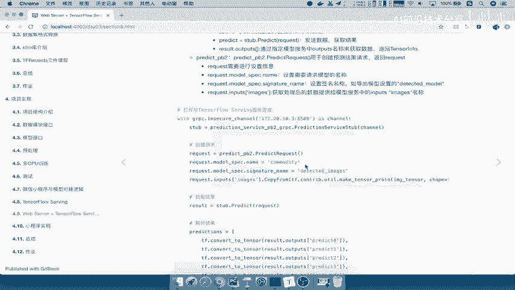
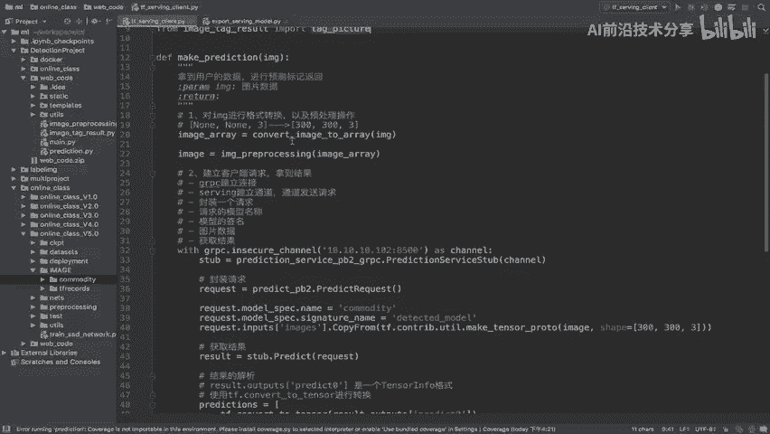
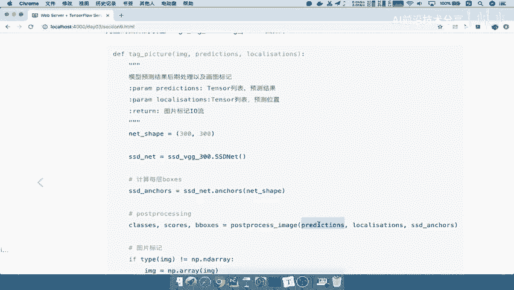
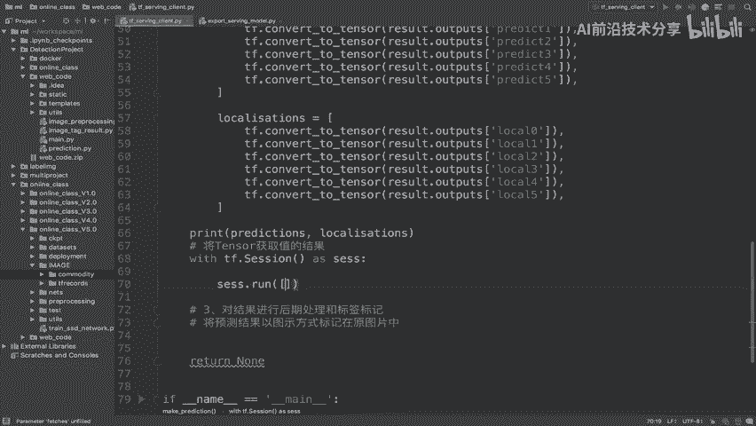
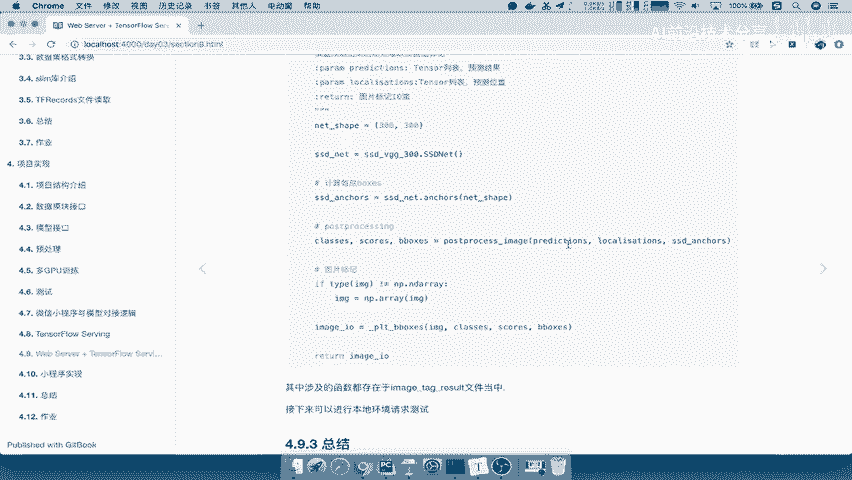
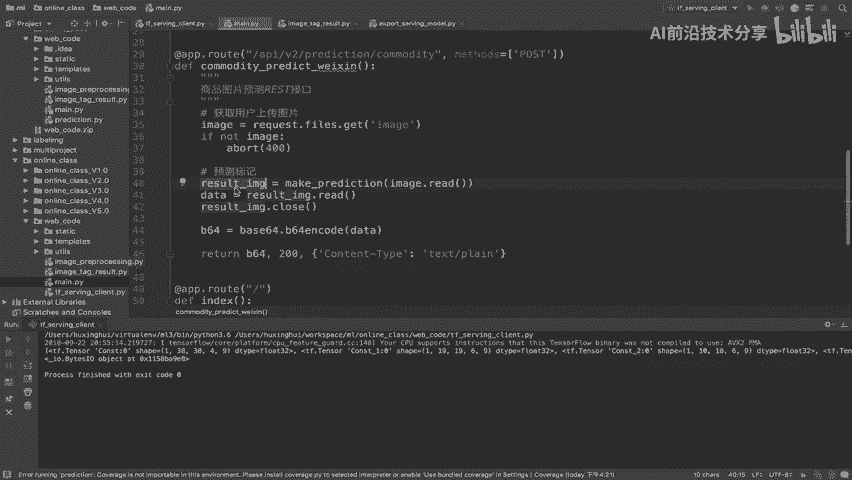
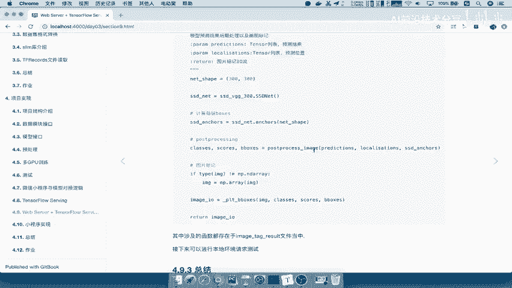

# 零基础入门！一口气学完YOLO、SSD、FasterRCNN、FastRCNN、SPPNet、RCNN等六大目标检测算法！—深度学习_神经网络_计算机视觉 - P85：85.06_Client：结果标记返回85 - AI前沿技术分享 - BV1PUmbYSEHm

那么获取的这个结果我们说了这个东西，它是一个tensor组成列表，如果你把这个东西返回给我们的image的target result，Target picture，tag picture呢。

我们一般是什么输入你图片本身的数据啊，这张图片是什么样子的输入进来，然后我们把预测的结果标记打在这个image里面吧，哎相当于是在这里将预测结果以图示的方式，以图示方式，这个标记在原图片当中。

这个我们测试的时候已经说了啊，那么所以我们在这里说了，tag picture这个东西输入的参数是什么，我们来看一下他tk picture呢。

我们来看它输入的是image prediction，然后prediction呢它会直接去做这样的一个获取，我们说POSTORPROIMAGE呢，它会直接去做运算。

但是你prediction现在还是一个tensor吧。

它还是一个tensor，所以不能直接拿去运算，那我们这里要进行的是说，将tensor的结果获取出来，将tensor这里也是相当于是一个TENSORFLOW啊，一个比较大的一个坑，经常会遇到这种问题对吧。

将tensor获取结果，获取结果，获取值的结果，那么我们在这里直接with tf，我们看一下应该不是在这个外面了，我们应该在这是在JIPC的这个环境下啊，那所以我们应该是在外面这个环境。

把这里统一的这个翻出去好，那么TF点session as s e s s，那么我们直接session点run，session点run我们的函数，然后呢run的话，我们把两个直接结果穿进输入进去。

localization返回我们，比如说P和L啊，我们就不用这个复杂名字去做，那接着你才可以去进行标记吧，用我们的target page，target page里面包含了很多函数啊。

包括我们输入的这个网络预测我们的SSX，或者说得出啊，网络计算出SSD这样的一个anchors，那么同样把数后数据进行一个后续的处理。

那么这里面会用到什么，用到我们tag p社来看一下，用到tag picture当中，看到这里tag picture当中呢它会用到postal image，posting image引入。

也会用到什么np method，相当于我们测试用的那些方法，全都封装过来能解吧，然后呢我们标记的这样图片，在这里标记的图片呢，我们会直接用BTIIO，将我们的标记好的图片接收。

然后保存在这样的一个image I/O里面，接着我们会进行返回，给这样的一个用户能理解吧，所以它返回的就是一个image I/O result，那所以我们在configure在这个地方当中。

直接我们通过tag picture，第一个你原图片是不是要传进去，注意这个原图片是什么，原图片是你处理之后的image array吗，还是image吗，都不是吧，什么原图片吧。

你总不能说用户传过来一张图片，你变了，然后标记过去给他，那肯定不行，所以应该是我们的最原始的图片，好当然这个最原始的图片呢，我们用应该是用格式啊，应该是用image array啊。

image array的这样一个结果，因为它在里面要做一些数组运算，我们不能用image好，image和rain没有做变化啊，只是做这个数据的一个格式转换，那么接着将P和L传进来，那么返回的就是一个啊。

我们的这个结果，我们可以直接呢在这里返回一个，比如说image杠，或者说我们直接把这个函数反过来吧，Ctrl x，好返回，那么所以这边就有一个返回值了吧，那么这IES等于它。

那我们可以把这个地方打印一下，IES好，我们再来去运行一次，好那这样的话我们就拿到一个BTIO的东西，这个东西就可以直接传给我们的什么呢，面点PY当中，我们的这个web服务器当中的这个结果。

拿去返回给我们的用户能理解吧。

