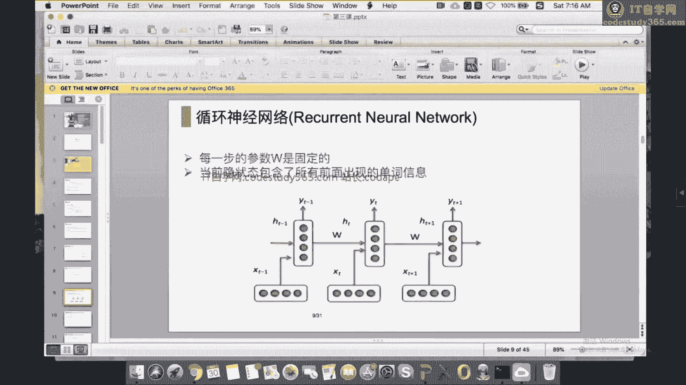
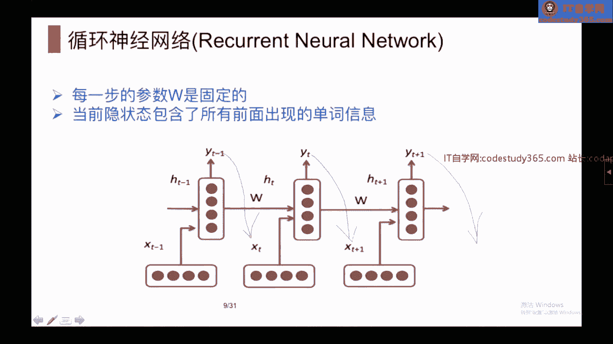
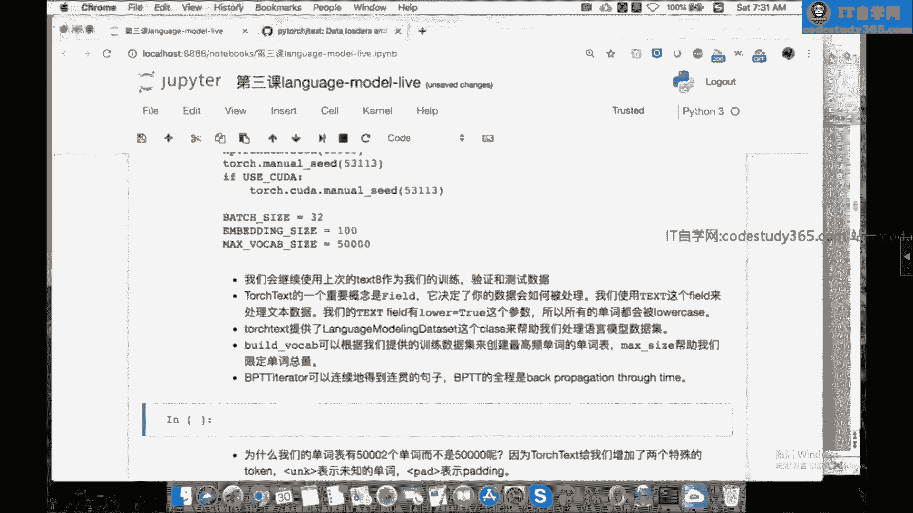
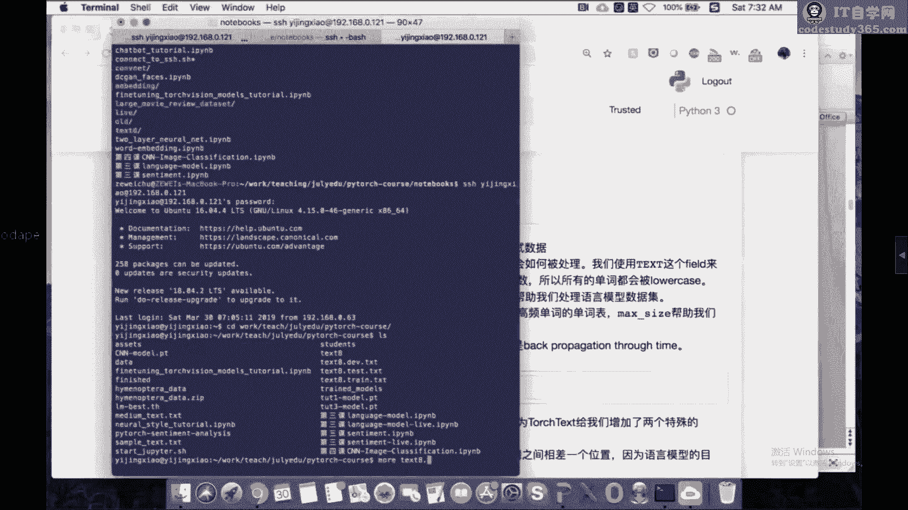
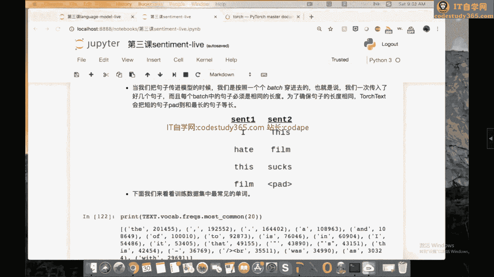

# 【七月在线】NLP高端就业训练营10期 - P2：2.基于RNN的文本分类与语言模型_ev - IT自学网100 - BV1uxT5eEEr6

我们今天这节课主要讲的内容，是关于语言模型和啊文本分类的一些问题，然后在PYTORCH这个方面呢，我们会主要主要介绍一下RNN相关的模型，就是recurrent neural network。

所以在课之前，我先啊我先把我的PPT给找出来，Power po，然后这节课内容其实还挺多，我们能讲多少，讲多少，如果讲不完的话，就明天继续讲，啊这是文本分类，然后，啊这节这是我们这节课的PPT。

然后我们就就可以开始讲今天的内容了，啊，首先我们这节课的内容，是关于语言模型和文本分类，然后这两个问题其实看起来没有那么相关，但是因为他们都涉及到呃，我们这节课要讲的关于PYTORCH的。

如何写一个循环神经网络的内容，所以我们就把它放到一起讨论，这是一个非常快速的review，因为大家可能都有一些相应相应的啊，关于关于关于这两个部分的经验，所以我们就不会详细的讲了。

那我们先开始进入到呃语言模型，什么是一个语言模型呢，简单的来说一个语言模型，我们要讨论的任务就是给你一句话，我要告诉你这句话它出现的概率有多大，那什么叫概率有多大呢，嗯这个概率其实是呃。

它它是一个人为定义的一个东西，就是我们我们想要知道这一句话，他一个人有多大的概率能够讲出这样一句话来，比如说下面有一个下面有一些例子说7月在线，7月在线是一所好学校，跟7月在线一是学好所效。

那第一句话就比第二句话，它出现的概率要更大一些，一般一个正常的人会讲第一句话，但是不太会讲出第二句话来，然后这个第二个还有一些选词也很重要，比如7月在线是一所好学校，就比7月在线是一所好教室。

出现的概率要大得多，它其实是衡量一句话他的啊，它的合理性有多高的一种一种表示，然后我们想象一下，如果你能够知道每句话，它出现的概率有多多大的话，那就可以，你就可以做很多事情，有有一个同学说他看不到画面。

别的同学可以看到吧，我继续讲这个，啊OK那可能是那位同学需要自己重新刷新一下，然后我们讲到说啊，如果你能够知道，如果你能够知道这个一句话出现的概率有多大，你就可以完成很多任务。

比如说啊你可以做一些完形填空的任务对吧，就是如果这个句子里少了一个单词，然后给你几个不同的选项，你就能够去填，你也可以去啊做一些文本的生成，就给你一句话，你可以继续往下写文章。

因为因为你能够知道哪些话的概率比较大啊，就是有一些很很多各种各样的功能，都可以靠着这个这样一套模型去实现它，然后当我们在做这个在做语言模型的时候，我们往往会遵从这样一个法则，就是一个链式的法则。

这个其实是conditional probability，条件概率是吧，每每后面一个单词出现的概率是，它是基于前面一个单词的，然后你这样就可以一条链式把它乘法乘起来，然后应用到这个语言模型当中呢。

你就会拿到最下面的这样一套一套公式，就是它是一个连续的，连续的乘法，能够帮你把这个概率给算出来，嗯然后我们我们在以往做传统的这个语，言模型的时候，往往会遵守一个叫做马克夫假设。

这个马克夫马尔科夫假设的意思是说，后面一个单词往往只基于前面的N个单词，至于前面的N加1N加二个单词，我们就忽略不计了，就这样的话呢，在做一些传统模型的时候，能够帮你帮你把这个模型的啊参数调小。

就是你不需要看太远的过去发生了什么事情，你只要知道目前当前这前N个单词，你说的什么话，你就遇到下一个单词说什么话，当然这个在我们这节课里面，会稍微有点不太一样，因为我们这个神经网络的模型。

其实可以再往前看的更多一点，嗯最后讲一下这个语言模型的评价，我知道我讲的有点快，所以同学们有什么问题，可以在那个留言的地方评论啊，因为因为我我我会稍微假设，大家对于这个方面有了一定的了解。

然后我们一般评价一个语言模型，是用一个一个东西叫做perplexity，perplexity是是什么呢，它其实就是把额就是把一句话出现的概率，取一个负的N分之一次方啊，群群里的PPT我会在之后更新一下。

没有问题，就perplexity是嗯，把把一个概率取了一个负的N分之一次方，为什么要取一个N分之一次，负的N分之一次方呢，啊首先他一个负的负的次方，是，因为这个条是这个概率非常的小，往往概率是一个0。

000几的东西，然后你看起来不太方便，然后你取一个负的什么次方呢，就可以把它变成一个比较大的数字，然后第二个为什么要取N分之一次方呢，是因为你的句子的长度实际上是不一样的，如果是一个太长的句子。

自然而然根据我们前面条件概率的定义，这个句子的出现概率就会非常的小，然后你你帮他做了一个N分之一次方之后，就可以normalize它，那就可以把这个单词，把这个语语句的长度的这个factor给它取消。

那这样你会拿到的是一个正的数字，如果perplexity越高呢，就表示你这个呃perplexity越高，就表示你这个语言语言越不好，perplex city d呢就表示你出现了这个语言啊。

比较符合你这个模型的预期，所以这个是对于语言模型的一套评价，就是我们往往会训练一套模型，然后在一些新的语句上面预，去计算一下你的perplexity，如果它越低呢，就表示你这个语言模型越好。

那基于神经网络的语言模型呢，其实跟刚刚是一样的，就也是一样的道理，它也是根据前面的若干个单词，来预测下一个单词啊，在这个在这个概率上面并没有任何的不同，但是唯一的区别呢是。

我们希望用用一个神经网络来拟合这个概率P，就这个P在我们传统的AGRAM当中呢，其实只计算一个频数的问题，就计算一个频率，你把它都数一数，然后除一数算个频率，就是这个这个前面若干个单词。

一共出现了多少次，然后你在基于前面若干个单词情况下出现，下一个单词出现了多少次，然后你把这个分子除以分母，你就能算出一个概率来啊，这是n gram，但神经网络呢。

就是我们的目标是要训练一个神经网络的模型，我们前面讲过这个feedforward network，这些模型来来拟合它，在特别特别的来说，在这个神经在语言模型当中呢，我们经常用一些循环神经网络来啊。

预测这个下一个出现的单词是什么，这个模型呢，它的基本架构就是给你一个单词的输入，我根据前面当前的hidden state HT减一，和我的上一个单词HTXT减一，我要能够啊做一些做一个神经网络的操作。

帮你生成一个hidden state，这个hidden state呢再下一步可以预测啊，我刚刚好像把它都调了一个，调了一个位置嗯，就是这是这是XXT减一这个单词，然后你把它传到他这里。

其实拿拿了上面一个HT减二这样一个hidden state，然后这样进来之后呢，生成HT减一这个hidden state，拿到这个hidden state之后，最后你再做一个这个线性的线性的变换。

可以把它map到一个输出的层，这个YT减一呢其实就是为了预测XT，然后当你拿到了XT跟HT减一之后呢，你又可以做一些神经网络的操作，拿到一个HT，然后用这个HT再预测下一个单词。

所以往往同学们经常会看到一些呃，一一般你能看到的图表是。

先把它放大一下，就是一般我们能够看到的图表，经常是有一个有一个这样的连接，就是这个YT跟YT跟YT减一，都是为了预测下面一个单词啊，当然这个地方也会预测下一个单词，就这是我们经常看到的一些啊。

很容易看到的一些定义，然后看到同学们这里有一个问题，他说第二次课word to vec，输入层到隐藏层，玩house到W矩阵，这个W矩阵，啊这有有一个同学提了一个上一节课的问题。

但我还是我还是回答一下吧，就是上一节课，我们在训练那个词向量矩阵的时候，其实我们训练了一个输出项，输出矩阵和输出矩阵啊，算是输入矩阵和输出矩阵，然后在一般大家是拿那个输入的矩阵作为。

我们的词向量输出的矩阵，你就扔掉不要了，就是这个是一个比较随意的决定，就是呃当年米克洛发那那篇文章的时候，他说他说他发现这个input，hidden input的那个embedding比较好。

比那个output的要好，所以我们大家就基本上都沿用了这个习惯，大家都都用这个input的这个embedding，来来训练我们的词向量好，那我们具体来看循环神经网络呢。

你会发现它其实就是一个简单的feed forward network，然后连续套了无限无限次，这样就达到了一个循环神经网络，你在计算每一个hidden state HT的时候呢。

其实都是拿上一个hidden state HT减一，做一个线性变换，然后再加一个啊，我们现在输入当前输入的单词XT，再做一个线性变换，这样你就可以拿到一个当前的hidden state HT。

然后再拿它来做一部这个做一步操作，把它map到你整个单词的这个空间上去，我们可以想象这个HT可能是一个，100维或者300维的hidden state，但是嗯你这个YT呢。

可能是要展现在整个vocabulary size上面的，所以也就是说嗯我们HT可能是一个，可能是一个300dimensional hi的state，然后但是我们的YT呢，YT这个hat我想说的是hat。

YT呢它应该是一个啊，比如说是5万维的hidden state，因为它要在整个单词的表上面做一个预测，所以这是一个把它把它展，这个WS呢就是一个啊，相当于是一个5万×300位的这样一个向量。

能够把它转回到你想要的单词表上面，这是一个recurrent neural network啊，然后H0呢一般就是一个全部为零的向量，这个是大家一般经常用的这个初始化的过程。

然后如果你要训练这样的一个循环神经网络呢，我们就一般会用一个cross entropy的损失函数，然后要注意的是，这个cross entropy它是在所有的啊，每一个你预测的单词上面。

都要做一个这个cross entropy的计算，因为我们我们如果回到前面这张图呢，你会看到我其实预测了YT减一，预测了YT预测了YT加一，就是你你一直在不停的预测下一个单词，所以假设如果说你一共有一共。

比如说有text，从一到，那我们想要预测的target呢其实是从二到N加一，就这是我们我我们要预测的东西，就是我每一步拿了上一个单词，我都可以预测下一个单词，当然你要注意这个循环神经网络。

它其实是从左往右走的，所以我们当我们在预测第二个单词的时候，我们没有看到后面的单词，就是你不希望先把后面的单词给看了，把答案揭晓了啊，这个是我们预测的这样一个任务。

所以当你预测出了第二到N减一个单词之后呢，你就可以用它来计算你的loss啊，这个loss在在我们这里讲，就是一个cross entropy的损失函数，然后那个嗯优化的方法呢就是SGD。

或者你也可以用ADAM，或者我们用rms prop，其实我最常用的就是ADD啊，就是ADAM这这样一个随机梯度下降的方法嗯，因为它的效果一般比较好，然后我们讲了这个perplexity。

其实是就是二的J次方，这个跟我们前面定义的那个cross entropy，应该是等价的，同学们可以自己思考一下，就是这个J是我们一个loss对吧，然后这个二的J次方呢。

实际上就是就是我们刚刚的那个这个语句，出现的概率，它啊取一个负的N分之一次方的这样一个结果，好但是呢呃人们发现训练RNA比较困难，因为他有一个梯度消失和梯度爆炸的问题，为什么呢。

因为我们这个循环神经网络，它是一路从左往右开始这样训练，然后当你每一次呃，当你计算gradient的时候，其实你是不断的不断的在啊求导求导，求导再求导，然后我们知道这个求导公式，如果你给它展开的话呢。

它是类似于下面的这样一种构造，就第一个你如果要这个E3是这里的一个loss，然后你希望用这个loss对S3求导的，那你是啊PARTIE3除以partial S3，然后当你再对S2求导的时候呢。

又要partial S3对par树S2求导，然后一直一直往前走，一直到这个爬树S1除以partial s0，然后现在如果我问你，这个E3对S0的导数是多少，那就是一个这就是一个连续点乘的一个过程呃。

连续相乘的过程，然后如果你把这四个东西都乘到一起，这个梯度很容易降到太低，所以啊我就不太具体讲述讲述这个理论的问题，因为只要大家知道这个训练案呢，一个容易梯度消失，一个容易梯度爆炸。

然后后来人们发明了什么办法呢，就有有一些有一些那个经验性的方法，一个是gradient clipping，就是当你每一步求导之后，你发现gradient词太大了，我都把你往下一卡。

卡到一个低于threshold的位置，再做这个再做这个更新啊，这个是解决梯度爆炸的问题，就是梯度太大了，你可以把它往下卡，但梯度如果太小怎么办呢，梯度太小的话，我们可以想象，如果你一个模型的梯度非常小。

你这个模型就几乎不会更新，你就一直等着他在那它都不会动，那怎么办呢，后来人们又发现了，又发明了几套模型，这个长短记忆网络，long short term memory啊。

讲完这个launshort time memory呃，大家应该知道，最近那个图灵奖颁给了三个做深度学习的人，做深度学习的一个是JOEFREYHINGTON，一个是呃yellow kn，一个是JOE。

JOE说uh ysa bengio，然后就有很多人说发明long shots and memory的，这个人也也应该能拿这个图灵奖，就他是一个叫什么史密特HUBER的一个人，忘了他的他的名字叫什么了啊。

但是就这个人非常可惜，他没有拿到图灵奖呃，一一部分原因是，因为他据说他在学术圈比较喜欢骂人，然后就呃大家都不太喜欢他，然后有同学问说这个perplexity是什么意思，就是你中文直接翻译一下。

Perplexity，其实是一个叫做困惑度的东西，就是当我拿到了一个模型，我们知道我我前面定义了一个语言模型，其实是为了计算一些句子的概率的，所以如果我现在手上有一个模型，我给你一个句子。

你这个模型应该能给我一个概率对吧，那我现在是希望啊，我希望那些好的句子，它出现的概率应该越大越好，而差的概率差的句子呢，你的模型应该告诉我它的概率比较小。

然后perplexity呢其实是我们知道是求了一个，求了一个inverse对吧，就是一个呃相反数是吗，就是一除以那个东西，然后再给他normalize了一下，所以他其实是啊，相当于你数字越大。

就表示你的困惑度越大，困惑度越大，就是说你这个模型有点问题，我明明这个句子挺好的，你怎么把这个困惑度调这么大，所以嗯一般是这个样子的，就是当我们一般在评估一个模型的时候，你是给它一些比较好的句子。

让他去计算一下概率，如果他给你算出来的这个困惑度特别大呢，就表示他这个模型看不懂你的句子，那就表示他这个模型有点问题，就是这样一个直观的解释呃，然后这个长度这个OSTM呢。

呃具体的这个模型我都不想再细讲了，但它这是这是一个RNA的一个记忆细胞，因为因为是船上一个hidden state，加一个当前的input，生成一个当前的output，当前的hidden state。

然后LSTM呢它里面就有很多个gate啊，有一个input gate，有一个output gate，有一个forget gate，有一个叫做啊，另外一个叫什么gate来着，反正他有四个gate啊。

我们这里后面后面会讲这个LSTM，它的这个细胞有有几个gate啊，一个是它有它有若干个门来控制这个输入，然后这个门呢有有一个这个叫做forget gate对吧，然后这个I呢叫做input gate。

然后这个C应该是一个sell gate对吧，然后最后一个啊，最后还有一个gate叫做output gate，就是这这几个门可以控制你这个输入输出，它看起来很复杂，然后这个呢其实是最经典的一个长短记忆。

记忆网络网，说to memory其实只有五个公式，但是如果同学们看这个公式了，就会发现它，那它比较好的解决了，我们刚刚讲的这个gradient消失的问题，因为当你用这个后面的后面的输出。

对前面求导的时候，你会发现他他的那个梯度，并没有被完全的消失掉，就但是我这里就就不讲了，但这个下面的这个长短记忆网络呢，其实是更常用的一个长短记忆网络，就它并不是它并它跟刚刚的其实有一些变化啊。

但这是一个更加popular的版本，也是我们在PYTORCH当中能够写到的一个版本，就你直接扣，你直接用PYTORCH里面的OSTM，它实现的就是这样的一个一套公式，这个是呃长短记忆网络。

然后还有一个非常常用的啊，网络叫做gated recurrent unit，它是2014年提出的一个比较新的网络，这个网络呢就比我们刚刚的LOSTM，又少了一个gate，它有一个啊。

有一个他把一个他把忘记门和这个就forget gate，和input gate拼成了一个叫做reset gate好的，然后这样呢啊，就能够相当于是拿了一个更加简单的公式，只有他只有ZT跟RT这两个部分。

然后用它来对我们的，用它来对我们前面的一些输入，对对于我们前面的hidden state和新的输入，做一个线性的变化和什么非线性的激活，但嗯总结一下我们关于语言模型。

主要就是有三三套模型是我们经常拿来用的，一个叫做一个是传统的recurrent neural network，一个是LOSTM，一个是group，在实际的大多数项目当中。

我们很少使用这个最原始的recurrent neural network，大部分时候我们使用的都是LSTM和啊group，然后注意这两个模型的一个区别。

就是LSTM它其实同时在传两个两个hidden state，就是我们同时要传这个ct和H，这两个都是沿着我们的这个轨道在往后传的，如果我们看这一张图，就会发现它其实都它其实上下有两条轨道在走。

这两条我们都要传，好然后然后还有一个呃总结一点，总结下来的一点，就是我们的模型的训练方法，是训练这个cross entropy loss，并且这个cross entropy loss。

是要定义在每一个你输出的啊，输出的这个单词上面，这个是想要提醒大家的一个点，然后我们就可以开始，代码的部分，那我把这个拿过来啊，我们我们这节课的学习目标，我们已经讲了，我们要学习语言模型。

然后呢我们会给大家介绍一个包，叫做torch text，它可以啊，帮我们处理很多自然语言中，经常要处理到的任务啊，我是一个比较方便的库，但它其实现在也在开发当中，很多API还不是很稳定嗯。

然后下面我们是要介绍如何写这个recurrent，Neural network，ISTM和group，然后我们讲怎么样训练它，就是一个一个最常用的技巧，是要做gradient clipping。

即使我们做LSTM，一般我们也经常会做gradient clipping，因为其实这一些循环神经网络，都很容易梯度爆炸，梯度爆炸之后你就会出现一堆MAM，就是整个啊gradient非常非常大。

然后我们会讲一些这个比小的细节问题，比如如何保存和读取一个模型好，那我们第一步就是要用啊，torch text来创建一个vocabulary，大家可以自己嗯打开torch text之后。

读他的这个read me，就这个这个这个库其实非常小，它都没有多少代码，就是只是帮我们实现了一些，最常用的文本处理的功能，那我们我们这节课就会快速过一下。

第一步还是我们把想要想要import的库都import，主要是torch，还有这个torch text，然后我们还是把这个random seed全都freeze掉啊。

这个use coa呢是看我有没有ka available，然后我们我们这里其实我这边是有哭的的，所以我待会很多可以用可以用GPU来帮忙训练，会快很多，然后下面有一些hyper parameter。

一个是batch size，就是整个啊每一句话有多啊，一个batch里面有多少个句子，然后这个embedding size是我们一会要用到的，这个啊，输输入的时候把这个单词embedded成多少维。

其实我们可以试一个稍微小一点的数字，就是我给大家提供，在提供在我们的那个呃，提供在群里面的那个课件，应该是650位的，是一个比较大的模型，但是我们现在课上可以用一个小一点的模型。

这样方便我一会儿训练的时候，可能速度会快一些，然后我们讲呃。

我要用一个什么训练的训练的数据呢，嗯我这边有，给大家看一下，我们还是用我之前经常用的text8点点train。

我们应该看点train对吧，我给大家先稍微熟悉一下，它其实是一个帮你处理好的一堆文字，我们看到他就是呃，他把那些标点符号全都去掉了，就是它都是一句一句完整的话，然后我们就直接用它来训练。

相当于是做一个demo的过程，因为我们知道其实标点符号也是挺重要的，但是我们这里就忽略不计了，然后就从直接用这个来训练，那嗯我们首先想到第一步，你得把这些把这些文本都读进来。

然后我们就用torch text来帮我们处理这个问题，我们可以用torch text点data点field来定义一个field，什么叫做field呢，field其实就是呃其实就是相当于告诉你。

我输入的东西是一些是一些什么，然后呢field你可以声明一些要求，就是因为他处理的全都是文本的东西，所以这些field全都是一个一个的单词，然后我们告诉他，我们想要把单词全都lower case。

然后下一步呢你就可以创建我们的数据集，然后torch text里面有一些啊，有一个DATASETS，点language model，这个language modeling dataset。

就是专门帮我们创建language modeling的这个DATASET，然后我们可以传给他这个splits，它的path就我们告诉他这些文件，这些文件都在当前的文件夹下，然后这个训练数据呢train。

我们告诉他这个train的文件等于text，八点train点TXT，然后我们要给他传三个文件，一个是train，一个是一个是validation，就是验证集，还有一个是测试集，就是test。

我们给他这三个集合，然后我们告诉他这个text field是text，也就是说我们我们这个这些文本都要被lower case，然后它是一个一个field。

这样呢你就可以拿到train value test这样三个部分，下一步呢啊这样我们就拿到了啊，这里出了什么问题，Has no attributes language，我可能打错了。

Model main dataset，这样你就拿到了train file test，这样三个DATASET嗯，它包含了什么东西呢，其实train val test，相当于他都把这些。

我们刚刚给大家看的那些文章，他都读进来了，读进来之后呢，第一步，我们要做的事情是要创建一个vocabulary，什么叫做vocabulary，那大家还记得我们上上一次训练词向量的时候。

我们就是把频率最高的那些单词留下来啊，作为我们的作为我们的单词表，然后PYTORCH啊，这个torch text直接帮我们做了这件事情，所以我们可以写text点build vocab train。

就是从训练数据里面去找，词频数最高的那些单词，当做你的vocabulary，然后呢我们还要指定一个max size，就是告诉我最终最大一共有多少个单词，然后可以用max for CAB size。

这样你就可以拿到啊，我们看到刚刚max for capsize是5万，所以我们想要构建一个5万个单词的单词表，至于5万个以上的单词呢，我们就留着，啊5万个以上的这个单词。

我们就把它全都定义成一个叫做UNK的东西，然后我们可以看一下，现在它build完vocab之后呢，所以你你如果看这个text for CAB，你就发现它一共有5万02个单词啊。

再给大家看一下这个vocab，它有一些什么重要的功能啊，这个vocab它有一个它里面包含一个一个函数，叫做ITOS，这个是index to to string啊，我们看一下它的，它是个什么样的东西呢。

首先它的type是这个i to os，它是一个list，然后我们看一下这个list它具体长什么样子，如果你看十的话呢，他就告诉你前十个单词是什么，他有unk pad，The of and one。

就这些都是出现频率非常高的单词，然后有两个特殊的字符，UNK叫UNK和pad，UNK表示的是unknown word，就是两个不一样的啊，on unknown是一个特殊字符，就表示任何你没见过的单词啊。

都是unknown pad呢，嗯是因为我们往往在传一个batch的text的时候，这个单词有长有短，然后这些太短的句子，我们就会给给它加上这个pad的字符在后面，然后帮帮你补全到一样长，这样可以传进来。

然后有同学问三个文件一样吗，三个文件是不一样的，就他是三个三个不同的不同的哦，Sorry，非常感谢同学们提醒我，就这里是我这个地方打错了，应该是应该是有三个不一样的文件是text8，这里三个文件对好。

非常感谢同学的提醒，然后我们在beautiful CAB，这样你就拿到了vocabulary，然后除了i to os呢，还有一个s two i这个是string to index。

然后我们看一下string to index呢，它其实是一个dictionary对吧，它其实是一个dictionary，所以我们可以把它把他的items全都拿出来，或者或者我可以给大家看一下。

如果你现在传一个UNK进去呢，那他就会告诉你是零，然后你如果你传一个apple进去，他告他就告诉你这个index是多少啊，就是你可以传各种不同的单词进去，他就给你给你返回一个index。

然后有了这个之后呢，下一步我们要做的事情就是训，就是把构建一个iterator，什么叫做iterator，就是你有这么多的，你在这个训练，训练验证和测试集上面有这么多的text。

你希望把它变成一个一个的batch，每一个batch里面包含了32个句子，然后你用这32个句子来做训练，因为我们刚刚定义了这个batch size是32对吧，所以呢现在我们要构建一个iterator。

这个iterator的构建方法就我们可以用train iter，因为我们一共有三个部分，有train iter，value iter和test eater，然后它可以被你一起构建出来。

我们用torch text点data点，同学们注意这些呃，这些很多就batch type batch啊，torch text的这些写法其实呃并不用背下来，我一般都是直接从他们的官网上面抄，他们的做法。

就因为这些库呢还没有特别稳定，所以没有必要把很多的时间花在记这些API上面，就是当你需要用的时候，直接去抄就行了，就是这是一个他们的，啊一一些一些做这个的，就他们他们目前还是比较随机的。

定义了一些做iteration的方法，然后我们看这些device等于一，然后这个BP t t length，BP t t length是什么呢，啊BP t length其实就是，啊这个device。

我应该应该给他写成一个torch device，你要想一下，我可以写torch点device，哭哭的呃，其实我应该先把device给定义下来，大家知道device是定义，你要不是一个CPU。

要不是一个GPU，所以我可以写torch点device，if use哭的我就写哭的，Else cpu，这样你就拿到了一个device，我们可以看一下device，现在是一个扩大的device。

然后他就在我的一张GPU上面，所以我这里device可以写device等于，device等于device，然后BP t d length是什么东西呢，就是我们知道，刚刚刚刚我们介绍语言模型的时候。

我讲到了啊，你这个recurrent neural network，它的梯度是一路不停的传回去的，所以这个啊这样的一种传梯度的方式，我们叫做back propagation through time。

就是他根据时间的这个维度上往回back propagate，所以这个BP t t length，就是表示你的往回传的长度要有多少，其实我们可以随便定义一个，我本来定义的是32。

但我现在想32跟那个batch size可能会搞混，所以我干脆写一个BP t size等于50，然后我们写repeat等于false，就是当你过完一个epoch之后，就训练完，走完一遍这个文件之后。

他不会再给你重复，然后我们写shuffle等于true，就是它能够帮你把，额把它杀后一下，然后这样你就拿到了一个一个E特几个iterator，然后我们看一下这些iterator，分别可以干什么事情。

如果你想要拿一个iterator呢，你可以写ITER，Train iter，这样你就拿到了一个training iterator，然后我们我们可以看下一个batch，等于batch。

等于next eer，这样你就拿到了一个batch，然后我们想要看这个batch，它里面有一些什么信息，你要怎么看呢，啊我先拿一个batch给大家看，然后我们看到如果你把batch打出来之后。

它有两个部分，一个是点text，一个是点target，我们分别看一下点text和点target是什么东西啊，字面上意思来看，点text就是你当前的文本，target是你需要你需要预测的这个文本。

然后我们看它的形状都是50×32，这个32是我们的batch size，50呢是句子的长度，所以我们可以看啊batch点text，看看他是个什么样，他就是一个这样的矩阵，然后你拿到这样一个矩阵之后呢。

我们可以把它用我们刚刚讲过的，我们刚刚讲过text点for CAB点，I two s，i two s是把我们的index换成单词，然后我们可以用for i in batch点text。

然后我们知道batch点text，它第二个维度是batch size，所以我们可以把第二个维度是，把第一个维度上面所有的单词全拿出来，第二个维度上面我们只拿一个一个sequence。

比如说第零个sequence，然后我们看他点贝塔，然后我们再用把它给join起来啊，我们看看这里点data还要还要做什么呢，点我们可以点data点CPU，然后现在再print出来。

Invalid syntax，Okay，这边然后我们看到这样，他就你就拿到第一个句子，他说anarchism originated是什么东西，然后呢我们还希望把target也一起打印，一起打印出来。

所以我们看到我们间隔开，第一句话是我们的我们的输入的这个文字，第二段话呢是我们输出的文字，我们发现其实它基本上是一样的，他们只是差了一个一个offset，就是他们差了一个位置，你用前面的这一句话。

当你读到anarchism的时候，我希望你预测originated，当你当你读到originate的时候，我希望你预测as，就是我希望你每次都预测下一个单词，这是我们的我们的一个任务对吧。

然后我们再看一看这些句子呢，啊我们可以再继续拿下一个batch，我们可以写for i in range5，然后我可以再继续拿batch等于next it，我们看它会发生什么，然后我们再print。

我只要把这些都拿下来就行，然后再print i，然后我们看到他就会告诉你啊，然后我我为什么要展示这个给大家来看呢，我就想我就希望大家知道，其实这些它是连续预测出来的。

就是destroy the organization，然后你看下面又是organization of society，It has also been taken up as positive。

然后这里又什么啊，你看这边最后是，Interpretation，然后下面一句话又是interpretation of what this means，就是它其实是连续的一些文字下来。

所以你是可以理论上来说，你可以一路训练一个循环神经网络，往下一直一直把这些参数都，把这些句子都传进去，这个也是我们一会要做的这样一件事情，就先给大家预告一下，好然后我们刚刚已经讲了。

这个为什么有5万02个单词，而不是5万个单词，因为有两个特别的字符，一个叫做UNK，一个叫做pad，它是会自动赠送给你的啊，然后我们说这个语言模型的任务是，根据之前的单词预测下一个单词，所以这是为什么。

我们输入是这个样子，那下面我就要开始写我们的这个模型了，为了定义一个模型呢，我们回顾一下，我们上节课讲讲，我们我们这个模型是要用torch，点NNSNN来定义一个模型对吧。

然后我们现在要写一个class anon model，这个anna model呢，我希望把它写成一个非常generic的model，但是在课上我可能就写的简单一点，我们我们这个群里面的那个模型。

它可以同时处理各种啊，可以可以同时处理recurrent neural network，可以处理group，可以处理LSTM，那我们现在就写啊，首先你要定义一个init function。

这个init function里面有一个i n type，但是我想呃and and type，就是说我希望知道这个recurrent，neural network是什么什么类型的。

它是一个嗯最简单的recursion，Ual natural，可能还是一个LSTM，还是一个group，然后我还想知道下一个是n token，其实是我们的vocabulary size。

或者我可以把这个名字改的更加好一点，我可以改成vocab size，然后嗯下面我们需要的是一个embedding size，Embedded size，然后我们还需要知道hidden size。

注意我稍微改了一下这些变量的名字，我感觉这样可能更加清晰的一些，这个n layers呢，是因为我们的recursion network，其实可以一层套一层套好几层，所以你可以声明一个有多少layer。

然后最后的是一个dropout等于propose，我都想先不加了，就是这个先不给大家讲，包括这个and layers c也不要了吧，就我们就训练一个最简单的模型。

然后呢我们先初始化super animmodel，self点image，这个其实就是，反正大家只要把这段背下来就行了，我们一般就是直接写一段初始化这个模型，它上面的那个internet。

然后我们现在要做的是self点encoder，等于NN点embedding，或者你也可以写embed点embedding，然后我们vocab size到n a capp size。

die到embed size，这个是一个啊embedding的层，相当于我给你一段话进来，每一个单词我先给你，embed成一个100维的向量或者300维的向量。

我们刚刚定义的embedded size是100，所以我们会拿到一个100维的向量啊，然后下一步呢我们就是要定义一个recurrent，neural network self点，我这边就写个LSTM吧。

同学们具体可以看就是别的几种应该要怎么写，可以去参照我们的啊，群里的那个已经上传的代码，那我们可以写LSTMNN点，L s t m，然后LSTM需要哪些参数呢，它需要的第一个是。

所以我把这个ann type也扔掉了，我们就只用了LSTM，然后呢，呃我们相当于是要告诉他，我们的embed size跟这个hidden size，这样这样就已经可以了，这样你就拿到一个LSTM。

然后最后我们再加个self点啊，Decoder layer，decoder是什么意思呢，就是我们这张slides里面啊，你最后输出的时候，这个YT减一，其实是一个5万5万02维的这样一个向量。

因为这样他要能够最终被你arg max回，我们的单词表，所以它是一个5万02维的向量，所以这个东西呢它是一个ANN点，linear hidden size到for CAB size，没有问题。

这样我们就拿到了我们想要拿的拿的东西，然后我们就可以定义一个forward函数，Self，呃self对，有同学问说这个super不写可以吗，就是在在这个模型里面是要写的。

因为它是继承继承自这个NN点module，所以你要先super tie，然后再做做下面的事情，就这是为了继承上面的一个类型，然后下一步我们需要呃forward，就是我们我们其实拿到的是两个部分内容。

一个是input，一个是hidden，就forward，还记得是是我们我们前面讲过的一个forward path，然后对于我们这个forward pass来说呢，其实我们就是拿到啊。

就是我们刚刚拿到的这个，batch点text是我们要处理的东西，所以我可以把input改成text，这样可能更统一一些，这样拿到text之后呢，我们要做什么事情呢。

首先我们要给它变成embedding self，点in bed text啊，我一般写这些代码的时候，我经常会把它的shape给写下来，我们知道这个text它应该是sequence length。

乘以batch size对吧，这里要稍微注意一点，就是torch它拍torch它默认做这一些呃，recurrent的处理的时候，他的第一个维度都是sequence length。

第二个维度是batch size，其实这个稍微有点不是特别直观，如果同学们看着不太爽的话呢，可以把它特别声明一个batch first等于true。

这样就可以让你的recurrent neural network，都改成处理bash，把batch放在第一个维度上，也就是给他转制一下，变成batch size乘以sequence land。

但是我们这里就先不做这个处理，先沿用它原始的这个习惯，然后这样你拿到了一个embedding，然后下一步呢，我们就是直接把embedding传进我们的。

传进我们的recurrent neural network，所以我们写self点LSTM in bed hidden，注意hidden是上一个hidden state，就是这个LSTM它究竟在做什么呢。

啊我先写，他会给你输出一个output跟hidden，等于，这个我应该把high torch的这个documentation给打开，然后跟大家一起看一下IOSTM，它具体是怎么怎么用的。

就LSTM这一个函数呢，那这一个这一个类这个class对吧，它实际上是啊，我们看到他的公式在这里，这个是我刚才给大家看过的这一套公式，就这是他要干的一件事情，然后呢它的输入是你当前的input。

然后我们看到这个input，它的shape是sequence length乘以batch乘以input size，也就是说它一共有多少个单词，这个batch有多少多大。

然后告诉你这个input size，这个其实就是你embedding的这个layer之类的，然后呢H0我们注意他这里还有number of flayers，就是你其实可以有若干层这个LOSTM。

但是很多我们在这里其实就直接写一层的，这个LSTM，然后number of directions，你还可以写双向LSTM，但我们这里是个单向，然后呢是batch跟hidden size这个batch啊。

这个H0呢就是告诉你你这个ISTM，因为我们一共有sequence length对吧，就你传进来的时候，其实传了sequence length这个token，它会一路把LSTM跑到底。

然后告诉你最后的时候啊，就这个H0是第一个hidden state，C0是第一个sales state，我们刚刚讲过LSTM，有个有个有两个有两个东西在往后传。

然后它的output呢其实是也是sequence，lance乘以batch乘以number of directions跟hidden size u，就是说一共一共输出了多少个呃。

就是把输出的每一个hidden state他都给你拿出来了，有一个有乘一个hidden size，然后这个HN呢就是当你跑到结尾的时候，那个hidden state这个CN是你跑到结尾的时候。

这个sell state我不知道同学们有没有被我搞混了，就是其实其实这个他完全处理的，就是我刚刚才在slides里面给大家看的这张图，就这张图里面他拿进来的这个input呢。

是相当于是你的这个XX0到XNX0到XT，然后呢，他的输出其实就是你输出的这个H0到HT，或者说是H就是当你X0到XT之后呢，它输入是H0到HT，或者我们说X1到XT输入是H1到XHT。

然后他还会帮你帮你把最后一个hidden state，也留下来，然后最后还有一个self state是LTM特有的，所以如果直接进入写代码的这个，我们再回到写代码这里，那下一步呢你这样就会拿到一个啊。

我们注意这个这个embedding呢，它其实是sequence stance乘以batch size，乘以embed size对吧，然后这里呢我们我们可以想一下output。

它究竟是一个什么样的shape，这个output它其实是我们看一下这个output，是它告诉你是一个sequence length乘以batch乘以。

它其实是一个sequence length乘以batch size，再乘以乘以什么呢，乘以hidden size，就这是你拿到的output，然后这个hidden是什么呢。

hidden其实就是最后一个hidden state，就当你sequence lent拿到底的时候，所以它其实就是一乘以它，其实这个hidden有两个部分对吧，它是一乘以batch size。

Chen hien，另外一个也是一乘以百，h six乘以七等，为什么有个一乘以南，因为它的LSTM其实可以是有若干层的，所以啊当你只有一层，只有一个方向的时候，它就是个就是一个定值一。

但我们可以暂时就这么记住它，这样你就拿到了奥特给hidden，然后下面下一步你要做的事情，你是要把它给decode，掉到这个vocabulary size上面，所以我们可以把output。

直接啊linear掉，但是这里要注意一个什么问题呢，因为我们的output是sequence length乘以batch size，它是一个三个维度的，但是实际上我们在啊。

就是当我们在做这个线性变化的时候，他必须他只能取一个两维的这个变量，所以我们常常做的一件事情是，我们会把output点，output变成output点，-1output点sheep2。

就这个是干什么事情呢，就是我们把前两个维度给拼到一起，就变成sequence length，Change in batch size，就这两个维度直接给你拼到一起，这样你就变成一个二维的啊。

这样这样一个向一个向量那一个tensor，只有两个dimension的一个tensor，然后这样拿到之后，你再把它把它啊抵扣的出来，然后我们往往会这么做，我就直接把它给传进去算了。

就这样这样传进去一个啊，你新的一般state我们把它叫做decoded，等于你decoded这个东这个部分，然后这样这样当你拿到decoded之后呢，我们我们再记一下。

decoded它是一个什么什么形状呢，decoded它其实也是sequence length乘以batch，再乘以一个vocab size对吧，但是我们注意我们又会，我们又会希望把这两个维度给拆开。

就是不要啊啊，有个同学问为什么decoder是个线性变换，其实这是一个好问题，因为decoder一般其实往往是，这这个名字确实不太好，我给我把它直接转成mini算了，我换一个名字叫做linear。

这样应该就没有没有歧义了，就decoder往往其实是个IN，所以这个同学其实说的说的很有道理，就是我可以把它啊叫做叫个什么名字呢，就叫out vocab。

然后这个out of a CAB最后要做的一件事情是return，我们是我们希望把out of a CAB，再变成我们本来的那个形状，所以我会用out of a CAB，等于out to a cap。

点view view什么呢，output点size啊，注意这个size跟shape其实是一样的，就是shape你只要写啊方括号，然后size你得写这个这种括号，然后我们再写个output size，一。

最后我们写啊，他应该是，其实它应该是vocabulary size，但是我们直接写out for CAB点size-1就可以了，这个是我们的啊，这个是我们最终返回的。

我们最终就希望返回这个out of the cat，因为我们我们要知道每一个每一个位置，是每一个位置是什么样的额，每一个位置分别预测了哪一个单词，然后另外一个我我想要输出的是。

我要把这个hidden也给输出出去，因为这个hidden呢，它是包含了到目前为止句子的信息，然后同学们后面就会知道，为什么我要把这个hidden给传出去，然后看同学这里有一个问题。

他说隐藏层到输出层没有SIGMOID或者RAU嘛，我记得呃我呃我assume同学们问的是，为什么这个output到这个out of a CAB之间，只有linear，没有一个LINI。

没有一个activation，就一般来说我们在做这种LSTM的时候，不太会再加一个activation，因为LSTM里面本身有很多的activation，就它每一个gate，每一个那些啊。

每一个那个unit里面都做了一些activation，所以一般我们不会在这里再加一个activation，但同学们如果感兴趣，也可以自己去加这些activation，看会不会有效果，相当于是个惯例吧。

大家一般不会加，然后呢，嗯另外我还要定义的一个函数是death in it hidden，我们刚刚讲过，我们一般一般hidden其实全都是全零的那个参数，所以我们就会嗯直接写一个。

直接初始化一个hidden state，然后写request grad等于true，怎么样怎么样产生一个hidden state呢，就这里这里有一个有一些比较呃，奇淫技巧的地方。

就是我们一般因为因为有一个问题啊，就是我我们我们这个init hidden呢，其实我们就希望直接return一个类似于这样的东西，类，类似于一个全零的这样一个一个hidden state。

但是这里有一个问题啊，是你其实不知道你的，你现在的模型是在coda上面，还是不在CUDA上面，就你是在用GPU还是在用CPU，然后我们一般这种时候，经常会直接把这个self点parameters啊。

self点parameters是一个iterator对吧，它相当于是所有的你模型里面所有的参数，然后我就随便拿一个参数，然后我用这个参数写一个点，New zeros，这个是什么意思呢。

其实就是你创建创建一些全名的啊，这个hidden创建一个全零的tensor，但是它的类型跟你的weight是一个类型，所以你就可以拿到一堆，如果这个如果你的模型在GPU上。

你就可以拿到GPU的全零的tensor，如果是在CPU上，你就可以拿到CPU上全零的tensor，让我们看一下，这个时候你需要拿到的这个tensor，应该是一乘以batch size乘以啊。

self点我想说的是hidden size，所以我要写self点，hidden size等于hidden size，这样你就可以拿到hidden size，然后最后我们再写一个request grad。

这个是表示你要不要做gradient，这个gradient它要不要back prop到这个地方啊，具体的含义我们一会儿一会儿同学们就会理解，所以我这里先不多讲这样，因为我们这是因为我们这是个LSTM。

所以它要返回两个hidden state，一个是真正的这个hidden state，另外一个叫做sell sell state，对吧，是我们的啊，LSTM里面特有的两个hidden state。

那这样这个模型基本上就写完了，就这个模型其实就这么简单，因为我稍微忽略掉了几个啊，忽略掉了几个部分，就是如何写gr入如何写啊，但基本上性质是一样的，然后有了这个模型之后呢，你就可以初始化一个模型。

初始化一个模型的方法是model，点r n RNN model，然后它有哪些参数，我们可以把这些参数都拿下来，有vocab size，我一般在写这个这些模型的时候，会把它的每一个参数都指定好。

他的vocab size应该是啊，是不是我们的我已经前面把它定下来了对吧，其实我们的vocab size应该是text点vocab，是不是没有把text of a CAB给拿下来，所以我们可以写啊。

我可以直接写length of text，点f CAB，这样是你当前的vocabulary size，然后它的embedding size应该是点in，我记得我前面有一个，Embedding size。

这应该是个global variable，然后这个hidden size呢，hien size又是什么啊，我就直接定义成，Sorry，外面外面很吵，我们再定义一个hidden size。

这个hidden size我们就写hidden size，等于我们也写100吧，因为这个模型小一点，训练要快一点，那我们就再把他的hidden size也拿下来，这样就拿到了一个hidden size。

这样就拿到了一个模型，然后呢如果如果我有KDA的话呢，If use coa，我希望把模型变成model点to device，这样就可以了，我们刚刚device其实是个库的。

所以我们现在可以看一下我的模型长什么样，他就告诉你这是个IN模型啊，然后我们可以看一下model，我们可以看一下刚刚我们做的这个model，next点parameters。

这样你相当于就拿到了一个parameter，然后你看到这个parameter，它其实是在KDA上面的，这样你就知道你的模型它都在KA0，这个device上面了，那下面呢我们就可以开始写这个模型了。

写这个模型啊，训练这个模型要怎么做呢，其实它的跟出，训练所有其他模型的套路都是一样的，我们就是做uh for epoch in range，Number of epox。

我忘了number of epox，我定了多少，number of epox等于咦，我是不是根本就没有定义number of epox，但是问题不大。

我们一会随便定义一个number of epox等于，我们可以写number of epox，等于两个epoch，然后下面我要做什么事情呢，你要写model点train。

因为因为模型我不知道上一节课有没有讲过，就是PYTORCH里面模型其实有两种不同的setting，一种是训练模型，训练模式，一种是测试模式，在训练的时候跟测试的时候，有很多地方是不一样的。

比如说这个draw pbh normalization，Sorry，外面外面警车太多了，就这个嗯有很多不同的不同的地方，所以同学们只要记住，你每次开始训练之前都写model点train。

然后我们把这个train的这个iterator给拿过来，然后我就可以开始循环了，然后我要做的一件事情，首先我要把当前的hidden state给拿出来，所以我写model点init hidden啊。

把我们的batch size传进去，下一步呢我就要写for i batch in enumerate，我们知道enumerate是可以帮你ENUMERRATE，Enumerate。

可以帮你循环这一个iterator，然后还可以帮你拿到这个index i，然后呢我们就可以用data target等于我们的batch，点text batch，点target，Um。

然后这样呢其实其实我有点好奇这一点啊，我们前面应该拿到过一个batch对吧，这是我们之前拿到的patch batch，然后你看到这个batch点data啊，batch点text。

你看到他其实已经在哭到零上面了，这个就非常方便，所以他已经在哭到零上面，那我们就不用把它转成哭的，然后下面一步我要做一个什么事情呢，呃这个稍微有一点tricky啊。

就是因为因为我刚刚我刚刚特别跟大家讲过，这个句子，它是一路往下连下去的，就是我这个这个地方，你发现它的句子其实是这个batch跟下一个batch，它的句子是连着走的。

所以理论上你这个hidden state可以一直往下传，就是当你这一句话跑了一个LSTM，最后拿到了一个hidden state，这个hidden state你其实可以再传到这个地方，再接着往下走。

又拿到一个hidden state，然后再接着往下走对吧，就是这个没有什么问题对吧，就是你这个hidden state其实你可以一路往下走，然后你这个文章如果一共有，比如说1万个单词。

你可以一路跑1万个这个这个back propagation，Through time，但是实际上呢在训练的时候，我们知道你的神经网络是不能太深的，当你的神经网络太深了之后。

一个是他back propagation会非常的慢，另外一个呢你的内存也也存不下，这么大的一个计算图，所以实际上我们经常在做的一件事情呢，是实际上我们经常在做的一件事情。

是我确实希望把hidden state往下传，就是我希望做，我希望做这样一件事情，就是output点，啊我希望做的是output hidden等于model，然后你写的是。

我觉得其实我都可以直接这么写啊，就你希望把data和hidden直接传进去，变成output，Hidden，就是我们看到这个hidden，他过了一个iteration。

过了一个iteration之后又是hidden，过了一个iteration之后又是hidden，等于说你这个hidden在不断的往下传，但这样有一个什么问题呢。

就是你会back prop propagate，Propagate through or iterations，就想你想象一下，如果这个循环它有它循环了1万次。

那我这个back propagation就要back prop，50×10000次，就这样就会非常的这个计算图非常的大，非常的深，然后你的内存很快就会爆掉，对这个同学说的没错。

只有训练语言模型的时候会这样穿hidden，因为你训练别的模型的时候，这个hidden跟前面的一个batch其实就没有关系了，就这个语言模型的时候才有关系，然后我们经常做的一件事情呢。

就是对这同学说的没错，就是翻译什么的，一般就不会这样做，因为你翻译的下一个batch跟上一个batch，其实基本上没什么关系，他就是只是一些很短的句子，但在语言模型的时候呢，训练一个语言模型的时候。

你往往会希望把这些信息能保存的都保存下来，但是所以为了做这一件事情呢，我们一般会定义一个function叫做repackage，这个是什么事情呢，就是当你给我一个hidden state的时候。

其实我想要返回的是这么一个东西，就是我想返回H点，detach detach干的是什么事情呢，detach就是说啊我这个hidden state还是在这没错。

但是我把这个hidden state跟之前所有的history，全部detach掉，就是这个H它其实是H表面上是一个tensor，但在PYTORCH里面，这个tensor其实是计算图里面的一个节点。

这个节点跟你计算图里面，之前所有的节点都是有联系的，但是你detach之后呢，你可以把它从前面的这张计算图里截断，等于说这个H它就是一个全新的开始了，它相当于是复制了一个新的这样同样的tensor。

它只是把这些值给复制下来，他没有把它的历史给背下来，那这样呢你就可以你做back propagation的时候，这个就是back propagation的起点，而不是前面就这个反向传播，从这里开始。

然后注意，因为我们的tensor啊，因为我们这个呃，我们我们现在在做的一件事情是，他有这个LOSTM，有两个hidden，所以我们就要特别处理一下its instance。

H如果它是torch点tensor的话呢，我就直接返回detach，然后else的话呢，因为我知道它它另外一种方法，其实它就是一个突破，就是两个突破，就是一个用逗号隔开的那个那个格式。

所以我可以repackage，对的就是我recursively call一下v for v in h，就是如果他有两它有若干个hidden state。

我就把每一个hidden state都重重新package一下，所以我这里要做的一件事情是啊，当我在传进这个模型之前，我要先做hidden，等于repackage hidden hidden。

这样我能确保这个hidden它是一个全新的hidden，而不是一个带着一大堆历史的hidden，下一步就是我们啊最基本的操作了，就是你其实就是做model点嗯，应该是什么，应该是optimizer点。

Zero grad，我我们要先算一个loss对吧，loss等于loss function of output，然后output跟target，注意这个target其实就是这个target。

然后我们我们记得这个，然后这里要稍微注意一下，就是我们啊这个loss function我都还没定义啊，我可以在这里定义一下，我们先把loss function跟这些optimizer什么的，全都定义了。

这个loss function是我们刚刚讲过，我们要用的是一个cross entropy loss，然后learning rate我调个0。001，然后我们的optimizer我写一个torch点。

OPTIM点，adam model点parameters，我把所有的参数都传进去优化，然后learning rate等于the learning rate，U这个就可以了。

这样你有了一个optimizer，然后我们可以optimizer zero grad，然后我们就可以做我们前面讲过的啊，啊，这里这里要刚刚，为什么我要刚刚我还要强调的一个点是什么呢。

就是这个loss function，这个loss function是一个呃，他希望你传进来，因为这个loss function它是cross entropy loss。

他希望你传进来的是batch size乘以number of targets，就targets dimension，然后呃第二个是，第二个参数，它希望你传进来的就是batch size。

因为它其实就只需要知道你正确的class是哪一类，然后这个是等于说target uh class dimension，然后有同学问题，touch的时候，grade会清零吗，其实这个问题我还真不知道。

我不知道他grad会不会清零，但是我我想他应该会帮你清零，就同学们可以自己看一下，你点detach时候，他的grad有没有清零，但是问题都不大，即使他没有清零，我这个地方还是会帮他把呃。

里面model里面所有的参数哦，gradual more清零，我我认为应该是清零了，就他他没有理由不清零，我觉得，但同学们可以自己检查一下，看一看他的grad。

就是其实你只要看这个hidden点grad，你就能知道了他有没有被清理好，那我们现在计算了一个loss之后，然后这个形状不对对吧，就是这个output，我们还记得他刚刚的形状其实是，它其实是一个啊。

如果我们还记得刚刚我模型定义的时候，他其实返回的是一个sequence，length乘以batch size乘以vocabulary size，它其实是有三个部分，那我现在想要把它变成两个部分。

那我可以做optimize啊，我可以写这个点，view-1vocab size，Vocab size，我其实应该把它写到外面去，就是vocab size，应该是，等于length of。

Text d m vocab，就这是我们的vocab size应该是5万02，那这样你就拿到vocabulary size，然后这个target呢你就给他view-1就行了。

然后后面我们是不是就要做loss点backward，再下一步我们是写optimizer点step对吧，但是这里注意有一个问题是什么，就是我们讲了你训练RN的时候需要gradient。

需要clip gradient，所以我们要做的一件事情，我们是torch点NN点，UTILS点clip grad nm，就是把它的NM给cut到model点parameters。

我们希望把model点parameters里面的parameter，全都cut到gradient clipse这个这个区间下面，所以我们要定义gradient clip啊，一般我们会定一个5。

0之类的数字，所以我们就用个5。0吧，然后有同学问就是拷贝data，对，其实那个规定，其实那个detach基本就是copy了这个它的data，但是没有copy他的history。

只copy这个当前的data，那这个这样现在就可以了，我们可以试一下啊，if i divided by100等于零，然后我就print loss loss，点item看一下这个模型可不可以训练起来。

然后你就看到这个loss，它已经开始了，你看到这个loss会降下来，然后我们边训练边说，我们还可以做一些什么事情，还可以做的一件事情呢，是啊，我们我们往往希望把你训练时候的一，些模型给存下来。

那我们怎么样存一个模型呢，我们一般做的方法就是，比如说你是希望每1万个iteration保存一次，那我可以每当每当过1万个iteration的时候，我可以写torch点。

safe model点state dict，State dict，就是model的那些state dicstate什么东西，然后你要把这个模型的名字告诉他，我可以写language model点啊。

Pytorch，这样你就把它存下来了，但是呢嗯我先把它断掉了，就是因为我们一会还会重新训练，但这里又有一个什么小问题要提醒大家，就是啊也没有，也不是一个小问题吧。

就先给大家看一下这个model sp stick，究竟是个什么东西，就model state dict呢，它其实就是一个order dictionary，他帮你把里面每一个模型的参数都存下来了。

其实这就是模型所有的参数，然后当你存下来之后呢，下次你又可以给它load回来，这个是PYTORCH推荐的一个保存的方法，就是你把他的state dict给保存下来，但是还有一个呃，我想讲的一个问题是。

我们一般不会把每个模型都保存下来，就是我们一般的常常用常用的做法是，我我先给它在validation set上面evaluate一下，因为我们有三个set，三个DATASET，一个叫training。

一个叫validation，一个叫test，然后我们会经常在validation上面evaluate一下，所以我现在定义一个evaluate这样一个function。

然后呢你把这个模型在while it上面，valization iteration上面啊，去给它evaluate一下，那如果我发现这个if well loss，比，比你最好的那个loss要要好的话。

我就给他存下来，所以我我会写一个while losses，等于等于一个一个一个list，然后如果他的我希望做的事情，就是如果现在是第一次做validation，BIOLOSSES等于零。

or vloss小于minimum of well，Losses，就是它比之前的每一次validation结果都好，我就把模型保存下来对吧，然后我可以做一个print啊，Best model。

啊来看一下，我可以写print best model safe to l m点PTH，这样就告诉你这个模型已经保存了，else else我要做什么事情呢，就是当你发现这个模型不太好的时候啊。

我们常常做的一件事情是直接schedule，我们常常这个时候我们常常做一件什么事情呢，就是发当你发现这个时候，模型的loss在validation上面的loss没有降下来。

这个就表示你现在的这个optimizer，已经心有余而力不足，就是这个它的模型已经loss降不下来了，这个时候我们常常会做的一件事情，叫做learning rate decay。

什么叫做learning rate decay，就是当你发现现在这个learning rate下面，模型的loss降不下来，你你把这个learning rate降一下，那另外降了之后。

这个模型调的就变得更精细一点，往往你会发现它又能够降下来，然后PYTORCH里面提供提供了一个降这个啊，降learning rate的方法，就是你可以定义一个schedule，一个schedule啊。

就是他可以帮你，它可以帮你调这个模型的learning rate，然后你就可以用torch点OPTIM，它也是一个optimizer点l r scare，JUE了点，Exponential。

Exponential l r，它其实就是呃你每你每call一次这个schedule，他都帮你把learning rate降一降一个一个点，我这0。5就表示它learning rate降一半。

然后这样你有了一个schedule之后呢，你就可以写schedule点step，这样他learning rate就降了，就有时候有时候这里还有很多啊，很多细节的地方。

有时候人们会说我如果连续三次learning rate不降呃，连续三次这个loss不降，我就降learning rate，我们这里是每一次loss不降，我就降一次learning rate。

就这个取决于大家同学们自己调模型的时候，看哪一个更有效果，然后我们唯一缺的一点就是，我们还没有写evaluate，这个这个function对吧。

下一步我要写的是写一个def evaluate model啊，这个其实是一个iterator，但我把它叫做data吧，就是我传了一个well well，那个iterator进来。

下面我们要做的一件事情是，我基本上其实只要把这个模型一抄就行了啊，就把这把这一段代码我一抄其实就可以了，就除了把最后这个optimizer之类的东西，不要剩下的东西我全部直接抄一遍就可以。

嗯还要注意一点什么呢，就这个地方不是model点train，而是model点evil，然后当你evil完之后，最后我还是希望我们还是需要把它改回，model点train。

就是你突然进了evaluate之后，你得把这个模型给evaluate1遍，然后还有一点我们希望保存什么呢，我希望把total loss给保存下来，所以total loss是零点。

然后我还希望把这个total count，就是我一共预测了多少个单词也保存下来，然后这个it应该是iterate data，然后hidden还是应该说来自hidden没有什么问题。

但是这里又要包一层特别的啊，因为我们现在是在做预测，是在做evaluation，而不是在做training，所以你要写model点NO grad，这样你就能确保这个context。

下面所有的东西都没有gradient，啊，然后我们看看还有没有这个，还还有没有什么问题，这里是init grade啊，然后这里的requires grad应该要等于false。

这样可以让他没有gradient进来啊，注意这个这个request grade是我之前写在这个，写在这个地方，request grade就是让他不要有gradient进来。

然后我们再看一下还有什么需要改的，这个hidden是repackage hidden，然后with NO啊，然后这里有output，然后这里要计算loss，然后下一步我们要做的是更新一下。

total loss等于loss，这里要注意什么呢，因为这个loss它其实是被平均过的，所以我希望把它lost总的加回来，所以我其实只要loss点item乘以啊，我希望把这个data的size给传进来。

因为他一共一共预测了这么多个这么多个位置，所以我们可以用N派点multiply，把这个data点size给拿拿出来，这个表示就是把因为data点size是一个突破，然后我这个就相当于把这个突破给拆开。

然后给它全都缠到一起，然后这个是total loss，另外一个要改的是total，这个total count也是lost啊，total count应该是什么呢，应该就是把lost点item给去掉。

这就是你的total count，然后我现在要返回的是return loss，然后希望把loss等于total loss除以total count，这样我们就拿到了evaluate。

然后我们不出意外的话，我们应该已经可以evaluate，我们我稍微把这个数字写小一点，这样1000个位置我们就evaluate一次，然后我们看看这个啊模型有没有什么问题，但愿能够一次通过，要不然的话。

要不然的话跑一下还是挺费时间的，然后看看同学们有没有什么问题想要问的，因为我觉得我一口气其实讲了很多，讲了不少内容呃，为什么为什么出现了两次best model shift，应该是出现了一个bug。

为什么会出现，一直一直在safe，同学们有没有看出来是，为什么一直在safe这个模型呢，有没有同学可以找出来我这个模型里啊，我这个代码里有什么bug，如果没有的话，我我可以直接啊看一下这里。

我怀疑我是不是一直在loss没有加进列表，对loss没有加进列表，所以我要把这是一个bug，但是这个VLOSSES点append will loss，但是这样也不应该出这个bug吧。

是不是我在哪个地方把I给改了三，可能这个100太慢了吧，嗯anyway，但这个模型基本上应该开始训练，我把这些数字再调小一点，我这里比如说三这边是五吧，然后我们看这样有没有什么问题。

我稍微多打一点信息啊，就是epoch，epoch是，Epoch，然后iteration，这样就可以了，我再把这个I给comm掉，应该应该没有什么问题，现在看起来if i哦，对，非常感谢。

就这个地方应该是等于零，就是非常感谢同学们告诉我这个bug，这个非常尴尬，那这样应该应该这个模型就到这里，没有什么问题了，然后你就看到会呃某一些位置要保存一下，就他有best model safe。

有的时候又没有safe，然后没有safe的话呢，它的learning rate应该就decay了，你甚至可以这里写一个print learning rate decay。

然后当你训练完这样一个模型之后呢，下面一步就是我们我们之前说的呃，啊我我我讲完了这个呃，讲完了保存模型，还没有讲怎么样把模型漏的回来，这个load模型的方法就是，load模型的方法是我们一般会这样做。

就是你首先建一个模型，best model等于ann model，看一下他一直没有learning with decay嘛，那说明validation loss可能还是在降吧。

其实我应该把这个validation loss给print出来，就是我们可以print啊，Validation loss，Validation loss，然后把这个VLOSS也给打出来。

这个well loss应该是一个数字，算了，我要重新训练一把，然后我我讲怎么样把一个模型读回来呢，就是如果要把一个模型的参数给load回来，你也是一样的，就是我们前面有这样一个model对吧。

我们前面做这个model的时候，是这样定义的一个模型，我现在可以新定义一个模型，叫做best model，就best model跟这个model基本上是一样的。

这个best model跟跟那个model几乎没有区别，它呃也是也是要use库的，但是我现在可以把它best model点load state dict，然后再把它从torch那边load回来。

把这个LM啊，我这个LM叫什么名字来着，叫做LM，我的模型叫做LM点PHPTH，你就可以把它再load回来，LOM点PTH，注意这个这个torch点load呢，我先把这个给拿出来。

给大家拿出来看一下这个torch点load，啊sorry，因为刚刚这个这里跑到一半，我发现其实validation loss没有怎么降下去，但我也先不管了，然后我们看这个torch点load呢。

它其实会帮你把这个order dict给load回来，你相当于可以把模型的参数全都拿回来，然后帮你模型的参数拿回来之后呢，你再可以把它load回这个best model里面去。

这样你就可以拿到这个best model，然后我们就可以用best model来做evaluation，然后这里我就不给大家展示，evaluate出来之后会什么样子了，因为这个其实我训练了挺挺长时间。

才训练出了这个140跟178，这两个perplexity，我现在呃给到evaluate出来的perplexity，肯定会非常的差，所以就啊就这样给大家看一下，然后训练好的这些模型呢。

你还可以用它来生成一些句子，我这里生成句子的方法是直接拿啊，就是你可以初始化一些HIIT，一个hidden state，就是直接拿一个batch size，是一的一个hidden state。

然后你再啊用它来传到你的这个best model里面，去拿这个best model呃，然后就是你你用它来生成之后，最后再一个一个生成，每生成一个hidden state之后。

你给他给他传到那个啊output的这个shape上面，就这是vocabulary size，然后你用multinomial sampling来sample1些单词，就相当于我如果给你一个vector。

告诉你这个单词有多大的概率，就其实这里你可以用MULTINOMIAL，你也可以用啊GRADY的方法，就GRADY的方法就是用arg max来卖，来sample那个啊，你你的sample。

你的那个logic最高的位置来预测下一个单词，然后就这样就可以产生一些啊，还算比较reasonable的句子，啊其实这节课讲的有点长，然后我后面其实还还还想再讲一些内容，我们要不简单的休息5分钟。

然后我回来再看20分钟，我们能讲多少，讲多少，perplexity是越小越好，嗯我就在这边跟大家一边答疑，一边说吧，我们休息，同学们可以简单休息五到10分钟，然后我们马上就呃休息休息5分钟。

我们就继续讲，有同学问这个BPTT是干什么用的，没有太懂，我给大家稍微解释一下，就是同学们如果看我这篇文章，我如果这里随便打一个，打开一个text8点def点TXT呢，你会看到这个文章其实很长对吧。

它其实只有一行，然后这一行到底有有很多单词，我们可以看一下word count，应该有我不知道这是100个，这是应该这是这么多个character，然后呢你有这么多单词，但是嗯但是我们自己在训练的时候。

我不能一把直接训练，比如一一起，比如100万个单词，我只能每一次只能拿50个单词，50个单词这样训练，所以这个BPTT就是拿50个单词出来，你每次训练这个语言模型的时候，只拿50个单词训练。

就这个是BP t t length干的事情，它的就英文名字叫做back propagation through time，这个time就是它每一个单词叫做一个time step。

所以才叫BPTT这个东西，对就是他给你切多长没有错，然后有同学说这个time step是可以自己设定的吗，嗯我不知道同学指的这个time step，是不是BP t t length。

如果你指的是BP t t length的话，就是他在拍torch啊，他在这个torch text里面，就你有一个参数是可以设定，这个BP t t length，但很多时候我自己写代码。

其实我不太用torch text，就是它并没有帮你完成太多的功能，而且没有特别flexible，所以有时候我会自己写，可能我们后面的这个项目也会里面会自己写。

就其实上面其实你自己构建一个dictionary，并不是很复杂，就是我们上一节课讲那个word embedding的时候，那个dictionary就是自己造的，其实你只需要很简单的几个功能，一个是嗯。

一个是build一个vocabulary，一个是把每一个单词变成变成一个index，对就很多时候自己手写一个data loader，可能也会更加flexible一点，OK有同学说想看一看这个生成句子。

这个地方我们可以一起简单的看一看，这里的模型在做什么事情啊，哦这里代代码在做什么事情，你看他呃，首先这个hidden是生成了一个零的hidden，然后这个他的第一个单词呢，它其实是random int。

就是他随随机拿到一个，先随机拿到一个呃数字作为你这个文章的开头，然后后面呢你就开始做传进这个模型，然后你把它放到这个best model，然后你注意你进去的是一个单词，所以它出来的也是一个单词。

然后这个单词呢再把它这个word weights，应该是一个5万02维的，这样的一个一个vector，然后这里有一个5万02维的这样的一个vector，之后呢。

然后你做一个MULTINOMIAL的sampling，拿到一个单词的index，然后你再把这个单词的index f到这个input里面去，这input是我们刚刚讲的这个，随机生成的一个东西。

然后这个input你拿回去之后呢，再把它变成我们的啊，再再回到这个循环里面去，再生成下一个单词，所以你其实是一个单词，一个单词都在生成，然后有同学问这个output点squeeze，Squeeze。

其实是把那些所有维度为一的维度全都给扔掉，就比如说你有一个100×1，乘以一的一个tensor，它就会变成一个100维的tensor，就把那个一跟一扔掉了，好我感觉我们就呃这个部分我们先讲到这里。

然后我接着往下讲后面的内容，后面我们是想给大家讲，啊文本分类的一些问题，然后我们先想一下呃，文本分类是个什么什么问题呢，有没有，我觉得这节课可能只能把这个slides，给过一遍了，就是文本分类。

它哎我我们可以可以有这样一些功能，就比如说啊识别垃圾邮件啊，比如说情感分类啊，给你一段文字，它是正向的情感还是负面的情感，额sorry，我看到同学们又有一个问题，我再回答一下，然后我最后再确认一下。

当然没有问题，我再说这里为什么要加EXP，这个是因为，呃其实同学们可以试一试，如果你不加EXP可不可以，因为我，我怀疑跟这个torch点MULTINOMIO有一定的关系。

我们看一下MULTINOMIAL具体干了一件什么事情，torch点MULTINOMIAL，他是告诉你说，Returns a tensor。

Where a roll contains number of samples from multinomial probability。

Distribution located in the corresponding role of，就我我我的我的猜想啊，就是这个我也我也不太确定，就是他这个位置可能必须要是，啊应该没有什么关系。

我觉得他这个EXP，只是为了让让一些LOGTS大的概率更大，让logic小的概率更小，就是让它整个分布更加极端一点嘛，我的我的感觉是这样的，因为比如说你是一和二的话。

那其实一和二相当于一个是1/3的概率，一个是1/2的概率，但如果是E和ex平方的话，可能概率的相差会选更悬殊一点，对就是同学说的没错，就跟soft max应该是一个一个道理。

然后range100中有同学问output是啥，这个output其实是啊，我们我们还记得刚刚我们定义这个模型的时候，这个hidden是当前的hidden state。

这个output是你输出的输出的单词，在vocabulary size上面的log，等于说它是一个5万02维的这样的一个向量，其实同学们可以呃，我还是自己print一下。

就print output点shape，同学们就知道了啊，这里为什么会不行呢，这是因为object of second CPU，But got back ka for argument index。

这是因为我的hidden没有，应该是有些东西没有哭的，我看一下，我是因为hidden点现在是一个cool的吗，应该是因为这个hidden没有变成哭的，但是为什么呢。

best model应该在KDA上才对啊，哦这里是因为我这里best model忘了放到best model，点code上去，这样就没有问题，然后我再把它拿过来。

然后就看到他其实就是一个5万02维的向量，然后他其实就是在5万5万02维的向量上面，拿那个啊，取这个取取这个multinomial sampling multinomio。

就是你有你这个logic越大的话，它被sample到的概率越大，就你可以把它改成一个arg max之类的，一样的东西，就你如果做这个arg max也会出现类似的效果。

当然这里的arg max其实是torch点max，还有没有什么问题啊，同学们就他的一个基本套路就是run forward pass，然后这个是相当于同学说的soft max。

就是把这个LOGI给它做一个EXP，然后这里是multinomial sampling，拿到你一个单词，然后这个是嗯fill in the current。

Predicted word to the current input，然后你用这个current input，再预测下一个input就可以了，那这样这样OK了吧，就是如果同学们没有什么问题。

我就接着讲后面的后面的slides，好那我们继续讲后面400就是这个文本分类，主要是有一些主主要的这个任务其实非常简单，就是给你一句话或者一段话，然后让你把它分个类，有一个同学呃算了。

我就还是有同学继续提问，我就继续把他再讲清楚一点，有同学说为什么这里要做MULTOMO，其实你不一定要做MULTINOMIAL，就是这个同学他的意思是说。

有一个同学说直接soft max换成生成的字不就行了，那同学这位同学问的问题是说，直接用它来生成字，那你还是有一个问题，你要生成哪个字呢，你是要生成arg max吗。

因为soft max给你的是一个概率分布对吧，那你返回的，你是不是想返回一个概率最大的那个单词呢，就这样，当然是可以的，就是你直接拿那个arg max也可以出一个结果。

但是大家有时候也经常会做个multinomial sampling，因为有时候阿格max给你返回的并不是最好的，那个句子，应该来说这个arg max的方法。

给你返回的是一个deterministic的句子，就是你生成的句子是每次生成的都是一样的，我如果这里用的是arg max的话呢，你每次生成的句子都是同一个句子，但是你用这个呃。

用我们的这个sampling的方法，你每次拿到的句子是不一样的，就这个是这个是为什么要用arg max，然后有同学说soft max以后不是要取最大值的吗，额这个其实是随便。

你的soft max跟arg max没有任何关系，就是soft max只是给了你一个概率分布而已，后面你想做什么事情是你自己决定的，就这个是呃这两个事情是独立的。

并不是说你soft max之后一定要带一个arg max，只是人们经常在后面做一个arg max，然后我们可以想象文本的生成，你其实是希望比较比较那个呃random一点，就是它能够随机帮你生成一些句子。

但是如果呃如果你是做翻译之类的任务，就经常容易用arg max或者beam search之类的方法，就是他是比较deterministic的，你不希望每次翻译出来的句子都不一样对吧，就是说给我一个句子。

我希望翻译出来就是一个相应的句子，所以这个是为什么，同学们可能会认为soft max，后面总是会跟一个arg max，因为我们经常会做这件事情好的，那这样我就继续回到这个呃文本分类的问题。

然后我们讲到这个文本分类，其实它本质上也是一个模型预测和学习的过程，就是我给你一个给你一个句子，给你一个句子，我我我的目标是啊，用这个分类器把它做一个分类，那在文本分类上面呢，我们介绍几个常用的模型嗯。

如果如果我给你一个句子，你要给它分成几个类，比如说是情感分类分成是正的还是负的，那有一个非常简单，但是非常robust的模型叫做word averaging。

这个这个模型不是不是最简单的word averaging，它是word averaging，后面加了两层神经网络，两层这个前向神经网络造的这个啊，文本分类器就是这个基本的思路。

其实就是把每个单词都变成一个词向量，就这里的每一个单词都变成了一个向量，然后给他求个平均，然后再过两层neural network，然后最后再比如说这是个二分类问题呢。

就是一个binary的cross entropy loss，训练出来的一个一个模型，就这个模型非常的简单，但是非常的高效啊，在情感分类里面，就是把每个单词拿到一个词向量，然后算一个平均。

然后你再用这个平均的向量来做后面的这个一，一个线性分类，做一个做一个分类的过程，这个是文本分类啊，这个是word average的模型，然后呢我我们已经知道，其实常用的做这个文本分类的套路啊。

都是你要想办法拿到一个句子的vector，就这个句子是由若干个单词组成的，然后如果你能把每个词向量有机地组合在一起，无论你是word averaging还是任何别的，你想你能想到的那些嗯函数。

把这些单词拼单词的词向量拼到一起，变成一个句子的向量，然后这个句子的向量你再做一个线性变换，你就可以做一做一个分类的问题，那我们刚刚学到了，你用一个神经网络啊。

用一个recurrent neural network，也可以很好的encode这个句子，然后我们常用的一些做法呢，就是比如说你可以把这个句子跑一个双向，神经网络。

其实我还没有讲过双向的recurrent neural network，但大家应该可以想象，就是你有一个前向的on呢，有一个反向的recurrent neural network。

然后你把这个前向的跟反向的拼到一起，然后这样你就可以拿到每一个单词的，Contextualized word embedding，就是它包括了他的context这样的一个embedding。

然后这个embedding你再想办法做一些啊，还有这个堆叠神经网络，其实就是跑若干层神经网络，也能拿到一个hidden state，然后这些hidden state呢。

你又可以把它当word averaging来处理，就当你拿到了Y1Y2Y三，一直到YT，你再套到这个模型里面去做一个word average，又可以拿到一个一个分类器啊。

当然人们之前也做过很多不同的实验，就是你可以跑一个单向的神经网络啊，你可以跑一个单向的这个recurrent neural network，然后拿最后一个hidden state。

YTY的大写的T来当做你这个句子的表示，然后你用这个vector来啊做预测，也能做出一个比较好的效果，因为这个YT你你你看这张图就会发现，它其实包含了从X1到XT所有的信息，它唯一的缺点就是。

它比较容易拿到XT附近单词的信息，前面的很多单词的信息他其实比较容易忘掉啊，因为因为隔得太远了，所以很多时候大家其实经常做的是跑一个双向，Recurrent neural network。

然后给他求个平均之类的，这个平均也叫做average pooling，对吧嗯，然后后面CNN的做文本分类，我先这节课先不讲，我们先快速稍微简单的讲一下。

这个sentiment analysis的这个代码，可能只能讲一讲这个预处理，然后在这节这节课里面呢，我们会讲呃，用这个IIMDB的数据集，就是IIMDB是一堆电影的评论，电影的评论有正的有负的。

然后我们就是把这个电影的评论拿出来，做一个文本分类的过程，然后为了准备这个数据呢，我们还是用啊，对，我们还是用这个torch text来帮我们做这个事情，这里唯一的区别是我现在的呃。

我要就是我对他的field传了一个token iser，相当于是个分词的过程，然后其实英文的分词是比较简单的，因为英文里面它空格就表示单词的分隔符，但是还是有一些比较tricky的地方。

就比如说一个单词跟最后的句号，往往是连在一起的，它们中间没有空格隔开，但是呃如果你只用空格当分隔符就分不出来，然后就有一些比较好的TOCONNIZER，比如说SPACY就是一个包啊。

同学们可以用配备install e spaces来装这个库，然后把这个ENGLISH的这个let model给装下来，然后就可以帮你做english organization。

然后还有一个特别的field叫做label field，就表示这个句子是哪一个类型啊，好然后我们拿进来之后呢，下一步是这个IIMDB的数据集，是由torch text直接提供的。

所以你其实只要用data size点IMDB点split，所以用torch text，很多时候可以比较简单的做这些事情，就是能够很迅速的拿到一些简单的数据集，来做实验，嗯然后后面我们是看一下。

一共有多少个training data，有多少个test data，然后我们可以看一个看一个training example，这里是之我之前跑出来的，就它其实大致就长这个样子。

我们看一下这个training example，他就告诉你什么brilliant adaptation of the novel that。

什么famous relatives of children prem，就其实你看了前几个单词，你就知道这个评论还是比较好的，他说brilliant adaptation。

所以后面他的label是一个positive的example，然后呃他这个数据集默认给你的是一个，training和test validation，然后我想把train再翻译一下。

分成这个train validation跟跟test，所以我再把它分分一个类，这个也是嗯你可以直接split，然后按照按照某一个呃racial i分类，它默认的分类方法是七三分，就是七十三十分。

然后我们可以看一下现在你能拿到多少东西，然后后面后面也是一样的啊，就非常抱歉这段代码跑的比较慢，因为他其实我也不知道他为什么跑的很慢，但就是就是有点慢，然后后面我们我们就还是迅速回顾啊。

就是上一段上半节课我们讲过，你要你要从这个training data里面去build，这个vocabulary，然后max size，我这里设2万5，然后这里还有一个特别的参数vectors。

我把它定成是glove，6b100 d，这是什么意思呢，就是glove是一个预训练的词向量，然后我现在等于说，我是要把这个单词的词向量也带进来，因为这个词向量在很多时候非常有用，就是预训练的这些词向量。

可以帮助你训练的速度收敛快很多，所以我才这里把它嗯，把GLO夫的这个100维的向量给拿进来，glove是一个比较好的词向量，然后我们就看到这里有2万5000多个单词啊。

好那现在这样数据都数据都漏的进来了，然后你有这个vocabulary，I two x i to s c u s two i，然后我们再把它全都变成iterator。

这里的iterator我们用一个什么什么iterator呢，用一个bucket iterator啊，这个bucket iterator可以把嗯，bucket iterator干的是什么事情呢。

它其实是把一些长度差不多的句子，都放到同一个batch当中，确保每一个batch不会出现太多的padding，什么意思呢，因为我这里有很多电影的评论，电影的评论有长有短。

然后我希望一个batch里面的句子尽量差不多长，就是太长的跟太短的句子不要在一起，因为我们知道最终你这个单词进来之后，而最终你这些text进来之后，它会变成一个sequence length。

乘以batch size的一个一一个tensor，然后如果你这个单，如果你这个句子有100个单词长度的，有1000个单词长度的，那对于那个100个单词的来说，它后面的900个单词全都是padding。

这样就会对你的模型的效果不太好，嗯所以我们希望这个padding越少越好，然后在写这个为了简单处理啊，我们这节课写这个模型的时候，我不会把这些padding处理掉，就是这些padding。

我也直接当做模型的输入给输入进去了，嗯然后我感觉时间可能有点不太够了，我想就基本上就在这里结束了，然后我把我会把这个，我会把这个notebook也传到群里面，然后同学们可以自己花点时间学习一下。

然后下一节课我们可能会非常快的讲一讲一遍，这个下面的这些模型，其实最关键的是最关键的是这个CNN模型，因为RNN跟这个word averaging，我相信同学们理解起来都不困难。

所以我们下节课主要是讲CNN模型，然后我们会开始跟大家讲一些图像的，图像的一些问题，然后有同学问说，用bucket的话会不会打乱顺序，就bucket确实打乱顺序了，就是但是同学们注意在我的这个任务里面。

顺序是不重要的，因为我只有我的，我的所有的数据都是一段电影评论加一个label，一段电影评论加一个label，就是这个顺序你打乱了，其实没有关系，就是本来是第一个出现的example。

你现在在第1000个位置出现，它还是出现了，那就没有关系，就这不是一个语言语言模型的训练问题，所以顺序是没有关系的，然后同学们还有什么问题，就我见我，我是想把这个传到群里面，然后同学们看一看呃。

用torch text load这些text，然后熟悉一下这个单词的熟悉，熟悉一下这些输入输出向量是长什么样子，然后下一节课我们再把模型给打一遍就可以了，好这个要不我们这节课就先到这里了。

然后同学们可以提几个问题，有同学说顺序重要的时候用CNN效果不好，不是的，就是呃同学们可能理解错我的意思了，这个bucket iterator，并不是说你把一句话里面的单词打乱了。

而是如果我现在有1000句话，并不是把并不是把一个一个instance，里面的任何句子给打乱了，他是一段评论里面，比如说有五个句子，然后我现在有1000段评论，我把这个1000段评论分成bucket。

每一段评论里面的句子，还是按照原来的顺序在排的，并没有打乱他的顺序，然后再有同学说，如果分类的时候除了文本，还有一个特征是数字，怎么将这个特征一起加进去，嗯这个我觉得有很多方法可以处理啊。

就是比如说我们我们刚刚讲的word averaging，是不是可以把一段文本给你一个向量，然后你如果还有一个数字的话，你完全可以把这个数字concatenate到你，你拿到的这个文本向量上面去。

就word average是一个向量，然后再加上你想要加的数字，你可以一起把它拼成一个向量，然后再做后面的这些线性分线性转换，然后有同学问word average，是将各个词向量对应维度相加平均吗。

没错就是这个同学说的没有错，就是把各个维度都做一个相加的平均，然后有同学问顺序，重要的时候用CNN效果不好啊，这个问题我想等下一节课再再回答，但我我认为你说的基本上是对的。

就是因为CNN很难capture到，很长的这个单词的关系，然后有同学说，word average是将词向量对应维度方式啊，这个这个已经回答过了，就不再继续回答，同学们还有什么问题吗，如果没有的话。

那我们这节课就讲到这里，然后我们有什么问题可以在群里面继续交流。

那就这样了。

