# 【七月在线】NLP高端就业训练营10期 - P4：4.文本相似度计算与文本匹配模型_ev - IT自学网100 - BV1uxT5eEEr6

OK今天的话我们要给大家讲这个文本相似度啊，文本相似度，那在之前的一些啊，包括一些录播课里面啊，我们已经简单的去了解了，包括像啊文本分类对吧，那今天的话我们还会去作战的一个NLP当中。

会经常应用应用到的这样的一个模型啊，就是咱们的这个文本相似度的一个计算，那当然我们今天的这个课程呢，也会带着大家一起从这个理论层面，再到代码层面，一起去实现这个所谓文本相似度的一个计算。

好吧好，那我们就先来看一下，我们今天会讲的三部分内容啊，第一部分内容呢我们会先给大家简单介绍一下，到底什么是这个文本相似度，包括这个文本相似度啊，它有什么样的一个作用，那对于文本分类来说。

那它的这个作用大家都很清楚嘛对吧，它的应用场景也比较广泛，那对于文本相似度来说，它又有什么样的一个作用呢，它可以应用在什么样的一个场景下呢，好这是我们今天要第一块讲的内容，第二块的话我们会来看一下啊。

基于这个表示学习的一个，文本相似度的一个计算，也就是说文本像素计算啊，其实有两种方式，第一种的话是基于咱们的这个表示学习，第二种的话是基于这样的一个匹配模型，匹配模型好，那匹配模型和这个表示学习模型。

它又有什么样的一个区别呢，这也是待会我们会详细说的点，好吧好，这是我们今天主要要讲的这个三块内容啊。

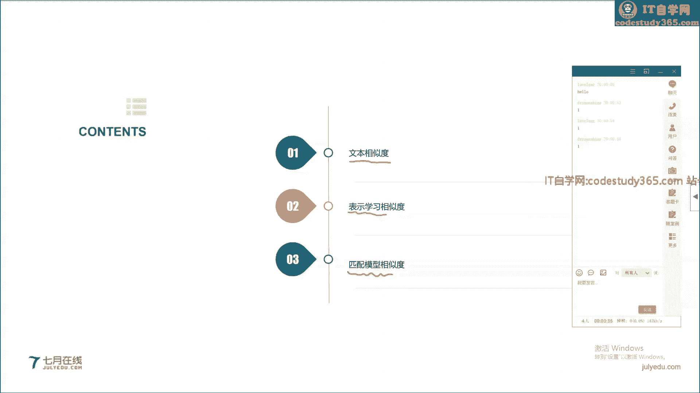

那我们接下来就进入到我们的第一部分内容啊，关于这个文本相似度好。

那这边开始之前呢，我也简单说一下啊，我们的这个课程上的这个代码呢，都会在这个啊GITHUB这个地址里啊，好给大家简单看一下，那啊大家上课之后，如果大家需要看这个代码，那就来到这边，来到这个页面上。

然后如果你需要去获取这个代码该怎么去拿呢，啊有两种方法啊，第一种方法你可以点击一下，这里这个绿色的这个按钮啊，因为这里为什么要说这个事呢，因为有些同学可能还是啊正在大学期间啊。

可能对GITHUB这一块用的还不太熟练，所以这边简单说一下好吧，那就点击这边这个code啊，然后呢你可以使用这个git命令把它clone下来，你也可以呢在这边直接把这个下载下来，那下载下来的话。

它就是这样的一个压缩包好吧，然后解压缩之后呢，就可以看到这个代码了，好两种形式好吧，一个是使用这个git命令，一种是使用这个下载压缩包的一个形式，当然大家最好是使用这个git命令啊。

那我这边代码更新的话，大家如果使用git克隆下来的话，你也方便去更新你的代码，好吧好，这是嗯关于代码这一块的一些东西啊，好提前说一下，OK那我们就要接下来就来看这个文本相似度啊。

那文本相似度说白了其实就是计算两个文本，它的一个相似度对吧，就是字面意思啊，就是计算两条文本它的一个相似度，它和文本分类它最大的一个点在于是什么呢，文本分类我们是针对于什么，我们针对的是单挑文本。

但是对于文本相似度来说，假设我们要去计算A和B的一个相似度，那我们是需要两条文本的对吧，这是它最大的一个点啊，在我们训练阶段，它最大的一个点分类是针对于一条文本，我们的这个相似度啊，针对的是两条文本。

那待会大家也可以从模型的结构层面看到，如何去针对于两条文本去设计，这样的一个模型结构，那知道了什么是文本相似度之后呢，我们需要考虑一下，就这个文本相似度啊，它到底是有什么样的一个应用场景。

它其实文本相似度啊，和文本分类一样，它的这个应用场景是非常多的啊，例如咱们的这个文本的一个检索信息检索，还有咱们的这个问答好，我们先说先说这个检索啊，检索这个相信各位同学都非常好理解啊。

例如咱们的一个搜索引擎对吧，那你搜索引擎你输入了一个问题，那咱们这个搜索引擎要把这个答案进行返回，那通常呢啊，用户输入了一个这样的一个question对吧，那他会返回很多的这样的一个啊document。

或者说它输入了一个query，我们要返回很多这样的一个document，可能有D1D2D三好，那如何去对这个D1D2D三进行一个排序呢，因为我们显示在页面上，那我们就需要对它进行一个排序对吧。

那其中一种方式啊，我们就可以根据我们的这个相似度来进行排序，那相似度越靠前的，我就把它往前面排，那假如A11它的相似度很高对吧，那我就把它排在第一位，第三它的相似度可能是第二，那我就把它排在第二位。

最后这个排在第三位，这是检索的这样的一个场景啊，那包括搜索引擎，它其实也会应用到这样的一个文本相似度，一个计算，当然啊一些做的比较好的一些搜索引擎，除了去考虑咱们的这个文本相似度以外。

还会去考虑一些额外的一些特征，举个简单的例子啊，假设你用的这个是百度的一个搜索，那百度搜索的话，你可能会遇到很多的一个一些广告对吧，那他其实是会对针对于这些广告，也是采用一些加权的一些形式。

把这些广告呢排到前面去，其次啊啊其次的一些排序的一些结果，甚至会涉及到一些learning to rank，一些类似于推荐的这样的一些模式，把你感兴趣的内容往前面排，它也是有的，好吧好，这是一个检索啊。

让我们再说一下问答，问答和检索呢其实是比较接近的啊，他的思路是比较接近的，举个例子啊，对于问答来说呢，首先呢我们需要有一个这样的一个，QA的一个库，也就是说我们哎有这样的一个数据库。

我的数据库里面呢存了很多的这样的一个，QA队啊，QA队，这个时候呢用户输入输入了一个问题，好用户输入了一个问题，那我们的这个可能有Q1Q二一直到QN，咱们的answer也是啊。

从一一直到answer n，这个时候呢用户输入进来的这个question，会和我们库里的这些question，去做一个相似度的一个计算，哎，这个时候可能算出来我Q2，它的相似度是最高的。

那么我们就把Q2对应的answer2，进行一个返回，进行一个返回，这就是一个非常简单的一个问答系统啊，问答系统，所以说可以看到啊，这个文本相似度的一个应用场景啊，实际上是非常多的非常多的。

这边再说一个简单的一个场景啊，那这个简单的场景，就是咱们的一个文本的一个聚类，假设你现在有非常多的这样的一个文本，你想把这个同义句给聚在一起，怎么做呢，这个时候您实际上也可以采用这个。

文本相似度的一个方式来进行计算，那我们去两两进行相似的一个计算，最后把相似度比较接近的就把它聚在一起，对吧好，这是第三个应用场景啊，聚类聚类，那目前文本相似度的主要是有两种方式啊。

就基于这样的一个表示学习的，就是刚才咱们这个大纲里说的一个表示学习，还有一种呢，就是基于咱们这样的一个双塔模式的啊，双塔模式的，当然啊，现在其实对于双塔模式这样的一个结构来说呢。

也会存在于一些啊单塔的一个结构，那具体是什么样子呢，待会我们来详细说好吧，推荐的双塔用embedding计算好，这就是我们的一个文本相似度，它的一个应用场景好吧，应用场景，好那咱们的这个文本相似度。

通常啊不管你是用什么样的一个方式来做，不管是说这里的一个表示学习也好，还是这里这样的一个双塔结构的一个模型也好，关键的有一个点啊，在我们去计算相似度的时候，我们是不是应该去确认一个这样的一个。

度量的一个标准，我们到底应该是采用什么样的一个距离，来判断两条文本它的一个相似度呢，哎例如我们这里有很多距离对吧，我们有欧式距离哎，有曼哈顿距离，有海明距离，有很多的一些距离都可以用来度量。

两条两个向量它的一个距离对吧，那我们会去使用什么样的一个方式呢，那对于计算文本相似度来说啊，我们通常会采用这个余弦相似度，那为什么都是建议采用这样的一个，余弦相似度呢。

最主要的原因啊在于咱们的这个余弦相似度啊，它的一个值域在这个-1~1之间，那基本上啊对于文本来说，我们计算出来的这个相似度，大部分都是0~1之间，很少会出现于一个负数啊，很少会出现一个负数。

那余弦相似度它又是怎么计算的呢，我们可以看下下面这个公式啊，如果我们要求A这个向量和B这个向量，它的一个余弦相似度，实际上就是A向量乘以B向量，再除以A的模和B的模，这就是两个向量它的一个余弦相似度啊。

余弦相似度好，那了解了我们接下来要计算的这个相似度，用什么样的一个度量方式去计算之后呢，那接下来啊，我们就可以进入到我们后面的一个内容了。

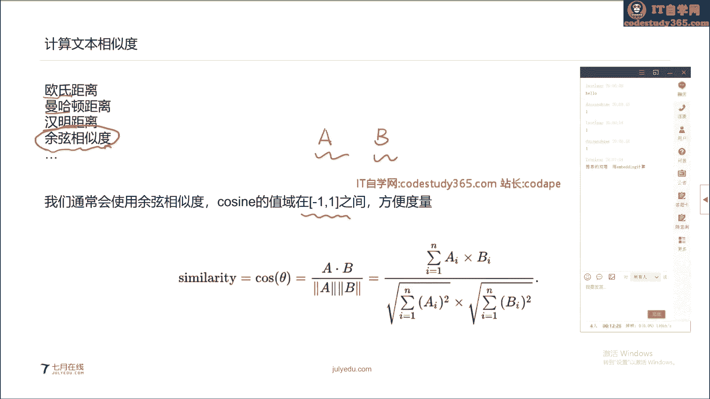

好接下来我们来到我们第二块啊。

关于这个表示学习的一个相似度，那什么是一个表示学习的一个相似论的计算呢，其实表示学习啊，意思就是说我们需要通过一个模型，通过一个模型得到句子的embedding，这里大家需要注意一下啊。

是通过模型得到我们句子的embedding，那得到句子的embedding之后诶，那我们就可以把我们的这个embedding，根据我们这里提到的这个余弦相似度，来进行一个计算。

就可以最终得到我们想要的一个结果对吧，举个简单的例子啊，假设呢我们现在这里有A这条文本，B这条文本好，首先呢我们这里有一个这样的一个模型啊，我们先不考虑它到底是什么样子的一个模型啊。

我们先不考虑它是什么样的模型，总之我们这里有两条文本A和B，我们把这两条文本给到了我们的模型，我们的模型呢生成了两个向量，一个是VA，一个是vb，OK有了两个向量之后。

那我们是不是就可以去计算我们的余弦相似度，对吧，那就是VA乘以为B除以VA的模vb的么，这样子的话，我们就可以计算出我们的文本相似度了对吧，OK那知道了这个流程，那接下来就有一点比较关键了。

这里这个模型该怎么得到呢，好这就是我们需要关注的一个点啊，关注的点那在我们之前的这个啊，包括录播课里面啊，我们实际上已经讲过这个word to vector了对吧。

我们已经讲过这个word to vector了，好那既然如此，我们是不是可以考虑采用word to vector，的一个形式呢，对吧，OK啊，那我们就采用这样的一个形式嘛，假设啊我现在A这个句子。

A这个句子它里面可能包含了很多的一个词，可能有A1A2A3A4好，那接下来呢，我们就可以采用我们这样的一个，海量的一个数据，采用word to vector的一个形式，得到这样的一个模型。

word to vector一个模型对吧，那有了这样的一个word to vector一个模型之后呢，当用户输入了这句话，好，我们把就把这句话啊进行一个分词分词，这边的话就是分成了四个词啊。

分成了四个词，那有了这四个词之后呢，我们会把这四个词啊经过我们的word to vector，这样的话，我们是不是就能得到这四个词对应的一个，embedding对吧，哎那我们这里就得到了VA1。

VARVA3和我们的VA4对吧，好同理啊，同理，那对于B这个句子来说，我们也可以把它进行一个分词，再转换成对应的一个向量对吧，对应对应的一个向量，这个时候我们是做了什么呢，我们是把句子分了词。

转换成一个向量的一个形式，但是但是我们这里的这个向量啊，我们可以看一下，这里是四个词，假设我们的向量它的维度是64，假设是维度是64啊，那我们这边得到的实际上就是一个，4×64的这样的一个张量。

或者说举证对吧，我们得到的是这样的一个维度的一个数据，那对于这边来说，我们得到的就是啊啊假设我们的N是六好吧，我这里写个六好了，写个六好，那我们这边得到的这样的一个，就是一个6×64的这样的一个矩阵。

或者说张量好，那现在就有问题了，这两个矩阵，我们该怎么去计算它的一个相似度呢，哎刚才我们说嘶我们是两个向量对吧，两个向量才能去计算它的余弦相似度，那这个时候我们得到的这个内容到底是什么呢。

我们这里得到的这个矩阵到底是什么东西，有同学知道吗，或者说接下来我想去算这个余弦相似度，我该怎么做呢，来有同学知道吗，好我这边那我就解释了啊，我来解释好了，首先呢我们这边得到的实际上是什么。

是每一个词它对应的一个词的embedding，但是我们这里这个余弦相似度的公式，我们使用的这个是什么，是使用的是句子的embedding，但我们这里是啥，我们这里是词的embedding对吧，假设啊。

假设我们最终得到的是一个一维的，也就是说它只是单纯的一个向量，它不是一个矩阵的一个形式，假设他这边得到了一个64位的一个向量，诶，这边也得到了一个64位的一个向量。

那这个时候我们是不是就可以进行一个计算，对吧好，这里有一位同学说哎，是不是可以采用这个平均池化层，差不多啊，思路差不多，OK那既然如此啊，我们这里得到的是一个词的一个embedding。

那我们就应该想办法把它变成一个什么句子的，一个embedding嘛，对吧，我们要从词的embedding转换到句子的embedding，那怎么转呢，其中一种方法啊，就是这里这位同学说的。

我们可以采用一个平均池化层，平均池化层好，我们来看一下啊，那通常呢我们要把我们的这个embedding啊，从词从咱们的这个词转换成这样的一个句子，从word转换成这样的一个sentence对吧。

那最常用的一个方式呢，其实就是什么加权平均，加权平均，也就是说我的这个vs啊，实际上是等于，加上啊，这是第一个词啊，这是第一个词它的一个embedding。

这是第一个词的embedding对应的一个权重好，那假如我们有N个词，那接下来就是阿尔法二乘以W啊，一直加加到我们的阿尔法三乘以我们的啊，这是N阿尔法N到我们的WN，这样子呢。

我们就等于给我们每一个词加了一个权重对吧，最后再求和再求和，这就是咱们的一个加权平均的一个过程啊，假如我们的这个阿尔法一一等于我们的阿尔法，二等于我们的阿尔法N，就每一个词啊它都是相等的。

并且哦每一个词它的一个权重都是相等的，并且等于什么，等于N分之一的话，这是什么，这实际上就是取求平均嘛对吧，就是这位同学说的，做了一个类似于平均池化层的一个处理对吧，好那这个时候又有同学会说了。

哎那我这里这个权重，我这个阿尔法我到底该怎么去求对吧，好这里呢就需要去做一些小的一些处理了，例如啊我们呢在分词之后呢，我们可以去对每一个词，它的一个这个啊词性作为一个标注，诶假设我这是一个名词。

哎我这里是一个动词诶，那我就可能给它一个稍微大一点点的一个权重，那可能后面有些词诶它是一个副词对吧，我就给他一个稍微小一点点的一个权重，以这样的一个形式啊，来确认它的一个阿尔法到底是多大。

当然还有一些其他的一些方式，例如你可以采用这个TFIDF，你可以采用这个text rank去计算每一个词，它的一个权重，再把这个权重啊，来作为他的这样的一个阿尔法的一个值，也是可以的啊，也是可以的。

当然啊如果大家觉得这些啊有点麻烦对吧，没关系，我们就采用最简单的一个方式啊，就采用这样的一个平均值化的一个形式，就直接取一个均值啊，直接取个均值，这样子的话，我们就可以把我们的这个词的一个引白。

embedding转换成一个句子的一个embedding，好我们回到刚才这个例子啊，回到刚才这个例子，那对于A这个句子来说，我们是4×64的这样的一个矩阵对吧，OK那接下来呢我就对它求一个均值。

求完均值之后呢，实际上啊就是让我们的这个V1，加上我们的VA2加上VA3，加上VA4，最后再除以四对吧，所以这样呢我们就可以得到一个一维的，一个这样的一个向量对吧，得到一个向量，那对于B来说也是一样啊。

我们把每一个词的embedding进行一个相加，进行一个相加，相加完之后呢，再除以我们的六个词，也就是除以六对吧，就可以得到我们最终啊这64位的一个向量，接下来呢我们就可以把这两个向量拿去计算。

我们的什么余弦相似度，余弦相似度啊，这就是我们整个表示学习的一个过程啊，表示学习的一个过程，好再简单，我们梳理一遍啊，首先拿到一个句子，拿到一个sentence，我们要把sentence转换成什么。

转换成词，再把每一个词转换成我们的什么embedding，转换成我们的词的一个向量，再从这个词的一个向量，转换成我们这个句子的一个向量，句子的一个向量，那句子的向量怎么做呢，是进行有我们的这样的一个啊。

啊这里写VW吧，VWI好，是进行我们的什么加权平均对吧好，这就是我们哦对，还有一步啊，下一步就可以去计算我们的什么相似度了，计算我们的余弦相似度啊，计算我们的余弦相似度，这就是整个表示学习的一个过程啊。

好这个时候呢可能又有同学会说了，那有没有其他的一个方式，我们这里只是一个采用want to vector的一个形式，对吧，有没有其他的一个形式呢，那其他形式怎么做呢，其他形式啊。

实际上就是把咱们刚刚说的这里这个模型啊，进行一个优化，进行一个修改，我们从之前的word vector对吧，进行一个升级，升级成其他的一个模型，其他的一些语言模型啊，Language model。

language model对其中一种方法就是BT啊，其中一种方法就是BT，但是这个我们今天暂时不讲啊，今年暂时不讲，我们会放到后面来讲，因为BERT这个模型来说，相对会稍微复杂一点点啊。

好这里我们稍微停一下啊，对于表示学习的这个整个流程，各位同学有没有什么疑问，对就是给每一个词它一个权重，然后相加好吧，相加就是这个意思啊，简单一点的话，那你就把这个权重啊，把它变成一个N分之一。

这样的话实际上就是什么，就是求个均值嘛，求均值，求均值就是咱们刚才这位同学说的平均池化层，好，各位同学还有疑问吗，这里，还有疑问吗，各位同学，啊这里也简单说一下啊，就咱们是直播课嘛，直播课的话。

大家如果有什么疑问就及时提出来好吧，我们尽量就是在这个课程当中啊，帮大家把所有的问题都给解决，大家不要带着疑问，带着疑问呢，那接下来我们的这个直播的一些内容啊，你可能就会听不太明白好吧。

因为每一环都是相辅相成的啊，前面的内容你听不明白，后面的内容你可能就更听不明白了好吧，所以大家有疑问啊，一定要提出来，一定要提出来，我们就及时解决，及时解决，好那我们就继续往下啊，继续往下。

那刚才说了啊，我们刚才使用的模型是这样的，一个word vector的一个模型对吧，word vector一个模型好，那我们把这个word vector这个模型啊做一点点升级。

我们要把这个word vector升级成什么呢，升级成另外一个语言模型啊，language model或者说叫做预训练的语言模型，Pre train language model，Portrait。

Language model，预训练语言模型，那我们今天要给大家介绍的这个语言模型呢，叫做arm，有些同学可能会比较熟悉啊，像BERT这样的一个语言模型，那这样的一个语言模型呢。

其中的一些结构啊会稍微复杂一点点，我们需要放到后面去讲，那今天呢我们会给大家讲另外一个比较重要的，预训练的语言模型，而某这个模型，那这个模型呢它是基于这样的一个LSTM的，那LSTM的话。

相信各位同学在之前的一个录播课当中啊，已经了解过了对吧，已经学过了，那我们今天的话就来详细看一下，这个基于LSTM得到的这样的一个语言模型，预训练，语言模型它到底是什么样子的啊。

好他的一个结构整体来看其实并不复杂啊，我们可以看一下下面这个图，那arm这个模型呢，实际上采用的就是一个双层双向的LSTM，注意啊，它是一个双层的，并且是双向的，并且是一个双向的。

那他这个双向是什么意思呢，对于普通的一个RN的一个模型来说，咱们的一个结构是这个样子的对吧，哎我们这里进行一个输入，第二个时间点，输入第三个时间点进行一个输入，它是一个从左到右的一个过程。

那对于RN这样的一个结构的一个模型来说啊，实际上我们还可以进行一个，从右到左的一个结构，诶，它可能是这个样子的，就从右到左，或者说从后往前的这样的一个结构，那这样的话。

我们的模型除了可以看到我们的前文以外，我们还可以看到我们的后文对吧，那对于我们的第一种结构，从前往后，那模型其实就能看到的是什么，看到的是前文的一些信息，那对于我们的第二种结构来说，那模型看到的。

实际上就是我们的后文的一些内容对吧，那既然如此，我们把这两者结合一下对吧，结合一下，那结合之后呢，我们当前的这个时间节点，就既能看到我们之前的一些内容，又能看到我们这个之后的一些内容。

也就是说我们能看到什么，能看到我们的一个上下文啊，上下文，好这就是一个双向的N结构啊，双向的RN结构，那对于arm这个模型来说，它是把RN这样的一个结构啊，换成了这个LSTM，LSTM好。

我们来看一下啊，它的输入呢就是我们对应的每一个词的这样的，一个embedding，然后呢给到我们的一个前向的双层的，这是两层啊，两层的LISTM，那对于这边来说也是一样啊。

它是一个反向的LISTM当然也是两层的，最后呢我们会把这个两层的，它对应位置的一个输出值会把它拼在一起，拼在一起好，我们可以看一下啊，啊这是一个前向的，我们用F来表示啊，这是第一个位置，那啊这边的话啊。

我们也用这个啊B来表示啊，这是B1，所以说对于第一个embedding，它对应的就是前向的F1和反向的这个BE，它组成的一个结果组成，在它最终这里这个T1啊，是咱们的F1和我们的B1进行了一个拼接。

放到了T1这个位置啊，那这个位置的一个输出值，代表的就是我们的这个embedding，经过了我们的模型提取了一定的一些特征之后，得到的对应的一个词的一个embedding，假设这里是词是W1啊，W1。

那这里这个embedding，实际上是经过了我们这样的一个embedding matrix，也就是类似于咱们的这个word vector，对吧的那样的一个矩阵，好得到了我们这里这个一一啊。

一一经过我们的双向LSTM，分别得到我们的F1和B1，再把这两者进行一个拼接，得到我们的T1，那T1表示的是什么呢，表示的就是我们W1这个词它的一个输出值，你也可以理解为W1对应的一个什么词的一个。

Embedding，一个向量，一个向量，好这就是整个这样的一个耳膜的一个模型，但是我刚才有说啊，ERO这个模型它是一个什么，它是一个预训练的模型，预训练模型又是什么意思呢。

也就是说这个模型啊我们再去使用它的时候，它的一个权重啊并不是随机初始化的，而是它在海量的这样的一个文本数据上，已经进行了一个训练，也就是说他自身已经具备了一定的收敛的，比较好的一些权重。

那他这个群众是怎么得到的呢，或者说他这个预训练是怎么做的呢，其实很简单啊，举个简单的例子啊，假设这是我们的一个耳膜，那正常来说啊，我们实际上是会有很多的，这样的一些文本数据的对吧。

假设我这里有一条文本数据，哎我就以这条数据为例啊，ERO采用的是双层的双向LSTF，那我就可以把这句话啊输入给我们的耳膜，我把这句话啊作为输入给到我们的耳膜，然后呢。

我们让我们的耳膜这个模型来预测一下这句话，他的下一个字是什么，下一个字是什么，当然啊，这个过程肯定是一个字一个字进行预测的，举个例子啊，假设我现在输入的是ERO采用的啊，我们就输前面这一段这里啊采用。

然后呢我们要让我们的hero，也就是LSTM，它最后的一个位置输出D这个字，输出D这个字，那输出完之后呢，我们再把D这个字啊再给到我们的耳膜，也就是给到我们这个双向的LISTM。

再让他把士这个字进行一个输出，哎这个时候各位同学可能就发现了啊，那这个过程它实际上是一个什么，是一个无监督的一个过程，只要你有文本，那你就可以来进行这样的一个训练对吧，有文本你就能训练。

那它就是在海量的一个文本的一个基础上啊，去做了这样的一个预训练的一个任务，那训练完成之后呢，它就会自身已经具备了一些权重了对吧，那当你去使用ERMO的时候呢，你只需要把这个权重给加载进来，加载进来。

这个时候你就可以在这个已经训练过的一个，模型的一个基础上再去做一些所谓的什么微调，就可以去适应你自己的一个任务，那对于我们的这个文本相似度来说啊，其实就是可以直接使用它的一个权重。

那只要我们有了这样的一个权重，那我们最终这里实际上就可以得到每一个词，它对应的一个embedding对吧，也就是这里这个所谓的T，那我们再对每一个T去求，刚才这里说的这样的一个加权平均的一个值。

就可以得到我们最终的一个什么句子的，embedding对吧，所以各位同学可以发现一个问题啊，我们刚才说我们的那个模型使用的是what vector，对吧，What to vector。

然后这里呢我们换成了这样的一个arm，不管你使用什么样的一个模型啊，我们最终的这个整个这样的一个流程啊，它是不会变的，它是不会变的，唯一改变的就是我们这里这个模型对吧，唯一改变的就是这个模型。

包括我们最终生成的这个句子的一个embedding，对吧，你这个句向量该怎么生成，哎也是和我们这里说的这个方式啊也是一样的，毕竟我们最终这里得到的也是一个一个的词的，一个embedding对吧。

词的embedding好，这就是我们的这个ERO这个模型啊，这个模型好，接下来呢我们再来看一下啊，如何去对我们的这个啊前向语言模型，和我们的反向语言模型去进行一个建模啊，好我们来看一下啊。

这里呢假设啊我们现在有这样的一个句子，这个句子呢有N个词，也就是说从T1到TN，那我们要对这个句子去进行建模的话，实际上就是求每一个词它的一个联合概率分布，也就是咱们的P从T1到TN对吧。

最终呢我们会得到这样的一个累成的一个公式，哎为什么是这样的一个形式呢，其实啊这个公式是怎么得到的呢，我们来看一下啊，那对于PT1到TN这N个词来说，那如何去得到这样的一个概率分布呢。

实际上啊假如假如每一个词它是相互独立的，假如每一个词它是相互独立的，那它实际上就等于PP1，一直乘乘到PTN对吧，但对于我们的文本来说，每一个词肯定不可能是相互独立的嘛，对吧啊，例如像啊啊吃饭诶。

这两个字可能会大概率在一起诶，蝙蝠这两个字可能大概率会在一起，你不可能说啊吃福哎，那这是啥东西对吧，所以说词和词之间啊，或者说字和字之间它不可能是相互独立的好，那既然它不是相互独立的。

那这个肯定是不对的对吧，那我们该怎么去求这个啊概率分布呢，那这个时候啊我们就可以这么求啊，首先呢我们先看前面的一些词好，这时候实际上就等于PT1乘以P1，这个啊T2给本T1好，那这两者进行相乘之后呢。

我们得到的是什么，我们是不是得到的是PT1T二对吧，我们得到的是这个东西啊，得到这个东西，那我们可以继续再往下面乘啊，那我们可以再乘这个P这个啊，这个这个T三T1TR好。

那我们再把这一项和这一项进行一个相乘，那我们拿到的是什么，是不是PT1T二T三，所以啊只要我们一直沉下去一直沉下去，那我们乘到最后一项对吧，我们实际上啊，整个的一个联合概率的一个分布啊。

就是这样的一个公式，就这样的一个公式好，这是我们的一个前向语言模型，那对于反向语言模型来说其实就是一样的啊，我们就把我们的这个啊，从T1换成了咱们的一个TN对吧，就重复从后往前来啊，从后往前来。

那对于一个双向的语言模型，我们该怎么做呢，理论上来说啊，我们应该把这两者就前向和反向进行一个什么，进行一个相乘对吧，进行一个相乘，但是呃各位同学可以考虑一下啊，理论上来说，这里这样的一个概率值。

其实计算出来已经非常小了，这里这个概率值通常会怎么去求呢，你可以去采用一个词平的一个形式去求解，但是求解出来大家可以发现啊，这个概率值已经非常小了，你再采用一个相乘的一个形式的话。

那这个值就会变得更小了，所以呢我们通常啊会取一个log，取个log，取完log之后呢，我们就可以把我们相乘这个过程啊，变成一个相加的一个过程，相加的一个过程啊，然后我们这个累乘啊啊。

也变成了这样的一个累加累加啊，这就是一个双向语言模型啊，双向语言模型，OK那理解了这个建模的一个思路之后啊，我们再来回到我们的这个耳膜啊，回到我们的耳膜，那arm这样的一个模型呢。

其实啊他想去得到每一个词的这样的一个，向量表示的一个方式啊，是有很多种的，有很多种，那第一种形式呢，就是去取我们第二层的LSTM的输出，也就是咱们刚刚说的，我我直接去取这里这个T1直接去取这个T1。

来作为我们最终的一个输出的一个结果，当然啊还有一些其他形式，也就是说我们给每一层它一个权重啊，去取它的一个加权的一个平均，什么意思呢，好我们还是回到这里啊，这里有我们的这个啊，有我们的一个一对吧。

这个是经过咱们这个embedding matrix，得到的这样的一个向量好，那对于第一层的LISTM来说，我们实际上也可以得到这样的一个输出值，假设我用H来表示H1，它也可以得到这样的一个输出值。

那对于第二层来说，哎我们这里也可以得到对吧，H2而这里呢我们又得到了一个TT好，那这个时候啊，我们就可以把这里这个T，这里这个H这第一层的H，还有这里这个啊一进行一个加权啊，加权加权求和也是可以的啊。

也是可以的，哎这个时候可能各位同学会发现，哎怎么好像和我们去求那个句子，embedding会有点像对吧，所以说啊这些方式啊其实都是类似的，都是类似的，那这些呢其实都是他的一个paper当中啊。

说明的说明的好，这就是我们的这个耳膜啊，来得到这样的一个embedding的一个形式，那最终得到embedding之后呢，怎么做呢，啊就还是像刚才的对吧，把它转换成一个句子的embedding啊。

就OK了就OK了，好，这就是我们这个ERO这个模型，如何去得到它的一个embedding啊，得到embedding，好，这里呢啊也给大家提供了一下，如何去使用这个ERO这个模型。

当然啊你可以自己去做这样的一个预训练，是完全OK的，但是呢这边其实是有一些啊，别人已经训练好的这样的一个耳膜的一个模型，大家如果有足够的一个数据，你有足够的一个算力，那你可以自己去预训练。

这样的一个耳膜的一个模型，但是呢我还是建议大家就去使用这样的一个，开源的啊，就足够了好吧，使用开源的就足够了，嗯这有点慢啊，有点慢好，大家就去这边来使用这样的一个开源的啊，开源的。

包括他这里也提供了不同语言的一个版本，让大家来这里下载一个中文版就OK了啊，下载中文版，那这里下载下来呢是什么呢，是模型的一个权重啊，模型的一个权重，那如何去使用呢，啊使用的地方。

我们在这边已经给大家进行了一个说明啊，啊这里也简单说一下啊，啊一首先呢要有以下几步啊，第一步的话，肯定是要去安装我们的这个PYTORCH啊，PYTORCH这里也简单说一下啊，我们在之后的课程当中呢。

所涉及到的一些模型的一个开发啊，我们都会采用这个拍套，只有个框架好吧，都会使用PY套式这个框架，然后呢我们需要去安装我们的这个康达啊，CONDA安装好之后呢，我们需要去安装一些这个啊，刚才说的啊。

这个arm这个我们要把这个尔摩这个啊，用这个pip的一个形式啊去进行一个安装，或者说呢你直接把他的这个源码啊给clone下来，也就是说大家只需要去执行这几行命令啊，这几行命令。

那它就会自动把我们的这个耳膜啊，安装在我们的这个本机里，本机里，当然啊大家记得要把这个权重下载下来，你如果不去进行一个下载，那你使用的这个权重就是随机初始化的，你随机初始化的一个权重。

那最终你得到的这个文本的一个embedding对吧，文本的embedding肯定就是效果不理想的啊，效果不理想的好，这边呢也有一个啊如何去使用啊。

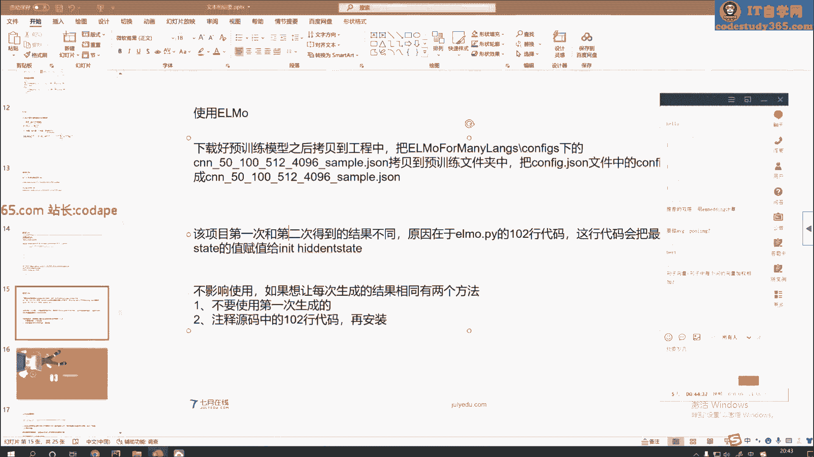

如何去使用，大家到时候就自己来看，然后这边呢我给大家简单演示一下啊，啊其实在我们的这个代码当中啊，我也把它放进来了。

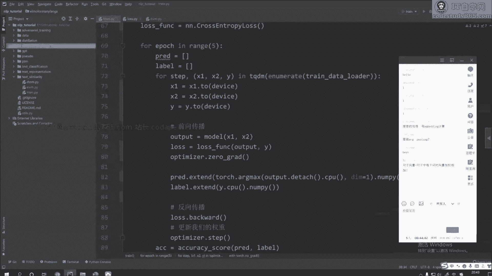

大家如果不去，大家也不需要去clone它的这个代码啊，大家直接把我的这个克隆下来就OK了好吧。

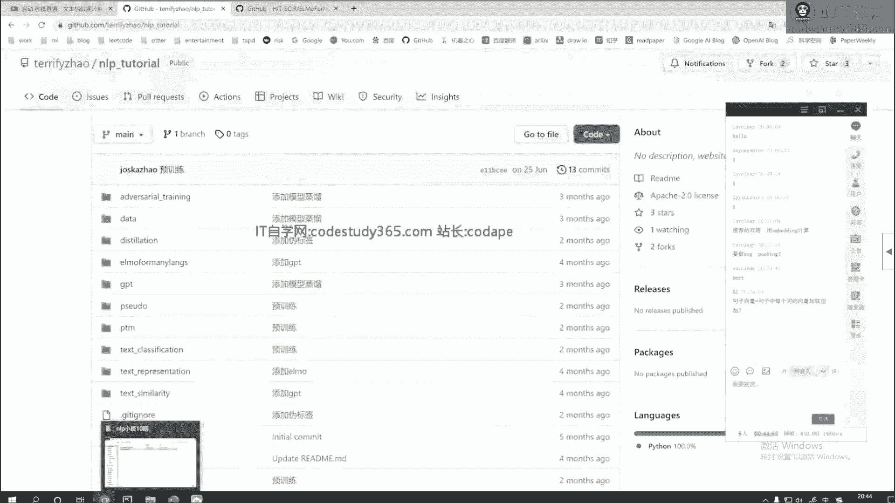

或者说你去下载这个压缩包，那打开之后呢，大家会看到这里有这样的一个文件夹啊，会看到这里有这样的一个文件夹，好，那这样的话大家就可以去使用这样的一个模型。

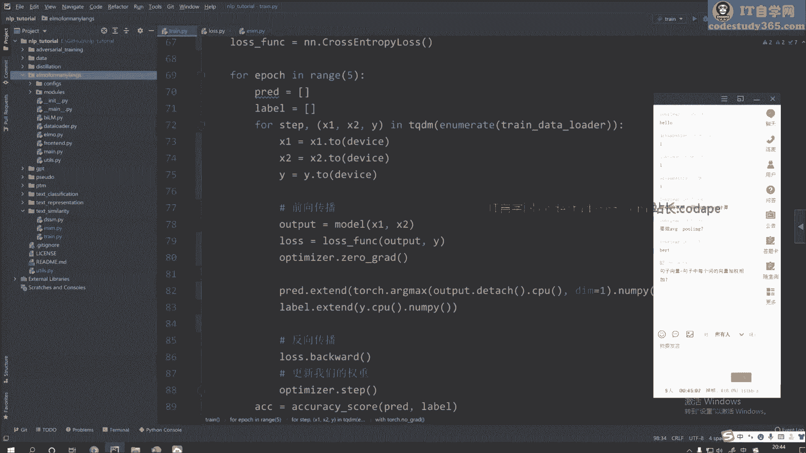

然后大家需要注意一下啊，大家去下载这个权重之后啊，这边去进行一个权重的下载之后呢，需要把权重啊放在我的这里。

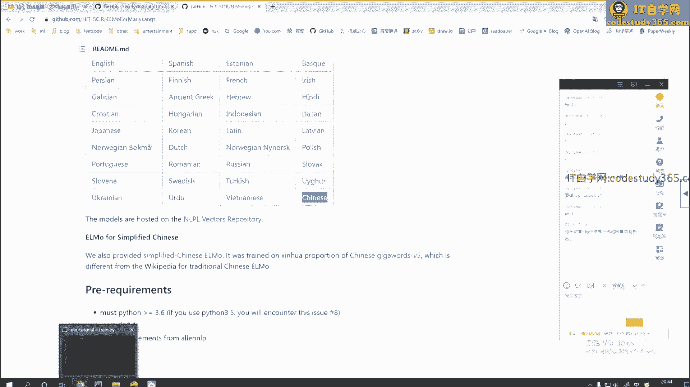

这里有一个，有一个叫做pre model的一个目录啊，我会把这个arm这个模型啊，这就是一个它的一个权重，还有一些它的一些配置文件啊，会把它放到这个文件夹下，大家去拉我的代码的时候。

会发现没有这个文件夹啊，你要去自己创建一个文件夹，然后把这个模型下载下来，放到这个文件夹下，然后呢你就可以去使用这个ERO这个模型了，好我们来看一下啊，这边呢我已经就几行代码啊。

就可以去调用这个arm的一个模型，好我们简单看一下，首先呢把arm这个进行一个import啊，然后呢我们导入一下结巴分词好，第一步是我们的句子，然后把句子进行分词，然后初始化一下我们的URL这个模型。

然后调用一下他的这个sentence to ero，这个方法啊，然后把我们的分词的一个结果传递进来，最终就可以得到我们这个句子的embedding，好，我们可以执行一下这个代码啊。

好这边是一个分词的一个结果啊，OK最终啊我们可以看到他输出了这样的一个啊，一个这样的一个张量啊，这样的一个张量哎，那为什么它输出的是这样的一个张量呢，因为他这里最终输出的是什么。

是每一个词的一个embedding。

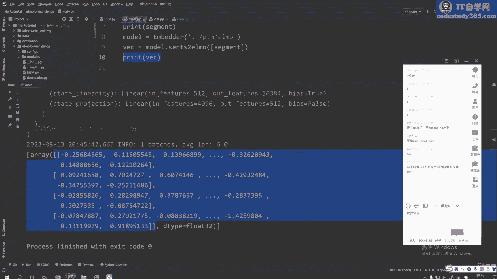

每一个词的in bedding，我们还需要去求个均值好吧。

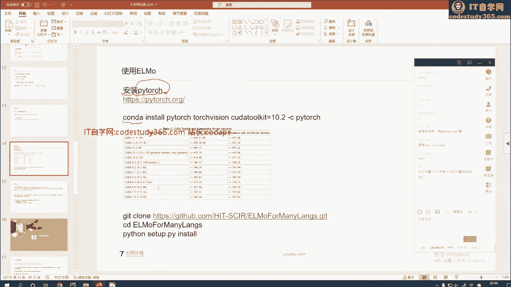

要转换成句子的embedding的话，你就需要去求均值好吧。

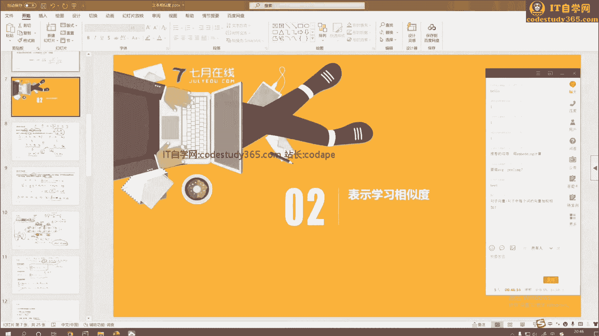

或者说你去做个加权平均都是可以的啊，就是咱们刚才这里说的对吧。

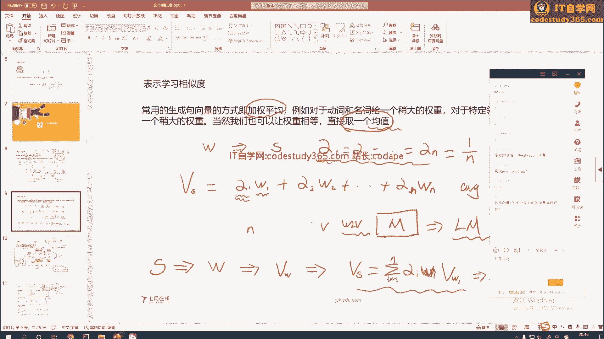

好，这就是如何使用咱们的这个hero这个模型啊，来生成我们的embedding，好这里呢最后再额外说一点啊，额外说一点啊，对于这个sentence to ero这个方法来说啊。

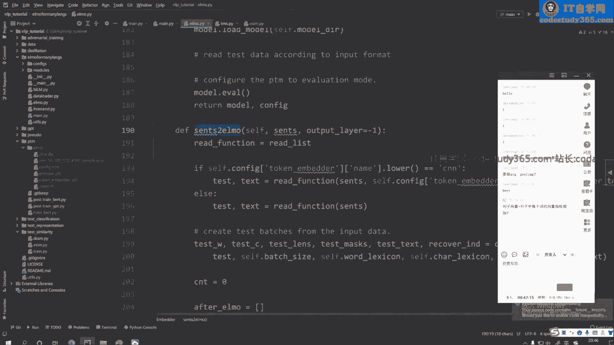

它里面有一个参数叫做output layer，那这个参数是什么意思呢，我们来这边看一下啊，他有这样的一个解释，output layer如果是零的话，它实际上输出的就是WARENCODER的一个值。

也就是它经过咱们的这个embedding，matrix的一个结果，也就是这里这个图当中的这个黄色的这个一一，这样的一个结果啊，如果你输入的是一一的话，它实际上得到的就是第一层的LSTM的一个。

Hidden state，Hidden layer，它的一个输出值啊，hidden layer的一个输出值，如果是二，就是第二层的LISTM的一个，hidden layer的一个值，如果是一哎。

可以看到如果是一的话，输出的是这三层的一个什么一个均值啊，一个均值哦，对我刚才这里弄错了啊，啊，这里这个T啊，实际上已经是我们第二层的，LISTM的一个输出值了啊，它表示的是第二层的一个输出值。

所以说这个T和这里这个H2啊是一样的，是一样的，只不过这里这个H2和T1唯一的区别在于，它没有进行一个拼接，好吧，这里我纠正一下好，最后如果你输的是二的话，他就会把这三层的一个结构啊都进行一个输出。

那如果三层结构都进行输出的话，你可能要做一些加权啊对吧，那你就自己按照你自己的想法来啊，就OK了，当然默认它是一啊，默认是一，也就是取这三层的一个均值。

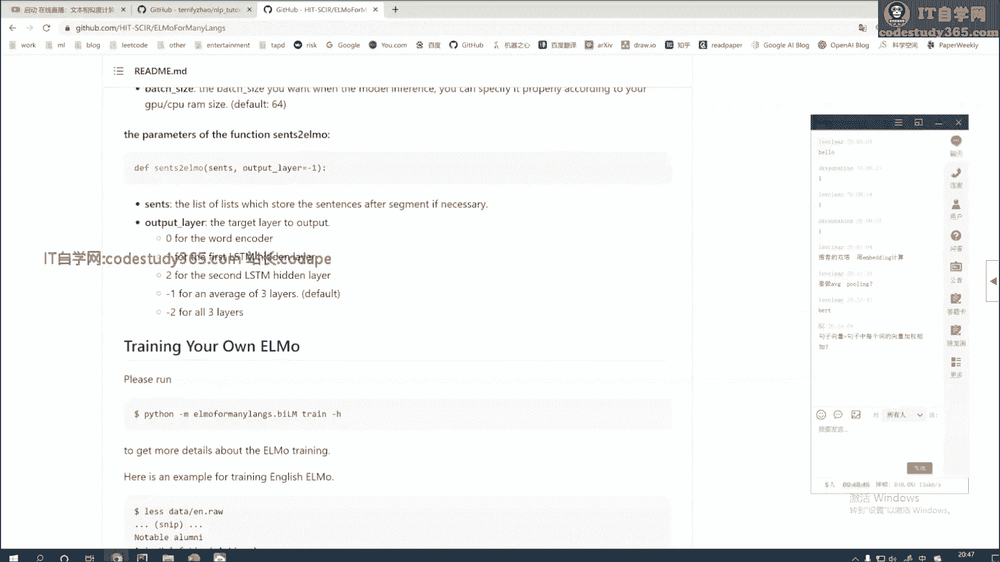

好如果大家想更改的话，就是在这个方法当中啊，把这个参数进行一个修改就OK了，好吧好，这就是使用咱们的这个arm这个模型啊。

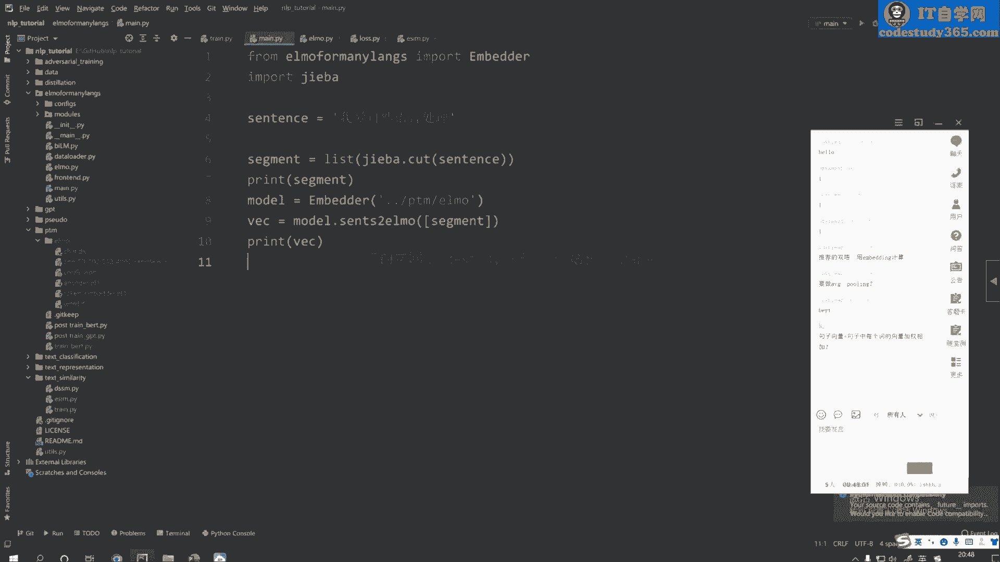

来生成我们的这个句子的embedding，好吧，生成句子的embedding，好这里我们再稍微停一下啊，看各位同学对于ERO这一块还有疑问吗，所以说最关键的点啊。

还是在于如何去找到一个合适的一个模型对吧，如何找到一个合适的一个模型，不管是咱们的word to vector，还是咱们这个ERO，又或者说我们今后会给大家讲的这样的一个BT，一个模型。

其实都可以用来生成这样的一个句子，的一个embedding对吧，好各位同学有疑问吗，看来是都没有欲望啊。

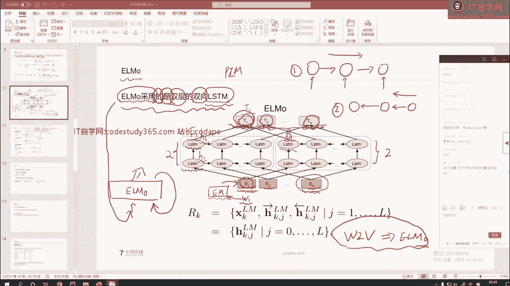

好OK那咱们就啊继续下面的内容了。

好吧好，那我们进入到我们的这个啊第三部分啊，关于这个匹配模型的一个相似度啊。

那刚才呢我们给大家聊的是，采用这个embedding的一个形式，也就是说哎我们把这个句子，提前转换成一个向量的形式，来计算这样的一个embedding，那接下来呢我们要给大家讲第二种方式啊。

就直接采用模型的一个形式，也就是说哎我这里有这样的一个模型，你直接把你的两个句子输入进来，比如咱们的A和咱们的BA输入给我们的模型，我们的模型呢最终输出一个值来决定，或者说来告诉你A和B这两个句子。

它到底是不是这样的一个同义句，或者说输出它最终的一个相似度，那对于这样的一个模型来说啊，我们通常会怎么做呢，实际上就是在我们的结尾啊，做了一个所谓的二分类，二分类，我要让它输出一个0~1之间的一个值。

0~1之间的一个值，那这个0~1之间的值越接近于一，就说明A和B这两个句子它越相似，大家也可以认为哎只要它大于0。5对吧，大于0。5，我就认为它是同一句，如果小于0。5，它就不是同一句。

就是以这样的一个思路啊来做好，那对于这样的一个模型来说，我们该怎么去构建它呢，好我们来看一下啊，而文本相似度的一个模型的一个结构呢，通常啊都会采用一个孪生网络的一个结构。

are u也就是咱们的一个双塔结构啊，什么意思呢，就是说啊我们这个模型啊，它其实分成了两个部分，两个部分哎，这边一个部分，这边一个部分，这两个部分呢一边输入我们的A，一边输入我们的B两个模型。

那这两个模型呢，有时候呢他会去做这个所谓的权重共享，也就是说我们的模型一，它的一个权重和我们的模型二它是相等的，它是相等的，那有时候呢它也可以不相等，它也可以不相等，好当然啊这种结构他能做的一些事情呢。

更多啊是把我们的这边输出一个所谓的VA，这边输出一个所谓的vb，那最终再把这两个向量啊，去经过一些类似于我们的全连接层，或者说我们的SIGMOID的层，再来做一个所谓的二分类。

然后得到我们最终的这个零一之间的，这样的一个值好，那除了这样的一个结构以外呢，其实啊我们可以还有一些其他的一些结构，还有什么结构呢，好这就需要看到这里啊，我们的相似度模型可以分为两种情况啊。

一种情况呢是这里说的这种外交互的一个形式，也就是这个图啊，这个图也就是我们的第一种形式，第一种形式，那还有第二种形式啊，一个内交互的一个形式，那内交互的一个形式又是什么样子的呢。

它也可以是一个这个啊双塔的一个结构，也就是说唉我这里输出之后，我和我的M2这边的一些输出，做了一些这样的一些交互的一些处理，做了这样的一些交互处理，这个交互处理有什么呢。

可能你去做了一些attention，然后可能你去做了一些磁化，你做了一些拼接，总之你去做了一些相互的一些交互，然后呢，再给到我们接下来的一些其他的一些结构，例如LSTM或者其他的一些类似的。

这样的一些结构，这是一个所谓的一个内交互的一个形式啊，甚至诶我这里这个模型就只有一个模型，它不是一个双塔的一个结构，那我把A和B1起做了一个拼接对吧，做了一个拼接给到了我们的模型。

我们的内部去做了一些交互，然后最后进行了一个R分类，这是我们的第二种结构，第二种结构内交互的一个形式，当然啊也有外交互加内交互，也就是说哎我先去做一些内交互，我再去做一些外交互的一个形式。

所以说啊文本相似的模型，它的一个结构啊是非常多的非常多的，当然啊大家只需要注意到这里，这个所谓的一个内交互和外交互就OK了，好吧，还有这里说的这样的一个双塔的一个结构啊。

你可以让这两个模型它的一个权重不同，也可以相同，但是大部分的情况啊，双塔结构的模型它的权重都是相同的，也就是说所谓的权重共享好吧，权重共享，呃尔某英文模型的词典都是26字母哦，不是啊。

不是英文的一个分词，它是怎么做的呢，第一种方式啊，它是就把这个分成一个一个的英文的一个词，分成英文的词，但是分成英文词，它实际上也会存在于这个OV的问题，也会有OV的问题，OV什么意思呢。

就是out of vocabulary，就是没有在我们的词典当中，所以说啊这个时候也会去做一些所谓的word piece啊，这个东西我们之后放到BT再给大家讲好吧，所以说这里不是分字母啊，不是分字母。

那对于中文来说，我们有两种方式，第一种方式呢我们可以分字分字，它的优势在于不容易出现OV的问题，因为常用的汉字也就那么多，可能11万2万，基本上就覆盖了大部分的这个汉字了，就很难出现OOV的问题了。

第二种形式呢是分词，分词的话，你中文的词就非常多了，那这种时候的话就可以，就容易出现这个OV的问题，所以说啊分子和分词各有优缺，各有优缺，还有一点啊，那对于啊分词来说，它能对语义表示的更合理一些。

对于分字来说，那大家都知道吗，那对于中文来说，这个啊一个字它有很多个意思对吧，可能要和其他的字组合成一个词之后，才能真正的知道它到底是什么意思，这就是字和词它各自的一个啊优缺好吧，好我有说明白吧。

这位同学，OK行好，那我们回到我们的这个文本相似度模型，这一块啊，啊还是哦关键还是那两点啊，一个是内交互，一个是外交互好吧，然后这边也在还有这个双塔结构啊，大部分是这个所谓的权重共享，权重共享。

权重共享的意思就是说模型结构是一样的，然后权重它是进行一个，你看着它好像是两个模型，但实际上它结构和权重都是一样的，如果你的权重不共享，那它的结构也是一样的，只是说权重不一样，好吧好，然后呢。

我这边呢有啊有这样的一篇博客啊，这个是我很久以前写的一篇博客啊，这边呢我整理了很多的一些这样，文本相似度计算的一些小模型啊，然后这些啊这边有个表格，大家可以看一下啊，它的一个输入有字向量啊。

有这个词向量，然后好像还有静态词向量和动态词向量，我觉得这个应该是在之前的那个录播课里面，讲过了对吧，然后啊还有对应的一个论文的地址，那每一个模型呢，我这边也有博客去讲解，每个模型是什么样的一个结构。

它是怎么用的，大家如果对这些模型想了解的更多，就一个一个来看好吧，一个一个来看，当然啊，我们今天课程上也会带着大家去看一些，比较重点的一些模型，好吧哦对，还有一点啊，我这边也有对应的一个源码。

也有对应的源码，但是这个源码呢它是这个啊，TENSORFLOW的一个版本好吧，TENSORFLOW的一个版本，大家也可以来自己看一下好吧，自己来看一下，尔某一般是直接用还是自己重新训练一个。

如果你想用ERAL来生成这样的一个，句子的embedding，那你就直接去加载它的权重，进行使用就可以了啊，但是如果你想让这个生成的句子的embedding，效果更好，那可以怎么做呢，举个例子啊。

假设你现在是一个这个医疗领域的一个场景，那可能尔某它是一个在通用领域进行，预训练的一个模型，那你就可以把你医疗领域的这个啊数据啊，你的文本数据拿过来去做一个预训练，预训练，预训练完之后呢。

再直接用这个训练好的模型，来生成这样的一个embedding，好吧，当然你也可以啊，不进行预训练啊，就直接去使用它的这个预训练，好的权重也是可以的，好吧，这位同学两种方式啊，你想要效果更好。

你就在你自己领域的数据再做一下预训练，当然啊这个通用领域的数据也是可以用的，只是说可能效果会稍微欠缺一点点好吧，好啊，这边呢我们还有这样的一个图啊，讲解了，说明了一下咱们这个内交互和外外交互啊。

我们来分别看一下这四个图啊，首先呢是第一个图啊，第一个图呢啊这边啊实际上它使用的是这样，BT这样的一个模型的一个结构，而BERT这个模型它结构到底是什么样子呢，没关系啊，这个没关系。

我们主要是看一下它的这个叫做对于这个bird，它最原始的计算文本相似度的一个形式呢，实际上就是把两句话啊拼接在一起，黄色的是A，绿色的是B，可以看一下啊，它中间会有很多的一个交互对吧。

明显的它是一个内交互的一个形式，好我们再来看一下第二种形式啊，第二种形式A这边是A这边是B，他有两个两个模型对吧，两个模型这两个模型呢还是像刚才说的，他可以做这个啊，共享也可以不做共享。

然后再把输出结果对吧，这里可能输出了一个VA这边输出了一个vb，然后计算了一个分数值，那这几个分数值你可以去算余弦相似度，你可以去啊搞个全连接层，做个二分类对吧，这就是什么典型的外交互嘛对吧。

好我们再来看下这个，那这个的话对于这篇模啊，对于这个模型结构来说啊，他是对于我们之前的这样的一个BT，一个模型做了一些改进啊，可以看到他这里有这样的一个啊内交互，也有一个所谓的外交户对吧。

那对于最后这个结构来说也是啊，只是说他的这个外交互的一个结构，稍微做了一些改改动对吧，做了一些改动，好，这就是我们的这个所谓的文本相似度，的一个模型啊，模型，通用领域的基础上进行训练吗。

也可以也可以好吧也可以啊，我这边再给大家总结一下啊，假设你现在是一个特定领域，你是特定领域，那你可以用特定领域的数据进行啊，通常叫做post train啊。

进行post train也就是做一个后后训练啊，那这样的话，你特定领域的这个embedding效果就会提升，效果就会提升，当然啊你的这个post train，E f。

EFA也可以使用通用领域的数据进行训练，好吧，两种形式都可以，但是我我的想我的建议是通用领域，实际上你没有必要了，你自己去你自己的领域上，用自己的数据进行post train就可以了，好吧，这位同学。

但是啊你还是需要去加载他的预训练权重好吧，就是说你在你自己的领域上去训练一个模型，你还是需要去先把他的那个权重权重啊，给加载一下，你还是要把他的权权重给加载一下，为什么呢，因为他这是在全领域训行训练的。

它可能是一个泛化能力比较好的，但是对于你的领域，你想让你的领域效果更好，但是你不能说诶，我只在我自己的领域上面效果好，你一些通用的一些场景，你效果就不好，那肯定是不行的对吧，所以呢你应该先加载它的权重。

然后再在你特定领域的一个数据上，进行一个post train，好吧，这位同学好，我有解释清你的问题吗，这位同学，OK啊，然后这位同学说这里这个EXP，你是指这里这个CLS吗，还是啥。

这位同学是指这里这个cl s吗，还是啥，还是这里这个哦这个吗，E x p，这里这个EXPE哎，这个我还真不太确定它是什么意思啊，这个我还真不太确定他这个exp是什么意思啊，但是我这里简单说明一下啊。

首先呢这里这个cl s还有像这里这个SEP啊，表示的是BT这个模型当中带的这样的一个，特定的一个啊标记位，标记位，那这些标记位有什么用呢，到时候讲BT的时候会去给大家去讲啊，那这里这个EXP1啊。

我这里也不太清楚啊，到这个可能需要去看一下这个CORPOR的这篇paper，它里面的一个应该也是一个特定的一个标记位，需要去看一下这篇paper，他对这个EXP的一个解释好吧。

啊这个东西我下来帮各位同学看一下啊，看完之后，到时候我在群里再同步，各位同步给这位同学好吧，好那我们继续啊，好啊，刚才我们有说到这个哦，文本相似度这一块啊，那文本相似度有内交互，有外交互，当然啊。

我们还是得，虽然这里说了一些比较复杂的一些结构啊，但我们还是得那个从一些简单的模型来入手，毕竟只有简单的大家都弄清楚了，你的这个复杂的模型你才能了解的更好，好吧好，那我们就先来看一下文本相似度。

它的一个可以算是开山鼻祖的一个模型啊，咱们的DSSM这个模型，它的一个结构其实是非常简单的啊，非常简单的，首先呢输入的就是这样的一个，每一个这样的一个词的一个音，这个vector vector。

然后呢他会去做一个所谓的word哈，希那这个可以不做啊，可以不做，然后呢这边会有一些多层的非线性的一些变换，简单点就是咱们的全连接层，加上我们的激活函数，最后啊再去进行我们的这个相似度的这个计算。

哎你可以看到啊，他这里采用的是也是这样的一个cos similarity，对吧，Cos similarity，最后呢再去做一个分类，做一个分类好，那我们哎这个是，啊这是他就是一个整体的一个结构啊。

整体的一个结构，那这个结构我们先不看后面啊，我们不看后面这一块，我们就看前面这里这个Q和这里这个D，从这里就可以看到啊，它实际上它是什么，它就是一个双塔的一个结构对吧，这就是双塔模型它的一个来源啊。

它的一个来源就是来源于咱们的这个DSM，可以看到啊，这边有一个类似于塔的一个结构对吧，这边也有一个类似于塔的一个结构，简单点看呢，就是说哎我这边升啊，输入了一个句子的这样的一个输入了一个句子。

经过了我们的这个embedding matrix，得到了我们的embedding，然后经过我们的这个全连接层，要经过我们的激活函数对吧，最后进行一个相似度计算，然后来进行所谓的一个二分类。

这就是我们最原始的一个，双塔结构的一个模型啊，那后面为什么还有一些其他的塔呢，他的意思就是说，哎我这里可能会有多个document对吧，多个document，然后我这一个query。

要和这些document都进行一个相似度的一个计算啊，所以看着好像有多个它那塔和塔之间呢，大家可以去做一些所谓的权重的一些共享，权重共享，这样的话它的结构就是一样的，它的值也是一样的。

我们就只需要一个模型，一个模型好，这就是我们的DSSM这个模型啊，整体来看模型结构非常简单对吧，但是呢这样的一个模型啊，是我们的文本相似度或者说相似度，计算它的一个比较重要的，一个。

所谓的一个里程碑式的一个这样的一个模型啊，好，那接下来呢，我们就来看我们今天啊的一个重点模型啊，重点模型叫做ESIM这个模型啊，那我们会一起带着大家从理论到实践的层面啊，把ESIM这个模型给实现一下。

好吧嗯这样子啊我们刚好啊稍微休息一会好吧，我们休息5分钟，休息5分钟啊，接下来呢内容不多了啊，主要就是对ESIM这个模型的一个讲解，包括如何去把ESIM这个模型进行一个复现啊，这是我们接下来下半节课。

要给大家讲的一个内容，好吧好，那我们就啊稍微休息一会啊，我们休息5分钟，当然啊对于我们上半节课讲的这些内容，大家如果有什么疑问，就把它打到这个公屏上好吧，打到公屏上呃，待会呢我们进行统一的一个解答啊。

进行统一的解答好，我们稍微休息一会儿啊，好各位同学都回来了啊，我们准备继续后面的内容了，好那接下来我们就来看这个ESIM这个模型啊，ESIM这个模型，那ESAM这个模型为什么要给大家讲这个模型呢。

对于刚才说的这个DSSM这个模型，它是算是这个开山鼻祖对吧，那为什么要讲ESIM这个模型呢，首先呢ESIM这个模型啊，它是基于这个LSTM来的，那也顺便带着大家去复习一下这个AISTM，其次啊。

ESIM这个模型，相比于其他的文本相似度的计算模型来说呢，它的效果和速度都还是不错的啊，都还是不错的好，那我们就一起来看一下啊，ESIM这个模型呢它有两种版本啊，一个呢是基于这个双向ISTM。

就和刚才给大家讲的这个arm，它的一个结构是一样啊，双向的AISTM，第二种结构呢是基于这个TRAISTM，就是基于一个树形结构的LISTM，那如果要使用这个trail i s t m呢。

首先呢需要去构建这样的一个啊预存数啊，去做所谓的语句法分析，把它转，把句子转换成一个树形的一个结构，再给到我们的这个TRISTM，那这一步呢，首先啊就需要你的这个句法分析的这个过程，效果足够好。

不然的话你可能会出现一些错误对吧，所以呢啊我们这边啊，主要还是给大家去讲解，这个基于普通版本的这个LSTM，好吧好，那普通版本的这个LSTM呢，我们来看一下啊，它主要有四个部分。

第一个部分的话是这个input encoding层，它其实就是这个LSTM的一个结构，第二层呢是这个local influence modeling，那这一层呢它实际上是去做了一些啊内交互啊，内交互。

但是他这个内交互怎么做的呢，待会我们详细来看哈，那再后一层是这个influence conversation啊，这一层可以看到啊，它也是一个LSTM对吧，然后最后呢就是做一些所谓的池化操作。

咱们的平均池化层，最大池化层最后再做个soft max，也就是说你可以做个二分类对吧，这就是ESIM整个模型的一个结构啊，整体来看它其实就是我们的LISTM。

加上这里的这个local influence，做了一些所谓的内交互对吧，所以我们重点啊更多是放在这里，这个local influence modeling这一个部分好吧，重点会放在这个部分好。

那接下来呢我们就来把这四个部分啊，分别来看一下啊，首先是我们的这个input encoding层，可以看到啊，它这就是一个LSTM层，这个LSTM层呢，大家可以看到它这里包含了两个部分啊。

也就是包含他的这个hao size和他这个premise啊，他这两个部分呢啊，大家可以简单的要看成对应的，就是输入的两条文本，那对于ESIM这个模型来说啊，他实际上当时提出来的时候是去做什么呢。

他做的是NLI，就自然语言推理啊，就我有一个啊有一个前提，然后我要和它的一个假设，这两者它之间到底是什么样的一个关系，他是做这样的一个NLI的，他是一个矛盾的一个关系，还是能进行毫无关系。

或者说他是一个能相互推出来的一个关系，所以他是一个啊，他这个H和P分别表示就是这个hal size，和咱们的premise，它的一个前提和他的一个假设啊，那我们还是可以利用它的一个，这样的一个结构啊。

我们这边就输入A这条文本，然后这边输入B这个文本，要进行一个相似度的计算就OK了啊，所以它也是能达到这样的一个作用的好，那对于这里来说啊，我们可以看到我们不管是我们的H还是P。

它实际上啊他这里都只有一个模型，都只有一个LST，这里大家需要注意一下啊，他这里只有一个SLSTM，这里看似好像是两个对吧，但实际上它是一个，说白了它就是一个双塔的一个模型，他就是一个双塔的模型。

并且他的这个模型的权重啊，它是进行了一个共享的，它是进行了一个共享的，好共享之后呢，额这边需要大家注意一点啊，他这里是一个双向的对吧，他这里是一个双向的双向的一个输出，结果我们刚才说过啊。

我们会做什么处理呢，我们会把双向的结果进行一个拼接对吧，双向的拼结果进行拼接，这里是最关键的点啊，最关键的点，那拼接之后好，我这里说一下啊，假设我的输入维度啊，我这个LSTM的输出维度是64。

那因为是双向的对吧，我拼接之后维度就变成了128，这里大家需要注意一下好吧，默认是拼接在一起的这个东西，待会也会在我们的代码当中啊，有所体现好，这是他的第一层input encoding。

接下来我们来看第二层，第二层呢叫做local influence modeling，那名字好像挺长的，但实际上啊他实际上做了一个事情，叫做attention，Attention。

什么是attention呢，attention啊，它实际上它不是所谓的一个结构啊，它更适合叫做一种交互的一种方式，它不是一个模型好吧，它不是一个模型，那attention是什么意思呢，好我们来看一下啊。

首先呢他还他是首先做了第一个事情啊，他把这里这个H和P做了一个相乘，他把H和P做了一个相乘，Ok，H和P进行一个相乘，也就是说把两个向量进行了一个相乘，好我们提个问，两个向量相乘表示什么。

它有什么样的一个意思，这里这个H啊也不能叫向量啊，应该叫做H这个代表的这个张量，和P代表的这个张量，这两个张量进行一个相乘，它到底有什么样的一个作用，来各位同学，啊，我们把这里这个H和P的一个维度。

进行考虑一下啊，这个H和P它的一个维度啊，实际上是三个部分，第一个部分呢是我们的bech size，Besize，第二个部分呢是我们的序列的长度，第三个部分呢是我们的这个维度啊，een size哦。

我用size来表示吧，Size ok，那H和P它的维度都是这个样子的，它的BESIZE是一样的，它的这个size也是一样的，唯一可能是序列长度不一样，因为一个是我们的H，一个是P嘛。

那对应到我们这边可能就是一个是A，一个是B那它的长度可能不一样对吧，那这两者基因相乘表示的是什么呢，各位同学，你们觉得表示的是什么，来有同学知道吗啊，大家说一下自己的想法就可以了。

并不是说一定要是对的对吧，大家有什么想法，相似度，其他同学觉得呢，这位同学觉得是什么，我看这位同学应该是有一定的一个基础的啊，这位同学觉得是什么，好那我来解释啊，这位同学其实说的基本上就是对的啊。

基本上是对的，为什么可以说它是一个相似度呢，回忆一下啊，刚才我们的这个余弦相似度是怎么做的，是不是A乘以B除以A的模，B的模，除模是在做什么呀，在做归一化嘛对吧，除以模，我们的目的是在做归一化。

那如果不做归一化，我们就是A乘以B，那这个东西是不是，就可以看成一个所谓的一个相似度，只不过啊我们这里因为有一个序列长度，这个维度，也就是说哎我们这里实际上是有很多个词，哎这边是W1W2W三。

然后这边可能是啊Z1Z2哎，这里的得到的结果是Z1W1，这里得到的是Z1W2，这里得到的是Z1W3，这里是Z2W1Z2W2Z2W3，那这里我们得到的这个东西，它是什么呢。

它是每一个词和词之间它的一个相似度，大家也可以理解为它之间的一个权重，也就是说，Z1这个词和W1这个词它的一个相关性，好Z1这个词和W2这个词它的一个相关性，Z1这个词和W3它的一个词的一个相关性。

你也可以看成它的一个相似度，那相似度越高，那说明它们的相关性就越高对吧，这就是这里这个矩阵它的一个实际的含义，说白了就是词和词之间它的一个相似度，或者说相关性，我们得到这样的一个矩阵之后呢。

我们把这个矩阵去做一个所谓的soft max，做完soft max之后呢，说白了啊，就是对这一行我们去做了一个所谓的规划对吧，那可能就是诶这里是啊0。7，这里是0。2，这里是0。1。

那这样的话就等于我们就得到了Z1这个词，相对于W1这个词来说，它的一个相关性是0。7，Z1相比于像W2来说，它的相关性是0。2，Z1相比于相对于W3来说，它的相关性是0。1，那有了这个权重之后呢。

我们就可以做一个什么，做一个加权求和嘛，我们把这里这个0。7乘以我们W1，再加上0。2乘以W2，再加上0。1乘以我们的W3，那这个东西是啥，这个东西说白了就是用我们的W来表示。

我们的Z也就是说我们用对应的这些词，它的一个加权求和的一个结果，来表示Z1这个词，这就是一个attention啊，attention呃，TENTION就是我先进行一个相乘，得到一个所谓的权重。

得到权重得到这个东西，它是一个权重，再把这个权重分别和我们的A和B再进行相乘，就可以得到加权之后的一个结果，加权之后的一个结果好，这里呢我们就把我们的哦，我这里有写的是Q啊，我这里应该写H的好。

我们这里把P和Q相乘之后，得到了我们的权重矩阵对吧，得到权重矩阵之后呢，我们再分别和原来的两个句子进行加权之后呢，就可以得到加权之后的P和Q，也就是这里的P1撇和Q1撇好，这是原P，这是原Q和加权。

和我们的权重矩阵进行相乘之后，得到加权的P1撇和Q1撇，那这个时候实际上就是在做一些交互处理，交互处理，最后啊我们把这里这个P1P1撇，P减P1P乘P1撇进行一个拼接啊，进行一个拼接。

对于Q来说也是哎也是一样啊，进行一个拼接，进行一个拼接，拼接完之后，再把整体啊作为一个这样的一个输出值，输出值好，这就是我们的这个啊，Local influence model，零层好吧。

local influence mode0层好，这里我们停一下啊，我们停一下，因为这个东西是今天的一个重点啊，今天的一个重点，看各位同学对于这一块还有没有什么疑问啊，再总结一下啊，A和B相乘。

得到了这样的一个所谓的相似度，或者说相关性的一个矩阵，然后做所谓的soft max，soft max的目的在于让它变到一个零一之间，做了一个所谓的归一化，那也做了归一化之后，再做一个加权求和的一个过程。

这样的话我们就可以针对于Z1这个词，得到Z1的一个加一个替代品对吧，替代品也就是这里的P对应的P1撇，好这里我们稍微停一下啊，各位同学有疑问吗，这里这个地方是ESIM模型的重重中之重啊，重中之重。

后续当我们学到BERT这个模型的时候，你会发现它里面的核心点也是attention，也是attention，如果这里这个腾省大家弄明白了，到时候来学BERT的腾省的时候。

大家就会觉得哎和这个特产人差不多嘛，没什么区别，大家就会学起来就会很简单啊，就很简单，好还有疑问吗，各位同学，好如果都没有问题，我们就继续往下了好吧，OK那我们上一步是把PP1撇，还有一些P1减P1撇。

P乘P1撇，拼接在了一起对吧，那拼接完之后呢，我们接下来啊就会给到我们的这个influence，conversation层，这一层也是一样啊，就是我们的双向的LSTM给进去就OK了。

最后就是我们的输出层啊，输出层有这个最大池化层，平均池化层加上我们的soft max层，当然啊，这里这个平均池化层和最大池化层的一个输出，结果啊，我们会进行这样的一个拼接拼接，拼接完之后呢。

再给到我们的这个分类层去做一个分类好吧，好，这就是整个我们的ESIM这个模型的一个结构啊，ESIM模型的结构好，那到这里之后呢，我们的模型结构也就讲完了啊，那这里我们再给大家补充一个额外的知识点啊，好。

那对于我们刚才提到的这个文本表示的，一个方式，和我们的这个基于模型来计算，相似度的一个方式，大家觉得这两种形式各有什么样的优缺呢，大家觉得各有什么优缺，来各位同学，大家觉得刚刚说的。

表示学习和我们基于模型来计算，相似度的一个方式，大家觉得各自有什么优缺，OK那还是我来说吧，其实最大的问题在于嗯啊，这位同学说表示更简单一些啊，也不能这么说啊，其实表示学习也会很复杂，也可以很复杂。

但是感觉信息不多，表示模型直接相加好，我来我来解释一下啊，其实对于表示学习的一个形式呢，只是说他使用的时候速度会更快一些，为什么这么说呢，假设啊我们现在啊我们以检索场景为例。

我们现在有很多这样的一个document，有D1呃，D 2d3，一直到DN，如果是表示学习会怎么做呢，我们提前有一个离线的一个操作，把每一个document转换成一个向量对吧。

V d 1v d2 v d 3v d n，那当用户输入了一条query之后呢，我们只需要把用户的这一条query转换成VQ，然后再把这个VQ和我们这边这个去计算，我们的什么余弦相似度，选一下速度。

它的计算量非常小，我们只需要用模型，把用户的query生成一个向量，然后和这些存储起来的document的向量去计息，计算余弦相似度就OK了，它最大的优势在于什么，在于速度快，速度快，耗时小。

那如果是我们的基于模型的一个形式，你想啊我们这里有N个document，然后有一条用户的query，那我们是不是需要把用户的query，还有D1先给到我们的模型对吧，哎计算一遍得到了我们的一个相似度。

得到了S1好，我们还需要把用户的问题和我们的第二个document，给到模型，得到SR，那好我们一共有N个对吧，最后我们就会得有一个SN，那我们就等于我们需要把这N，N个结果都计算出来。

也就是说我们需要用模型计算N次，计算N次，那这种情况下呢，实际上啊是非常耗时的，非常耗时的，但是基于模型的一个形式，它的效果肯定是好于基于表示学习的对吧，这是不用想的嘛，你用模型实时计算出来的。

那它的效果肯定是会比这种embedding的一个，形式来的更好一些啊，更好一些，所以说啊在这样的一个基础上呢，我们就引入了所谓的一个流程，叫做召回，然后排序read rank，重排序什么意思呢。

我们可以使用我们的这种，embedding的一个形式啊，也就是咱们这样的一个表示学习的一个形式，embedding的一个形式，进行一个召回，我embedding一个形式。

每次只需要计算这个一次embedding，然后算相似度就行了对吧，也就是说我的这个计算量非常小，所以啊我让他来做召回阶段，那可能我一开始库里面有1万个document好。

那我采用这样的一个表示学习的一个形式，然后我取出top20，Top20，我把top20最相似的20个document给取出来，D1到这个D20把它取出来，然后我再进入到我的RERANK阶段。

我把这20个文档和用户的这个query，给到我们的这个排序模型，给到我们的相似度的模型，给到我们相似度模型，这样的话我们只需要计算20次，最后再把相似度最高的这个结果啊排在第一位，或者说你就按相似度。

从大到小进行一个排序对吧，按相似度进行一个salt就OK了就OK了，这样的话我们兼具了效果，那个时间的同时啊，也兼具了一个效果，也兼具了一个效果，这就是目前比较主流的一个，文本检索的一个流程，好吧。

当然啊这里到底应该选择top几，就自己大家就自己来决定了好吧，你可以选top20，你可以选top5，top10都可以好吧，当然你这里选的top的数量越少越越少，那你这里啊。

后续的这个RERANK的一个时间就越短，但是你这个召回的数量少了，那这边可能对最终的结果可能会有一些负面的，一些影响也是有可能的，好吧好，这就是我们今天要给大家讲的，这个文本相似度了啊。

文本相似度包括它的一个应用好吧，好这里我们稍微停一下啊，看对于这一块大家有没有什么疑问的，啊如果没有什么疑问的话，我们就要进入到我们今天的这个实战环节了，啊，实战环节有疑问吗，各位同学，OK行。

那我们就进入到我们代码环节啊，进入到代码环节。

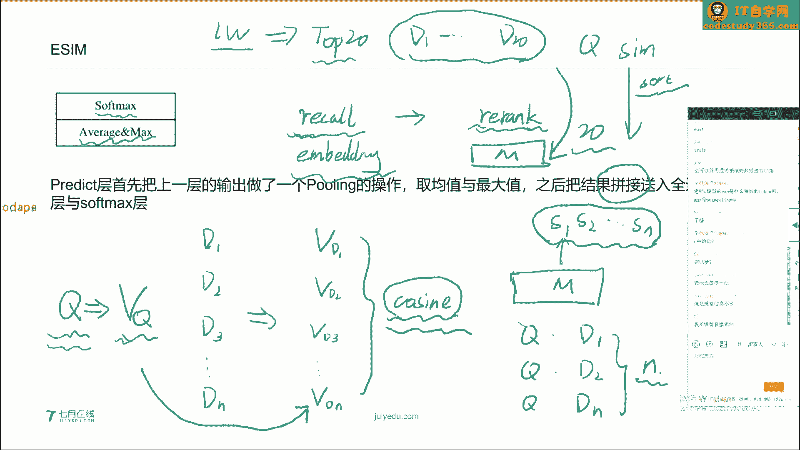

呃代码这一块的话，大家嗯建议大家啊，自己下来一定要动手去写一遍哈，写一遍啊，这边我们，啊我们也重新写一个啊，我们重新写一个，我们先把代码给删了啊，我们再来重新写一个，啊，首先第一步呢。

肯定是要把我们这个PYTORCH给进行导入啊，啊我们在使用PYTORCH这个框架的时候，我们在之前的一个录播课有讲过啊，首先呢我们要使构建一个模型的时候，需要去继承一个类对吧，继承一个类啊。

这个你可以先自己去取个名字啊，这个类的名字你就自己取，我们就叫EC好吧EC好，然后呢他需要继承这样的一个类，继承什么呢，NN导mode对吧，这是我们最关键的啊，最关键的。

然后呢我们需要去实现它的两个方法啊，一个是我们的这个啊构造方法，这是一个是我们的一个构造方法啊，那构造方法是用来干什么的呢，有同学还记得吗，构造方法是用来干嘛的，有同学还记得吗，构造方法是用来干嘛的。

对诶这位同学是新来的吗，好像一直没有看你说话，对构造方法啊，它就是用来初始化咱们的layer的，包括一些参数，初始化layer参数啊，好然后呢我们还需要重写一个方法啊。

叫做咱们的这个for word方法对吧，for的方法，然后是我们的一个输入值，输入值呢我们就按照我们的这个啊，这个和咱们之前的这个分类啊，还不太一样，分类我们刚才说了，他就一条文本。

那对于我们的这个ESIM模型来说，我们是计算的是文本相似度，那就需要两条文本对吧，两条文本啊，那我们就用我们的我们用PQ来表示啊，用我们的P和Q来表示好，OK这是我们的啊for的方法。

forward的方法是做什么的，就是前向传播对吧，选项传播，OK那接下来我们就来看一下啊，我们的这个构造方法需要用到哪些层。

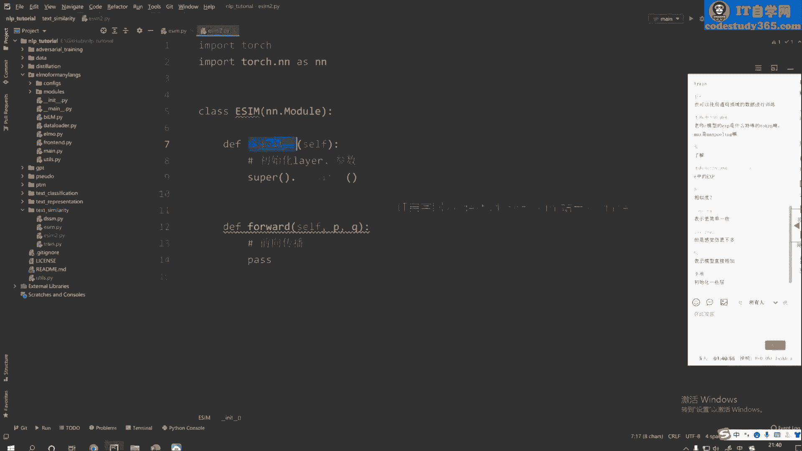

需要用到哪些层，呃，我们来到来到这里哈，我们看一下啊，需要用到哪些层，首先呢这边有一个LSTM层，然后这边是咱们刚刚说的attention，Attention，好像也没有什么额外的权重对吧。

只有一个权重矩阵，所以这里应该是local influence，这一块的话，应该是用不到我们的一些额外的层的，然后这里也是我们的LISTM层，最后呢就是一个啊平均池化层和最大池化层。

还有一个分类层对吧好。

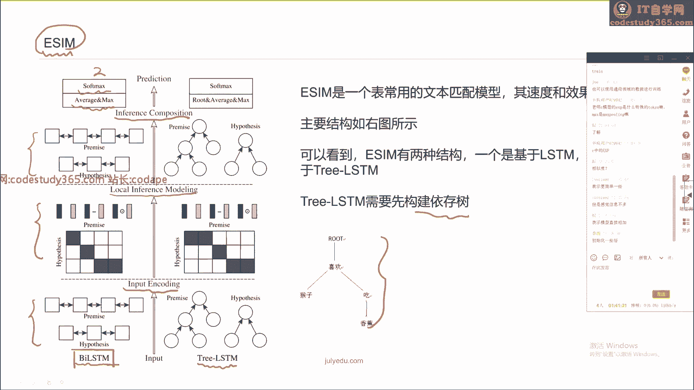

当然啊，最开始这里这个输入啊，还有一个embedding层，embedding层，也就是把我们的这个一个一个的词，转换成对应的一个embedding对吧，好，那我们就首先呢来定义一下。

我们的这个embedding层，embedding层呢它有两个参数啊，第一个参数是我们词典的大小，for capsize啊，你的这个词典的这个大小呢，我们可以从外面传递进来啊，我们从外面传递进来好。

第二个维度呢是这个embedding size，也就是说你的这个embedding层啊要输出到维的，如果你想输出100维的，那你这个参数就填100，好吧好，这是我们的embedding层。

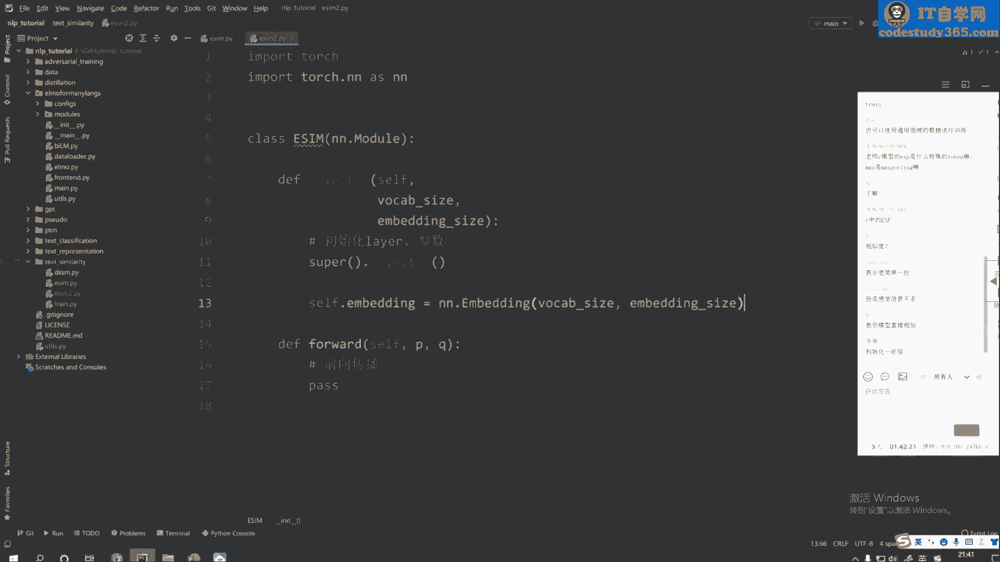

embedding层完了之后呢，我们看一下啊，是这个input encoding这一层是什么。

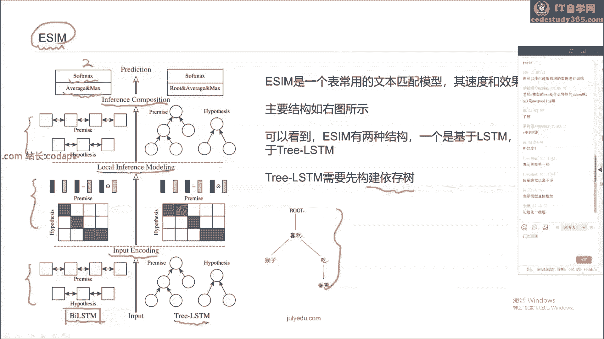

LISTM嘛对吧，ASTM好，那我们就来写一下我们的这个LSTM啊，我们叫做input encoding，Input a input encoding，LSTM好，那LSTM这个模型呢我们来看一下啊。

它有哪些参数，他这边有一些参数介绍啊，我们来看一下input呃，首先哦不是这个啊，应该是这个地方，首先呢有input size，有hidden size，有input size的话。

就是说你输入的这个数据啊，它的一个维度，hidden size的话就是hidden size，应该不用解释了吧，然后number layer的话，就是说你的这个LSTM是多少层的。

然后还有一个参数叫BIOS，也就是说你要不要添加这个偏移项，batch first的话，意思就是说，你要不要把你的bech size放在第一个维度，通常是为了加速啊。

batch size放在第二个维度速度会更快一些，但是我们默认喜欢把bch size放在第一个维度啊，所以待会我们需要把这个参数改成这个true，然后还有一个常用参数呢是这个drop out。

就如果你给这个drop out一个值啊，它就会再做一些DP out，然后这里还有比较重要的参数啊，就是这个啊，By dictionary，如果你填为true的话，它就是一个双向的LISTM好吧。

所以说对于PYTORCH框架来说啊，使用是非常简单的好，第一个为第一个参数是我们的input size，那对应的就是我们的embedding size对吧，上一层输出的维度是多少。

那我们这个input size的维度就是多少，然后呢我们需要给他一个hidden size啊，Hidden size，那这个hidden size我们要从外面传递进来好吧，传递进来好。

然后我们有一个叫做number lay的呃，我们和论文当中保持一致啊，它是一层对吧，它是一层，那我们就写一层，然后呢它是一个双向的，那我们就有也也改，也弄成双向的啊，也弄成双向的。

然后还有刚才说的一个比较重要的参数啊，Bh first，比如说我们的这个把ch size放在第一个维度啊，那我们就把这个参数设置为true好。

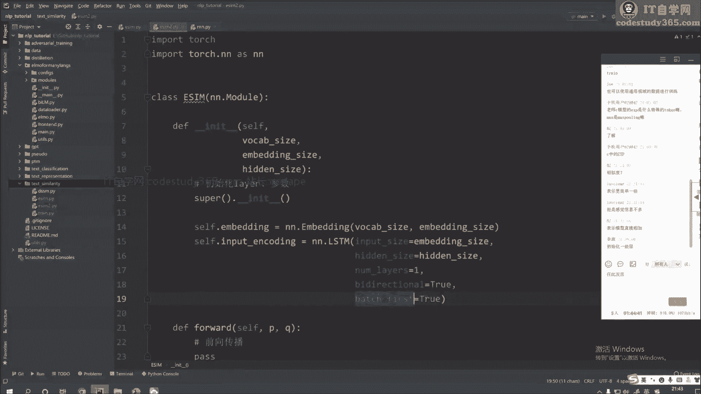

这是我们的这个input encoding层，那这里这个local influence modering层没有权重，那我们就不需要准备啥对吧。

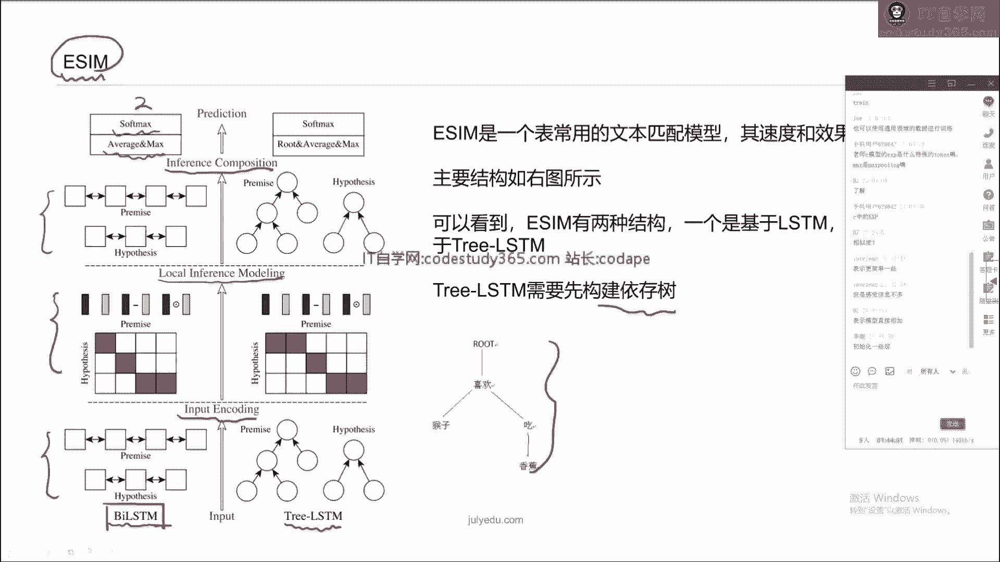

接下来就是这个influence conversation层啊，我们再来定义一下这个啊，Inference，那这里其实是一样的对吧，首先是input size，那就是embedding size。

然后是这里这个hidden size，这个hidden size到底哦不对不对啊，啊我先这么写吧，这里其实有有一个问题啊，我们待会再来说，我们待会再来聊，后面就保持一样啊，我们这里也是true。

然后beside beach first true，好啊，这里我先留一下啊，大家也可以考虑一下，这里这个input size到底应该填什么。

这里这个input size填embedding size对吗，到底应该填什么，这里大家考虑一下好吧，考虑一下好。

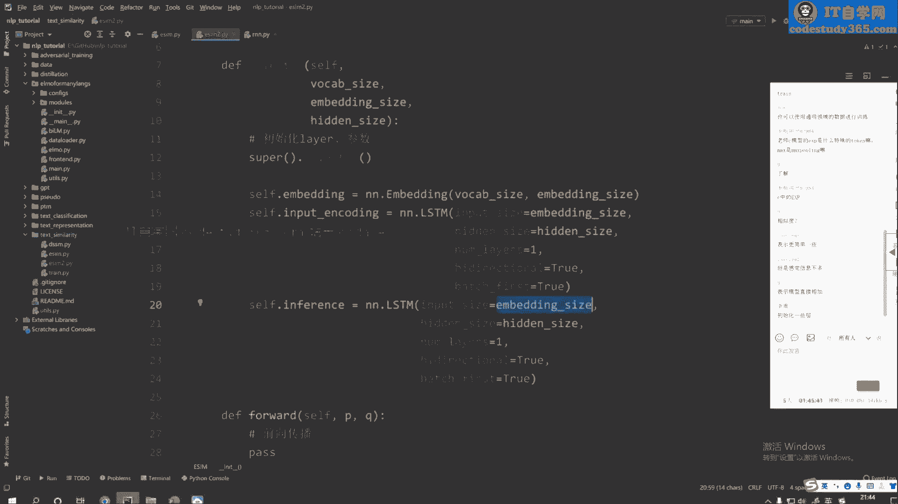

我们先继续往后啊，我们继续往后啊，然后呢，我们是需要平均池化层和最大池化层对吧。

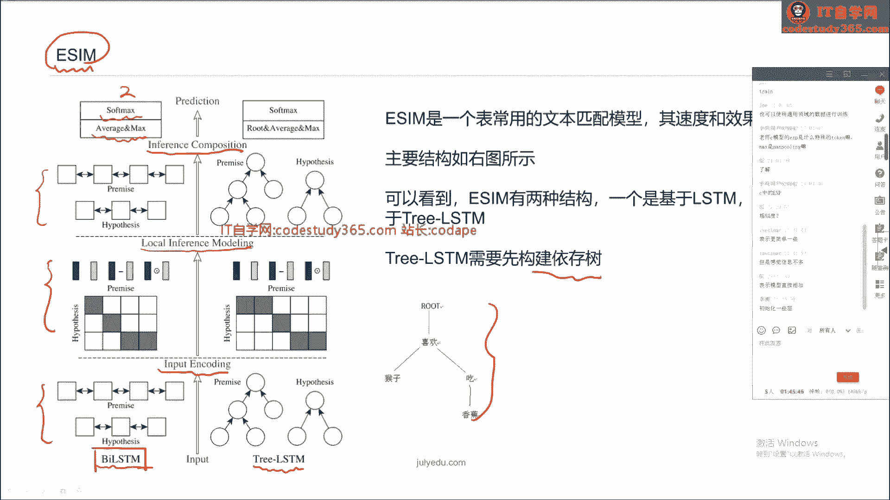

平均池化，这里我们采用两种方式啊，第一种方式呢我们先来搞个最大池化层啊，Max co，好我们定义一个Mac book啊，然后呢它需要有一个序列的最大长度，好我们把它从外面传递进来啊。

那这个参数呢实际上就是它的一个啊kernel啊，他的一个kernel size，Kernel size，这是他的一个kernel size啊，啊这是我们的最大池化层次好。

然后是我们可以定义两个全连接层啊，呃电11吧，诶，LINU好，OK那这里又有一个问题了，我们这个linear的第一个维度到底应该填多少好，我先写一个BESIZE好吧，好我们的输出是BESIZE。

要第二个DDX3A，好最后我们输出两个值啊，我们输出两个值，两个值为什么输出两个值呢，这里因为我们需要用到的是交叉熵损失函数啊，所以我们这里输出两个值，那最后我们再加个drop pop，给个0。

2的叫port率，OK这样的话我们初始化的一些layer啊，就准备好了，准备好了，那接下来我们来看一下我们的这个前向传播，前向传播这个首先第一步啊，啊我们去要得到我们的这个哎。

等一下等一下这里忘记说了啊，我们这里初始化的这些layer有一个点啊，有一个点。

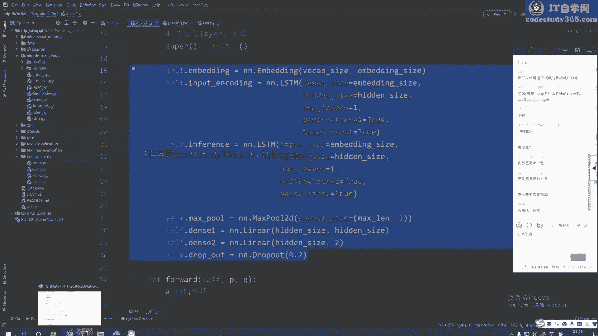

我们实际上只初始了一套对吧。

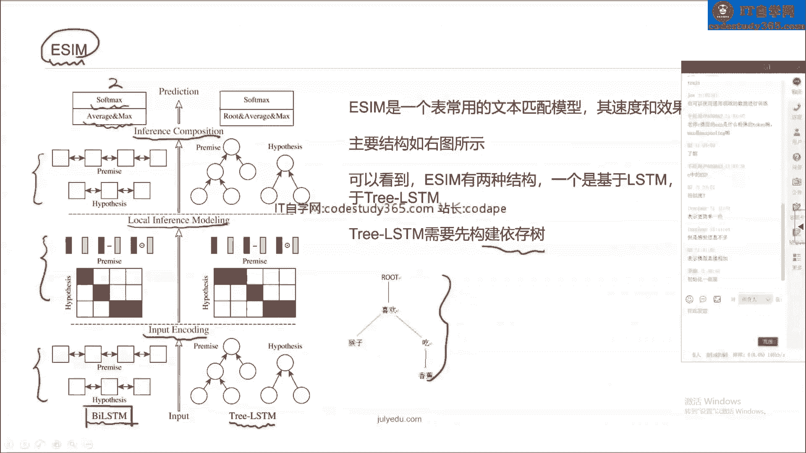

在这个图当中它是有两个LST，但是在我们这里实际上就一个LST。

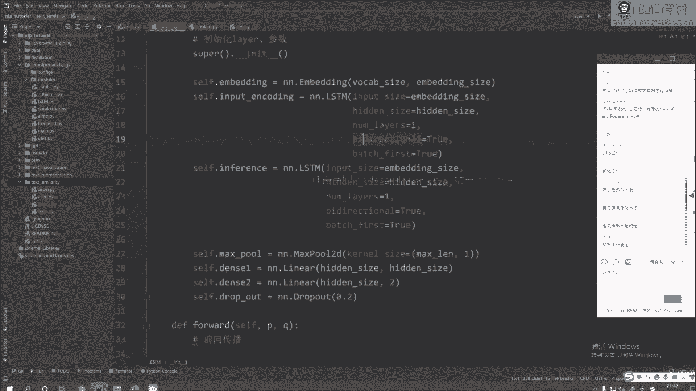

那一个LSTM怎么达到他两个的一个效果呢。

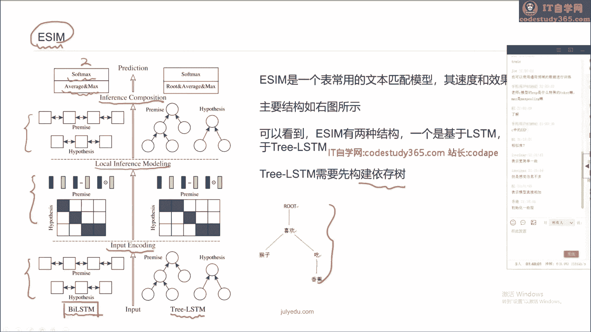

那就是说你调用两次，这样子的话，实际上就等于做了所谓的权重共享好，我们来看一下啊，首先呢我们得到P的embedding，那就self点embedding层把P传递进来。

然后Q的embedding也是一样啊，我们把Q传递进来，这样我们就得到了P和Q，它对应的一个embedding，然后我们去调用我们的LSTM，叫做local inference是吧，还要啥哦。

Input encoding，input encoding好，我们把我们的p embedding放进来，这样的话，我们就可以得到我们的LSTM的一个输出值，但这个输出值好有点讲究，我们来看一下啊。

它的一个输出值包含了两个部分啊，一个是输出值，一个是这边一个元组，这个元组里面放了hidden state和cell state，我们要的是输出值，这两者he hidden set我们是不需要的啊。

不需要的，所以呢我们就可以啊这么写啊，我们可以写叫做啊，哦我们就还是用个embedding表示吧，P embedding，然后下划线就等于等于这个，这样的话，我们就只拿到了我们的LSTM的一个输出值。

hidden state我们就不要了啊，不要了，而对于Q来说也是一样啊，我们还是用这样的一个形式去拿诶，额这里我们换一种形式啊，上面是把它取出来对吧，那这里的话我们换种形式，我们取零零是什么意思。

零的话就是取前面嘛，取前面对吧，所以说两种形式啊，两种形式都可以好，那接下来呢我们去这里做个drop out吧，好吧，我们做个dropout呃，Q100好。

这样的话我们的这个input encoding层啊，就完成了完成了。

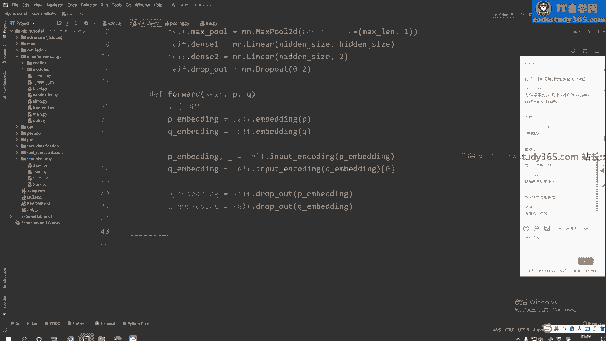

接下来我们来看我们的这个local influence这一层。

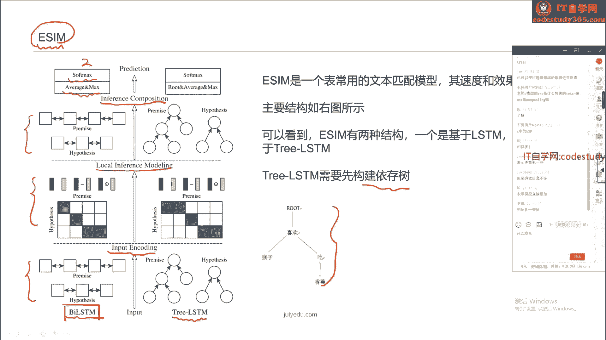

首先第一步还是做我们的什么相乘嘛，对吧，我们要把P和Q进行一个相乘好，我们来乘一下啊，touch点matt ma好，我们把这两个进行相乘啊，首先是我们的这个啊P的embedding。

p embedding好，再和q embedding进行相乘，那和Q的embedding进行相乘的时候，这里就需要做一个transpose啊，Transport，这个transport是什么意思呢。

意思是说啊，我们要对Q的embedding的第一个维度，和第二个维度去做一个转制，为什么要做一个转置呢，好我们来看一下啊，对于P的embedding来说啊，它的维度实际上是啥，它的一个维度是。

Besize，然后序列长度，然后是我们的这个啊hidden size对吧，Hidden size，那对于Q的维度来说，它其实也是这个，那这个张量和这个张量是没有办法去做乘法的。

所以我们需要把这两个维度啊做一个调换，调换之后呢，Q1就变成了Q的embedding的维度啊，就变成了这个样子，变成了这个样子，这样子的话我们就可以进行相乘，因为这个维度等于这个维度嘛对吧。

所以呢我们Q和哦，这里写我们这个P啊，和Q就可以进行一个这个相乘的一个处理了，好吧好。

乘完之后呢，我们呢再来做一个加权的一个处理啊。

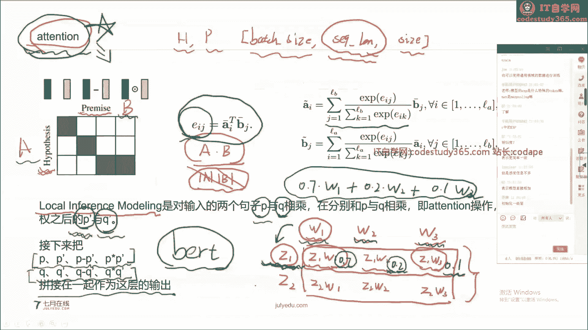

加权的一个处理嗯，好，那我们首先第一步还是需要先对这个一啊，做这个所谓的一个soft max，soft max呢我们需要有一个维度啊，我们对第二个维度进行soft max，然后还是一样啊。

我们还是去做这样的一个矩阵的一个，或者张亮的一个乘法，然后把这个QUEMBEDDING传递进来好，也就是说这个部分是得到我们加权。

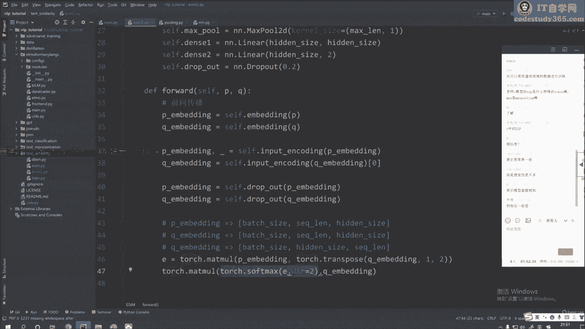

并且规划的一个结果，也就是这里这个0。70。20。1，它的一个权重。

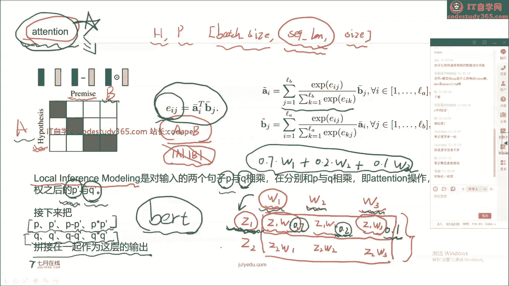

然后有了权重之后呢，再和Q进行一个这个啊加权啊。

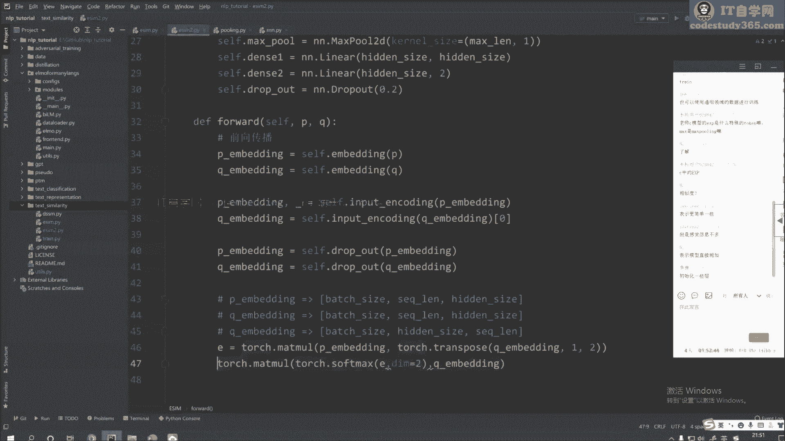

这样的话就可以得到我们的啊p hat，也就是我们这里的这个加权之后的一个结果啊。

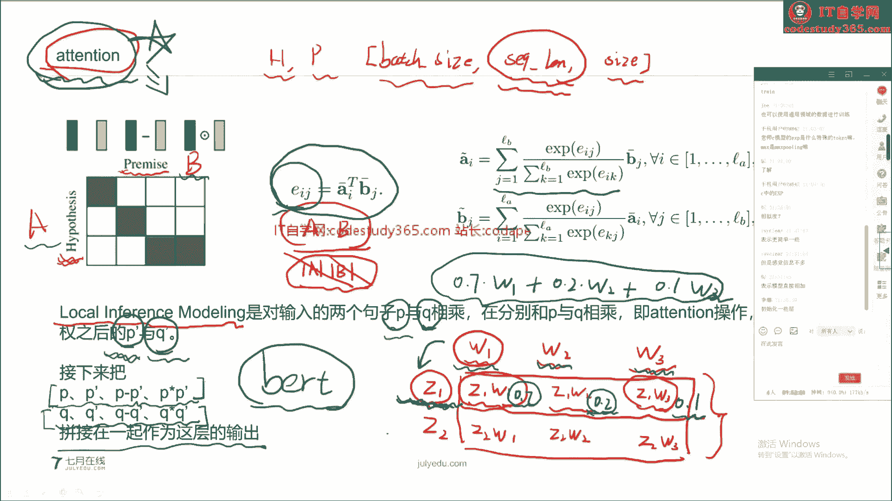

好那对于我们的Q来说也是一样啊，我们去做一个处理啊，这里我们去做这个soft max的时候，这里大家需要注意一下啊，维度要改变一下，改变一下，其次呢我们需要对我们的soft max这个一啊，做一个转置。

因为它的维度不对啊，他没办法和我们接下来的这个啊，p p embedding进行一个矩阵乘法啊，所以我们要把这里这个也做一个转制，还是把第一个维度和第二个维度进行，交换一下啊。

OK这样的话我们就可以得到我们的Q，他加权之后的一个结果啊，P加权之后的一个Q。

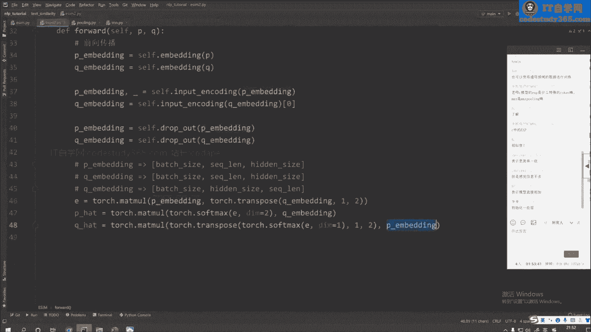

好那我们得到了，就等于是得到了P1撇和Q1撇，接下来是什么，接下来就是拼接嘛，对吧。

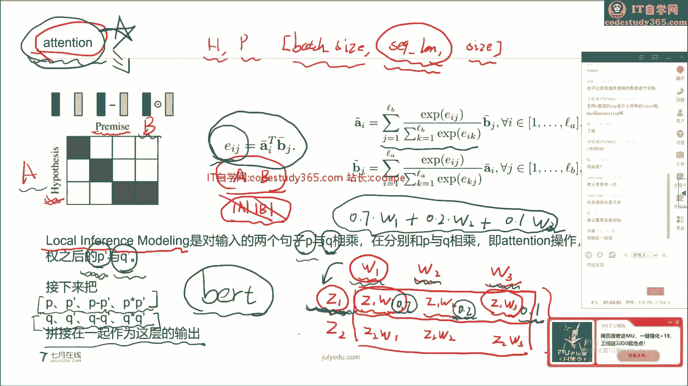

接下来就是拼接好，那我们来把它做一个拼接啊，啊我们的PEEMBEDDING，然后是我们的这个p hat，然后是p embedding，减掉p head，然后，p embedding乘以p hat对吧。

OK那对于Q来说也是一样啊，Q embedding，Khat kill embedding，减掉KHAT然p embedding，乘以我们的pi是吧，OK这样的话我们就全部拼接在了一起啊。

当然这里还需要注意一下啊，我们是要以最后一个维度作为一个拼接对吧，这里大家需要注意一下好拼接完之后呢，下一步是什么，是给到我们的influence嘛对吧，Inference。

OK我们把p cat给进来啊，这里我们直接取取零了啊，这里就是得到我们的P，然后Q也是一样啊，Q然后这里是q cat，OK这里我们稍微停一停啊，稍微停一停，刚才我们说这里这个influence。

这里这个东西是有问题的对吧，因为这个input size我们不知道是多少，那这个input size到底是多少呢，好我们来看一下这个input size应该是多少。

首先我们输入的是in vocalf size，然后得到embedding size，Embedding size，经过我们的LSTM，因为它是一个双向的，所以这里的LSTM的一个输出值。

也就是说这个地方它的一个输出值，它的一个维度啊，已经变成了embedding size，乘以二对吧，已经变成了乘以二，哦这里写错了啊，这里写错了，好检查一下啊，QQQQ好，写错了啊，这个地方好。

这边已经乘以二了对吧，乘完了二之后呢，我们这边呢又去做了什么，做了四次的一个拼接，所以这个时候啊就又变成了embedding乘以二，再乘以什么，再乘以四，因为一共有四个嘛。

所以啊这里这个influence层啊，他的这个维度就应该是hidden，hidden size乘以什么乘以88，好我们继续往下啊，我们的这个啊influence层完了之后是啥，这是我们的预测层了啊。

预测层了，好那我们首先拿一下这个啊p max啊，我们就掉下我们的最大池化层，把我们的这个P啊给传递进来，然后呢我们需要把中间的这个维度给去了啊，那对于Q来说也是一样啊，好，这样的话。

我们就可以得到我们最大池化层的一个结果，然后呢我们再去做一下平均池化层，平均池化层的话好，我们可以直接用touch打min啊，直接用touch打min，然后把我们的P传递进来，还是一样啊。

我们这边啊这边需要注意一下啊，这里是要根据我们的这个中间这个维度去取平，均好吧，这里大家不要弄错了，也就是这个序列长度的那个维度啊，好，这样的话我们就得到了最大池化层的结构，和平均池化层的一个结果。

最后我们再做一个事情啊。

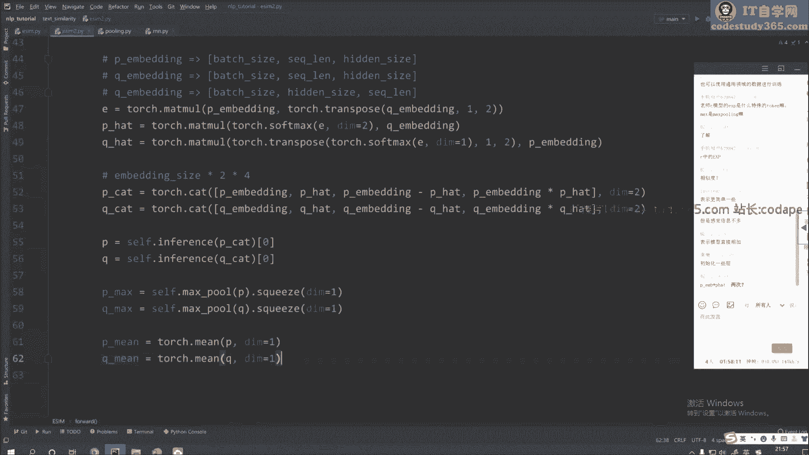

把它做一个什么，做一个拼接，也就是这里说的。

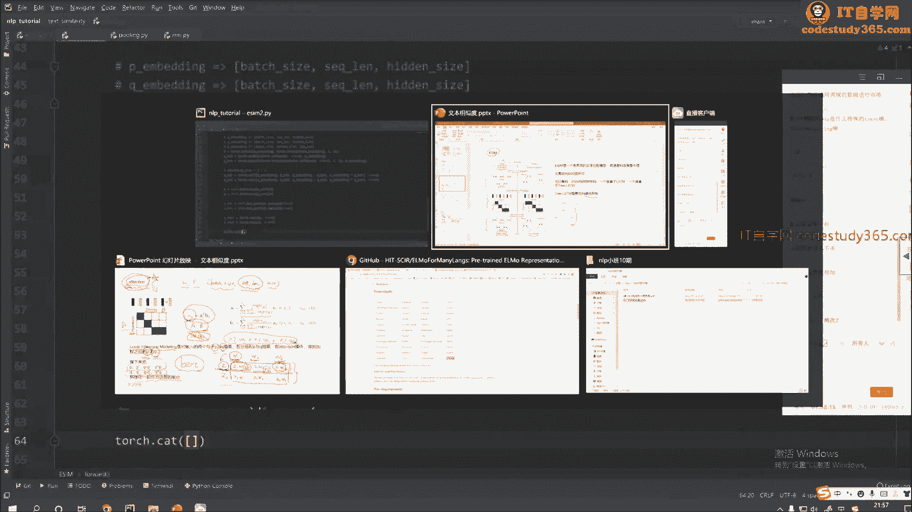

我们要把结果做个拼接，对吧好。

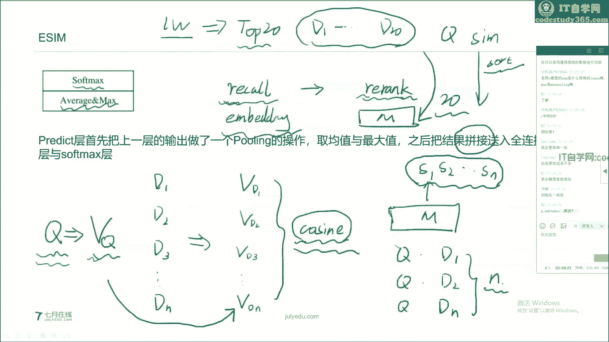

那我们把结果拼接一下，P max，Q max，还有PMQM，好最后我们再调用一下这个dropout，好这里我们需要有一个输出值，啊啊我们用out，OK最后的话再给到我们的这个啊分类层啊。

分类层先给到dance1好out，然后我们可以加一个这个激活函数，激活函数啊，我们加个tench激活函数，好我们再经过一下我们的这个drop pot吧，我们最后再经过我们的这个啊DX啊。

然后把结果进行返回，OK整个模型啊我们就写完了，然后这里这个dance以及大家需要注意一下啊，我们这里是不是就应该也是hidden size，1en size再乘以多少呢。

因为这里也是一个四部分进行一个拼接对吧，然后刚包括刚才这里是一个双向的，所以啊我们这里应该也是乘以八，好这就是我们整个ESIM模型的一个结构了啊，结构接下来呢我们来跑一下啊。

我们在我们的train方法里啊，train方法呢和我们之前的那个分类是一样的啊，分类是一样的，然后我们这边嗯改一下啊，我们从我们刚才写的这个里面进来，It seem to，然后我们看一下啊。

work help size是不是一样的，Embedding size，Hidden size，max ell啊，都是一样的，好，OK我们把模型跑一下哈，啊我这里先取1000条数据好吧，我们速度快一点。

不然比较耗时啊，数据量大的话比较耗时，我们来看一下会不会报错啊，诶好像是报错了啊，啊这里必须是用一个long的类型啊，那我们在进行FORWORD的时候啊，我们可以把它转换成一个浪的一个形式。

然后下面也是一样啊，我们做验证的时候也是一样，那训练代码呢和我们之前讲的，TAXN的一个训练代码是一样的啊，我们就啊不再重复说了啊，简单看一眼啊，简单看一眼，这边呢去加载数据对吧，加载数据也不说了啊。

然后这边是我们的初始化我们的一个模型啊，初始化我们的模型，然后放到我们的GPU上，然后优化器定义我们的cross entrop损失函数，然后这边是循环五个epoch。

然后以batch size的形式去取数据对吧，前向传播要计算loss梯度归一，反向传播更新权重好，这些都是我们之前说过的了啊，之前说过的呃，正常是跑起来了啊，因为我这里就取了1000条数据。

就取了1000条数据啊，没有全部跑，所以效果可能不太好，大家到时候就下来自己去跑这个好吧，我们先简单看一下第一个epoch呢，我们的训练集的准确率是57，验证集是49，然后变成了59的64。

然后65的53诶，这个法案效果是降低了一点点对吧，不过这个大家可以把这行代码啊，把这个改了，让它去跑一个全量的一个数据啊，全量的一个数据，整体来看模型是持续在收敛的啊，持续在收敛的，没有什么问题。

没有什么问题，验证集的效果也是在持续提升的啊，好那整体来看代码应该是没什么问题啊，没什么问题，那细节的话啊，各位同学就自己下来看了好吧，但整体和我们上节课那个录播课里的TXCNN啊。

他的这个流程是一样的一样的，关键还是在于模型的一个结构好吧，模型结构一点是，这里的双向LSTM需要额去乘以二，维度要乘以二，其次呢我们这里做了一个拼接对吧，有四次的拼接，所以呢二还要乘以四。

所以我们第二个AISTM它的一个输入值啊，就是hidden size乘以八，这里是非常重要的一个点啊，大家需要注意一下，包括这里的这个linear层也是一样的啊，因为我们这里也是做了这样的一个拼接对吧。

也是做了这样的一个拼接，所以这里也是要乘以8×8好，这就是我们整个ESIM这个模型啊，整个ECM的一个模型，那训练细节的话，大家就自己下来去看代码了好吧，这种重复的代码我们就不带着大家去看了。

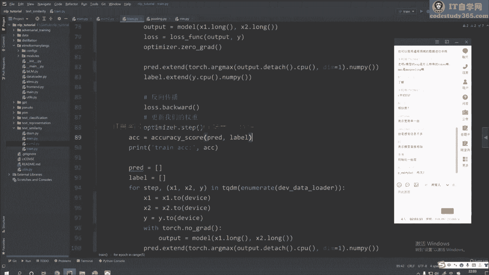

OK那咱们今天的一个课程内容啊，基本上就给大家讲到这里了好吧，什么时候需要drop out啊，drop out的又作用呢是用来防止模型过拟合的。

基本上呢你经过了一层全连接层，或者说经过了一层这样的一个AISTM层，你就可以去添加上这样的一个draw out，好吧，我们可以看一下啊，啊我们这里embedding，然后LSTMASTM经过之后呢。

我做了个drop out，然后这里因为没有权重嘛对吧，没有权重，attention层是没有权重的啊，所以我没有做drop out，然后啊腾讯之后做了拼接，又给到了我们的这个啊LSTM层。

然后做了石化和这个这个啊啊，平均池化层和最大池化层，那这两个地方也是没有权重的，对吧，然后我是拼接完之后又做了一个drop out，好经过这第二个这第一个全连接层之后呢，我又做了一个drop po。

所以你经过了有权重的层之后，你就可以考虑去做一下drop out，好吧，这位同学。

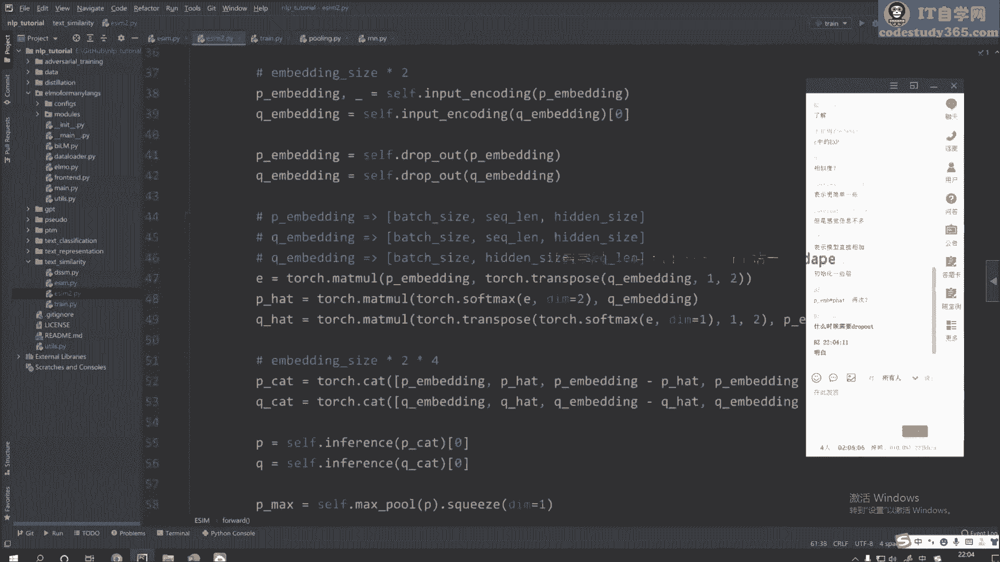

OK行，其他同学还有问题吗，如果没有什么问题的话，咱们今天的一个课程内容啊，基本上就给大家讲到这里了，好吧啊。

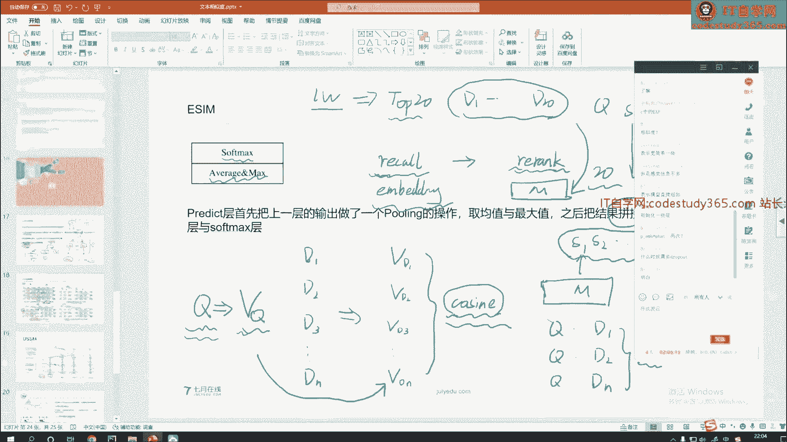

今天内容还是挺多的啊，总之大家下来要多花点时间去复习一下啊，包括这个表示学习和这里的这样的一个，匹配式的一个模型啊。

最重要的点在这里啊，在这个attention这一块，这个是非常重要的好吧，OK如果没有什么问题，那咱们今天的一个啊课程内容，咱们就到这边了好吧，各位同学下来就好好复习，然后下来之后呢。

自己要把这个ESIM这个模型做一个复现，然后URBO那一块要学会如何去使用好吧，OK那咱们今天的课程内容就到这边，大家有什么疑问的话。

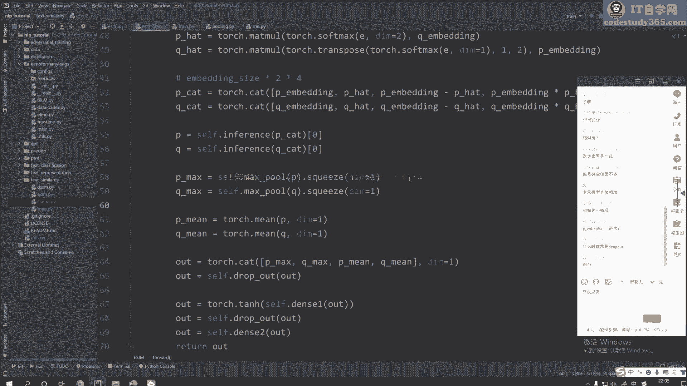

就在群里和我再沟通就OK了啊。

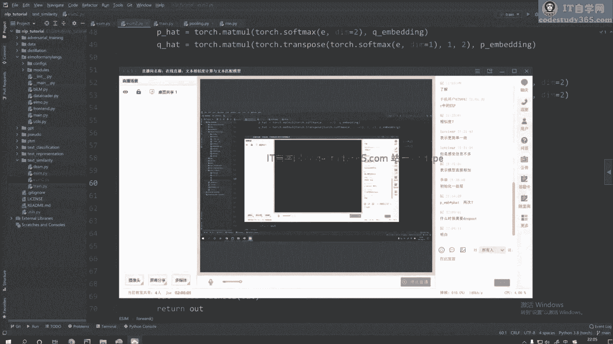

