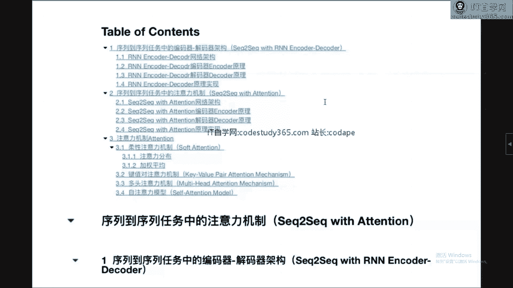

# 【七月在线】NLP高端就业训练营10期 - P5：1.基于Attention机制的Seq2Seq任务_ev - IT自学网100 - BV1uxT5eEEr6

OK那我们准备开始啊，这个给大家聊一下，关于序列到序列任务当中的注意力机制呃，关于这部分内容呢，我先简单的说明一下，为什么要选择这么一个题目，首先呢我们先看一下关于注意力机制啊。

这个对深度学习可能有所了解的同学啊，大家应该清楚啊，所谓的深度学习取得很好成绩的，一个很重要原因，就在于所谓的端到端的一个表征，学习的能力很强啊，简单点说，就是以前由人工所完成的一些特征提取的工作。

现在我们可以通过构建深层的网络，把特征通过自动化的方式提取出来，然后再进行所谓的分类也好，回归也好等等的各种各样的工作任务，所以就是说，深度学习最核心的，其实就体现在对特征的提取上。

那么过提到特征提取呢，就不得不讨论另外两个，关于特征提取的方法或者框架，一个呢就是所谓的CNN网络啊，以CN网络为代表性的所谓的空间特区，空间特征提取的这种框架对吧，我们的图片或者图像啊。

方向取得了非常好的一些成绩，人脸识别现在已经是非常非常成熟的一个工作，包括目标检测，包括啊像这种啊生成对抗的网络的这种工作，都是非常好的工作，那么其实大家可以看到其基础性的功能。

其实就在于对图片这种空间特征的提取的能力，越来越强，这是关于这个空间特征的提取，那么另外一个非常重要的框架呢，就是所谓的呃循环神经网络啊，以循环神经网络为代表的，在时间序列上的特征提取对吧。

我们有了一个呃序列，然后呢在序列维度上我们可以通过呃RN网络，然后通过LSTM提取它的空间，这个时序特征啊，时间上的序列特征，那么通过这两方面的不断的突破啊，我们又取得了很多很很好的一些工作。

那么这和注意力机制又有什么关系呢，那么从现在啊，2019年年底这个视角上去看的话，可以这么说，注意力机制呃，今后一定会成为啊，不能说比像CNRN这么啊还要优秀的一个工作。

但至少啊这三者作为特征提取的框架，至少这三者是比肩的一个一个一个一个位置，因为今后啊因今后大家在深度学习方向上，在提到特征提取的时候啊，空间特征的CN实际特征的RN呃，可能越来越多的模型啊。

可能就会使用到所谓的注意力机制，来提取各种各样的特征，其实如果对NLP方向相对了解一些的同学，可能就会注意到啊，以BT模型为主的啊对吧，各种各样的这种嗯预训练模型，也取得了非常好的工作。

那么其实往往核心的内容上去看的话，你会发现transformer的核心，其实就是所谓的注意力机制，就是后面我们会讲到的自注意力机制对吧，所以从这个角度上去看啊，所以今后啊注意力机制一定会成为啊。

很多工作的基础性工作，所以在这方面上花上一部分的精力去学习，和了解，对今后的发展是很有帮助的，这是关于注意力机制的选择，那么再往前看呢，我们还可以看到，叫做序列到序列任务当中的注意力机制。

为什么不是直接就讲注意力对吧，不是直接讲attention，而是讲序列到序列任务当中的注意力呢，其实这就牵扯到另外一个原因，就是一项技术的发展啊和突破啊，甚至是突破，他一定不是从石头缝里蹦出来的对吧。

他一定不是凭空想出来的，作者肯定也不是凭空琢磨琢磨，哎，睡个觉啊，就把这个事解决了，肯定不是这样，那是什么样的，那一定是在特定的应用场景，或者一定是在特定的呃之前的工作的基础上。

至于之前之前工作的一些不足，缺陷和问题进行了补充改进或者是优化，提出了新的方法，那么它一定是有一个发展的脉络和这个规律的，可循的啊，一定是一条线对吧，哎除了模型AA呢有问题。

针对A的问题进行了改进和调优，得到了模型B然后在B呢肯定还会有问题，然后才是C这是技术发展本身的规律嘛，一定是有一个阶段性的，或者有一定是有一个基础性工作的，那么注意力机制就是在序列到序列。

这种任务当中啊，针对之前传统方法或者之前方法当中的不足，或者缺陷提出了改进，引出了所谓的attention机制，当然在此基础上也进行了高度的抽象和泛化啊，以适应不同的应用场景。

所以呢今天就起到这么个题目，叫做序列到序列任务当中的注意力机制，一方面核心还是希望能够给大家介绍一下，Tension，另外一方面呢也是希望借助这个分析的过程，能够把脉络梳理清楚。

像在我们呃实训营或者就业班的课程当中，我们一定一直在和同学们强调这么一个概念啊，就是学习不能一眉毛胡子一抓一把抓对吧，他一定是一个发展的脉络啊，有了A才有B有了B才有C啊，B的问题是什么。

C的改进在哪里啊，你只有了解了这过程以后呢，你把视角放放长远一些，你会发现哦所有的模型的发展啊，原来是这么一个逻辑，那你说这东西有什么用啊，那这东西不当吃不当喝是吧，当你占到了一定的前沿位置的时候。

你就可以有针对性的，或者你就可以很很自然的去考虑到，它发展的一个方向到底在哪啊，如果你对之前的发展没有了解的话，对未来一定是毫无所知的对吧，所以说啊一定是要梳理成，我们会梳理成很多的这种呃脉络。

克脉络的发展方向啊，沿着不同的脉络啊，就像研究生我们在做选题的时候，说，开题的时候，老板肯定啊，导师肯定会问很多的一些问题吧，你为什么选这个原因是在哪，然后未来的研究方向是什么。

这个时候你站在了某一个脉络当中的节点上啊，你就会很清晰的知道你现在在哪儿，你要去哪，你所面临的问题是什么，别人解决的方案是什么，你提出的优越性在哪会一清二楚，对今后的发展也是非常有帮助的啊。

关于题目哈有这么一个引入，那么我们看一下内容啊，我们看一下内容，今天的内容呢其实相对比较多哈，这个鉴于时间原因可能有针对性的侧重吧，就给大家这个介绍，那么三方面，第一个方面呢叫做序列到序列任务当中的。

编码器，解码器架构，第二个呢是就是所谓的序列到序列任务当中的，注意力机制，第三个呢就是注意力机制本身，这个呢其实也是有原因的，就是呃decoder decoder架构，编码器。

解解码器架构本身是可以解决一系列的问题，其中在sequence to sequence，就是序列到序列任务当中呢，起到了一定的这个作用，但是啊就从传统的这种encoder，decoder架构本身呢。

其实还是有一个问题的，就像刚才我们所说的，你对已有工作哎进行了一个分析啊，发现它是有问题的，或者有有可改进的，那么就针对这一点可改进的地方，就可以很自然地引出了所谓的注意力机制啊，后面我们就是第二部分。

那么有了在序列到序列，任务当中的注意力机制以后呢，我们可以做一个更高层的抽象，我们把可以从一个特定任务当中解放出来对吧，数学或者说是呃就这么一个优点是吧，我们不断的在做抽象。

把一些更普世的规律能够把握住啊，为什么要这样做呢，其实还有第四部分啊，就是你抽象出来的这个注意力机制，那么怎么样再结合着其他的任务进行使用，那就是应用的部分，这也符合我们呃，不管是科学也好，技术也好。

本身的发展规律对吧，从我们一个实验实践性的应用开始啊，发现它的问题，然后抽象出一个逻辑和抽象出一个理论，然后用这套逻辑和理论来指导新的应用，那么在新的应用过程当中又发现有问题。

那么再改再抽象再改进嘛对吧，这也是符合我们事物发展一般规律的，那么从以上三点啊，那么第一点我们就把聚焦在第一部分，就是关于序列到序列任务当中的编码器，解码器架构，我们看一下之前的工作是怎么做的。

然后呢自然而然你就会体会到这个工作的意义，以及它可能存在的问题啊，这是我们第一部分的原因好了，那么include decoder的架构呢，其实我们第一部分就是所谓的网络架构，网络架构啊。

在这个地方再多说一点啊，在学习过程当中啊，我一直给同学们说，就是学习呢是有套路的，就是你你可能有些同学这个花了很多的精力，时间效果不理想，为什么就是你没有达到一个统一，什么叫统一呢，我一直在强调啊。

就是学习一个新的网络模型，或者新的工作的时候，你一定从三个方面，或者多个方面去对它进行考察，比如说我们在当前的这个encoder decoder架构，哪三个方面，第一个是图啊，读论文。

读paper的时候，我们也可以看到大量的图示，这些网络架构图，对一去理解这个工作本身的含义，是非常有价值的，因为图示嘛非常的直观对吧，你通过图示的理解，能够大体的去了解到他工作的一个逻辑，是什么样的啊。

这是图示本身的含义，那么第二个方面呢就是关于公式部分啊，关于公式，一会我们再讨论细节啊，公式，那么公式呢，这种数学上的表述是无二一性的是吧，它在形式化的图的基础上，这样的话呢。

他两个之间分别起到了哎不同的作用，图很直观啊，一清二楚，可以说你看起来就非常的啊清爽是吧，图示本身就是这么起到这么一个作用，但是很多的细节在图示上你是看不清楚的啊，或者说你在图示上表示不出来。

那这个时候结合着公式部分啊，把这两个部分进行一个对应映射啊，通过数学公式，你能够在更细节的啊，甚至比如说我们用标量表示是吧，用标量表示的时候，甚至每一个符号，每一个运算过程。

其实我都是可以在数学公式上看得到的啊，这两者之间就起到了一个相辅相成的工作啊，图示更直观，但是没有细节，数学公式展示了所有的细节，但是很显然嗯，大家天然的，好像对数学公式本身。

有一个有一个消化的过程是吧，他俩之间要需要结合起来，但是这把还没完，因为最终我们的目的不是为了画图，也不是为了写公式，最终的目的是为了能够解决一些实际问题，能够使我们的呃程序能够run起来。

所以第三部分一定是什么，一定是代码部分啊，一定是代码，就是说这三个啊，这三个维度啊讲的其实是一回事对吧，比如说你当前的我们encoder，decoder这个架构为例啊，它就是这么一种模型架构。

那么从图上是怎么展示的，从数学公式上是怎么展示的，从代码上是怎么展示的啊，这三者啊一定要统一起来，你才会发现OK啊，也就是说其实最后做评估的时候，你会发现啊，图看懂了公式，明白了，代码忘起来了。

那这个事我觉得就可以告一段落了，我们可以继续往下走对吧，你是你不能上来就就就划水，不行啊，千万不能划水，因为我看到太多的同学好像啊面试的时候也好，还是交流的时候也好，好像懂一点。

但是你往细节上一问就卡壳了，为什么，因为都是很多的信息都是从图上得到的，一到了细节上你全蒙了，为什么你公式上不理解啊，那这个时候我怎么预期你的代码能写，对啊对吧，特别是现在很多的工具啊。

TENSORFLOW啊，PYTORCH这种东西很难说，你你到了一个到了一个抽象程度，这么高的一个过程，你你今后面临新的问题，你怎么去做啊，这也是一个问题，OK多说这么些啊，我们就以啊图先看一下啊。

你图看一下，其实你会发现encode以后这架构非常简单，就是一就是两个就是两个循环，你看就是两个RN嘛，循环循环网络是吧，你会发现从左往右一个从右往左，无非就是两个循环神经网络，但是不同的地方在哪里。

我们看一下在编码器阶段啊，encoder阶段我们的输入是X1XT，很显然我们知道T是时间不是吧，第T个时间维度上从一到大T啊，每一个时刻都有相应的输入进来，输入进来呢很显然这一部分是隐藏层是吧。

隐藏每一个隐藏的都向前，对向下一个时间部进行一个输出啊，换句话说，每一个隐藏层，它既啊在当前时刻接收当前时刻的输入，还接收上一个时刻的隐藏的一个输入对吧，这是标准的RN网络，关键就在于所谓的编码。

到底把这些输入信息编码成了谁，编码到了哪儿，图上，其实很显然就在最后一个时刻T的时候，我把前面所有的输入信息X一一直到X大T，所有的信息都编码到了C这个状态当中了，记住在最后一个时刻。

把前面所有的状态信息都编码到了，最后一个状态上，C那么有了C这个编码信息以后，它理论上来说，好像应该包含了从X1到X1的所有信息，然后有了这个编码信息以后，在decoder阶段啊。

在decoder解码阶段，就把编码之后的这个C信息作为我sequence to，Sequence，能序列到序列任务当中，的一个非常重要的输入内容，因为你输入的是X我都编到C当中了，再进行向外输出的时候。

那C的价值就在整个过程当中体现出来了，每一个隐藏层状态，这个地方我们可以看到每一个隐藏层状态，在进行向外预测的时候，比如说Y2向外预测的时候，其实你会发现它要输入很多信息。

比如说在decoder架构当中的，上一个时刻的隐藏层状态对吧，这是很显然需要输入的上一个时刻所对应的，实际输出Y以及我们所谓的输入信息，所编码的向量，C都作为当前这个时刻的输入信息。

然后才对当前时刻进行一个预测输出Y，那大家其实可以看到，这个预测输出应该是相对比较靠谱了的，为什么，因为他的输出，不光是依赖于上一个时刻的隐藏状态对吧，不光是依赖于你上一个时刻的，上一个时刻的输出。

还包括我前面所有时刻的所谓的编码信息，那这样的话，我对当前时刻的预测应该是相对比较靠谱的，当然同样你可以看到啊，每一个时刻的输预测输出的时候，都是上一个时刻的输出，以及上一个时刻的隐藏状态。

以及所谓的编码信息，C都在整个的过程当中起到了作用啊，这就是在呃论文当中，encoder decoder所设计的一个网络架构啊，这是图示上所表示出来的一个所有信息。

其实大家可以看到最核心的一点就在这个地方，就是我们在所有的时间簿上，把所有的时间部信息，是所有时间布上的输入信息，都编码到了C当中去了啊，用C在整个的预测过程当中，起到一个非常重要的输入信息的内容啊。

这是图，那么公式其实啊我们可以看到啊，我们可以看到，首先我们知道RN网络，我预期大家可能对比如说像RN这种网络，其实应该有一个了解对吧，在一开始的隐藏的状态，我们用零进行初始化，这个也很自然。

那么再往下你会发现在DTT这个时刻当中的，每一个隐藏层状态的神经元的输出啊，它其实是由两部分组成的，其实在这个地方，Z起到了一个所谓的开关的一个作用，它起到了要在上一个时刻的H。

以及上一个时刻的所谓的two的H当中，进行一个选择的一个工作啊，就像一个开关一样，我到底是选择让上一个时刻的H出去，还是上一个时刻，还是当前时刻的HT的出出去啊，作为一个选择。

然后呢重要的是在我们的计算HT的当中，你会发现在整个的计算过程当中啊，我们就是一个完整的这个呃，呃这个呃循环神经网络是吧，然后我们继续往下看下图啊，看下图我们可以看到其实刚才所说的啊。

那个Z其实就起到了一个开关性的作用啊，我在H啊，上一个时刻的H，还是在当前时刻的h two的之间做一个选择，其中还有一个R啊来作为所作所谓的重置门啊，其实一个标准的JRRU网络啊。

就是我我当前时刻的HT的，需要在H当中保留多少信息，通过R重置门来进行一个标准，所以你会发现整个的就是一个完整的一个，ERN网络，其实最重要的在后面我们可以看一下，在最后一个时间步N上啊。

在最后一个时间步N上，我把所有的信息都编码的编码到了向量C当中，大家可以看到啊，就是原文本最后的第N个时刻，编码器的隐藏状态，计算完成原文本的定长向量表示为C，就是我不管你前面到底有多少步。

因为你说有多少信息，我把所有的信息都表成了表征为这个C向量，然后呢这是encoder过程，那么看一下decoder啊，在decoder过程当中，一开始在解码器状态的T0时刻，我把这个C进行一个解码啊。

把它输出到H1撇二零当中啊，第零个时刻的解码器的隐藏层状态，那这样的话哎这个信息就被保存下来啊，进行使用，那么再往下下面的第T个时刻的过程当中，我们还是其实网络结构是一样的啊。

其实就是一个标准的GRU网络，只不过在整个的网络过程当中的计算每一个呃，这个隐藏层状态的时候，你会发现它都使用到了，刚才所说的那个定长向量C啊，就是我们上一个decode。

encoder过程当中的那个编码信息，C保存了所有输入信息的那个状态对吧，那你会发现哎这个地方也使用到了C，这个地方也使用到了C，每一个应，每一个状态其实都和我们上一个啊。

encoder过程当中的那个所有的信息相关，有了这个以后，我们其实还是进行一个循环网络对吧，最后再进行一个预测输出啊，对我们所有的啊，比如说我们这是sequence to sequence啊。

每一个符号的一个输出进行一个概率计算，那么这个概率最大的那个，当然就作为那个符号的输出就可以了啊，细节部分，有兴趣的同学可以课下的时候再看一遍，其实就是个soft max，一个一个多分类而已对吧。

然后呢我们看下代码啊，看下代码部分，代码部分呢这个呃呃单词啊，这个呃字典，然后语料库这个就不多介绍了啊，这个也也很简单，大家会看一下就可以了，我们中间看encoder和decoder两个架构啊。

凝固的过程当中其实没什么问题啊，其实就是个标准的RN网络啊，这是这个没用可解释的呃，看下decoder关键核心在这个地方，你会发现decoder呢其实也没什么太大问题啊，也其实也是一个标准的RN网络。

但是核心就在这个地方，就像刚才我们所说的啊，核心就像我们所说的，我们在使用decoder这个RN的时候，它的初始状态不是啊不是随机设置的，也不是零值设置的，而是使用到了encoder states。

就是encoder的那个状态，我们看一下这个encoder这个st在哪，在这就是我们encoder的输出嘛，对吧，encoder整个结构的一个输出，也说就像刚才我们在代码，我在数学公式上可以看到的。

我把encoder过过程当中，所有的输入信息都进行了一个编码，编码到了最后一步的隐藏层状态上，那么在decoder阶段，我用一这个编码的所有信息的状态，进行一个对网络的一个encode。

decoder网络的一个初始化，那这样我认为唉，我所有的信息都已经保存到了啊，所有的输入信息都已经在抵扣的过程当中，进行了一个使用啊，这其实就是核心代码就这么一步，剩下的就是整个的一个训练过程。

这个没有什么太大可解释的是吧，这是关于代码部分啊，关于代码包部分好了，刚才那就关于这个呃，encoder decoder做了一个介绍，那么回过头来啊，回过头来看一下，我们分析一下这个问题在哪啊。

其实通过刚才的介绍，其实我觉得大家能够有意识的就发现唉，问题有哪儿有问题啊，就在这个地方，为什么在这个地方呢，我们看一下这个C样是怎么来描述的，RNE或者decoder神经网络架构呢。

使用循环神经网络进行学习，就是刚才我们所说的，它是将变长的原序列X，就像刚我们所说的X1直到XT，其实这个XT是不定的对吧，就像我们比如说做一个自然语言里面，比如我们一个翻译对吧，我们把中文翻译成英文。

因为我们知道每一个语言，他们的这种表达能力其实是不太一样的，所以你是同样输入一个语义上一样的一个句子，可能中文短，英文可能长，当然也可能有相反的方向，所以这个时候他是个不定场的输入。

那么这个时候呢在include decode架构当中，我就是将这个不定长的原始信息，X编码成为一个定长的向量表示C，特别是在最后一步上啊，其实不光是定查，而且是我只是在最后一步放上有输出，这也很好理解。

就是我要保证在所有的输入都完成以后，将所有的啊，理论上来说是把所有的信息都编码到了，这个定长表示C当中，然后啊将这个定方表示C呢，解码成我们的变长的序列Y，这是刚才我们所说的核核心问题就在这个地方。

你这个定长表示的向量C嗯，有没有这种语义上的存储能力，能够把所有的输入信息，这个变长的输入信息，所有的语义信息都进行一个编码，这个编码的效率和，是怎么样的对吧，效率是怎么样的，这个程度是怎么样的。

都是有大大的一个问号，那这就是问题吗，好了那基于这个问题，那么大家想一下有什么可改进的思路吗，就是说问题现在已经提出来了，就是关于变长的信息的定长表示，很显然是有信息丢失的对吧，那怎么办。

那我们无非一个很朴素的想法，就是我无非就是把这个定长表示，改成不定长就可以了啊，那其实就是等于每一个都有输出了，那这又牵扯到另外一个问题啊，牵扯到另外一个问题就不经济了，就是效率上可能就是。

另外你你虽然说那还不如直接把X1到XT，直接输入到decoder架构当中去了，是吧，嗯这就不经济，那怎么办，那那我们是不是可以这样想，就是我最后的这次信息的这个学习，一定是和前面的所有的信息都是相关的。

这是肯定的啊，只不过这个定长表示呢不太嗯嗯容量太小对吧，信息表达能力容量太小，那怎么办，我是不是可以再进行这个特征选择的时候，我都在前面的若干个隐藏层状态当中，都进行特这个呃学习，只不过呢有侧重不同啊。

是离我近的，可能会学的多一点，离我远的可能学学的少一点，当然这只是举个例子，也就是说我根据不同的权重进行学习，这是一方面，另外一方面呢，我不再仅仅是只是拿着最后一个C啊。

你会发现在decoder过程当中，每一个状态都只使用到了C这一个变量，那我是不是可以有针对性的，比如说在这个Y2所对应的引状态当中，我是不是可以学习一个C，那么在Y1所对应的引状态当中。

我学习另外一个C，那这样的话每一个特征，它所对应的这个学习的表达能力，肯定是不一样的，对吧，那这是一个问题的提出，以及可可可能的一种解决方案，那我们看一下，那么我们再看一下这个图。

我觉得大家应该是能够理解，刚才所说的那个含义了，就是我们所说的序列到序列，任务当中的注意力机制，真正的引入了所谓的attention机制，那到底怎么回事呢，其实我们可以看到啊。

呃其实还是分为encoder和decoder两个网络啊，还是一个encoder decoder架构，那么在encoder过程当中啊，看看不同在哪，还是不定还是一个变长的X1直到XT啊。

首先我们先不不管这个双向RN啊，其实这个也很好理解，RN本身通过双向机制，我们可以更好的表征这个序序列能力是吧，但是呢我们先不管这个东西，我们先看上面其实就是一个RN对吧。

只不过我们就会发现原来只有最后一个in状态，进行了一个定场C的一个学习，现在呢不是这样的，哎，你会发现前面所有的隐藏层状态，都有一个输出对吧，都有一部分信息进行了输出，然后把所有的信息进行一个综合啊。

学习到一个啊编码信息，但是更重要的在于你会发现啊，更重要的在于，这个编码信息并不是每一个decoder过程，当对，不再是每一个解码过程当中都使用这一个信息，而是你会发现有针对性的。

当前在decoder是第T个时间步上，我就学习当前这第T个时间步上，所对应的输入信息的一个编码，那么很显然，那么在T减一个步骤，那么学习DT减一个步骤的信息编码，DT加一个步骤。

学习DT加一个P维度的提几遍码，每一个时间维度上我都重新学习一遍，有针对性的重新学习一遍，那么大家这样可以想象得到这种学习到的信息，对我当前时刻的预测输出的帮助，肯定是要远远大于对吧。

所有时刻都使用一个信息的效果啊，这就是一个很很朴素的一个想法，那么通过符号上我们再看一下，从H一一直到HT啊，是encoder架构当中的隐藏层状态，每一个隐藏层状态都有一部分信息可以看到啊。

这里的AT1T21231直到大T，很显然对应了这里的一到大T个隐藏层状态，更重要的是什么，更重要的是前面这个T的含义，前面这个T的含义，对应的是我们在decoder阶段啊，在进行解码阶段。

那个隐藏层它所对应的时间不是小T，那么就像刚才我们所说的啊，就像刚才我们所说的，随着这个小T的变化，小T从T减一变成了T，所以我学的是DT步的第一个，第二个，第三个一直到大七个啊，隐藏层状态的信息。

那么随着这个小T再往下到了T加一，那么很显然我学习的是T加一部的第一个，第二个，第三个遇到大T隐藏成状态的信息，这样就更有针对性了，不光是那不光是提取了所有的输入的，隐藏层特征。

而且针对每一个输出层的时间维度，进行了一个重新学习啊，这就是这其实就是attention了啊，这其实就是attention结构了啊，现在特别是在sequence to sequence问题当中。

我们所使用的很显然就从图上你可以看到，从刚才的分析也可以看到我们再朴素的想法哎，可以确实应该是这样对吧，以前就是个定场，表示C在每一步上都是使用的一个量，现在呢我每一步上都重新学习一遍，这是第一点。

而且重新学习的这一个，不是只是在最后一个状态上有输出，而是在每一个时间，在每一个encoder过程当中，时间维度上都有一部分信息进行了学习，这很显然有针对性，对这次在我再预测输出。

这个BT很显然就靠谱很多对吧，这图啊看图一图胜千言，但是这个千言你也得看，就是这个盛出来的这个千岩，你得知道他剩在哪是吧，我们可以看一下这个公式部分，其实公式部分呢，以后的过程其实没什么太多可说的。

就是其实标准的一个RN，只不过他是个双向的啊，双向的其实和单向的也没什么区别，就是一个前项，一个后项，只不过输入输入顺序反过来就可以了是吧，这没什么可以多说的，重点其实还是在解码阶段啊。

还是在解码阶段那个每一次的解码信息啊，到底是包含哪些信息，这是需要特别需要注意的，可以看到啊，其实从整个结构上，我们通过这个式子其实可以看到每一个解码，每一个解码器的这个隐藏层状态。

其实和我们之前其实还是一样的，还是个标准GRE，但是不同的地方在哪，看后面啊，看后面只有同学式子上和刚才那个差不多，90%都是一样的，甚至你可以说99%都是一样的，哪儿不一样，看后面哎。

C还是我们前面刚才所说的那个呃，信息的一个全值矩阵啊，这个就不管了，重点在这个地方，C你这不上面也有C吗，不一样的地方在哪啊，仔细看一下啊，看下这式子前面都不用看，你看这个CCCCC对吧，往下看。

先找找找找找找啊，要不这都是CCCCC吗，哪儿不一样，有没有同学注意到啊，这个地方的C是不带下标的，换句话说这里的C就是那个C，就是那个所谓的定长，表示C不带下标，那这个地方和时间维度上是没有关系的。

他所有的时间维度都是那个C对吧，看这个地方不同在哪，这个地方是带下标，而且这个下标是和我们的抵扣的所对应的，隐藏的状态，那个时间维度是相对应的啊，这个这个I就是这个地方的I，就是第二步那个I。

所以很显然，当我在第I步进行隐藏层计算的时候，我要一个单独的特殊的对应，我当前时刻的那个C哪个C看下面的计算啊，看下面的计算C是怎么得到的，就CIDI步上是怎么得到的，这个C它呢其实你可以看到啊。

刚才我们所说的，这里的I就是我们在decoder过程当中的，第I步是吧，第I个时间步，那么这第I个时间步呢他是怎么得到呢，刚才我们说过，他是在输入维度上，就那个encoder过程当中所有的时间维度上。

这从一开始一直到TX输入的第替补，最后那一步，所有的时间输入的，所有时间维度上进行一个累加加，谁加的就是我们所有输入当中的隐藏层状态，当然这个隐藏层状态每一步的多少，是需要进行一个全职计算的。

就是说我并不是非常啊粗暴的，把所有的隐藏层状态进行了一个直接累加，而是有针对性的进行了调减啊，重要的我多讲啊，这个权值就比大不重要的就少加甚至不加啊，不起作用都可能，那么前面很显然就是一个全职。

对应着每一个输入时间簿上的，隐藏层状态的一个权重啊，然后我们在输入时间簿上，进行一个所有隐藏层状态，这个领加得到当前输出时间不上，所对应的那个所谓的编码信息，CI好吧，这就是刚才我们的图。

你得映射成代码，还映射成公式，有了公式，其实我觉着你看公式，它画出图来不就那样吗，我有些同志，有些同学啊，这也是一个要求啊，我说这也是一个技能，什么技能啊，就是你看别人画出一个网络架构图。

你是不是能够把图示当中那些隐藏了的，甚至是有意模糊了的数学公式细节写出来，这是一个能力，另外一个能力是什么，你看到一个公式的时候，你能不能把它通过一个图示化的，形象化的方式把它展示出来，这也是一个能力。

我觉得这个两个能力啊和这两个工具的使用，对今后的学习一定是有很大帮助的，因为后面的给大家说一下，后面其实挺沮丧是吧，也不能说沮丧，事情发生都是这样，从简单到复杂对吧，从一般到特殊。

那这个时候你怎么去处理这么复杂的问题，我觉得借助图也好，借助公式也好，对大家的学习都是有帮助的，那好了，那么下面的核心问题就变成了哎，你这个全值是怎么计算得到的，对吧，你这个全值怎么计算得到。

无非就是计算一个全职嘛，全职你用soft max不很好嘛对吧，我就计算一下当前EIG的一个指数，然后除以一个在整个输入时间簿上的一个，指数占比就可以了，那核心就在于这个EIG怎么算。

后面我们可以看到这个EIG做评分，那EIG怎么这个评分怎么算呢，但是通过这么一个复杂计算得到的，后面我们会介绍啊，这个评分的计算方式有很多种，其中这是其中的一种啊，还有很多啊，但我们看下这个评分的计算。

还是使用到了上一个时间步上的啊，上一个decoder是时间簿上的输出状态，隐隐藏层状态以及DJ步当前DJ步的啊，当前DJ步输encoder过程当中的deject，时间步上的一个隐藏层状态进行了个学习。

其中的W和U网都是可学习的参数啊，都是可以自动学习到的，那么这样再往下，其实还是和我们前面讲到的一样，我们通过soft max进行一个多分类就可以了，好吧，那么我们看一下代码上哈。

代码上代码上重点就体现在刚才所说的啊，就是那个评分以及权重的计算啊，评分以及全值的计算啊，先计算评分，计算全职，然后呢在最后的代码当中啊，在最后的代码当中，我们看一下在哪，在这啊。

encoder其实就看了，其实就是整个的一个循环过程，那decoder过程当中在向外输出以后哈，在向外每一个状态向外输出以后，我们知道啊，我们知道在进行预测输出的时候都是都是什么。

都是我们不仅仅是和我们上一个，隐藏层状态相关，还和什么相关，还和我们当前这一个时间簿上的所对应的，那一系列的encoder啊，所有时间布上的那个隐藏层状态的，那个那个全职和相关。

所以这个时候你会发现我们还需要每一步啊，每一步提取出它的一个全值啊，每一步提取出全值，进入全职以后，把我们当前的全职和我们当前时刻的输出，作为一个上下文啊，在下一次进行下一个时刻进行预测的时候。

那起到一个输入信息的一个作用，就是说我下一个时刻进行预测输出的时候，不光是和我上一个时刻的隐藏层状态相关，而且更重要的是，我还加入了所谓的所有的啊，当前时刻，所有的在encoder过程当中的。

所有时间簿上的隐藏层信息啊，这是在代码上还是这么来处理的啊，这个地方多说一点啊，这个地方多说一点啊，多说一点什么呢，就是刚才所说的三个工具啊，就是除数学代码和数学公式和代码，这三者之间。

往往是就是核心原理上是统一一致的，但是在具体实现细节上，有的时候可能是千差万别的，在这在某些论文当中啊，甚至某些google的论文当中体现的非常要命，什么意思呢，就是图哎画的很好，没问题。

数学公式呢好像说的就不是那么回事了，有些细节地方好像和图就对应不起来嗯，但是呢还问题不差不太差不太大，更要命的是，有的时候他放出了源代码，你一读它的源代码，就会发现这八竿子打不着这两回事啊。

那图是一个事儿，数学公式是一个事儿，那代码又是另外一回事啊，你你你经常会碰到这种问题，但是呢这个时候你静下心来慢慢的去分析挖掘，你会发现它代码上所进行的修改也好，调整也好，甚至是呃变化也好。

其实是隐含了大量的原因的啊，只不过这些原因呢在有限的论文章节当中，显示的不是那么的突出啊，所以这个时候怎么办呢，比如有些开源论文和开源实现啊，多和作者进行沟通和交流啊，多提一些问题啊。

其实你需要达到的最终目的还是刚才所说的图，数学公式代码统一起来，那不统一怎么办，那想办法把它们统一起来，肯定是有原因的啊，这个你碰的多了，可能就就就就就解决的就比较直接了啊。

但是这种现象希望能给大家提个醒，好吧好了，那刚才所说的呢是在sequence to sequence当中，我们是提取出的attention这种这种结构。

那我们下一步呢就是关于这个attention架构本身，我们能不能进行一个呃更高层次的一个抽象，对吧，到底啊tension到底是个什么东西是吧，那是个什么东西呢，有很多种解释哈。

不同的视角可能得到的就是不太一样，但是我们我们往下看啊，就是注意力其实有很多种啊，比如说最简单的或者说最常用的，或者刚才我们看到的一种叫soft extension，就是所谓的柔性主义的机制。

它是怎么说的啊，他是这样来说的，就是有关系啊，就是第三部分和第二部分是有关系的啊，但是关系呢是一个抽象的关系啊，你需要对应回去啊，现在我们做一个抽象，现在我们假设我们有一个输入信息X1，一直到XN。

这是我们的输入信息，然后呢所谓的注意力机制呢是这么来计算的，首先在输入信息上计算注意力的分布，然后呢，根据注意力分布，计算输入信息的一个加权求和啊，这个地方加权求和可能更好一更好理解。

加权平均呢其实也没问题，只不过数学上表示的可能，更多的是加权求和的一种形式，那其实就是这两步啊，其实就是这两步，第一步计算注意力分布，第二步进行加权求和啊，就像其实你刚才看到啊，结合图我们可以看到。

第一步计算他的注意力分布啊，计算每一个所对应的注意力分布，当前时刻的注意力分布，然后把注意力分布进行一个加权求和啊，就作为我们当前的一个特征提取嘛，刚才我们所说过啊。

tension的核心其实就是个特征提取对吧，为后续的工作进行一个啊特征的准备，那特征原始信息在哪儿，原始信息不就是你的输入信息吗，所以这个地方你就对应起来了。

在sequence to sequence的tension当中，H一一直到HT，就是刚才我们把它抽象出来，就是作为我们的输入信息原始信息对吧，就是刚后面刚才我们所讲到的就是X11，直到XN嗯，没问题吧。

就是我们要在输入信息上进行特征提取，那特征提取怎么特怎么提取，做两步计算，第一步计算注意力分布啊，就是计算一下你每一个输入信息，到底啊占比是多大，靠不靠谱啊，有些信息可能就被忽略掉了。

有些信息可能很重要，这个占比就可能很大，先计算注意力分布，有了第一步，有注意力分布了，第二步其实就是一个加权求和，按照注意力分布的全职把进行一个累加计算，那你就不就把输入信息的特征提取出来了吗。

这就是attention嘛，所以呢我们看一下啊，我们看一下下面这个具体的一般化的描述，就像刚才我们所说的啊，输入信息就是H一一直到HT啊，我就想从这些信息上进行特征的提取，怎么做呢，两步计算。

第一步注意力分布，第二步加算求和加权平均，我们看一下，核心就在于你这个注意力分布怎么去计算是吧，注意力分布怎么去计算，看下面给定一个和任务相关的查询向量，Q，用注意力变量。

Z表示当前某一个信息被检索的那个位置啊，就是下标啊，就是下标，当Z等于I时，表示当前的第I个信息，第I个位置上的信息被选中啊，其中查询向量Q呢可以是动态生成的，也可以是可学习的参数，这个地方又引入了一。

另外一个所谓查询相关的问题，很多同学一开始学习的时候就就就又懵了啊，刚把这个X搞定了啊，就是H这个地方怎么蹦出一个Q啊，那好了，回过头去你想想在刚才的那个语境当中，这个Q是谁，它是和查询。

和我们当前这个特征提取任务相关的一个变量，Q嗯，我们先看往下看吧，好吧，有了这个Q以后呢，我们就可以首先第一步计算注意力分布了啊，在给定输入信息X和查询变量Q之下，选择第二个输入信息的概率。

阿尔法I对吧，再给你X和Q的条件之下，Z等于I吗，刚才我们所说Z就是你的下标，下标等于I就是第I个信息被选中的概率，我们用阿尔法I来表征，这是个条件概率啊对吧，已知XQ。

然后呢求一下Z等于I的概率是多少，不就条件概率嘛是吧，其实就是个概率，那概率我们用soft max嘛，这个做个哎做概率计算不就完了不就可以了吗，重点呢，其实你会发现我们需要给出当前每某一个。

每一个位置的一个所谓的评分啊，就就是S这个打分也好，评分也好，都是一样，有了这个评分以后，我们做一个soft max多分类其实就可以了啊，就可以计算出每一个类别当中的概率，那个那个比值就是概率嘛。

我们就可以这样认为，其中阿尔法I被称之为注意力分布，就像刚才我们所说的就是注意力分布，那么其中S我们称之为是打分函数，我们稍微一放，先解决刚才那个问题，Q到底是谁的问题，这个地方呢在抽象以后。

这个Q仅仅是说的是和当前任务相关的一个，查询向量，那回到刚才那个图示当中哈，回到刚才的图示当中来，你看看谁是Q对吧，这是X刚才我们所说的输入信息，你特征提取的对象，这是刚才我们所说的那个评分。

那注意力分布是吧，注意力分布，现在呢我们还需要在计算注意力分布过程当中，需要有一个评分函数，这个评分函数呢，一定是当前任务相关的一个所谓的量，那那你会发现当前任务相关的量是哪个量，S对吧。

这里的S就是刚才后面所说的那个查询向量Q，或者说后面那个长向量Q，就是在当前语境下的那个S，你会发现不就对应起来了吗，你看看看这这是XX都对应的注意力分布对吧，这其这就是那个谁，这就是那个阿尔法。

这个阿尔法其中需要有一个评分函数，评分函数看下面来看下面评分函数，平分函数是不是那个虽然函数挺复杂啊，但是不管反正是你给我自变量，我给你个输出对吧，那评分函数的自变量是谁。

首先是X就是那个in encoder的那个隐藏层状态，另外这个S不就是和当前任务相关的，一个查询向量，不就是那个Q吗，没问题吧，OK嗯在哪呢，到到这了，OK到这了是吧，就像刚才我们所说的啊。

就解决第一个问题，就是这个Q是和当前任务相关的一个查询向量，至于具体是哪个是Q，需要根据当前的问题进行逐一的进行分析啊，确确定这个Q是谁，我们再回过头来看一下，有了X有了Q啊，有了输入信息。

有了和当前任务相关的查询向量，我们就可以根据这个计算，得到我每一个输入信息的啊，那个所谓的概率值啊，概率值，当然核心就变成了这个评分函数，到底是多少的问题，评分函数选择非常有技巧性啊。

就是核心技能循环这些东西都是死的啊，都是写的都是可以写死的地方，唯一不太一样的地方，就是所谓的评分函数或者打分函数的地方，有很多种选择哈，比如说有加性模型，点乘模型，缩放模型和双线性模型。

其中每一种模型它都有都有不同的这个，这个侧重点，这个今天的时间有限啊，就不再简单，这个说明一下，比如说后面我们讲到嗯，比如说bird模型当中，其实使用到的就是就transformer里面啊。

使用到的可能就是缩放，点击模型，就是他需要做一个规划，你可以认为就是他的平，它的这个方差很大啊，就是我们可要把它就类似于所谓的规划一样，但是不太一样啊，就把它方差。

把它约束到一个相对小的一个范围当中去好了，有了所谓的这个注意力分布以后，再往下的加权求和或者加权平均，我觉得就没什么太大问题了是吧，因为有了全职，那我每一个全值乘以一个所对应的输入信息。

就是当前这个输入信息多少能够被提取出来，然后呢在所有的时间步上进行一个累加，就完了就完了啊，其实如果你把这个比值往前提，认为是N分之一，那不就是个加权平均嘛是吧，一样啊好了。

这是刚开始通过公式上的分析啊，那么图对吧，还是有了公式，看个图，看下图，这个图，我觉得现在来看是不是觉得就一目了然了，输入在哪，输入不就在这个地方吗，X，但是X首先需要和Q进行一个评分函数的计算。

打分函数的计算，有了打分函数，计算注意力分布啊，计算注意力分布，有了注意力分布以后哎，注意注意力分布，再和输入信息进行一个一对一的相乘，才是当前布上的一个特征提取的内容。

然后把所有的时间步上进行一个累加，是当前的特征提取内容啊，也就是说其实你会发现在当前的这个呃，soft tension当中啊，这个X起到了两个作用，第一个作用是，首先它需要和查询Q计算平分函数。

计算注意力分布，这是一这是一条线是吧，从底往上这一条线，另外一条线呢它本身还作为一个特征提取对象，我特征提取的就是X，他还需要和我们的注意力分布进行一个相乘，然后决定我当前X的哪些部分被提取出来。

然后进行一个累加啊，所以X在这个地方起到了两个作用，一方面需要计算注意力分布，另外一方面还需要进行一个呃，它本身的特征提取，那其实你会发现有了这个概念以后，那怎么办，不断的改进嘛是吧，是你这个任务太太。

你就是你的职责太太太太太太多是吧，那就把它分开啊，该计算注意力分布的，你就去计算注意力分布，该进行特征提取的，你就进行特征提取不就完了吗，说你这个X从一个变成两部分，从一部分变成两部分。

那就是下面的所谓的键值对注意力机制，那就这么来的嘛，键值对数，注意力机制的输入信息不再是一个X，而是一个KV啊，就是由键值对所组成的一个向量啊，KV对啊，那其中其实就是各司其职嘛，K干什么。

K作为键用来计算分布啊，计算注意力分布，你会发现这个地方是由K和我们的这个，查询向量Q来计算注意力分布，有了注意力分布以后，再和我们的V值进行一个注意力的一个计算啊，比如说其实你会发现。

在图上其实很体现的很明显，就是在进行注意力分布的时候，我只是用到了尖锐度当中的K值啊，那么在注意力分布计算完成以后，再进行特征提取的时候，我只是在值上进行特征提取啊，这两部分是不相关的啊。

不是不是不相关的，就这两部分是分开的啊，各司其职啊，你计算注意力的计算注意力，你进行特征提取的，进行特征提取好吧，这是这一部分，那这这个时候呢你会发现哎这仅仅是进行了，你会发现进行了个累加嘛。

就是发现进行了维度压缩是吧，那不得压到一个里面去了，本身是N个嘛对吧，N个向量出来，你压到一个里面去了，这个信息还是丢失了，那怎么办，多投注意力嘛，这个地方你你你你觉得一个不过瘾是吧。

一个一个一个一个MV的不过瘾，你这N个MV的对吧，你最后进行一个拼接嘛，这个现在不就是大力出奇迹嘛是吧，也是一个方向是吧，你觉着哎你为什么搞呀，本来是是是是N个是吧，N个向量出来你都不能累加到一块围度。

不巧了吗，那怎么办呢，多头嘛就整成M个，把它拼一块，那还是啊信息不更多了吗，更充分了吗，这是关于这个多头注意力机制啊，重要的啊，最重要的是，今天最后一部分就是关于这个自注意。

自注意力模型就是soft attention啊，它是非常重要的，因为在博尔特模型里面其实就是用这个东西，就是transformer的面，就是用这个东西它是怎么说呢，就是我们输入序列X还是那个输入。

然后呢通过线性变换得到三个向量，就是QKZ哎，这个时候啊就开始就开始乱了，很多同学读原始论文的时候，你看啊啪出来一个soft extension，啪就出来一个QKV3个向量就懵了，就没有欲望就读下去了。

那QKV是啥嗯，别管它是什么东西，通过公式上你会发现，它无非就是XXX上的特征提取全职嘛，你不不同的维度上全值不一样，你提取的值不就不一样了，就是你可以认为是个线性变换对吧，你就是个线性变化。

那这个WQWKWV怎么来的，学习来着，我也不知道怎么来的，一开始初始化随着梯度的计算进行，越来越收敛不就完了吗，这个从这个角度上你会发现，QKV就是三个从X上进行不同的线性变换。

得到的三个矩阵就可以了对吧，有了QQV以后干什么哎该干啥，赶紧看Q5K类取名字取的都很有意思啊，K是谁，K在前面我们讲到过K啊，K在哪来着，来K嘛，V嘛，Q马能明白什么意思了吗。

这一下子就解决了我们刚才三个关键量的问题，其实刚才其实应该有同学就提出来了，你KB怎么来，Q怎么来，就一直没解决，现在一下子通过soft的城市全解决了，都是通过不同的线性变换，从一个输入信息上得到。

从一个X你就像刚才所说的啊，你现在就可以画，除了脑子里面自己脑补是吧，X是我的输入怎么就来了，K怎么就来了，V怎么就来了，Q其实只不过就是三个全职相乘，进行线性变化就得到了，对吧好了有了QKV怎么办。

那QQV就QKV吧，按照刚才我们所说的，第一步干什么，第一步计算概率分布，第二步进行累加求和不就完了吗，只不过呢刚才我们可以看到啊，这个地方是用的，就刚才我们说的用的缩放点击。

我们把这个方差按到一个小空间当中去是吧，其实就是一个k soft的，身上是KV2tension的特例，PYI特性是你可以认为是SOFTENSION的一个特例，对吧，其实就是不断的一个特殊化的一个过程。

其实没什么东西，最后啊最后我想说的就是在这个东西啊，我们看一下整个式子，我们做个替换啊，做个替换，首先我们看一下输出，输出呢就像刚才我们所说的，是做了一个soft max对吧。

每一个维度上进行了一个概率值的计算，这个SOFTMAX呢，是通过我们刚才所说的那个评分函数，进行了一个概率值的计算，然后呢成了一个V矩阵，就是那个在位上嘛，就是那个value是吧，进行一个特征提取。

按照前面这个比值进行特征提取，但是不要忘了啊，我们V是通过一个WV的一个线性变换，得到的啊，在X上进行一个线性变换得到的，那么展开以后呢，是得到这个式子，这个式子给我们一个什么启示啊。

这个式子你看我们从X你看这不过就是映射吗，我们输入X以后，先通过一个线性映射乘以W，然后再乘以前面这一坨，我们知道前面这一坨是个so是个是个soft max对吧，是个概率值，那什么意思呢。

你可以发现先进行一个线性变换，再乘以一个概率值，我们先不管前面啊，其如果假设如果假设前面这一部分不存在，我们不就是通过一个X进行一个线性映射，得到H吗，进行得到输出吗，如果没有前面这一部分。

这就是个什么东西，那么大家想一下，我我我我假设各位同学们可能对，比如说像全链接的神经网络都比较熟悉了，我们的全连接神经网络不就是这么个东西吗，输入乘以全值得到输出，你就会认为飞行应该就是一全是映射。

各去了不就可以了，那换句话说看下面这个图啊，看下面这个图输入是X一一直到XN，输出是H一一直到H5HN啊，HM也可以啊，这个维度不不不需要对应起来是吧，如果没有前面这一坨，我们是不是。

就是看到了一个从X向H的一个全链接输出，其实你会发现就是每一个都有都有连接嘛，就这个全职都都都有值嘛，而且每一个值是可学习的，但是前面加上这个全值，加上这个概率值以后，你会发现是什么意思。

我不光是进行了全链接的学习，而且学习到的那个全职，他还对应了一个概率，也就是说其实你会发现为什么是虚线，这个地方能大家能体会到吗，实线就是有有连接，一个一个的有连接，并且每一个连接上都是带全职的。

现在呢也是有连接，上面也是带全值，只不过这些全职呢还需要再乘一个概率，那这个概率是从0~1嘛对吧，那就说当前这个连接的强度，不光是通过全职来确定，而且还更进一步的得到了一个什么那个概率。

比如说在全连接网络的基础上，我们不光是用全职来描述它们的连接关系，而且更进一步的用概率进行了一个加强，这就是attention啊，这就是特征提取，而且呢这个原理上的告诉我们，这个计算是可以完全并行化的。

这就为我们改进啊，特征提取的这种性能带来了很大的帮助，因为我们现在GPU越来越便宜是吧，这个我们原来这个RN不太合适，就在于它的这种序列上的时间，特征提取的能力，受限于所谓的这个时间维度对吧。

他的这种嗯模型的这种时间维度上，比如说嗯梯度爆炸的问题啊，或者梯度缩缩小的问题，那这个时候我们不太合适用啊，变形化很困难对吧，因为他的这个循循环神经网络嘛，它一直在依赖于上一个时刻。

那现在attention没有这种问题啊，啊TENTION没有这种问题，他是个并行能力很强，而且啊他这种特征提取能力也加强了，所以说啊后面你会发现大量的一些工作。

不管是图像方向还是不管是CV方向还是LP方向，甚至其他方向，越来越多的特征提取，使用到了腾讯机制来进行特征提取功能，好吧O啊，总结一下啊，稍微总结一下，总结两句，就是今天我们讲到了。

就给大家聊了一句所谓的attention，只不过这个tension呢，我们是从序列到序列任务当中引出来的啊，就是刚才我们首先介绍了encoder decoder架构。

发现了它的这种定长特征表示的这种局限性，在此基础上，我们很朴素的讲，你不是经常表示不充分吗，那我们就把它展开展成一个不定场，展成一个所有时间维度上都相关的，一个通用表示，而且在时输入维度上。

每一个输入维度上都重新计算一下，那就是所谓的最朴素的一个在sequence to sequence，问题上的一个soft attention的一个应用对吧，然后我们把这个应用。

从一个应用场景当中抽象出来，就是所谓的呃SATENTION，抽象出来之后，所谓的就两步，第一步概率计算呃，我们的分步计算，第二步加权平均啊，加加权求和啊，输入型，这个时候一定要对应好了，谁是输入对吧。

谁是所谓的和查询和当前任务相关的Q对吧，然后呢在此基础上，我们又讲到了所谓的KV减值对的问题对吧，呃因为你这个X在soft的分数当中，既计算概率分布，又计算特征提取啊，一人两角不太合适。

那就拆成KV嘛是吧，然后呢自注意力机制呢更更直接啊，你必无非在进行到真实当中，你需要有Q需要有K需要有V那QQK怎么来，反正是有X那通过X不同的线性关线性映射，我就得到相应的Q相应的K相应的位。

然后通过刚才一系列的注意力机制计算，得到起到特征提取的一个目的，最终通过公式的这种分析，我们会发现，所谓的沉水机制，其实就是在全链接的特征提取的基础上啊，更进一步的进行了一个概率值的一个计算，仅此而已。

并没有其他的，而且只不过呢，这种方式起到了特征提取的能力啊功能，而且它的变形能力还非常的优秀啊，算的快啊，又算得好啊，所以今后在大量的工作当中，也建议同学们可以使用一下腾讯机制，作为特征提取的一种模块。

好了，今天呢我们时间正好是一个小时，后面我们还没还有嗯，其他部分的直播，我的内容就在这啊，当然上述的内容也讲的很快啊，我们没有那么多时间好了，就这样。

谢谢同学们。

