# 【七月在线】NLP高端就业训练营10期 - P7：3.基于Luong Attention的机器翻译_ev - IT自学网100 - BV1uxT5eEEr6

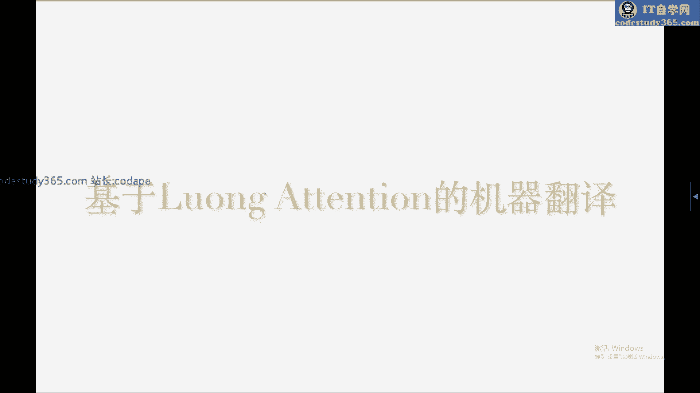

那我们这节课主要的聊天，主要的讲课内容就是关于用sequence to sequence，做做这个机器翻译，以及训练一个聊天机器人，那我们快速的回顾一下sequence to sequence模型。

首先在2014年的时候，这个q on cho发了一篇论文，叫learning phrase representation。

Using isnencoder decoder for statistical，Machine translation，在这篇文章之前呢，实际上也有人发过比较类似的一些哎一篇文章。

但是之前的那几个人做出来的效果不好，所以现在大家只记得这一篇文章，就是encoder decoder模型，这个模型的基本思路非常简单，就是啊比如说我要把中文翻译成英文，我们把这个中文用X来表示。

把这个英文用Y来表示，然后呢，嗯我的我的做法就是把这一段中文啊，都先做个embedding，然后过一个recurrent neural network，他们在这里用的是一个特殊的recurrent。

Neural network，叫做groove，叫做或者叫做gated recurrent unit，然后呢当你跑完这个gated recurrent unit之后，你会拿到一个vector。

这个vector c我们可以认为它表示了整一段啊，整一段话里面的信息，然后呢我们再用这个vector c1步一步的啊，做这个trans，把它把它传到这个呃。

decoder就是第二个recurrent neural network里面，这个recurrent neural network的功能呢，是把一段话翻译成啊，把一段话解码成英文。

然后我们就拿到这样一个encoder decoder模型，啊这个模型大家有没有什么问题，我们啊我们只是很快的回顾一下这个模型，一会儿我们会实现一下，这个模型可能会跟他稍微有点出入。

然后他的训练呢也是采用cross centrplos，跟语言模型非常类似，因为我们几乎可以认为这个模型它就是一个啊，就是一个语言模型，唯一的区别，它是conditioned on这个vector c。

然后做了一个语言模型，那后来呢，在2015年还是2014年底的时候，这个but now它发了一篇文章，是在这个模型的基础上加了一个attention机制，用它来做这个机器翻译。

然后发现有了这个更好的效果，那他跟之前的那篇文章的区别呢是这个encoder，首先它是一个双向的recurrent unit，A recurrent neural network。

然后呢嗯有这个双向双向的network之后呢，他并没有只拿一个hidden vector，作为这个句子的表示，他认为这里每一个hidden vector，都都是这个句子表示的一部分。

然后他就加了一个这个叫做attention的极值，然后在解码的时候呢，我要输入的，我会把当前的context vector用一个weighted sum of the，hidden states传进去。

传到这个Y，所以就是每一个位置呢，我都我都算了一个weighted sum of the input，Hidden representations，然后把它作为解码器的一部分进行解码啊。

那怎么算这个怎么算这一个weighted sum呢，首先我们要有一个我们要知道每一个hidden vector，它有多少的weight，你怎么知道它的权重呢，它的权重是啊，用这个阿尔法IJ来表示。

我们看到这个阿尔法IG它又是一个soft max，那这个soft max是基于里面的分数，EIJ怎么知道EIJ呢，其实你只需要知道这个SI减一，跟HJ之间的关系是多少。

SI减一呢是上一个输出字符的hidden vector，那这个HJ呢是所有的encoder，The hidden states，等于说你要用这个YT减一的这个s st减一，跟每一个HG都算一个分数。

然后用它来做soft max就可以作为你的weight啊，这个是比较有名的一篇paper，就他告诉我们怎么样用在里面加retention机制，然后就用这个attention机制，来提高这个模型的效果。

那同时期呢或者稍微晚了一段时间，有一篇啊，有一篇paper叫LEON，有一篇paper是一个叫LON的人发的，他是STANFORD1D，他介绍了另外一种非常类似的做attention的方法。

那他跟前面的一个bottom of paper，唯一的区别是他介绍了几种不同的，不同的那个scoring function，我们看到这个这个weight呢也是用了这个soft max function。

所以跟前面的跟前面的button out paper几乎是一样的，它唯一的另外一个区别呢是他算hidden states的时候。

是把这个context vector跟前一个hidden state拼到一起，然后算了一个这个WC的转化，再加了个teenage，这是你新的hidden state，这个是一个微小的区别啊。

我们看到上一篇上一张slides，它这个他的hidden state呢，其实只是context vector跟这里的YT减一，然后这个LON呢他把这两个hen state拼到一起，再做了一个线性转化。

又做了一个NACTIVATION，其实就是给你这个模型稍微加了一点参数，并且呢它的scoring function用了一些其他的做法啊，一个是我们这节课会给大家用这个第二种啊。

它是一个blinear function，当然你也可以尝试用它别的方法，就一个是dot product，一个呢是把它拼到一起之后做了一个线性变化，加了个teenage。

再做了一个跟某个parameter做了一个点击，有同学问我，我有没有用过ROSA框架，我不太了解这个框架，所以我就不讲这方面内容，好那我们呃对于模型大家有没有什么问题。

因为我就简单的把这几个模型介绍到这里啊，因为我想大家是有一些深度学习的基础，所以我就不再过多的介绍了，那我们后面就开始给大家写一段代码嗯。

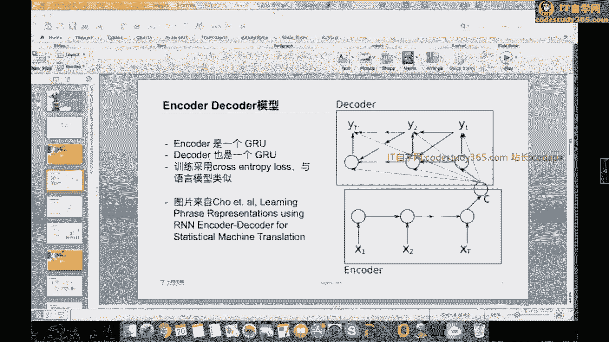

今天这节课的代码其实还挺挺多的，而且比较容易写错，所以我要稍微仔细一点啊，如果到时候出现了什么问题呢，同学们也不要太意外啊，那我们这节课呢就给大家尝试复现一下，这个LON的TENTION模型。

用他的这个bina function，那由于我们的数据集比较小呢，所以训练出来的模型的效果，可能并不会非常的好嗯，如果大家想要训练出一个比较好的模型呢，可以参考下面我这里附上了很多资料。

就是包括三篇论文，是我刚刚那三张slides的内容啊，我应该把第三篇放到第一个位置才对，就是这是这是最早的一篇文章，然后后面才有了巴特纳，我跟跟路网的两篇论文课件。

大家可以看这个stanford cs r s d，是那个也是这个叫卢旺的人讲的课，所以他讲了他的slide做的也是不错的，然后网上同学们可以找到一些比较好的，PYTORCH的实现。

做这个sequence to sequence，我认为最好的一段代码应该是open m，MTPY的啊，它的实现，并且大家做研究的时候，很多时候经常用open and i m TP y。

它里面是实现了各种你能见到的，sequence to sequence的模型，大家都可以用来学习，然后sequence to sequence，模型里面其实有很多别的微小的细节，我们这节课不会涉及到。

比如说beam search啊，还有一些啊别的别的一些比较细节的内容，同学们可以自己在课后再去，感兴趣的同学可以自己去学习，那我们就开始讲今天的代码，我首先呢import1些库。

然后我这里的数据预处理我都已经写好了，就我们import的库呢主要就是都是一些啊，主要是torch的这些库，然后这个NTKNLTK，我们一会儿是用来把英文做分词的啊，另外就是还有一些别的常用的库。

那我这里呢有一些呃给大家看一下这个数据啊。

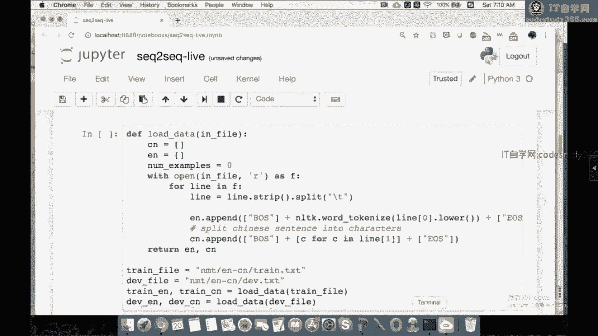

如果我去啊，Pytorch，Notebook，我这里有一些数据ENCN，我给大家看一下我的def点TXT啊。

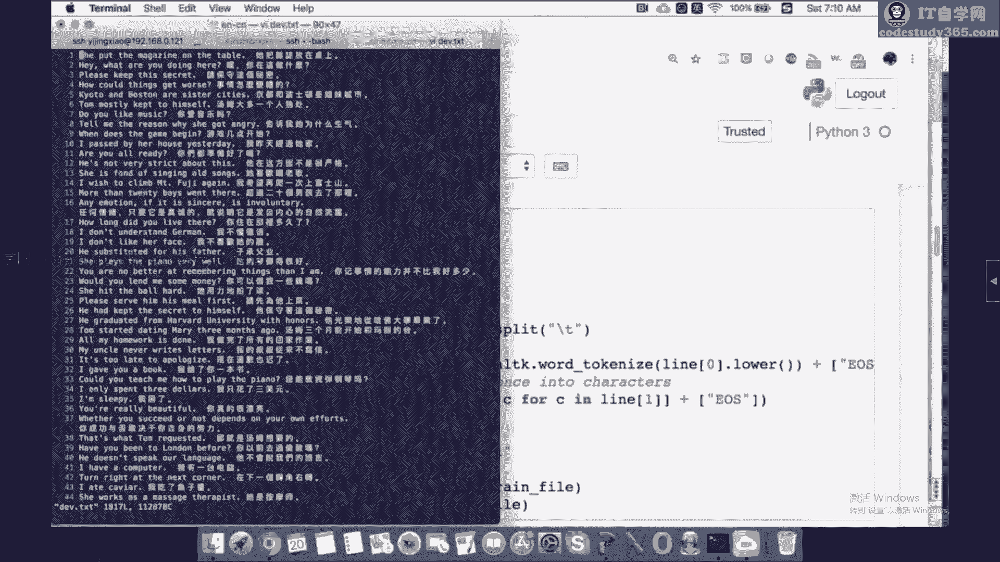

我的数据大概是长这个样子，他们。

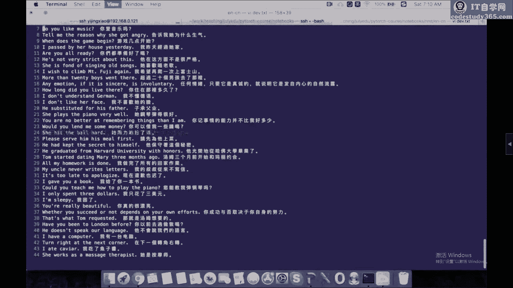

它里面的数据的格式就是一句英文加一句中文，一句英文加一句中文，并且它是应该是一些繁体字，这个数据呢不是非常长，它的训练文件只有1万4000多句话。

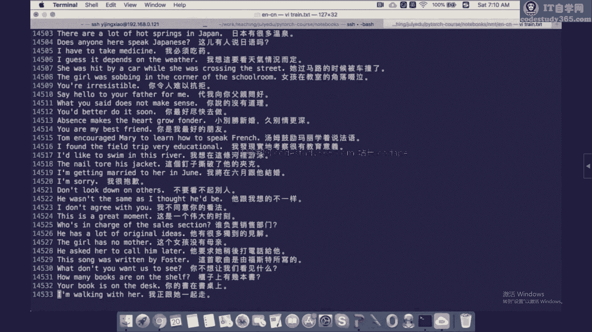

所以可能不会训练出一个非常好的模型，但是还是一个也可以用它来做一些做一些实验，那我们就先把啊。

因为它是由tab隔开的，所以我先把它读进来啊，读的方法就是比较标准的套路，我们先打开这个文件，然后一行一行的读，把这一行用tab分开，然后第一句话呢是英文，所以我们用NLTK的word toise。

把它给把它给分成一个个的单词，然后我们在每句话的前面加上一个boos，表示beginning of sentence，最后加上一个EOS表示end of sentence，对中文呢我们做同样的操作。

但是中文我就不做分词了，其实同学们也可以自己尝试一下，用一些你知道的分词软件，比如说结巴作为一个分词，看看会不会使得这个模型的训练效果更好，我想应该会取得一些更好的效果，但是我当时偷了个懒。

就直接把它按照这个按照一个一个的字分开了，所以你拿到的是一个一个的字，而不是一个一个的一个词组词语，然后我们就把这个train跟deaf给读进来，然后给大家看一下这个train。

train跟def长什么样子，这个train呢首先它是它应该是一个list，然后我们看到train e m啊，每一个句子呢，大概都是每一个句子都是这样的一个list啊。

比如说how about another piece of cake，然后把它都变成了小写的单词，就是为了让单词的量不要太大，那我们有train也有啊，deaf1眼可以看一下def1N是长这个样子。

然后def cn呢是啊是这个样子，有同学说对于中文来说，词词向量好还是词向量好，一般来说肯定是词向量会稍微好一点，尤其是对我这种只有1万多个单词啊，1万多句话的训练样本来说，所以同学们可以自己尝试一下。

我这里我这里先不做演示，其实你们可以用import结巴，然后直接结巴点cut，把它给cut成一个list，然后你们就可以拿到一些词向量，应该是一个很基本的操作，但我为了防止在课上出现意外的事故。

就按照原来的方法来写，嗯那这边我们就有这个def1N和def def cn，他们是一一匹配的，那下面呢我要根据我的语言来构造一些单词表，构造单词表的做法呢，就是我要把这个句子里面的单词。

一个一个的取出来，并且数一下它出现了多少次啊，你可以用一个counter的object，来数一个单词出现了多少次，然后我们把其中最常见的一些单词留下来，作为我们的单词表啊，我在单词表示。

在这些单词之外额外加了一个叫做AK，一个叫做pad，实际上我们这节课当中不需要pad这个词，但有时候啊有时候做一些别的任务的时候，经常会需要一个pad的token，所以我也把他我也把它留下来，然后呢。

我们就用同样的function来构建中文和英文的单词表，我们可以看一下这个英文的单词表嗯，首先我们看一共有多少个单词，一共有5000多个单词，然后看一下这些单词表里面有一些什么东西啊，它有BOSES。

然后有这个句号啊，I am the to you，就这些都是高频词，然后到最后呢应该是有一些啊，这个比如说indict ark应该就是等于零，然后head应该是等于一，就有这样一些词。

然后CN呢也是一样的，你可以看一下CHINESE，它的高频词应该也是一些，比如我的你他这些是比较高频的单词，你这个是中文和英文的单词表，然后呢下面我要做的一些事情是，我要把中文和英文都转换成。

从他的单词转换成数字，因为最后我们训练的时候，我是用这些数字来做训练，就是我要把它encode成他们单词的index，所以我现在就做这一步操作，我要把这个英文的英文句子，英文单词，英文字典，中文字典。

然后我还要做一步，就是把它SBYL，为什么要thought by length呢，因为到时候训练的时候，我希望一个batch里面的句子是差不多长度的，所以我就把它sort一下，那我们看到我要死啊。

其实它的做法就是，我把这个英语句子里面的每一个句子都拿出来，并且用这个英语的字典把它给encode成它的单词，它如果不存在，那我们就把它写成零啊，这个是英语句子，然后还有这个中文的句子，然后呢。

下一步我们要做的是，把句子按照英语句子的长度做一个排序，排序的做法呢是你首先做一个sort，就是把我们的嗯把你每一个每一个句子的，我们按照这个句子的顺序啊，这个sequence x点length。

length的sequence x来做一个排序，然后呢，我们其实是把零到N减一个句子的，这个index做了一个排序，然后当你拿到这个index之后呢，我们再用这个index句子做一个排序。

因为我们到时候要把这个中文和英文，按照同样的顺序排序，这里是把中文和英文按照同样的顺序排序，然后这样排序完之后呢，你就会拿到train em跟train cn，我们可以看一下train em长什么样子。

首先它应该还是一个list，这个list还是有这么长，然后我们可以看一下，比如前十个句子，他都已经是把最短的那些英文句子放在一起了，我们注意这个二是beginning of sentence。

三是end of sentence，所以它都是由二开头，由三结尾的，那这个train train cn呢啊，就也已经被排序成你想要的样子了，然后如果你想把这些句子解码回程，它原来的样子。

我们可以用刚刚我们得到的这个in edict，这个是从index到到word的这样的一个匹配，所以你可以直接用，比如说for i in train，第零个句子，然后我们直接把它这样转回去就可以了。

这样他就会告诉你，U we learned，啊我们再看一下一是什么呢，它是yesterday weeks，Big，这些句子是不是有点，这些句子看着稍微有点奇怪，看看有没有什么，是不是有没有出什么问题。

You chinese play du，哦这边应该是用for i in train sentence，好像感觉哦这是我打错了，应该是易安，所以才会感觉这么奇怪啊，就是刚刚刚刚我把这个英文打成了中文。

所以这些句子现在都是看起来很自然的，就是run，然后goodbye这样，然后如果你想要看CN，那我们就把这两个地方都改成CN，你就看到什么，这是祝贺你啊，这是等等，所以我们可以把这个。

我们也可以把中文跟英文留着匹配的，看EMEM然后我们可以把这个K留下，解K等于二，就是啊congratulations所把print出来，点join，因为到时候我们做完了这一系列处理之后呢。

你还是会希望把这些句子打出来看一下，所以我们就先把这个步骤给做了，就是你看congratulations，然后是祝贺你，然后这里说的是weight，是等等，四是这个再见goodbye。

比如我们可以看一下第1万个，他来这里的目的是什么，For what purpose did he come here，就是这个这些都没有什么问题，我们就拿到了已经被你编码好的，英文和中文的句子。

下一步操作呢，我是要把这些句子全都分成一个一个的batch，因为当你训练的时候，你是要用一个一个的batch来做训练，那我们这里就定义一些function嗯，这个Gemini batch呢是吧。

是拿到一些一些部分，就是我们把啊，我们把一些一系列的index改成mini batch，所以其实整个function主要是在jan examples，就是你把英文跟中文的句子都传进来。

然后呢我把mini batch那些index给拿到，拿到之后呢，注意我，我把这个mini batch index，他其实就是把NN是什么东西，N传进来的，是一共有多少个句子。

然后呢我把他的index给拿到，就这样，你相当于是拿到了一个012，一直到N的N减一的这样的一个一个list，或者一个n d a ray，然后呢我把这个啊，If shuffle。

其实我应该把shuffle写成force，然后呢我们在啊就不做shuffle，然后我们把这个index in index list。

然后把这些啊index list里面的从index到index加mini batch，size的那些mini batch拿出来，这样你就可以拿到拿到一系列的mini batch。

我们可以看一下这个Gemini batch，究竟做了些什么事情啊，我直接我可以写Gemini bats，Get many batch，然后我们写一个1万啊，我写个小一点的数字，比如说100跟15。

你就可以看到它就可以把你的这个啊，把这些index都变成mini batches，你就可以拿到一个mini batch index，然后有这些mini batch index之后呢。

我们就可以拿到这个mini batch index，然后把它英文和中文都啊，英文跟中文都拿到，基本上就是这个样子，然后我们看一下，如果你把shuffle变成true会怎么样呢。

我们如果把shuffle变成true啊，那它就会稍微打乱一下嗯，其实我们应该留下这样一个打乱的句子，所以我们我们应该用这个打乱的，这样一种mini batches。

然后拿到这个mini batch之后呢，你可以用每个mini batch index把他的句子给拿到，这样就拿到了一个一个一个mini batch index，并且我把句子的长度留下。

因为到时候我们做训练的时候，需要句子的长度嗯，然后我们就把这个mini batch的，这个英文和英文的长度，中文和中文的长度都留下，这样你就拿到了这个train data跟跟deaf data。

这个时候我再给大家看一下，这个train data跟deaf变成了什么样子，比如说deaf d它变成了一个它还是一个list，但是每个list里面呢其实是一个batch。

所以如果拿你拿第零个batch出来呢，你会看到它的第一部分其实是英文，然后是英文，句子的长度都是七的长度和八的长度，因为我们已经把它按照按照长度排序过了，然后我们看到下面是中文的翻译，最后都是零。

因为它都是padding啊，我其实用AK来做padding了，但是因为我们到时候会用句子的长度，所以这个padding并不重要，你就是任何padding都可以，然后最后呢是这些中文句子的长度。

就这是一个你拿到的这个数据，数据的这个格式，然后train呢也是一样的，都是一样的格式，train跟death，好现在我们有了train和def，我们所有的东西都做完之后呢。

下面我们就可以啊用它来做一个，用它来做我们的模型训练，来构建我们的sequence to sequence模型，那我这里呢想先给大家训练一个没有attention的。

一个非常简单的encoder decoder模型，那我们想这个时候你要做什么事情，来回顾一下我们刚刚的slides。

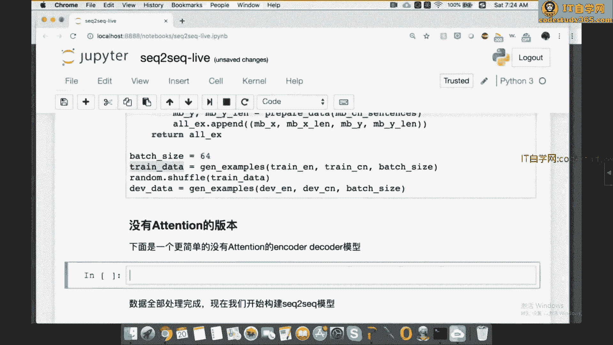

这个encoder decoder模型，就是要把先把它给encode起来，再把它decode出去。

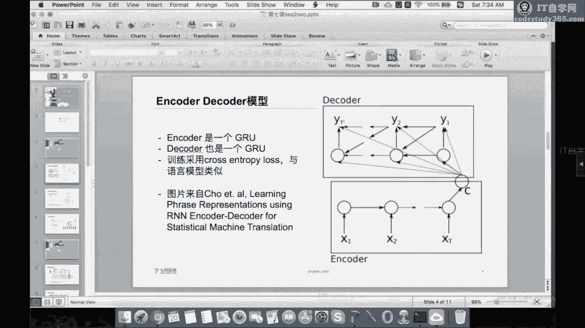

所以你其实只需要两个recurrent，neural network就可以了，那我们来尝试一下，把它给写出来啊，我可以先写一个class encoder，Class encoder。

And then the module，然后我们呃写这个initialized function，我们需要传递的参数呢，首先你需要知道一共有多少个单词，Vocabulary size。

然后你需要知道embedding the size，然后你需要知道encoder hidden state，需要知道encode hen st嗯，我们把它稍微简单一点，我们就需要知道这么多复杂的参数。

我们假设所有的什么embedding size啊，什么呃，Encoder hidden state，还有encoded hidden state，全都是hidden size啊。

我们把它叫做plane encoder，因为一会儿我们会训练一个，稍微复杂一点的encoder，然后我们加一个drop out，所以等于0。2，drop out是一般用在词向量的那个那个后面。

然后呢我们super plane encoder，点in it initialization，然后我们定义一个embed function等于NN点。

embedding for capsize跟hidden size好，我们再写self点N等于NN点，GP就是current neural network。

后面有hidden size跟hidden size，就是从hidden size直接传到hidden size，batch first等于true self点drop out等于N点。

Drop out，Drop out，这个就是我们的所有的模型，我们就一个一个embedding层，一个recovering neural network，再加一个drop out。

然后呢我们要定义forward forward，它需要传进来哪些参数呢，我首先需要传进来self，然后我还需要知道啊，X是我的输入的那个batch的单词，这个bash的单词呢，我们想象一下。

你要对它做一个embedding，然后再做一个recurrent neural network，第三个参数呢，我们需要知道这个batch里面，每一个句子有多少长度，因为我们最后做这个模型的时候。

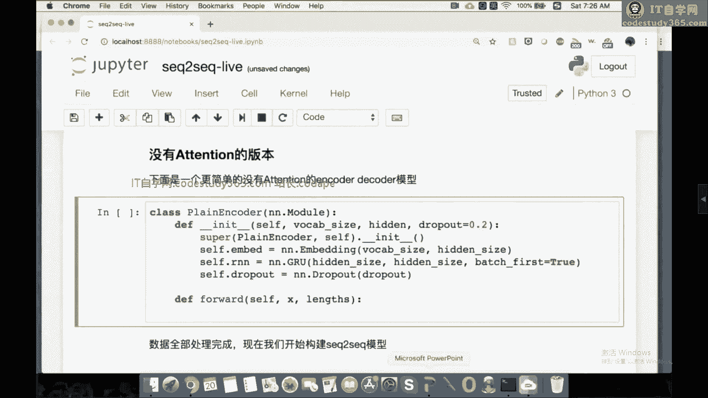

我要把他最后一个hidden states取出来，作为我的context vector。

所以你需要需要知道这个句子有多长，那这里后面呢呃有一些小的技巧，就是当我跑一个recurrent neural network，然后我每个batch里面的，每一个句子的长度是不一样的，时候呢。

如果你想要拿到他的最后一个hidden vector，我们一般会做会做这样一个操作，就是你首先要把这个batch里面的，把batch里面的sequence按照长度排序，所以你就是要做一个排序。

怎么排序呢，其实在PYTORCH里面，你可以直接用length salt啊，0descending等于true，这样呢它会把你从呃descending，就是从长从长往短了牌。

然后就可以拿到sorted l和sorted index，这两个参数是什么呢，第一个是你把这些长度按照，把这些句子按照长度排序的，第二个呢你是把这些句子的index也给留下来了。

就是第一个句子本是本来的第几个句子，第二个句子是本来的第几个句子，然后呢你就要把这个句子都给它排个序，sorted等于sorted index，然后呢，这个这样呢你就把这些句子按照长度排序了。

这句子已经按照长度排序，下面呢我们就可以做embedded等于self drop out，Self embed exported，这样我们就把这些句子都embed embed，成一个个的词向量。

下一步我们就可以做这个self n了，就是我们要做self n啊，Pan embedded，但是呢这里我们又要做一步操作，因为因为我到时候，因为这些句子的长度是不一样的，这句子的长度不一样呢。

它最后一个hidden states的位置是不一样的，就如果你直接写self点IN呢，嗯这里前面比如说写out，记得，等于HIIT等于这样，这个hidden states的位置实际上是错的，为什么呢。

就是它默认会把你最后一个hidden state给留下来，但比如说我的batch size，比如说我整个batch的句子都有十个单词的长度，但我当前的句子其实只有七个单词。

那你并不希望把第十个位置取下来，而是希望把第七个位置取下来，所以说这样写呢它是有问题的，那PYTORCH提供了一个比较简单的方法，可以帮我们来处理这些啊，不同程度的问题的这个IN，你要做的事情呢。

就是用这个N点UTILS点pack headed sequence，什么叫pack padded sequence，就这些句子本来是padded，就它的长度是不定长度的啊。

我现在的作用是我要把它给pk到一起，我要把那些pad的地方给扔掉，然后呢就这是这个会导致就是这样写，写代码会保证你的PYTORCH代码比较高效，因为如果你的，如果你当前的整个batch的。

每一个句子的长度都是100，但是你其实只有七个单词，后面93部recurrent neural network都是白跑的，所以你把他pk完之后呢，他那些不会跑就会快很多，所以你可以写embedded。

然后我们把把这些length给传进来，就是你这个sorted length，必须要作为一个作为一个参数传进来，并且它还必须要求你传一个啊npd array，所以我只能这样写成一个当pad array。

然后不要忘了写batch first等于true，因为我们这里的batch first都是等于true，这样你就可以拿到啊，Heat embedded，然后这个embedded呢就已经被你pk过了。

然后我们拿到packed output，然后这个hidden呢就是正确的hidden states，就是你的句子有多长，它就拿哪个位置的hidden state，然后因为我前面已经pk过了。

所以后面我要把它pad回来，就安安点UTILS，点PAPACKED啊，这里少写了一个RN点，R n m d pack pad tacked sequence。

你看到这两个function其实只是名字换了一下，就pack padd和pad packed嗯，然后我的作用是把pout，然后写batch，first等于true，如果大家不太理解这一段代码在写什么呢。

其实你只需要知道他可以把变长度的那些，recurrent neural network给高效的处理掉啊，第二个参数我们就不需要了，因为它应该是sequence的一些长度之类的信息，那现在在做完之后呢。

嗯我注意啊，我最前面的时候把把这些句子按照长度排序了，为什么要排序，就是因为这个function，它必须要求你是传排序的句子进来啊，这一点可能是PYTORCH没没没处理好的地方。

就是他其实不应该让user做这样一些复杂的操作，但是我相信他们以后可能会把这个API给改了，但是暂时我们只能这么做，然后呢我们就是要把这个sorted index。

这个sorted index再把它排序回原来的样子，所以我们可以写sorted index，点salt啊，descending等于false，就是我们从从第零个开始往上找。

那它的啊original index我就可以把它拿去拿出来，然后呢我就把out变成out的original index点，Long，点contiguous，大家还记得contiguous。

是为了把那些不连续的内存单元给连到一起，因为我这样选取了之后，它的内存单元可能就不连续了，然后注意这个HIIT也要变成hi，最后呢我们就是要return out hiit。

HIIT呢我想把一这一层给拿出来，为什么呢，因为HIIT它的它的shape实际上是一个，我们给大家看一下PYTORCH，点OG里面的recurrent，neural network是怎样定义的。

我应该应该给大家看的是GU啊，我们给大家看一下GU究竟是怎么定义呢，因为GU它他返回值里面呢，我们看一下它的返回值啊，它的返回值有一个H0，H0。

Is of shape number of players，Train，Number of directions，chi batch乘以hidden size，所以啊他前面其实还多了一个维度。

所以我要把它的一，就表示最后一层的那一个hidden state拿出来，当然我这个模型里面一共只有一层，但是你可以想象你这个GU，如果number of layers有若干层的话呢。

那你其实是希望把最后一层的hidden state拿出来，所以我就把out跟hidden state给拿出来，那这个就是我的play encoder模型，那写完plane coder之后呢。

我还要写一个plain decoder，A class playing decoder，这个play decoder是nd module。

然后我们再写def init self for capitalize，hidden size dropout等于0。2，然后再写super plane，Decoder，Self bin it。

那我的decoder要做一件什么事情呢，我们如果再看这张图。

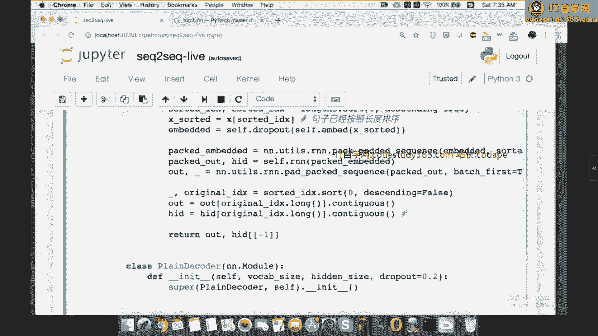

你就会发现decoder它实际上是，这里他有很多箭头啊，就是这个C它其实传到每一个位置里面去，但是我当时写的时候，我没有把它传到每一个位置去，但是差距应该也不会很大，就是我们可以用啊，用C把它传到。

但是我现在想临场把它给加上去，我就把这些C都传到每一个位置里面去，然后写一个写一个decoder。

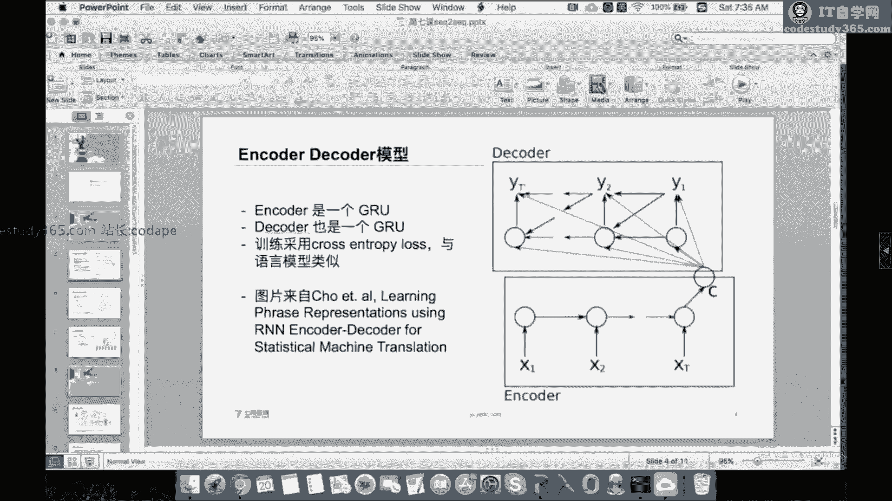

那我们可以怎么写呢，呃我们首先还是要写一个in bed等于等于N点，Embedding，for capiticize和hidden size，然后我在self i m等于GW啊。

其实我现在要写两个hidden size，大hidden size，然后在batch first等于true，然后我要写一个self out，是我的output linear function。

这个linear呢应该是从从hidden size，其实也是两个hidden size，因为我是把context vector在家传到这个vocab size，这个是输出层，有同学说我有同学问了个问题。

说句子为什么要按照长度排序，这个是PC，就是这个function pack padded sequence，它必须按照要求你这个句子按照长度排序，所以并不是我想按照长度排序。

而是这个function要求你这么做啊，将来PYTORCH新版本出来之后，有可能会取消这个限制，那你就不需要你就可以把这几行代码都给删掉，就是这两行这里的三行代码，将来你有可能可以删掉。

但是现在必须要写，所以这个就暂时大家只要记住就可以了，然后我们三点drop out等于drop out，等于NN点，Drop out，Drop out。

然后再写def forward self y wlength，这个呢就是比如说你要把英文翻译成中文，你把这个中文的这些Y和y length，跟他第一个hidden state。

这个是其实是我的context vector，就是我的第一个hidden state，那我现在就可以写sorted l啊，这里其实又要做刚刚一样的操作了，就是我必须要把这些代码都拿过来。

我其实可以直接把这些代码给抄了，我先把这些代码全都给抄过来，因为它也是一个recurrent neural network，所以基本上干的事情差不多，唯一的区别你是要把这个length改成y land。

然后呢你要把sorted改成y sorted，然后in bed呢，你要把why sorted in bed啊，这个跟刚刚一样，然后另外呢注意这个地方head head也要做HD啊。

Sorted index，然后做了一个embedding，然后做完embedding之后呢，你要把也要做，刚刚我做的所有的这个packing bed的，注意，这些都是因为句子的长度不一样。

所以你才要做这样的TD啊，然后我们看看有什么要改的，就是这个embedded直接变成embedded，然后啊packed embedded是packed embedded。

然后我们再把pact embedded和head传进来，因为recurrent neural network，它如果你默认不传head呢，它就是传零向量进去，但你传head进去。

它就会把你的这个hidden state给传进去，那我们注意这里的embedded，因为我们看到刚刚这一张图片对吧。

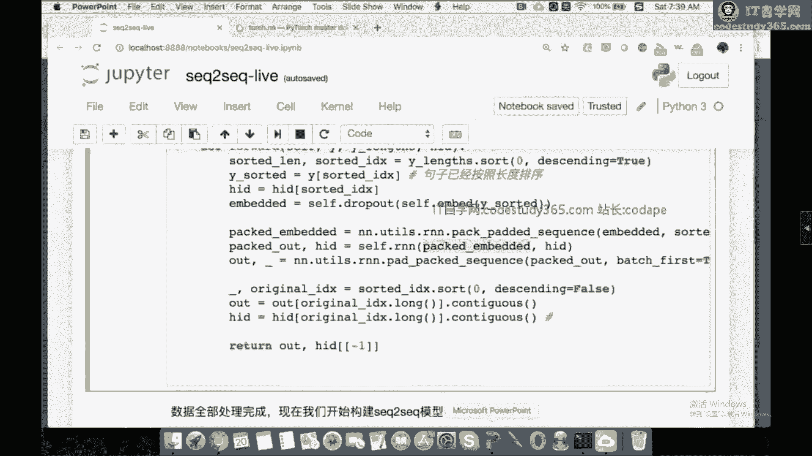

就是我要把这个C也传到这个啊，传到每一个hidden states里面去。

所以我这里其实应该要把这个head给，can catch it到啊，in bed上面去，所以我这里可以写啊，我应该怎么做呢，head等于，hit点on squeeze0，然后我再写点expand as。

Why sorted are embedded，嗯然后我再做torch点cat，Are embedded，和这个hidden state给它拼到一起，就是我要把两个部分一起。

作为作为embedded传进去啊，这一段代码我先这么留着，但是待会如果报错了，我就不敌bug，我就直接把它删了，这里是新的embedded，然后我们把embedded传进去之后。

注意这里有hid ebpack embedded，然后我们把embedded给传进去之后呢，你就拿到packed out啊，我再把packed out拿出来之后，变成原来的out。

变成原来的out之后呢，再把它original index拿出来，然后我们再把这个original index跟out处理掉，变成一个新的out。

最后我们再把hidden state也变成原来的hidden states，的顺序，那最后呢最后我要注意一下，其实这些地方的shape我要注意把它留下来，就是这个地方。

比如说embedded shape，应该是batch size乘以LN，就是YL再乘以hidden size对吧，那这个地方呢我把它给contestant之后呢，他应该是21等size。

那这边呢呃这个out呢，因为它recurrent neural network，它是hidden size，所以它又变成BSITE乘以violence乘以hidden size。

这个hidden呢其实就是batch size乘以啊，Hidden size，注意前面还有一个一，因为我一共有一层一层的这个group，那最后这个decoder还要做一件什么事情呢。

你得把这个output给map，到他的vocabulary size上面去。

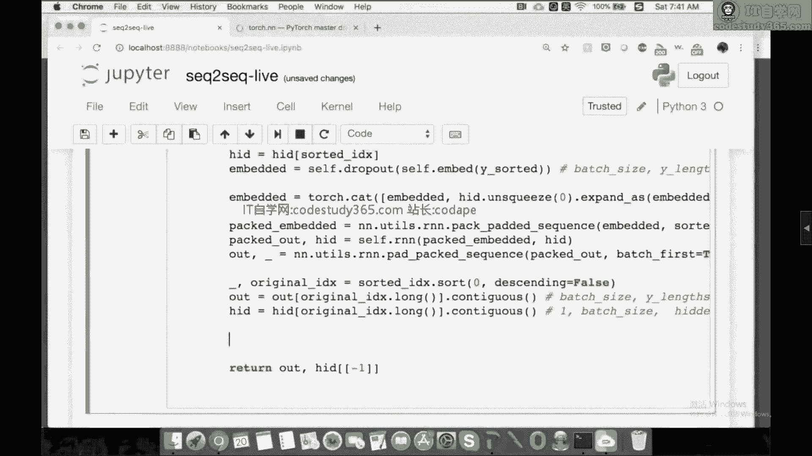

嗯然后因为这张图的关系啊，我们每次解码的时候都把C传进去，所以我要把C再跟CSLT上去。

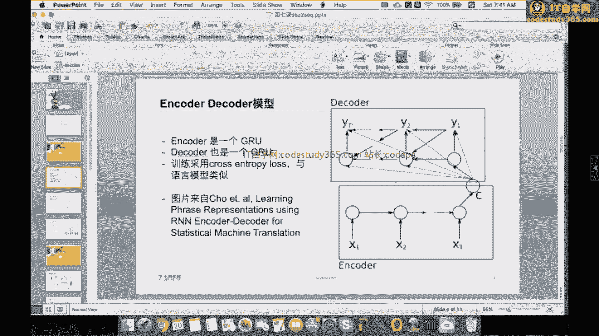

所以我又要做一部这个很类似的事情，我得把这个out，把这个out跟跟这个音，把这个out和这个hidden state拼到一起嗯，这个HD其实这个HD的名字变了。

所以我应该把这个HIIT改成叫做new hit，所以我把这个HIIT改成new hi，这样就没有问题，那这样我就把原来的这个head拼到这个out上面去，最后呢我再转一个做一个linear的变换。

我写out等于self点out，我想把alt名字改成FC，这样表示fully connected layer点FC，然后out，这样我拿到了一个什么什么样的形状呢，我应该拿到了一个batch size。

乘以Y乘以y length，再乘以vocabulary size，有没有问题，应该没有问题，就这样变成了vocabulary size，最后呢，最后我还想做一件事情。

我想把它做成log soft max，Log soft max，其实这个就是soft max加一个log，因为到时候我算log lost的时候，我可以直接用这个logs of math。

所以我们就把这个out传出来，然后再把new kid也传出来啊，new kid传不传开，其实都无所谓，因为到时候我们也不需要了，所以我们就还是需要的，所以我们把这个new kid给传出来。

好这样我的decoder也写完了，这里比较tricky的一点，大部分地方跟encoder差不多，比较不一样的一点呢是我把做了一些CONCINATION，这两个concatenation嗯。

因为我之前的代码不是这么写的，我有点担心他现在可能会出bug，但是我们先给他留着，然后最后我再写一个啊，Sequence to sequence model。

就是你encoder decoder都写好了，我就可以写plane seek to seek，然后我们写N点module，Deema self encoder，Decoder。

那其实我们就是写super plane sequence to sequence，Self than in it，然后写self点encoder等于encoder。

self点decoder等于decoder，就是我只需要一个encoder decoder，我的forward function呢就是要把X跟x lb，然后再把Y跟YL都放到一起。

然后我们写encoder out等于encoder out，hidden等于self点encoder xx length，然后我们再把啊在写cf点抵扣的人，decoder要传递什么呢。

就是Y等于其实就是传Y传wide length，然后再传hid，这样你就可以拿到output和HIIT对吧，最后呢我要返回一个output，啊我这里还想返回一个NB，因为到时候我们写代码。

写另一段代码的时候，这里需要返回一个attention的东西，所以我这里把NN给返回了，那这个是你的play sequence to sequence模型，那我就先写到这里。

然后我们看一下这个模型能不能被定义出来啊，基本上都写完了，那下一步呢我们就开始定义这个模型，我们首先写device，torch device啊，could的，if touch点，coda点。

Is available，就如果有哭的，那我就用KA，如果没有CUDA，那我就不用k else CPU，定义drop pos等于0。2。

然后我们有我们刚刚其实有这个dictionary the size，到时候需要留下，有这个total n total words跟cn total words，那我们就啊待会定义单词表的时候。

用这个东西，n total words跟cn total words，所以我现在可以写encoder等于claim，Encoder，vocab size等于total e n words。

是不是叫total e n words，好像1n total words，所以是e n total words，然后我的hidden size等于啊，我们把hidden size都定成100。

所以hidden size等于hidden size，然后我来drop out等于drop out，decoder等于plane，decoder啊，vocab size等于。

应该是cn total words，这是decoder的单词表，然后hidden size呢也是等于hidden size，Rop out，那我也定等于dropout，我们就用比较一致的一致的这个参数。

然后我们写一个model等于plane，Seek to seek encoder decoder，这样你就拿到了一个model，model等于model点to device，如果他是KA。

那我就变成一个CUDA的model，然后这个criterion就是这个loss，我这边定义的一个比较新起的loss啊，也不是一个很新奇的loss吧。

其实这个就是嗯其实它是一个cross entropy loss，但是呢我自己写了一个cross entropy loss，因为它上面有一个mask，所以所以我这边用mask定义了一个特别的loss。

就是他会把一些非就是mask掉的一些部分，给你忽略掉，所以我这边它的它的参数就是input target和mask，他的做法也很简单，实际上就是把input变成一个嗯。

变成一个它的长度乘以它的vocabulary size，然后呢这个targets呢就表示每一个位置，它的单词是哪一个，然后你用啊，用mask，把一些非就是非输出的那些部分给mask掉。

这个就是language criteria loss嗯，所以我们就可以写cra criterion，或者叫做loss function。

loss function等于language model criterion，为什么叫做language model criterion，大家可能会觉得比较奇怪，但是实际上实际上啊这个。

实际上这个sequence to sequence，模型的loss和language model loss是基本上是一样的，optimizer等于torch optim，点ADAM啊。

model点parameters，好，这样我就把这个模型定义，我们看看出了什么错误，他说hidden size这个参数不存在，Hidden size，应该是这个hidden size。

这边是hidden size，然后我们再看一下现在模型能不能被初始化，现在还有一些错误，他说guru is not defined，因为我忘了写一个NN点GU，NN点GU上面有没有写，上面没忘记写。

那我们再看还有没有出错，他又报了一个错，他说hidden is not defined，因为我这里少写了一个hidden size，好现在这样这个模型应该已经被定义好了，那模型被定义好了之后。

我们就可以写我们的训练代码，跟我们的测试代码，那我们先把训练代码一写，看这个程序能不能跑起来，如果要写信任代码，我们可以写death train啊，Model data number of epox。

等于默认写30个EPOX，那我们可以写for epoch in range number of epox，每个EPOX开始之前，我先写model点train表示进进入这个训练模式。

然后我们就写for iteration，我们他其实这里有啊，就是英文的这个batch，还有这个英文的长度，然后还有中文的batch，中文的长度，In enumerator，Enumerate data。

那我们就可以写啊，后面我们要做一些基本的操作，就是原来这个MBX它是一个南派array，所以我要写torch点from npm b x点，Two device，点乱，然后他的length也都是浪。

所以这里我就全都copy一下b x length，然后下面呢是把这个Y也都变成，也都变成Y，这个是length，但是我们注意这个Y的length呢，实际上是要稍微做一些改动的。

就是啊你的MBY其实它是有input和output的，就这个Y实际上它的，input其实是wide的，到第一个单词就是从BOSES前面那个单词，这个是你要你要预测的这个啊是是你的输入。

它的output呢，实际上是从你的第一个位置到最后一个位置。

什么意思呢，就是我们回到这张图啊，就是它的前面的这些单词都是当做输入，然后你要预测的其实是下一个单词，就是Y2，是最后一个YT是后面这个EOSY1，那是这个圆圈呢。

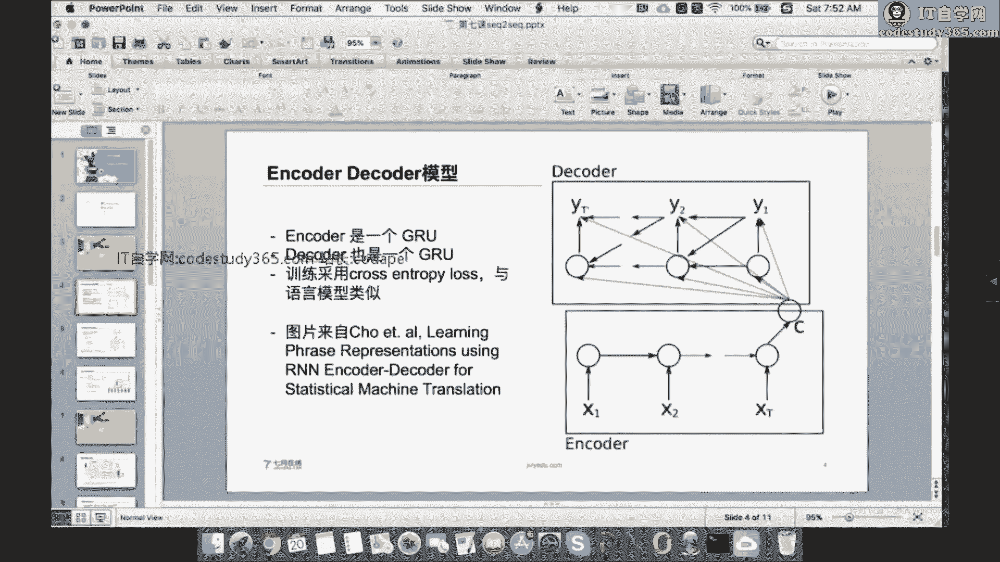

其实相当于是BOS嗯，就是我们要预测的是下一个位置，所以这边然后包括你这个y line就得给他减个一，然后为了防止有些，其实应该是不会出这个错误的，但是为了防止boss出现一些奇怪的错误。

我们把啊y length小于等于零的，全都把它变成一，就表示你至少有一个一个句子，然后我们就可以用md pride啊，这个是attention，我们现在没有attention，但是我们可以把它同时写上。

因为我这里我当时在这个model model这个地方，我永远给他返回了一个N啊，所以这个attention它其实一定是个now，我们既然可以不用管它，然后这里有n b x nb x lab啊。

b input跟MB y length length，然后我们再写nb out mask，什么是个mask呢，就是我要知道这个句子里面，究竟有哪一些是真的句子，哪些不是句子。

建一个mask的方法也很简单，我先写个a range，大家知道南派a range，我先把这个batch里面的长度，最长的那个数字给留下来，点max点item，这个是最长的长度。

然后device呢我放到device上面，这样它就出现了一些零到max长度减一的一个list，然后呢我给他前面加一个维度，None，这是表示batch size，然后小于MBY，这里后面加一个维度。

这样你就会拿到一个batch size，乘以乘以长度的这样的一个mask，这个mask呢这个mask因为他说是小于它，只要是小于这些位置，他就会给你一个大于这些位置，就会给你一个零。

然后n b out mask等于嗯n b out mask，点float，把它转换成一个float，最后我再写loss等于criterion啊，lost等于loss function啊，B pride。

然后MB out，然后是MB out，mask表示mini bashed out mask，最后呢我就可以把这个number of words给我，还要需要知道一些内容。

就number of words有多少等于等于a total，loss等于零点，然后我要把number of words加的torch点，sun啊，B y length。

就是把这些y length求个和，在求个和，就是我知道这个batch里面一共有多少个单词，然后这个total loss呢，我应该要加个loss点item乘以number of words。

这样我知道一共有多少个loss，然后total word，Number of words，就等于应该要加等number of words。

这个是我到时候要算training loss来用total loss，Total number of words，这个叫做total number of words吧，嗯后面我就是更新模型。

大家应该知道更新模型的主要方法就是，Optimizer zero grade，然后loss点backward，然后写个optimizer点step就可以了。

注意写recurrent neural network，唯一需要注意的一点是，你要做一个gradient clipping unties，点to lip grade nm，就是为了防止它的模型的啊。

模型的这个gradient太大，所以你就把把它clip掉，那我们再写一下，if iteration除以100等于零呢，我们就写个print epoch啊，是epoch，Iteration。

Iteration，Loss lost，点IDO，然后我们在每一个epoch，都给他打一些信息出来，Print epoch，Epoch，然后我们再写training loss。

Total loss to total number of words，这就是你的loss，然后我们看一下这个，这样可以训练，我不确定有没有写出什么bug来，但是我们先尝试一下train model。

train data啊，Number of epox，就number of epox，先写个等于二吧，啊果然有一些bug，我们看这是什么bug。

他说这里少写了一个uh take four positional actors，我觉得我可能是这边少写了一个self，然后我们看一下能不能跑起来还是有错，现在这现在的错是好吧。

我最讨厌的就是这个这个错误，这个错误是ka device side triggered，就应该是某一个地方index出错了，一般这个错误啊，就这种错误其实很难debug，因为你看不出来错的错是什么。

但是我知道一般来说是index超出了范围，然后他告诉你出错的地方是在啊encoder xx l，然后是啊，在这个地方出错了，我想先尝试一下吧，把这些二乘以什么地方都给它去掉。

因为有可能是因为这些部分出错，所以我先把这个地方给删了，看看能不能啊，然后我再run all看看能不能跑起来，嗯他还是device side，Device side，这个这个问题啊。

不太确定具体是出了什么问题啊，但是我在课上也不太想再重新debug，所以我就直接把我之前写好的代码copy过来，然后啊我们就让这个科技是能往下讲下去，但是啊这个代码呢，基本上大家应该已经啊看着我。

看着我把这些代码给过了一遍，应该是应该是我在某一个地方，打错了一些一些小细节，但是它出现了这样一个bug，不太好debug，我就不再花时间去写稿了，我直接把我之前写好的代码给copy过来就可以了。

这里有一个encoder，有一个decoder，有encoder decoder，然后有这个plain sequence to sequence，并且呢。

我原来代码里面还有这样的一个translate function，这个translate做的是什么呢，它就是你把你给我传一个hidden state进来，然后我能够啊。

就是你给我传X跟x length进来，并且给我传这个Y的第一个单词，Y的第一个单词一般是BOS，然后我就可以给你进入一个循环，然后不断的用decoder来做decode。

然后把这个hidden state留下来，然后预测一个Y，然后再用这个Y预测下一个单词啊，就这是一个预测的模型，Sorry，我应该把run on，然后我们看一下现在这个模型能不能跑起来啊。

现在错误是nb out is not defined，至少现在错了一个跟之前不一样的错误，那我们的nb out是因为nb output，我们看一下，现在是number of words。

Reference，Number of words，应该是total number of number of words吗，应该是number of words等于，然后我们看一下。

现在出的错误是playing sequence to sequence，Has no parameter，这里应该应该是parameters对吧，好那我们看到这个模型已经可以开始训练起来。

我只训练了两个epoch嗯，但是我们现在稍微多训练，多训练几个epoch，然后我让大家看一下，这个模型究竟干了干了些什么事情，我们训练20个epoch，然后然后你如果没有问题的话。

你应该会看到这个loss，Sorry，这里应该写20，你会看到这个loss应该会往下降嗯，但是我现在还没有evaluate，实际上我可以把，就是我没有在def上面做evaluation。

所以你其实并不知道，他在DEV上面的效果怎么样，所以我们现在这里再写一段代码，叫做def啊，叫做evaluate，evaluate做什么事情呢，evaluate实际上就是你不需要知道多少个by。

多少个epoch，因为你只需要一个epoch就够了，然后呢你希望把这个train改成evaluation，并且你希望啊我们我们这里就不需要这些地方，也不需要更新这个模型。

但是你还是需要知道total number of words，跟total total loss还有一个区别呢，你要写with torch，No grade，因为你不需要更新模型。

所以你不需要知道gradient，那我们再把它indent一下，这个就是你的evaluate evaluate的代码，然后我们可以在train的每一个epoch后面嗯。

每过几个epoch evaluate一下，我们可以写if epoch divided by five等于零，你就evaluate一下model跟div data，然后我们重新训练一把这个模型。

先把160给sorry，Sorry，这个是train啊，我们先把160给跑上，然后我们再开始训练这个模型啊，我看出了什么问题，E park is not defined。

就是因为我们这里不需要知道epoch，我只需要知道这是evaluation loss，然后我们重新定义，重新定义一个模型，然后开始train这个模型啊，你就看到这个evaluation loss。

它从4。8，然后后面一直会往下降，同学们可以呃，如果想要休息的话，可以休息一下，我会继续在这里讲课，但是我觉得大家可能有点累啊，而且而且我确实写了很多代码，这这这一块地方。

我们会看到这个loss一直往下降下来，Evaluation loss，但是evaluation loss，eventually应该会降不下来，然后呢，我们可以把我们可以让它随便翻译一个句子，看一看。

就如果你现在想要翻译一个句子出来，看看它长什么样子呢，我们可以简单的写一个，简单简单的写一个句子出来，我们可以随便拿一些160sentence出来，就比如说我们可以从def里面。

def里面随便拿一个句子，比如说def延龄，这是一个句子对吧，这个句子我们前面已经讲过，如果你想把它变成一个句子，你可以写um in e n d t i for i in啊，我不写，我不写I吧。

我写word w表示word，那你这是我们的EMS等于点join，这是一个一个em sentence，然后我们可以print english sentence，好然后呢。

我们可以再把再把它的中文句子给找出来，你叫它cn sentence a def cn cn，然后我们可以在print一下啊，点join cn sentence，这样你就可以拿到中文的句子。

然后我们可以再把他的这个，把刚刚我们的sent给拿出来，说是def0，这是我们这是我们要的那个句子，然后我们的我们可以把它变成我们的B，X等于tn等于零，你可以写torch点from npine。

这样你就拿到了一个句子，然后我们可以把它写成M，啊reshape1一点，Long，点出device，这样就可以把它变成我们的啊，变成我们要传入模型的这些这些内容。

然后我们MB length是表示这个句子的长度，那我们可以把它的长度也给他留下来，它的长度应该就是def0的length对吧，def0的length，然后外面要给它包一层，这个表示batch size。

然后我就可以写translation等于translation，attention等于model点，Translate nb x nb x lab，然后我要把boos传进去。

注意boo s token呢，我可以直接写torch tensor啊，Dict，点get cn dict的BOS，这就是我的b o s token，然后我们再写它点long，点two device。

然后我们再写啊，注意这个translation出来它是一些index，所以我可以写translation等于啊，For i in translation，点data，点CPU，点number派。

点reshape-1，然后我写e n in cn，Dict i，这个就是我的translation，然后我可以直接print一下这个translation，我们看一下啊，这里出现了一个问题。

Has no resha，这个是因为我的戴夫零，他不是一个南派点艾瑞，所以我必须把它变成NPYHY才可以，啊我都要把这些外面一定要加上囊派点2R，然后你就看到啊，他出来其实有点奇怪，他说四处看看。

他翻译成了下雪了，但是我们可以把你看到后面有很多的EOS，其实碰到EOS之后，我就可以停下来了，所以我可以写trans等于等于一个list，然后可以写forward in translation。

嗯if word不等于US的，我们就把trans点append word，else呢我直接break掉，然后我再print点join，Trance，这样我们看一下，就是他四处看看，现在翻译全都看起来。

好像还好像还比较有道理啊，我们可以把它translate更多的句子来看一下，我们可以写写一个function deaf，translate deaf表示translate第二个句子。

然后我把这里所有的零都换成第二个句子嗯，零都换成I，还有哪个地方要换成I，这个地方这个地方都要换成I，然后我们来看一下，如果我写translate，比如说第二个句子啊，Translate death。

第二个句子他就会告诉你继续努力，他给你翻译了一个继续，第三个呢他说拿走吧，他说别人第五个，他说快点快要一点，就是你看看着感觉好像还还可以，我感觉还可以，我可以写个for loop。

For i in range，比如说100~120，然后我translate第二个句子，他说啊，我这里在print空格一下，我们可以看一下，就是你的皮肤真好，你有很好，你不分正确，你是个好人。

每个人都佩服他的勇气，他的分数就是，他好像有几个句子翻译的其实还可以，但大部分句子翻译的都有点奇怪，有人在看着你的眼睛是你的，就是有人在看着你，他把看翻译成了眼睛，我喜欢流行音乐，我喜欢电视。

他们没有孩子，他们不喜欢，就是这个是一个一个简单的爱爱，能encoder decoder可以翻译出的一个模型，然后我们把我们刚刚删掉的那个部分，再给它加上去，看看能不能好一点。

就是我刚刚一直想把那个concatenation给加上去，对吧，就是我想我想做的一件事情，是我一直想把这个why sorted，why sorted等于touch点，Cat。

why sorted跟这个HD，嗯对就是我想把他这个hidden，Yeah，Expand as why sorted，第一个位置，这个是y sorted，我想把它can catch。

把把它跟这个hidden state can catch到一起，然后out呢我也想把它跟hiit can catch到一起，output等于，然后我说我要把这个head全都变成new hi。

然后我想把output变成torch cat output，Kid，点expand as output，然后再把它第一个维度加上来，然后我想把这个hidden hidden size全都变成二乘以。

Hidden size，让我们看一下，这样能不能让模型效果变得更好一些，当然我们现在其实评估不了模型的效果，因为完全是我现在完全是在靠肉眼看这个模型，并没有太多的，我们看一下现在出了什么错。

应该是一些shape上面的错误，他说是六十四十七，就是这个问题是我应该把它，我的shape出了一些问题，为什么shape会出问题呢，因为这个地方我要把他的，我应该要把它给点transpose。

一零我给他transpose一下，应该应该就可以把把这个bug fix掉，然后现在的错误是他说，Transpose，Take two positional transpose。

我刚刚多打了一个parameter，这个transpose是不需要传，第二个位置进来了，我应该多传了一个transpose parameter给他，这边是一零，好吧，我有点想放弃这个部分。

Input size for you must be equal to，这个是在哪个地方出错的，就是我现在如果暂时fix不了，我们就忘掉这个部分，因为啊我知道这里的head出现。

这里的head错在哪里了，但是我想我们就先不管它了，因为因为这个并不是非常的关键，只是只是我想本来想照样复现，那个QM用错的代码，但是我们其实并不一定，完全要按照他的模型来做，因为我们我们刚刚这个模型。

基本上也已经可以work了，所以我们就可以满足了，就用刚刚的这个模型来来作为我们的，作为我们的baseline，就是可以直接一个一个直接的简单的encoder，decoder模型来做这个事情。

我就发现他嗯你训练的时候，如果能看到这个loss降下去，并且它翻译出来的句子是比较像样的，大概率就应该没有什么问题，然后你可以啊，因为我们的句子数量比较少，所以它翻译出来的这个效果不是非常的好。

但是如果你的训练数据够大，然后训练的时间够长的话，其实一般的这些translation的模型，训练的时间花的是很长的，一般做一次实验可能要花两个星期左右，就如果你有一张GPU。

你要训练出一个就是像比如说google，比如说像google translation那种效果的一个模型，你可能得花两三个星期左右才能训练出来嗯，像我们这种一分钟训练出来的模型，大概就长这个样子。

然后有很多cory kiss会take不了，同学们有没有什么问题，因为我知道我刚刚讲了很多东西，可能有的同学已经有点混乱了，我们休息啊，休息8分钟时间，然后在这个过程中，同学们有任何问题。

我都会坐在这里跟大家回答一下，然后我会带着这个，我会用这些时间简单再给大家看一下这个代码，其实这个这个模型呢，同学们不知道loss function是怎么定义的。

我来给大家解释一下loss function，首先这个loss function做了一件什么事情呢，它其实就是个mask的cross entropy loss。

所以你可以认为它是个cross entropy loss，只是加了一个mask，为什么我是怎么样加mask的呢，首先input的shape是什么样子，input它是一个batch size乘以啊。

sequence length乘以啊，Vocabulary size，然后呢我直接给他view乘-1vocabulary size，所以就会把前面两个地方直接拼起来，变成vocabulary size。

然后呢output呢，这个target呢实际上它是batch size乘以一，这个一是哪来的，一就是表示是第几个位置的index呃，就是第几个单词，然后呢我用这个gather这个function呢。

它可以直接把啊，input里面的某一个特定的那一个loss，给那个log probability给取出来，因为我前面算output的时候，我算了个log soft max。

所以这个log soft max就是你要算的这个log loss，我们一般其实这个log loss或者negative log loss，或者说什么啊，Negative log likelihood。

就这些loss其实都是一个loss，包括cross entropy loss，Cross entropy loss，大家知道entropy是P乘以log那个什么Q，所以它其实也是个log loss。

所以这些都是一个loss，然后呢我只是把这些loss都取出来之后，乘上的一个mask，就是把mask的位置给max掉啊，干的就是这样的一件事情，然后还有还有一个同学问说。

encoder的输出有一个output，还有一个hidden，对，为什么我要输出hidden呢，嗯大家知道这个encoder的这个out跟HIIT，究竟有什么区别呢，啊我这边看GU的时候。

你们看到这个output实际上它是of shape sequence，length乘以batch size乘以number of directions乘以hien size，当然我是在batch在前面。

所以你拿到的是batch size乘以sequence less，乘以最顶上那一层，什么意思呢，就是当你跑一个RN的时候，他的第一个输出其实是最顶层的。

所有的输出就是最顶层每一个那些output vector，HM呢，它表示的是最后一个最后一个hit state，就是比如说你的长度应该是sequence lc长度。

它是把最后一个hidden state给拿下来了，并且这个hidden states它是有number of layers，乘以number of directions。

就比如说你的你一共有五层LSTM呢，他会拿到五层的这个hidden state，但是你这个output呢，它永远只把最上面那一层拿下来了，并且把每一个位置都取出来了。

而这个h m net只把最后一个hidden state留下了，然后同学们encoder的输出有个output，还有个hidden，hidden的维度是多少，是最后一层的hidden。

还是每个IN的hidden，是其实是每个rand hidden，但是呢我在输出的时候，我只把最上面一层能给取出来，所以这个hidden的最后一个就是，如果你写HM的一呢。

其实应该跟output的一是一样的，在我们这个特定的情况下，所以我在这里啊，我不做这个实验了，但是如果你直接把out out的那个一给拿出来，应该是同一个东西啊，你让我想一想，应该是这样。

这样拿到的应该是同一个东西，因为第一个是batch size，而这个hidden呢，第一个其实是hidden，表示的是layer，所以这两个应该是一样的效果，所以我们看到这个encoder呢。

实际上是个recurrent neural network，唯一fancy一点的地方是我做了一堆pack，就这个pack我觉得其实是拍拖是没设计好的地方，就他要你各种调这个pad。

有同学说为什么不用全部hidden，我们一会儿就会用全部的hidden，因为这是一个简单的recurrent neural network啊，这是一个简单的encoder decoder模型。

所以我们只用最后一个hidden states，来作为这个decoder的开头，但我们后面下半节课，我们会把所有的hidden state都用上，这个是啊，就是你需要用到attention的机制。

让我们看到decoder呢它的做decoder，它的功能就是拿到你的hidden state之后，根据你当前的hidden state，它其实跟encoder唯一的区别是。

他的hidden state是被你输入进来的，而不是一个零的hidden state，这个是decoder，然后sequence to sequence，就是把这两个模型给串起来就可以了。

好那因为时间有限，我们就赶紧开始讲下半节课的内容，那我们这里已经有了个encoder啊，我们这个encoder是可以继续拿来利用的，我们先把，把encoder给取出来，我这里再定一个encoder啊。

然后sequence to sequence，就在最后的sequence to sequence，然后我们想办法把这个模型改一下，首先我把plane给删掉，因为这是我要新定义的一个encoder。

这个encoder跟play encoder有什么区别呢，它唯一的区别是啊，我稍微写的复杂一点，就是encoder hidden state。

还有一个embedding size in bed size啊，我们有encoder hidden state，还有decoder hidden state。

所以你进来的是一个embedding size，然后再从embedding size变成encoder hidden state，然后呢我要定义一个。

然后我的这个啊recurrent neural network，要变成一个by directional recurrent，by directional等于true。

因为我现在要实现一下那个LON的那个模型，所以我要用一个directional ion，drop out还是drop out，然后我们要把self点FC呢。

应该是等于N点lr encoder hidden state，hidden size乘以二到decoder hidden size，为什么呢，因为我要把啊最后的那个hidden encode。

The hidden states，我要把它转成跟decoder hidden size相同相同，然后再传到我的decoder里面去，然后这边都是一样，没有问题啊，pack out这些都没有问题。

然后呢，因为我现在它是一个双向的recurrent neural network，所以我现在当前的hidden state应该是等于hi啊，二，因为双向呢，所以你的一表示的是一，表示的是那个反向的。

我忘了一负二哪个是反向，哪个是正向，但它表示的是复反向的最后一个hidden state，跟正向的最后一个hidden state，然后你可以写torch cat。

把这两个hidden state拼到一起，dimension等于一，这样你就可以拿到一个新的hidden state，然后我们可以写HIIT等于torch点ten h啊，self点fc he。

大家还记得这个on squeeze0。

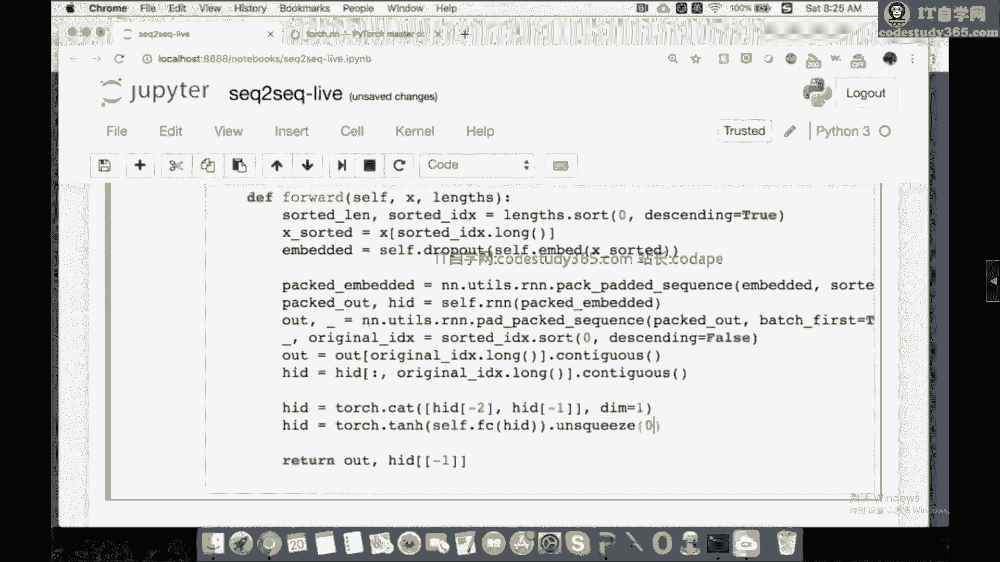

然后把他的hit传进去，大家还记得我们这个是怎么来的吗，就是我这个LON的这张图片里面，注意这个hidden hidden size，它是把T跟HT拼到一起。

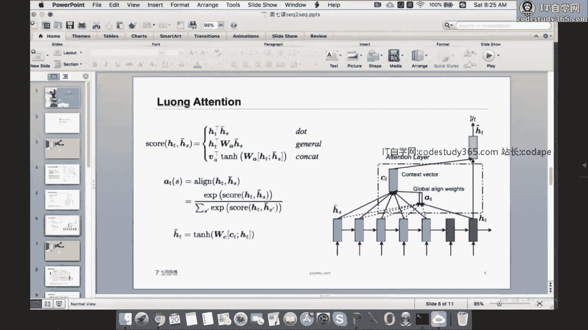

然后再乘了一个WC，再成了一个ten h，所以这里是为什么我要写tan h f c这个HT hit，然后而且HD是把两个HIIT给拼到一起，其实我还应该把一个啊。

但whatever这个是我们我们要的这个hidden hidden size啊，我们看一下这个代码有没有问题，应该应该问题不大，如果有问题，我们再回过来debug，这是我们的encoder。

然后呢我们要写我们的attention function，注意attention function干的是什么事情呢，实际上他是要做的是。

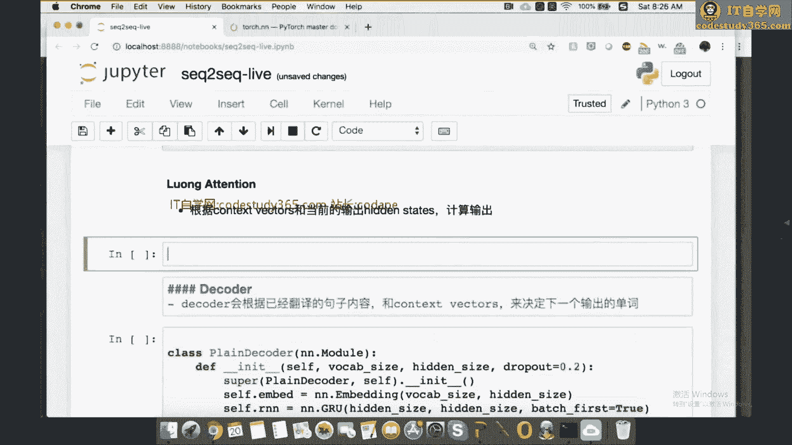

也要实现的是，我们这个就是我得把这套function都给实现出来，就这个scoring function跟这个soft max。

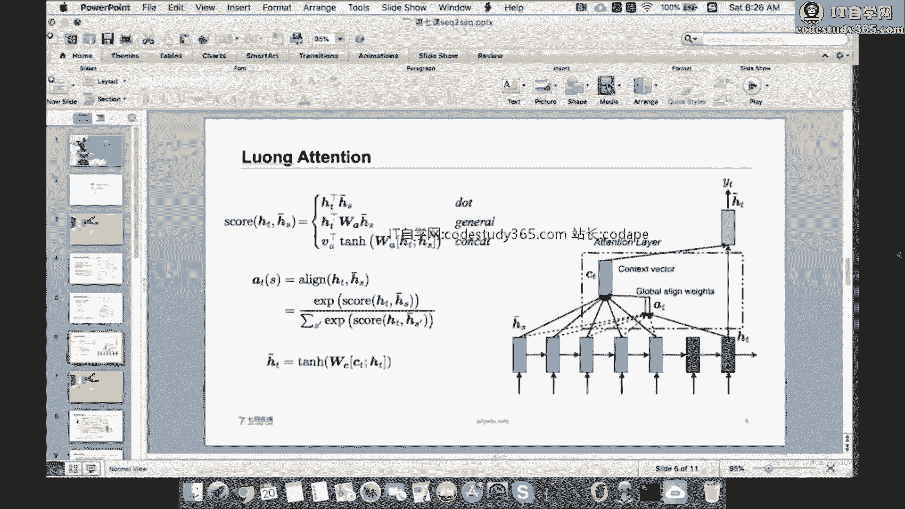

那我们这里就开始写一下class attention，And the module def，Init self encoder，hidden size跟decoder hidden size。

我这个attention做的事情呢，实际上就是把给我一个context vector，给我一个output的这个vector，给我一些mask，然后我要帮你把，帮你把它一个一个的位置给算出。

这个attention sun出来，那我们就可以做啊，首先还是super attention，我现在考虑我要不要写这个代码，要不我就不写了，我直接给大家讲这个代码。

因为因为我一个是我怕自己写这个代码很长，我怕里面出现bug，浪费大家的时间，另外一个呢时间也比较紧，我就直接给大家讲算了，就这个attention呢啊它的模型主要是主要是这样。

就是你有一个encoder hidden size，有一个decoder hidden size，然后你的输入呢是，你这个forward function呢是我要拿到一个output vector。

首先这个output它是batch size乘以output，length乘以decoder hidden size，然后这个context呢它其实是batch size，Context。

length和encoder hidden size，这个是哪里来的，这个其实是我刚刚encoder的时候，这个out function，这个out就是我的啊。

这个out就是我的encoder里面的output，然后我们知道他应该是啊，应该是encoder，应该是batch size乘以sequence，length乘以encoder hidden size。

这样你就可以拿到这一堆out，然后我要做的是什么呢，首先我要实现的是这个scoring function。

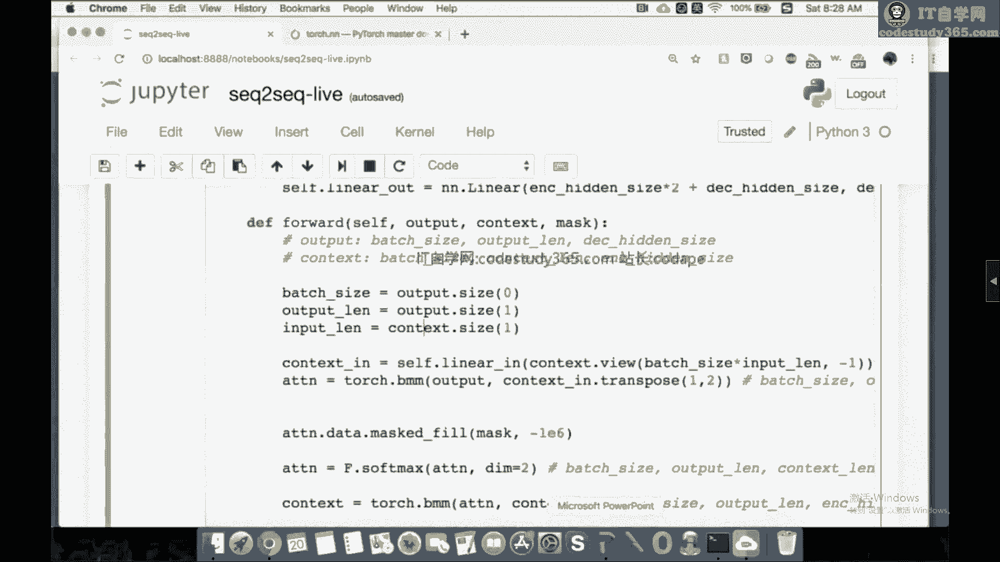

就是我要把每一个decoder的hidden state，跟每一个encoder的这个啊hidden state，做一个这样的scoring function。

然后我要我现在要做的是这个binia function。

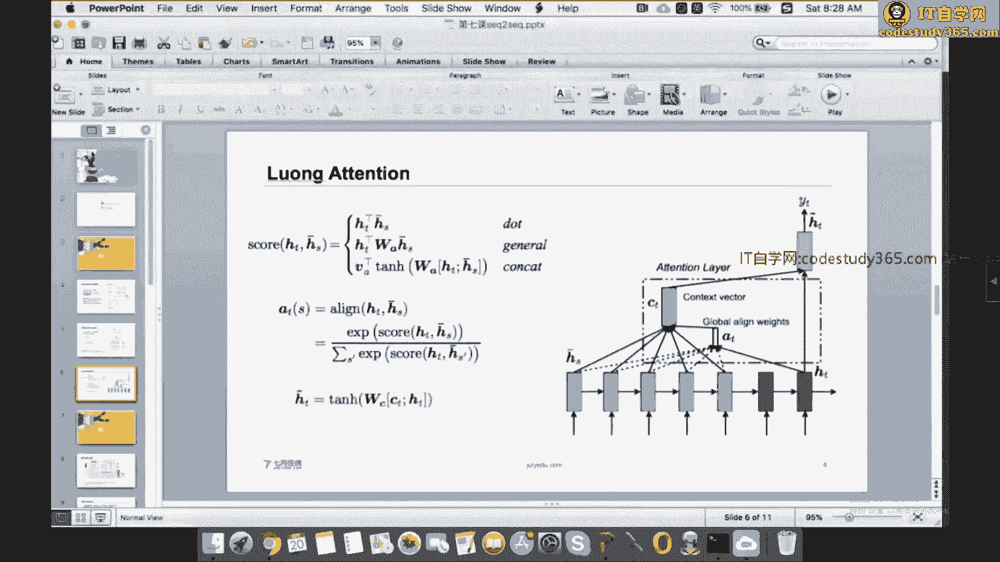

你怎么实现这个百里IFUNCTION呢，实际上我的做法就是直接用这个linear in，并且把bias设成false，这样就是一个线性变换，就是不是一个fine transformation。

是一个纯的纯的一个matrix multiplication，然后我直接把这个二乘以hidden size，转成decoder hidden size。

所以你看到我直接把context变成这个context in啊，然后再用这个这个torch的这个BNN，就是batch matrix multiplication，我直接用这个output。

因为因为这是什么呢，就是我我当我做完这些，我应该把它过来，就是当我这样做完之后呢，我会把嗯就原来它是batch size乘以output，length乘以encoder hidden size。

其实是二乘以encoder hidden size，然后呢我会我会直接把它转换成decoder hidden size，用一个这样的linear变换，然后呢拿到这个之后呢，我们就可以做BM。

就是用这个用用下面这个啊，就是当你用这个output，output做乘上这个context in之后呢，他就会帮你转换成这个contact这样的一个形状，这个是怎么样转换的，我稍微跟大家讲一下。

就是这个首先我们知道context in它已经是，已经是这个shape了对吧，然后我们的context，然后这个output呢又是这样一个shape。

所以如果你写context in点transpose之后呢，如果你写点transpose之后，它的decoder hidden size会到前面来。

所以你算batch matrix multiplication之后呢，它就会变成batch size乘以乘以这个output，length乘以，乘以output length。

然后乘以这个应该是input length，Context length，就是它本来是batch size乘以啊，context lab乘以dog hidden size，这样点击完之后呢。

它就会变成batch size乘以output length，乘以context length。

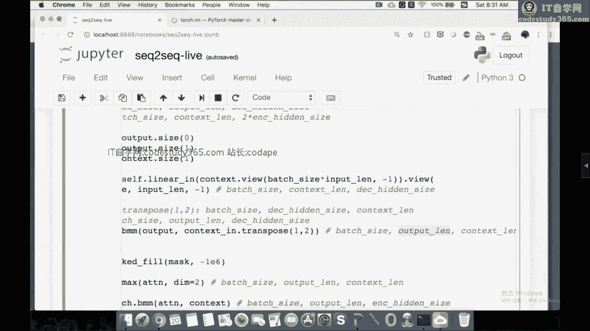

这个呢就是我们我们在这张图片里面，想要拿到的这样一个啊一个matrix，因为我们知道这个score HT s，这个HT呢表示的是输出的这个输出的长度，而这个HS呢表示的是输入的长度。

所以你最终会拿到这样一个matrix，是一个输出长度乘以输入长度的matrix，然后你再对它做一个soft max。

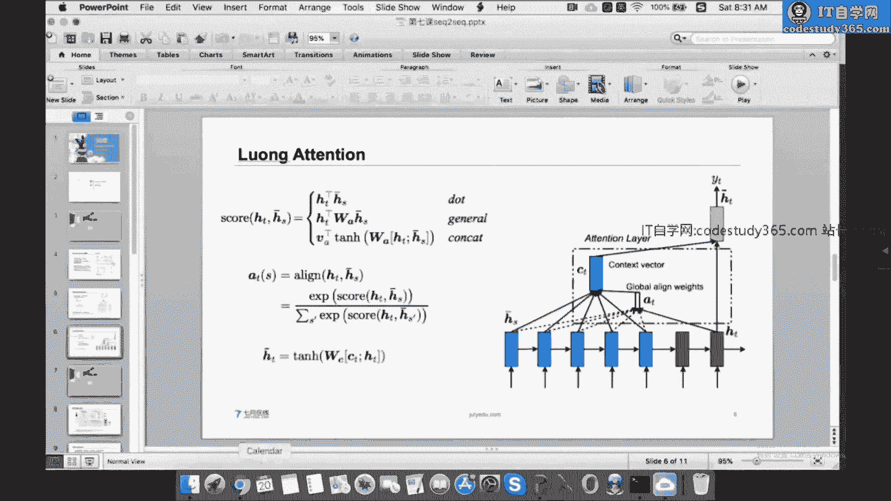

所以我们在这里后面我就做了一个啊，点soft max dimension等于to，这样他就会把这个context less，这个第三个维度给给啊。

normalize成一个provision distribution，然后在做这个之前呢，就是必须要做一个啊，这个为什么要做mask f呢，因为有一些位置它其实不是句子，有一些位置是mask。

所以mask你必须要把那些其实不是句子的，那些其实不是单词的位置，你得给它mask成一个非常小的值，就这我这是负的啊，10万这是-100万，好像对，这是-100万，就是一个-100万呢。

就是几乎不会影响你的soft max，因为soft max它是要E的这个次方，E的这个-100万次方基本上就是个零，所以它不会影响你的soft max，然后这样我拿到了，拿到了这个content。

然后我再用这个attention去乘上这个context呢，你就会拿到waited sum of the context，就这个waited some of the context呢，就是你的啊。

就是你的新的这个context variable，然后你把context跟原来的output拼到一起，然后用这个teenage加linear out。

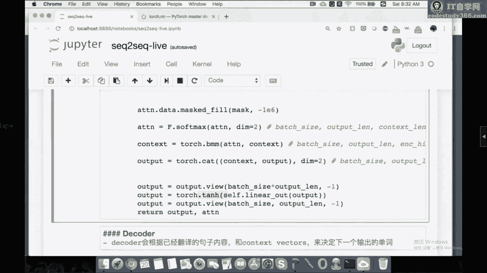

就是我们这里的slides里面讲到这个ten linear。

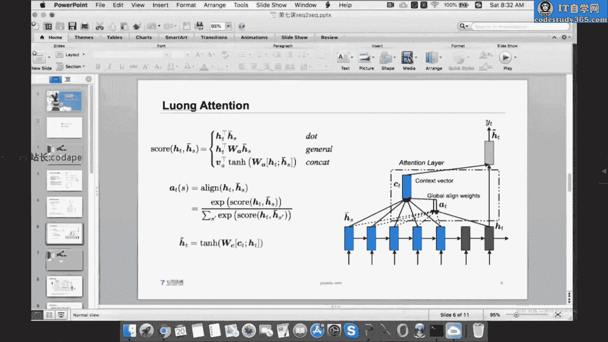

然后再做个concatenation，这样你就可以拿到啊，你想要的这个attention跟这个output，然后我快速总结一下，就这里attention究竟干了些什么事情，其实就是这这一段代码来实现的。

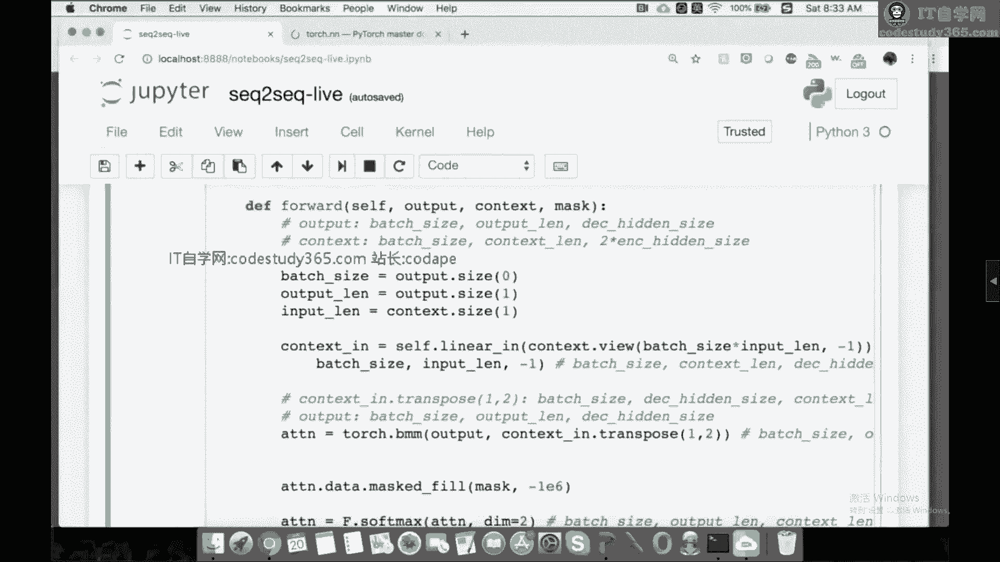

就是我这个slides里面要做的这个HTWA，H s，然后注意HT呢是表示output length的长度，HS呢是context of length长度，所以你其实拿到的是一个matrix。

并且前面还多了一个batch，所以你看起来代码会会非常的复杂，就是有一个batch，然后还得后面有一个output。

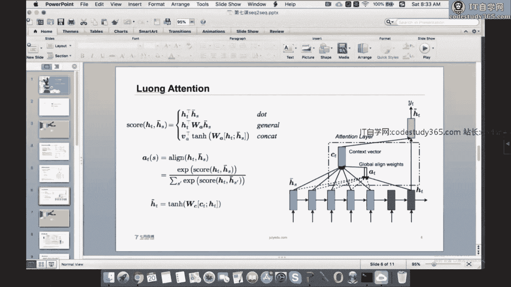

length和context length啊，就是用这个BM，如果你没有batch的话，那你就是一个torch点matrix motiplication，但是因为这里有一个batch。

所以你还得做个BM，然后你得把他的一些一些masking的位置，给mask掉啊，最后再做一个拼到一起之后做一个线性变换，就拿到了这个模型，然后最后呢。

我们把这个decoder也写成一个带mask的decoder，带mask decoder的，它的特殊之处在哪里呢，就是首先我们得把，首先的一个区别就是你得把这个什么in bed，Encode。

Hidden state，Decode，Hidden state，全都写上来嗯，然后把这个batch first写成true，然后注意它还是一个单向的LS单向的GROO，而不是一个双向。

然后另外一个区别呢就是写一个create mask function，就是根据X的长度跟Y的长度，建一个XL乘以YLAN的长度，就是mask of size of shape，XLN乘以YLAN。

就你得需要这样一个mask，一会用来做那个attention的操作，然后呢这个forward function呢大部分是一样的，唯一的区别就是啊，你的这个output不是像我们原来的那个output。

是直接一个就是这里的output就是你的output，但是加了这个attention之后呢，你这个output必须用这个attention function来计算。

这个attention function，就是用我原来的output sequence，跟我的context matrix来算一个算一个output，然后我们知道这个啊，刚刚有同学问说。

为什么不用全部的hidden，这个context就是全部的hidden，我们看一下这个context是从哪里来的，就是我在我在传入的时候会从啊，我会从别的地方。

就是从encoder里面把所有的hidden states都拿进来，所以我最后的这个sequence to sequence模型呢，我会把呃就这个plain sequence to sequence。

改成sequence to sequence之后呢，我会把所有的encoder output全都当做context传进去，然后length呢还是x length，然后Y呢就是还是Y的部分。

就是这个decoder的部分，就会变成是一个所有的所有的这个encoder output，而不只是把最后一个hidden传进去，当然hidden还是传进去，当做第一个hidden state。

然后我们可以看一下啊，有了这样一个模型之后，它的效果会什么样子，然后我就可以，我们这里要先定义一个模型，就是这个新的模型应该是encoder。

a embed size等于hidden size等于100啊，虽然我这里现在多了很多参数，但是我还是把这些encoder等于等于encoder market size，直接把这个。

把前面的那个模型给copy下来就可以了，主炮还是没有变，然后这里多一个in bed size，等于这个bad size，然后我们就可以写embed size等于in bed size。

然后我们的encoder hidden state等于这个，然后我们的decoder hidden state呢也等于这个，然后我们把这三个部分全都这样传进来。

注意这个decoder和encoder都不是plane的encoder，Decoder，然后sequence to sequence也不是一个plane，Sequence to sequence。

这样基本上啊我们看一下encoder hidden state，Invalid syntax，应该是我这里少加了一个逗号，Decoder is not defined，可能是我刚刚少跑的这个模块。

这样你就拿到了一个比较复杂的模型，然后我们就可以开始吹，然后然后你就会发现这个啊，这个这个其实是attention attention的encoder，decoder模型，他训练的速度应该会慢一些。

因为主要是attention的那个计算会慢一些，让我们看一下，我们一会可以再把这个translate给拿下来了，这个是前面的这个translate的模型。

然后我们这里可以再translate1些句子出来，看它会不会有更好的效果，我们这里训练了多少，我这里训练了30个epoch，我还想说，上面其实训练了20个epoch，这样好像不是很一致。

但是问题也不大嗯，差了十个亿炮可能还是有一些影响，然后我们稍微看一下，就是你部分正确，他的袋子多少时间是什么，我今晚有空啊，这个翻译的非常好，我今晚有空，这是你的书，这个也不错，他们在午餐。

然后她很美的脚，多多年轻的她会有训练，别被肤浅，有人有人看你，有人在看着你，我喜欢音乐，汤姆没有照顾孩子，汤姆在做了继续，下周下一步我做了一件事，我犯了一个错，所以这个其实也不是特别好。

但是感觉也还可以吧，然后我来看看同学们有没有什么问题，有个同学说mask到底是怎么工作的啊，如果你问的是这个是attention，这里的mask是怎么工作的呢，嗯我可以跟大家说一下。

就是我们知道你的你的context呢，首先这个context它其实是一个fetch size乘以context，length乘以二乘以hidden states对吧，但是呢这个它其实里面有好几个位置。

是mask掉的，就这context length的最后几个单词，可能不是真的单词，然后output呢它是output life，但是它也有几个位置不是output，所以当你把它乘除，当你相乘之后。

做这个batch matrix，multiplication变成batch size乘以output，length乘以应该是BTX乘以context，less乘以document乘以这个啊。

batch size乘以decoder size乘以context length呢，到底是哪个地方，我是不是讲错了，output是啊啊，我想讲的是这个就batch size，Output，Lth。

Context length，就这个部分呢实际上有好几个位置，它是它是错的，就是那些出来的数字是没有意义的，就是那个score，我希望把它mask成一个无穷小的数字。

所以我才会在这里做了一个master fill啊，就是那些那些假的位置，那些masking的位置，他应该会拿到一个零的attention score，他如果得到0detention score呢。

那你最后做这个，你做waited sum的时候，他的那些位置也会得到一些，无论是encoder还是decoder，他都会拿到一些非常小的这个权重，所以会拿到一个接近零的一个vector。

呃这个是mask，然后另外就是在decoder的时候，我要create这个mask，create mask的方法，跟刚刚那个一维mask的方法基本一样，实际上我是先建一个x max。

再建一个y mask，两个mask都建好之后呢，我把它给乘起来就好了，实际上就是这两个之中只要有一个是零的话，它就是零，所以你就把那些地方给标出来就可以了，就是你给它相乘之后。

如果有一个地方它是它是mask的话，它就会变成一个零的这样的一个mask，嗯那我要不代码部分我就讲到这里，因为啊我昨我昨天晚上，就昨天上传的代码里面有几个bug，然后我现在已经修复掉了。

我到时候会重新上传一下这个代码，然后大家可以在看着我这个代码学习一下，然后呢因为因为我前面已经讲过了，就是这个代码我会建议大家自己尝试一下，用对中文做一些分词啊，你们可以写，我来这里写一下。

就是to do尝试建议同学尝试对中文进行分词，就是我不知道这样会不会，让这个模型的效果更好，我没有做过这个实验，但是大家可以尝试分词之后试一下，能不能能不能解决它啊，能不能让模型的效果更好。

然后有同学说感觉这次代码好难理解，其实是挺难理解的，很多时候大家都不会写，就是嗯很多时候大家一般不会自己写，Sequence to sequence，因为有很多细节在里面，有很多要调的地方。

所以大家一般经常跑实验的时候，会直接用别人的代码，比如你可以用open m m t t y嗯，具体的怎么用我就不讲了，但是实际上它的这个documentation里面非常的简单。

就是你只需要把把你的输入和输出，调成他需要的格式，然后你直接用训练数据已经在已经在群里面了，你直接用他们给你要求的格式处理好之后，来来做这个训练就可以了，所以一般常用的一个是open mt。

就是我一般做各种实验，如果训练到sequence to sequence，我一般不会自己写，而是用比如OOMT的代码，或者说另外一个我还没有用过alan and lp啊，M m m n lp。

他们也提供了一些toolkit，我不确定他们有没有有没有sequence to sequence，Sequence to sequence，我的感觉是。

他们应该会有一些sequence to sequence的部分，可以帮你做这个事情，我们可以看一下他的models里面有没有sequence to。

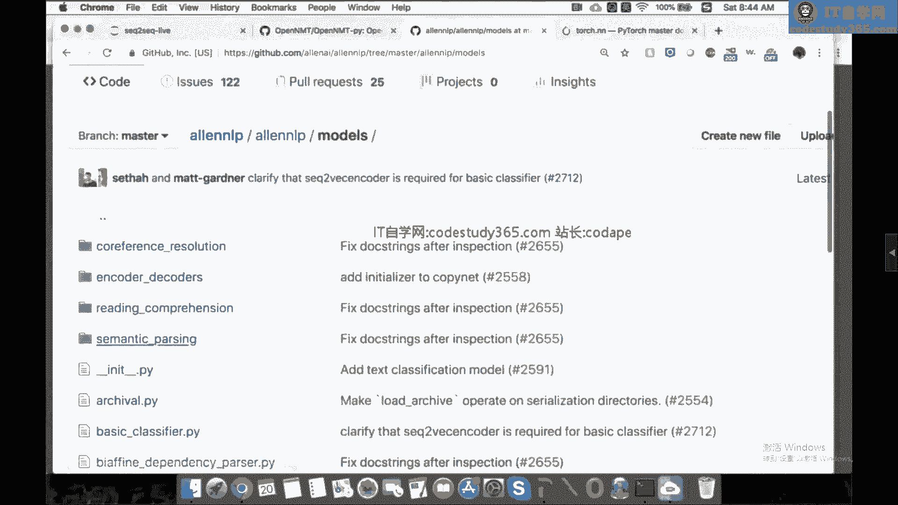

但他有什么encoder decoders，然后有simple sequence to sequence。

就是有一些现成的代码可以直接拿来用，我没有用过NLP，但我知道他们做的很好，就是论文发了非常多，然后实现了非常多的功能，然后open n m t呢是比较常用的，常用的这些东西，然后有有同学说。

能不能提供一下做NER的代码，其实我可以上网，直接帮你们找一个比较好的open source代码，你们就直接拿人家的代码来用就行了。

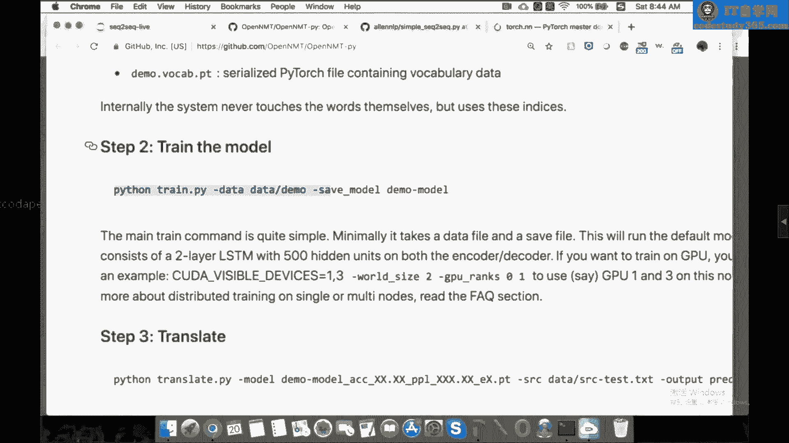

一般来说我知道NNNNLP。

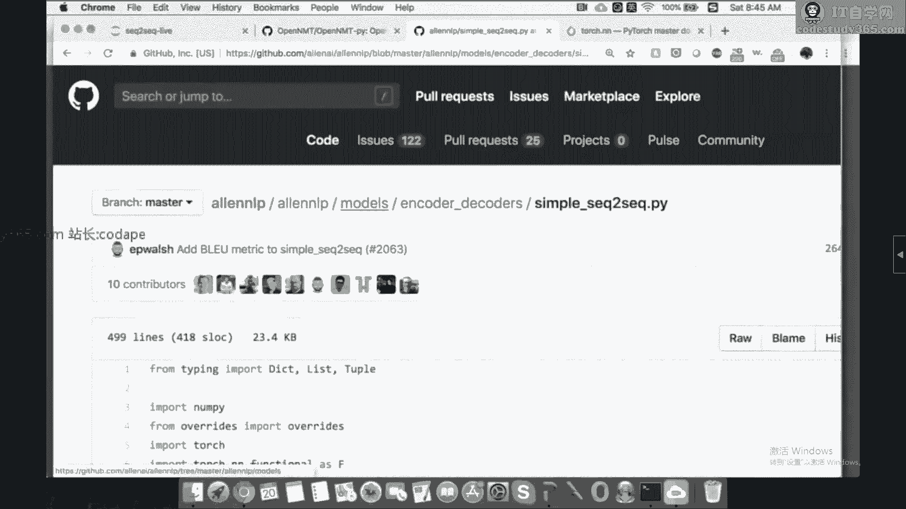

提供了各种你想要的功能，我怀疑他也有MER的代码，我们来看一下他有没有N1啊，Correference resolution，Encoder，Decode，Semantic passing。

一般这种什么c i f tiger，这种就是可以用来做NER的，但是可能你还要自己做一些操作，其实同学们直接上网随便搜各种代码，可以搜到很好的那种代码。

named entity recognition啊，Pytorch，一般来说你找那些大数非常高的就可以，就这个是LSTM加CRF的，我看一下他star高不高，其实100一般这种149赞的就可以啊。

这种149赞的基本上问题不大了，就是你可以可以拿来跑，就是我一般是怎么样找代码的，可以跟大家说一下，就是你上来之后先看一下这个赞数高不高，赞数够高的，一般来说就是质量还可以。

那你看一下他这个医术有没有一堆问题，如果如果比较活跃的话，一般就会比较好，然后你这些close，你就说如果你看到这里有超多的这个bug，在里面的代码，可能你到时候自己跑起来也全是bug。

如果这里的那个医术比较少的话，那可能就会比较好一些，然后你可以直接直接下载人家代码跑一下，但应该还会有更好的，因为我知道PYTORCH的tutorial里面就有个，PYTORCH的。

它的tutorial里面就有个NER的模型，就拍拖视点，OG的tutorials里面有一个NER，如果我没有记错的话，大家可以在操作上面找一下，应该会有一些NER的问题，如果不是的话。

那应该是CRF还是conditional，好吧，我可能记错了，但是我记得是看到过具体tutorial的同学，可以直接抄啊，然后现在还有什么要说的，就是这些sequence to sequence的代码。

同学们都可以看，就是如果你刚开始入门，可以看这些tutorial，然后然后我建议可以用这个open mt，点PY来做这个事情，然后NER其实还有更好的，那我觉得NER我觉得更好的实现是。

直接用ELONER，就是ELO里面我记得他有example是named entity，如果找不到的话，对他这里有一个ELO的NER实现。

但我不知道这里有个n e RL o g on net for details，所以说它这个里面也有也有NR的实现，就是ELO的效果应该是最好的，基本上除非BT，有人说。

BT的安妮亚的效果达不到paper里实现的效果，所以可能ELO是最好的啊，就是ello fighting的一个模型做NER，然后我要找一下他这个究竟在哪里，同学们可以自己去这个repository。

找一下他的NER的模型在哪里，就是应该是他在这个里面，我记得应该是有的嗯，因为有同学问到了安妮亚，我就把它写在这，对就是BT的paper里面的效果可能声声明的更好，但是据我所知。

好像大家都复现不出来那个实验，所以就可以暂时不管它，然后我们下一节课会讲一下，稍微详细的讲一讲，这个ELOBT跟g p t two这三个模型，以及以及这个阅读理解的问题，嗯啊对。

最后我们这节课还要简单的讲一讲，这个聊天机器人啊，为什么为什么把聊天机器人在这一节课讲呢，因为因为就前两年出现了很多paper，讲，怎么样用sequence to sequence模型来做聊天机器人。

然后比较有名的一篇配比较有名的一系列work呢，都是有一个叫李继伟的人发了很多paper，李他发了，他发了很多这个关于dialogue generation的paper。

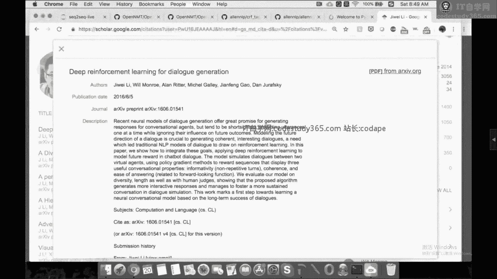

这个dialogue generation呢，就他大家可以随便打开一篇，比如他引用量最高的一篇，Deep inforcement learning for dialogue generation。

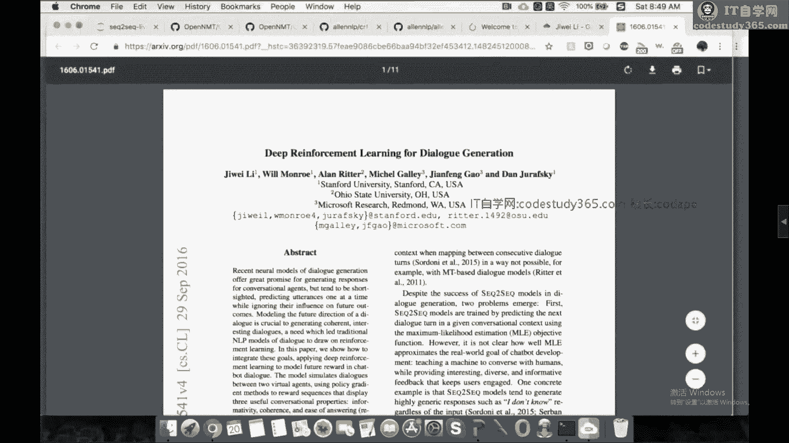

这一篇文章呢，呃他的这些大部分文章的思路都是在sequence to，sequence上面做一些优化，比如说加reinforcement learning啊，加一些别的特别的reward。

用game来做啊，然后然后就可以做这些对话，但这些对话呢，实际上实际上啊都没有办法用来做产品，就是这些只能说是玩一玩这个模型，就是你真的拿来做各种任务的时候，这个模型它是不reliable的。

因为我们知道sequence to sequence，这种generation有很多randomness在里面，就是你任何事情都有可能发生，你很难control，但是不妨碍它这是一个很好很有趣的实验。

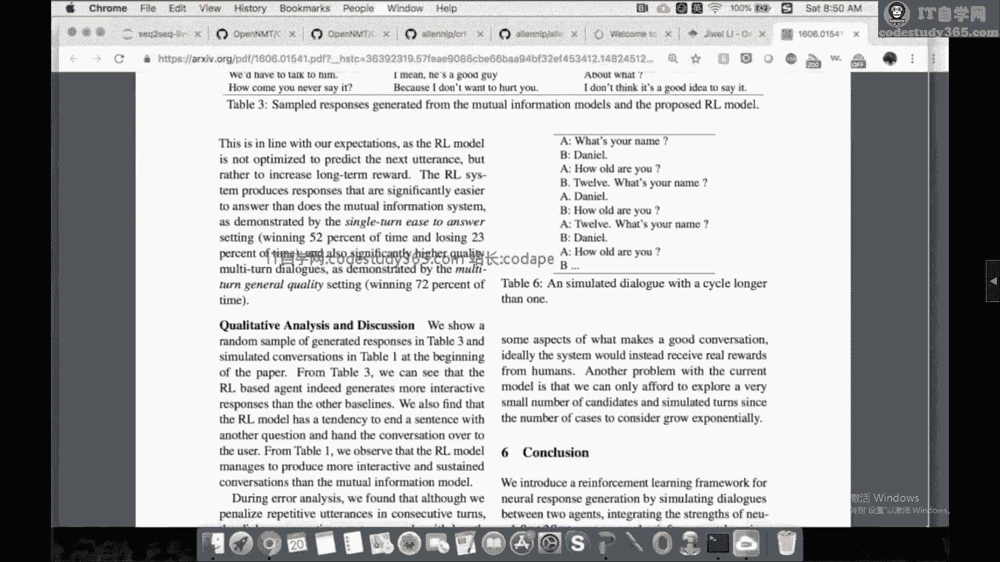

所以感兴趣的同学大家可以，我这里放了一系列的，就是大家可以去看的数据集，就有什么self dialogue，还有这个movie script，就是这个电影对白的一个CPUS。

还有you want to这个数据集稍微有点奇怪，因为全都是讨论you want to这个系统，讨论各个电脑问题的，然后还有一些同学整理的dialog datasets，同学们可以直接把它下载下来。

然后用这个sequence to sequence那个来来实现它，然后有同学问google的dialogue flow，用的什么实现方法呀，其实我也不知道，就是一些公司里面内部是怎么实现的，我也不知道。

就是我了解的东西，大部分都是通过那个网上能读到的代码去看啊，网上能读到的代码和读到的那个论文去看的，就公司里面大部分，虽然我不知道他们具体怎么实现的，但是我知道大部分的这个公司里。

实现的聊天机器人的架构跟有一个比赛。

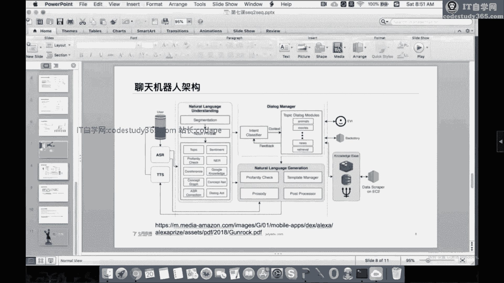

不知道大家知不知道，叫做alexa price嗯。

这个是亚马逊每年搞的一个，做聊天机器人的比赛，然后呢他们这个做的是一个open domain，就是闲聊的机器人，他没有任何的任务，因为我们聊天机器人基本上你可以分成两类啊，就一类是有特定任务的。

比如你打个电话去餐馆订订饭嗯，订订一个饭店的位置之类的，然后呢那种是有一个特殊任务的聊天机器人，它的他的聊天内容非常局限嗯，就那种任务型的聊天机器人是一种类型。

另外一种类型它是一种open domain的，跟你随便闲扯的这种聊天机器人，但实际上他也做不到跟你很好的闲扯，所以他还是有一个限定在里面的，他总是只只是讲一些他知道的东西。

那这种聊天机器人一般是怎么做的呢，就是这张图是082018年的这个ALEXAPRISE的，这个这个冠军，他的这个架构，它的主要的做法呢就是啊分成这样几个模块，一个是就是user讲一句话进来。

这个ASR叫acoustic speech recognition，就是把你的语音翻译成文字，那翻译成文字之后呢，他就首先第一步叫做natural language understanding。

它会是一些很传统的，你可以用neural network，但是都是一些偏分类的问题，和命名实体识别的问题，他就把里面的句子的这个这个主题是什么啊，他的这个情感是什么，然后他有哪些命名实体啊，它有哪些啊。

它有哪些这个信息都给你关键词都给你抽出来，然后给你整理成一些key value pairs，然后呢传进到一个叫做dialogue management，这个dialogue management里面呢。

就是做了一些什么intense classification，就是数字，就是user，你要了解这个user到底想干什么，就他是想跟你聊这个，他是想跟你聊天呢，还是跟你提问呢，还是在想要转换一个话题呢。

还是想要让你重新重复一遍你的上一句话呢，然后呢你在这dialogue management里面呢，它留下了很多，它其实是存下了一堆你想要的关键信息。

虽然这是一个open domain dialogue chat bot啊，但是如果你想想，如果你是一个订饭店的机器人呢，它里面可能就会留下，说你你要订的饭店在哪一个地理位置，你想要定几点钟。

你想要订什么，就是你把你每收集到一个关键信息，你就存在你的这个dialogue manager里面，把这些信息给存下来，存下来之后呢，下一步再根据你，比如说你是个定犯的机器人呢。

你就会决定下一步我想要比如说咨询问这个user，要更多的信息，那你就会再进入到这个natural lank generation，这个generation呢大部分时候是template。

based和retrieval base，就是那些sequence to sequence这样的模型，在大部分的这个工业生产的环境下，其实不太用得上，因为因为做不到生成那种很自然的语言。

所以大家一般都是定义了超多template，你想你想象一下，如果我开了一家公司是google，我可以请很多人帮我写很多很多的template，就是然后然后呢就是这样，你就可以根据不同的这个intent。

根据不同的topic，根据不同的sentiment，就根据各种各样的condition，然后来给你决定你生成哪一个template，然后这个template里面呢可能有一些值是Missing的。

比如说这个用户的名字，它可能是miss掉的，但是呢你可以根据你的dialogue manager里面的信息，把这些该填的地方都填进去，然后生成一句你想要说的话，那生成出来之后呢。

你再传到这个TTS叫做的一些库存，就比如有些knowledge base啊，有一些你收集来的新闻啊，有一些额外的template，就是你可以从外面去搜，或者question answering。

它就包括这个bi的这样的一个库，能够帮你解答一些问题嗯，就这个是一般来说造的一个比较复杂的，聊天机器人的架构，就是啊如果是一般那些比较大的公司，他们的他们的做法，其实就是在这个框架上面不断的填东西。

就是你一个一个pipeline填。

然后呢你其实有很多的pipeline，这个就像就像我现在用google搜索的，比如说我说who won the world cup，2018。

他就会告诉你friends national national football team，这个是什么原因呢，是因为google背后其实有很多的pipeline，同时在处理你的这个文字。

就它有纯文本搜索，你如果拉下来有一些这种什么world cup，2018就是who one world cup的这种，就是一个纯文本的搜索，从网页里面的文字去搜，但是像像上面这种呢。

其实是另外一个pipeline，它是有一些这个question，answering component在里面，所以你做transpose呢有一个简单粗暴的做法。

也就是不停的加pipeline，你每进来一句话之后，我后面有各种不同的不同的SUBTRANSPORT，小的transport帮你处理你的语句，然后给你返回，他认为是应该返回的阈值。

然后呢你后面还可以有一个ranking model，就是把这些所有可能的回复做一个排序，把分数最高的那个排序输出来，作为你的真正的回复，因为这个是啊，设计聊天机器人的一个基本的套路。

然后讲了主要的component有这个自然语言处理，自然语言理解的一些部分，还有这个聊天内容的管理，就主要是涉及到这个聊天状态的一些存储，可以知道我之前已经聊过什么，有哪些问题是需要聊的呢。

就是用这个语言生产来提取一些句子，然后填充这个template，当然你也可以用神经网络来生成，神经网络的生成，一般来说是不那么靠谱的嗯，然后最后是对可能的回复做做一个排序。

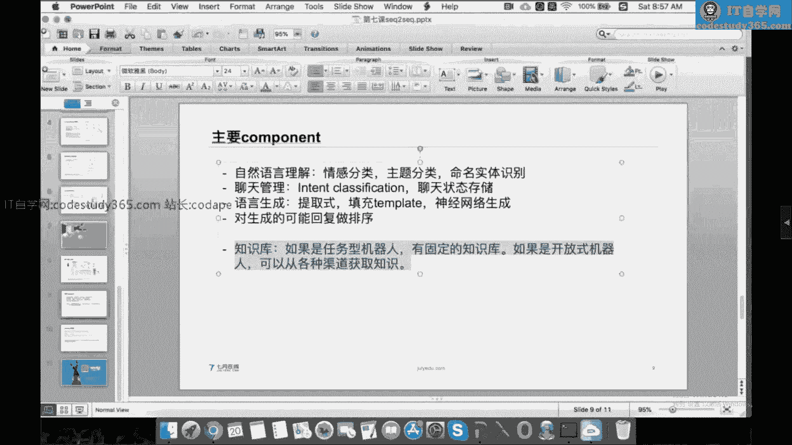

好那这是这三个模型，这三个模块就是大家只要尤其把这个，mask的部分给搞清楚了，就没有什么问题，然后同学们知道，即使你不做这些max，肯定也能训练一个reasonable的模型。

就是因为因为那些被mask的部分，大部分都是padding，就是padding，你如果直接给他一个special token叫做padding，然后来做呢，你大概率也能训练一个可以用的模型。

但是效果会差一些，同学们自己课后都可以试一试这种，所以就如果你看不懂这个mask在做什么，你也可以把mask给扔掉，然后呢就是实际上在工作啊，或者是什么自己做项目的时候。

我不太建议同学们自己写这样一个复杂的模型，就直接用用人家开源的模型就行了，然后这个open nm t上面有很多的component啊，就这个translation，还有一些很多的细节问题我都没有提。

就同学们可以课后去学去了解一下，就是有一些常用的一些变变换，比如说有这个pointer network，大家可以自己去上网查一查，就是这个pointer network copy mechanism。

就是能够直接从原来的这个输入当中，去copy1些内容过来，就是我们可以想象它可以用在什么地方，就比如说有一些语言，有一些单词英文翻译成中文是翻译不好的，你可以直接从那个地方copy过来。

然后就这些sequence to sequence的模型，也经常被用到这些，什么文本摘要之类的问题上面，就所以这个时候用copy mechanism就非常有用，包括这个point network。

其实是跟copy mechanism非常像的一个东西，然后还有一些常用的是coverage ross，Coverage loss，就是嗯有一些东西我已经翻译过了，我不想再翻译一遍。

因为翻译的时候经常会出现重复的翻译，就有个有个单词我翻译过了，我又翻译了一遍，然后这个coverage loss，就可以保证你那个已经被翻译过的东西，尽量不会再被翻译一次。

然后还有一些常用的变化是什么呢，啊还有一些啊，我想到了可能在家，但就是这些这些内容都是我没有提到的，但是对于翻译非常关键的东西，但是一般这个比如open mt已经帮你处理好了，这个事情。

然后还有一些常用的，就是还有一些我没有讲到，就是其实有一些有confsk to seek，然后现在最火的其实是transformer模型，因为因为transformer啊，这个模型是比较好，会快很多。

然后呢尤其是因为最近BT这么成功，大家对transformer就更感兴趣了，但是transformer这个模型呢也比较难训练，就我自己训练的，我自己训练transformer的模型。

一般都会比普通的seek to seek要差一些，可能是我训练的方法不对，但是就是如果自己写的，肯定就更训练部队，就是我用后背mt做transformer的，效果也不是特别好。

但是有一个有一个模型叫做tensor to tensor，它是用猜测flow写的，就是这个这个模型你直接下载下来之后，这个代码直接下载下来，可以跑出非常好的效果。

是的就是我一般写代码都是从人家的代码上改，就是自己从头开始写的话，你可以当做一个练习，但是有时候有一些很细节的地方你可能不知道，然后你写了一点小小的问题，可能让你的模型效果变得非常差。

然后你就会怀疑是不是自己哪里写错了，可能是你没有写错，只是某一个地方一个很细节的地方，你没有注意到之类的，尤其是刚开始初学的时候，可能就可以直接直接先先用别人的代码好，那我们这节课就给大家讲到这里了。

然后我会把更新好的课件发到群里，嗯那我们就这样了。

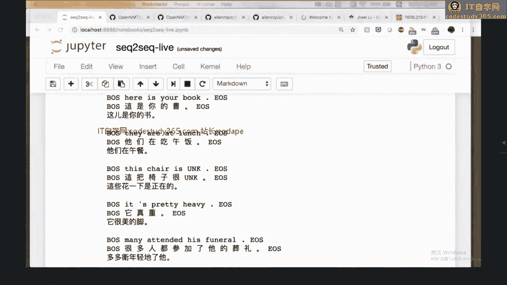