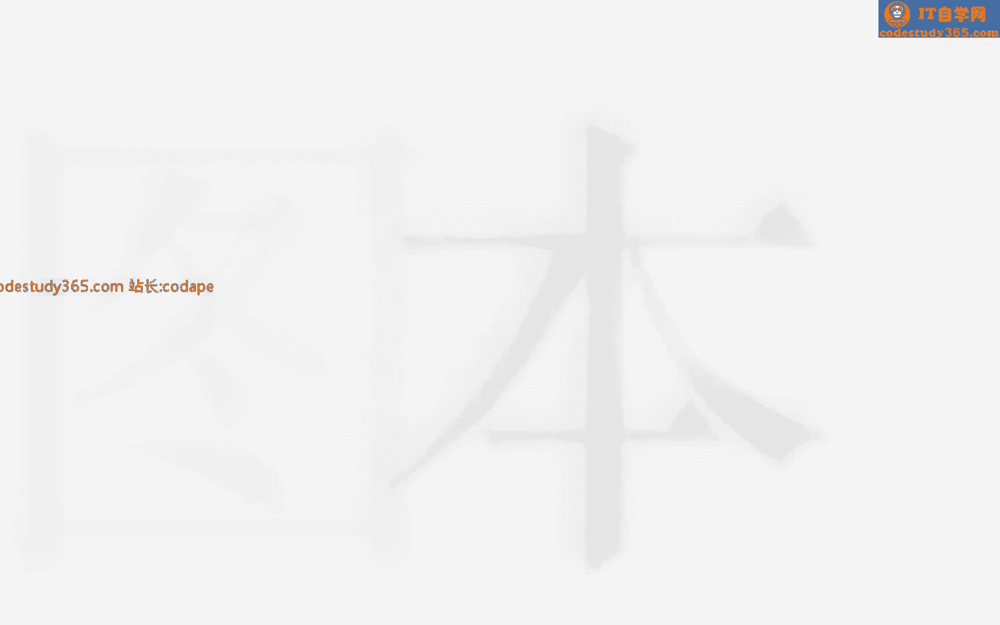
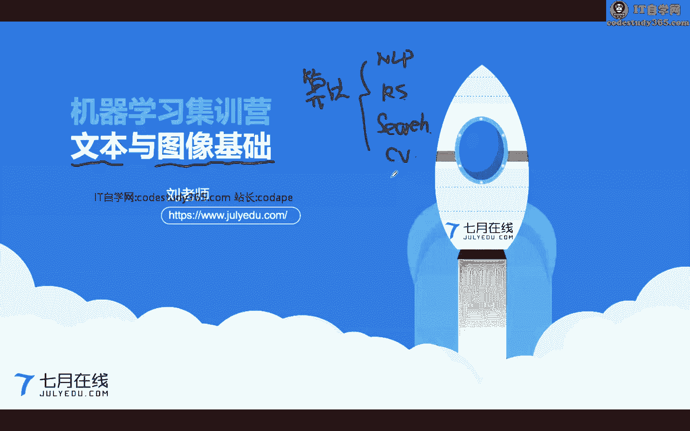
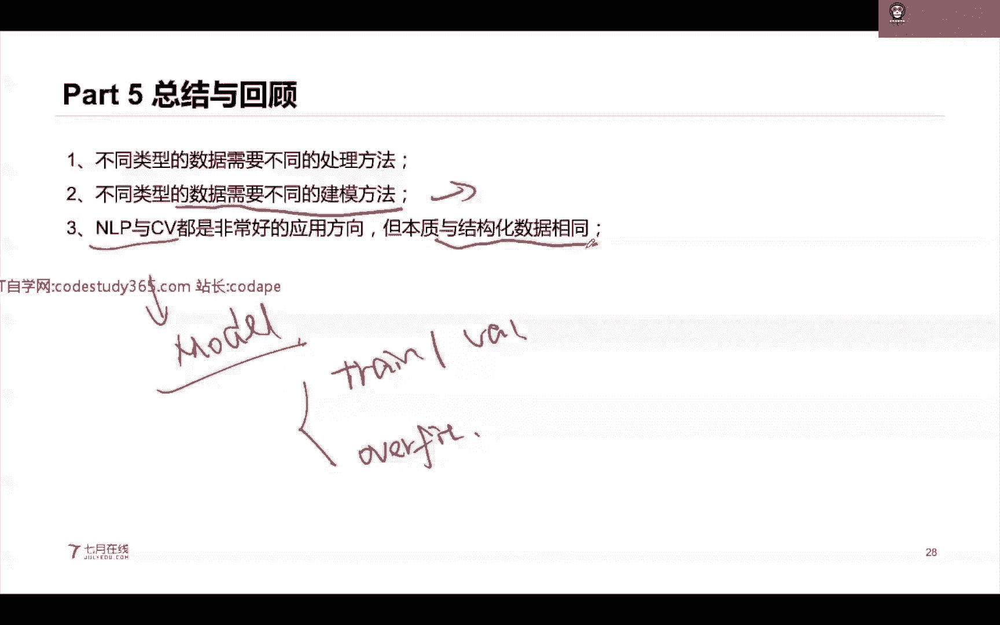
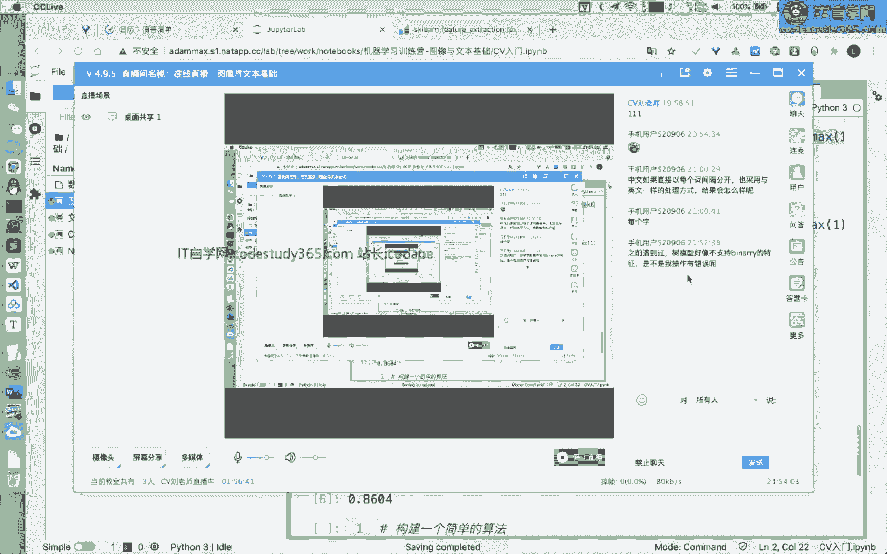

# 【七月在线】机器学习就业训练营16期 - P12：在线直播：3-图像与文本基础_ev - IT自学网100 - BV1Z9T5ewEKL

呃各位同学大家晚上好，然后我们今天呢就给大家讲解，我们的文本和图像基础啊，嗯这个呢就是很多同学比较关心，因为我们现在很多的一个呃岗位呢，上网工程师的岗位呢都是跟要不跟文本相关，要不就跟图像相关对吧。

所以说很多同学在嗯，就是说也是呃，非常建议可以，提前把我们这节课给好好学习一下，呃我们现在一个就业啊，就是说算法工程师对吧，我们的算法工程师，算法它里面是分方向的，不是单纯的就是算法工程师。

我们在上节课，其实上次直播也就是前两天直播的时候，我们也说了啊，因为我们具体任务它是分任务的，所以说这个地方我们的算法呢，也是分具体的一些方向，AP搜索额推荐系统，还有我们的搜索，还有我们的CV。

还有这种结构化的，不同类型的一个算法工程师，他的一个要求的技能是不一样的，所以说我们在学习的时候。

你肯定是要分专分方向的进行学习的，我们首先呢给大家看一看，我们今天所讲的这个啊，我们今天的内容分为四部分，第一部分呢是我们的一个数据的类型的介绍，然后这个部分呢，其实在上节课我们也给大家介绍了。

然然后呢我们这个地方呢再给大家介绍一下，然后第二部分呢做一个文本处，文本数据处理的一个基础，第三部分是图像处理，数据处理的一个基础，然后第四部分是我们的实践案例，好我们首先来看第一部分数据类型呃。

我们今天的课程呢就主要是给大家嗯，讲这些具体的一些呃，就是说知识点啊，然后有一些具搭配一些具体的代码，然后我们的PPT呢可能会稍微简单一些，我们的具体的一个数据呢。

其实在我们在上节课上次直播时候给大家说了，我们的具体的一个问题，以它的一个其实跟我们的数据相关的，我们有这种结构化的数据，半结构化的数据和非结构化的数据，那么在这个地方呢，我们具体的一个数据集呢。

它的一个类型其实是跟我们的任务强相关的，一般而言我们在做一个呃任务的时候呢，首先是把它划分成结构化的数据和，非结构化的数据，结构化的数据就是表格类型的，非结构化的数据，就是不适合这种表格类型的嗯。

结构化的数据就是这种啊，就是说你可以用这种pandas的库，来进行很好的读取的对吧，我们在之前的课程也给大家讲了，我们具体的这个pandas的一些基础操作，然后呢。

我们的一个相当于是嗯这个嗯非结构化的数据，文本图像视频，文本图像视频好，这些呢都是在我们的，就是嗯他的一个非结构化的数据，那么这个地方呢，我们今天给大家讲这个文本或图像啊，当然这个视频呢。

其实它就是我们的一个多帧图像所组所组成的，那么如果是将我们的一个图像，加上我们的一个音频对吧，AUDIO就等于我们的视频等于video对吧，所以说这个视频呢从两部分啊，一个是我们的图像。

一个是我们的一个音频，那么这个地方呢就需要大家可以思考一点，提前思考一下，就是说我们在做一个分类任务的时候，在做分类，这种时候图片分类和文本分类有什么异同点吗，图片分类和E呃。

文本分类它其实都是分类任务，但是呢它的拥有的一个具体的一个数据，是不一样的，那么接下来我们的一个具体的一个嗯，就是嗯所产出的一个模型啊，以及我们的侧重点就不一样对吧，第二个文本分类和租房热度预测。

它有什么异同点，这个做房热度预测，就是我们上次直播给大家讲的这个，two sigma的一个嗯房屋热度预测，那么文本分类，它是一个典型的一个非结构化的数据，我们讲的住房热度预测，它是一个结构化的数据。

所以说这两个虽然说都是分类任务，但是它一个是非结构化的数据，一个是结构化的数据，自然它的一个解决方法也不一样，所以说呢我们在遇到一个问题之后呢，首先拿到我们的一个具体的一个嗯问题，然后就看他是什么数据。

然后就可以找到他具体的一些方法了，好那么我们就开始先看我们的文本，数据处理，对于文本而言，就是说在我们的英文里面，它叫natural language processing，简称ARP嗯。

自然语言处理啊，自然语言它这个地方的一个语言呢不是任何的，不是编程语言，它是一个自然的语言，自然语言就是说我们的一个人与人之间沟通的，这种语言，就是我们的自然语言，就是自然场景下的嗯，或者说英文。

或者说任何人与人之间沟通的这种啊，就是自然语言，那么我们的一个在日常生活中，我们写代码，这种Python，我们的C加加，我们的c#，其实它都是编程语言，它跟自然语言是不一样的。

编程语言它是有规定的一个语法，你不按照他的语法写，它就会错误，但是自然语言它是不会的啊，自然语言就是说如果老师在发音的上面，或者说说错了某些单词，其实不影响主体内容对吧。

所以说自然语言其实它是非常难的一件事情，也被称作叫做人工智能技术的皇冠啊，其实非常难的一件事情，那么咳咳咳，在我们的这个非结构化的数据集里面呢，文本是非常常见的非常常见的，那么在这个地方呢。

我们的互联网上面的一个具体的一个，80%以上的一个信息，都是由文本给出来的，就是说我们去嗯你去聊天啊，或者说在互联网上冲浪，其实很多的一些具体的一个数据，一些信息啊，都是由我们的一个文本所给出来的。

对于我们的文本呢，一个算法工程师，他其实嗯基本基本任务啊，或者说基础的时候呢，都是做一些语言理解的任务，语言理解就是AIU语言理解能力，就是说我们给定一个文本，能不能理解出这个文本中间的一个核心的一个。

关键点，这是第一个第一内容，第二内容呢自然语言生成，这个地方的一个生成是前者，U呢是一个understanding，对吧，庞德斯登顶U呢，呃这个地方的G呢就是generation。

生成生成就是说我们能不能给定一个文本，你去产生它的回答，或者说你知道这含义的情况下，你能够组织这个语言，就是文本生成对吧，这个呢其实机器人很难有这个生成任务，生成的能力的。

因为机器它是没有这种逻辑思考的对吧，在我们的大部分场景下，我们的一些任务呢都是这种NLU的LU的，那么我们在这个自然语言处理，这里面到底有哪些任务呢，其实嗯我们待会会给大家介绍啊，嗯自然语言处理呢。

其实它的一个难度是非常大的，嗯在我们的日常生活中呢，你会看到很多的一些bad kiss啊，就是说这种错立我们看这个啊，就是说一个一男一女在进行相亲的时候，然后男生就发了他的一个名字叫普通对吧。

然后让女生给误会了，然后就是嗯把他拉黑了对吧，其实这个男生他就是叫普通对吧，女生就觉得他是呃，他以为就是说他说呃自己的名字很普通对吧，然后呢这个地方我们再看这个例子，就是说我们的一个具体的一个文本。

在进行嗯理解的时候呢，它在不同的句子里面，它的一个含义是存在不同的，比如说我们的一个有一个新闻，德国最大连锁百货进入破产，然后呢微博他在进行嗯，就是说识别的时候呢。

大家就看哎这个最德国最大连锁百货这个地方，他在做一个判断的时候，就是认为大连的用户都在关注这个新闻对吧，其实这个并不是说，这个地方并不是一个城市对吧，那只不过这两个单词把它组合到一起。

就变成了这样一个情况，嗯那么这个地方其实我们第一次看到这个例子，觉得哎微博的技术是不是很难啊，嗯是的啊，就是我有好多同学之前在微博实习啊，以及工作微博，他们在做一个自然语言理解的时候。

很多时候都没有上模型，都是人工去增加这些关键词，如果去人工去用城市的关键词做一个匹配，就很容易匹配成这种情况对吧，他没有做分词，在我们的一个自然语言的场景下呢，其实它是非常难的一件事情。

因为语言它是一个没有任何规律的，自然语言是没有任何规律的，而且是错综复杂的，语言是可以开放的，它是非常开放的，可以进行组合得到新的单词，这个呢就是如果是英文呢，其实更更严重一些。

我们在英文的一个每年度的牛津词典里面呢，它都它都会新增一些单词，就是我们的一个英文的单词，它是由我们的一个英文的字母所组成的单词，但是呢对于我们的中文而言，其实中文也会出现新词对吧。

我们在今年或者说去年都每年都会在产生一些，互联网上的一些新的单词对吧，所以说这个地方我们的一个机器，他想要不断的去理解这些新的单词，那么他就需要具备这种持续学习的能力。

好语言呢它在有一个上下文的关系的情况下，以及有环境知识的情况下，它的含义是不一样的，就是说一个单词在有上下文的情况下，有环境的情况下，它的含义也是不一样的，好，所以说自然语言处理其实是非常难的一件事情。

在我们的自然语言处理里面呢，我们有到底有哪些常见的任务呢，到底有哪些常见的任务呢，就是说我们常见的啊就是有这个垃圾邮件识别，情感识别和意图识别，这个就是我们的一个基本上，就是一个文本分类的任务。

聊天机器人和智能客服，在我们的之后的课程可能会讲到，其实他是一个对话的任务，语音识别和语种识别，其实这是类似于我们的一个语音相关的，一些任务，机器翻译和魔幻生成，这是其实是一种生成的任务好。

那么在这个里面呢，我们在前面三类就是一个NLU的一个任务，后面一类呢这个是一个n lg的任务，因为因为他是有一个生成的啊，有生成的，那么有同学可能还不太理解，这个地方的NLU和LNG它到底有什么区别。

这个AIU呢，它只关注我们如何理解我们的一个文本，那么在这个地方呢，我们基本上你可以用这样一个公式来白起，我们输入一个文本，然后把它做一个类别的分类，这个就是我们的一个NIU的任务。

lg呢就是说我们输入一个文本，我们试图要产生一个新的文本，这个新的文本和我们的一个原始的文本，是不相同的，或者说是不同不同语言下面的，这样你就可以理解对吧，我们的AIU呢基本上是一个降维的过程。

但是lg呢其实它不是一个单纯的降维的过程，在我们的LP里面呢，我们有两种实践方法啊，就是说传统的机器学习方法，以及我们的这个具体的一个嗯，基于我们的一个深度学习的方法，那么如果是用深度学习的方法呢。

那么自然而然他就是嗯，就是不需要有很多的特征工程，只需要我们把数据集给它处理好就行好，那么我们在做一个文本处理的时候呢，其实这个地方就有一些小小的一些细节，首先呢对于文本而言啊，我们的不同语言下的文。

他的文本，比如说我们的中文文本和我们的英文文本对吧，它就存在我们的一些区别，对于中文而言，我们是没有这种我们的字，我们的句子是由我们的单词所组成的，每个单词又是由我们的字所组成的。

那么我们在这个英文里面，英文就是它的一个句子里面，就是我们的一些一个单词，这个呢就是有一个很典型的区别，就是说对于中文而言，我们如果想要识别到单词的话，我们是需要做一个分词对吧。

但是呢对于我们的一个英文而言，其实我们不需要做分词，这个地方呢我们如果是做一个分词，或者说把它划分到词源，我们一般情况下把它叫做一个token nizer，这个token ize。

或者说token ize这样一个操作，就是把它做一个分词，当然我们在这个文本里面，其实还有一些其他的一些基础知识，比如我们在文本里面有这种形容词，有这种单词的一个词性对吧。

这些呢都是在我们的一个自然语言处理的，一些基础的一些教程或者说课本里面都会讲到，那么如果我们嗯基本上这些啊，前面这些都是我们的一个文本的清洗，文本的预处理，然后后面这些比如我们的这个。

它就会包含到我们的一个句子基嗯，基于我们的句子或者说单词的一个理解，然后下面第三部分，这个呢就涉及到我们的一个句子，相似度的一个计算好，那么基本上就是说，如果你对这些AMP感兴趣呢。

你可以将这些具体一个单词，这个呢就是我们的一些具体的一些距离，计算公式，你直接在百度上搜索，就可以得到一些具体的一些嗯答案啊，都是有一些啊，或者说一些教程都非常方便，对于我们的文本而言。

其实在我们在进行建模的时候呢，是需要特殊对待的，需要特殊对待的，然后呢我们的一个具体的一个文本呢，它在进行特殊，就是说嗯为什么要特殊对待呢，因为我们的文本其实它本质就是一个list，这是第一个单词。

这是第二个单词，然后这是第三个单词等等等等，你这个这是一句话，然后这个地方我们的一个嗯，就是说这一句话里面，他的这个相当于是一个word对吧，这是一个word这个地方我们的一个list，它是不定长的。

不定长的，然后呢我们再进行嗯，就是是处理的时候，我们的模型其实是不能接受这种list的类型的，一个输入的对吧，我们在进行上节课嗯，在对这个to西格玛比赛嗯，那个数据集做处理的时候。

我们对于list类型的一个数据，我们其实很简单的统计了一下，它的一个具体的一个长度对吧，就是说直接提取一个特征，提取它的长度，我们没有做其他的操作对吧，因为这个地方如果做其他的操作。

就涉及到我们本节课的知识啊，我们就没有展开讲这个list，来做一个处理的时候呢，你可以提取它的一些特征，比如说你把这里面的每一个单词做一个编码，比如说我们提取一个特征，就是说是否，包含某个单词对吧。

如果是包含某个单词，我们就把它置为一，如果不包含某个单词，就置为零对吧，你可以相当于是人工去提取一些特征，这个都是可以的，但是呢这个地方需要注意的是，就是说我们一般情况下，这个文本呢它是不定长的。

它是不定长的，那么这个不定长呢，我们就是在做处理的时候，你是需要知道我们的一个具体，就很容易得到一个系数的数据，因为句子不定长的情况下，而且这个句子里面是有很多word的情况下。

那么这个具体在进行处理的时候，你如果都是做这种类似的特征，你得到的一个具体的数据呢就是非常稀疏的，当然对于文本的一个处理，你可以参考类别特征的编码，比如label encoder。

或者说count in content，encoder等等等等，这个是可以参考的好对在对于文本而言呢，其实这里面有非常多的一些知识啊，因为文本它的一个发展是非常非常完备的。

这个呢就是我们传统的自然语言处理，里面的一些具体的名词，比如我们的语法术啊，比如我们的word rank啊，我们的一些呃LDA呀，我们的一些具体的一些名词，在自然语言处理里面，其实就是说非常多。

当然这个并不是说全部都需要大家掌握，这个值得给大家看一下，在自传统自然语言处理里面，其实包含的知识点是非常多的，如果是跟我们的深度学习相关的，就是我们的基于深度学习的资源源处理呢。

这里面就大部分是模型的构建，你比如说BT模型啊，我们的xl net啊，或者说我们的transformer attention啊，或者说我们的CNN啊等等，那么在深度学习的一个自然语言处理里面呢。

就比较关注于我们的模型搭建嗯，以及我们的具体的一个数据的处理，然后这个部分有这个地方，有一个我们的一个LP的厂，就是比较全的任务的一个名词啊，比如说这种哦我们的NNER嗯，实体抽取啊。

我们的这个文本翻译啊，Machine transtranstranslation，如果你感兴趣的话呢，可以把这一部分的一些嗯具体的任务啊，可以在下下面在下课后呢，把我们的一个任务给大家了解一下。

因为我们这个这节课啊，只会把我们的自然语言处理和CV呢，大致给大家过一遍，基础不会给大家讲很深，那么我们在学习的时候呢，可以你可以先这样一个思考，就是说我们在进行一个嗯学习的时候呢。

首先是看一看你的一个具体的一个嗯文本，它能够在什么地方出现，也就是设想一下我们的日常生活中，哪些任务是跟我们的文本打交道的，嗯或者说你到底是想要学习哪一类文文本任务。

或者说你在学习的过程中会遇到什么问题，你都可以提前来了解一下，因为嗯我按照我的一个经验啊，就是很多初学者在学习机器学习的时候，如果你基础不好的话，你学NLP的一些具体的任务，会很难很难很难上手啊。

嗯或者说你可能调试几天，都很难调试出这个代码，嗯那么在这个地方，你就首先不要想着把我们刚才这两页的一些，知识点都全部学会，嗯对于初学者而言，你是绝对不可能学完的，所以说呢你要一定要弄清楚。

你自己到底想学什么，然后再去聚焦到这个任务上面，然后这个地方呢也对于NP任务呢，也有一个具体的一个公开课啊，嗯是斯坦福大学的一个cs嗯，224和CNS22cs。

24N和CSR24U这两个课呢都是比较经典，而且每年都在更新的一个呃公开课，如果你想要去面试AARP的算法工程师，这两个课一定要刷一下啊，就是看完因为很多的一些前沿的一些模型。

在两个在在这两个公开课里面都有讲到好，那么我们再开始啊，对于我们的一个自然语言处理里面呢，我们比较基础的LP，里面有我们的NLG和LU对吧，那么比较推荐大家先学一下AU。

因为AU呢还是一般情况下的任务都比较简单，在NLU里面呢，我们比较推荐大家先学习一下文本分类，文本分类呢这个跟我们的一个图像分类，其实本质一样啊，这个地方我们输入一个文本。

我们需要输出一个具体的一个类比，这就是一个文本分类，在做文本分类的时候呢，其实文本分类有非常多的一些应用场景啊，我们再翻到前面，比如我们的垃圾邮件识别对吧，输入一个邮件，我们判断它到底是不是垃圾邮件。

我们情感识别输入一段文本，对他的情感做一个判断对吧，他的情感是正向的嗯，负向的或者说中立的意图识别，就是说这个具体的一个文本，它包含是不是有什么意图，以及具体的一些关键词是什么对吧。

都是可以从分类的角度来完成的，那么对于文本分类呢，它的一个完整的流程是呃，文本预处理特征提取，文本表示以及分类器在这个地方呢，我们在做文本预处理的时候呢，我们的不同类型，不同语种的文本。

它其实是需要做不同的一个预处理的，也就是我们比较典型的英文的，它是不需要做分词的，而中文是需要的好做预处理呢，其实是需要将我们的一一个，也是需要将我们的一些文本里面的一些呃。

就是说垃圾啊这种信息给它剔除掉嗯，比如这种嗯无效的信息啊，都是需要把它剔除掉的，那么这个呢可能是也是需要大家掌握一下，正则表达式相关的一些啊，就是说知识呃，后面的这个特征提取和文本表示呢，其实是这样的。

我们的原始的文本呢，它并不是说所有的文本都是有效的，我们是需要将文本里面有效的一些信息，给它提取出来，并把它表征为我们的一个呃，机器学习模型能够识别的对吧，我们各位同学现在应该对机器学习的一些模型。

应该有一定了解的，那么我们的机器学习模型，其实它本质很多情况下，都是只能输入我们的数值对吧，所以说我们是需要把它转成我们的一个，具体的数值，好这个呢就是说我们特征提取。

我们表示是将我们的文本处理为我们的模型，能够识别的格式，这文本预处理特嗯，特征提取和文本表示这个呢可以放在模型之外，比如说我们这一部分我们用Python来做写。

然后后面的分类器呢我们加一个x g boost，或者说加一个逻辑回归都行好，那么我们继续对于我们的文本而言呢，其实这个地方有一个非常关键的一个点，就是我们对于文本其实有一个叫做AGRAM的，这个呃。

就是说概念AGRAM呢，就是说我们是可以将我们的一个呃，它其实是一种语言模型啊，是一种基于统计方法的一种语言模型，它的一个操作呢，就是说我们利用我们的一个滑动窗口，在这个窗口内的一个具体的一个呃数值。

它的一个统计量，来统计我们具体的一个字符的频率啊，举一个非常简单的一个例子，就是我们的AGRAM在给定一个句子的情况下，我们n gram分别取值为123的情况下。

我们输出的结果and gram取值为一的时候，其实本质就是this is a sentence，This is a sentence，每个单词每个单词分开，这个呢又叫做unit gram。

n gram取值为R的情况下，就是this is is a a sentence，这样一种取值对吧，这样一种情况，那么它就是一个AGRAM取值为R，它窗口为二，我们叫做big gram。

然后N个N取值为三，N取三的时候，就三个单词的时候，This is a is a sentence，这种的它叫又叫做一个TRIGRAM，好，这个呢就是一个叫做我们的一个n gram，的一种语言模型啊。

嗯他在做什么呢，ANGRAM的语言模型，其实本质是在统计两个单词组合的情况下的，就是说你可以理解把它组合成了一个新的单词，这样呢其实是可以保留这个单词与单，词之间的一个次序好，那么对于文本做处理呢。

其实有一个非常基础的知识呢，叫一个contractor，convector呢它是将我们的一个文本进行一个编码，并并进行一个统计，它出现的次数好啊，那么这个地方呢CONTROVECTOR它嗯又叫一个。

又叫做一个turn frequency term for greener，这个term就是我们的一个单词的意思，或者说这种嗯如果n n gram n取一的话，就是每每个单词N取二的情况下。

就是两个单词的组合，这个叫做一个term，那么这个contractor，其实在我们的SKN里面也有具体的实现啊，我们待会可以看一下，我们输入一个句子S嗯，contractor在做什么呢。

它本质就是首先构建一个word index的一个词典，在这个词典里面呢，我们将这个this把它编码为一啊，this is编码成零，然后呃is编码成1good2bad三对吧，类似的。

然后呢将得到这个词典之后，这个词典其实本质就是，将我们的一个具体的一个单词编码成一个数值，然后接下来我们是把它转换成这样一个向量，每个句子把它转换成这样一个向量，这个向量它是仍然是一个表格类型的。

有行行的维度就是我们的一个样本样本，就是我们的一个句子列，就是我们的一个字段，这个字段呢就是表明这个单词，它出现的一个频率，什么意思呢，在这个句子里面，我们包含的单词是this is good。

This is good，那么在对应的位置大家都是取值为一的，那么在下面一个句子，第二个句子this is bad，那么在这对应的位置，它就是取就是取值为一的这个地方的control vector呢。

它是做一个次数的统计，就是说如果第一个句子是this is good，Good，Good，Good good，假如说有五个good的情况下，那么这个地方我们的这个位置就是取值为五的。

那么这个CONTROVECTOR这是他在做什么呢，Contributor，它本质就是统计，我们这个单词在这个句子里面出现的一个次数，它有什么样一个作用呢，就是说不管你是多长的句子。

我们都是把它转换到一个相同的一个维度，下面这个字段的这个维度，就我们的度有多少列呢，我们的列的个数是由我们的word index所决定的，它里面到包到底包含了多少个单词，也就是我们多少列。

比如说这个地方我们是五个单词，我们的列就是五个对吧，如果我们是六个单词的情况下，我们就是六列，那么这个地方不管你是任意长度的一个句子，都是可以把它转换成一个相同维度的一个vector。

这个vector的一个维度，就是由我们这个所有单词的个数所决定的，好我们刚才所讲的呢就是一个turn frequency，其实本质就是一个contact or。

那么CONTROVECTOR其实本质在统计，它本质在统计什么呢，它本质在统计这个单词，在这个句子里面出现的一个次数，但是呢这个单词在所有句子里面出现的次数，我们是没有考虑的对吧。

那么这个地方我们就是给大家介绍一个叫做，I d f inverse document fency，逆文档词频，它是什么含义呢，就是说我们提取一个提出一个统计值，这个统计值呢去衡量一下。

这个单词在所有句子里面出现的频率的倒数，相当于是我们的一个具体的分子，就是我们的所有句子的个数，二分母呢，就是这个单词在所有句子里面出现了一个次数，比如说这个地方我们的this is。

这个单词在所有的句子里面都出现了，且它的一个我们的一个句子，的个原始的个数就是二，那么这个地方this他的IDF就是log1，log1是多少，就是零，就是表明这个地方我们的一个。

这是在所有句子里面都出现过的，那么它的一个重要性对吧，他就是零了，所有人都有的对吧，那么你相当于是你没有，就是说没有独特性了对吧，也没有什么任何的信息量了，那么在这个地方end end呢。

我们只在一个句子里面出现过的，那么它的一个取值就是log2，那么他就是非银的好，那么计算得到之后呢，其实本质就是我们在做这样一个计算，我们将这个位置和这个位置进行相乘，15乘以log1。

log1等于零五分之一乘log，一等于零五分之一乘以log2，得到这个位置，零乘以log2等于零五分之一乘log2，在这个位置对吧，进行一个基于元素级别的一个相乘，然后得到了我们这样一个矩阵。

这个矩阵里面呢，它就是一个TF和IDF进行相乘得到的，那么这个地方呢，我们把它简称叫做一个TFIDFTFIEF，那么TFIDF呢，它在这个地方本质是由两部分所组成的，Term procreate。

Term frequency，以及我们的inverse document frequency，前者是统计我们这个单词，在这个文档里面的出现的次数，后者呢是统计一下这个单词在所有文档里面。

出现的次数的一个导数，就相当于是它的稀缺性，前者是在这个文档里面的重要性，后者是在所有文档里面的稀缺性，两者进行相一样进行考虑啊，一起进行考虑，就得到我们这样一个TFIDFJFIDF呢。

在SKN里面也有具体的一个，直接就可以使用的啊，我们待会来看一下好，那么我们就继续，TFIDF分成两部分，一个是TF，一个是IDF，那么这个计算的方法，我们待会也刚才也给大家讲了好，然后呢。

我们就看一看这个具体的一些文本的，一些代码的实践，我们可以打开一下second nn的一个官网，然后呢在他的一个API的一个界面，我们可以搜索得到一个CONTROVECTOR，我们在学习的时候啊。

一定要将我们的一个呃课件的一些一些知识，如果是能够直接在一些Python的一些包里面，能够找到对应的一个实现，这样是最好的，也就是说当你学了这个理论之后，然后再去到我们的一个库里面能够用起来。

这样才是非常非常好的一种方法啊，嗯不然你学了知识之后，你不会用这个就哦非常糟糕了，那么这个地方呢如果我们想要用contractor呢，我们是怎么进行使用的呢。

我们from sk learn点feature extraction，点text模块，然后嗯import controvector，这个呢就是嗯我们在做一个具体的，CONTROVECTOR的一个操作啊。

嗯我们的一个CONTROVECTOR呢，我们在进行一个具体的一个使用的时候呢，嗯SKN啊，我们在上节课，其实嗯我们跳过了SKN啊，嗯SKN呢，它是呃就是说最为流行的机器学习的库嘛。

然后呢这个地方contract，这个地方它是首字母大写的，就表明它是一个class，它是一个类，这个类呢我们就是需要将它一个实例化，然后进行使用我们实例化我们的contractor实例化。

然后对它进行一个fit，fit呢就是我们用我们的crops这些文本来构建，我们的word to in index的一个词典，然后我们的transform呢，就是将我们的文本进行转换转换的。

得到的就是这样一个矩阵，这个矩阵呢就是这样的啊，this is the first document对吧，这个对应的位置就是它单词出现的一个频率，比如说这个第二个句子。

This document is the second document，这个地方document出现了两次，那么在这个地方是二对吧，正好我们的一个次序，在这个位置就是表明的是document对吧。

那么其他的位置都是零，那么这个就是我们的一个contractor的一个，基础的使用，那么CONTROVECTOR呢它不仅仅是这样来进行使用的，它还可以分非常方便的。

可以加我们跟我们的AGRAM进行一个结合，在这个地方呢CONTROTOR它默认的一个AGRAM呢是一，默认的情况下是一，也就是统计单个单词的，如果我们设置agram range呢。

我们可以把它设置为2~22，那么这个地方就相当于是统计它的一个呃，两个单词的组合，那么我们得到的就是这样的，End this document，is first document这些单词的组合。

那么他是怎么得到的呢，我们来缩小一下啊，把这网页缩小一下，然后再来看一下啊，稍微缩小一点点，好，我们再来看啊，这个地方他怎么得到的啊，你看一下啊。

This is is the the first first document，就是这样滑动的得到的，然后你会发现它其实就是得到了我们的这些，相当于是在这个word index的词典里面。

它包含的是两个单词的组合，把它当做一个新的单词，那么在这个地方呢，我们ANGM的range呢其实是2~2，相当于是我们的n gram等于一等于二的情况，我们的这个地方的agram range呢。

其实可以设置的相当于是一个1~2，这样呢我们的AGRAM呢就是一二，就是它既包含一也包含二，这个其实是可以一起来进行提取的，就是说我也我既包含单个单词的组合，也包含两个单词的组合。

这样呢其实是相当于是我们的统计的一个统计，单词的窗口不同，那么在我们ANGENT取值为不同的情况下，我们的word index的一个词典大小不一样，我们提取得到的一个数据的一个维度也不一样。

特别是我们的列，它的维度也不一样好那么这是我们的一个CONTACTOR，在SQL里面都是可以很方便的进行使用的，from s k n n n点feature extraction点TXT。

在我们的SKN点特征提取模块的TXT模块，然后import我们的control vector，好在这个模块里面呢，还有两个跟TFIDF相关的，一个是t f i d f transformer。

一个是t f i d f vector，那么这两个是分别有什么作用呢，我们先一步一步给大家讲啊，先看的呢是我们的一个t f i d f vector嗯，T f i d f vector。

它其实是一个一步到位的一个操作，我们的刚才也讲了，我们的TFIDF，其实它是由TF和IDF两部分所组成的对吧，TF就是我们的CONTROVECTOR对吧，那么假我们假如不想分开进行提取。

我们想要一步到位，在我们的这个库里面一步到位，提取它的一个TFIDF怎么做呢，就是from as as client点facture extraction，点TXT模块。

import我们的t f i d tf i d f vector，然后对它进行实例化，然后进行fit transform，然后就可以得到我们这个单词的这个这些句子，的一个展示。

这个地方呢TFIDF它所包含的哪些，在废弃的时候，他在做什么呢，这个地方嗯就是说也是一些常见的一些面试点，就是说我们在做面试的时候，可能会从这个具体的一些嗯语法呀，他在做什么啊，就是说考察。

你就是说具体对这个原理是不是有了解，GFIDF其实他首先要做一个tf contractor，那么它其实本质要构建一个word to index的这个东西，对吧，word to index的东西。

另一部分呢它计算一个DFDF，其实是计算好了就统计他统计好了就不变了，就相当于是我们提前算一次就不变了，所以说这个地方其实本质也要统计一下，这个单词的所有句子里面的例文档自评对吧。

其实这个地方的一个IDF，其实就是一个一乘以N的这样一个向量，这个N呢就是所有单词的个数，那么这个地方其实本质TFTF，IDF要做两件事啊，在feature部分，一个是构建watch index。

一个是计算IDF好，这个是TFIDF，它是一步到位的，那么在这个地方呢，还有一个t f i d f transformer嗯，它是既对我们的TFIDF进行一个转换，它怎么做转换的呢。

其实这个地方我来这样来看，给大家看一下，你就清楚了啊，其实tf i d f transformer，其实本质就是将我们的一个TF的一个turn，FRACY的一个计算结果。

也就是我们的contractor的一个计算结果，然后进行一个进一步的转换，来进一步转换，就是说基于我们的TF的一个结果，然后计算我们的一个IDF，然后做一个转换。

也就是说对我们的一个contractor的结果进行转换，这个就是我们的一个TFIDF纯transform，你可以这样理解，就是contractor，再加上tf i df transformer。

就等于tf i df vector对吧，也就是我们这个地方，这个加上我们的这个等于我们的，直接一步到位的tf i d vector好，这个就是我们在s kn里面的，具体的一个使用啊。

当然你可以自己下课后啊，可以直接使用一下啊，嗯这个地方有同学可能会有问题，就是说呃我们在进行举的一个例子的时候，这些例子里面其实本质都是我们的一个嗯，我们的一个英文的案例，英文的对吧。

那么我们在进行一个具体的一个操作的时候，如果我们是想要对中文来做一个处理，怎么做呢，如果是对中文怎么做呢，有没有同学知道的，有没有同学知道，如果这个地方我们想要对中文的一些文本，做一个处理。

我们怎么做的，就是说如果这个地方我们想要计算一些嗯，五个或者四个中文句子的一个嗯CONTROVECTOR，我们怎么做，有没有同学知道的，对嗯手机用户520906同学以及CLARK同学。

知不知道我们如果是对于中文而言，我们怎么做呢，如果是对于中文而言，这个地方其实如果你直接将中文输入进去，我们的一个它是可能会报错，也有可能是没办法成功提取它的一个control or。

这个地方呢我们的一个英文，它是根据我们的一个空格来分隔，得到我们的不同单词的，那么这个地方我们如果是对于中文而言，其实我们就是很难得到我们的具体的一些，相当于是这些嗯单词的。

我们是需要提前将我们的一些具体的一些文本，把它相当于是把它分割成我们的，这这样一种形式，我们的一个单词，一个中文的成语，或者说一个单词中间用一个空格进行分开，这样输入到我们的一个模型里面。

把它输入到CONTROVECTOR里面，我们的模型才能够成功的进行识别啊，才能够成功进行识别好，如果是对于中文而言，就是说你提前将我们的中文进行处理好，然后进在进行输入到我们的一个呃。

contractor里面就行，那么在我们的中文中文的一个处理里面呢，其实它的一个基础操作，就是说你如果把它做了一个分词之后，然后再把它用空格拼成拼接到一起，其他的操作啊都是完整，不做任何改变就可以好。

那么我们接下来讲一个基础的文本，文本分类的一个例子啊，我们来看一看嗯，这个例子呢主要是对于呃，我们的一些英文的文本做一个分类，就是有一些文本呢是啊一个虚假的文本，有一些文本呢是这个真实的文本。

就是本质是一个文本二分类的一个案例啊，读取进来的就是一个嗯有这些字段啊，Keyword，Location，Text or tarage，这个text呢就是我们需要建模的文本。

TARGAGE呢就是我们的一个标签，这个keyword和location啊，这两个字段我们可以把它丢弃丢弃掉啊，我们不用额，因为这个keyword和location，里面是包含了非常多的一些缺失的啊。

我们就不用这两个字段，只用这个text字段，我们在做一个具体的一个嗯，text字段的一个分析的时候呢，其实是可以做这样一个统计的，我们可以统计一下，标签为零和标签为一的这两类的文本。

它的一个具体的一个句子的一个嗯，就是说首先可以看一下这整体的类别的分布，就是我们可以将我们的target进行一个value counts，我们嗯零类的一个样本是4342个，一类的样本是3270一个。

这是我们的两类样本，它的一个具体类别分布，那么我们还可以呃做一个具体的一个key，word的一个嗯，展示，这个keyword就是我们的原始数据集里面的keyword列，然后这是原始的数据集。

它所给的一个keyword啊，我们在使用的时候，我们不做具体的使用，那么我们在做一个处理的时候呢，其实我们是可以将我们的一个在location列，我们是可以将它它里面的一些缩写呢，进行一个转换。

这个地方呢，其实location那个，它其实本质就是我们的一些具体地理位置，的一个缩写啊，那么这个就是我们在做预处理的时候，可以将我们的一些文本它的一些缩写符啊，嗯或者说他的一些具体的一些位置啊。

把它做一个转换好，那我们可以发现大部分的文本呢，都是发发布在USA啊，当然也有一些其实不是在USA的本土好，那么我们接下来该做什么呢，我们接下来就主要对我们的文本做处理，对于文本做处理呢。

我们首先嗯是需要将我们的文本，可能是需要把它做一个转统一，把它转成小写，然后剔除我们的文本的噪音，然后把它做一个分词，然后把它做一个具体的一个形容词的剔除，当然了，我们或许也可以做我们的一个词性的变换。

或者说词干的一个提取，词性的变化呢，就是说我们这个单词，其实它是有不同的一个时态的，单词是有不同的时态的对吧，比如我们的现在时态，过去时态或者说正在进行时的时态对吧，我们都可以把它进行一个统一统一。

这个相当于是一个磁性的一个体，然后呢我们的一个具体的一个形容词呢，它在进行，我们有这个good和better对吧，其实在这个地方，我们其实其实把它可以把它进行统一的转换，把它可以把它转换成相同的单词。

这样呢，嗯都是有助于我们的一个模型来进行建模的啊，现在于是将我们的word to index的一个空间，给它缩小了，在我们具体的一个清洗文本的时候呢，我们也可以考虑用正则表达式。

将我们的一个数据集里面的一些这种呃，UII啊，把它进行一个剔除掉，这些呢都是嗯我们的在做预处理的时候，可以做可以做的啊，好如果我们把文本把它处理好之后呢，就是非常规整的，都是小写的啊，都是小写的好。

然后呢我们也可以画一个云图，就是我们的一个嗯两类样本，它们分别就是说比较热门的一些单词是什么啊，比较热门的一些单词是什么，那么接下来呢我们可以做一个具体的一些token，token呢。

这个地方就稍微嗯有一点点细节啊，因为我们的token at的其实本质就是一个分，分词器或者说词源的提取器，我们的资源提取器呢，如果是按照不同的一些方法提取得到的，这个token呢。

其实它也是存在一定差异的啊，比如我们是用空格进行提取的，那么就是用空格进行分隔的，如果是用tree bank呢，它就会将具体的一些嗯，比如说二后note对吧，这些缩写把它分开。

这个地方其实就是基于我们的这个呃，单词的一个匹配啊，当然还有一些其他的啊，基于正则表达式方法的匹配啊，然后这些都是可以来做的好，那么对于形容词的一个剔除呢，其实这个就非常方便了，因为在英文里面。

我们的这个stop words和我们的中文里面，我们的这stop stop words都是非常清晰的啊，Stop boards，形容词，我们是可以将我们的一个具体的一个stop wards，做一个筛选。

就是说如果这个具体的一个单词在stop words里面，我们就把它丢弃掉啊，如果不在stop words里面，我们就把它保留下来，那么我们对于我们的token token呢，我们可以把它做些规划。

就是做一个我们的一个磁性的提取，或者是词干的提取对吧，嗯我们的一个单词一个句子对吧，fish cs wolves wpk对吧，我们在做一个具体的一个提取的时候，其实就是把它具体的一个时态啊。

一些单复数啊，嗯以及它的嗯具体的一些词嗯，词性啊都把它剔除掉，然后把它还原成最原始的一个形态，当然啊这个地方这些这两个操作steam号和lab啊，其实他做不做都行啊，做不做都行。

比较关键的就是把它转成大小写，然后把它分词就可以了，好然后呢，我们这个地方呢其实把它处理好之后呢，你也可以额这个地方的分子器呢，我们是用这个基于正则表达式的分词啊，你可以用其他的分子器，这个都是可以的。

提取完成之后呢，我们接下来就可以把它嗯就是说做一些特征啊，这个特征呢我们就是用CTRACTOR先来做一个操作，CTRACTOR呢我们对于我们的文本输入我们的文本。

然后用content vector进行转换，其实它转换得到的就是一个嗯零或者非零的，这样一个具体的一个矩阵，当然如果我们想要用这个tf i d tf d f vector，其实也是很方便。

我们设置一个我们的一个t f i d vector，然后设置一下我们的agram range，然后这个地方呢我们可以设置取的参数，MDF和我们的max df，这个地方它是什么含义呢。

这些含义在我们的这个具体的一个文档里面，其实都是有的对吧，我们来看一下这个地方，其实都是讲的我们具体的文本，他的这些形态的含义啊，嗯命DF是什么意思，命DF就是说我们在进行一个嗯提取的时候。

如果我们一些单词不满足我们的一个条件，我们可以把它进行一个剔除掉，就是说有一些比较稀疏，就是出现次数比较少的一些单词，我们可以把它剔除掉，next df呢，就是说我们如果一些单词。

它是出现次数比较多的对吧，嗯那么我们也可以把它考虑剔除掉，这些都是我们在做t f i d f vector的时候，其实本质做一些嗯，我们的一些token级别的筛选，我们可以设置一下好。

然后接下来呢我们就可以通嗯，用我们的一个机器学习的模型来进行一个训练，然后进行一个验证的对吧，我们这个地方首先能用逻辑回归，然后对我们的一个数数据集进行一个礼盒，这个地方呢我们首先呃。

这个地方是用cross valization score，cross validation score呢，这个地方它其实就是一个交叉验证啊，交叉验证cross validation。

这个呢其实我们在上节课也给大家讲了，Cos valization，就是说我们把它划分成五折，然后其分析其中一折呢，当做我们验证集循环五次啊，这样循环五次，然后呢我们就得到五份五份计算结果，五份计算结果。

那么这个地方我们来看一看啊，首先呢我们来计算得到在我们的一个CTRACTOR，一个输入的数据，然后通过五折交叉验证得到的我们的结果，这个分别是五，我们相当于是五五个，我们的验证集的一个F1score。

然后我们也可以使用我们的TFIDF，来做一个操作，TFIDF输入进去，然后仍然是五折，然后得到我们的结果，然后这个地方你会发现嗯，contract的结果，基本上是比TFIDFY的结果会好一些对吧。

这个是嗯可能大家没有想到的，就是说为什么这个TFIDF反而没有，没有这个嗯TF有效，嗯这个呢是存在的啊，特别是在一些文本分类里面，是存在这样的情况的，也就是说这个地方我们的IDF项。

对我们的最终的分类呢是没有效果的啊，没有用的，或者说起反作用的，那么类似的我们可以用这个贝叶斯，普斯贝叶斯的模型来做一个分类，我们的用普斯贝叶斯，然后做一个五轴的交叉验证。

在我们的content vector的下面的一个，精度会稍微高一点啊，基本上是0。6左右，然后我们这个地方在我们的TFI点vector上面，精度仍然是稍微差一点啊，比这个control or会差一点。

然后呢我们也可以用x g boost，x g boost这个地方定义我们的x g boost classifi，然后对我们的xd boost进行一个训练，也是5日交叉验证。

然后叉g boost的一个模型的一个结果，会是是在我们三个模型里面是最差的，对吧好，那么这个呢就是我们的一个AARP的一个，基础的一个代码，在这个地方呢，其实呃我想给大家表达。

表达的一个非常重要的一个信息呢，就是你可以看一下这三个模型，它的一个精度啊，这个地方我给大家写一下，我们的一个精度呢，其实就是嗯逻辑和规是零点呃，大致写一下0。56啊，然后呢我们的一个朴素贝叶斯是0。

63，然后我们呃我们的tg boost是0。38对吧，这三个模型在相同输入的情况下，其实它的一个精度差异蛮大的，差异蛮大的，那么这个地方其实为什么这个x g boos。

它的一个精度比这个前面两种差很多了，x g boost不是很强大吗对吧，我们在学到他的理论之后，x g boost有这种带有集成学习的一个数模型，它有带有这种什么呃我们的这个特征筛选啊。

以及我们具体的一些呃，这个嗯模型继承的思路啊，为什么它的精度反而差一些呢，这个呢就是我们的不同的机器学习的模型，其实它是存在一些偏好的，x g boost的这种树模型呢。

它比较适合用在一些带有类别数据的场景下，面，这个类别数据呢就是指category的这种，类别类型的数据，但是呢我们在这个地方提取的一个卡，TF或或者说TFIDF这两类的一个特征。

其实它大部分情况下都是数值的，它不是类别的，它都是一个数值的对吧，那么在这个情况下，我们是比较适适合用线性模型，或者说我们的一个朴素PS来做一个分类的，所以说呢我们的不同的数据。

在不遇到不同的一个呃模型的情况下，他的表现也不一样，那么在之之后的一个运用过程中啊，或者说在之后的一个学习过程中，也希望各位同学从这样一个角度来做一个思考，就是说什么样的数据适合用什么样的模型好。

我们稍微休息5分钟到九点钟，然后我们继续好不好，然后我们稍微休息一下啊，稍微休息一下，好大家如果有问题呢，也可以在我们的一个具体的一个，聊天框里面打字，让我知道啊，好我们休息一下，好额怎么怎额。

中文如果是嗯有同学问中文，如果每个词分隔开也采用英文一样的处理方法，结果会怎么样呢，结果就跟英文的一样啊，就是效果很好啊，每个字哦，你基于字级别的也行也行，这个其实也是可以的，就是也可以。

就是不基于单词级别，基于字级别这个也行，这个也是可以的，嗯这个地方呢，就是我这个地方还留了一个额外的一个额，具体的一个嗯代码啊，这个代码就稍微会有难度啊，我只大致给大家讲一下嗯。

我们在做一个英文的一个啊对，不管是英文还是中文的一个文本做处理的时候，其实是需要嗯做我们的一个单词或者文本的，一个相似度的一个度量，如果是做一个相似的相似度的一个度量，这个地方我们是可以有很多。

这些相似度量的方法，比如我们可以度量一下，这个字符串与字符串的一个边际距离，字符串与字符串的一个编辑距离啊，这个编辑距离，其实在我们的一些刷题的一些网站上面都有啊，编辑指令好，然后呢我们这个边界距离嗯。

这个地方大家可以下去看，这个地方我们是直接呃，我们我们这个地方的边界距离，我其实是可以再用这个edit distance来做啊，当然也可以统计一下两个句子，它共用单词的一个比例啊，共用单词的一个比例。

当然也可以统计一下两个句子，它们之间在通过TFIDF转换之后，它的一个具体的一个相似度啊，相似度就是直接把两个句子，通过一个TFIDF嗯，在一个具体的一个转换之后，然后通写他们的一个嗯。

就是说嗯他的一个具体的一个相似度啊，这个相似度呢，我们就是直接用一个dot来做一个嗯相似度，一个计算就行了，DOCH呢就是本质啊，这个地方我是为了做计算加速。

用这个PYTORCH来做一个嗯嗯GPU加速啊，就是做一个矩阵乘法，就是计算两个向量之间的一个，具体的一个相似度，当然我们在做的时候呢，也可以用，不仅仅用TFIEF，也有其他的一些改进方法，就是BM25。

就是基于TFIDF的改进方法，也可以用BM25来做，都很多啊，做的方法很多，好这个那我们就是说讲AP的部分，讲到这啊，就是说后面部分就是我们CV部分啊，AIP部分还有一个非常关键的概念。

就是说我们是可以把这个单词，把它转成一个向量，用what to director这种嗯词嵌入的方法来做，嗯那么这个呢在我们的之后的课程啊，我们的赛文老师和我们之后的老师呢，都会给大家详细的讲解啊。

也不用担心好，然后如果各位同学提前改，对我们的这个具体的一个嗯，案例比较感兴趣的话，你可以下去拿到我们这个代码好不好，可以看一看啊，主要的呢你可以嗯优先去掌握这个LP入门。

这个LOTUBOOK和CV入门这个逻辑book好，我们接下来开始我们的CV部分啊，就是图像的这个部分嗯，对于图像而言，其实他的一个嗯就是说叫做计算机视觉，computer vision简称CV对吧。

CV呢它是能，它的目的呢是让我们的机器能够理解这个视频，或者理解我们的图像，并进行我们的一个具体，也就是说对这个呃视觉有一定的理解，那么这个地方呢计算机视觉呢，它其实这是一个非常大的一个呃领域啊。

我们在计算机视觉里面我们有这个额，就是说数字图像处理啊，数字图像理解啊这些具体的一些分支，我们在做一个具体的一个学习计算机视觉呢，首先要学我们的一个嗯就是说我们的数据，数字图像如何进行存储的。

以及数数字图像如何进行提取特征的，因为我们的一个图片啊，它其实本质就是一个矩阵，它其实本质就是一个矩阵，就是说1match matrix啊，一个矩阵，我们的图片呢，它假如说是一个900×900像素的。

那么他就是拥有对吧，相当于是81万个具体的一个数值来表示的，我们在这个地方，就是说机器它本质只能是对我们的一个，具体的一个数据呢进行一个处理，它并不具备一个理解的一个过程啊，就是说在这个地方。

如果我们想要让我们的一个模型，拥有我们的一个理解的能力，这个地方我们就需要我们的一个具体一个，计算机呢能够理解我们的视觉，理解视觉的数据啊，好，那我们来看一看，对于我们的一个具体的一个计算机。

视觉的那一个任务呢，它其实的一个学习路径也是蛮复杂的，因为呃是呃也是一个比较大的一个学科啊，也是比较大的学科，那么如果是大家来进行学习呢，其实是可以按照这样一个步骤来进行学习啊。

首先呢在第一阶段可以学习一下，计算机视觉的基础，比如我们的一个数字图像处理啊，数字图像处理的一些基础啊，以及计算机视觉的基础，然后第二部分呢再看学习一下机器学习的基础，以及深度学习的基础。

第三部分呢就学习一下，以及具体应用，然后第四部分和第五，第五部分就是具体的一些深度学习的应用技巧，比如目标跟踪啊，语义语义分割啊等等等等，好如果各位同学先学习基础的话。

就学习第一阶段和第二阶段的内容就行了，我们在做一个图像的一个处理的时候呢，其实如果我们只是对一个图片提取它的特征呢，我们就是做一个图片级别的一个特征。

提取image的一个feature extraction对吧，对图片进行一个提取特征，这个地方的图片呢我们进行提取特征的时候呢，我们刚才也讲了，其实本质它就是一个矩阵是吧。

如果是彩色图片是900×900乘三三，是三通道的意思，对于图片特征呢我们在进行提取的时候呢，首先我们是需要根据特定的任务，提取它的一个特征的，因为图片它里面包含的数据是非常多的。

我们在做一个特征提取的时候呢，你可以参考图像处理的一些领域知识，比如说图片的一些边缘信息呀，以及图片的一些具体的一个嗯就是形状信息啊，这些都是可以来进行一个处理的，我们对于图像特征呢。

我们可以提取它的一些底层特征，比如它的颜色信息啊，边缘信息啊，关键点信息啊，这些都是可以的，嗯我们也可以提取它的一些高层特征，比如说CNN特征啊，我们的一些语义标签特征啊。

当然也可以提取一些基于文件的特征，比如说文件的创建时间啊，以及文件的MD5啊，这些都是可以提取的好，那么我们的一个具体的一个图片啊，它在运用的时候，或者说在应用的时候啊，其实是也是根据任务来进行驱动的。

我们不同的任务呢它的一个具体完成的一个呃，就是说目标也是不一样的，我们常见的任务就是有这种呃，分类分类就是我们的给定一个图片，我们输需要输出这个图片，它的一个具体就是主体的一个类型，主体的一个类型。

那么这个地方我们还有一个，我们的一个具体的一个主体分类加定位，就是说把我们的这个主体的一个目标，给它定位出来，我们的目标检测，相当于是把我们的这个图片里面的一些目标，它的一个类比，把它一把它识别出来。

以及具体的位置语义分割，是把这个具体的一个像素级别的进行分类，就是这些是背景，这些是狗，这些是猫，这些是狗对吧，我们常见的接机视觉的里面的任务，就是由分类目标检测与分割这些所组成的，在这个地方呢。

就是这些这个地方我们这一部分啊，下面这一部分就是基础任务，这些基础任务学好了之后呢，你再去看一些嗯自计算机视觉的一些领域，任务就非常简单了，比如说这种行人虫检测raid任务。

其实本质就是一个分类加检索红绿灯识别对吧，我们给定一个图片里面给定一个图片，想让你识别出里面到底有没有红绿灯对吧，那么就是一个物体检测的任务，所以说你把这个基础的一些任务学好了。

然后再去看一些具体的一些比较难的任务，就非常简单了，那么学习这个我们的一个自然呃，学习这个嗯计算机视觉，就不得不学习这个深度学习，你如果学习这个自然语言处理，你也不得不学习深度学习。

因为现在在这个非结构化的数据集里面，深度学习的一个精度实在是太好了，深度学习呢在他其实有很多种分支啊，深度学习这个地方的分支呢，我如果说的比较简单一点，就是它的具体有一些层的差异，层的差异啊。

就是说具体的网络结构啊，这些层比较常见的层，我们有全连接层，有卷积层，还有我们的RN这种循环神经网络，我们在这个图片的这种数据下面呢，我们用卷积层比较适合用卷积神经网络，那么如果在文本的下面呢。

我们就是用这种RN循环神经网络对吧好，那么我们在做一个学习的时候呢，我们不同的一个领域的任务，其实它的一个侧重点也是不一样的啊，好深度学习其实是机器学习的分支，深度学习也是一种表征方法。

然后这个地方具体如何提取特征，就是我们具体的每一层如何进行设计呢，我们是可以用我们的一个嗯，不同的层来提取特征的，我们来看一个典型的一个例子啊，就是给定一个图片，我们需要识别出这个图片。

这个地方输入的是人脸，我们是需要识别出这个人脸的一些，具体的一些类别对吧，那么这个地方我们在进行，就是说不管是全连接网络，还是我们的一个卷积神经网络，它在进行不断的进行建模的时候。

这是我们的输入input，这是我们的输出，Output，我们的输入的数据在不断进行一个计算，不断进行表征，然后不断的一个计算之后，他其实在浅层计算得到的一个输出，是提取得到这个图片的一个边缘信息。

然后逐步深入提取得这些我们的人的一些啊，相当于是这个鼻子啊，眼睛啊，嘴巴这些部位的信息，然后再更深的相当于是提取到这些嗯，嗯就是说比较相似的一些嗯，由我们的一些鼻子，嘴巴它组合得到这些人脸信息。

所以说深度学习，其实它是一种对特征进行表征的方法，不断进行进行一个表征，这个地方我们的具体的特征提取的方法，你可以用全连接层，也可以用我们的一个卷积层，这个都是可以的，深度学习的一个特点。

就是它是可以来自己提取特征的啊，就是说我们在做一个具体建模的时候，我们不需要人工去提取特征，我们提取特征的方法是，放在我们的这个网络结构里面的，深度学习，它是需要根据不同的数据做不同的数据扩增。

以及需要做特定的正则化方法的，在我们的之后课程呢我们也会展开讲，给大家讲解好，然后呢对于我们的图片呢，我们给大家给大家看一个典型的案例啊，我们就给大家看一个，就是图片分类的一个案例啊。

然后这个地方我们给大家讲一讲，嗯对于我们的一个图片分类的一个案例呢，我们其实是呃，我首先呢给大家用深度学习的框架，给大家实现一下，然后呢也用这个机器学习的框架，也就是我们的SKN给大家实现一下啊。

嗯这个地方呢就是说如果学习深度学习，其实是要学习深度学习的一些框架的，deep learning的一个framework就是深度学习的框架，这些框架呢它其实就是做一些具体的一些网络。

搭建的一些嗯就是说一些操作，以及我们现在机器上不是有GPU吗，GPU呢我们自己去操作GPU其实是蛮复杂的，那么这些深度学习的框架呢就是很方便的嗯，帮助我们去操作这些GPU啊。

我们现在学习深度学习的框架呢，主流的是PYTORCH和TENSORFLOW，然后TENSORFLOW基于TENSORFLOW的有cares，cares呢。

它是一个基于TENSORFLOW的一个高层的实现，我们这个代码呢是基于chaos来写的啊，是嗯chaos2，也就是基基于，基本上是基于TENSORFLOW2来进行一个展开的。

我们首先呢来我们这个地方的一个案例呢，就是一个MINNEST的一个分类，m list就是从0~9，然后是十个数值，我们做一个分类，就相当于是手写数字啊，这是一个分类，我们首先呢读取我们的一个手写数字。

这个地方cares点DATASET点，Eminist load data，读取我们的一个具体的一个图片，它读取的是我们的训练部分和我们的测试部分，然后呢我们需要对我们的一个图片呢，把它做一个归一化。

这个归一化呢我们的一个原始图片，它是以一个呃这个非浮点数啊，我们是需要把它转成浮点数，我们这个地方的图片呢，一般情况下是在一个颜色空间内，就是0~255的空间内，我们把它除以L5。

就把它转到一个从0~1的一个空间内，这个呢其实也是必要做的一步，额，为什么必要呢，因为我们的原始的X这个地方是X，假如说是我们的图片，它的一个取值范围不能太大，不能太大，也就是说这个地方的规划。

其实本质就是我们在之前的课程给大家讲的，一个min max scanner对吧，Mean max max min max scanner，其实本质在做这样一个操作，就是对我们的具体的一个数据集。

把它规划到一个指定范围内好，那么我们接下来做什么呢，我们对我们的数据集呢，把它做一个增加一个维度，也就是说原始的数据集呢，它是一个我们的一个，66万×25，28×28，这个是我们原始的维度。

这个原始的维度呢就是6万，是我们的样本个数，样本数数据，五二十八乘28呢是我们的一个原始图片，它的一个尺寸，这个地方的一呢是我们的通道数，通道数单通道就是表明它是一个灰度图，单通道就表明它是一个灰度图。

好我们把我们的一个图片，把它转为一个6万×28乘，28×1的这样一个维度，我们的一个测试集呢仍然也是类似的啊，测试集的一个维度，就是一个我们的一个1万×28乘，28×1的一个维度，这是我们样本数量好。

然后呢，我们还需要对我们的一个标签做一个转换，标签呢这个地方其实chao unities to category，其实这个操作其实本质就是在做一个one hot操作，把我们的原始的一个标签。

把它转成这种one horse的一个形式，好，然后接下来我们搭建一个模型啊，这个模型可能稍微有一点点复杂，嗯我这个地方不会给大家展开讲啊，嗯这个是卷积神经网络的一个模型的搭建，我们只给大家看一下。

就是说搭建一个网络模型其实是非常简单的，输入我们的一个模型啊，输入我们的数据，这个数据呢就是一个28×2，18×1的一个尺寸，然后呢我们构建几个卷积层啊，一个卷积层，两个卷积层的一个操作。

两个卷积层分别设置，我们的卷积核的大小是多少，卷积核的个数是多少，我们的激活函数是什么，然后中间层有个池化层卷积，这是我们的convolution，2D是我们的卷积，这个你不用担心啊。

在我们的之后的课程，我们的seven老师会给大家讲的啊，我们的max prin呢就是一个池化，对我们先给大家做一个感性的一个认识啊，好我们用卷积层提取特征，然后进行磁化，磁化就是max spin。

就是保留2×2的范围内里面的最大值，把它有效的信息保留下来，然后进行卷积，然后进行池化，然后一个flatten，flatten就是把它从一个多维的情况，把它转为一个二，转成一个二维的情况。

然后加一个dropout随机丢失，然后做一个全连接层，最终得到我们的一个类别个数，这个类别个数就是十，类别个数是十，好我们来看一看这个维度的变化，你就清楚了啊，我们的原始的一个输入的数据是一个28乘。

28×1，然后通过一个卷积的操作之后，它的一个输出，这是它的一个我们的一个尺寸啊，尺寸从28×28，把把它降低到26×26啊，卷积的操作其实是为，就是说图片的长和宽的一个下降。

卷积的操作其实本质是图片的长和宽和下降啊，也就是说我们的原始的输入是H乘W乘C，图片的长和宽，然后这个C呢是通道数，通道数其实是上升的，通道数，32个对吧，32个，然后通过一个max pin之后。

把两个范围内的一个图片的尺寸里面，提取它的最大值对吧，我们的维度继续下降对吧，我们通通道数是不变的，然后再通过一个卷积维度继续下降，通道数上升，然后通过一个flatten。

flatten就是把它的一个维度把它拉平了，拉平的就是5×5乘64，就等于1600，把它转成1600的，因为我们的一个全连接层，它本质只能接收这种二维的一个输入，他去或者说在进行一个计算的时候。

其实本质是用矩阵乘法实现的，那么它其就是一个二维的输入，权利阶层，其实本质就是接受这种一，就是一个vector的输入啊，他不能接受这种矩阵的形式对吧，我们把它拉平，然后再把它通过一个全连接层。

把它转到一个十维，这个十维就是我们最终的一个概率的输出，我们最终的类别个数是十，好那么我们这个地方深度学习的一个训练呢，我们设置这个训练15轮，15呢，就是让让它在我们的数据集上迭代15次。

然后我们可以看一下我们的一个模型，在训练集上的一个准确率，以及我们模型在验证集上的准确率对吧，然后我们训练到最后，模型在训练集上的准确率是0。99，然后在验证集上的准确率也是0。99，也是0。99，好。

这个地方呢，我们你如果是对这部分觉得有疑问的话，你就是说你可以大大可不不必焦虑啊，这部分其实是在我们之后的课程，会给大家详细讲解，这个要我只是给大家初步讲解一下，我们搭建模型，然后进行训练。

这是基于KOS的，然后呢，我们当然也可以用我们的一个SKN来搭建，一个卷积，是搭建一个全连接的一个网络啊，我们这个地方是用s clan的一个neural network，然后从这个模块里面。

import我们的一个MRPCLASSIFI，这个地方的一个m r p classifier，就是一个全连接网络啊，全连接网络，然后这个地方的全连接网络呢，它默认是有一个是就是说网络结构的啊。

我们的网络结构它在进行搭建的时候呢，其实首先的就是我们有输入的一个维度，以及我们的一个输出的维度，我们根据我们的一个输入的维度，和我们的输出的维度，就可以得到我们的一个具体的一个网络结构啊。

这个地方其实是用我们的一个全连接网络，来做一个计算，然后呢SKN呢，其实你可以自己定义它的一个每层的一个，就是说呃他的一个嗯就是嗯到底有多少层啊，以及具体的一些层的一些细节。

当然这个地方我是没有没有直接手动，手动实现啊，直接是让它自动来进行一个推测，然后呢我们是进行一个score，score呢就是进行一个预就是打分啊，我们的一个feature呢就是一个进行一个训练。

然后呢我们的一个score呢，就完成一个具体的一个预测，当然啊这个地方我们的一个全连接网络，它得到的计算，得到的一个精度是0。977711，然后它的一个精度应该是比卷积神经网络，低一些的对吧。

它的一个具体的一个精度是低一些的好，然后呢我们当然也可以用这个呃rage classifi，就是我们的一个线性模型，线性分类器，然后呢我们用线性分类器来进行一个训练，然后进行一个预测对吧。

线性分类器的一个模型的一个精度是0。86，0。86对吧，然后这个地方我们的一个模型的一个精度，是比全连接的一个模型的精度会更低一些对吧，你就可以很清楚的可以看到，我们的这个深度学习的一个模型。

它的一个强大之处对吧，我们并没有做任何的操作，直接进行训练，就比我们的一个呃，就是呃线性模型的一个精度高很多高很多好，然后呢我们再继续啊，对于我们的一个图片呢，其实我们也可以提取一些相关的一些特征啊。

这个地方我们就展开给大家讲解一下，然后呢，嗯也给大家就是说打一下，我们的计算机视觉的一些基础，对于图片而言，其实它原始呢其实是一个矩阵，我们的一个图片呢其实是本质是一个矩阵。

这个矩阵呢就是一个H乘W乘C这边的长和宽，然后乘一个C，这个C就是一个china，就是由这样的一个三通道的一个，如果这个地方我们是灰度图，那么这个地方呢一个C就是一对吧。

其实本质就是一个三通道所组成的一个矩阵，那么对于一个图片而言，我们提怎么提取它的一些特征呢，其实这个地方我们的一个图片呢，如果它的尺寸是900×900乘以三三通道，RGB3通道的情况下，那么这个地方。

其实我们本质包含了多少个数值啊，900×900，80，1万乘三二百四十万个数值，240个W，我们一个图片900×900像素，下面它拥有240个W的具体的数值对吧，那么这个地方其实它的维度是非常非常高的。

那么在这个地方，我们如何提取这个具体的一个图片，的一个特征呢，这个地方这个问题就非常关键，对于一个提取图片的特征呢，其实有很多种方法啊，我们这个地方一一给大家讲，首先呢是这个图片的一个哈希值。

哈希值哈希值呢就是说对于一个图片而言呢，嗯我们是用一个哈希的方法，来做一个具体的一个特征的一个提取哈希，这个哈希呢可能很多同学之前就已经知道啊，哈希呢其实本质有点像类似于这种哈希table。

相当于是我们把一个具体的一个数值，或者说一个取值，把它映射到一个对应的范围内，一个比较典型的MD5，MD5呢，其实就是将一个文件把它转成一个字符串，一个文件的内容把它转成一个字符串对吧。

如果两个文件的一个MD5它是字符串相同，那么它的一个具体的内容就是相同的，那么这个地方的一个嗯image hash，我们的一个图片的哈希值也是类似于这种思路，它是将我们的一个图片的一个内容呢。

把它进行一个缩放，左边的内容把它进行缩放，比如说缩放到8×8的一个范围，然后呢，再根据我们的具体的像素的取值，是不是大于某个，比如说是不是大于128，跟他做一个比较。

然后呢就可以得到一个true of force的一个矩阵，这个矩阵呢每一个取值就是我们的对应的位置，是不是大于某个，就是说像素或者大于均值对吧，然后呢我们就本质就可以把一个图片把它降。

把它转换到一个8×8的一个矩阵上面，零一的矩阵，那么这个零一的矩阵呢，我们进一步可以把它转换成这种，16进制的字符串，把转换成16进制的字符串，那么就得到了我们的一个具体的一个哈希值。

这个呢就是我们的一个突变哈希值的方法，那么这个图片哈希值呢，其实它不同的哈希值的提取方法，它计算得到的哈希值也是不一样的，嗯比如说我们这个地方有这个嗯。

orange hash和p hash和我们的d hash，其实它计算得到的一个字符串是不一样的啊，嗯但是呢这个基本上是这样的，就是说如果两个图片它是相似的，那么它计算得到的哈希值也是相似的。

嗯我们是可以做一个小小的一个实验，我们读取两张相比较相似的图片，然后分别计算它的一个对应的哈希值，那么我们可以看到啊，这个地方三张图片，它的一个有很多的一些字符都是相似的对吧。

我们的后半部分的这些字符都是相似的，那么就表明这两这三幅图片，其实它本质它的内容就有很多相似之处，那么有同学可能就会问到，老师会不会存在两个图片，它的哈希值相同，但是它的内容不一样，是存在这种情况的。

但是这种概率很小啊，概率很小，好我们继续，我们对于图片而言呢，其实我们还可以提取这个图片，它的一个具体的一个像素的，一个嗯统计的一个信息啊，就是类似于这种颜色直方图的一种方法。

我们对于我们图片呢可以提取它的一个，我们的一个图片原始，假如说他是一个三通道的RGB的，那么我们可以提取一下每个每个通道下面，它具体颜色取值的一个直方图，这个直方图是什么含义呢，比如我们分别是RGB。

在这个地方，就是说RGB分别取值为49的情况下，那对应像素点的个数，也就是说统计了一个出现次数的一个，直方图或者柱状图，这个地方其实是一个柱状图啊，然后他为了画的比较好看，他是把它用连线连接起来的。

那么这个地方其实它统计的是一个全局信息，也就是说它只是统计了这具体RGB像素点的一个，出现的一个次数，他没有考，并不会考虑这个具体像素的位置，他是统一把这个图片的像素的取值，来作为一个统计。

取值为49的像素分别是多少，取值为100的像素，RGB空间分别取值为100的像素，RGB分别是多少对吧，个是多少，分别取值为150的，它是多少，所以这个地方颜色直方图呢，它是一种全局的特征。

它是将图片的一个整体的一个信息，进行一个计算，然后统计了一下颜色的取值，那么这个地方的颜色直方图呢其实他是很好的，可以很好的度量一下，两张图片在颜色空间下面是不是相似的。

这个地方我们如果提取图片的一个颜色，直方图的一个信息呢，我们直接是读取一个CORE his，就是直接用open CV这个库，然后可以提取它的一个颜色直方图的一个信息。

然后这个地方我们首先是将这个图片的一个，具体的信息呢，我把它首先是把它提取成这个灰度图的灰度图，就是说它默认嗯只有一个通道，所以说我们绘制得到的一个图片，就是就是相面是只有一条曲线啊。

然后呢我们可以看一下这两张图片，两张相似的图片，如果我们把它就是说分别提取它的一个颜色，直方图，你会发现他的一个及得到的一个直方图，其实是非常相似的，非常相似的对吧。

基本上这两个具体的一个曲线就是重合的，就是重合的，那么有同学可能就会问到老师，这个地方这两个曲线也不是说完全重合，那么我们怎么做判断呢，这个地方的一个判断其实是嗯，你可以直接是用这两个直方图。

它的一个嗯欧式距离就可以作为判断，这个地方我们其实本质得到了两个vector，vector1和vector2，我们本质做得到两个vector，在这两个vector类呢。

我们其实是直接计算一下它的一个距离就行了，对吧，其实这个地方是一个展示得到的结果，那么我们直接计算它的一个距离，就可以得到它的一个相，相当于是它的一个相似度，那么这个地方嗯。

颜色直方图它会不会也存在一个一个差，就是说它会不会存在它的一个具体一个缺点呢，其实呃颜色直方图，其实它也会存在它的一个具体的缺点，它的一个缺点就是说我们的一个图片，如果两张图片是比较相似的。

但是呢某一个部位，某一个位置发生了一个颜色的变化，那么这个地方的情况下，我们的具体的一个颜色直方图，它就会嗯就相当于是形态就发生了较大的变化，这个地方其实我们读取了两张比较相似的图片。

但是呢就是它整体你会发现啊，我们把图片放大一点，我们其实是有张图片，它的一个具体的颜色相当于是往，放大一点啊，你可以看一下，有一条也有一条图片的一个曲线，整体是往右偏了，为什么要往右偏呢。

因为他的一个具体的一个颜色，相当于是更加，相当于是这个地方是靠近255了对吧，靠近5255，应该是更加偏向于我们的白色对吧，所以说呢这个地方我们的一个具体的一个。

如果一个图片它的一个颜色发生了整体的变化，那么它的整体的一个额，就是说形态也是发生了一个呃，就是说我们的一个整体的一个形态的变化好，那我们接下来继续对于我们的图片呢。

其实我们还可以做一些其他的一个特征提取啊，这个特征提取呢我们就可以做一个嗯，关键点的一个检测，关键点呢其实是这样的啊，我们的一个关键点呢就如图所示啊，这个图可能有点密集恐惧症的这种感觉啊。

关键点就是说我们对于一个图片呢，它可能是存在一些比较关键的一个信息，这个信息呢，就是说我们是从可以从这个关键点的一个位置，来得到的，那么这个地方的关键点的一个位置呢。

就是如图我们的一个这个小圆圈的位置啊，这个有点密集恐惧症啊，对嗯我我我倒没有啊，如果各位同学有的话，可以稍微忍受一下啊，这个地方的一个关键点的一个位置呢，就是说我们的一个具体的一个操作呢。

我们其实是可以将具体将这些关，具体的一个位置给它提取出来，这些位置呢就是我们的一些关键的一个位置，那么有同学可能就会问到，老师这个关键的一个位置到底是什么位置，是比较关键的，这个呢就是这样的啊。

我们这个关键的位置呢，就是你可以理解，就是它其实是包含了比较多的一个边缘信息，就是它的一个颜色变化是比较丰富的，这些位置啊只是边缘位置，那么这个地方的边缘位置，我们如果把它嗯提取到之后。

我们把它识别出它的具体位置之后，我们能够做什么呢，我们其实是可以计算得到，用一个向量用来表征这个边缘，或者说这个关键点一个信息的这个地方呢，我们把它叫做一个关键点检测的一个，就是说具体的操作啊。

关键点检测我们对于图片而言，其实我们是拥有非常多的一些关键点检测的，一些嗯特征提取的方法，这个地方呢我们是有这个shift shift呢，其实是里面非常非常经典的一个关键点。

特征提取以及关键点的一些一个检测的方法，它可以很有效地提取我们的关键点信息，那么这个地方的shift呢，它还有一个非常重要的一个特性，就是说我们的一个图片，如果我们把这个图片旋转了。

那么这个关键点会不会发生改变呢，其实是不会的，也就是说一个图片，如果一个图片他这个关键点信息他是，经过旋转之后，这个图片旋转之后，这个关键点不会变化，他是不会变变化的，那么这个地方是关键点的一个。

这种方法的一个优点，他的一个优点啊，就是说你可能会感感觉到很惊奇啊，一个图片旋转之后，这个关键点为什么没有变化，因为这个地方的关键点它的一个提取方法，特征提取方法它不是说是很简单的嗯。

利用这种啊这个什么加减乘除啊，或者说这种计算，它其实是用到了这个尺度的一个信息，所以说它是跟我们的旋转，这种旋转的操作无关的，它是这种尺度不变的啊，就是说不管你是图片，它怎么进行缩放以及怎么进行旋转。

它的关键点一般是不做发生改变的，我们在这个地方呢，我们其实是可以将我们的一个具体的一个，关键点啊，把它做一个嗯匹配，这个匹配呢其实本质有点类似于这种含义啊，就是我们的一个具体的一个嗯操作呢。

我们就可以将我们的一个具体的一个语言，就是说这个地方我们其实是计算一下，两个关键点，它的一个具体是不是距离比较相等，具体距离是不是比较相等的，那么这个地方的距离是怎么计算的呢，这个地方的距离。

这个可能就稍微有点细节啊，我们每个关键点其实就是一个一乘，128的一个向量，这个地方我们的一个具体的一个关键点，他的一个信息就是一个1×128的，一个向量好，那么有了这个向量之后，我们能够做什么呢。

我们就是可以计算一下，我们的具体的一个关键点，他的一个相当于是他的一个具体的一个距离，对吧，我们第一张图片如果是由五五十个关键点，那么它本质就是一个，50×128的一个矩阵。

第二个图片如果是有50个关键点，那么它本质也是一个50×100，28的矩阵对吧，那么当然如果这个关键点的个数不一样，那么得到的一个矩阵的大小也不一样，在这个地方呢，我们其实本质是计算。

是需要计算一下我们的一个具体的一个关键点，他的一个相似度相似度对吧，那么如果这两个相似度它比较相似的话，那么我们就可以把它的一个具体的一个关键点，给它匹配上，然后匹配上对吧好。

那么这个地方我们的关键点匹配呢，就是将这些关键点从第一张图片里面找到，跟第二张图片里面的关键点的一个，具体的一个就是说距离啊，给大家计算一下它的距离，好这个地方我们可以看一下这两张图片。

这些关键点的一个位置，我们是能够匹配得到的啊，匹配成功的，也就是这些关键点，我们是认为它是能够匹配上的啊，能够匹配上的，那么这个地方我们会会发现，大部分的关键点其实是成功匹配的啊。

比如说这个角的位置对吧，这个角的位置，然后这个鞋子的位置对吧，那么这个地方其实有一些是匹配错误的，有些人匹配错误的，这个对吧，我们很明显的看到，这个相当于是有交叉的这种情况，他其实是匹配错误的。

那么这个地方匹配错误呢，他是为什么匹配错误呢，因为这个地方它其实本质在做匹配的时候，是做一个距离的计算，如果这个距离，就是说这两个关键点的距离是足够近的话，那么他其实就是匹配错误了，对吧好。

那么这是关键点一个信息，那么有同学可能就会问了，老师这个关键点信息他是全局的还是局部的，关键点的一个信息呢，其实它是一个局部信息，也就是说他其实本质是呃，描述了这个局部的图像，局部的一个特征。

它是描述的图像的局部特征，它跟这个颜色直方图不一样，颜色直方图是描述的图像的一个，全局的一个信息，好，图像的一个全局信息好，然后我们继续对于图片而言呢，其实我们还有比较关键的一个，就是我们的一个好。

我们看这个例子啊，我们的一个图片我们在经过缩放之后，其实他也是有成功匹配的一个关键点的啊，也是有成功匹配的关键点的好，对于我们的一个图片而言呢，其实还有一类比较关键的一个特征，就是我们的一个卷积特征。

卷积特征就是我们基于卷积神经网络，它提取的特征，这个呢可能就对吧，学习这个计算机视觉，你逃不过这个深度学习对吧，那么这个地方也是大致给大家讲一下啊，卷积神经网络呢我们刚才也给大家讲了。

其实本质就是由我们的卷积核，然后搭配我们的一个具体的一些层，然后完成一个计算的操作，那么这个地方呢其实在进行卷积的时候呢，卷积层其实本质是在做一个特征提取，本质是在做一个特征提取好。

那么我们的卷积神经网络呢，它其实本质也是一个就是说网络模型嘛，然后呢，他是经常可以用来做我们的一个分类的，分类的啊，就是说是一个有监督的一个分类，就是我们最终的分类的结果是一个类别，是一个类别。

那么这个地方其实如果是分类的话，那么我们的一个图片其实你会发现，其实它原默认的话也是一个维度降低的过程，也是一个维度降低的过程，首先我们输入的一个图片，假如说是64×64的，那么我们的输出的结果。

可能就是一个类别的一个概率的一个向量，类别的概率向量好，那么我们在做一个图片，做一个特征提取的时候呢，我们首先可以做一些相关的一个预处理，这个预处理呢，就是说在做一个图片的一个特征提取的时候。

首先呢预处理呢，我们是可以做一个图片的一个缩放，统一的一个缩放，这个缩放在做什么呢，也就是说，我们可以将图片把它缩放到一个，相同的一个尺寸，这个尺寸我们是把它缩放到一个512乘，512的一个尺寸。

在这个尺寸内，我们的一个图片它是相同维度的啊，就是所有的图片不管是任意大小小于512的，我们把它放大到512，大于五二的，我们把它缩小到五二，就是这样一个操作，然后呢我们缩放之后呢，就是这样。

这个操作是缩放啊，Reset，然后我们还做什么呢，我们还需要把它做一个归一化规划，就是我们需要把它转，从我们的一个具体的一个颜色的一个空间，把它转成我们的一个具体的一个像素空间。

或者说把它转成一个tensor的空间，在这个tensor的空间内呢，我们的一个图片，它的一个相当于是是在一个比较规整的，一个范围内，在一个零一的范围内，相当于是做一个min max的一个规划。

然后做一个NOMINIZE，这个罗MINIZE做什么呢，就是做一个减去均值，除除以方差的一个操作对吧，减去均值除以方差，这个地方的一个减去均值和除以方差，方差和均值从哪得到的。

这个方差和均值就是我们的原始的数据集，我们提取得到的一个数据集的一个平，均值和方差，这个地方我们有三个通道，分别是什么样什么样的一个含义呢，这个三个通道分别代表的是我们的三个通道的，一个均值和方差。

也就是我们有RGB3个通道对吧，然后分别统计三个通道的一个均值方差，我们按照这个通道的维度来做一个减去均值，除以方差的操作，好，这是PYTORCH来写的啊，然后他其实就是定义我们DATASET。

然后然后从我们的DATASESSION里面，定义我们的data loader好，然后呢，这个地方如果我们想要从我们的一个图片里面，提取特征呢，我们是非常建议从预训练的模型提取特征的。

这个地方就是说我们的一个提取得到的特征啊，其实他是希望尽可能有用的有效的对吧，那么这个特征呢应该尽可能的是呃有意义的，有意义的，那么这个特征呢它的一个提取方法，其实是跟我们的模型强相关的。

也就是说这个地方我们可以用一个预训练模型，Pretrain model，然后做一个预训练，这个地方的预训练呢，其实我们现在有非常多的一些预训练的，一些模型，我们直接可以拿来进行使用。

我们这个地方呢是用一个叫做RESONNET，18的一个网络模型，然后是它已经预训练好了，也就是说这个地方，它的一个网络结构已经定义好了，它的参数也定义好了，我们直接将它拿过来，然后提取一个特征就行了。

我们这个地方的提取特征呢，我们是呃只需要它提取特征啊，我们不需要它做一个分类的操作，也就是我们需要将它的一个最终的网络结构呢，剔除掉它的最终的全连接层，然后只让它提取我们的一个CN的特征好。

也就是说我们在这个地方将它的网络结构呢，稍微做了一点点修改，稍微做了一点点修改，然后接下来做一个提取特征，提取特征其实本质就是一个正向传播，对于我们的深度学习就是提取特征的操作啊，正向传播就是提取特征。

提取完特征之后，然后我们就可以对我们的图片，计算特征与特征之间的相似度，这个地方的特征与特征值之间的相似度呢，就是我们的图片在特征空间，如果这个图片在resident18提取完的特征。

它如果是一个维度是512的，那么我们就计算两个向量，512维度乘以512，就是一个向量是512，然后另一个向量也是512，然后计算这两个向量之间的相似度就行了，好这就是我们的一个图片特征提取。

图片特征提取，那么图提取完这个特征之后，其实本质这个计算你直接用这个dot，就是我们的一个内积距离就可以算它的相似度，算它的相似度了，好那么这就是我们的一个图片特征对吧。

我们有这个嗯图片的一个哈希值颜色直方图，关键点，以及我们的一个深度学习的特征，那么这个地方其实呃有同学可能就会想到，我们不同类型的特征，我们到底怎么进行选择呢，其实是这样的啊。

我们刚才也在PPT里面给大家讲了，我们的不同类型的一些特征呢，其实它的一个呃就是在做使用的时候呢，我们有图片哈，希值有颜色直方图，有这个shift的关键点对吧，还有CN它其实用途不一样，用途不一样。

图片哈，希值呢比较适合用在图片的一个驱虫的任务，就是说如果想要从百万，就是说从图片的数据库里面，找到我们的具体的一些相似的图片，相似的图片，那么我们用图片哈希值是比较适合的，是比较适合的。

那么我们的图片颜色直方图呢，如果我们想要从这图片里面找到，颜色比较相似的，颜色比较相似的，那么用颜色直方图比较好，那么shift的关键点呢，shift的关键点其实是这样的。

shift的关键点它比较适合用在局部相似，局部相似，这个局部相似，它就跟前面的这三种这三种不一样哈，希值颜色直方图以及CN都是全局，这个是局部，这个是局部，它其实是存在一个差异的。

存在差异的shift的关键点，它其实本质一个图片提取得到100个关键点，其实本质假如每个文件的维度是128位，如果每个关键点的一个维度是128位，那么它提取到的就是一个，100×128维的矩阵。

另一个图片如果是200个关键点，那么它基基本上提取得到的是，200×128位的矩阵对吧，所以说这个地方，其实本质我们得提取得到的一个特征呢，其实是不一样的啊，不一样的局部关键点。

其实本质就是提取得到的关键点信息，那么关键点信息它用在什么场场景呢，就是如果是用在版权检索，版权检测的一些任务上面，局部关键点是比较比较适合使用的好，那么这种卷积神经网络其实也是一种全局特征。

也是一种全局特征好，那么就看不同的一个应用场景啊，那么我们的今天给大家讲解的一个实践案例，就是呃对于图片分类呢，你可以用我们的一个TFIDF，提取我们的特征，然后用机器学习的模型完成一个建模。

如果是我们的一个具体的一个图片分类呢，你可以用嗯CNN搭建我们的一个网络模型，然后对我们的一个图片进行一个建模，然后呢我们也给大家讲解了一下，图片提取特征和文本提取特征的，两个进阶的notebook。

如果各位同学感兴趣啊，你可以下去将这两个进阶的LOTUBOOK进行，好好看一看，然后呢我们这节课其实是给大家嗯，就是说过了一遍图片和文本，我们在进行操作的时候，我们如何提取特征啊。

以及这这两个领域它的一个具体的一些关键点，需要注意的是，就是我们不同类型的数据呢，我们需要不同的处理方法，并没有绝对的一个银弹，就是说所有的数据啊，我们都是用相同的一个操作来做处理的。

并不会存在这样的一个，完完全全的一个通用的方法，其次呢我们的不同类型的数据呢，其实我们的建模方法也不一样对吧，我们刚才很清楚的给大家看到不同的数据，我们的建建模具体的模型也不一样。

那么我们的一个这个到底用什么模型呢，我们遇到一个数据到底用什么模型呢，这个就是我们需要就是说学习的，也是我们的一个领域知识，就是对于我们的一个呃算法工程师，其实本质就是在我们的一个得到。

我们的一个数据的情况下，我们如何去构建一个模型，这个模型是需要嗯跟我们的一个呃，就是额数据完全匹配上，然后能够更得到我们的一个具体建模结果的，这个其实就是算法工程师的一个核心能力啊，就是拿到一个数据。

我们能不能就是说进行一个解决，第三个呢，就是说ALP和CV都是非常好的一个应用方向啊，然后再做一个具体应用的时候呢，嗯你可以选择你你自己想要的一个，就是说领域啊想要的一个领域，然后进行一个实现呃。

你会发现呢我们具体的一个网络模型呢，它在进行实现的时候，可能在网络模型的一个角度啊会存在一个差异，但是呢我们在嗯机器学习的一些基础上面，其实是相通的，也就是说虽然说这不同的数据。

我们得到的一个模型不一样，但是呢我们的一些比较基础的知识都是相通的，比如我们的模型，我们如何划分训练集和验证集，我们的模型如何判断它是不是一个过滤盒的，这些知识都是我们在机器学习的一个基础的。

一些理论步骤给大家讲的，这些都是相通的，也就是说模型不同，但是这些基础都是相通的，这些基础就是相通的，这些基础的一些理论知识都是相通的，而且是跟我们的结构化的数据是也是一样的啊，也是一样的。

好那么以上呢就是我们这节课的一个内容嗯，同学们有什么问题吗，如果有问题的话呢，可以提出来好不好对。

呃我们的手机用户906同学，以及我们的clock同学有没有问题啊，对嗯通过这节课，希望两位同学以及我们的看录播的同学，能够把嗯CV和NLP啊做一个基础的入门对，然后这些库啊都是一些积累啊，比如SKN啊。

以及这个KOS啊，以及呃这个PYOR器啊，对你可以先去了解啊这些库的一些技术使用，特别是我们的LP入门，这个notebook和CV入门，这两个notebook啊是一定要掌握的。

然后还有这个图片特征和文本特征，这两个都是不可能，是可能稍微有有一点点的难度，你可以优先去学习一下CV入门这个逻辑，book和LP入门入门这两个逻辑不，呃两位同学有问题吗。

对我们待会呢会把这个look tebook呢，上传到我们的一个QQ群啊，我们的代码具体上传到我们的QQ群，有问题吗，同学们，我之前遇到过数模型，好像不支持binary的一个特征，是我操作有误吗。

呃这个地方嗯应该是你操作有误，数模型是支持的，就是数模型肯定是支持这种数值的一个输入的，他肯定是支持的，应该是你操作有误啊，你可以你待会拿着我们的一个代码，你再跑一下好不，好还有问题吗。

好那么如果没有问题，我们今天的一个直播就到此结束，好不好，然后大家如果还有问题呢，也可以在我们的一个QQ群里面进行提问，我在稍等，稍等大家一分钟啊，看大家还有没有问题，好。

那么我们今天的直播就到此结束啦，好的谢谢大家啊。

