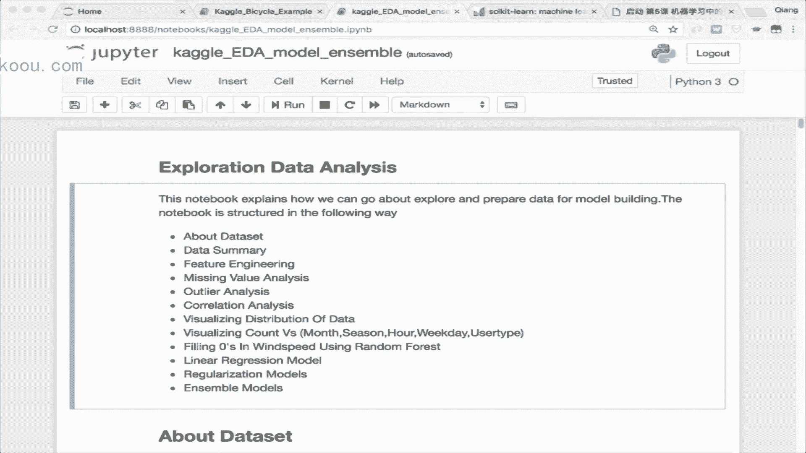

# 1447-七月在线-机器学习集训营15期 - P10：4-特征工程：数据清洗、异常点处理、特征抽取.选择.组合 - 程序员技术手札 - BV1ASste6EuZ

🎼。啊，从这次课开始呢，你们会陆续看到一些。更贴近实际算法应用的这样的一些内容。呃，你们将来有同学如果要出去面试啊，就是从事这个方向的工作。你要出去面试的话。

一一定会遇到面试的过程当中提到的几个板块的内容。有一个板块的内容是大家一直在从前面的课程到今天一直在学的。模型的部分。就是你们会听到一些很夸张的说法，说你去面试的时候，怎么也得首撸个SVM。

或者是呃推一个什么角色术，或者是呃数模型的创新模型等等这样的一些。😊，一些面试题问。但除掉这个理论的部分以外，我们也会很关注你实际应对数据的感知和应用的能力。呃，我指的不是调餐。

这个不你指的这个调餐的部分，对整个模型的。你想或者对整个整个数据驱动方案解决它的效果影响没有那没有你想象的那么大。对，如果你是你的重心放在调三上，我会觉得你是一个没有没有动手去做过相关工作的人。😊，呃。

所以我的我的一个同事，去年的时候呃，我们一起出去校招啊，我说校招，就是我们我们会跑一些城市。比如说呃除了北京以外啊，北京本地以外，我们可能会去上海会去武汉，会去哈尔滨，会去那几个对应的城市嘛。

哈工大呀、华科等等。然后我们会去面试校招的面试，然后一一般一面试就是呃两三天。然后在这个面试过程当中呢，就是我们不同的面试官他大家可能会有不同的风格。坐在我旁边的我的同事最爱问的一个问题是。

那你知道什么样的。😊，数据的。处理和特征工程的方式。这个是我们今天要给大家讲到的课心的内容，几乎那一天面试的所有人都被他问过这个问题啊，当然有一大部分人是能回答上来这个问题的，就是还是不错的。

说明储备还是可以的。在这里头会涉及到一些会涉及到一些具体的数据上的一些操作。和我去应用这些算法的时候，如何能让我的算法的能算法的这个表达力，或者是个算法模型的这个效果更突出的这样的一些点。

那我在今天讲授这个部分内容的时候，我也会给大家呃就是。😊，问到一些你们出去以后可能会被问到的一些问题。然后我让大家一起来思考一下，为什么我们要做这个处理。

当然这些数据处理的具体的这些操作可能就这么些操作，所有人都知道，但是哪些模型需要用到这个操作，哪些模型不需要用的，以及说做这个操作，它可能会带来什么样的。😊，影响什么有什么样的效果。

这个是你需要去理解的。所以我们今天提到这个内容叫做机器学习中的特征工程，叫做face engineering。呃，这个部分呢很神秘，因为你在市面上基本上找不到。一本书去讲这个内容。

你可以找到很多机器学习原理的书。但是在实战的特征工程这块，你会发现并不是太多。所以今天我给大家讲到的是一些里面很核心的一些操作和一些对应的处理。呃，不过大家更多的要关注说为什么我要我要去做这样一个处理。

做完以后，数据会是以什么样的形态去呈现。这是包括这是今天的整体的这个内容。会包括我会带大家聊一点这个关于特征工程这个板块。它的作用或者说我们聊聊一聊它的意义。为什么它会大家会这么关注这个这个部分。

然后我们会聊一聊这些所谓的大家比较关心的数据处理和我真的从数据上去做特征抽取的这样的一些过程。对，然后大家看到的第三个部分是我会带大家过一下，当我想办法产出了很多很多的特征，我脑洞出来了非常多的特征。

我怎么在这个。😊，场景下去选出来真正有用的那些特征。因为当你的维度真的很高的时候，这个对计算资源是一种很大的压力。ok然后所以我们先聊一聊这个词叫做特征工程，叫做fishci engineering。

所以这个特征工程呢特征这个东西指的是从原始的数据当中去抽取出来对预测结果有用的信息。但也没有太大的意义啊，但是大家理解一下，为什么会这样去说，我给大家举一个例子。

你们想的人工智能远没有大家想象的那么智能，人工智能真的需要很多人工的环节在。所以你你不要想着这件事情是我准备好数据了，我把数据往那个模型里头一怼，然后就能出来一个很好效果的。😊，这样的一个模型。

如果这件事情这么简单的话，你们今天还用来学这个课吗？😊，那阿里云和腾讯云或者各家语音公司不早把这个事情做完了吗？对吧这些所谓的auto ML的平台，自动机器学习，自动人工智能的平台，这个事情就完成了。

对吧？实际上远没有大家想象的这么简单啊，模型也没有你想象的那么强的作用。因为可能在很多不太熟悉这个领域的人眼中，我最终能取得好的效果，是用了因为我用了逼格非常高的模型。😊，啊，逼格非常高的模型要用。

但它不是决定型的因素。它只是因素之一。所以这个地方很重要的一个事情是你原始的数据可能是一种很很杂乱的一种形态，呃，会会有另外一些表达形式是计算机读不懂的。举个例子来说。

今天你上淘宝这个小姐姐看到了这只口红会不会买，可能和这个口红的颜色会有关系啊，口红有很多的色号啊，很多读不懂的色号。然后但是这个颜色这个信息怎么表达给计算机呢？😊，他不读不懂的。你不要想着这些文本。

这些。类别型的这些属性可以直接送到计算机里，他能读懂，他读不懂的。所以需要你去做一个表达。那我再说一个事情，你们知道近几年，你们知道近两年dep runninging很热，对吧？深度学习。

大家都在都在往这上面往这个人工智能往深度学习上去靠。所以深度学习这个词儿很很热。那你们有没有想过深度学习为什么会突然在这两年热钱呢？当然它会有些原因，你会告诉我说，老师，因为数据量的规模增长上有啊？

因为现在我的很多硬件资源可以支撑我去学习这些很复杂的神经网络的模型呢。😊，其实根本原因是因为在有一些数据上深度学习的模型的效果确实碾压了传统的模型。那是不是说我们现在学的这些机器学习没有用了。

是这些模型已经过时了，所以深度学习起来了以后，大家都应该去学习深度学习。😊，不是的。在有些场景里面，机器学习做不好的原因是因为你没有给他一个很好的数据表达。举一个例子来说，深度学习最。有。

发挥最好的一些领域。很多时候是多媒体数据的领域。那图像这样的数据，你你是没有办法用更高效的方式表达给这些原来这些模型的。不是说这个啊SVM不好，这些什么数模型不好。

不是是因为你没有把那个信息呈以某一种计算机能读得懂的形式去呈现给它。你在从这个原始的图像数据送给模型的这个过程当中损失掉了很多信息，你表达不充分，所以计算机没有办法从你这个数据。

从你这个这给到的这个数据当中去学习到一个什么样的有用的模式，所以不是模型本身的问题，而是说深度学习这种模型，它更适合去做一个表达学习。对于这种很抽象的这种数据。比如说啊这种图像这样一种数据。

它能够从原始的pixel像素级别的这种表达上。去学习出来一种，去感知出来一种更有效的表达方式。然后后面的部分才是就是和大家现在学到的一样的。这些分类器。就是一个神经网络尾部上，尾巴上也是这些啊。

比如说soft max多分类啊，或者是逻辑回归，你可以认为是逻辑回归啊，就是bysigoid接个soid去完成二分类啊，也是这样的东西。只是它前面层次做了太多的车征抽取，已经能把那个数据表达的非常好了。

所以现在你有表达非常好的这种把把人能够理解的这个信息，以这种比较丰富的形态传送给计算机，它就能拿到很好的效果。😊，所以特征工程这个东西如果要给个定义，实际上他做的事情。

就是说你去结合你的计算机的这种知识，再结合你对于这个场景，对于这个领域了解的这些专业的背景知识，去把你原始的数据处理成这些机器学习的模型或者算法，能发挥更好作用的这样的一种数据的表达形态。😊。

它是这样的一个事情，它是很偏工程的一个事情。也很偏你对数据的一个理解和思考。原因很简单，你们你们千万不要追求太。逼格非常非常高非常非常复杂的模型。😊，我们实际在工业界最喜欢的模型是简单。

但是效果又比较好的模型。因为简单的模型意味着说它的可控度非常高，可意味着说我线上的复杂度会小。意味着说当我出现问题的时候，我能第一时间去解决它它是一个透明的模型，或者说它是一个可解释性非常好的一个模型。

😊，如果你搞一个黑箱模型过来，你搞一个很复杂的神经网络，对吧？你今天很开心，你说我叠了1个1024层的神经网络，这个事情我以前也干过，那叠1个1024层的神经网络，然后一跑发车哎，效果很好。

但你今天你要是你要是这个线上的业务出现问题了。😊，很麻烦。因为你很难去debug。你没有办法第一时间去处理这个问题。所以我们会更希望去把这个场景挖掘的足够的充分，把它的信息足够充分的去表达出来。

送给这些相对不是那么复杂。但是这个效果同样很好的学习模型，然后让他们去解决当前这样一个问题。如果你抽到足够好的特征。我可以告诉大家，你用最简你用简单的模型不一定比你用深度学习的模型效果要差。😊，对。

所以有同学问到说是不是意味着对业务了本身了解更多的人做更可以更做到更做出来更好的特征。是的。😊，数据驱动这个方案解决这个方案的这个问题需要几部分的技能。一个部分的技能叫做开发技能，你需要能够写代码。

因为你有idea，你必须要能够实现，你也必须能够基于这些工具库去完成数据的理解。另外第二部分技能叫做机器学习的理论技能。因为它能够更好的告诉你说，我现在出现的问题，应该调什么样的参数。

调哪部分的参数可能会有什么样的影响，它也许能够收敛的更好，或者说能够在我当前这个场景里面有更好的这个呃模型的这种表达能力。第第三个部分就是我们今天给大家讲到这个特征工程，它会很和你的场景相关。

我们叫做domentdknowledge或者domentd expertise，就是领域内的知识。因为我是一个不懂医疗的人，你给我一些医疗的问题让我去处理，我无从下手。我拿到这些数据。

我都不知道它什么含义。😊，所以总体说来，特征工程就是从原始的数据上想各种各样的办法去抽取出来，说对最后预测有用的这样一些信息，更充分的信息，让模型去学。OK然后这个地方有一个小小的说明。

这个说明我不想多说。总之呢说到就是给大家说一下，在互联网公司当中，你大概会有百分之啊不是互联网公司啊。我找很多同学对那个各种机器学习的数据科学的比赛很感兴趣。你们去刷一个，你们随便玩一个比赛。

你们就知道了，你们大概会有60%到70%的时间都花在数据上。😊，剩下的30%左右的时间花在模型上，为什么？因为模型的套路太明显了。模型的套路太明显了，我我我身边会有一些呃这个数各种数据科学比赛的。

这些大牛。啊，然后包括我本人之前也简单的刷过一些玩玩一些比赛。😊，我可以告诉大家，所有这些比参加比赛的老司机，后面调餐的部分或者是模型的部分，大家套路都很明显。😊。

而且基本上模板就是类似那种不是大家想象的那种非常成型的模板啊，把数据往里头一怼就出来结果的模板。就是说可插拔的这种组件的这种模板，大家手上已经有很多了。所以这个部分大家做到的都差不多。😊，那前面的部分。

你能你能对你的数据有多大程度的理解，你能对从你的数据上拿出来多高效的表达所有用的信息，这个东西会很大程度上影响你最后能做到什么样一个程度。它会影响你到底是呃200名还是20名。

而刚才你说到那些模型的部分，会决定可能在一定程度上能决定你到底是在一名二名还是3名。就是我需要去做一些微调，他们竞争已经很激烈了。在前面。OK所以这些互联网公司的工作，包括你去参加一些数据科学比赛呢。

没有大家想象的那么的f。说我一天到晚就在研究这些B格很高的模型。没有有时大部分情况下呢，数据对数据本身的理解会更重要。你很多时候你需要去跑一些，因为那个公司里头数据量一般比较大。

所以很多时候你可能要用一些分布式的平台去跑一些呃简单一点一些circle，然后你可能要写一些分布式的一些小 job，然后去跑点数据拉出来看一下，那更小一点的数据，中小型的数据，你可能用s也可以完成分析。

对吧？然后你要去结合你的场景去做一些数据的清袭啊，一些业务的分析啊，去看一看我到底现在这个场景底下什么样的特征会更有效啊。现在这版的效果好不好啊，分析一下原因啊。然后。😊。

我有没有更合理的这个表达模式啊，对这个数据啊。然后你们你们甚至听过一句话，在很多的公司里头，它叫做一招LR打天下。就是我们之前学到的那个逻辑回归，在很多很多的中小型公司当中，已经足够他们解决各种各样的。

😊，各种各样的。分类的问题了。呃，特征工程大概有多大的作用呢？呃，我看过很多开go的比赛，大家有兴趣呢你也可以去研究一下，然后会有一些数据科学的一些比赛。比如说很典型的二分类比赛当中。

我们有一个评估指标叫AOC。因为在那个比如说不均衡的样本当中，我们可能不会用accuracy这样的一些评估的标准啊，就准确率这样评估标准。所以。

我们可能在这个情况下会用到一些类似于AUC这样的呃一些评估标准。那如果你去做一些数据层面的处理啊，这个地方有效特征的抽取呢，不只是指的你你去搞一个什么样的操作，从数据里头抽一部分信息出来。

还是说你研究你研究了这个数据的分布，你从这个数据的分布和你这个场景里面，结合这个场景去做了一个合适的表达。比如说我给大家举一个非常呃我之前参加比赛的一个例子啊。😊，我之前我去年参加了一个比赛。

然后那个比赛是要去预测呃一个用电量的一个一个预测的一个比赛。阿里天池上的一个比赛。然后在那个用电量的一个比赛当中呢，我需要去预测下一个月的呃每一天这个某一个城市的一个一个区它的一个用电量啊。

应该说这些高新企业的一个用电量。😊，然后这个比赛当中呢，我我我因为大家都知道这些呃后面建模的部分呢，可能套路大家都很熟啊，所以就开始就哗哗哗撸了一版啊，撸完之后呢，就提交上去，发现说。😊，呃。

就是还行排名。然后当时然后但是有一个问题，就是我自己去看了训练集当中哪些样本预估的不太好。我看了一眼，我发现有一天有一天的用电量，我怎么也没有办法。😊，去。把它拉到和这个标签啊。

就最后的label一样的这个幅度。我就很奇怪，因为那一天我预估的他它的那个呃用电量，我预估的是高的，实际上非常低。所以一定是有什么原因导致的这件事情。然后我就看我说这一天也不是周末。

也不是什么什么法定的这个节假日，为什么这一天用电量会这么低，感觉是大家是要上班的呀？这企业要上班肯定要用电的呀。😊，后来我发现了一件事情，我后来去查了一下日历。

那一年有一个节日叫做抗法西斯胜利什么什么什么节日，然后那一天居然放假了。所以这个东西很奇怪，因为当你当你没有你拿不到这部分信息的时候。😊，你不管你就怎么调你的模型。😡，你的模型都你的模型是不会撒谎的。

它基于他给到的信息只能预估到那个程度。而当你拿到这部分信息以后，明显你把这个标签一放进去，明显那一天的用电量就往下降了，它就是一个放假一个一个节日。再给大家举另外一个例子，我在啊那个例子一会儿再举吧。

就总之这个东西呢就是我看过很多次的比赛当中，大家做一个有效特征的抽取是能到百分位的提升。而你去做一些单个模型啊，单个模型调三的优化顶多就在千分位波动。😊，所以这个事情是这样的，大家要去考虑性价比啊。

所以如果你现在的名次还在几百名，你要进到100名内，那请大家多多关注你现在的数据和你的场景。如果你现在已经在20名之内了。你要去冲刺前面的几名，一名、二名。

那请大家这个时候研究一下那些模型融合模型的一些各种各样的组装啊，一些各种各样的方式去拉低拉高最后的那一1一部分的泛化能力啊，拉高一点点泛化能力。然后同样下面会有一些其他的一些例子啊，一些电商的比赛呀。

一些阿里天使的比赛啊，都是这样，大家都在寻求更有效的数据表达。😊，好，那说到这件事情，我们就从头开始讲这个故事吧。所以在这个故事的一开始，你面对的东西的时候，我需要去取到数据啊。😊。

所以这个地方呢第一件事情是你需要去做一些数据的采集。但好在这个事情呢，采集数据本身并不需要大家这些机器学习的工程师去做。但是啊你需要去考虑什么样的数据，你是需要的。所以在这个过程当中。

你需要去思考思考说哪些数据对最后的这个结果的预估是有帮助的。你思考一下，然后这些数据我们能不能采集的到。因为有些数据它是很有帮助的。但是实际上你是没有办法提前采集到的。我给大家举一个例子啊，你。😊。

在淘宝的场景底下，你每搜一个结果，你会拿到一个结果列表。那他很关心一件事情，就是你在这个商品上会不会发生点击或者下单这样的行为。但是这个过程呢显很显然，在你拿到这批数据的时候啊。

你拿到这批训练数据的时候，你的每一个结果你都可以有一个有一个特征叫做位置，对吗？因为你已经拿到这个结果了，所以你知道它排在哪个位置，就是position。😊，所以你的特征你可以有这个商品的价格呀。

这个商品的一个呃商商所在的商铺的评分的情况啊，我的一个评论的心级情况啊，然后你也可以拿到一些这个用户历史上消费的一些情况啊等等。你可以把这些信息都采集过来，你去帮助你预估当前这个问题。

但是你发现你突然发现说这个地方还有另外一个信息叫做位置。😊，叫做position。你发现说这个太牛逼了，positionsition这个东西呢只要放进去。😡，预估的AUC明显会提高很多。但是他有问题啊。

你实际在解决这个分类问题的时候，你可能你实际去构建这个分类器，可能本身就是为了完成这个培排序这个问任务，你会把那些呃更可能下单，更可能发生点击的那样一些东西放在前面。

对吧排在前面那些商品你会把那些相对可能你发生点击或者发生购买这个可能性更小的一些商品放在后面。所以这个时候呢，你发现说你这个potition这个东西在你做这个预估当前这一次预估的时候。

你是没有办法提前拿到的。😊，所以这个时候大家要多考虑一点这个信息，你不不能把东西直接就拿过来，然后你就直接往里头一怼去生成一个模型。有可能在线上用不了，因为你取不到这分信息，以及线上实时计算的时候。

获取是不是快捷。因为线上的效率同样很重要。😊，所以如果你这个特征需要去反复的计算，很复杂的计算才能得到。那你线生可能要考虑一下。这个地方有一个例子，我举例一下。

我说如果我要预测用户对于商品的一个下单的情况，就是说会在在当前的这个商品上会不会下单啊？如果会的话，它发生下单的概率有多高？😊，或者说我要去做一个商品的一个推荐，我应该采集什么信息呢？

我这方给大家写了一点店家的商品的和用户的，你从三个维度去切入嘛。然后每个维度你再考虑一下他们有什么样的信息可以取到，以及我可不可以把这些信息交叉起来，做一些组合的特征呢？😊。

所以这个地方我会还是涉及到数据采集这个问题啊，就是大家需要去思考的是哪些数据有用。然后真正的这些数据的采集啊存储啊，会有一些其他做数据的同学会帮大家去做啊。

可能这些数据工程师或者是这些啊数那个数据科学家可能不用去做这么底层的工作。所以我们举个例子，我们说如果今天今天有这个7月开了一个。😊，机器学习的一个算法，某个机构开了一个机器学习算法的一个模型。😊。

对吧算法的一个模型。所以这个时候呢，我想构建一个这样的模型，去预测一下，说哎能大家来听这这样一个课，大家来听这样的一个课，然后有兴趣听下去的程度有多高，我应该采集一些什么样的数据呢？😊。

那你这个时候你就可以开脑洞了，对吧？实际上很多比赛的比很多大家参加数据科学比赛的第一步就是先理解场景，然后就开始分析场景，开始开脑洞，想有什么样的特征了。举个例子来说，可能今天如果是呃韩老师过来讲。

可能大家听着就会想睡觉，可能会换成其他的换成唐老师过来讲，可能大家就很开心啊，这个有可能对吧？所以他可能会和这个老师有关系，可能会和这个老师的声音有关系，可能韩老师说话的声音不太好听。

某个老师声音比较好听，可能可能这也是一些影响因素。哎，可能说和今天这个课程的内容的难度有关系。因为这个课程要是太难了，我一堆的公式推导，可能大家就听不下去。

可能如果今天是比较唉这个显展示效果比较好的这个数据，对吧？可能呃展示效果比较好的这样的一部分内容，可能大家就比较有兴趣。😊，对，所以有同学说对了，就是这样去想的话是很没有顺序的。所以有同学很棒啊。

就会给到说这个地方呢我会给到一些信息。比如说和培训机构有关的信息，对吧？比如说和和当前这个老师有关的信息，比如说和同学们有关的信息，和我开课的时间点有关的信息。

和我其他的一些呃信这个这个一起参与的这个参与课程的同学们有关的一些信息，所以你可以找一些维度去切入进去去组织这部分的数据，刚才有同学问到说买点是什么？这个这个不属于数据科学的范畴，就是你用一个APP。

比如说你用一个抖音，那你的上面的每一个行为，你用一个抖音或者用一个今日头条，你上面的每一个行为我都应该去做一个记录，对吧？那记录这个是在前端的对吧？对，就是在APP里头去做对做一些记录，然后把信息返回。

😊，这个和我们这个课程关系不是太大，所以我没有特别去做解释。😊，然后这个地方的数据的格式化，我就简单的说一下就好了。就是你确定一下你你什么样的方式去存储会更方便，方便你将来的读取或者解析啊。

有时候呢我们数据量会比较大，所以我们会去存储在那些啊，比如说HDFS上啊等等。然后啊大家要注意的一件事情是这样的，除掉就刚才我们说的事情叫数据采集，并不是采集到的所有的数据都需要用的。😊。

就是它有可能是会有一些噪声的，可能你们想象不到这个事情有影响程度有多大。首先呢你要知道机器学习模型对于模型而言，你给到他的数据。他是没有任何的区分能力的，什么意思？你今天要学。这个高二的一门数学数学课。

你上书店里头买了一本书，那这些练习题就是你要学习的这样一些样本，对吧？所以你会通过这些题，反复的去做这些题，去学习到一个做题的呃套路和方法。但今天有个问题，万一你今天买的这本参考资料里头有几道错题。😊。

其实你是不知道的对吧？你对那本书非常信任，你觉得说他已经给出来参考答案，他肯定是对的。所以你就拼命的去想，为什么这个参考答案这个思路呃，这个思路是怎么去想的，你想了想着就学偏了，对吧？😊。

所以这个时候有一个说法叫做垃圾进垃圾出。就是如果你给了一些精准度很低，很没有意义的一些信息，或者说有干扰的信息送到模型当中，那这些干扰有干扰的信息同样会被模型学习的。😊。

因为他区分不出来这个东西是不是脏数据，你给到他所有东西他都想学。然后同样这个地方呢，就是所以大家一定要注意一下，这个地方算法大多数就是一个加工机器，最后的成品如何，其实取决于你原材料的好坏。

所以你的算法模型啊就是你的数据这块的处理啊，特征和数据这块处理，基本会决定你最后这个在你当前的这个场景底下，结合你这份数据，你能达到的一个效果的上限。而你的模型只是让它不断的去逼近这个上限。😊，喂。

这个过程会花掉很大一部分的时间。然后他主要在做的事情，实际上是把这些noice data，这些脏数据干掉，就是这些不可靠的数据，这些错误的题目干掉。我我给大家说一个例子。

我在去年的时候参加了一个天池的比赛，也是学员在参加。然后我就我就陪他们一起看一下呗。然后大概呃因为因为那个数据量不是太大，分析起来还比较简单，所以我就快速的撸了撸了一版，提交上去了。最开始的时候。

不瞒大家说，反正在也在200名左右啊，就那个比赛大概有2700支队伍参加，在200名左右。然后后面的那因为那些建模的那些套路大家大家都很熟啊，所以这些工程师直接拿过来快速的搞一搞一把。

可能半个小时或者多久就提交上去了，然后大概在200名。😊，大概这个排名2100多名，大概持续了两天吧，我提交了有晚两个晚上拿了一点时间出来做了一下。然后呃后来我做了一件事情，名次就上升到40名之内了。

😊，就上升到40年之内了，这个世界并不像大家想的，我用了逼格更高的魔芯，没有。后面的所有处理环节一模一样，我仅仅是把那份数据当中，我觉得。偏了的数据或者说噪声数据干掉。仅仅是这样一个操作，它就从。

100多名升到了进入了到40名之内。然后后面的部分啊再进到20名之内，进到15名之内，那个可能要花一些其他的精力去做后续的这个特征，去做一些啊模型层面的一些呃融合啊或者其他的提升这样。

所以这个是呃就是我给大家说一下一些实际的感受，真的是很重要的。然后这个地方有什么样的方法可以去判定这些脏数据nise data，然后。以及判断到这去把这些脏数据去掉呢。

所以这个地方会涉及到一些大家可以看到这个地方涉及到一些方法。最简单的方法是呃有些东西就是不可能的。你看看这个地方身高超过3米的人。

然后买各种各样的生活的节据能买到10一个月能买到10万的这样的呃单个用户或者一些组合特征，对吧？根据你的这个信息去做组合，有些问题啊，这样的一些，然后除掉它以外，还会有一些其他的方法，比如说统计值啊。

就是统计分布统计分布。啊比如说在我这连续值啊，我的一个连续值，连续值的，你们知道分位数这个概念吗？😊，分位数，比如说10%的分位数，你们知道是什么样一个概念吗？分位数是指的，比如举个例子来说啊。

就是现在我有一个年龄这样一个字段。那如果要取整个淘宝的用户当中年龄在呃10%分位数的这样的一个值。我做的事情是把所有的淘宝的用户取过来，让他们根据年龄去排排站。年龄去排败站。

就是从年龄到小到年龄年龄最小到最大，然后去排一个序，然后我去取其中第百从左往右数第10%的那个位置，他的年龄，所以这个叫做分位数。所以很多时候我们去脏数据会怎么去呢？你就会把呃比如说哦举个例子。

我随便举个例子，99%分位数以上的纸卡掉。像这种一个月买脸盆买墩布，买了10万的人很有可能就在99%的分位数以外，就是去头掐头去尾，明白我意思吧？就是大家都会在这个平台上会有消费。

那这个消费它一定是有符合它一定是有大有小的那我让他从小到大去排序，然后把头和尾掐掉，就这个意思OK。😊，这是根据统计呃，然后这个地方还有些其他的数据处理。举个例子来说啊。

第一有一种很重要的数据处理叫做数据采样。😊，叫做数据采样。所以数据采样的时候，很多情况下，大家看到那些样数那些呃我们叫做样本或者那些数据呢，它的正负样本是不均衡的。这种这种场景。

通常情况下是会在分类这个场景里面出现的。在分类的场景里面呢，很多时候你的正负样本是不均衡的，是用balance。举个例子来说啊，在电商里头啊，用户买和没有买过的商品，实际上是不成正比的呃。

或者说他们不是一个数量级的。显然购买这个行为是需要付出代价的，要花钱。所以大部分人只逛不买。😊，那再比如说有一部分的疾病，他的患者和健康人，实际上他的比例是。不均衡的。就是有一些很稀少的病。

他可能患病的概率只有10万分之1、100万分之1。所以这个时候呢，大家想一想，大部分你取到的都是都是健康人。😊，所以这种情况下，你要去构建模型，你需要去构建一个模型，去学习。

区分这两这个健康人和患者或者区分会不会在淘宝这个平台上发生购买这样的行为。很显然，你不能直接把数据放进去。这个时候我肯定只关注大多数的那些样本，少中的那部分样本。我不用太关心，举个例子来说。

我现在以准确率去做评估。那我这个患病的可能性是1%，我只需要把所有人都判断成正常人。我这时候的准确率就有99%，对吗？但这个事情有意义吗？准确率达到99%，这个事情有意义吗？我就想去找到那个病人。

你告诉我说所有的人都是健康的。你告诉我说，这个时候的准确率是99%，这个没有意义的。所以这种时候呢，你的正负样本是不均衡的，你可能要去做一些采样的处理啊，大多数的模型对正负样本比都是敏感的。

比如说逻辑回归。啊，然后这个时候呢你要去做一下采样。比如说你可以随机采样，你可以做一些分层采样，分层采样。为什么要做分层采样呢？举个例子来说，淘宝上的小哥哥和小姐姐他们购买的。😊。

感兴趣的东西肯定是不一样的。你今天做一个。抽样你假如说啊一般不会有这样的情况。假如说你今天数据很倒霉，你今天数据就是你抽出来的所有的小哥哥都落到了啊一份就是落到了。😡。

这个呃抽抽取出来的一个一个数据集当中，然后所有小姐姐都变到另外一个数据集当中。那这个时候呢，你去你再去构建这样的模型，显然是会有问题的。你最好能够保持住这个每一份数据集当中，你的数据。

现在里头的小哥哥和小姐姐的配比，都和我淘宝这个平台上，小哥哥和小姐姐的配比是一致的。最好是这样。😊，对吧？好，所以底下会有一些正负样本不均衡的一些处理办法。举个例子说，最简单的是什么呢？

最简单的是我把正样本或者负样本去做一些采样嘛。所以这个地方呢我可以对正样，我我我写了一些场景啊，有时候我是做一些down。有时候我是做一些 over，或者说叫做过采样啊，这个下采样也叫做欠采样。对。

就是如果我的正样本是十我的副样本是啊一，我可能就可以把十采样出来10分之1，让它尽量的配成1比1或者差不多的这样的一个比例啊。如果我的我的呃量都不太大呢，你可以做一些事情，采集更多的数据啊。

你可以把一的这个部分都重复几次啊，或者说你不用简单的重复，而是用这个地方的一些镜像或者是旋转这样的处理。比如说图像识别当中，你对一只猫去旋转一下去翻转一下去上下平移一下，做一个截段，对于计算机而言。

它看到的数据是完全不一样的。但是对于人而言，它就是一。😊，只猫。这个地方的over sampling还还有一些其他的方法。比如说有些同学可能听过这个方法啊，我不在这个课里头给大家细讲叫SMOTE啊。

smote这是一个处理un balanceance data会用到的一个一个算法。而这个算法呢会造出来一些数据，这造出来的数据呢是在在正样本和负样本之间去做一些线性内差，然后造出来一些样本。😊，呃。

抱歉，我今天没有带手写本，所以写的可能有点丑啊，但是SMOTE啊这个意思。😊，这个意思O。然后呃底下的这个地方修改损失函数呢，也很好理解。你想一想在逻辑回归当中，我是不是把所有的正样本和负样本。

把所有的正样本和负样本，它的los都加在一起啊。有印象吗？我是把它每个样本的los function都加在一起，对吗？那如果你今天有一类的样本占比占了99%。

是不是我所有的损失函数的los都倾斜到上面去了？😊，所以这个显然是不合理的对吧？所以你可以去修改一下你现在的last function，你可以给不同的比重或者怎么样去做一些处理。😊，有同学问到一个问题。

说smote的效果好不好？SMOTE我不太我不太喜欢回答这种问题，因为你没有给我任何的场景，也没有给我数据，就是你没有给我任何的背景信息。你问我一个东西好不好。

你要知道这个世界上呃有一个就是你有很多事情确实是存在就有意义的。所以这个方法在有些场景里面好。在有些场景里面不好。但是很多时候你确实要结合你的数据结匪的实验去看这样的一个结果，你不能直接说它好或者不好。

我见过一些比赛里面用它效果也也不太明显的，也有，然后也有另外一些人号称用这个算法，用这个方法之后，效果有一定程度的提升。所以在这个课里头呢，我会尽量的给大家罗列到所有可能你会用到的处理。

然后你我我对于那种比较清晰的能够告诉大家哪些场景里面效果比较好的，我会告诉大家，但另外一些如果我没有提到，可能这个部分就需要大家通过自己。😊，的实验或者结合自己的数据去看它效果到底好不好，就是没有对。

没有办法直接给到结果，这个意思好吧。好，下面就进入我们重点的部分了。然后这个部分很重要。因为我刚才一上来给大家提到的说，我有一个同事很爱问大家说你知道什么样的特征工程的处理方法呀？他指的就是这一块。

它指的就是这个地方这一块。我看到有同学问到一个问题说没懂修改损失函数解决不平衡不均衡啊，最简单的一个问题啊，最简单的一个问题就是你现在的正样本和负样本的比是99比1。你想一想你最后损失函数当中。

你的损失值是不是在逻辑回归了？如果用逻辑回归，因为我先讲最简单的模型，里面是不是有99%的损失都来源于正样本，有1%的损失来源于负样本了，有问题吗？因为你这幅样本就是这样的嘛。

你每个样本都要求一个los嘛，加起来。😡，所以这个时候最简单的一个处理就是你把这个东西的last function当中少了这一类的los去做加权。它我指的不是说把lo function的形态改变。

比如说不用对数损失或者不用这个对逻辑回归当中对数损失，不是这个意思。就是有些简单的处理，比如说。修改权重对吧？因为它的形态会有一些变化嘛，就是你你最终的损失函数是一个sigma的形态嘛。😊。

类似这样的意思啊，大概大家明白我的意思啊，就是会让你的让你的损失函数上不要有那么强的倾向性去倾向到非常多的那一类。😊，然后这个地方的特征的处理，实际上找指的是不同的类型的数据上，我去做各种各样的处理。

举个例子来说，呃，你会见到各种各样形态的数据。😊，你会见到各种各样形态的数据。比如说比如说你会见到有数值型的数据，比如说年龄，比如说商品的价格，比如说这个房子的一个房龄，这些就是数值型的数据，对吧？

你会见到另外一些数据叫做类别型的数据。比如说你上淘宝上买东西，你那个小姐姐告诉你说，这个口红会有180个色号，然后你就一脸懵逼的问她说180个色号，所以这是不同的取值的类型。然后。

比如说这件衣服的尺寸大，这件衣服的size大小有有S，有M，有L，有叉L，有叉叉L。对吧所以这个东西它是一个一个类别，就是你你可以取不种不同的这种类别。比如再举个例子来说，比如说星期几。

今天星期一还是星期二还是星期三还是到星期天，这也是类别型。O好，像面第三种类型叫做时间型啊，时间型很重要啊。因为它提供了有很多的问题是时续性的问题。

所以我会提供和时间相关的这样的一些信息给到你O然后还有一些更特殊的数据，比如说文本型啊，比如说图像类型啊，比如说你也可以基于我的业务去做一些统计啊，啊，我们分别来看一看有哪些套路是可以去啊做这样的处理。

😊，Of。呃，我先讲，然后对于我这个地方刚才提到的问题，有问题的同学，一会儿在我们休息时间内啊，大家尽管提，然后我来做解答，好吧。这个地方呢我们见到第一种类型叫做竖直形。

叫做numbering这样的类型。所以数直型顾名思义。指的就是我现在这一列是一个连续值呗。所以我先给大家罗列了一下连续值有哪些不同程度的或者不同方式的处理手段。

所以这个地方第一个处理手段叫做幅度调整和规一化。叫做scaling，叫做幅度缩放。什么意思呢？哎，大家都知道我们采集我们会采集很多数据过来。比如说我房子预测这样一个例子，然后我采集到很多列啊。

我给大家随便画一些列啊，那个抱歉，今天那个手写本不在身边，所以那个可能画的不太好，见谅就是我会有很多行很多列对吧？会经给大家说过，每一行呢就是一个一条记录，一个样本。

然后每一列呢就会是呃对应的这个一个维度，一个观测维度，所以你有很多列，你发现这个房子里头啊会有一些列是这个房子的呃几居啊，几居。😊，啊，就几居。然后哎呀这个。就几居这样一个字段。

然后你会有其他的一些字段，比如唉。😡，有其他的一些字段，比如说呃均价就是这块地区的房子的均价。所以这个时候呢就是你发现你的不同的字段之间，它的幅度大小是不一样的。举个例子来说，几居啊。

我假设说有有人有一个豪宅，但豪宅应该也到不了一两百个卧室吧。就是你这个通常情况下，你几居这个应该是在在5以下。😊，就是你那个房子一个一套房子是几居的话，它可能是在呃在5这样一个数字以下。

那那均价呢均价不一定吧。你比如说像北上广这样的地方，很多的呃北上广深这样的地方，很多的区域价格甚至能标到呃4万5万以上，对吧？均价。😊，所以。😊，所以你发现这两列它之间的幅度差异很大。

就有一列大概是也许哎它就是在0到5之间。另外一列是你发现它可以到几万。😊，就是均价而它幅度就大很多。所以所以这个时候哎我我会有什么问题吗？就问大家一下，那这有什么问题呢？你一列的幅度范围小。

一列的幅度范围大，这个有什么不可以呢？模型就不能学了吗？😊，模型当然可以学了，但你回忆一下，有些模型我又拿逻辑回归为例。大家想一想，在logistic regression当中。

我们要做的事情是给每个位置都给一个权重，对吧？所以我会有W1乘以X1加W2乘以X2加W3乘以X3，你现在的X1这个几居，它是一个只在0到5之间的值，你的那个W啊，不不是WX啊。

几比如说X6或者X7均价可以标到几万。😊，你这个时候你去做刚才那个运算，那个W1X1，再加上啊W2X2，你会。啊，WIXI吧。你会发现你有一些字段它的幅度范围非常大，有些幅度范围非常小。

那这个时候会有什么问题啊？大家想一想我的W是不是也要学习出来，幅度相差很大的权重啊，不然的话啊，你的你的均价这个地方几万，你的几居就是0到5，那我W都配一个都配一个幅度差不多的值。

那你几居那个影响因素还有什么关系？我房价上差上1000，你那个几居，你你你多少套房子的N居你都追不上，对吧？😊，所以这个时候就会带来就会让模型很困惑。他在学习的过程当中。😊，因为幅度相差实在太大。

这个时候如果大家去思考一下，我们在逻辑回归当中，我们如果用一个2元来分析的话，我们是一个碗状的一个一个损失函数，对吧？我们要去找到那个碗状的那个lo function，它的底部，对吧？😊。

所以之前我给大家画了一个等高图，等高线的一个图，类似于啊等高线的一个图。所以正常情况下，这个等高线的图应该是这样的。如果你今天的幅度差异很大的话，这个等高线的图可能会变成这个样子。😊，是非常非常尖。

非常非常窄。所以这个时候他在做呃，因为大家知道我的梯度下降是找法线的方向，就是垂直于切线的方向去每次迈进一小步，对吧？所以这个时候大家就会发现它的那个垂法线的方向啊就会。就很纠结，就会抖动。

明白我意思吧？所以所以对于有些模型，比如说逻辑回归这样的模型，他是很怕这个事情的。你给到的数据，现在的每一列有大有小，有些这么大，有些那么小。他学习起来就很纠结。所以这个时候怎么办呢？

我们就会想一些办法把它调整到同样的幅度范围内。比如说有一些scalar，这个地方有一些scalar，比如说最大最小值的scaar，它做一件事情。

它把最大值减去最小值做为一个缩放的幅度去做一个分母去对你原始的数据去做一个做一个转换啊，就是用你现在的这个值，你现在这个值，比如说A去减掉我的最小值。

最小值叫什么叫MINOK这个时候呢我再去除以我的最除以我的最大减最小啊，除以我的max。😊，不好意思，这个写的有点丑了啊，大家理解一下，大概是A减去MIN除以max减去MIN啊这样的意思。

然后所以它会把它变成一个呃一定范围内的一个值，对吧？😊，0到1之间的一个值。OK哎，但是你要把这个地方的最大最小记录下来啊，因为你待会儿对数据去做变换的时候，都需要通过这个公式去做变换。

所以第一个大家要做做的处理叫做幅度缩放。幅度缩放有很多的方式。刚才给大家讲到这个min max scale是其中的一一种，它还会有一些其他的，比如说标准化，叫standard scale啊。

然后呃这个我要给大家。😊，抱抱歉，这个地方我要纠正一下，这个叫做标准化，不叫规一化啊。这个课件有点小问题，就是我们要精准一点，这个的称呼叫做标准化。啊，不是规一化，对，叫standands阶。

所以标准化做什么样的事情呢？就是减掉了这一列的均值，再除以它的啊。方差。这做了一个变换啊啊或者说标准差啊，注意标准差做了一个变换变换，所以它叫做标准化。我我下课以后把那个呃我们的课件更新一下啊。

它叫做标准化。然后这个大家在SK当中去调这个standard scale也可以啊，就直接对数据去fit一下，fi体一下，它就变化了就变化了。然后下面跟另外一些重要的。😊，特征就是各种各样的统计值。

举个例子来说，我我刚才已经说到了一点，我说我要去预估房子的价格，我可能会去采集这个地区的房子的一个均价，一个average的price，然后均价，然后最大最最便宜的价格，最高的价格。然后25%分位数。

75%分位数的价格。所有这样的统计信息大家都可以用。所以这个地方呢基于统计信息去拿到的特征，大家可以在这个地方通过pandas的这个一些crentile这样的呃pandas有一个函数啊。

叫做centile。然后你可以通过类似于这样的一些函数去取到它对应的特征啊，对应的特征。OK然后啊底下这个唉这个操作很重要，就前面这两个我已经说完了，一个是幅度缩放，还有一个是统计值。我也说了一下原因。

然后下面这个地方这个操作很重要，这个操作叫做离散化。😊，我先说理想化是什么样的一个意思？我今天有一列这一列叫做年龄或者叫做价格。这一列显然是一个连续值，对吧？显然是一个连续值。

但是这个连续值我就直接送到模型里头去做计算吗？我拿了一个活逻辑回归出来，我就直接把它送到一个逻辑回归的这个呃结果送到一个逻辑回归的这个模型当中去完成训练吗？😊，想想这个事情一定是合理的吗？

我给大家举一个例子啊，哎，今天我经常会举这个例子，我说今天你你去坐地铁，对吧？你出门你坐地铁，然后你上到地铁上，然后你看你坐地铁的时候呢，就是那个上来了地铁上上来了一个人。

然后你要判断一下说我要不要给这个人去让座，就是这个这个人上来了以后呢，我要不要给他让座。那我我有很多的因素都会影响你让不让该不该让座，对吧？那其中一个因素是这个人的年龄到底有多大。😊。

那你想一下什么样的情况下，你可能会让样座。老人或者小孩对吧？所以上来一个年纪很大的一个步履蹒跚的一个老人，你可能会给他让座。上了一个年龄很小的一个小朋友，你可能觉得说要尊老爱幼，你可能会给他让座，对吧？

啊，带带宝宝的这种妈妈，ok那你可能会让给宝宝。所以这个时候你发现了一个问题，好像好像我这个时候要照顾年龄很小，要照顾年龄很大的人，哎，你在回忆一下我们的逻辑回归，逻辑回归当中，我会去做一个计算。

一加上意的。😊，负的WX。分之1去作为我让座的一个概率P对吗？哎，你想一下这个事情，如果我的W，我年龄这一个字段，如果我的W是正直，我随着我的年龄越大，我的概率P应该怎么样？😊，来。

哪个同学能回答一下这个问题。如果我基于逻辑回归去完成这个现在这个让不让座的这个场景，我的年龄越大。如果我的W是一个正的值啊，就是对年龄而言，年龄的权重是一个正值。那我这个时候年龄越大。

我更有可能会让座还是不让座。X越大WX越大。负WX越小E的负WX越小一加上E的负WX分之1越大。😊，这以是让座，对不对？对，所以你发现但是这样的话，哎我的我好像就照顾不到小朋友了。哎。

那如果我把X取成一个负值呢，取成个负值X越小，他越会让，对吧？那小朋友他会让，但我是照顾不到老人了，所以你就陷入一个很两难的境地。你说现在这个场景太复杂了，这个年龄居然是两段的。😊，我又照照顾小朋友。

也要照顾老人，这个我就很纠结了，我的逻辑回归好像做不到这件事情啊。因为我的W要不就是正的，要不就是负的，对吗？😡，所以他想了一个很聪明的办法。他想了这样的一个办法。刚才的年龄是一个字段，对吧？

一个字段就表示它是一列，就是一列。刚才年龄就是我所有那个表当中的一列。哎，我觉得一列这个东西真的是哎太不好弄了。所以我来我不如来对它做一点小小的变换，我产出来新的三列，这三列分别是年龄小于6岁。😊。

年龄在6到60岁之间。年龄大于60岁。哎，这个时候你发现好办了，为什么年龄这一列变成了三列？😡，我需要在这个里面对我的三列给三个不同的W。哎，我是不是可以单独给小于6的这个区间1个W1给他一个很大的W。

然后给大于60岁的人也给一个很大的W。啊，sorry，这个小于6的给一个很小的W，然后一个负值，一个负值，然后大于60岁的给一个很大的W，这不就解决了吗？中间这个我就不管了。😊，啊，我可以给个零。

你也可以给一个其他的属性啊，这无所谓。就是这个是模型学出来的。但是大家get到我的意思了吗？就是好像。😊，我原本用逻辑回归解决不了这个问题，原因是你的信息不够细，你都给我放到一列里面了。

好像我现在放在这一列里面，我我其实我就很很两难，我要么就照顾年纪大的，要不照顾年纪小的那那我怎么办呢？哎，你既然觉得说你不同的年龄段会有影响。你为什么不把年龄分成段呢？

所以这个离散化本质上就是把年把这样的数值分成不同的段儿。所以他把一个连续值分成很多段，单独把每一段列成一个特征。这个时候你就可以单独的照顾这一段里头的这个数据。😊，明白我意思了吧。

这个操作就叫做离散化哦，它是一个很重要的操作。因为这个操作在呃我了解的同学出去面试啊，就是一般出去面试，问到特征工程这块，5个人能能有4个被问到这个问题，就是你对连续值有什么样的处理。

为什么要做这样的一个处理？有同学刚才回说了一句话，说，trainree model数模型好多都是要离散化的吧。你说错你说错了，你说反了，数模型是不需要离散化的。数模型天生的结构产出的。分支就是规则。

就是离散化的入。要做离散化的是向逻辑回归神经网络。这种模型理数模型不需要。所以呃但是我不了解我不理解我就是我不确定你是不是表达上有一些偏差啊。可能你想说的是说数模型可以产出一些区间或者是规则。对。

数模型可以产出，但数模型不需要对原始数据去做理想化。但是你用于计算的这种模型是需要的。因为你刚才大家已经看到了，我让不让座这个问题，严重的被年龄这个东西干扰了。我照顾不到两头。😡。

所以第一件事情我问大家，这个地方关于离散化这个操作，我给大家解释清楚了吗？😊，关于离散化这个操作，我给大家解释清楚了吗？或者分箱或者分桶。好好，下面我要说另外一个很重要的事情。

我要我要提另外一个很重要的。这个很重要的事情是这样的。哎，我我今天我就我就很纳闷的，就是你要对年龄去做分段，我怎么分呢？😊，对吧你你得告诉我你分的那些边界是什么呀，那我怎么去取这个东西啊？😡。

所以这个地方有两种有两种离散化的，或者它有不同的称呼啊，它也叫做分箱或者分筒。你们如果在其他地方看到了那个叫做分箱或者分筒这样的称呼，它指的也是这样的操作。对连续值啊，对连续值做分箱或者分筒。

但这里头有个问题，就是我去我这边界怎么取啊？😡，你现在这个场景你是可以去敲1个6岁和60岁。但但。比如说我今天上淘宝了，我我看一个商品的价格，我我不知道这东西贵不贵啊。比如说呃举个例子啊。

就是比如说电子产品可能对我还比较熟悉，就我对电子产品可能比较熟悉。那比如说今天这个东西是一只口红或者是一条一一件什么连衣裙，那我就很懵逼了。😊，我对那个东西不熟啊，什么样东西算贵，什么样算便宜啊。😡。

那我怎么去分这个段儿？所以呃这个地方有两种处理方式，第一种处理很很简单啊，就是我们今天讲到的全是实操类型的那个一些处理。所以那个很简单，这些地方呢有两两种处理方式，一种叫做等平切分。等平切分很简单。

就是啊总共呃衣服最便宜是搞活动的5块钱最贵的这个衣服可能价格呃到几千，那就从5块钱到几千，每隔50块钱切一段，每隔50块钱切一段，能明白吧？这叫做等平等距啊，叫等距切分。

所以是等价格距离或者等年龄距离去做切分。我直接说我要分成1段。O那就取了最大最小。然后中间呢按照最大最小，每次跳过呃是那个10分之1的最大最小这样大小或5分之1的最大最小，然后去做一个边界产出边界。😊。

所以这个叫做等距切分，但是等距切分会有些问题。有聪明的同学能告诉我等距切分的问题是什么吗？哎，你想一下，好像好像你你看数据的分布会是均匀分布吗？这个世界上好像是均匀分布的，这种数据好像很少啊。

所以可能大部分的连衣裙，大部分的口红可能都会集中在某一个价格段里。那你这样的话，你切一切有什么用啊？我其他的那些段里头取取不到什么数据，大部分都丢在一个一个段里头了，或者丢在两一两段里了。对吗？

所以没有人告诉你说，我的数据是均匀分布的呀，凭什么你去等距的去切呀，这个好像会有问题吧。😡，所以OK所以这个时候呢，对呀，第二种处理方式我就不等距了。对，有同学很聪明，我按照分位数来切不行吗？

我要求我每个桶里头都有总量的10分之1的数据不行吗？我按照从小到大排排站站好以后，我按照等数量的方式去切就取出来那个边界不可以吗？😊，哎，很棒。所以我看到我们的同学很棒，这个方式叫做等平切分。是的啊。

很好。所以等平切分是指的我做一些统计，我去把分位数取出来。然后我根据我的分位数去去分段。好了，所以离散话我就给大家介绍到这儿离散化一般情况下最棒的方式是用呃就是两种方式都有用啊，两种方式都有用。

然后这个里面呢，如果大家要去用这个地方的pas去做操作的话，有两个函数，一个叫cut，一个叫Q cutcut呢是直接等距去切，就是你给边界，它按照边界去等距去切。然后如果那个那个Q cut呢。

Q cut就是我去算一下百分比，然后我去给你切啊，就是分位数，然后就给你切。😊，好了，然后呃柱状分布我就我就不多不说。然后我们来说一下，刚才有同学问到了一个问题。

说老师我知道有一些数据的处理叫做one化encoding。😊，对，那个读热向量编码和离散化是两回事儿。你们下次如果要出去面试。有人问到的话，你千万不能说这个是一个处理啊，它是两种不同的处理，对。

这个会显得有点不专业。那刚才我介绍，我刚才我介绍到了那个这个数值型。大家看到数值型的话，我要做什么幅度缩放。我要做一些唉统计的运算去拿到一些结果。哎，我要去做什么？我可能会有些模型我需要去做一些离散化。

这样的话，我能够在计算的时候就照顾到不同的段啊，我不会随着年龄越大或者是越小而怎么样单调的变化，对吧？我可以让它不单调，哎，这个就很好。然后我们下面要介绍另外一类数据，就是计算机完全懵逼的数据。

叫做类别型的数据。OK一支口红有180个色号。😊，啊，这个180是纯输啊，鬼扯的啊，我也不知道口红有多少种色号色号，也许这个世界有多少种颜色，口红就可以有多少种色号。然后一件衣服会有很多不同的颜色。

一一双鞋会有很多不同的尺码。然后你的一件衣服呃，可能会有不同的size大小。OK好，所以这样的数据计算机现在就完全懵逼了。😊，我我哪知道什么叫红色，什么叫绿色？什么叫蓝色？😊。

我我怎么知道今天星期一和星期二有什么样的差别？😊，你你我读不懂这个东西，你得告诉数字啊，在计算机的世界里，只有数字，更严格一点点说只有零和一。😊，所以你学到你掌握的这些东西，但其是读不懂的。

所以怎么办呢？这个地方我列了四种操作，我一种一种来给大家讲。第一种操作叫做读热向量编码，也叫做亚变量变换，叫做one hot encoding，哎，也叫做Wmyvari这个transformation。

所以读热向量编码或者亚变量指的是什么样的意思呢？😊，这个时候有一个问题，就是啊我今天去买一件衣服，我看到我看到有个款式衣服太棒了。然后这个款式衣服有三种不同的颜色啊，分别是这个啊红色啊。😊，红色red。

然后呃绿色green，然后蓝色blue，然后啊四种颜色嘛，然后黄色yellow。所以有四种不同的颜色。计算机读不懂了。那怎么办呢？计算机只能读这种数字，我要区分这四种颜色怎么办呢？嗯。嗯。

那我要用数字编码一下，对吧？所以有同学就提出来了一种编码方式，这种也是一种编码方式啊，叫label encoder label encoder。所以叫做1234。然后你很开心，你说老师。😊。

我区分出来了，你看我现在把R用一个字典python里头字典映射成一，把green映射成2，把blue映射成3，把yellow映射成映射成4，这个事情就解决了。😊，让也很开心，哎，但有同学能告诉我说。

我这种编码会不会有会不会有问题啊？😊，就是独热向量编码，呃，为什么我一定要用独热向量编码，而不用1234这样的编码形式呢？至少在逻辑回归这样的逻辑回归这样的模型当中，为什么我不能这样去做呢？哎。

回到刚才年龄的那个例子，你想一想，如果我颜色这个字段，我拿到的权重W是大于零的。哎，我是不是黄色明显概率就会变高啊？😊，如果是小运营的，是不是颜死红色明显概率就会变高啊？

问题是你凭什么让不同的颜色之间有大小关系啊？谁告诉你说黄色比红色要大了。谁告诉你这件事情了，不能红色比黄色大吗？所以就很糟糕这个事情，对吧？哎，我们回想一下，我们可在刚才李散话里头是如何处理这个事情的。

😊，OK我处理不了。😡，那不处理不了，不如我就把它们分到不同的列里面就好了。就是我认为说不同的颜色，它应该是等价的对吧？红色是我的一种颜色，蓝黄色也是我的一种颜色，凭什么你说红色比黄色数值要小。

谁给你的权利，所以你不能这样做呢？你就只能用其他的方式去解决。所以有同学提到一个很好的思路叫做正交化。没错，你调得到这个核心的点了。这个地方最根本的东西就是让。😊，让这些不同的特征之间是平等的。

平等怎么办？对，平铺开来给四列，这四列分别是是不是红色，是不是绿色，是不是黄色，是不是蓝色。所以这个地方R。7。B。喂。如果今天是红色是什么1对吧？其他颜色肯定取不到000，这叫做one hot。

然后如果今天是绿色，肯定是010。0大家ge到这个意思了吗？好像他做了一个什么样的事情啊，好像我们现在一旦发现说哎我引入这种正相关或者大小顺序不合适的时候，我就把它拆开来，我就单独去考虑。

我就单独去考虑这里头的每一种取值。每一个段儿它是不是。😊，是正相关还是负相关？😡，所以这个地方的独热向量编码就是指的你这一列有多少种不同的类别型的取值，我就把它平铺成多少行啊，多少列。sorry。

我把它平铺成多少列。大家明白我的意思了吗？get到我的意思吗？这个就叫做独热向量编码，叫做亚变量。所以你现在逻辑回归就可以很平等的去处理这个地方的红色、绿色、蓝色和黄色了。ok好。

这个操作大家可以通过pas当中的get da miss去拿到get da miss可以从原来的这样一个数据当中。

大家看到啊这个cabin里头yes no这个灯船口岸SC啊SCQ可以去对get missget miss是一个很好用的函数，它可以帮助大家去拿到啊这个地方的。😊，这个这样的一个结果呃。

亚变量变换和读热向量编码是两种称呼是两种称呼。这个东西就像是呃就是奇异果和。呃，这个地方的。哎，奇奇奇果和。不对，就就是猕猴桃是吧？sorry我有点懵，就是奇异果和猕猴桃一样，就是两种不同的称呼。

但是说的是一件事情。对啊，所以我没有单独说亚变量，就是这是一种变换。😊，啊，好，然后类别型的特征啊类别型的特征呢有另外一个处理叫做哈希特征啊，那举个例子什么意思呢？刚才大家见到的叫什么？

刚才大家见到的叫one hot。哎，你们知道为什么叫one hot吗？😊，因为弯号的表示说我只有一个地方是热的哟，我只有一个位置是一哦，其他位置全是零哦。其实除掉onehot以外。

有另外一种变换的方式叫modty hott。marty hott的意思就是哎，我有几个地方都可以同时使用，同时被激活。所以大家来看一看这个地方有一种文本处理的方式。😊。

有三句话叫Johnhn likes to watch movies。Mary likes movies， too。Johnhn also likes football。

所以这三句话我如何去对他做编码呢计算机是读不懂文本的，你们不要对他抱太大的希望，文本他绝对读不懂，所以怎么办呢？做表示啊，所以怎么做表示啊，他想了一下，他说这里头不就1234567899个词吗。😊。

我就立搞一个九个词的词表不就考了，所以他这个地方就搞了一个九个词的词表。john likes to watch movies，mary to， also football。😊，然后我这句话哪些位置有值。

我就变成一，哪些位置没有值就是零，能明白吧？所以这个就是一种呃，它有一点点像mty hot，就是不止一个位置为一哟。我出现过的所有词，这个位置都要填一哟。哎，那这个东西有没有进一步的一个处理呢？

有时候它会有更高级一点点的处理。举个例子来说啊，我随便举一个例子，今天大家可能去你也看一个什么网易的呃新闻客户端，看一个今日头条里头的新闻，他嗯他希望对文本去做一个编码，但是他又觉得你上面这个编码呢。

好像也还挺好的。但是这个编码形式好像有点好像有一点点的。😊，太稀疏了，就是维度好像很高，有没有办法去把这个信息更浓缩一点点，但是又能表现出来它的体现出来它的某某种程度的信息呢？他做了这样的一件事情。

大家都知道那个比如说头条啊，或者是这些呃网易新闻呢，或者是新浪新闻呢，他们手上会有很多的那个领域内的词表。比如说他今天有一个领域叫做财经啊，那财经这个领域呢就是哎呀。对，就是啊财经类。然后会有一些。

比如说体育类。okK所以每一个类别当中都会有一些词表，对吧？所以他这个时候呢，他找了三个不同的领域过来啊，他找了三个不同的领域过来。所以一个领域是财经，一个是体育，还有一个是mabe政治啊这样的新闻。

然后所以在这种情况下呢，你每个领域都有一批词表，他就统计说我第一句话落在这三个词表当中的词有多少个，落在第二个呃这个地方的类别当中的词有多少个，落在第三个类别词表当中的词有多少个。

所以他拿到了这样的一种编码。大家听明白了这个处理怎么来的吗？😊，就是今天我我我有我有很多的词表，我有财经，我有体育，我有政治新闻，然后都是一堆的词表。我就统计说它在里头出现了多少个嘛？哎。

这个有什么用啊？大家想一想是不是能够在一定程度上体现我当前的这个文本的一个。一个一个词的一个倾向性啊，或者内容的一个分布性，分布倾向性啊。所以这种变换呢会依旧依据一个判断，这个地方叫做哈希的判断。

比如说我刚才说的这个哈希判断是判断我落在这些词汇当中的词个数。财经体育和新闻的词表，他们自己是有的。因为你想一想你随便戳开一个你随便去戳开了一个体育新闻啊。

就是你戳开了腾讯的一个体育新闻的这个专栏里面每天有这么多的报道，哪些词出现最高频，他也不知道吗？他已经做过这些统计了，所以他有这样的一个词表，明白吧？就是有一份预先预先存储好的词表。

然后我去判断这些新来的这篇文章落在不同的统，落在不同的这个地方的。😊，类不同类别的新闻当中的次数有多少次词？有多少次？所以你就拿到了这样的一个表达。你看是不是我把第一句话可以表达成1个320。

第二句话可以表达成1个220。第三句话可能会表达成1个102，哎，他们就会有一体现出来一定程度的分布的差异性啊。😊，对吧。没问题吧。所以所以大概大家get到我的意思了。所谓这种哈稀技巧。

哈稀处理就是这样。然后还有一些其他的处理，我我把这个地方的类别型的给大家讲完啊，然后我们再那个歇几分钟，我再给大家讲后续。所以这个地方呢还有另外一种很tririck的处理啊。我给大家说，你们听着。😊。

这个地方呢有几列，第一列叫做性别啊，男女。第二列呢是年龄啊，21、48、22啊，第三列呢叫做爱好，OK叫做爱好。呃，今天。今天。😔，我想去对这里头不同的数据去做一个表示。比如说我想对性别去做一个表示。

我的性别可以基于什么去做表示呢？对，可以基于后面的信息去做表示。比如说基于爱好。这个时候呢有几种不同的爱好，分别是足球、散步和看电视剧。所以足球散步和看电视剧。

你想一想男生和女生的占比是不是一定是不一样的呀所以他把足球散步，他把足球啊散步和看电视剧分别列成这个地方的三列，去统计不同的性别。这种爱好出现的占比有多高？你看男生里头有3分之2的男生都是喜欢足球的。

有3分之1的男生是喜欢散步的。有百3分之00%的男生是喜欢看电视剧的。然后女生当中有32%的女生都是喜欢看电视剧的，有3分之1的女生啊呃，这个当然我我有可能是我的数据的问题啊。

就是3分之1的女生可能是我这个顺序可能有点问题啊，是喜欢散步的，有3分之0的女生可能是喜欢呃踢足球的。😊，大家get到这个地方这个数据是怎么得到的呢？😊，是通过性别做分组。

在每一组当中去统计其他一个类别型的列当中的不同占比。不同类取值类属性取值的占比。所以我讲明白了吗？我讲明白了。O所以这个地方呢，我希望通过另外一列对我这一列的某些属性去做一个表达。我发现说他是能表达的。

因为男生和女生显然他在爱好上会有一些差别。OK好的。没问题啊。对，这个有些同学说，然后呢，然后你就可以在男生的那个样本当中接上这样的一接上这样的一个。😊，三列在女生的那个样本上接上这样的三列。明白吗？

就是它可以作为特征，直接补补充到原来的数据上啊，这个意思。嗯，好的，我们休息5分钟，然后一会儿我回来给大家把后面的内容讲一讲。所以这个地方呢呃休息5分钟的时候，我先回答一下刚才有同学问到的一个问题。

有同学问到说，老师我没明白下彩样什么意思，就当三品什么意思？很简单，你现在会有10万的正样本会有1万的负样本。那我把这10万的正样本当中取出来10分之1等于1万。

我取出来这一份数据去和我这个地方的一份数据构成训练集。😊，明白了吗？当samp做的事情就是对多的那一份去做采样。啊，去对多的那一份去做采样。所以呃10比1，你现在从十里头取出来10分之1啊。

这叫当 sampling。好，有同学问到一个问题，问的很好，你问normalization和 standardization有什么区别？这个问题问的很好。😊，我来跟你带大家说一下这个差别是什么。😡。

标准化是对列做处理的。标准化是对列去做处理的，什么意思？我对我的一个价格这一列去统计价格的呃均值和方差标准差。然后我去做变换。normalization是对行去做处理的。所以我是把一整行的X全都。

把它的平方和加在一起开根号作为我的一个呃normalize一个一个分母，再去对数据做处理。所以我说明白了吗？归一化和标准化nmalization归一化是对行做处理的。

standialization是对列做处理的。OK明白了吧？😊，对，归一化就是把所有一行里头所有的X1X2这一堆东西的平方加在一起，然后再用X去除以根号下的啊这一堆东西的平方和对，归一化是对行，没错。

没有明白这个地方的histtogram怎么用啊。你现在不是有很多的样本吗？你不是有很多的人在淘宝上发生记录了吗？所以有一些行这个地方会是男呢，会是m啊，有些男有些行会是非 male啊。

你把这个男的这一列，3分之1、3分之20接在后面接三列不就好啦。然后把女性的这个地方的零3分之13分之2，在后面接三列不就好了，这个事情就完成了。😊，所以明白这个地方怎么用了吗？就接三列拼接上去啊。

是男的就拼上这三个三个值，是女的就拼上那三个值就好了，这不就是特征吗？😊，明白了吗？明白这个用法了吗？对呀，相当于自己补充的特征啊，没错。啊，你们没有操作过数据是吧？

就是我的意思是把这个地方在这个已有的列上接三列，分别是3分之1、3分之2和0啊，03分之1和3分之2明白吗？😊，我说我说我这么说，大家能明白吗？就是你的数据就是行行列列的形式嘛，每一列就是特征嘛。

每一行就是一个样本嘛。😊，对不对？不会啊，互联网公司的数据不不用不用那个人工去做标注啊，每天淘宝上会有那么多的用户浏览的，哪些商品买了，哪些商品没买，哪些商品点了，哪些没点。你每天打开抖音，你双击点赞。

你浏览的时间长度，你看头条里头的每条新闻，停留的时间长度，这些都是标签啊。我为什么需要人工去标注呢？人工还标不过来呢？你天天在看这些东西，你在给我提供label啊，我我为什么要自己去标？😡。

你天天用抖音的，你天天用头条，你天天用淘宝，用京东的。对吗。明白了吧。哎，我们说点好玩的，因为有人说小黄图需要人工标注那个不一定哦，你要知道物以类聚，人与群分呢，我不需要全部我手工去标注哦，我标一点点。

然后我去看一看哪些人在这些东西上面感兴趣。我再看看这些人去看了其他的什么样的东西，我可能就知道了。在夜深人静的时候，你打开了你的手机，看了什么样的东西，很有可能这个东西。

这一类人看了某些东西就有可能会和这个有关系哦。😊，所以。不一定哦，你要想办法。就是广大的互联网。😊，民众永远可以给我们提供很多的数据。大家get到了吧？😊，哎，真的这些互联网大厂能做的这么好。

不全是不全是那个呃他们的模型做的有多好，真的是数据数据很充分，数据非常充分。呃，我再说一下这个地方的Hisisttogram映射，这个不是一个你你们在你们并没有你们在其他地方并不会看到这个说法。

这个只是之前在比赛里头用过的一个一个技巧。它的原因是因为男性和女性的行为会有些差别。后面这个向量本质上体现出来了，他们在不几种不同的行为上的一个一个分布差异。

所以我把这两部分信息分别接在男性和女性上会能对我区分是有帮助的。比如说男性很显著的其中某一列就会是比较大的值。那女性会是比较小的值。但这个东西不一定不一定是。不一定是一定要做的处理，明白我意思吧？

刚才的那个类别型的那些呃one hot encoding那种是经常会做的啊，或者是有些情况下我们也会用label encoding，有些情况下也会做这样啊。我说一下时间型的这个特征。

就是feature这样的特征啊呃，sorry  time time这样的feature time这样的feature呢它很特殊，它可以做连续值，也可以做离散值。我举个例子来说。

今天头条想去预测这想给你去做一个这个推荐，就是说我这个结果它的一个。😊，它的一个给你推荐一个1一系列的这个文章，或者是抖音，想去给你做一个。什么样的视频的一个推荐？对视频的一个推荐。

那大家可以看到这个地方呢，我们需要捕捉到大家一些信息。比如说我可以去看你在我抖抖音或者头条上看到的某个内容，你的一个浏览时长有多长，就是单页的浏览时长有多长，也有可能有间隔时间。

比如说你上次你经常在京东上去买呃洗面奶。然后你距离上次买洗面奶到现在有多长的时间了。😊，所以这两个东西它是。你可以看出来时间是可以作为连续值来用的，可以作为continuousnumber来用的对吧？

但，它同样可以做离散值。就是你看一天当中的第哪个时间段，这个有用的。举个例子来说。呃，饿了么。饿了么现在是属于。😊，是阿里的是吧？OK对，比如说饿了么或者说美团外卖。那那你去看看这个数据。

真的下单的这个可能性显然和它的是否在饭点，这个时间段是非常非常相关的。比如说。一周当中的星期几？啊，就是周末和工作日是有差别的对吧？

工作日和周末okK然后大家知道会有一些什么black blackack Friday之类的一些活动。一年当中的哪个星期，唉，哪个季度会影响天气的，这个是会有影响的对，然后。😊，然后你们也知道。

就是在双十一618之前。大家只加车的，没有人会购买的啊，也有人会购买。对金主爸爸们会购买。一般的普通老百姓，像我这样的普通老百姓可能只会加车啊，等着到了活动期间再买啊，反正也就两三天了，我等得起啊。

然后可能金主爸爸们就不想等，就想直接用啊，所以这个有差别，还是能有很大的差别。所以比如说距离618或者距离双十一的时间，对吧？这个也可能也是一个特征，所以你发现这个很有意思。

然后这些地方有个比赛是以前在开拓上的一个比赛。😊，对，呃，叫做acquired value shop challenge啊，大概是一个电商的一个比赛。然后这个比赛呢这里头有一个很重要的啊。

其实他给的信息就是呃某一个customer，某一个顾客在某一个product商品上啊，一个多贵的一个商品上发生了这个购买。然后这个后面是一个time一个time step，一个时间戳。😊。

然后所以他在这个地方呢取了很多的信息，年月日啊，星期几啊，一年当中的第几周，一年当中第几周是有用的。为什么？哎，你们知道有一些节日叫做什么父亲节和母亲节吗？😊，他们是和一年当中的第几周是有关系的。

所以这个地方你不要觉得某些信息是没有用的。它在有些场景里面是有用的。然后our of the day啊，我不知道可能下班以后上班和下有很多人逛逛购物，它是会有时这个网上购物，它是会有固定的时间点的啊。

比如说。每一每个晚上到了快睡觉的时候，如果有什么某美食博主发了一些呃美食的照片，大家就开始。就很饿，对吧？所以就是our of day这个东西呢会体现一些差异啊。

所以啊所以大家看到的就是这个地方会有一些信息啊，你们以为这个信息这些信息就已经够了吗？哎，我问一个问题啊，这个地方的年月日是什么类型的呀？如果我抽取出来的年月日它是什么类型的呀？😊。

如我做了一个数据表达，抽取来了年月日。它是个类别型的吧。对，字符串嘛就类别型的对吧？所以这个时候大家要再接再去接类别型的处理啊，比如说独热向量编码，明白吧？OK然后比赛呢是需要开脑洞的。

比如说看节假日和购物的关系，所以这个地方呢他把所有美国的节假日信息全都取出来了。去看这一天距离这一个节假日有多长时间啊，这个是会影响会有影响的。OK就像我刚才说的，618和双十一，这个对电商绝对有影响。

你们想都不用想这个这个影响非常大。而且那几天的数据分布明显和平时的分布不一样。呃，我们再讲讲文本。刚才有同学提到文本了。😊，文本的最简单的一种形式，刚才已经讲过了，这个叫做磁带模型叫back for。

为什么？因为我就相当于拎起来了一个袋儿呗，这个袋里头就有出现了这五个词呗，我们就把这把词拎着嘛，对吧？我把这这这个地方的这一把词拎着嘛，我去拎着这个这个袋儿里头的这四个词嘛。

所以你每一行相当于你你打了一个包啊，它叫stand模型叫back for。打了个包顶起来。OK这就是它的一种表示形式。计算机能读懂。呃，然后如果大家要用这个里面的这种形式的话。

它有一个处理函数叫conactizer，叫做筒磁这个。应该叫磁屏向量器，这个磁屏向量器就会把一句话转变成一个什么样的向量。但大家注意这个地方的向量，很显然，里面的衣少零多。明白吧？

就是出现的词显然是少数，这个词表当中没有出现词显然是多数。所以在这种情况下呢，它最后的存储通常都会是一个稀数矩阵，spae的一个matrix。稀疏矩阵。因为这样能节省空间吗？然后有同学会问到一个问题啊。

说老师。有个非常严重的问题。李雷喜欢韩梅梅和韩梅梅喜欢李雷，这明显就是男追女和女追男呢。但是你用刚才的磁带模型糟糕了，都是韩梅眉，都是喜欢，都是李雷，都是仨词，拿一个袋拎起来，我怎么知道谁喜欢谁呀？

这你不就糟糕了吗？你看你后面模型可以去很牛逼的模型啊，你送给他的信息你都分不出来，你就看到三个词，李雷韩梅梅喜欢我哪知道谁喜欢谁。😡，所以你发现你丢失了一个很重要的信息，这个信息叫做顺序信息。😊。

因为李雷喜欢韩梅梅和韩雷，韩梅梅喜欢李雷，你用前面的磁带模型，blackboard拿到是一样的结果。😊，所以怎么办呢？这个地方有一个东西叫Ngram。呃，它和语义没有关系和语义没有关系。

就是大家听的这个顺序啊，这个故事是怎么发展的。故事的一开始呢，他们想了一个很牛逼的方法，叫做style模型，去把文本表示成计算机看。然后计算机就提了一个问题，说老哥，你这个方法不行。

因为韩梅梅喜欢李雷和李雷喜欢韩梅梅都是111，后面一堆的零。😊，对吧我去这两句话我分不清楚，然后你人又告诉我说，李雷喜欢韩妹妹和韩梅明喜欢李雷是两句话。😡，不一样的含义。所以这个地方对丢失了语序信息。

那怎么办呢？那怎么办呢？谁告诉你只能留李雷韩梅梅喜欢呢？你去多留一点不就好了，你把两两相连的词也留下来不就好了吗？你刚才那句话除了编码声，李雷喜欢韩梅梅，你也可以再加上李雷喜欢喜欢韩梅梅啊。

这个就叫做togram叫bigram，就是2元。😊，这个就是2月。这里叫叫做哎呀。不好意思，对，这个叫做tto gra，就是我这个地方的bigrams are cool。

它会直接取出来by gras are cool，它也会取出来bigrams grams are are cool。😊，ok。所以你发现他用了一个非常原始，但是很有效的方式去把语序信息捕捉下来了。

他把两两相连，甚至是三三相连的词全都存下来了。所以这个地方用到了一个类叫做conactizer。当你用conactizer去初始化一个对象的时候，用这个对象直接对我的数据去做一个fe transfer。

它就可以表示成这样的形式。很神奇吧，那句话就变成向量话的表示了。而且这个下面化的表示，计算机还真能读明白为什么？因为你每一列就是一个词嘛。😡，对他不需要去知道这一列是什么词，他只是需要只需要知道说哎。

当我这个词出现的时候，我这个词频繁出现的时候，它会更倾向于是样的一个结果。那个词更出现的时候，它会更倾向的是另外一个结果，他根本不需要去个知道这个是什么词。😊，具体此的物理含义他不需要知道。ok。

所以这个地方第一个大家见到的工具叫countact。Conferprier。文本分类是一个很管广很垂直的一个问题。这个有兴趣后面再给大家聊，它不属于这节课的范畴啊，会相对麻烦一点点。传统的方法。

你可以用这个地方的back words，或者是TFIDF或者是一些其他的方式，再加上各种各样的机器学习的模型去完成普素贝耶斯SVM逻辑回归复杂一点的模型。

可以借助于word embedding词嵌入或者是what to vector转是转成稠密的词向量，再加上啊长短时记忆，或者是这样的一系列神经网络去完成。所以这个再说你们。如果我刚才说的话，对大家而言。

有很多新的词或者是不认识的词没关系，这个仅仅是因为大家呃要一步步学过来啊而已。啊，下面我会给大家讲到这个这个唉这个故事在不断的发展啊，一开始是磁带，然后磁带这个计算机很不满，说你丢掉信息了。

我我我明明明明。😊，谁喜欢谁是有顺序的丢了。所以他把Ngram加进来了。Ngram加进来了，计算机又提意见了。😊，说哎老哥，你这方面好像还是不行啊。😊，你凭什么说一个词。

在我现在这个文本当中出现的频次高，这个词就很重要啊。你这个词出现了两次、三次、四次、5次、6次，它就一定比那些出现一次两次的词要要要那个呃不重要吗？呃，要更重要吗？不一定吧，所以这个故事往后发展。

它就出现了很奇怪的一个问题，就是。你只接我统计的频次我不满足。我希望你能告诉我说这个词对于现在这个文本的一个重要度。不要给我次数给我一个连续值告诉我它的重要度。所以这个怎么怎么算呢？

这是很经典的一类自然语言处理的特征，很重要。这类特征呢对TFITFIDF是很重要的一类统计特征。这类统计特征在大家当年做搜索引擎的时候会频繁的用到它是怎么去做呢？非常的简单。我给大家说一下。

你们就明白了，它有两个部分组成，一个叫做t frequency，一个叫做inverse document frequency。😊，叫做term的频度和逆序啊，文档频度什么意思呢？他觉得说哎我这个词。

我这个词在我现在这个文档里面出现的频次高的话，应该蛮重要吧。然后他转间想了一下，说，我去，万一这个词在全部的文章里头出现频次都很高。那不就是大家都在用这个词吗？有什么用啊？😡，好像这个事情也不太重要。

所以它分了两个部分，一个部分是当前这个词，在我现在这个文档里面出现的次数除以全部文档里头出现的次数来体现它的一个一个term的一个frequ。

然后下面这个地方有个inverse document frequency。它指的是说这个总文档数去除以含T的一个文档数。还有我当前的这个 termm的一个文档数。😊，总之你们想一想这个地方。

他说的事情就是说这个词什么时候重要了呀？当他在文件当中出现的次数。增多的时候这应该很重要吧。哎，但是他如果在整个语调库当中，每篇文章大家都在用它，它好像就是一个滥用词吧，好像也没那么重要。

所以它结合了这两个东西是做了一个计算，大家可以看一下，做了一个计算，拿到了一个结果。OK这个TFIDF就是这样得到的。同时它也很好理解，大家也可以直接理解它是。😊，对，就是你可以看到它能体现出来一个词。

对于一个文档，它的重要程度有多高。啊，下面会有一些其他的方式，这个等到回头再跟大家说，这是一些深度学习的一些方式，它能把一个词映射成一个稠密的词向量。应该刚才刚才大家看到这个是一个稀疏的词向量。

这个很spae，非常稀疏，有很多零有些一现在大家看到这个是一个稠密的向量啊，一个相对比较稠密的向量，就是what to。然后这个这个等到后面有机会再说，因为在因为它和机器学习的模型配合效果并没有特别好。

就是这种语义的表达可能放在深度学习当中会更合适一点点啊，在机器学习当中，至少你用数模型它是不太不太合理的。可能你用一些SVM可能还好一点啊，假似SVM可能是还ok。啊，这个的后面的原理内容比较多。

我们就先暂时的跳一下。如果大家感兴趣的话，你们可以去呃搜一下这个关键词叫word to vectorO。啊，然后呢其实就是各种各样的统计特征了。举个例子来说，这个地方的加减平均。

比如说商品高于平均价格多少啊，比如说用户在某个品类下消费超过平均用户多少啊，比如说用户连续登录的天数超过平均多少啊，然后以及一些分位数，商品属于售出价格的多少分位数处啊，次序排在第几位啊，班上的成绩。

你排在第几位的同学啊，比例型电商里头好中差评的比例啊，你已经超过全国百分之多少的同学呀，对吧？然后这个地方有个比赛是很早的一届，大概14年还是什么时候的一个天池大数据的移动推荐算法大赛。

然后这个大赛呢给到给到了大家一些数据。比如说大家看到这个地方的数据呢，包括有用户的ID有当时在淘宝上的一些商品的ID但这个ID都是做过处理的，就是不能直接和淘宝的那些数据去呃匹配上的。为什么呢？就是。

用户的隐私很重要，就即使说我们在我们在大陆可能呃很多公司做的还没有那么完善，但是用户的隐私很重要，你直接把这些东西甩出来是会会有影响的啊，所以这个时候他会做一些脱敏处理，就是做一些哈西的映射呀等等啊。

然后使得现在呃同一个用户出现的时候，它会是同样一个优子ID。但是你看不到他的名字，你也和淘宝那些U子ID对应不上。😊，所以这个地方呢就给了用户，给了商品，给了他的行为。

比如说这个行为可以是哎浏览哪、收藏啊，加购物车呀，购买呀，对吧？😊，啊，然后比如说用户的那个隐私用户的地理位置，对吧？地理位置，所以这个地方有个叫做吉尔哈西。吉尔哈西呢就是相当于把整个地球切成了很多块。

然后每个经纬度的小方格里头可能会是一块，这样，然后他给了你一个这个小块的一个ID号，然后会有一些item的 categoryry，就是你这个商品的一个类别呀，会有一个time呀，行为时间啊，对吧？😊。

对，然后底下这个字段呢是具体商品的一些信息。比如说商品的ID啊，比如说商品的位置啊，江浙沪包邮嘛，你们知道的对吧？肯定会有影响的吗？比如说item categoryry啊，商品的这个类别啊等等。

然后大家来看一下这个地方的特征处理啊，这是一个当时特征处理的一个呃抽取出来的一部分特征，我们来一起看一下，你就知道这个信息做的有多细了。然后在这里面呢，首先前一天的购物车商品很有可能第二天就被购买。

它找出来一个这样的规则啊，你先不用管了这个东西和特征没有关系。然后以及剔除掉30天内从来不买东西的人啊，就是呃只逛啊，频繁的逛，但是不买的人啊，这个会有一些影响。然后加车N件只买了一件。

基本上剩余的都不会买。😊，尤其是当这N件商品，它的呃它的这个品类，它的类别是一样的。你买了一个买了一个电脑，一般情况下不太可能你加车的其他电脑你也一起买下来啊，比较少这样的情况。然后底下就是一些特征了。

这些特征包括说购物车的购买转化率呀，所以这是一个统计的特征。😊，购买准化率就是说你加车加了多少，你买了多少？😡，就是你最后转化了多少？对吧转化了多少？对啊对。

然后这个地方的商品的热度就是商品的一些统计维度的特征呢，对吧？然后对不同的item对对不同的物品的点击啊、收藏啊、购物车呀、购买的一些总数啊。统计特征对吧？点击收藏购物车购买的平均每个user的技数啊。

统计特征，对吧？变热门的品牌和商品变热门是不是差值啊？昨天卖出去了8000件，前天卖出去了1000件，那是不是1000到8000是不是一个涨幅啊啊，或者说在大前天卖出去了200件。

200到1000到8000，这是一个涨幅，对吧？这个东西开始变成网红的东西开始热了吧。然后最近的第1237天，最近最近的第一天第二天第三天第七天的行7天类的行为数和平均行为数的一个比值啊。

就是这个用户的一个一个那活跃程度有多高啊？商品在类别中的排序啊，对吧？商品交互的总人数啊，这些都是一些统计特征嘛？然后商品购买率及转化率与平均转化率的一个比值啊，然后商品的行为和同类同行为的一个均值啊。

最近的。😊，呃，一天两天三天内的行为啊，按照四类去做统计，就是它不是会有四类嘛？浏览加车啊，点击购买这样。然后最近的交互离现在的时间呢，这就是一个时间型，总交付天数啊，时间行，然后。大家可以去看啊。

这个地方就很多会有很多。对啊，有同学说这个规则是做规则处理嘛，就是有一些有一些是数据清洗，做一些数据清洗的一个处理。然后有另外一些呢是确实会在预估的时候发挥一些作用啊，会发挥一些作用。

所以它会用这样一个总结出来的一个规律去用起来。因为不管你是人为去看数据，还是用细学习的方式去看数据。实际上你本质上是为了捕捉到数据当中的一些规律嘛。对。

所以这个地方实际上我是基于一些统计的值统计的结果值去拿到了一些规律，然后把这些规律用起来，这个意思对。嗯。下面这个地方就是我可以去做一些特征的组合呀啊，没有人说只能用单特征。

所以这个地方呢最简单的方式就是做一些组合。比如说用户的一个ID和我的商品的一个类别去做组合。所以只有当我现在是这个用户啊，而且这个用户又在看这个这个品类的商品的时候，这个字段才取一。

其他的情况这个字段都取0。比如说不是这个用户，哎，那这个字段取0。比如说是这个用户看的不是这个类别，这个字段就取0，能明白吧？就是新产出来一列，这一列呢只有当前面两个东西都取一的时候，他才会取一。😊。

当前面两个东西有一个取0，它就是取0。所以这个就叫做组合型特征。组合型特征。但这种组合型特征就是比较粗暴。有另外一种基于数模型的组合特征是这样的，它先用决策数啊，这个地方决策数可以是各种各样决策数啊。

比如说GBDT比如说随机森林，比如说啊决策数。DC进去去对我的数据跑一遍，跑完以后有什么好处呢？跑完以后，你不是得到了一棵树吗？😡，哎，这个数目就帮你产生了一些分支嘛。每个分支不就是一些条件的组合吗？

比如说性别为难的。这个啊性别为男生的这个这个这个呃省份在在上海okK啊，这样的话是通过。对，通过这个地方的这个这个联网方式是呃移动联网或者说联通啊，OK。然后这个地方有什么用呢？😡。

你的每一条分支都可以是一个特征，你不用走完整个分支，南and上海就是一个分支，对吧？就是就是一一些一小段路径，对吧？它就可以是一个特征，对吧？就是只有当现在是来的是一个男性，同时它是一个上海用户的话。

这一个列才取一。如果不是不满足这两任意一个条件，不满足，它就是零。所以这个有什么用呢？就是你刚才的这个组合完全是你在拍脑洞去组，完全是你在拍脑洞去组。现在这个数模型学出来的一些规律。

你可以用它学习出来的这些规律去组合出来一些组合特征。去组合出来一些组合特征。不一定要是一整条路径，就是这条路径当中的一小节儿，它也可以是一个组合特征。

所以你可以通过这样的方式去总结说哪些特征和哪些特征可以去做组合。呃，最后我们来讲一个部分叫做feature selection。通过前面的方式，你可以产出很多的特征啊，新手大家要慢慢的去感受一下呃。

我去年和另同事去参加一个开拓的比赛，我们从原始的二三十维的特征当中，最后产产出了接近000维的特征。😊，呃，用了各种办法产出了接近4000维的特征，而且我们不是一个一个特征去写的那那写到天荒地老。

就是有一些有有一些办法去写嘛，就批量的去产出一些特征。所以产出了很多特征。然后但是这个时候呢，4000多维的特征呢就会有个问题，就是维度好像有点高，就是跑着会有点慢。😊，这种这种建模过程。

所以这是因为这样的话，另外一方面你来想这里头一定会有很多的维度是。啊，会有很多的维度效果是不太好的。就是它和最后的结果之间是没有太大关系的。😊，所以怎么办呢？把它干掉。所以这个地方呢把它干掉。

就是涉及到这个板块叫做特征选择，叫做featuref。呃，我先要说我要说我说一下它的原因和需要注意的点。一方面是原因是因为它会消耗计算资源，维度很高的情况下，有一些特征的相关度非常高。我举个例子啊。

之前有一个比赛是做这个呃。其实有些比赛呢是做做这个。嗯。房房价预测了，然后里头会有两个字段，一个叫做房子的总面积，一个叫做房子一层的面积。因为你想一下呃，一般来说一层的面积越大，总面积应该也越大吧。

就有些房子它是两层的。所以这两个维度之间其实相关度非常高，但是你要传达来用呢，有点多余。这个意思。所以有些信息它比较相关度很高，它会溶余。有些信息呢就是这是会消耗我的计算资源。另外一方面。

有些特征对结果是有负影响，就是作用不大，甚至可能会有负影响。😊，所以我可能就不用它。然后第二部分我们说一下呃，特征选择和降维这两个部分的差异啊，特征选择和降维。呃。

特征选择是指的我剔除掉一些和结果关系不太大的力或者是特征。降维是指的我在低纬的空间当中保持住高维度的空间当中，所有的尽尽量去保存它有用的所有的信息。所以。这个地方大家要理解一下。

特征选择和降维是两回事儿。ok。呃，三种方式三种方式很简单。第一种方式叫做filter类型叫做过滤型。过滤型什么意思？我去评估每个特征和结果值之间的一个相关程度。怎么去评估这个东西呢？

大家想一想你某个特征的取值是不是这个数据当中的一列呀？结果值是不是也是一列呀？这两列之间的相关程度，我就算一下这两个向量之间的一个相关系数就好了。所以这个时候我们可以有各种方式。

我们可以去计算他们之间的相关度。比如说用一个皮尔森的相似度或者什么样的一个相关度。所以这个方法就是一个一个的特征去看它和标准和参考结果之间的一个相关程度有多高。选出来相关程度高的特征。这个特征啊。

不这个方法它会有缺点，它的缺点是没有考虑到特征之间的关联作用。因为如果你用一个逻辑回归这样的线性模型还好，因为确实是我是一个一个特征放进去的嘛，但有些特征它的作用单维度上来看，它作用不一定会有那么大。

但是它和其他特征去做组合的时候，它的作用会体现出来。😊，但是这种评估方法就是一个一个评估评估每个特征和结果值之间的相关程度。ok。😊，然后这个里头大家如果要用tthon包的话，对。

一般情况下用的是slect key best选出来最重要的K个select percentile选出来其中的百分比百分之多少最重要的特征。所以大家可以看一下这个地方我load了一些data。

 eraase的 datata，然后它原本是140乘以150乘以4的，就是150行4列。那如果你初始化了一个slect k best告诉他说，我要取最重要的两个特征，你再对你的data去trans一下。

就是去啊做一个拟合变换一下，你会发现它就变成了150乘以2。150乘以2就两维。然后第二种处理方式叫做rapper，叫做包裹型。包裹型是把整个特征做特征选择看做一个特征子集搜索的过程。所以你想一想。

无非是从原来的特征当中选出来一批特征嘛，选出来一批我觉得很重要的特征，不重要的，我踢掉嘛。所以这里头最典型的方法叫做recursively feature elimination。递归的特征删除算法。

这个特征删删除算法怎么做呢？首先你需要去找到一个可以提供特征重要度的一个模型。比如说逻辑回归，比如说决策数，比如说随机森0。然后你怎么做呢？你用全量的特征去跑一个模型，然后根据我的特征重要度去删除掉。

比如说啊5%到10%的弱特征最不重要的特征，再去跑一遍模型，看一看现在的指标的一个变化。如果指标变化不太大，那说明我现在的删掉这部分特征重重要度不大，就可以把它踢掉。所以这个时候我就把它踢掉。

然后再去删掉5%到10%的弱特征。如果这个时候还没有变化，说明这部分5%的特征可能作用也不大再提掉。然后直到什么时候呢？直到你删掉了一部分尾部的现在最相对最不重要的特征，发现我去。准确率下降了。

这个识别的这个。准则标准最后的这个评估的这个结果变差了。不能删停了，所以这个方法很很粗暴，对吧？就是大家理解一下，其实很简单，就是把特征按照重要度排便序，从尾巴上开始砍砍掉多少，做次实验，砍掉多少。

再做一次实验。所以这个方法叫做RFE叫做非 recursory feature emination。然后这个地方在SK learn当中的包叫做RFE叫做RFE啊，就是RFE大家可以看一下。

这个地方就是用了一个RFE用逻辑回归去选出来啊，最重要的这个啊一个特征。这样啊。😊，呃，最后一种方式叫做embedddied。embody的方式呢是说呃我借助于模型的一些特性。

比如说embody通常借助的方式是线性模型，再加上。L一的正则化就加正则化。L一的正则化。正则化的话就是啊大家都知道是那个W的。一番数或者二番数嘛，那现在的L一正则化就是一范数嘛。

啊简单理解成绝对值也可以。OK啊，所以它取的就是一范数。然后如果你用逻辑回归，再加上这种正则化的方式，L一政则化的话，它会会有一个很有意思的特性。L一正则化有一个有一个效应。

在逻辑回归当中叫做稀疏化效应叫做截断效应，你产出的结果是一个稀疏化的一个结果。😊，我们之前在电商里头，最早的时候，我们特征维度可以拉到3到5亿维。对你没有没有听错，是3到5亿维，但是它是非常稀疏的。

非常非常稀疏的。因为其中比如说电商里头每个商品都会有很多的趋势，连口红都有那么多种不同的色号，对吧？然后连连衣裙都会有那么多种我看不懂的材质，然后各种各样的小的变化，小的款式。

各种各样的女生的衣服的品牌。所以所有这些东西，当你做完这些独热向量编码或者各种各样变换以后，它就升到很高的维度，所以这个时候的维度可能是3到5亿维。然后如果你们加一个L一的正则化的话，你完成模型的训练。

你发现最后只会剩下几千万的特征，其他特征权重全都会变成零，就是学不到权重。😊，权重都是零，这就是纯天然帮你完成了一个特征的选择。你线上实际去做预估的时候，只需要用我有权重的2到3000万的特征就可以了。

这个就叫做embeded的方式。通常情况下，它就是用L一加上逻辑回归，或者是加上line的SVM啊都可以。对，就大家可以在这个地方用线性的SVM也是行的啊，然后也是可以一样可以拿到。😊，嗯。这样的效果。

Yeah。不好意思啊。这个储模板特别好用。然后这个地方的L one based feature selection就是我刚才给大家说的LE阵则基于LE正则化的特征选择，那你可以去用一个哎。

你看这个地方就是一个线性的SVM，对吧？的 SVC啊s vector啊，class file分类器，然后你用了这个select from model，用了一个LE正则化，然后你可以去唉从四维降到三维。

😊，O。啊，好，我来给大家看一点案例嗯。好。给大家看。点案例啊，等我切换一下。哦，安利我好像没有传到我们群文件里，我要打包发给大家啊。然后所以大家。呃，看到这个地方的话，呃，我们会有两个案例，呃。

这样的有一个案例是我自己写的，所以呃这个地方呢是。所以这个地方呢是呃一个中文的案例。还有一个我觉得比较好的案例是一个英文的案例啊，其他的国外小哥哥写的他有很多的分析在里面。

所以我希望大家有时间去看一看这些分析。我会说一说这些分析是如何去做的。呃，但是这个里面对，还是有一些说明的，只不过是那个英文的嗯。啊，有同学在问问题，你们还有什你们有什么问题呢？比如说。嗯。

你们问到说嵌入型能再讲讲吗？嵌入型我你希望再听到什么样的信息呢？它实际上就是利用逻辑回归或者是线性的SVM再加上LE正则化。LE正则化它是有很特殊的效应的对，那我这个地方的推导我就不能跟你们讲了。

有一点点的复杂啊，就是它LE正则化纯天然的作用就是截段性效应。最后拿到结果就是一个稀疏解，稀疏解这时候，我会有很多的很多的特征是拿不到权重的，权重是零，权重是零。所以最后它会。😊，呃。对。

L一大会最后他会拿有很多的特征，拿到的权重是0。你们想一想，在逻辑回归当中，如果我做完了幅度缩放，是不是我权重的绝对值越大，它的重要度就越高啊。所以L一正则化和特征的重要度是没有关系的。

我仅仅是利用LE政则化去它的阶段性效应去做完训练之后，让很多的特征的权重变成0，它并没有影响特征的这个重要度的排序啊，或者其他的一些因素啊，就是最后你看到的结果就是你有4亿多维的稀疏特征送进去。

然后跑完模型以后，它现只剩下来了3000万左右，三四千0万，其他的那些特征都拿不到权重全是零。那特征权重是零，你就不用用它了呀。它不就相当于纯天然完成了一个降维吗？它没有主动的去做降维。

但是它这个特性就使得降维这个事情自然而然的就做完了，就是。有很多的特征，它是取不到这个重要度的，或者说它其实重要度就是零学出来的。这就是他在做的事情。然后这种这个方法通常是用在那种很稀疏很高维的数据上。

就是很稀疏的高维表达的数据。它对稠密型的数据效果是不好的。就是大家我这是我的一个经验啊。如果大家要用那种很稠密的数据，就是你的每一列都有值都有值，而且都是连续值，大家就不要用这个方法了。

你可以用第二个方法，用那个RFE叫recursoryfi，那个方法是可以的。OK所以我大概说了一下适用场景，大家可以呃结合自己的场景去用一下，好吧。对，然后主要在用到的是这三类方法。

可能有同学提到了还有一些其他的方法用的比较少。因为工业键我们要考虑时间的代价，因为我们我们的数据量很大，你不能说让我反复的去做实验，对吧？这个事情不合理。我们真的我们跑个模型都好几个小时的。

而且这已经是分布式的训练了，好几个小时的。你这要让我一直做实验这个很尴尬的对，所以呃一般情况下就是第二种和第三种两种特征选择的方式用的非常多啊，二和三用的很多。然后那个三的话，我刚才说了。

如果你是那种很高维的吸疏数据，一般用它还是还是不错的啊。二的话就是我会呃二都可以。二就是我会先建模，然后逐步的剔除掉不重要的特征。这样啊把从尾巴上开始砍。😊，呃，这个地方的案例呢是一个回归的一个案例。

叫做cago的 bicyclecycl的一个 exampleamp，一个cago的一个一个那个自行车租赁的比赛。所以这上面呢大概做的事情就和大家去骑摩拜呃，摩拜单车，然后OFO小蓝单车。

hello单车是差不多的啊。总之呢就是我会有这样的一些数据。然后这些数据呢需要大家去。😊，做一个这个呃做一个模式的学习，希望能够预估出来呃，这个骑其这种共享单车的数量有多少。然后它会给到一些数据。

所以这个地方呢我们用了pandadas这样的一个工具库，去把这份数据集读进来了啊。这个案例我会在课下打包完整的给到大家。所以这个ca的 bike competition chain。

这个就是一个CSV的文件，我用padas这个工具库，这个地方import pandas sPD啊，就padas这个工具库去把文件读进来。它就会把这个文件读成行行列列的形式。

所以这个文件就是一个这样的行行列列的形式，它每一行会是一条记录，每一列会是一个信息维度。所以第一列是一个日期精确到小时的日期，就几点钟的日期。比如说2011年的呃一点钟凌晨的一点。

2011年的凌晨的4点。第二列是季节，季节没有给明文，就是它不好给大家春夏秋冬这样的铭文，它给了一个编码嘛，反正啊其实也也可以和四季对应上对应上啊。

所以这个呢地方的一可能就表示春天二就可能表示 maybe是夏天或者怎么样O然后liday holiday就是一个零1值零就表示说这一天不是节假日啊，一就表示说是节假日。

然后working day就是是不是上班，这一天weather就是天气，天气呢也有几种不同的类型，它也没有给大家明文，它也是给了编码类别型的这种编码，所以weather可能是说啊大包雨。

可能是说那个晴天万里，晴空万里ok然后temperature temperatureemperature是指的那个呃temperature指的是这个温度嘛，对吧？啊。

还有A temperatureerature，这两个基本上是相关度非常高的。因为这俩一个是温度，一个可能是体感温度啊，然后湿度这个是湿度，这个是风速，然后最后会有三列，这一列呢是。😊。

说你拿那个就是caule就是没有去注册的，意思就是你拿微信或者支付宝扫开来的这个共享单车的数量啊，就是随意的拿了一个支付宝，或者是呃微信扫开来的数量reged指的就是我。

用这个app就是APP我下载了一个摩拜单车的APP我下载了一个hello单车或者什么单车的1个APP，然后去扫开的数量。最后这个count count是一个总数，就是我用支付宝或者微信扫开来。

再加上我用APP扫开来的总和啊，这个意思。所以我们有这么一些信息，我们希望通过前面的那些列去推断最后这个count的数量。

就是最后我到底这一天会有多少辆的未来会有多少辆的这个车去被呃这个小时会有多少车被租出去啊，这个地区所以啊我们用了pandaspadas这个工具库呢，可以先提供一些信息。比如说我发现它的数据是全的。

数据记录很全。😊，我把第一列转成了一个日期型的列，为什么？因为我待会要抽取日期的特征呢？我要抽取日期的特征。所以这个地方我先转成日期，再从日期当中选出来了年啊，小时星期几，我觉得这种影响重要度很很高。

因为你想这工作日和周末骑共享单车，肯定是分布肯定是不一样的。周末肯定是哪个时间点都会有人在骑。而工作日很显然是早高峰和晚高峰会比较。😊，比较多啊，当然这个不是我拍脑袋说的事情啊，我看了这个数据的分布。

大家也同样待会儿啊，你看到的后面这个cago的EDA啊，EDA就叫做explor explorationplordata analysis探索式的数据分析。那你就会看到这样的一些情形。😊。

然后你往下看这个地方是啊前十行数据，然后我要做一些特征工程。我已经做了特征工程，包括什么对日期型处理。发现了吧？对日期行处理。然后啊我我在前面还做了一些one hot encoD，比如说星期几。

当然这个地方你看你用什么样的模型啊，我这个地方用的树模型啊，用的random forest random forest regressor啊，然后就是如果大家用逻辑回归，大家用逻辑回归这样的分类方式。

你一定要对数据去做一个。😊，离散化哦，不one hot encoding或者是离散化这样的处理。如果大家用数模型，比如说决策数，比如说随机森林，你不需要去做这个事情。

所以下面的两个部分呢大概是一些那个呃调餐的一些工作。这个我们会在明天的课里头给大家讲到。大家可以先去看一眼这个地方主要的特征工程是这样的，把星期几取出来。对，把星期几取出来。

所以这个地方的day就是星期几小时就是第几个小时，然后月份就是几月份，然后这个地方。季节季节不，明天我会给大家讲，我会给大家补充一些其他的呃案例，不是也讲这个案例啊，就是我还会有其他案例补充。

但是这个里头有一部分明天的内容啊，我大概我说清楚了吧，就是这里头有一部分明天的内容，调餐的内容。😊，所以这个地方的season是星期几，是星啊，不sorry，抱歉啊，口误season是季节。

那我问大家一下啊，如果我现在用的是逻辑回归这样的模型，我的season，我这个地方的这个呃weather天气，我这个地方的月份啊，天和小时，我都要做什么处理呀？😊，我都要做什么处理呀。粗暴一点点。

我就做一个独热向量编码呗。如果不粗暴呢？如果不粗暴，前面这个没有办法，季节和天气，我觉得大家用毒热向量编码就可以。那那我这个时候如果要对月份对天1个1111个月当中的第几天或者呃。

不不是一个月当中第几天sorry，说错了，星期几月份星期几和小时有没有一些其他的处理办法呢？😊，no no no no，不是标准化。离散化呀。对对对对，很好很好很好，大家很棒。离散化。

因为想一想我我问大家一个问题啊，我刚才已经提示过大家了，我说上下班的高峰期和非上下班的高峰期数量是不一样的哦。所以大家请把这个地方的小事切一切。😊，你你用很粗暴的方式，你当然可以用one hot了。

一天无非就是24个小时。但是那种方式会把每个小时单独拎出来看。有时候我更关注是其中的一段儿。所以我可能需要把几点钟到几点钟这一段儿定出来。所以这个有时候用离散话或者是分桶分箱处理会更合适。

包括星期几也一样，我可能觉得星期一到星期五是一段呢，我可能觉得星期六星期天是一段呢。对。啊，这个地方不一定是不一定是就是这个地方大家可以去看一下什么样的切分方式会是比较合理的切分方式啊。有同学提出来说。

用等频对，这是一个解决办法。然后那个下面的调三的部分，我先不给大家说，这个呢会和明天有关系。所以我们来可以明天回头再再看一下啊，然后这个地方的cago的EDA model呢是另外一个。

我希望大家有时间去看一看的一个。😊，这个呃一个notebook。然后这个notebook呢我没有给大家做汉化。因为这个notebook本身就是国外的一个小哥哥写的，它里头包含了一些内容。

这个内容就包括说告诉大家这份数据集是什么样的一个数据集，其实就是刚才我们看到的呃共享单车的数据集，做一个数据的汇总特征工程缺失值的分析，异常值的分析。对，然后这个地方的关联分析，数据分布的可视化。

然后一些频次的可视化。呃，缺失值的填充。然后用线性模型去做线性回归去做拟合，然后加正则画像在用了不同的模型去做组合，所以会和明天的内容也有一些关系。我先带大家过一下这个地方的数据我就不多说了。

和我刚才那份数据一模一样，就是同一份数据，然后它这个地方解释了一下daytime啊、season啊holiday啊working day啊、天气啊等等。所以这个地方呢给了大家一些解释，然后数据。😊。

同样读进来一样的方式，cable bike competition的一个training data读进来。然后这个地方data summarym就是我去看一下有多少条样本，总共会有1万多条样本。

有12列，然后瞄一眼数据长什么样。我看一下每一列是什么样的类型。然后我来做一些特征工程。这个地方特征工程呢，他说了一下，他说我需要去构建一下新的列哟，哪些列啊，我要根据日期去构建小时。

根据日期去构建说星期几根据日期去构建说几月份然后我需要把这个地方的季节holiday和这个working days啊，变成类别型，你看to cat把它变成类别型的列，这样的话我可以去做后续的处理。

然后我把日期这一列干掉。因为日期这一列当我抽完信息之后，它就没有太大的作用了。所以这个地方就做了一些处理，大家可以看一下啊，一个一个的处理。这个处理是我构建新的一些列取出来日期里面的小时啊，星期几啊。

几月份呢季节呀天气啊，然后具体的操作，我就不给大家那个解释一些on个一行一行解释python的代码，这个大家搜一下就搜到都是的操作。对，就把d取。😊，出来以后，你可以直接去取它的那个。

你有不同的方式去做啊，这个地方它用的是apply，从里头去切，那你也可以把它转成today time转成日期型之后去取，它可以取到它的属性。然后把这个地方的小时啊，那个星期几啊，月份啊，季节啊。

全都变成类别型的S type就是把转成类别型转成字符串或者类别型，这样然后drop unnecessary columns把不要的列干掉。这个地方的day time就不要了，干掉它。

然后他去做了一些分析，比如说分析这里头不同类型的那个特征的数量有多少，分析一下这个地方的缺失值没有缺的，全满全是百分之百全满分析一下异常值，啊。

这个地方分析异常值用的方法叫做相线图叫box plot它是一个基于统计的方法。大家看到的这个箱子是一个连续值的字段做统计得到的结果。这个箱子中间那一条横线是它的50%的分位数。

比如说年龄有年龄这样一个字段，对吧？😊，那年龄这个字段的50%的分位数在它举实就是中间那一条横线，它的箱子的上下边缘，箱子的这个上面和下面啊。

边缘是75%和25%的分位数就是从小到大75%和25%的分位数。然后上面那个边界和下面这个边界是基于统计值，把这个箱子的高度往上挪了1。5倍，然后往下挪了啊一定的倍数。然后所以得到了上下界。

他认为在这两条界之外的都是异常值。当然了，这是一些统计的方法，它不一定那么好用，就是大家。啊，这画了一个图，带大家看一下，有些维度是会有异常值的。所以你可以基于它去去一些异常值。所以它去了一些异常值。

去异常值怎么做呢？对，统计的方法，他去把上下界取出来了，然后判定一定要在上下界之间的对，在上下界之间的啊，它其实是求了标准差，就是扫开共享单车的数量，它的这个分布的标准差。

用了这个标准差的3倍去作为一个边界。所以如果你现在的数量减去我的均值在我标准差的3倍以外，我就认为你是一个异常值。如果在三倍之内，我就认为是正常值。所以它用这样的方式去做了一个截断。

O然后底下是一些关联分析，分析不同维度和不同维度之间的相关性，颜色越深，表示它的相关程度呃，正相关程度越高，颜色越浅，表示它的负相关程度越高。所以这个地方会有很多的是啊。啊，sorry，说错了。

颜色越浅，说明它的相关程度越高，颜色越深，说明它的负相关程度越高啊。所以这个地方呢我发现所有对角线都是一，因为自己和自己的相关系数一定是一。那非对角线呢对非对角线会有一些维度相关度很高。

比如说大家看这个地方的reged和我的countt就是我通过APP扫码开扫扫码的这些车的数量和我这些共享单车数的总量显然是很相关的嘛。所以这个相关度达高达0。97。😊，对，所以这个就是一个相关分析。

底下这个地方是一个数据的一个分分布分析。所以他看了一下天气对于我扫开这个车的数量的影响，风速对于我的影响，湿度对于我的影响，你发现的一个情况是，随着温度变高一点点，风速变得稍微高一点点。

好像扫开车的人的数量会更多。然后随着温度变啊湿度。sorry湿度变得高了，就可能会下雨。下雨的话可能骑车人就少嘛，所以湿度越高，它的数量一般情况下是越少的。

然后是一些分布这个地方呢就是用的一个啊叫做KDE啊，这个叫叫做概遇密度。然后他把这个频次的分布啊，直方图给大家画出来了。所以呃可能做了一些变换，它这个地方取了一个log吧，做了一个变换。😊。

底下有一些其他的，呃，包括说哎我按照季节来看，我按照季节来看每个小时它的变化状况来，大家告诉我一件事情。上面这幅图我。不多说，我说中间下面这幅图中间这幅图中间这幅图你们看出来了什么？😡。

有4条曲线是那种有两个尖儿的，有两条曲线是一个。有一定弧度的。为什么星期一到星期五sorry不是4条曲线，5条曲线。为什么星期一到星期五会有两个尖儿？😡，为什么星期一到星期五会有两个两个高峰？

会有上下班的高峰期嘛，显然周末就平稳很多嘛，所以没错啊，就是数据分析是一个很大的支撑。就是你们看到这么多同学去玩那个数据科学的比赛，他们都要做数据分析的，就是不做数据分析，拍脑袋拍出来的特征。

效果都不好的。对，拍鸟袋拍出来的效果都不好的，一定要做数据分析。所以这个地方就是给到大家一些，你可以去读一读它的代码啊，常用的工具就和函数就这么些啊，在这个代码里头都有体现。

然后他在这个地方呢去点了一些缺失值的填充，他缺失值填充呢，没有填均值，也没有填这个中位数，他是填充是用的那个预估的方法去填充的。因为你想一下，如果你今天在淘宝上，你以为你不填你是小哥哥还是小姐姐。

你以为你不不填小哥哥还是小姐姐，我就不知道你是小哥哥还是小姐姐了吗？你天天在淘宝上看那么多的数，看那么多的东西，点那么多的东西，我会分析不出来，你是个男生还是女生。😊。

对吧所以我完全可以基于其他维度的信息去预估出来，你是一个男性或者是女性，或者说去预估出来这个地方的一些其他的信息。比如说打雷了，下雨要收衣服，对吧？

所以这个地方呢呃就是基于一些什么湿度啊或者风速啊或者什么东西，你可以去预估一下天气嘛，湿度很高的时候，温度肯定不会太高嘛，对，那讲就是大概这个意思啊，大家能明白，对吧？😊。

然后底下这个地方呢就是一些建模和它的一些对模型的融合啊，这个案例很好。然我没有去改动它里头的具体的内容啊，然后我希望大家有时间去读一读啊，基本上是这样的一个流程，还比较好。这个流程。

所以这两个案例我我一会儿下课就打包发给大家。对我下课就打包发给大家。这里头有一部分调参的内容我没讲，因为是明天的内容，我会继续给大家讲到，然后明天我还会有一些这个其他的资料可能会给到大家这个意思啊。

EDA是一个缩写叫做explation啊，data analysis。😊，就是。对啊，X。Plororation data。analysis啊，对，就是分探索式的数据分析。

因为一开始没有任何的人知道这份数据长什么样啊，这个意思O。啊，所以它是一个缩写啊，好的，今天的内容我就给大家讲到这儿，好不好？我把这些案例和数据打包一下，发给大家，你们去读一读明天课，我们接着聊模型。

今天我们聊了数据，明天我们接着聊模型，聊完以后就完整了。这个这两个案例你就都能看懂了。😊，OK好的，谢谢大家。你们有问题就在QQ群里头艾特我去大家交流一下。好。😊。

