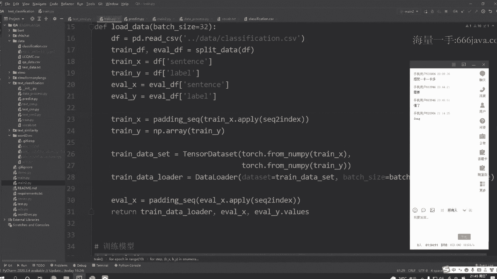

# 1447-七月在线-机器学习集训营15期 - P12：06-NLP-2-意图识别与文本匹配 - 程序员技术手札 - BV1ASste6EuZ

好啊，今天是我们这个智能问答的第二次课啊。

第二次课，那我们先来看一下，今天要给大家讲的一个内容啊，啊今天要给大家讲的有三点啊，第一点的话是，因为我们这是一个啊智能问答机器人嘛，会涉及到一些NLP方面的一些深度学习的模型。

所以呢今天第一点的话就要带着大家去看一下，如何从零啊，从零去搭建这样的一个NLP的一个模型，因为各位同学可能之前更多是去接触这个啊，机器学习的模型对吧，更多使用的是这个CCLEAR。

那对于深度学习这一块呢，我们该怎么去构建这样的一个模型呢，然后今天第一部分叫给大家讲解一下啊，了解一下，那知道了如何构建一个NLP模型，那我们就来看第二部分啊，就关于这个文本分类模型啊。

因为我们在上次课的时候给大家介绍过，我们会做这样的一个意图识别，就判断用户到底是一个闲聊，还是一个专业领域的一个问题对吧，所以呢我就会涉及到一个文本分类啊，文本分类。

那这个分类的话就需要用到我们第一部分讲的，这个构建NRP模型的一些知识啊，当然这边也会带着大家去看一些比较经典的，这样的一个文本分类的一些模型，然后第三部分的话，会带大家来看一下一个模型啊。

目前L2P必须掌握的一个模型啊，叫做transformer，这个模型呢其实是有一定难度的啊，然后这边的话，我们也会尽可能把它讲的详细一些，让各位同学都把这个模型给掌握好吧，毕竟这个东西的话啊。

啊transformer这个东西你要说复杂的话，其实还稍微有一点点复杂啊，也是这个面试当中必问的啊，必问的好，那我们就先来看我们的这个第一部分啊，如何从零去搭建这样的一个NERP的模型。

那我们可以考虑一下啊，那对于一个模型来说，对于一个N2P的一个模型来说，我们输入的内容应该是什么呢，其实如果之前有简单接触过的同学啊，或者说之前如果没有用深度学习，用机器学习的模型去做过文本分类的同学。

我相信肯定有了解过啊，就是说我们可能更多还是会把这个文本，转换成这个embedding的一个形式，然后输入给这样的一个模型对吧，把这个文本转换成一个embedding的形式呢，就包括了这个字向量。

或者说是词向量对吧，咱们的一个字词向量啊，字词向量这个东西也是在咱们上节课的时候，给大家介绍过一部分啊，介绍过一部分，那除了这个字词向量呢，其实我们还可以引入一些额外的先验特征，那什么是先验特征呢。

大家可以简单的理解为，就是各位同学在做这个机器学习的时候啊，做的这个所谓的特征工程，比如我要判断两个句子它是不是同一句，那我们可以去把这个句子的一个长度，对吧啊，它有没有相同的一个字。

有没有相同的一些词，而这些特征啊，都作为一些人工提取出来的一些特征，然后把它加到我们的模型当中，那这些东西的话，就被称为这样的一个经验特征啊，经验特征啊，除此之外呢，其实对于我们文本来说。

有时候呢还会考虑到一个语序的一个问题对吧，语序的一个问题，那对于我们一个普通的一个模型来说，如果你没有去考虑这个语序，那这个时候其实我们应该把它的一个位置信息，也传递给模型对吧。

像我们常用的一些基础模型啊，像这个CN或者说RNN，那对于RN这个模型来说，它是这样的一个创新的一个结构啊，创新的一个结构，那它自带了这样所谓的一个位置信息，也就是位置特征对吧。

但是对于CN这样的一个模型来说，它实际上并不是这样的一个时序的一个模型，并不是一个序列的一个模型，所以呢对于这样的一个模型啊，我们有时候就需要考虑，是否需要把它的这个位置信息给传递进去。

因为每一个词在这个句子当中，它的这个位置不一样的话，对这个句子的一个语义是会有一定的影响的，比如我喜欢你和你喜欢我肯定是两个意思，对吧好，这就是啊先验特征啊，检验特征，Ok。

那接下来的话我们就来详细说一下，前面这里提到的这个自向量和这个词向量啊，自向量和磁向量，那自向量和磁向量它各有什么优缺呢，我们可以看一下啊，我们先来看自向量，自向量顾名思义啊，就是分字嘛对吧。

我们拿到一个句子之后，我们先对这个句子把它一个一个的字给分出来，那分字它有什么样的一个优势呢，分字最大的优势就在于啊，我们的词典会特别小，对吧啊，可能我们常用的一个中文可能就啊2万个字。

2万个字左右对吧，2万个字，但是如果是词常用的词，那这个就会特别多了，我们通常2万个词啊，2万个字，那这个词典就OK了对吧，2万，那如果是词的话，我们可能就要衍生到10万甚至20万对吧，就会很多。

那这个词典很多会出现什么样的一个问题呢，就像上节课提到的啊，首先呢如果我们要把它转换成这样的一个，one hot的一个形式呢，其实就会很吃你的显存对吧，这对你的资源来说是比较损耗也比较严重的啊。

所以呢字向量啊，这就是它的一个优势，词典比较小，但是字向量它虽然词典小，那他也有自身的一些缺点嘛对吧，就是他的这个啊表述能力啊，或者说他的这个语义表达能力，肯定会略逊于这个词向量对吧。

这个是毕竟你的这个啊词，通常都是由两个字或者说三个字来组合成，这样的一个词的对吧，所以呢单纯的使用这个字向量啊，他的一个表达能力可以使略逊于这个词向量好，接下来我们再说一下这个词向量啊。

那词向量的话它的优势就很明显了嘛，就是他的表达能力，表述能力会稍微强一些对吧，但是它也有它的一个缺点啊，首先就是受分词的一个影响啊，你分词的时候，你通常都会去调用一些三方的一些包对吧。

那你这个分词分的好坏，其实对你最终的结果是会造成一定的一个，影响的对吧，这是一点啊，其次呢就像刚刚说的啊，我们如果要分词，那这个词典就可能会很大，甚至会你分完词之后，当你来了一个新的一个句子啊。

你可能会在这个词典当中找不到对吧，就容易出现一个OV的一个问题啊，卡吗会卡吗，呃我这边应该是稍等一下啊，我看一下，稍等一下啊，我这边先停一下，稍等一下，好我们再看一下，现现在会卡吗。

我这边掉帧是正常的哦，掉帧是零，应该这位同学要不要刷新一下看一下好吧，你刷新一下看一下，我这边网速应该也是没有什么问题的啊，好我就继续了啊，我就继续了，如果有什么问题的话，你再提出来。

好刚才说到这个词向量啊，磁向量它会受这个分词的一个影响，其次呢容易出现这样的一个OV的一些问题啊，所以说这个字词向量它其实是各有优缺啊，各有优缺，那接下来的话简单说一下。

这个动态支持向量和这个静态支持向量啊，还有这个所谓的随机字词向量，那通常我们再去构建这样的一个，深度学习的一个模型的时候，那通常第一层实际上我们都会有这样的一个，embedding层对吧。

就对一条文本信息啊进行一个embedding编码，然后再给到后面的一个模型，再给到后面的一个model，那这里这个embedding层，其实就存在一些初始化的一些方法啊。

啊例如我可以预先去训练这样的一个向量，就像我们昨天那节课给大家讲过的这个词向量，对吧，我可以提前把它给训练好，训练好之后呢，我再用那个词向量啊，来初始化这里的这个embedding层。

初始化这个in bedding层，然后呢我们在BP的过程中啊，我们在BP的一个过程中，在不停的去更新这个embedding matrix，这就是所谓的一个动态支持向量，那静态这次向量什么意思呢。

还是使用刚才我们预先训练好的，这个字词的一个音，那个word word vector那样的一个向量，来初始化这样的一个emmanding matrix，但是啊我们在BP的过程中并不更新。

这个embedding matrix，只更新后面的模型部分啊，前面这一层我们是不更新的，不更新的，这是一个静态支持向量啊，那随机支持向量就很好理解了啊，就是我们每次并不会预先去初始化。

这个embedding match matrix，而是随机初始化的啊，随机初始化的，然后我们再模型更新的一个过程中呢，也会去更新这个embedding matrix，好，这就是我们这个字词向量啊。

字词向量，当然啊我们在使用这个字词向量的一个过程中，大家也可以同时去把这个字向量和词向量，结合在一起，输入到后面的一个模型都是OK的好吧，例如我这里可以啊，搞两个这样的一个embedding层。

两个embedding层啊，这个是try embedding，这个是WAREMBEDDING，那这边其实就会输出这样的一个char embedding，对吧，这边是输出的对应的一个。

左边是输出的一个字的embedding，右边输出的是一个词的引白点，那你可以对两者进行这样的一个相融合，相加的一个操作，或者说你可以做一些拼接的一些操作，都是OK的，好吧好，这就是我们的这个字词向量啊。

字词字词向量好，我们继续往后啊，这边的话再简单说一下这个先验特征啊，其实刚才也简单提到了，其实说白了就是咱们的人工提取的一些特征，对吧，这个就是在机器学习当中比较多啊，例如我刚才举的这个例子啊。

我们要去做这个文本匹配，那我们可以去判断一下，两个句子当中有多少相同的一个词对吧，文本的长度相差多少，那通常如果两个句子它是同意的话，他可能这个句子的长度会比较接近对吧，那啊在文本匹配当中呢。

是否会包含一些特定的一些关键词呢对吧，这些都是大家可以去尝试挖掘出来的，像再举个例子啊，我们如果要做这个情感分析，那你做情感分析的时候，实际上有时候可能也会有一些，比较关键的一些词。

你会认为啊只要出现这样的一些词，就一定认为他就是这样的一个负样本对吧，那你可以把考虑把这些词作为这样的一个特征，给加到模型当中对吧啊，这就是所谓的一个先验特征啊，所以先验特征。

大家就可以把它理解为所谓的一个特征工程啊，特征工程，那这一块相信各位同学啊，应该已经非常熟悉了啊，好那接下来的话我们再来介绍一个概念啊，叫做这个词典的一个构建词典的一个构建啊。

之前我有一直在说这个词典词典，那如何去构建这样的一个词典呢对吧，那通常我们去构建一个NLP的模型的时候，第一步都会去构建这样的一个词典，因为你如果没有词典，你就没有办法把你的字或者是词。

转换成这样的一个one hot的一个形式对吧，所以呢我们就要先去构建这样的一个词典啊，构建词典，那构建词典的第一步呢，大家需要先确认一下，你的一个输入形式到底是什么样子的，是要分词呢还是要分字啊。

如果你要分词，那你这个构建词典的时候，你就应该按照啊分词的一个形式去做，你不能说你构建词典的时候在分词，让你后面训练的时候去分词，那肯定是不行的对吧，其次呢对于这个分词的一个过程啊。

你在构建词典的时候和你后面训练的时候，用的分词器一定要是一样的，这样才能保证你分词分出来的一个，结果是一样的，好吧，千万不能混用，你说哎你前面构建词典的时候，你用的是A分子期，后面进行模型训练的时候。

你要用的是BE分子器，那这样肯定是不行的，这里必须保证这个分词器啊是一样的，那啊，假如我们现在是在用分词的一个方式，来构建这个词典，那首先第一步呢，肯定就是把我们的这个语料，读到我们的内存当中。

然后进行分词，分完词之后呢，我们通常会根据这个词频啊，进行这样的一个排序啊，排序把这个词频比较高的就放到前面，词频比较低的啊，就放到后面啊，放到后面，那在我们进行训练的一个过程中啊。

就可以直接从这个词典当中就可以获取，每一个词它对应的一个下标啊，我们可以简单看一下啊。

啊我们这边有一个有个词典啊，这里有一个词典呃，这个词典大家可以看一下啊，第一个啊，这边这两个我们先不看了，像这些的话就是我们一个一个这样的一个词啊，什么保险是你什么对吧。

这些呢就是按照这样的一个词瓶的一个顺序啊，我做了一个啊从大到小的一个排序啊，就全部排在了这个位置，这就是我们得到的这样的一个词典啊，词典，那我们把这个词典，同时也把它加到内存当中对吧。

当我们来一个句子的时候，我们分完词，就可以从这个词典当中拿到每一个词，它对应的一个下标对吧，然后它的下标。

啊这就是我们的一个词典啊，词典，OK那在词典当中呢，我们通常其实还会有一些比较常见的一些，标记位啊，标记位，然后这里呢给大家介绍四个比较常见的标记位，首先第一个呢是一个这样的一个啊补充位啊，补充位。

他这是干什么的呢，举个简单的例子啊，就假如我现在啊有一个句子，这个句子的一个长度呢，它假如是五，而现在我还有另外一个句子，这个句子的长度是八，好我接下来还有一个句子啊，这个句子的长度是十。

那这个时候其实我们要把这三个句子作为一个，batch size对吧，同一个batch它给到我们的模型，让模型去训练这一批数据，但现在如果直接给到模型，其实是有一定的一个问题的，什么样的一个问题呢。

就是它的一个长度是不一样的嘛，它的一个数据大小是不一样的对吧，我第一个句子有五个词，第二个句子有八个词，第三个句子有十个词，那我这个模型没有办法去处理，这种所谓的一个变长的一个数据啊，那该怎么办呢。

我们通常呢就会做这样的一个补偿的一个，炒操作啊，假如我们令我们这个句子的最大长度是十是十，这个时候呢，我们就会给这个长度只有五的这个句子，去添加一个pad way，添加一个这样的一个pad way。

就一直加啊，加五次加五次，直到它的长度变成十，那这个时候其实这个pad为。

我们其实已经在刚刚这个次我们这个词典，自定义的这个词典当中已经看到了对吧，我会把它放在第一个位置啊，第一个位置，然后我们进行转换的时候呢。

就会把这个pad y啊，用零的这个下标把它转换出来，零的下标转换出来，这就是pathway啊，主要是用来补常用的补偿用的，那对于八这个来说，长度为八的这个句子也是一样的啊，那我们就补充两个就OK了。

补充两个就OK了，就这个意思啊，然后呢我们这边再给大家介绍一个标记为，叫做这个UNK，这个UNK什么意思呢。

其实表示就是未知的一个词啊，还是看一下这个词典啊，这个词典一共是有400多个词嘛，就很小的一个词典对吧，很小的一个词典，那就400多个词，就很容易出现一个所谓的OOV的问题。

也就是说我们这个词可能不在这个词典当中，那如果不在这个词典当中呢，我们就用这个UNK来表示啊，用UUNK来表示。

也就是咱们的一个未知词未知词啊，然后这边的话还有两个标记位啊，一个是起始词，一个是终止词，那这两个标记位主要是用来干什么的呢，其实这两个标记尾啊，更多是用在我们的这个序列生成的一个任务。

例如我们这里有这样的一个sequence，sequence的一个模型对吧，上节课简单给大家提到过啊，它的一个结构就是有一个encoder，一个decoder，那通常呢我们就会在起始位置啊。

输入一个起始符，然后告诉我们模型啊，我们现在这是起始位置啊，起始位置，那同时我们在啊这边进行一个输出的时候，我们这边模型会输出这样的一个结束符啊，结束符表示就是哎我当前是最后一个位置了。

我后面不需要进行继续输出了，就这样的一个意思啊，好这是几个比较常见的标记位啊，然后在我们的这个BT这个模型当中，BTBT这个模型当中呢，它也有自己定义的一些标记位，像cl s s e p。

那这些标记我也是干什么的呢，到时候我们给大家啊，后面如果介绍到BT的时候，我们再给大家简单提一下这两个标记位，好吧，这里就啊不再展开讲了啊，最关键的就是这两个啊，首先第一个是head的标记位。

另外一个是咱们的一个NA好吧，这两个是比较关键的啊，这两个比较关键，好这是我们的一个词典的一个构建啊，词典的构建，好，我们接下来看一下，关于这个输入长度的一个统一啊，其实这个东西刚才也有说过。

一部分就关于这个pd标记位，对吧啊，我们刚刚是这么说的啊，如果是五的句子，长度是八的句子，还有个长度是十的句子，如果我们要统一成长度是十的，那我们就添加这个pad way对吧，Pad way。

那现在有个问题啊，啊假如我的某某某一条句子特别长，我这个句子可能长度是啊200或100，或者说200对吧，但是这样的一个句子可能就一两条，如果全都把它补充为200的一个长度，实际上是没有必要的嘛对吧。

那这个时候我们就会去做一些截断的一些处理，比如我们设置我们的这个啊最大长度是八，那对于比较短的，那我们就去补这个pad way，补拍的way啊，那对于长度是五的，那我们只需要补三个pad位就OK了。

那对于这一个比较长的来说，我们就会把它给截取啊，把最后两个词给截掉，让它的长度变为八，就是这样的一个意思啊，就这样的一个思，那补偿的话其实有两种补法啊，一种是补前面我们也可以后面啊。

那截取其实也是一样啊，你可以去截前面，也可以去截后面，那到底应该是截前面还是截后面，大家其实可以去分析一下，你自自己的这个具体的一个数据，如果你的数据你去分析完之后，你发现很多比较重要的信息。

会集中在前面的部分对吧，那你在进行截取的时候，就可以去截前面，如果你的信息比较重要的是在后面的位置，那你也可以去截后面的一个位置啊，还有一种情况啊，那假如啊我现在这个啊，假如我的最大长度是嗯。

假如我说个100好吧，100，而现在呢我有个有个句子啊，这个句子它可能是150啊，你这个时候分析之后，你会觉得哎呀，我我也不知道到底应该截前面好还是后面好，那还有一种方法啊，你可以去取前面0~50。

再把后面的，就是你取前面的50，再取后面的50，然后把它给拼接在一起，就以这样的一个形式啊，也是OK的，好吧啊，这是一些常用的截取的一些方法啊，方法对，Ok，接下来的话再给大家简单介绍一下。

这个生成器啊，生成器，那通常啊我们在训练一个模型的时候呢，我们这个语料有时候会特别多对吧，那如果你一次性把所有的这些语料都给它，加到这个内存当中，你的内存可能是放不下的啊，放不下的。

毕竟啊我们这个语料有时候可能一两万，有时候可能几10万对吧，都是有可能的，那这个时候我们应该怎么处理呢，那通常我们在训练这个机器学习的，模模型的时候呢，都是以一个背驰，一个背驰的一个进行一个训练对吧。

那我们在读取数据的时候，实际上也可以以一个背驰，一个背驰把这个数据给读取出来对吧，没必要一次性全部给读取出来，那这个时候呢我们就可以而使用啊，咱们拍套是当中的这个啊。

TENSLDATASET和这个data loader来组成，或者说来生成这样的一个生成器啊，生成器，那我每一次就可以取出一个被ch size的一个数据，然后给到我们的一个模型啊，给到模型。

然后我们这边呢这个所有的这个模型呢，接下来都会用这个PYTORCH来教大家写好吧，用PYTORCH教大家写啊啊这是一个生成器，那这里可能啊我单纯这么说，可能说的不是特别清楚啊。

然后待会待会我们在那个代码当中，我们也会详细的来看一下这个啊，TENSLDATASET和这个data loader好吧，到时候我们再具体来看这个东西到底该怎么用，好，说完生成器，我们继续往下啊。

我们简单来说一下，关于在这个PYTORCH当中，我们该如何去构建一个模型，而这个时候有的同学可能会说，我之前完全没有用过这个PYTORCH啊，现在就直接让我来构建这样一个模型，会不会难度太大呢对吧。

其实呢PYTORCH这个包呢，在构建模型的一个过程当中是非常简单的啊，非常简单的，它是如何去构建一个模型的呢，首先呢如果我们要构建一个模型，就需要自定义一个类啊，自定义一个类。

然后继承自这个NN导MODUNN达mode，继承完了之后呢，我们需要重写一下这个构造方法，和咱们这个符号的方法，那构造方法是干嘛的呢，通常就是去初始化一些参数对吧，初始化一些参数。

相信这个学计算机的同学，这一块应该是很清楚的啊，而第二个方法呢是这个forward的方法，这个for的方法是在干嘛呢，大家可以理解为，它就是在做我们的一个前向传播好吧，前向传播，额这里这个构造方法啊。

除了刚才说的初始化一些值，那通常呢我们还会在我们这个构造方法，能知道啊，去提前就是定义好我们需要的一些layer，例如我现在需要这样的一个卷积层，对吧，我需要池化层，或者说我需要这个LISTM层。

那我就会把这些模型给在这个构造方法当中，提前构建好，然后呢我们在我们的for word方法，也就是前向传播的这个过程当中呢，就把构造方法当中构建好的这些雷影啊，一层一层的拼接在一起。

就完成了我们的这个前向传播的一个过程啊，for word方法就是前向传播，把定义好的layer全部串起来啊，全部串起来，这就是这个PYTORCH，构建模型的一个使用过程啊，其实是非常简单的非常简单的。

待会呢我们也会带着大家使用这个PYTORCH啊，从零来构建这样的一个深度学习的一个模型，然后当你走一趟的时候，你就会发现其实很多东西你就清楚了好吧，待会我们再来详细的去写这个代码啊。

好啊，这就是我们的这个第一部分啊，第一部分啊，关于这个啊如何从零去搭建一个NLP的模型。

好简单的说一下啊，其实首先第一点呢就是我们需要去确认一下，我们到底是应该以这个字向量作为输入呢，还是此向量作为输入对吧，其次要考虑一下，你要不要去加一些额外的一些经验特征啊，或者之类的。

其次呢我们考虑好新上上述这一点之后呢，你就可以去构建这样的一个词典对吧，构建完词典之后呢，你要去做一些数据的一些预处理，包括去做一些长度的一些统一，你要去补pad way。

或者是做一些这样的一些截取对吧，呃，下一步的话就是去构建我们的这样的一个模型，模型构建好了，那你就可以训练模型啊，整个流程大概就是这个样子，好吧好，我们这边先停一下啊。

看各位同学对于这一块有没有什么问题，有问题吗，各位同学，都没有问题是吧。

好没问题的话，我们就继续啊，继续我们来看我们的这个啊。

本节课的第二部分啊，也就是我们的这个常见的文本分类模型啊，那这一节课的话，实际上我们是要给大家讲解这样的一个，分类模型的啊，这一这一部分其实在上节课的时候，也给大家提到过啊，也就是在这个意图识别这一块。

印度识别这一块，也就是说当用户的问题输入进来之后呢，我们会经过一个这样的一个，意图识别的一个模型，说白了他就是在做一个文本分类对吧，我们会判断一下啊，他到底是这样的一个闲聊呢。

还是这样的一个封闭域的一个问题好，如果封闭的话就走，我们昨天给大家介绍的这个检索式这一块对吧，检索时这一块好，那接下来的话我们就来详细看一下，对于这里这个意图识别这个分类模型，我们到底该怎么做啊。

怎么做额，首先这个是这边可以给大家简单看一下啊，这边我这边有一个这样的一个，闲聊的一个语料啊，闲聊的一个语料啊，大家也可以过去，把这个闲聊的这样的一个语料给加载一下啊，他这个闲聊语料其实很多啊。

很多各种杂七八杂八的其实都有啊，都有，那我们的一个训练集它是什么样子呢，我们可以看一下这边啊，就等于我是把这个数据齐给拿了过来。

然后呢，再和我们的昨天给大家讲的那个，保险的那个数据啊，把它合在了一起，那合在一起之后呢，哦我们看一下啊，是这个啊这个数据这个数据合在一起，那对于他是这样的一个保险类的问题呢。

我就会把它设置为零这个类别啊，零这个类别，如果他是闲聊，我就会把它设置为一这个类别好吧，一这个类别，好这是我们的一个数据集啊，数据集整体来说其实对于这个分类来说，难度不高啊，难度不高，好。

这是我们的一个数据集。

然后大家下来的话，也可以自己去构建这样的一个数据集，闲聊的部分的数据集，你就往这边去取就OK了，然后把它设置为一个类别，然后咱们昨天的那个啊这个数据对吧，拿过去把它作为我们的另外一个啊类别，就OK了啊。

OK了好，这是我们的语料啊，语料我们继续往下好，那有了我们这样的一个训练语料之后呢，我们看下面啊，那接下来的话就给大家介绍一下，咱们的这个几个比较常见的这样的一个，文本分类的一个模型好吧。

那首先是咱们的一个输入输入，刚才已经说过了啊，就是咱们的一个字词向量，你可以用自向量，也可以用这样的一个词向量，你甚至可以用语言模型来进行，这样的一个初始化的一个方式啊，好，然后第二部分的话是。

我们就来详细说一下，这样的一个文本分类的一个模型啊，呃文这里文本分类的模型呢，我给大家总结了五个模型啊，五个模型，那这五个模型的话，希望大家下来都能掌握好吧，而在我们的这个课程当中呢。

我们只会去讲这个TXCNN啊，也不是只会讲这个模型啊，是主要去带着大家去写这个模型，而其他模型，我希望各位同学下来，自己花时间去了解的更深入一些，然后自己去把这些模型给实现好吧，理解起来其实都很简单啊。

都很简单好，我们就看一下，为什么我会给大家说这介绍这五类模型呢，首先第一个模型是这个fast text，这个模型它结构特别简单啊，特别简单，简单到什么程度呢，它实际就是把咱们的一个文本啊，文本text。

然后给到这样的一个embedding层，embedding层，那给到这个embedding层之后呢，最后再给到我们这样的一个分类层啊，分类层你可以是一个soft max，你可以是一个SIGMOID对吧。

就给到这样的一个分类层，就能得到我们的一个分类的一个结构啊，这是fast text，那这样的一个模型呢，它比较适合用于，就特别明显的那样的一个分类场景，而且它比较适合短文本啊，短文本就特别特别明显。

分类及特别明显短文本的一个场景，大家可以使用这个force text好吧，然后呢是我们的啊，这个TXCNNTTCN，这个东西呢比较适合去做这个，短文本的一个分类。

那为什么tag cn只适合做短文本分类呢，因为我们这里使用的是这样的，CNN的一个模型，那CN其实通常没有办法去捕获这个太长的，这样的一个特征的一个依赖，所以呢通常比较适合用于处理这样的一个，短文本啊。

短文本，而对于我们的这个数据集，其实大家可以看一下，其实也属于一种比较短的一个文本对吧，都是比较短的，可能就十几20个字的样子啊，比较短。

所以呢我们就今天也主要给大家介绍这个tag森，这个模型，然后如果是长文本呢，推荐大家可以去尝试使用这个，HAN这个模型啊，那HAN这个模型它啊，底层其实是一个LSTM的一个结构好。

然后呢是一个比较通吃的一个模型啊，这个模型呢你可以去处理短文本，也可以去处理长文本都是OK的，也就是一个双向的LSTM，再去加上这样的一个attention的一个机制啊，attention的机制。

那这个attention是什么东西呢，这个东西我们待会给大家讲好吧，LSPM我相信各位同学应该有一定的了解过，可能了解的不深啊，各位同学也可以下来，多花点时间，再去看一下。

这个双向的LSTM到底是什么样子的好吧，那最后的话再给大家提供一个终极方案啊，也就是咱们的预训练的语言模型叫BT，来做这样的一个微调啊，BERT做微调，就是说你在实际的一个工作过程中。

你可以先去使用上面这几个模型去尝试一下，效果怎么样，那如果尝试出来效果不是很理想，那你就可以直接上BT，那贝尔特最大的优点就在于它效果很好，但是它也有一定的一个缺点，就是速度比较慢啊，速度比较慢。

那假如我现在已经在用这个text c n，我这个效果已经能达到98%对吧，99%已经可以打，满足上限的一个要求了，那你实际上就没有必要去上这个bird对吧，毕竟我们这个TAXN速度会快很多啊，快很多。

咳咳好，这是额五个模型啊，然后我们就分别来看一下啊，分别来看一下，首先说一下这个fast text，fast text其实刚刚也和大家简单说过嘛，对吧，也和大家简单说过。

它其实结构和咱们这个word vector当中那个CBL，其实结构会很类似啊，cl结构很类似，那SB模型是什么样子呢，就是输入咱们这样的一个上下文对吧，输入咱们的一个上下文，然后去预测这样的一个词。

那不同的地方是什么呢，就是fast text，它其实预测的它不是中间的这个词啊，不是中间的这个词，而是这是T减二对吧，这是WT减一，这是WT，然后WT加一，这是wt加R啊。

他把这几个词啊给到了我们的这个模型，然后最后再来进行这样的一个分类啊分类，所以说force text和我们的一个SL结构会很像啊，其实可以看到啊，非常简单对吧，真的非常简单，非常简单好。

这就是fast text，那这个因为实在太简单了，其实带着大家写代码的话，其实意义也不是很大啊，不是很大，好我们继续往下啊，嗯接下来说一下这个比较重要的一个模型啊，这个模型也是今天课程当当中呢。

会大大带着大家一起去写的这样的一个模型，也就是我们的这个TXCN好吧，TAXN这个模型呢这边有两篇论文啊，这两篇论文我都建议大家下来去自己阅读一下，好吧，最好是把两篇阅论文都阅读一下。

这两篇论文其实都是讲用这个CN来做这样的，文本分类的啊，文本分类，那他的一个思想是什么呢，其实它关键就在于啊，他会利用这样多个不同大小的，这样的一个kernel啊，来提取句子中的一些关键信息。

他的这个思想是什么呢，就是说啊我们一个句子对吧，我们X1X2X三，假如我们有这样的一个句子啊，这个句子由五个词组成，那假如我们的kernel大小是一，那每次就等于是提取了一个词的这样的，一个特征对吧。

也就是所谓一个词的一个特征，那如果我们的kernel是R呢，它实际上每次要提取的是两个词的一个特征，那我们kernel大小是三，它实际提取的就是三个词之间的，这样的一个特征，所以这样的一个思想。

就类似于多个窗口大小的这样的一个，n gram的一个思想，或者说我同时提取了一个字的特征，词的特征，甚至短语的特征，甚至段落的一个特征对吧，但段落说的有点过了啊，更多还是词的特征和这个短语的一些特征。

从而呢我们让这个模型啊，从不同的一个力度去捕捉文本的这些特征，或者说它的这样的一个相关性好吧，这是这个模型的这样的一个思路啊，思路好，我们就接下来就详细看一下这个模型，它的一个结构是什么样子的啊。

嗯首先是我们的这个第一层啊，第一层第一层的话就是最左边这个啊，最左边这个他这个音我们可以看一下，1234567，一共是七个词对吧，那这里就等于是一个七行五列的这样的，一个举证啊，七行五列的一个矩阵。

那七的话表示就是我们这个词的一个个数，五的话表示的就是咱们这个，embedding的一个维度，我们这里因为是一个图嘛，就写的比较简单啊，就是一个五维，也就是说我们每个词。

它有五维的一个这样的一个向量好吧，但实际上我们在构建模型的时候，肯定会把这个维度设置的稍微大一点点啊，稍微大一点点，那大家也可以简单的把这个这个东西啊，就看成是我们这样的一张图片。

看成是这样的一张图片啊，OK那接下来呢我们就会去按照刚才的一个思路，是什么，去定义这样的一个不同大小的，这样的一个kernel嘛，对吧，我们可以看一下啊，这里实际上呢就定义了三种。

不同大小的一个kernel啊，首先第一个kernel我们可以看一下，他这个kernel实际上是一个1234，就是一个4×5的对吧，一个4×5的一个克隆，这个深红色的和这个浅红色的啊。

这两个是4×5的一个克隆，那这两个绿色呢它是一个3×5的克隆，到最下面这个黄色的，就变成一个25的一个KERO，那这个25的kernel，大家就可以理解为我这里提取的就是两个词，两个词的一个特征对吧。

然后这边的话绿色的大家可以理解为，我每次提取的就是三个词和三个词之间的，这样的一个特征，也就是一个短语的一个特征嘛，那这边也是同理对吧，提取出来这样的一个短语的一个特征啊，呃大家这里需要注意一下啊。

就每一个大小的一个kernel，我其实是有两个对吧，就这里这个深红色4×5，我们这里还有个浅红色的，也是一个4×5，那为什么需要两个kernel呢，其实用一个kernel也可以。

但是一个kernel它可能提取出来的特征，他没有那么多，所以呢我们通常都会搞多个坑的，你甚至这里搞十个，搞100个科隆都是OK的，好吧，嗯CURREN越多的话，你提取的特征也会越多一些，当然了啊。

这个实际上属于的是这个超参数啊，超参数大家要根据实际情况去进行一个调整，那如果你的KO太多的话，就可能也会出现一些所谓的这个训练时间过长，或者甚至出现一个过拟合的情况，也是很容易出现一些过拟合的情况。

也是可能的对吧，所以我们这kernel到底应该选多少，你可以去根据你自己的一个情况，去进行这样的一个调整，好吧好，这是我们的一个，这个kernel啊，kernel好，那我们定义好这个kernel之后呢。

就会可就可以把我们的这个kero kernel啊，作用在我们原来的这个7×5的这个，embedding上面对吧，我们先用这个深红色的去做这样的一个，卷积的一个操作啊，卷积的一个操作。

那就可以得到一个4×1的一个结果，卷积之后的一个结果对吧，4×1的一个卷积之后的一个结果啊，这边我简单问一下，对于这个卷积的一个操作，各位同学了解吗，这个卷积的操作就是这个卷积。

为什么这个7×5和47×5的原始数据，有一个45的一个kernel，进行一个卷积计算之后，为什么是得到一个4×1的一个结果，这个东西大家清楚吗，这个清楚吗，各位同学有没有不明白的同学，这里需要讲解吗。

都是知道的是吧，大家有问题一定要及时提出来好吧，一定要及时提出来，我们这个嗯还是需要讲一下是吧，好我们看一下啊，我们看一下这个卷积操作它是在做什么呢，我们这边简单画个图啊，假如我们的原始数据是这样子的。

它是一个2×2的，那如果我们的这个卷积核它也是这样的，一个2×2的卷积核，那这两者作为一个卷积操作，它是怎么做的呢，实际上啊就是把这个位置的值啊，我用我这边用O1来表示吧，好吧，这是O2。

这是O3是O4，然后这边我用啊K1谁呀，谁3A4，这个卷积操作是怎么做呢，其实就是一个对位相乘相加，那最终就是O1乘以K1加上O2乘以A2，加上O3乘以K3，加上O4乘以K4。

这就是我们卷积之后的一个结果啊，卷积之后的一个结果好，那我们看这里啊，我们看这里，那如果我们用这个4×5的作用，在这个7×5的上面，我们可以看到啊，它实际上就会把这些位置给遮住对吧，这些位置给遮住。

这个时候呢我们计算出来的是一个值对吧，这个值就是放在这个位置，就放在这个位置这里没问题吧，那这个时候其实下面还有三块，它实际上是没有计算到的嘛，这个时候呢我们会把这个卷积核往下面平移，一个位置。

平移一个位置，那平移之后呢，就变成了这个位置，也就是变成了这样的一个位置啊，我们就等于是在这个位置当中又进行一次卷积，就是对位相乘相加，然后得到这样的一个位置的一个值。

而接下来呢我们又往下面进行一次平移，再平移一次呢，就变成了这个位置对吧，我们在对这个位置啊，做一次这样的一个卷积的一个操作，而得到的结果在这里同理啊，我们再往下面平移一次，最后得到的结果就是在这个位置。

所以这里最终得到的一个是一个，4×1的一个结果啊，我有说明白吧，这位同学我有说明白吗，这就是一个卷积的一个操作啊，卷积的一个操作，就是一个对位相乘相加的一个操作，然后进行一个平移。

把所有的这个都给计算一遍，好OKOK那啊对于第一种大小的这个卷积核，我们计算完之后呢，我们再看一下绿色的这个卷积核啊，那对于绿色的这两个卷积核，一个深绿色的，一个浅绿色的。

其实和刚才的这个计算方式也是一样的啊，只不过这个大小是三对吧，那我每次计算这个卷积的时候，就是取三行来进行一个计算，所以它最终的一个输出的一个结果是5×1啊，5×1，所以大家需要注意一下，是5×1。

那同理啊，对于下面这个黄色的，它是一个2×5的一个卷积核，那我们每次在进行卷积操作的时候，取的就是两行，所以最终计算出来的一个结果啊，就是一个6×1的一个结果，6×1的一个结果好。

这就是我们卷积层卷积层，OK那卷积层结束之后呢，我们通常都会在卷积层之后，去跟一个这样的一个池化层了啊，这里尺的使用的是这样的一个最大池化层，最大池化层是在干什么呢，就是取一个最大值。

你看我们这里不是有四个值嘛对吧，那我们就取这四个值当中的一个最大值，然后把它取出来，这里也是一样啊，四个值取个最大值取出来，然后下面也是一样的，这五个值这五个值取最大值取出来，下面这个黄色也是一样啊。

同理最后呢我们实际上就会得到六个值对吧，这里两个红色的，这里两个绿色的，这里两个黄色的纸，然后我们把这这分啊，这这六个值啊，把它给拼接在一起，拼接在一起，那对于这个这个值呢，它实际上就是一个啊。

长度为六的这样的一个向量对吧，这个向量表示的就是我们最终句子的，这样的一个特征向量，我们再把这个句子特征向量啊，给到我们后面的一个分类层，分类层来做我们的一个多分类，或者是一个二分类，二分类的话。

那你搞个SIGMOID，如果多分类的话，你就搞个soft max就OK了，好吧，这就是我们整个这样的一个taxi，taxi其实结构也是非常简单的对吧，结构非常简单，但是这个结构可以让大家学到很多东西啊。

首先是我们的这个池化层这一块，然后其次我们的啊这个好，首先是我们的卷积层，要是我们的池化层，要到最后我们的这个分类层对吧，那这个模型呢，它整体来说网络结构是非常简单的，而参数也很少可以。

各位同学可能在使用的时候，在自己的笔记本上就可以简单啊跑起来了，甚至你用CPU跑都是完全没有问题的啊，完全没有问题的，那这个模型的话啊，除了它计算量比较小之外呢，它其实本身这个效果还是不错的啊。

还是不错的呃，待会我们也会详细带着大家啊，把这个代码给写一下，好吧好，这就是我们的这个TAXZN啊，也是我们今天的一个重点啊，重点好，那说完TXN，我们再来说一下这里这个HAN这个模型啊。

HAN是干嘛的，还记得吗，是用来处理这样的一个长文本的对吧，长文本好，我们来看一下这个模型是干嘛的啊，嗯这边也是一样啊，我们这边会有一个论文的地址，各位同学可以去看一下这篇原论文好。

首先是我们来看一下这个模型啊，这个模型它其实是分为了啊四个部分啊，首先第一个部分是我们这个WARENCODER，这个部分是在干嘛呢，实际上我们就等于啊，我们这里是每一个这样的一个词的一个。

embedding对吧，一开始我们实际上输入的是这样的一个one hot嘛，one hot呃，经过了这样的一个embedding层之后呢，拿到每一个词的这个word embedding对吧。

然后WARENCODER这一层呢它是一个GRU的模型，GRU这个GRU是什么模型，它其实也是一个LSTM的一个变体啊，是一个LSLSTM的一个变体，它相比于LSTM来说，他做了一些这样的一个改进啊。

大家也可以把它就看成是LSTM，他搞了一个这样的一个双层双向的，一个这样的一个GRU的一个模型，然后对我们输入的这个词，进行这样的一个特征提取啊，特征提取提取完之后呢，他会在把这个提取出来的一个特征。

去做这个所谓的一个attention的一个操作，这个attention是什么东西呢，好我这边简单说一下啊，什么是attention，而TENTION的意思就是说。

我们要对每一个这样的一个这里的这个输出值，给他一个权重，理论上来说我们一个句子对吧，每一个词它应该有自己的一个对应的一个权重，就像各位同学去理理解一一个句子的时候，这个句子肯定是有些词它是比较重要的。

有些词它实际上是不重要的，它可能是些废话对吧，那对于那些比较关键的词，我们就会给它一个比较大的权重，对于一些无关紧要的一些词，我们就给他一个比较小的权重，从而有了这些权重之后呢。

我们就可以对我们的这个每一个词的这个vector，去做这个所谓的加权求和，就这样的一个意思啊，也就是说我们这里啊对于每一个词，我们都会拿到这样的一个权重，拿到这样的一个权重。

我们会把这个权重呢和对应的这个词的一个，向量表示做一个相乘的一个操作，最后再把它给相加起来，相加起来，最后我们就会得到这样的一个，句子的一个embedding，句子的embedding。

其实这个东西和上节课我们也简单说过嘛，我们上节课要在做句子，embedding的时候是怎么做，是求的平均吗，求平均，它其实也是也可以理解为一种腾省，只是说这个腾省的权重它都是一样大对吧，都是一样的啊。

那只是说这里啊，我们这个要用一些额外的一些方法，把这个每一个词它的一个权重给计算出来，然后得到他一个加权之后的一个结果，那加权结果出来之后呢，实际上表示的就是这几个词组成的一个句子。

的这样的一个embedding啊，Embedding，那接下来的话我们再来看这一层啊，这一层是叫做sentence encoder，这里其实各位同学可以看到，它其实是有一个一个的一个句子。

这样的一个embedding，然后又给到了这样的一个GRU层，GRU层其实结构和下面这里是一样的啊，经过加U层之后呢，再把每一个句子的这个embedding，进行了这个特征提取。

再经过这样的attention的一个处理，再做一个加权求和，就得到了我们整个段落的这样的一个embedding，最后再给到我们的分类层啊，分类层，所以说对于HAN这个模型来说，他思路到底是什么呢。

实际上就是先把词进行特征提取，然后加权求和对吧，然后得到一个一个的句子的一个embedding，再把这个句子的一个embedding，给到我们的这个GRU，然后再得到它的一个权重，进行加权求和。

得到我们段落的一个embedding，最后给到我们的一个分类层，这就是HAN这个模型啊，HAN这个模型，所以说H这个AN这个模型啊，是用来处理长文本的，只有长文本你才会有多个句子嘛对吧，多个句子。

那每一个这个句子，其实它也是会有同样的一个结构嘛，那这一块的一个结构，其实和这一块的，和这个东西的一个结构是一样的，好吧一样的，其实这个时候可能各位同学就会想，哎，那既然如此，我是不是可以这么做啊。

我不要上面这一部分，就上面这一部分啊，我不要了我不要了，我只考虑下面这一部分，那我下面这一部分是不是就等于是一个双向的，加U加上一个attention对吧，那我是不是就可以得到句子的embedding。

我把这个句子的embedding再给到我们的分类层，是不是就可以做短句的一个分类了呢，是的啊，完全是可以这么做的，那这也是我这里提到的这个双向的LISTM，加腾什么对吧，加藤上啊。

只不过这里说的是一个GRU对吧好，这就是我们的一个HAN这个模型啊，HAN这个模型，OK那模型这一块的话就给大家说到这里啊，接下来的话我们就要进入到这个啊编码过程了，好我们先停一下啊。

然后bird这一块我们之后再说好吧，bird这一块，后面我看应该会花点时间给大家简单补充一下，bird这一块，好吧好，我们这里先停一下啊，啊对于这里的模型，大家有没有什么疑问。

Force text tt cn，还有HAN这三个模型，大家有没有什么疑问，有疑问的话就及时提出来，好这边我额外再说一点啊，就关于这里这个attention这个权重该怎么计算。

那这个attention其实有很多种attention啊，attention只是一个总称，实实际上呢有很多这个TENTION，有dollar的tension。

dollar product的tension，还有一些run和腾省，很多很多很多腾省啊，这个东西的话，我们后续再给大家介绍好吧，这都是一些计算权重的一些方法哈，好看各位同学有没有什么我没有讲明白的地方。

可以及时提出来啊，有问题吗，有问题吗，好行，那我们继续啊啊，然后接下来的话就简单说一下，这个作业这一块啊，作业这一块的话就是大家自己去写代码，去实现这个tag nn模型，然后把它集成到我们的项目当中去。

完成我们这里说到的这个意图识别这一块好吧，意图识别这一块，然后呢啊进阶作业的话，就大家自己去微调一下咱们这个BT这个模型啊，然后并替换咱们这个分类模型，或者说我们之后会涉及到这个匹配模型。

你都可以去进行这样的一个替换，好吧好，那接下来我们就一起来写这个代码啊，接下来一起来写代码，我们稍微休息一会吧，稍微休息一会，然后大家啊对于这里这个啊TTIN或者是JN，如果有什么问题的话。

也可以打到公屏上，我们统一解答好吧，我们待会统一解答啊，我们重点还是放到text text cn好吧，因为待会我们写代码，也是写这个TXN的代码好，我们稍微休息一会啊，休息5分钟，好啊，我们继续上课啊。

继续上课啊，接下来我们来写代码啊，写代码大家都没有什么问题是吧啊，我们这稍微停一下吧，顺便对于上节课的内容，大家看有没有什么疑问啊，如果有什么疑问的话，也可以一起提一下好吧，都是没有什么问题的是吧。

如果都没有什么问题，那我们就来写代码咯，啊我们先把这个给删了吧，好那我们来啊写这个代码啊，写代码，啊第一步的话肯定是，嗯把NN也可以导一下，好第一步还记得什么吗，好定义一个类对吧，我们就叫TAXN。

而这个tag n呢需要继承于NN导module对吧，NN导module m u m o d u，有人打model嗯好，那继承完n n w module之后是要干什么，我们可以看一下啊。

是要写我们的构造方法和符号的方法对吧，在哪里来着，去重写我们的构造方法和我们的符号的方法。

对吧，好这是我们的啊构造方法，然后呢是我们的这个啊for尔的方法对吧好。

word方法好，那写了我们的构造方法和这个word的方法之后呢，我们再看一下构造方法是在干嘛，是初始化一些值对吧，然后并定义好我们会用到的一些layer啊，Layer，那flow方法是干嘛呢。

就是做我们的前向传播对吧。

前向传播好啊，我们先来写我们的这个啊，我们先来学我们的构造方法啊。

构造方法我们可以回到这一页PPT啊，我们可以看一下啊，那对于这一页PPT来说，我们可以考虑一下啊，我们会涉及到哪些层，会涉及到哪些层呃，其实这边已经写了啊，首先第一个是咱们的embedding层嘛对吧。

Embedding，Ok，那我们就先来定义我们的这个embedding层，embedding层啊，其实定义embedding层也很简单啊，就是NN导embedding。

就可以定义好他的这个embedding层，那这个embedding层第一个参数是是什么呢，实际上是词典的一个大小啊，词典的一个大小啊，这个这个这个参数，我们实际上是可以从外面传递进来的啊。

我们可以从外面传递进来啊，我们就叫做VOCABULAN吧，我们把这个参数从外面传递进来啊，传递进来，那第二个参数呢，实际上就是我们那个embedding size啊。

我们这个embedding size也可以从外面传递进来，好我们可以给个默认值啊，假如我们就给个100好吧，100好。

这就是我们的第二个层数，embedding size好，这样的话我们就可以把我们的这个embedding层，embedding层啊，就定义好了，定义好了，OK那接下来的话我们来定义我们的这个啊，卷积层。

卷积层啊，卷积层有三种不同的卷积层对吧。

那我们就定义三个嘛啊come on，就NN导好，CD好，这就是我们的一个卷积层啊，卷积层，那卷积层呢，首先是我们的它有一个参数叫做in channel。

就是输入的这个channel它是几维的，那对于我们这个文本数据来说，它实际上就是他这个数据是一维的嘛对吧。

它不像我们的图像，它是RGB有三个通道，那我们这里in china就是1R1，也是我们的这个output channel。

output channel呢，也就是说我们这里会有输出多少个。

这样的一个channel的一个值，那我们这里会应用两个KERL对吧，那我们就可以就可以定义一个啊啊好，我们和这边保持一致好吧，和这边保持一致好，最后是我们的这个kernel size啊。

Kernel size，那这个kernel size啊。

对于我们的第一个kernel来说哦，我们这边写的是234对吧。

234啊我们可以看啊，我们这边我们可以1234来，也可以稍微大一点点，都OK好吧。

嗯我们这边就我们我们啊我们取个345好吧。

我们取个345好啊，第一个维度就是三，第二个维度的话，就是其实就是咱们的这个embedding size啊，Embedding size，嗯我们用元组来写，好我们用元组来写好。

这是我们的一个kernel size啊，第一个那对于第二个来说，我们的第二个卷积，还有第三个卷积，那就从我们原来的这个啊，或者我们跟这个保持一样好吧。

我们还是用234，我们和这边保持一样啊，234有两个三个四个好。

OK行好，那接下来的话啊，我们这个。

卷积层定义好了是吧，三个卷积层定义好了，接下来我们要定义什么，是不是池化层对吧，纯化层哎，这时候有的同学会问哎。

这不是一共六个卷积核吗，应该是六个呀，为什么是三个，因为这里output channel是R嘛对吧，output china是R，所以我们这里啊定义三个就OK啊，定义三个就OK好。

那接下来我们来看我们的池化层啊，池化层我们next put，我们的最大池化层啊，next p嗯，首先定义我们的这个kernel size啊，kernel size好，我们接下来要考虑一下啊。

我们这个kernel size，它的一个大小大小是什么样子的，我们可以看一下。

那对于第一个卷积核来说，它的这个大小是，对于这个卷积核来说，它的大小是4×5对吧，然后我们输入的文本是这个7×5，那我们这个输出值它的一个大小是怎么算的，实际上啊就是用七减掉这里这个四，然后加一。

那下面这里也是一样啊，七减掉三是四嘛对吧，然后再加一就是五呃，对于黄色这个也是一样啊，七减掉二是五五，再加一就是六啊，就是这样的一个情况来计算出来的，那这个时候，实际上我们就需要知道一个序列的一个。

最大长度对吧，我们需要知道这个序列的最大长度好，那我们这里就把这个序列的最大程度，从外面给传递进来啊，这个我们EXCELL啊，我们这个先给个默认值吧好吧，excellent默认是十。

那这边的这个最大大小是怎么算呢，是不是就是max l减掉，我们的第一个kernel的一个卷积核的大小，是二对吧，那就是减二，然后再加一，就这样形式就是这样子啊，好我们一共设有三个最大触化层，123好。

那这边就变成了啊234对吧，没问题啊，没问题，OK这样的话，我们的这个卷积层和我们的一个石化层啊，就都OK了啊，OK了啊，然后这里我们可以再搞一个DP out，那这个dropout层是干嘛的呢。

其实啊大家可以简单的理解为，它就是类似做了一个这样的一个减脂的操作，它可以防止模型过拟合好吧，它可以防止模型过拟合，他的思路，有点像数模型当中的这样的一个，减脂的一个处理。

它实际上就是随机的把某些节点给断开连接啊，断开连接，当然这个东西只会在这个训练的过程当中，是生效的，好吧呃最后我们再来啊，定义一下我们这个全连接层，我们叫dance吧啊，全连接层LINU啊。

LINUX层，那这个linear层它的一个输出维度是什么样子呢，这里这个输出维度是什么样子的。

我们可以回过头来看一下啊，这里是两个，这里是两个，这里是两个，加起来是六个对吧。

所以我们这里这个应该是六个节点，所以这里应该就是六啊，六那最后我们因为做个二分类嘛，我们可以在结尾去接一个这样的一个，SIGMOID的啊，所以我们这里可以输一好。

这就是我们需要准备的一些这个layer啊，我们的一些层好，基本上就是这些啊，就这些啊，我们这里稍微停一下啊，看各位同学这里有没有什么问题，包括这里为什么是六，没问题吧，这里为什么是六，有问题吗。

这里为什么是六，各位同学知道了吧，然后还有包括为什么这里是减2-3减四，为什么这里要加一这些清楚吗啊，都是明白的是吧，好OKOK行好，这是我们的这个for word啊，这个构造方法啊，构造方法。

那构造方法OK了之后呢，接下来啊我们就来看我们的前向传播，前向传播，那前向传播第一步，是不是就是把我们的这个，首先我们要有一个输入值啊，我们可以给他一个输入值，这个钱江传播肯定要把这个文本给进来嘛。

对吧，给进来好，那接下来呢，我们应该第一步是拿到我们这个embedding，拿到embedding的话，实际上就是执行我们的embedding层嘛，对吧，embedding层，然后把我们的X传递进来。

这个输入值实际上是一个one hot一个表示啊，一个one hot一个表示啊，也不是一个完好的一个表示啊，实际上就是他在这个词典当中的一个下标，好吧，你输入的就是每一个词它的一个下标啊。

下标它会自动去转换成一个问号的形式，然后去跟这个embedding matrix进行相乘，拿到我们这个embedding好吧，拿到我们embedding好，拿到embedding之后呢，我们这里啊。

因为我们这里是个卷积核，这个卷积操作它是一个二维的一个卷积，那在我们图图像领域啊，我们的CV领域如果是这样的一个二维卷积，它其实需要你的是四维的，四维的啊，所以呢我们这里实际上可以对我们那个。

embedding做这样的一个维度的一个啊扩展啊，扩展，我们给它加一个这样的一个维度，加一个这样的一个维度好，加了一个维度之后呢，它实际上就变成了什么样子呢，第一个维度就是我们的h size。

可以算一下第二个维度就是以，而第三个维度的话就是我们的序列长度啊，呃最后一个维度的话就是我们的这个，Embedding size，那之前的话不加的话是它实际上是这样子，是这样子这样子。

那我们因为我们这里有个in channel嘛，这个是设为的是一，所以我们需要给他额外加一个维度啊，好这里就变成这个样子啊，变成这个样子，好OK那embedding处理完了之后呢。

啊我们接下来就进入到了石化那个卷积层，对吧，卷积层点击层，我们先来执行第一个卷积层，我们的come one come one，然后给到我们的这个embedding embedding。

好这个embedding啊，我们就叫做啊，come one e out吧，好吧，Come on e out，然后接下来是二，然后是三，这边是第二个卷积，第三个卷积，那这个卷积之后呢。

我们其实需要去做个简单的一个处理啊，我们要把这个维度可以降一降，我们把最后一个维度给去除啊，最后一个维度给去除，因为这个时候最后一个维度实际上是一样啊，维度最后一个维度是一，那这个时候我们在执行这个。

我们这里是个最大池化层，实际上是一个一维的嘛对吧。

一维的我们就可以把最后这个维度给去了啊，我们可以看下这边啊。

那实际上这里是个4×1的嘛，那我们把最后这个维度给去了对吧，没有必要保留，要去直接执行这样的一个一维的一个石化，石化层，OK那磁化我们就可以啊，直接来执行啊，好我们把我们的这个卷积。

第一层的结果给给D给进来，然后是E啊，后面都是一样啊，好好啊，三第二个池化层，第三个池化层，这是第二个卷积层的输出值，表示第三个卷积层的一个输出值，对吧啊，这样的话。

我们就拿到了我们的这个池化层的一个结果啊。

池化层的一个结果，那拿到池化层的结果之后呢，我们需要把这个池化层的结果给拼接在一起，对吧，拼接在一起啊。

这里怎么拼接呢，我们可以用touch点cat方法啊，我们就可以把我们的alt1alt2，还有我们的out3，把它给拼接在一起啊，拼接在一起，然后这个的话是一个维度的意思啊。

欧码按照第二个维度进行这样的一个拼接。

那拼接完了之后呢，实际上我们还可以。

他还是会有最后一个维度嘛，对吧，我们可以把最后一个维度给去除啊，去除好，这是我们最终的一个输出值，那这个输出值我们还可以简单做一些处理啊，例如调用一下我们刚才的这个drop pot层，然后执行一下好。

OK最后呢我们再给到我们的这个啊dance，这也就是我们的全连接层啊，全连接层，我们把我们的这个维度是六的，这个向量给到我们的全连接层，然后得到一个一个值对吧，得到一个单独的一个值。

然后最后我们可以调用一下，我们这个SIGMMOID的方法，SIGMOID的方法，然后把alt值输入进来，然后最后这里啊需要降个位啊，好这就是我们最终的一个输出值啊。

输出值OK我们再把这个输出值return，把这个输出值给返回好就OK了啊OK了，这就是我们整个这样的一个啊模型模型，那我们这边模型定义好了之后呢，就可以来好这个模型啊，好我们这边稍微停一下啊。

对于for word方法这一块有没有哪里有问题的，其实整体结构还是很清晰的对吧，都是使用我们在构造方法当中定义的好的，这些层把每一层给拼接在一起对吧，拼接在一起，你看前一层拿到了输入值，然后把结果输出。

再把这个输出值给到下一层对吧，然后分别输出，就按照我们这边的这个PPTT当中的，这样的一个结构，把这个模型给组合起来，就OK了哈就OK了，好我们稍微停一下啊，看各位同学有没有什么问题，这里，有问题吗。

好那我们就继续往下啊，继续往下啊，接下来的话我们来看一下这个，词典处理这一部分啊，词典处理这一部分啊，首先呢我们这边有一个方法啊，叫做这个嗯beautiful CAB这个方法。

这个方法实际上就在构建我们这样的一个词典，我们可以看一下啊，首先第一步呢，我把这个我们这个数据啊给读取出来，这个数据也就是刚才给大家看的那个啊，嗯这个数据啊就闲聊是一。

然后如果是我们的那个保险类的问题的话，那分类就是零，我们把这个数据给读取出来，然后做这样的一个分词的一个处理，我们可以看下这个token ize这个方法啊，这里是用了这个结巴啊，来进行了这样的一个分词。

然后把结果返回那分完词之后呢，我们会对这个每一个词做这样的一个便利对吧，然后去统计它的一个词评，可以看一下啊，这是遍历每个句子，这是遍历每个句子当中的每一个词，要去统计它的词平，然后根据它的词瓶。

我们做了一个排序，做了一个排序，然后呢我这边会去啊创建这样的一个文件，再把这个文件的这个pad和这个UNKA，先写进去，写进去之后呢，我们会去便利这个排序，排好序的这个啊词典啊词典。

然后呢我们会把这个词典的这个值啊啊，也就是它的一个value，也是它的次数去做一个判断，如果这个如果这个次数呢是大于了，我们这边的这个这个数，我们就会把这个词典啊，就把这个词写到我们词典当中。

所以说这里其实是有个参数嘛，其实和昨天我们去讲那个word vector，那个参数是一样的对吧，对于词频比较低的一些词，我们就不把它加到词典里啊，不加到词典里，我这里写的是一个五五，大家也可以换一个啊。

你换个二换个三都是OK的好啊，这样的话我们就等于是把每一个词，按照他的一个词评，就写到了我们的这个词典当中，最终呢我们就拿到了这样的一个文件啊，这样的一个文件，这就是我们的一个词典的一个构建好吧。

词典的一个构建，这些都是一些逻辑代码啊，很简单很简单啊，然后呢我们再看一下这一段啊，这一段实际上就是去判断了一下啊，如果这个文件存在的话，我们就会把这个词典给读取出来对吧，读取出来。

这个词典实际上就是这样的一个键值对嘛，他的一个key对应的这样的一个value，它的value呢其实就是它一个词典的一个下标对吧，下标好，这就是我们的一个词典的一个构建啊，词典的一个构建，词典的构建。

OK那我们这边词典构建讲了。

模型构建也讲了，而接下来我们就来看一下训练代码啊，训练代码，啊我们这边，嗯这里我应该是分的好，我们先不看这个啊，这个词典是433，好，那我们这边这个词典大小要改一下啊，这里要进行重新改一下。

我们也可以把这个代码给跑一下，我们这里可以稍微设小一点，设个三吧，我们把这个词典重新构建一下啊，OK我们这个词典重新构建好了，然后一共是有600多个词是吧，600多个词嗯，我们可以看一下啊。

一共是638，然后我们这边可以改一下这个参数啊，638，然后我们把模型重新导入一下啊，我们的模型是在TXN2对吧，TXN啊应该没问题吧，OKOK行，那接下来的话，我们我们先把这个代码给跑一下啊。

看一下能不能跑起来，好稍等一下啊，这边模型已经在跑了啊，我们这边一共是跑了十个e pk啊，十个e Poke哦，可以看一下啊，我们跑了十个一破壳之后，他这个测试集的准确率已经到99了对吧。

99加了效果已经非常好了非常好了，我们可以看看下前面啊啊，在我们第一个EPOKE的时候，他已经70级的准确率，然后慢慢就开始收敛对吧，最终十啊，第十个epoch啊，这是第九个，我们从零开始的。

那所以这就是第十个epoch是吧，第十个EPOKE它已经0。99了啊，准确率很高了，准确率很高了，好我们接下来就详细来看一下这个训练代码啊，训练代码啊，我们从某种方法开始看，他这里调用了这个tr方法啊。

这个处方法数方法，第一步呢，就是去实例化我们这样的一个模型对吧，那这个TXN的话，就是我们刚才定义的这个TXN对吧，定义的text n，而我们实例化这样的一个嗯对象啊。

然后传入我们刚才啊需要的那两那两个参数，一个是我们词典的这个大小，还有个是embedding size对吧，你也可以传递一下这个序列的最大长度啊，我们序列的最大长度默认是十好吧。

我们这边在做数据处理的时候，我们这个序列的序列的最大长度，我们设置的也是十，OK啊，我们这边再加一下这个参数啊，叫做MAXINE，是十好，OK接下来呢我们这边有一个TRILO，这个TRALOADER。

也就是我们训练集的一个loader。

那这个是我们刚才说的这个，生成器啊，生成器我刚才有说我们数据都是一个batch，一个batch进行一个训练对吧，所以呢我们数据都会以一个背驰，一个背驰的数据把它给取出来。

那取的时候该怎么取呢，就涉及到了我们刚才这里提到的这个，通过data set和data loadad啊，我们可以详细看一下这个load date，这一块怎么做的啊，首先呢我们也是一样啊。

先把这个classification这个文件的数据给读取出来，它有两列啊，一列是sentence，一列是label，好读取出来之后啊，我们做了这样的一个切分啊，做了这样一个切分，这个切分之后呢。

就是把它切分出了训练集和验证集好吧，训练集和验证集，大家也可以用塞西论带自带的那个方法，也可以进行切分，都是OK的啊，然后呢我们这边会去执行这个heading sequence，这个方法啊。

我们看一下这个方法，这个方法是在做什么呢，实际上是在去统一我们的一个长度啊，然后我们设置的最大长度是十，我们可以看一下啊，这个里面是在干什么啊，额，首先呢我们这边是有一个这样的一个循环对吧。

for x in x大的大写的X啊，也就是说我们这边进行输入之后，我们会对你的输入进行一个循环，这个输入的话肯定是啊一个背驰，一个背驰的一个数据嘛对吧，就是你有很多数据，你可能这里有100条数据对吧。

那100条数据，我要对，每每一条数据都去进行一次这样的一个循环，然后循环出来之后呢，我这边会做一个判断，如果你的这个长度是小于最大长度的好，那我们就会去做一个拼接，你看我这边是拼接的一个零对吧。

把这个max ln减掉当前的长度，假设你当前的长度是六，然后我们这个最大长度是十十，减二六的话就是四对吧，也就等于我再给你拼了四个零上去，那为什么拼的是零呢，因为我们的pad way是零对吧。

那如果我们的pad位在这个位置是一呢，那这里就要改成一了好吧，这里要改成一了好，这样的话左边就是拼接，那如果啊这个LNX它是大于这个max论的，然后那就是执行这一块嘛对吧，就等于是取零到最大长度啊。

这边就等于是在做截取，这边是在做我们的补偿好吧，这就是截取和补偿好，这是统一长度啊。

统一长度也就是PPT当中的这一部分啊，统一长度。

好我们再回到我们的训练代码这一块啊，好这是我们的这个输入的X啊，接下来呢我们会把我们的这个X，还有我们的YY的话，就是我们的label嘛对吧，也就是我们这里对应的是个零和一啊，零和一。

额这里对应的我们的X和Y好，会给到我们这个tensor data set啊，这个tensor data set呢需要传递两个这个啊，TENSL进去啊，Tensl，那TENSL怎么定义呢。

我们就可以直接调用这个touch到from non pie，就可以把这个npre ray就是number派的数组啊，转换成这样的一个tensor tens探索。

那只需要给到我们这个TENSLDATASET，我们就可以能拿到啊，把我们的训练数据，就包装成了这样的一个TENSLDATASET，然后呢我们再去实例化这样的一个data loader，这样的一个对象。

这个data loader呢首先呢需要传入一个DATASET，对data set一个对象，也就是我们这个东西啊，这个东西，然后呢可以去定义一下它的这个BESIZE是多小，还有你可以去把这个顺序给打乱。

OK接下来呢我们就可以拿到这样的一个data loader，那这个data loader我们就可以去便利，这个data load loader，每次去便利的时候呢。

就可以取出batch size的一个数据，假如我们这个batch size设置的是32，当你去便利这个it loader的时候，每次就可以取出32条数据好吧。

这就是我们的这个tensl data set，结合我们这个data loader，来获取我们的训练数据的一个过程好吧，好这就是我们加载数据的一个过程啊，加载数据的一个过程。

OK那我们再回到这个主流程当中，这边的话就等于我们数据已经加载好了啊，加载好了啊，这是我们的一个验证机验证机，而这边的话是如果你需要使用GPU的话，你需要把这个模型啊放到我们的这个GPU上。

要把我们的数据啊也换到我们的CPU上，OK接下来的话，我们来定义一下我们的这个优化器啊，这里我们使用的是ADAM这个优化器，ADAM这个优化器，然后学习率给了一个0。01啊，0。01。

然后这个这个参数的意思，就是说这个哪些参数需要更新，因为是我们整个模型的参数都需要更新对吧，那我们就把所有这个模型的所有参数，传递给这个优化器就OK了啊，然后呢这边呢我们去定义这样的一个啊。

二分类的一个交叉熵损失函数啊，Final across entrop，Ok，接下来的话，我们就可以来进行我们的这样的一个训练了啊，训练的过程我们是这么做的啊，我们这边有十个epoch，十个epoch。

然后接下来呢在每个epoch当中呢，我们都会去进行这样的一个去迭代，我们这里这个trade loader对吧，也就是我们这里拿到的train data loader，但他有说我们每次进行迭代的时候。

都可以取出一个bech size的一个数据，对吧好，这样的话我们就可以把这个数据取出来，取出来之后呢，给到我们的模型这里，这个X实际上啊就是我们的这个下标，这个文本转换成词之后的一个下标。

我们这个数据从哪里来，从这个data loader来，这个data load loader是看这里读取出来的嘛对吧，这里读取出来的好一，好接下来呢我们就把这个东西给到我们的模型。

当我们去执行这个方法的时候呢，他就会去调用我们的模型的这个for word方法，也就是前向传播这个方法，他就会去执行这一串代码，这样的话我们就可以拿到我们的一个输出值，也就是说我们就可以拿到这里。

这个SIGMOID之后的这样的一个值，我们再把这个值啊，这个输出值和我们的真实外真实标签，我们的真实的外标去计算我们的loss function。

就根据我们这个binary across entropy，去计算我们的这个loss啊，OK那这个loss计算出来之后呢，我们需要把我们的优优化器啊，优化器显的梯度先至零。

然后呢我们去执行一下loss点back word方法，这个方法就等于是在去做反向传播，好反向传播做完之后呢，我们再去调用我们的这个优化器的step方法，就可以去更新我们权重，更新我们的权重好吧。

这边反向传播是拿到梯度，这边呢就是更新每一个参数的一个选中了啊，就把每一个参数进行一个更新，根据我们的梯度进行一个更新好吧，然后最后这边呢我们是每隔了20步，我们会去做一个这样的一个验证啊。

其实啊我们可以可以放到外面去写也OK啊，就是你可以跑完一个e Poke，你再去做一次验证也是可以的啊，好我们再看一下验证验证的过程是怎么做的啊，也是一样的啊，我们去执行了一下这个模型。

把验验证集的一个数据给到模型，然后得到输出值，输出值的话，我们这边去判断一下啊，他如果是啊大于0。5对吧，那我们就认为它是一个正理啊，然后最终得到我们的一个预测值，然后去计算我们的准确率啊。

计算我们的准确率，这东西应该这些代码应该大家都很熟悉了，就和机器学习里面那一套是一模一样的嘛对吧，然后这边的话我做了一个很简单的一个判断啊，我会保留一个最优的一个准确率啊。

只有当前我训练出来的这个准确率，大于于我们的最优的准确率的时候，我就会把模型进行一个保存好，整个流程就是这个样子好吧，那最后我们再来看一下啊，我们的一个输出结果，你看保存模型有准确率，0。994对吧。

我们也会把模型给保存下来啊，保存下来，这就是我们的这个训练过程，训练过程，好我们这边稍微停一下啊，对于训练过程，各位同学有没有什么疑问呢，等到时候各位同学也可以自己下来去跑，完全没问题好吧。

然后大家跑代码的时候，如果发现没有这个词典这个文件，你可以先去执行一下这个data process这个脚本好吧，执行一下这个beautiful cap这个方法，把词典先给构建出来，你词典构建出来之后呢。

你再去执行我们的这个处理方法啊，好对于训练这一块，各位同学有没有什么问题，有问题吗，各位同学，好那我们继续啊继续，那这边处理完之后训练训练好了对吧，那接下来就是一个预测的过程啊，预测的过程。

那我们来看一下这边的这个预测的一个代码啊，预测的一个代码，预测的一个代码怎么做呢，其实也很简单啊，首先呢我们调用一下我们这个touch load方法啊，把这个模型给加载出，加载到内存当中。

然后呢我们一定要执行一下这个嗯，AF这个方法啊，这样的话我们能够drip out才会置零，一定要执行一下这个方法啊，不然你每次这输出结果可能会不一样啊，这个方法要执行一下。

OK这样的话我们模型就加到内存当中了，然后我们看一下这里这个预测是怎么做的，首先呢这是我们输入的一个句子对吧，输入的一个句子，输入这个句子呢。

我们首先会执行一下这个sequence to index这个方法，这个方法是在干嘛，就是先去做分词，分完词之后，我们会去把这个每一个词转换成一个下标对吧，完成这样的一个下标好，要转换成啊。

根据这个下标呢，我们再去执行执行这个heading sequence这个方法，做这样的一个补偿的一个操作对吧，其实这里额取一个最大长度就OK了啊，好OK我们继续啊，那补偿完之后呢。

把它转换成这个tensor对吧，然后给到我们的模型，给到我们模型，也就是执行我们的模型的一个前向传播啊，前向传播执行完前向传播之后呢，把我们的结果进行一个输出就OK了啊，就OK了，然后真实的情况的话。

我们只需要做一个判断嘛，看大于0。5还是小于0。5对吧，我们可以执行一下啊，我们这边随便找一句话，啊第一次可能会有点慢啊，他就输出这样的一个概率值对吧，0。34还是说他是一个物理啊。

物理也就是对应我们的，因为小于0。5嘛，那小于00。5，他输出的就是零对吧，我们也可以随便看一个看一个闲聊的一句子啊，闲聊的句子它是大于0。5的，那最终输出结果就是一个一对吧。

一好这就是我们的一个啊预测阶段啊，这边我们也可以打断点进来，看一下每一个他的一个结果是什么样子啊，好我们随便输入一句话啊，好啊，输入进来的话我们可以看到啊，这里实际上是一是一是一句话嘛对吧。

然后呢我们先执行了这个sequence dex，这个方法，就等于是把这句话啊做了一个分词之后呢，转换成了这样的一个下标对吧，763471好吧，分成了四个词，然后转换成了一个下标，好。

这边是把它转换成了这样的一个啊，先做了这样一个补偿的一个操作对吧，做了一个补偿的操作，然后转换成了这个tens啊，转换成了通索，然后给到了我们的模型，然后模型最好把这个结果进行一个输出。

我们也可以把断点打到这个for word方法里面，进来看一下啊，我们走好，这边是我们的一个下标对吧，下标先拿到我们的一个embedding，好，我们那个embedding。

这是我们那个embedding，Embedding，是一个啊1×10乘以100的这样的一个维度，所以我们这里先把第一个维度给去，把那个维度给扩展一下嘛对吧。

把那个sequence sequence练那个维度，就BASIZE和sequence，量之间的那个维度给扩展出来对吧，扩展出来之后呢，我们这边的维度就变成了一个一一十的，100对吧。

好这边就进行了一些卷积的操作啊，我们就啊就不一看了，我们直接跳到这里来是吧，好，我们这边每一个的话就是一个啊，1×2乘以一的这样的一个维度对吧，让我们进行一个拼接，拼接完之后把最后一个维度给去除。

那我们就是一个1×6的这样的一个维度对吧，好16这样的一个维度要进行DP part，要经过全连接层，然后经过SIGMOID，最终的话我们就拿到一个这样的一个哇，他这个值是一哈，这是一好。

这就是我们的输出值啊，输出值输出值最后一句话就到这个地方啊，就进行了一个输出，然后把结果返回我们这边进行了一个打印，对吧好，就是这样的一个流程啊，那预测这一块OK了的话呢，那接下来的话。

我们就可以进行这样的一个集成啊，进行这样的一个集成啊，我们可以看一下啊，这是我们昨天写的一个代码嘛对吧，那我们这边就可以做这样的一个判断啊，用户输入了一个问题啊，这边输入了一个问题啊，意图识别。

意图识别啊，意图识别，那我们先把这个predict是好，我们导入一下啊，我们从我们的这个text classification呃，点predict，我看下这方法叫啥啊。

叫做classification predict，对吧好，那我们把这个方法导入之后呢，我们就可以在这里啊调用一下这个方法，调用一下这个方法，然后先把用户输入的这个text传递进来对吧。

这样的话我们就会拿到一个输出值，out一个值啊，因为我们这个最容易输出值是一个list，那我们取第一个值好，接下来我们做一个判断啊，如果这个值它是大于0。5的，大于0。5，那是什么情况，大于0。5。

那就是闲聊嘛对吧，我们就可以啊说出一句话啊，闲聊这是闲聊，这是闲聊，然后否则我们再走下面的对吧，我们再走下面，OK因为我们现在闲聊还没有讲到，如何去做这种生成式的闲聊啊，所以我们这里先简单输出一下。

这是闲聊好吧，让我们把代码执行一下啊，然后我们这边随便随便输一句话啊，稍等一下啊，这边需要去加载一些模型，所以启动的时候会稍微有一点点慢，我们稍微等一下，好我们输入一下。

然后第一次执行的时候也会有一点麻啊，这是一条闲聊对吧，这是一条闲聊，然后我们去再找一条这样的一个，专业领域的问题啊，专业领域的问题，Ok，他又走到了我们的这个专业领域的，这个类别当中，对吧啊。

我们再随便输一，你好啊，他又说这是限量对吧，然后再输入一条专业领域的问题，他又进行了专业领域的一个回答对吧，好这就是我们的这个意图识别这一块啊，意图识别这一块，额可以看到啊。

其实整个流程把它加进去是非常简单的对吧，就两行两三行代码就OK了啊OK了，所以今天的重点的话，更多是在我们的模型构建这一块好吧，模型构建，还有我们的这个模型训练这一块啊，模型训练这一块。

然后各位同学也就是要下来得多花点时间，去把模型训练和这个构建这一块弄清楚好吧，毕竟主流程这一块是很简单的啊。

很简单的好，我们再回过头来啊，回过头来额，最后我们再看一下作业啊，作业作业的话就是大家自己去实践一下，这个tag c n，然后并集成到我们的这个项目当中，然后进阶作业的话就是刚才说的啊。

去微调一下我们的这个BT啊，这个如果各位同学有基础的话，就去做一下，如果对bird这一块也没有什么了解的话，就先暂时不做，之后我们也会给大家花点时间讲一下，好吧好啊，接下来的话我们就来进入下一个部分啊。

这个transformer，Transformer，transformer这个内容今天应该是嗯讲不完啊，讲不完，然后会给大家讲一小部分。

讲一小部分啊，这个模型的结构是非常重要的啊，非常重要的，接下来在我们去做这个这个叫啥啊，闲聊生成的时候啊，我们也会涉及到这个transformer的一部分的，一些内容啊，所以这边会啊做一些补充。

做一些补充好，我们简单看一下transformer这个模型啊，transformer这个模型呢，它其实和我们之前提到的这个sequence，sequence模型结构是一样的啊。

它包括了encoder和我们的这个decoder啊，encoder和decoder，而左边这个部分呢就是我们的这个encoder，右边这个部分呢就是我们的这个decoder啊。

我们这边着重来看我们的encoder，encoder部分，它其实主要有两个部分嘛，一个是啊，咱们这里有一个叫做mari head attention，哎，有同学就会发现哎这里是一个attention啊。

那是不是和刚才讲的attention差不多呢，确实啊，确实他这个也是一个加权求和的一个过程啊，那这个attention结束之后呢，它这里会有一个残差模块，然后给你做了一个这样的一个类啊。

layer normalization啊，Layer normalization，OK那做完这些之后呢，会给到下一层，这里有个fit for word，大家可以简单的理解为。

它就是简单的两层的这个全连接层啊，全连接层，那做完之后呢，又做了这样的一个残差模块和一个layer，Normalization，残差模块，各位同学不知道有没有了解过啊，他其实是ARESNET当中。

一个比较经典的一个结构啊，就是如果你的网络结构太深的话，容易出现一些所谓的一些啊，模型效果会出现退化的情况，就是关键点就在于它的这个梯度啊，没有办法很好的传递，所以呢就已提出了这样的一个残差模块。

就来让这个梯度啊传播的就是更顺畅一些啊，更顺畅一些，然后我们今天的重点会放在这一块啊，就是这个multi head attention好吧，Monty hall tension。

然后decoder这块我们也简单说一下啊，其实没什么区别嘛，也是有一个mari head tention对吧，然后这边FEEDFORWARD只说下面这一块。

多了一个叫做musket moni head tention，这个什么东西呢，我们之后再说啊，之后再说，我们先来看我们的encoder部分，啊我们直接直接来看这一块啊。

叫做mari head attention，这个mari head attention是什么意思呢，它其实这个money had attention全名啊。

其实应该叫做mari head self a tention，我们先不看这个mari head，我们先看这个内部的tension，他是怎么做的啊，那常用的attention呢有两种啊。

一种叫做additive attention，一种叫做dot product attention啊，两者的效果都差不多，那这个dota product tension就很简单了，他是怎么个简单法呢。

就是说假如我现在有有A和B对吧，A和B如果我想知道他彼此的一个权重，我可以怎么做呢，我可以就让A和B进行这样的一个相乘，那为什么相乘就可以拿到这样的一个，所谓的一个彼此的这样的一个权重。

我们可以考虑一下啊，我们昨天在去计算这个余弦相似度的时候，我们是怎么算的，是不是A乘以B除以A的模，B的模，那除以A的模和B的膜有什么作用呢，规划那如果不除这个东西呢，是不是就是A乘以B对吧。

所以说A乘以B，实际上就可以拿到彼此之间的这样的一个，所谓的一个权重啊，权重，那对于这个cf和attention，它是什么意思呢，意思就是说我的这个A和这个B啊，它是相等的，就假如我现在有一条文本对吧。

text有一条这样的文本，我想知道这条文本当中哪些词是比较重要的，那他就会去做一个所谓的一个self attention，让自身和自身进行一个相乘，自身和自身进行一个相乘。

也就是在这个self attention当中呢，它引入了两个参数啊，一个叫做Q，一个叫做K，那这个Q和K它其实啊就是原来的这个text，他把这个Q和K只是用两个不同的符号来表示，这个text啊。

然后呢让这个Q和K进行相乘，就拿到了所谓的一个权重，然后除以了这样的一个因子，这个因子是什么，我们待会再说啊，然后再求这个soft max，soft max的目的啊。

是在于把这个权重缩放到这个零一之间嘛对吧，然后最后再和这个V相乘，这个V是什么，V其实也等于text，所以QKV它其实是相等的啊，就是因为相等，所以它叫做self attention。

那前面这一块呢实际上啊就是在求我们的权重，在求我们的权重，求出权重来之后呢，我们把权重和原来的值进行相乘，实际上就是在一个加权的一个结果对吧，这就是一个cf tension啊。

cf attention好，我们这边把它展开看一下啊，展开看一下，就假如我们现在有一条文本啊，叫X1X2X3X4好，这是我们的一个句子啊，我们这个句子我们简单画一下啊，X1X2X3X4好。

这边也是X1X2X3X4好，这是我们的，这是我们的一个Q，这是我们的一个K好，我们Q和K进行一个相乘对吧，这里进行一个这样的一个相乘的一个操作，那这里实际上就是X1乘以X1。

这里是X1X2X1X3X1X4，这里是X2X1，好我就不全部写了，好吧，我就不全部写了，最后这里就是X4乘以X4，好我们再来看一下彼此相乘表示什么，表示的就是X1这个词和X1X2X3X4。

它的一个相关性，或者说它的一个权重，甚至你可以理解为咱们所谓的这个余弦相似度，没有做过优化，之前的一个结果，对于第一行结果来说，对于第一这是咱们的第一行对吧，对于第一行结果来说。

是X1这个词和其他所有的词的一个权重嘛，对吧，那对于第二行是不是X2，这个词和其他所有词的一个权重，而第三行是X3和其他所有词的一个权重对吧，没有问题吧，那最终呢我们就会得到这样的一个matrix。

这样的一个矩阵对吧，这个举重这个举证啊，这个举证就是我们的一个权重啊，我们用阿尔法来表示啊，这是我们的一个权重，就是我们的权重，这个权重表示，就是每一个词和其他词之间的一个，你可以理解为相似度。

一个重要程度都是OK的，都是OK的，好吧好，这就是一个权重的一个举证，那这个矩阵呢我们通常会去做这样的一个soft max，那做完soft max之后就等于做了一个归一化嘛。

例如啊我们X1和X1它是强相关的嘛对吧，他毕竟是完全一模一样的一个词，那可能可能权重会比较大一些，那X1和X2，X3X它都会有这样的一个权重对吧，那我们会把这一行去做soft max。

就等于做了一个归一化，最后可能这里就是一个0。4，这里是0。1，0。2，这里是0。3对吧，那我们加起来是等于一的等于一的啊，好，最终的话就等于做了这样的一个，规划的一个处理啊，做了一个规划的处理。

那为什么要除以这里这样一个根号DK呢，如果不除这个根号DK，这里这个Q和K相乘，如果变得特别大的时候，这个soft max就会容易出现一些善意的一个情况，就是你计算这个soft max的时候。

没有办法计算出来，其次啊，soft max可能会引起一些梯度消失的一个情况，所以我们通常会除以这个根号DK，这个DK表示的是什么呢，表示的是你这个Q或者说这个K，它的一个维度啊，维度啊。

我这里再说一下啊，这里的这个X1是一个向量好吧，是一个vector，是一个vector，它可能是100位的，是768位的，或者是什么样的一个维度啊，这里的X1和X1相乘。

实际上就是这个向量和这里这个向量，进行一个相乘好吧，好那这样的话我们就拿到了这样的一个矩阵，也就是说我们前面这个部分，啊我们前面这个部分啊，就是我们的这个阿尔法对吧，就是我们的阿尔法好。

有了这个阿尔法之后呢，我们在和我们的这个V进行一个相乘，再和我们的V进行相乘，那和V进行相乘是什么呢，是不是等于是把权重和每一个词的一个，embedding进行一个相乘，最后就变成了一个加权的一个过程。

这就是我们的这个CATTENTION，下巴特上啊，我们这边可以再简单看一下维度啊，因为我们Q是等于K的，也等于V的嘛对吧，那QKV它的维度是什么呢，首先第一个维度是batch size。

第二个维度是序列长度对吧，这第啊三个维度的话就是embedding size，我们用一来表示它是这样的一个维度嘛对吧，那我们的Q和K进行相乘的时候，Q和KQ和K进行相乘。

它的维度是不是就变成了besides，然后序列长度的序列长度，然后呢我们再和这个这个值，我们再和咱们的这个V进行相乘对吧，你取soft max除以根号DK维度是不会变的对吧，最后再和我们的V进行相乘。

乘完之后呢，维度实际上又变回了咱们的big size，序列长度，embedding size啊，这就是我们最终的一个结果啊，啊这个是我们加权之后的一个结果啊，这就是咱们的一个sl attention。

好吧，Sf for tension，好看这一块，这个cf tention，各位同学啊，我有说明白吗，各位同学，只要按照我这个思路啊去理解这个self attention，那你这个公式是不可能记错的好吧。

我其实有时候面试的时候就会去问一下，这个self attention这个公式，如果你连这个公式都记不住的话，说明你完全没有理解这个attention这个思路啊。

好这就是我们的一个self attention，好吧，看各位同学对于这里有没有什么问题，有问题吗，各位同学，那像我刚才提到的那里，我们在做这个文本分类的时候。

这里不是有这样的一个word attention吗，或者说这里这个sentence attention，这里sentention sentence attention。

这里有个word attention对吧，大家都可以把它换成这个self of attention来做啊，都是完全没问题的，完全没问题的好吧，没问题的，好self attention讲完之后呢。

我们再回到我们这个mari had tension啊，mari head attention的意思就是说，哎我这个做一次腾讯特征得到的有点少嘛对吧，那我们为什么不像卷积神经网络那样。

我们多搞几个kernel对吧，它卷积神经网络可以搞多个kernel，那我们MARI的腾讯，我们也可以搞多个多个这样的一个腾讯嘛对吧，所以呢我们每次啊就可以把这个Q和KQKQ，KV啊，啊。

这里这个QKV和，去添加一个这样的一个权重矩阵，权重矩阵啊，权重矩阵，让这个QKV和这个权重矩阵进行一个相乘，相乘完之后呢，我们就可以多得到多个这样不同的一个QKA，Q k v，从而达到多个头的目的啊。

这就是我们的这个money，I had a tension，好吧好，这是我们MARI的tension，最后我们来看一下它整个流程啊，整个流程啊，这是我们的这里有一个有个句子啊。

叫做thinking machine啊，他这是我们的一个一开始的一个embedding对吧，embedding好，这个embedding呢，会和我们这样的一个权重矩阵，进行一个相乘对吧。

权重矩阵进行相乘相乘之后呢，就可以拿到我们的这个这样改变之后的，这样的一个QKV对吧，我们再把Q和K进行相乘，除以根号DK取soft max，在和我们的V进行相乘，就得到了加权之后的一个结果啊。

加权之后的一个结果，这就是加权之后的一个结果，啊这是啊一个头的一个情况啊，我们说我们再来看一下多个头的一个情况，多个投的情况，实际上就等于，我们最终会有多个这样的一个结果嘛，对吧。

我们一个头拿到一个结果，那多个头的话就会有多个结果之后，我们再把每一个头的一个结果啊，把它拼接在一起，拼接在一起，再和这边这样的一个矩阵进行一个相乘，这个矩阵进行相乘的目的是在于什么呢。

是在做一个维度上面的一个变换啊，把维度又变回了我们原来的这样的一个维度，好吧，这就是我们整个mari head，self attention的一个计算过程啊，计算过程好。

这是整个合在一起的这样的一个流程图，我这边就不再重复说了，好吧好行，那基本上啊，我们要给大家讲的这个encoder部分的，这个mod head的self attention就给大家讲到这里好吧。

这里这个MONTI的腾讯就给大家讲到这里，然后transformer其他部分的一些内容的话，我们在之后的一个课程内容再补充给大家，好吧好，最后的话看各位同学还有没有什么问题啊，代码是在哪里下载，代码之。

昨天昨天那节课不是有翻到那个PPT里面吗，啊这边有啊，这边有啊，已经放到这个GITHUB上面，这位同学去GITHUB上面去拉一下这个代码就好了，好吧，啊我告诉你怎么用啊啊如果没有用过GITHUB的同学。

我简单说一下啊，有两种方法，第一种方法你可以点一下这里这code，然后点一下这个download data，你也可以去把这个get命令给复制一下，然后在你本地的这个命令行去执行一下，get到LCK。

好吧啊，各位同学就直接去点这个download，把这个代码放下载下来就好了好吧，点击这个啊，点击这个就可以把代码下载下来了，啊我这边我这边下一下吧，下一下，我待会把他发到群里。

我先待会把那个代码发到群里好吧，好其他看了各位同学还有什么问题吗，没有什么问题，那咱们今天的课程基本上就到这边了，好吧，然后接下来的话就是一周的时间啊，一周的时间，希望各位同学啊，下来把这个代码这一块。

就还是要自己去写一下的好吧，因为各位同学，今后如果要去从事NLP方面的一些工作，那我们这个项目就是一定要去做的啊。

一定要去做的，因为我们这个项目其实涉及到NLP方面，很多的东西，包括分类模型，然后检索，然后匹配模型，然后生成模型对吧，虽然这个项目看起来好像结构挺简单，但是实际上涉及到的东西会很多啊，很多好。

那咱们今天的课程就到这边，然后大家有什么问题的话，再在群里面找我就OK了，然后待会我会把那个代码发到QQ群里，好吧好，那咱们今天的这个课程就到这边好，各位同学也早点休息。

