# 1447-七月在线-机器学习集训营15期 - P1：01-CV-1-行人重识别项目（ReID）背景与基线方法 - 程序员技术手札 - BV1ASste6EuZ

好，Um，各位同学大家啊，晚上好，然后这个我们今天的内容呢，主要是这个CVCONDIVISION的这样一个方面的呃，项目的课程的一个启动的课程，然后上半节课上半节课程的话，我们主要会跟大家去讲啊。

这个方向的项目的一些generality的一些背景，然后我们要做一些什么样的事情，那这件事情有什么样的意义啊，涉及哪些技术点，然后下半场的课程呢，我们就会follow我们的这个呃。

上半场介绍的这个项目的背景，然后深入到我们的这个代码的环节里面去，会从一行一行敲代码的形式，会跟大家去啊讨论和这个深入，就是它的这样一个实现的过程，然后并且呢我们敲的这些代码，其实都是可执行的代码啊。

甚至是能够在我们的CPU的这样一个额，就是在我们的笔记本的这个环节里面啊，都能够去跑起来的，所以这个就是希望大家自己在课后的时间呢，能够啊再复习一下啊，甚至对准我们的一些录播的视频。

然后再把代码给自己敲出来，就不要再问我或者助教，或者其他的同学要代码啊，就是哪怕自己你啊对着这个敲一遍也好，比你直接拷贝过来啊，去这个run1遍是来的有用的多好啊，那我们就开始我们今天的这个内容。

那今天我们主要的啊，topic是这个目标的一个重识别啊，就是我们的ready id啊，也称叫做REIDENTIFICATION，注意这个raid的这个简称呢，简写呢我写在这里啊。

所以就以后大家如果要在项目中，或者什么样的简历中出现啊，他的这个简写的话啊，是希望能够对齐这样的一个额默认的一个，标准的一个形式啊，不要再去杂七杂八去去，去用自己其他的这个方式来啊，显得专业一点。

那其实事实上嗯，其实事实上事实上我们叫目标重识别啊，或者叫啊这个ready id，那本质上它其实会有啊，嗯主要啊形式是有两种，第一种呢是我们称之为叫人体，行人的这个重识别，还有一类呢是啊。

vehicle就是我们的车辆的重识别，那这两个主体的这个重识别呢，在我们的啊计算机视觉的这个技术，识别识别技术领域呢，其实都会有啊，比较啊相通的一些呃算法底层的技术啊，所以我们在我们的项目中。

我们主要会以这个人体的这个重识别，来这个做讲解，然后它所涉及的这些技术套路和代码和框架，其实都挺适配于呃做车辆的这个重识别，所以有兴趣的同学可以在啊我们课程结束之后。

然后再去试试车辆的一些重识别的一些啊，这个尝试一下，然后我们也会啊，一会会提到，就是如何去获取这两个啊场景的这个数据集，好，那我们就首先要去跟大家解释一下，什么叫做这个REID。

那raid呢我们刚才说了是这个目标重识别技术啊，那为什么会出现这样一个技术呢，啊我们知道就是没有任何一项技术，它其实是啊凭空这个想象啊出来的，它总归有一些它的这个啊用处，对不对。

那这个ready id这个技术用处是在哪呢，就是在我们的一些啊智慧城市啊，或者这个智慧交通，智慧安防的这样一个大的背景之下，对数字化的城市，那通常来说呢，就是啊嗯我们知道有很多的这个camera啊。

那camera呢有很多的这个呃相机，是主要是来捕捉我们的一些人脸的，比如说嗯你进银行对吧，或者呃进出一些重要的一些呃要道啊，或者进出一些这个重要的一些场所，那么这种长长长长的这个相机呢。

就是注意这个相机长成这个样子啊，有时候这个相机呢我们也把它称之为叫枪机啊，你有没有看到感觉他是一个啊，比较这个有侵略性的一种啊这种感觉啊，所以他其实是啊，确实他是涉及到这个啊人脸的这样一个捕捉啊。

所以在我们国内呢，其实啊这个数据隐私和这个用户隐私的啊，风险也其实是最近才被提起来，但其实啊在这之前根本没有人care啊，那在欧美呢其实就会做的非常好，就我们在交通的高速上或者路道路上。

我们直接就放这个交通的这个违法识别啊，摄像头，甚至有时候我们看到微博啊，朋友圈啊，就是某一个路口，啪一个杆子上几十个摄像头对吧，但事实上其实在欧美，就大家在以前疫情之前去国外自驾游，你就会发现啊。

在这个西方的国家，它基本上有监控的地方，他其实都会帮你标识出来，就此处有监控，有CCTV啊，或者在这个高速的这个路口呢，他比如说在2km啊，这个之后他要设一个啊抓拍器，那可能他会提前会告诉你。

我们马上要这个拍摄了啊，就他其实是啊会有这么一个，这也就为什么就是啊，AI的这样一个依赖于技术的这样一个发展呢，在国内其实是啊技术迭代挺快，那一方面呢啊就是啊，嗯当然我们的这个从业人员多。

但还有一方面呢啊，其实就是我们的这个数据的这个获取量的，这个比国外呢要来的更加的cheap啊，就是我们的这个嗯这个代价没有那么大啊，因为我们的这个数据隐私的保护啊，做的没有那么好啊，这是扯啊，扯远了。

那我们回到我们的这个今天的这个topic，那我们知道就是这个呢我们称之为叫枪机，也称之为叫人脸的高清的啊摄像机啧，那么他是来抓人脸的，但是你可以看到啊，就是在很多的时候啊，我们的人脸的这个相机呢。

它的成像质量其实是有非常大的讲究的啊，什么叫做讲究呢，就是说我们的人脸的相机啊，对我们的呃这个人脸的这个俯仰角啊，他是需要有一定的这个呃这个限制的，我举个例子啊，就是有些同学可能会啊用这个拍照之后。

可能会用这个美图秀秀等等，类似的这个修图软件来进行修图对吧，但是类似这些修图软件呢就会有一个限制啊，他会说啊这张图片不属于正脸，它无法帮你做几个立体，这个轮廓的这样一个修复啊，所以就类似一样的。

就是如果啊它不能够识别到你的正脸，那我们的人脸的特征的信息，就可能就会被失效啊，所以这就是人脸相机的一个弊端，就他其实是对他的这个拍摄的这个呃，约束条件会比较这个强，而我们的这个raid的技术呢。

其实是不一就不一样了，为什么呢，因为我们raid的技术，其实是对我们整个人体的这个外观来进行啊，recognize来进行识别来辨别的，你可以看到啊，就是我们的这个呃这个人啊。

他在经过某一个路口是长这个样子，但是可能在经过下一个路口呢，他其实正脸是没有被捕捉到，对不对，可能是捕捉了一个侧脸，但是我们从我们的这个穿着外观来判断，基本上是这个人无疑，对不对。

所以我们依然是能够啊识别出这个人，但是此时人脸的识别的这样一个技术是啊，不work是失效了，所以这就是啊为什么，那么我们的REID技术是要来背啊，提出来，所以本质上你可以理解为啊。

人脸的生物特征的识别的技术，和类似这种啊，根据这个外观的这样一个识别的，raid的这样一个技术，它在某种程度上其实是形成了一种技术的，这样一个互补啊，是能够共同去达到啊，我们的这个啊呃这个智慧城市啊。

或者安防监控的这样一个啊需求的，所以这就是啊为什么raid技术啊依然是有效，所以本质上rid他是一个什么样的问题呢，他是这样的一个问题啊，假设啊你有一个查询Q啊，query啊，一个查询Q。

那同时呢你假设在一个大的database里面啊，在一个大型的图像的数据库里面，我们已经有了什么呢，若干张带身份的图像啊，带身份图样就是我知道这个人他的id是几几几，这个人的id是零零几。

所以这个时候的问题就是你的这个query，如何能够去match到你数据库图像里面的某一个，带有身份信息的这个图像，那通常这个database这个图像呢我们把它称之为叫gallery，小G啊。

然后这个也称为叫database啊，所以如果对于一个啊比较理想的raid的系统而言，它其实是能够做到这样的一个mapping啊，这样的一个match啊，然后把这张图像啊找出来，他跟我是非常一致的。

所以我会把啊这个人的身份的信息呢，就会去付给他啊，付给他，所以这样的就达到了这样一个呃，raid的这样一个呃减啊，那么刚从刚才我们的这样一个技术语言的，这样一个描述来看呢，啊同学们应该是大概能够理解了。

就是所谓的这个raid呢啊我们来做识别，对不对，但其实本质上我们还是做了一次什么呢，做了一次搜索对吧，搜索比对，因为我们说要matching嘛，我们要去做一次搜索和比对。

那做这个搜索和比对的这样一个过程，其实啊就是通过我们信息检索啊，或者这样一个图像搜索的这样一个比对的技术，去完成了一个什么样的任务呢，啊完成了一个识别的任务，recognition啊。

大家记住我刚才的这样一个描述啊，啊记住我的这样一个描述，本质上ready是一个这个呃识别的问题，而我们直接去做这个识别，或者说这个分类呢是有困难的，所以我们就改了一个思路，这个思路呢。

就是我们啊用我们这个retrieval的，这样一个技术，就是我们的这个啊检索的这样一个技术，去达到什么呢，去达到一个识别的一个目的，所以这个就叫做我们的这个通过检索的手段去。

啊达到我们的这个识别的目的啊，是这个意思啊，那它有什么样的作用或者意义呢，就有同学可能会问了好，那他的这个意义和作用就在这里啊，我们把它写在这里叫做它的价值，就可以去做轨迹的追踪和这个串联啊。

去做出轨迹的追踪和串联，这是什么样的意思呢，啊你可以想象一下，假设你今天进入了一个刷屏幕啊，刷屏幕，那么你可能啊为了去捕捉我们的用户的，所有的这个轨迹，当然为什么要去捕捉你的轨迹呢。

它其实有背后他的这个商业的，这个数据的价值啊，举例来说，我可能啊就知道你这个人的用户画像是怎么样，你喜欢逛哪些啊店铺也好，或者去逛哪一些这个啊商场也好对吧，那他其实是一个有很大的这样一个。

商业价值的这样一个意义啊，所以，一种非常啊大家能想到的一个解决方案，就是我布满密密麻麻的这样一个摄像头，出来捕捉你的人脸，那为什么是密密麻麻的，因为我们刚才看到啊，类似这样的一些相机啊。

他的角度是比较有限的啊，所以他的可视啊范围也比较有限，所以你为了拍更多的这样一个区域呢，所以你需要有更多的这个摄像头来部署到，Ok，那么对于raid而言呢，啊就是我们其实是不需要那么受限对吧。

我不要拍清楚你的人脸，你只要整个外观就可以了，所以通常raid在我们的这个实际的工业应用中呢，我们会选择这样一个圆形的相机啊，有时候也把它叫做这个鱼眼相机，或者这个半球形相机。

那对于这个半球形的这个相机呢，它的这个可视广角呢，就来的更加的来的更加的大啊，来的更加的大的话呢，那其实就额呃会显得什么呢，会显得嗯把整个成本就会拉下来，因为他不需要非常高清的这样一个啊视野。

OK所以这个就是半球形的这样一个相机好，这个是一个简单的一个科普了，所以general上来说呢，我们其实就是啊有挺多的这个啊，不同的这个相机是在分布在不同的shopping mod，这样一个区域里面。

那么这个时候呢我们的这个某一个人啊，某一个人就进入了我们shopping mode的某一个区域，然后进入这个区域之后呢，那可能会在不同的这个轨迹路径啊，形成一条路径，对不对，但是这个时候啊。

我在每一个摄像头下面，我可以run一个什么呢，检测追踪的一个算法啊，就detection and tracking啊，也就是在每个摄像头下面啊，比如说这个区域里面啊，我知道啊，你某某人啊从这里进来。

然后从这个视野出去，但是这个时候呢，然后在另外一个视野里面呢，OK啊我是从这里进来，从这里出去，OK这个时候呢我会给他分别配分配一个2号id，哪怕一号id和2号id是同样一个人，比如说小明。

然后在不同的这个摄像头下呢，我所有的id都会去啊，就是编码不同的这个啊信息，那其实这个意义就没有那么大了，因为我就不知道我的这个某一个人，自然人他去经过了哪一些嘛。

因为我所有的经过的我都让他打上了新的id啊，所以raid的这个价值呢，就在于，我能够去把所有的这个啊追踪的这些轨迹呢，都串联起来啊，也就是说我会把一号和2号，我会认为他是同样一个id啊。

这样的话我就能够啊，做了这样一个身份的这样一个合并啊，merge啊，我就知道他是某一个人，那这个合并的这个方式呢，其实就会通过我们raid刚才说的，通过检索比对的方式来进行识别。

比如说啊我把下面的上面的加做啊这个gallery，然后下面的就是我们的查询Q，然后这样的话我就能够啊，比对出哪些其实是命中了的，OK这个就是我们的这个raid，那你试想一下，就是你把所有的人的轨迹。

它都合成起来了一个轨迹，那么毫无疑问这个客户的，或者说这个用户的这个啊顾客的用户画像呢啊，基本上也就啊出来了，因为你想想看啊，基本上是不是啊，每个人可能要不就是什么运动风，轻奢风或者这个奢侈品风。

或者什么lady office lady风是吧，或者啊可能有一些多元的组合对，那这样的话我们的这个用户啊，而我们的这个商家呢，其实就可以有更多的这个商业的一些啊玩法啊，在后面啊。

回头我们可以跟大家去简单介绍一下好。

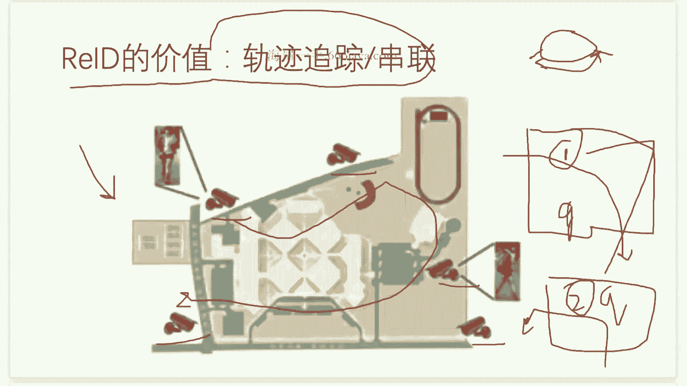

那这里呢我们简单的介绍一下，就是在我们的这个raid的这样一个里面，有哪些的啊技术上的一些挑战啊，难点啊，我们可以看到就是啊raid还是其实比较啊复杂，比较难的啊，尤其是在一些啊这个真实的这个场景中。

对吧，然后因为姿态呀或者呃背包啊，或者有一些撑伞啊，或者骑车啊啊等等啊，其实它会有一些不同的变化，甚至呢就是啊，有时候这个呃因为季节的一些原因吧，那可能啊，或者一些男生可能更倾向于穿这个呃。

这个深色的衣服，然后女生呢可能啊花色就啊多一些啊，或者呢因为一些呃光线的一些明暗的变化，可能也会导致有一些差异，对其实就是啊有挺多的这些啊成像的一些质量，成像的一些啊困难吧，就导致了我们的匹配。

可能也会出现一些不同的这个啊挑战啊，这个就是刚才我们说的一些啊，技术的这个互补啊，就是我们的REID，作为这个人脸的这样一个，生物特征的识别的技术，可以去做一些互补，而事实上其实在我们的一些实际的啊。

工业界的一些部署啊，应用的来说呢啊也是这样，就通常在我们所有的shopping mall的这个出入口，就是我会啊布我同时布置我们的人脸的相机，以及我们的这个啊REID的这个圆形相机。

也是半球形相机和我们的这个枪机啊，会同时来部署啊，为什么呢，因为这样的话我会在啊出入口，我会完成一次啊绑定啊，这个绑定就是说我既然是在同一个摄像头嘛，我就知道诶这个人脸和这个人体呢。

他其实是能够被啊这个绑在一起的啊，我就知道了哪个人体的这个外形啊，他跟哪个人脸的face id是能够啊绑在一起。

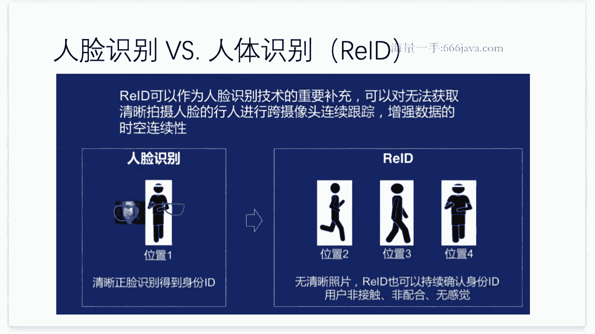

好那刚才说了这些人对不对，那车呢其实也是一样啊，就是我们可以看到就是我们的这个车辆啊，就是也是能够做一些车辆的入id啊，那有同学通会说了，人我能够理解啊，就是啊每一个个体是有差异的，对吗啊。

那车你怎么理解呢，OK那车其实是嗯当然了，就跟人一样对吧，我们的车牌也是唯一的身份的I啊，id的这个信息的id对吧，就是能够去定位到，但是其实啊，在我们的这个实际的应用中呢，其实也有很多的这个困难点啊。

比如说有一些假牌套牌的现象对吧，甚至有一些新闻你可以留意，就会发现，A在同一个这个商场或者地下停车场里面，诶兄弟两辆车居然是啊同样一个牌照啊，这就有问题了对吧，然后另外的呢就是啊。

虽然我们在这个啊现实生活中，我们同款同色啊，他有很多的这个车对吧，就是啊那可能比如说啊大众的这个帕萨特，那可能每一年啊他其实啊都会有这个升级嘛，啊当然可能相隔一两年的这个升级，外观迭代就比较小。

那早期的这个帕萨特和现在的帕萨特，那其实差异还是啊比较大的啊对吧，早期的可能是啊上汽帕萨特更这个圆润啊，就是然后现在呢会更加的这个啊这个时尚啊，低矮啊，更像迈腾啊类似的这些，所以就是呃在相近的时候呢。

我的外观其实也挺接近的，这就增加了我们车辆raid的这个难度啊，所以就是从真正的这个应用的价值角度来说呢，啊车辆的raid依然有它的这个价值，就刚才我们说了，我们能不能快速从外观来区分出啊。

同款同色不同的这样一些车辆，是来帮助我们去啊，辨别我们的这个啊个体和这个实体啧，那这个图上呢就举了这么一个例子，就是假设啊，某个这个额肇事车辆来进行逃逸了对吧，然后我们来进行这个区域的这样一个。

公安的一个布控和抓捕，那即使他对这个车牌做了一些修改改动，或者说啊用口罩去蒙住了我们的车牌，那我们依然能够通过我们车辆外观的这个信息，比对的这样一个技术呢，还是能够去定位到他的这样一个运动的轨迹。

然后从而达到这个最后啊，跟踪和抓捕的这样一个目的啊，然后说完了前面的一些啊价值啊，或者说背景的这样一个概要，那我们可以大概简单跟大家去啊聊一聊，就是在这两个领域里面，我们分别有哪些的啊。

比较呃这个主流的数据集，来供我们这些去做一些啊技术的一些尝试啊，或者来做一些技术的这样一个评价，那其中对于person reid这个数据集而言呢，啊我们有一个称之为叫三大数据库的一个东西。

就是三大database啊，三大database，那这三大database呢大概就是长啊，这个样子就是啊market1501，然后杜克啊，然后还有这个CUHK的这个零三啊，就是这几个数据集。

然后啊我们的课上呢，我们会跟大家去重点的去介绍这个啊，market1501啊，这个数据集啊，我们会重点去介绍它，然后使用它来进行这个数据的迭代啊，那事实上其实啊对于这个b a at啊，或者字节啊。

或者这个啊云从啊依土啊，那这些商汤啊，矿石啊，这些这个啊在业内啊比较名气很大的一些啊，互联网或者这个AI的这些厂商，他们都在这个领域和这个赛道上呢，都有过不同程度的这个啊刷榜的这样一个成绩。

然后啊这也足见了，足以见啊，这个啊这个这个证明了就是这个技术点啊，会啊在CV的这些啊厂商里面啊，还依然是能够被看中的。

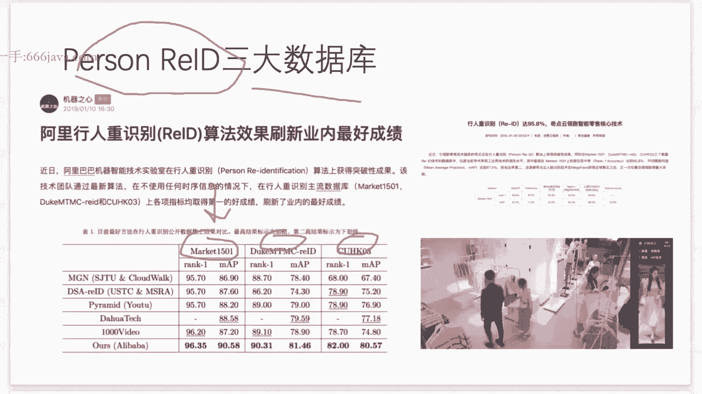

然后对于这个车辆的REID而言呢，啊我们也会有一个数据集叫做miuk id数据集啊，那刚才说的那个啊，数据集和person和这个VK id呢，啊大家啊都可以去问一助教，要一下这个呃。

在大家的服务器的公共目录下的一个地址啊，然后这样的话你就不用下载了啊，你直接就可以用了，然后对于VO和id的这个数据呢，你其实可以啊看到就是也很有意思啊，就是每一组它其实是同样啊。

一个车牌的这样一组id啊，然后不同组呢它其实就是不同的这个车辆啊，当然他可能就是通过在不同这个啊，地段来进行抓拍的嘛，但有前面有后面啊，比较有意思呢，就是啊他车牌出于这个啊数据隐私呢。

是能够帮你被遮掉啊，就涂黑了，那涂黑了其实也不妨碍就是你识别是什么，这其实也从另外一个角度，它帮你规避了，就是你去通过识别车牌来去鉴别我们的啊，车的这个身份的嘛对吧，因为你都把它涂黑了，那怎么涂黑呢。

也很简单吧，他直接就run一个这个车牌的这个检测的，这样一个模型啊，然后把这里面都mask掉就OK了。

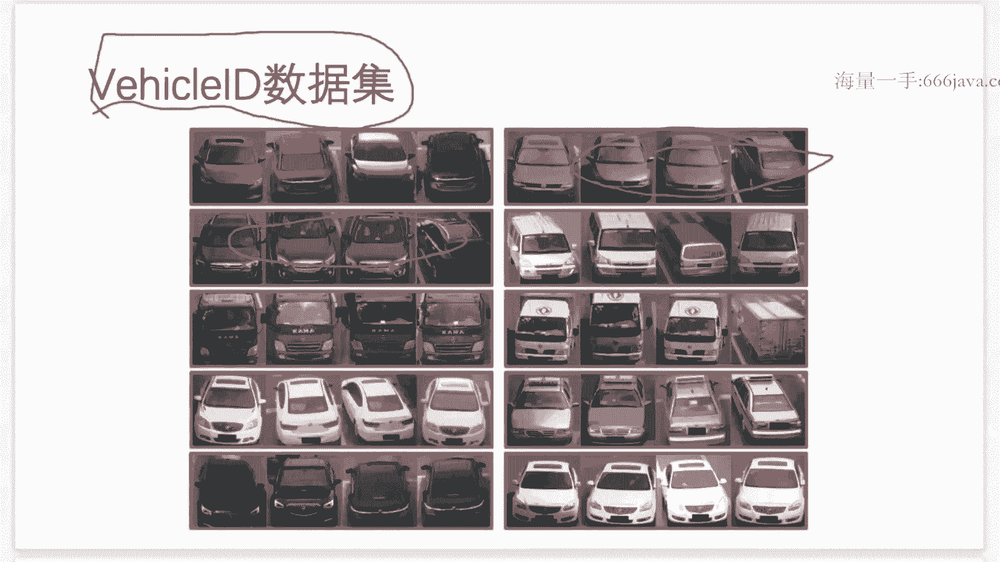

好然后在这个ready额，再有一些呃，求职的JD里面其实呃也有一些体啊，这个体现啊，你可以看到啊，就是我举的这个例子，随便找了一个呃这个大厂的一个offer啊，就是啊JD啊，然后你可以看到看它上面写了。

就是在啊城市安全啊，或者一些智慧城市啊，需要有一些啊情人的raid对吧，或者这个车辆的以图搜图，就车辆的REID的这样一个技术，那事实上其实就是呃对于我们要在课上讲的，这些呃raid的技术呢。

它不仅仅只适用于这个智慧城市这样的，一个方向啊，他还是非常通用的啊，尤其是在我们的这个讲述的过程中啊，都涉及到了general的CB的这个啊啧图像的识别啊，图像的检索啊，特征的比对啊，特征的提取啊。

啊这些常规的啊数据集的一些loader啊，啊这些方向，所以这些还是技术点相对来说会比较，啊通用，啊那么我们刚才说到，就是我们ready i，本质上是通过我们的这个检索的啊手段。

去达到我们这个识别的这个目的，所以自然而然的就是它的一些核心的一些啊，场景啊或者一些玩法，那其实就是在搜索啊，就是搜人啊或者搜车啊啊比对啊等等啊，所以就啊非常的这个显而易见对吧，你可以啊。

比如说在迪士尼啊，这个小朋友走丢了，但是可能在刚刚有过他的这个照片，那你可以给我们的这个啊布一套检索系统，很快速能够进行这个啊识别人，就是通过face id和REID的这样一个结合啊。

通常来说也是我们的这个呃商业的这个应用，以及我们这个实际的啊安防的原因，就是在我们的这个安防系统里面啊，就是我们的警察同志们，他其实会总结很多的一些规律吧，那这些破案的这个规律呢啊。

反过头来其实就会变成啊我们算法应用，就是我们的AI应用上啊，是能够去啊做一些定制化的啊，一些这个，应用的场景啊，举个例子啊，啊在公安里面就可能会认为诶昼伏夜出啊，或者说经常和其他同行人出现的一些人啊。

可能就是有一些潜在的这个啊有啊异常的人，所以类似的刚才我说的这一些啊特征呢，啊这些这些符合这些总结下来一些经验规律呢，我们的公安民警们就把它叫做这个技战法啊，就是技战法啊。

就说啊我们通过这个技战法的这个运用呢，再结合我们的这个啊，人工智能的这样一个技术啊，是能够达到一定的这个高效的，这个啊获取我们的这个线索，和破案的这样一个啊目标，比如说我们有一个人是这个骑了我们电动车。

或者说来偷了我们的这个电动车，然后来进行逃窜，那在某些地方是拍到了他的人脸，那某些这个路段呢只有他的背影或者侧影，那我们联动我们的人脸的识别，和我们的REID的这个技术，就能够把它的这个逃窜的轨迹。

能够把它给成功识别啊。

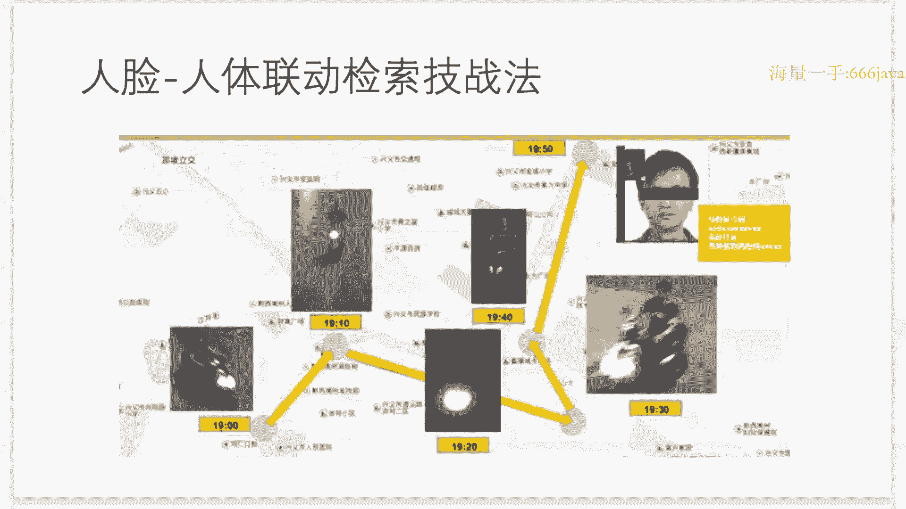

捕获到，所以刚才我们就提到了，就是啊raid的这个啊核心的应用场景啊，或者说他的核心的这个啊价值就在于什么呢，就在于我们的啊串联，刚才我们说了轨迹的这样一个串联。

所以这样的话呢我们就能够想象得到是什么呢，想象得到他在嗯，啊想象到他在这个呃商业的这个场景里面，是能够去做啊不同的这个应用啊，我举个例子来说。

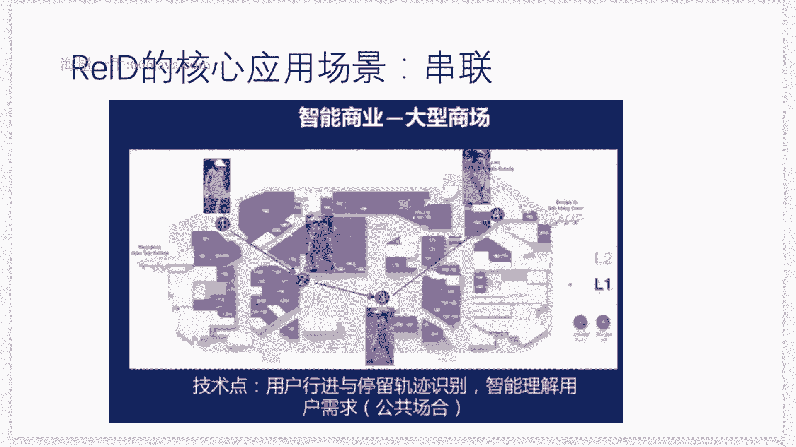

你可以看到啊在一些这个啊智慧商场啊，比如说他是能够有一些这个呃智能的一些，解决的方案啊，举个例子啊，就是啊，在这个大型的shopping mall里面啊，我可能能够通过顶装的这些摄像头，你可以看到吗。

啊顶装摄像头其实是现在比较流行的一种啊，摄像头吧，你可以看到啊，啊这些呢就是啊很多的这个客流的系统啊，举个例子就是你去万达啊，或者去啊什么样的这个，太古里啊商场那你的头顶上啊。

如果你的头顶上他有一闪一闪啊，就是不间隔的一些绿点点啊，绿灯，那其实很多程度上，他其实就是呃这个类似这种的这个呃，哎摄像头啊，然后这个时候呢就是啊有了这些啊摄像头呢，我们能够做什么呢，很简单。

你可以去对整个商场啊，不同的门店呢去做一次数字化啊，就是富来赋能啊，我们整个商场啊为什么这么说啊，为什么这么说啊，你可以想象得到啊，我们的这个商场的这个客流呢啊是能够呃，啊就是啊对于每个摄像头而言啊。

我可以在门店的内部装，也可以在门店的外部装对吧，所以你很容易就通过我们顾客的这个啊，经过我有多好的这个门店啊，因为我会去检测我的人体框嘛，然后我可以去算一下我们的这个路过的一些啊，人流的这个呃个数。

然后呢在呃进出我们的这个店啊，我们就知道我们啊这个顾客的这个啊，进和出的这个动作，并且呢我们还可以计算一个啊进出时间之差，那就是这个顾客停留这个店铺的这个时长啊，我们就知道了啊，就是他的这样一个效率。

那甚至呢我们可以拉一下这一家店的流水，我们大概就知道了，他的结账的这个比例大概是多少，所以我层层的这样一个递进，我就能够知道了啊，很多的信息对吧啊，这家店到底是不是足够吸引客户啊。

最后他转换成买单的这样一个比例又是多少啊，所以这就是可以成为衡量每一家店铺啊，每一个商场啊，他的很多的这个信息对吧啊，我比如说啊这一个转角处的这家店铺诶，他就是人流量很大，那我的租金就应该被定贵一点。

对不对，那你不定，那你不接受，OK那可能其他的可以去来进行这个商谈，然后我也时时能够去追踪，就是在整个商场的这个客流分布的一些啊，变化啊，就是这也是一个其中的另外一个嗯这个点吧，对然后所以总的来说呢。

就是我们依然是能够从我们的啊用户端，然后我们可以去对每个用户去建立他的啊，客户的这个画像和他的这个喜喜好的行为的啊，偏好的这些用户的画像，那可能也可以针对性的来进行促销，或者推一些优惠券啊。

来做到这些千人千面的一些啊，个性化推荐的一些服务，对这个就是啊他的一些潜在的商业的应用价值，所以对于business intelligence bi的这样一个而言呢。

啊这个这可能是一个比较好的一个啊方面好。

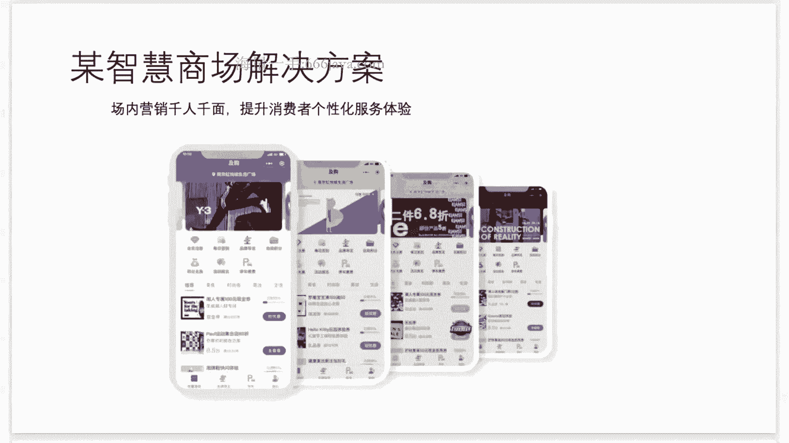

那接下来我们就来说说这个其中的一些啊，技术的一些框架和架构吧，就刚才我们也提到了对吧，就在新零售的这个场景里面呢，我们通常来说我们都会来提这个人或场之间的，这个关系对吧，在我们的一些呃马爸爸啊。

或者这些的一些技术分享里面都会来提这一点，那从我们做CV的人的角度来说呢，啊我们的这个人货场的这个关系，也可以来这个重新来进行这个塑造一下啊，对于人而言，就我们可以来感知人对吧。

我们检测啊很多的这些啊人流量，然后我们来做一些客流的一些分析对吧，然后对于这个人和货之间的这个关系呢，我们可以去做一些啊货架上面的一些摄像头，我们哪些人去拿了哪些货啊，这个我们可以detect出来。

而人和场之间的关系呢，就是我们raid可以来进行赋能的对吧，我们知道了哪些人逛了哪些啊厂啊，哪些这个啊shopping mall的哪些店铺对吧，我们是能够啊做这些一系列这些分析的。

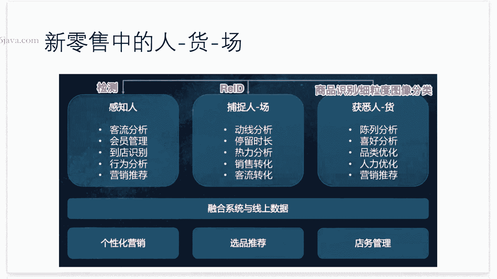

所以稍微展开一点，就是我们的detection就会去训，训练一个目标检测系统，也就我们的这个person的这个detection，production detection的这样一个啊模型。

然后啊身份的识别呢，我们会如果有人脸的信息，在入口的这个shopping more的入口处的话，我们就会用人脸识别来识别它，到底是新的顾客呢，还是啊老的顾客对吧，然后以及在整个商场里面呢。

我们就会通过我们的REID的这个技术啊，这里我们暂时看不懂啊，这些框架没有关系啊，因为我们后面会讲啊，去来识别它的这个person的啊id的信息，然后通过跟这个刚才的人脸的信息，来进行身份的一次绑定。

然后这样的话我们就能够啊多维度的去识别了，我们的每一个人的个体，然后达到了我们刚才说的啊，数字化的这样一个共性，好，然后接下来我们给了一些简单的一些啊，参考的工具啊，仅仅是参考好。

后面我们会带着大家一起来写，相关的一些代码对，然后这个呃上完我们这几次的这个课程呢，就大家啊要不就是你去提啊，这个实现一下我们的person的raid，要么呢就去实现一下我们的啊milk reid。

然后就会提交一下啊技术的这个报告啊，就是写一个word文档或者PPT的形式，然后提交给这个我们的助教和孙老师，就这样，这个就是我们的一个啊比较粗的一个简介，然后接下来呢我们会从代码的这个角度来。

一步步来load我们的data，然后实现我们刚才说的这个啊想法，那在这之前呢，给大家几分钟的时间去啊回顾和思考一下，然后我们刚才讲的这些channel的一些概念。

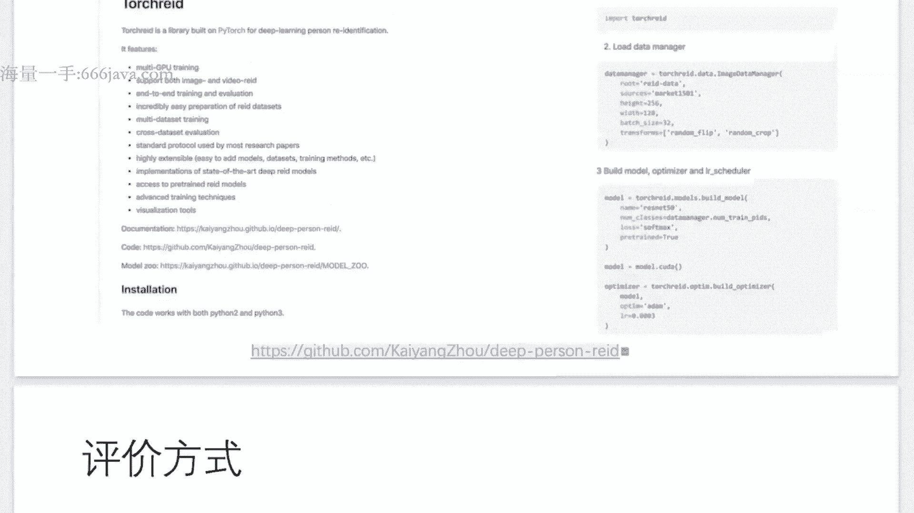

然后有没有什么样的问题啊，比如说如果有问题的话。

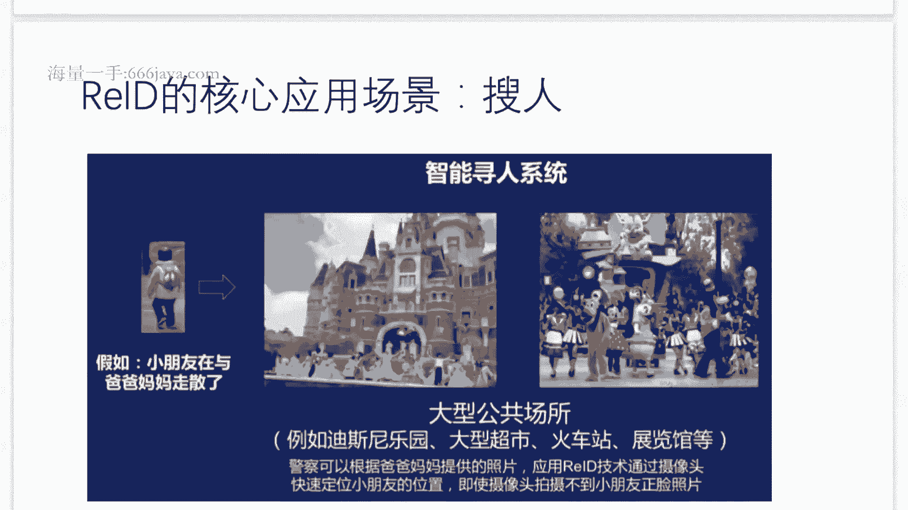

我们可以来啊，在这个讲之前呢。

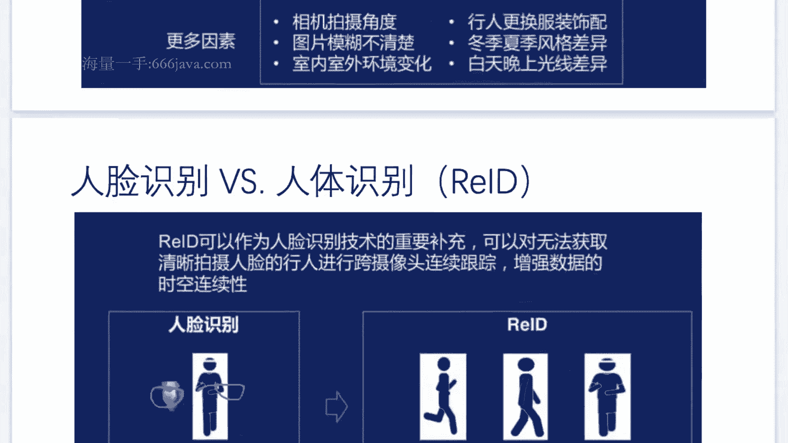

我们可以来哦答疑一下啊，我给大家的5分钟的时间来去思考，然后以及去啊提问好吧，如果有的话，我就回来回答，没有的话，我们就往后面走，好啊，如果大家没有其他的问题的话，然后后面有问题可以再问。

然后我就会切换到我们的这个代码的页面，然后我们就开始我们的啊coding的这个环节，然后后面的课程的话，我们就会呃类似的这些思路，而类似以代码的这个页面来给大家上课好吗。

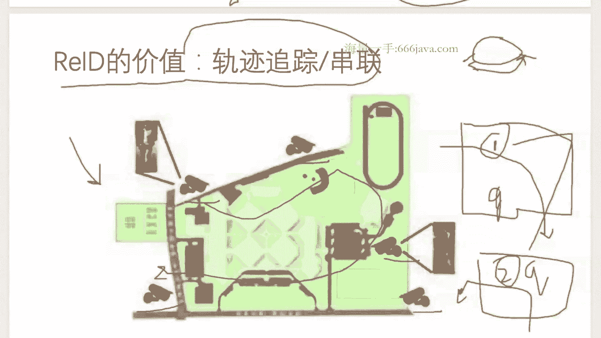

大家稍等，我来切换一下页面，好啊，我们应该已经切换回来了，我们的页面，好那这个啊我们先跟大家对齐一下啊，就是我们要做一些什么样的事情啊，这样的话你你才能够明白，就是为什么我们要写啊，接下来的这个代码。

不然你就会confuse啊，就是很觉得很奇怪，我们其实要做这样一件事情啊，就是我们想建立一个framework啊，这个framework呢是能够去解决我们person raid的，这样一个呃呃这个任务。

所以我们比如说我们要去建立一个啊baseline好，我们要建立一个贝斯line，这个baseline呢啊是为了person ready id，那么我们有什么样的数据呢。

啊这个最知名的这个数据就叫market101，啊啊从他的名字呢就可以来分别出来，就是嗯，他是在一个这个啊，1500个这个person id的这个呃范畴里面，建了一个数据集啊。

在一个market这样一个环境里面，所以，请大家问一下ta啊，这是我们的助教，然后他的这个目录是在哪好，这样就不用下载了，所以它的这样一个data的这个形式呢，就是说比如说。

对于它的啊数据的这个形式就会长这个样子啊，比如说啊，D00001号啊，人啊就是person id，然后还有哪些image，比如说image的一，image的二，image的三啊等等啊。

他其实就会啊类似这些，然后对于testing而言呢，testing data呢他可能就会问啊，就会问，他会给你啊一些image，然后分别去问他是属于哪些id的，当然啊就是大家想象一下。

就是你的训练和数据，训练数据和啊验证数啊，测试数据，它的person的id，这个key它会不会有overlap呢，让大家想象一下，会有会不会有overlap呢，嗯其实大部分的同学来说，其实你都会觉得。

有overlap是合理的，对不对，大部分同学你会这么想对吧，但是事实上是呢嗯大家想想看啊，如果说你认为是合理的，那么这里就有一个问题，你难道都希望什么呢，你难道都希望，你所有的呃训练的数据的id。

都依然出现在你的testing嘛，啊，换句话说，就是你所有都寄希望于你要识别的那些人的，id的信息都出现在你的训练数据集中出现过吗，你觉得这样的假设是合理的吗，也就是说啊，如果你要去识别一个人脸。

它必须在出现你的训练数据集中，这似乎是不合理的，对不对啊，为什么呢，因为我们在部署一个人脸系统的时候，我们可能不需要它有很多对模型来进行更新，比如说你使用IPHONE，你可能只需要注册一张图片啊。

你只要告诉他这个人脸是你，但是你不需要让它更新啊，让你发到你的这个苹果的这个服务器上去，让他去训练一个模型，再返回给你，对不对啊，所以你并没有去啊，有这样的一个限制呀。

那你为什么让person reid啊，有这样一个想法呢，所以你的常规的这个想法来说呢，是不需要的啊，所以这个也就是我们person ready id，你要去注意的就是你的这个训练的这个数据啊。

啊你可能啊不见得他是需要啊，这个不见得是需要能够去overlap，只需要什么呢，需要它有一定的这个泛化性啊，就好了就好了，OK啊就是大家需要注意这一点，好，这个就是对我们的这个training和。

testing的这个data的一个大概的一个解释，好，那我们要做什么好，我们要做什么，我们说了，我们要做的事情是，Given a query，Image，Query，Photo。

我们要去recognize这个人的，person i d对吧，我们要去干这件事情，而这件事情我们又把它哦，我把它换一行，这件事情我们又把它通过试image search的方式哈。

或者image是travel的方式来进行啊，求解，就是我们通过这个image search的方式来进行求解好，所以嗯，具体来说我如何通过这个信息界的检索，达到识别的目的呢，那其实你会有一个什么呢。

你会有一个叫GARY的东西，这gallery呢就是刚才我们说的那些training，数据集中的构建来的，Image database，就是来自哪里呢，来自我们的training data啊。

当然可能会来自我们的testing data的，这个啊，只有少量的，身份的信息，比如说每个id只有一张或者两张，所以这就构成了我们的这个gallery，然后我们要做的事情呢就会去啊，对每一个。

假设我的query是Q对吧，假设我们的query是Q，然后呢，假设我们的有一个小GI是从哪里来的，从我们的GARY里面大G来的，那我们要干的这个事情呢，其实要去learn a function。

啊这个function呢啊我们可以把它打一个括号，这个function呢是一个similarity或者distance function啊，function similarity啊的function。

所以我要写HS，然后输入是什么呢，Q和一个GI，我要去learn这么一个function，一旦我认出来了，我就知道了我的查询的图片，Q和我gallery里面的每一个图像的相似度是啥，对吧。

那我这样的话我直接按相似度来导拍一下，我就能够得到我最相似的图像是什么，大家想想看是不是这一回事，所以如果我能倒排完了，那我就达到了识别的目的，因为我知道头几个啊，他一定是命中了嘛。

好这个就是我们的思路，那回到这里来，你怎么去认这么一个function呢，或者怎么去得到这么一个function呢，啊在这里呢我们就很快能够联想到啊，我们肯定Q和GI呢，它肯定不是普通的这样一个信息嘛。

它肯定是已经被什么呢，被我们的这个特征给特征化了啊，所以你想象假设，假设q and g i，分别是什么呢，Feature vector，啊假设Q和GI都是B是vectors，那么S，Q和GI。

怎么来算出来呢，是不是其实就是我们的那个通过什么呢，Q点成我们的g i dot product，对吧，就点乘我们的GI就得到他们的这个相似度了嘛。

那我们的Q和GI怎么得到这个feature vector呢，当然它肯定是同一个维度了，那因为我的Q和GI都是图像，所以自然而然呢，我就会选择我们的卷积神经网络，CNN来做这件事情啊，比如说。

Rsnet50，或者呢在我们的这个课程里面，我们会选择，Mobile net，这个我们讲过的就是，他是一个高效的轻量级的卷积神经网络对吧，能够帮助大家去更快的得到我们的这个啧。

额特征的这样一个这个啊向量啊，推理和训练都来得更加的高效，和这个轻量级，所以我们这些啊都可以去干这件事情，所以这个就很明显了吧，就是我们要做什么样的事情呢，所有的结论都在告诉我们，我们要train啊。

C n n，好，这样的话我们就谈到了，我们前面我们说的那些事情，好那我们课间休息一下，然后大家可以去喝点水上个厕所，然后再回顾一下我们刚才说的，然后我们接下来就可以开始，写我们的这个代码了。

啊那我们回过头来我们继续啊，这样的话，接下来我们就可以开始写我们的啊代码了，然后假设大家已经下载好这个数据集了，然后解压它了，那你可以看到的是什么呢，看到我们的image，它的BTS啊，他是这个64。

然后image的height也是这个64K，嗯假设我们的learning rate好，我们把它配置成0。01，啊假设我们的optimizer用SGD，所以我们可以from，OK所以当然事先你可以。

好type in store下TENSFLOW，Ok，假设我们batch size是128，假设我们训练100个EPOX，然后啊，我们可以定义一下我们的data的这样一个路径啊，假设在你的这个啊。

比如说把你的这个数据放在点这个当前的目录，下面，建一个DATASET目录对吧，然后它会有一个market，1501，然后有一个版本号比15。09，点幺五对吧，假设是这个，好注意大家这个目录啊。

就是可能跟我要保持一致，因为原生的这个啊，training的这个目录可能未必有一些出入啊，就是你可以用我的这个目录的话，你大概是能够更好，我们来进行一些这个id的一些对齐，在在这个目录里面呢。

我们可以看到他大概有12936张图像，啊在训练数据集里面，Import pls，那这样的话我们可以点我们的data的route，就等于我们的OS点pass点，这样的话就把我们的数据的这个root给。

写好了，好然后我们的image，就可以用啊，就是list d i r，然后这个目录，好这里呢需要补充一个，就是我们加一个限制条件，如果X它是JPG格式的话，啊我们才会算它，那有同学可能会问了老师啊。

那这里不就可不就是JPG格式吗，嗯需要提醒大家一点的，就是如果你是Mac系统的话，有可能他后面给你加一些隐藏的一些文件，那这些那可能你也会通过你的后续的图像的，这个途径啊，loading然后啊读进来。

但是你可能会被报错，所以你就很诧异啊，所以我们这里给大家一个啊定心丸，那除此之外呢，我们还可以给大家加一个salt，啊这个内置的函数为什么要加它呢，啊这就确保大家所有人运行是一致的啊。

这样的话啊不至于可能今天你运行第一次啊，它这个list，它的顺序和第二次list的顺序可能就会不一致嘛，啊这样的话就大家还会保持一致，OK啊，所以这个就是image names，然后这里给大家举例一下。

就是这个image name的这个它其实可以被拆开出来啊，什么叫被拆开出来呢，就是呃因为我们这个image name和这个image pass啊，他其实嗯，我们希望它可能可以来做一一对应的啊。

为什么这么说呢，啊因为我们的这个image name，它其实里面会包含了什么呢，啊我举个例子啊，就他长什么样啊，举例他可能是长这个样子，0002下划线C一S1下划线，000451，下划线零三。

OK可能会长这个样子，然后注意在这里的啊，这里面的这个呃一些比如说啊002啊，可能就是他的这个啊person s的这个id是吧，就是啊就是他的一些信息呢，其实是能够表征什么的，表征我们的。

他的这个present id的信息，就是他的ground truth的这个信息，所以这就是为什么我们需要获取他的image，这个name啊，这样的话，后面我们可以去解析它的这个label的这个YOK。

所以我希望大家能够写出这个代码来，就是image的name啊，然后image的pass是等于什么，就怎么来进行解析，好给大家一点时间思考一下。

就是你怎么能够同时获得image name和它对应的image path，来想想看，可以给大家一个提示，就是用我们的这个zip的这个命令，我举个例子啊，假设X是等于，E3，24ok。

然后你去对这个PQ可以求解，那其实就是zip，新X然后此时的P就是列表啊，就是这个一二，然后这个Q呢就是三四啊，是这个意思，就是如果你能理解刚才我说的举的这个例子呢，啊你不信你去运行一下啊。

你其实就能够得到啊，我们想要啊说的这个事情了，所以我们肯定用一个心啊，然后来啊这里面呢我们用这个啊for image，File png in image，一会儿我们会换个行啊，我换个号。

这样大家就能够看得清楚一点，OK啊，这样的话我们就能够得到啊，image name和image pass分别解析出来，这样的话根据刚才我们的说啊，这个提示呢我们就得到present的，ID是吧。

就等于我们刚才的for x in image的name，然后X什么呢，前四个对吧，所以就解析出来了，啊number of percent d就直接等于啊。

我们就直接等于person id originally，当然这里面会有重复对吧，所以我们很容易通过set这个命令啊，就这个函数就得到这个集合嘛，他其实就去重了啊，然后再对这个集合做一个length。

就得到了什么呢，它的，ID数，所以你可以很容易print一下，比如说，Number of peri d，那到这呢就有一个问题了，就是这里的person的id呢，可能是比如说000300004。

他未必是我们想要的这个啊int性，就是比如说奥，比如说我们需要让它从01234啊来得到，那这个时候啊，我们就可能需要嗯这个借助一些啊，更加便捷的方法来转换这个person的id，当然有同学可能会说老师。

那我直接去写一个for循环，然后我从零开始来进行累加，然后我自己来维护它的这样一个对应的关系啊，有什么问题吗啊我会说没啥问题，当然很好啊，OK啊，但这里就是你可能要付出的这个呃，这个心思可能要多一点。

写的代码量多一点，仔细一点啊，就不会有太大的问题，那如果你想偷懒呢，那我也可以给你介绍一个偷懒的办法，好我们就sk learn里面的一些技术啊，基础的一些呃转换的函数就OK了，就比如说。

S k learn，点pre processing，Import label encoder，OK对，好又可以得到这个in table里的encoder，好我们就可以用原来的这个fit一下。

那我们会得到新的person i d，好，然后接下来呢啊，我们可以通过这个split这个函数去啊，把我们的训练的数据和测试的数据来按比，例来划分对吧，当然了就是这里啊有一个基本的一个啊问题。

就是呃我们当然可以自己来写一个代码，来进行维护，刚才我们说的这些train test这样一个划分，当然你如果需要偷懒，那SKN也帮你做了啊，他就会帮你去shuffle一下，当然你要注意的。

就是要维护好你shuffle的时候，你的X和Y的这样一个pair啊，那SKN如果SKN是能够帮你干这件事情，好那这样的话我们直接使用这个函数就OK了，然后就是train test quit。

OK我们换一行啊，让大家看的清楚一点，那就是给到image的pass好，person i d encoded是吧，然后我们会有一个比例叫test size，比如说0。2，那就是八二还分。

然后这里面除了额这里面的所有的参数呢，还有一个比较重要的一个参数，这里也需要给大家，就是如果你啊按照现在的这个逻辑，现在的这个代码量去啊，run的话呢，有一个最大的问题。

就是今天你run1遍和明天你run1遍，可能你得到的training的数据，和testing的数据是不一致的，为什么呢，因为它是随机打乱的，就是随机去shuffle，去split。

但是你当然是希望你每次运行的train，test是一样的，这样的话你好知道你后面的一些调参啊，或者去啊这个嗯去做一些啊决策，你就你就明白你就是有心理更好的谱嘛，至少你的数据是一样的对吧。

然后你做什么样的策略，做什么样的啊优化，那你是知道你这个有没有效果的，那这样的话你就需要给它加一个什么呢，你要给它加一个random的一个id啊，也就是每一次串test split的话。

你是要去有这样一个啊控制的这么一个参数，给到它啊，这个参数叫什么呢，这个参数叫random state，比如说这个random state啊，叫等于这个42，这样的话我们就可以把我们的现在的一些。

大致的一些额统计的信息给打出来了，比如说多少训练数据集对吧，多少VIZATION的数据，好，那有了这些信息的话，我们就可以开始对我们的呃建模了啊，就建模了，那注意就是啊对于我们一个CN而言。

就是我们训练的啊这个输入啊，就对一个CNL我们的这个输入呢，它的input sha是这些啊，就是，batch的信息对吧，然后height，然后channels，当然这个是啊。

如果也有可能就是这个channel是放在前面啊，三在这也是有可能的，这个就看这个大家个人的这个风格啊，就是可以去进行这个配置文件里面来进行设置，好我们先来漏的一个mobile net，那就是。

好我们看一下来怎么操作，嗯不点，我们是mobile ne，好先写下来，然后告诉大家这几个什么意思，OK这个include top呢，第一个参数呢我们把它设成false的原因是，因为呃我们只想用这个。

model来去这个提特征啊，所以的话他后面的这些分类，可能不是特别的重要，因为啊原生的这个啊如果要include top的话，它其实是分1000类啊，因为image net这样一个数据集嘛。

那对我们而言毫无意义，因为我们反正要做这个分类的话，我们要去初始化我们的这个，classification的这个head，所以的话原来去分1000类啊，我们并不关心啊，并不重要，所以我们可以啊。

不需要它，然后第二个就是with等于这个image net，这个的意思其实就告诉你的这个系统啊，告诉你的这个框架，你要去啊，用这个image net这个数据集的这个PRETRAIN的啊参数。

也就是这个时候他就如果没有，是第一次run这个系统的话，他就会去从啊网络上去下载他的这个参数啊，Download，然后阿尔法等于0。5，这个就大家我们在课上讲过了对吧，就是他有一个肉，有一个阿尔法。

这两个参数如果忘了的同学，再回到我们之前的课件啊，就是或者录播来进行review一下，然后这个input shape就没什么好说的，然后这个pulling。

这个pulling呢除了这个max也可以写ABG，就average pulling，然后或者max pulling啊，这个含义的意思就是说啊，经过了这样一个CN的model，就这个CNN。

我其实就会自动的帮你去做这个global的max pooling，或者global的every pulling，也就是说你你会得到一个一维，压成一维的这样一个向量，而不是一个二维的一个特征图啊。

就这个明白了吗，所以我们就会得到这个global polin的这个啊feature，然后我们通过点layers，我们就会得到它一个list，然后他会把每一个layer存成一个list。

然后我们CN的model就是最后一个global的一个play，就可以得到它的这样一个特征，但是我们需要去train我们的CN对吧好，大家想想后面这个该怎么写呢，就你怎么能够TRA你的这个，模型呢。

那是不是应该在我们的这个特征后面，去接我们的分类的层，大家想想看是不是这样，也就是说你有了这个特征，后面我应该要去分你到底是哪个person的id，对吧。

那这个id我们刚才通过label encoder，又把它转成了那个int型，就相当于我们可以直接去做classification，就逻辑是这个样子，所以我们直接加FC，那再加FC。

我们可以去import一下，好我们后面还会要用到activation啊，这两个，所以我们加一个f c dance等于什么呢，Number of perdi，然后对这个呢我们做一个soft max。

但这里的model呃，我们需要import一下啊，我们需要import一下，所以第87行就是增加了那FC，这FC的神经元的个数呢，就是呃原来的呃，这个我们要分类的这个id的这样一个个数对吧。

然后第89行呢就是我对这个FC，然后加了一个SOFX变换，让它变成一个概率分布，那为什么变成概率分布呢，因为后面在我们的损失函数里面，我们会交叉熵，损失函数COSROY。

要对它来进行loss函数的设置对吧，然后最后一个呢就是在93行里面，我们会用一个model来桥接好，我整个模型的输入和输出啊，就是我们整个model了，就是有输入有输出。

那中间串起来的这些其实就是每一个layer，哈OK所以啊这个时候呢，通常我们可以用summary这样一个命令，来去打印出我们的每一网络的结构，和它对应的参数，就是具体而言就是。

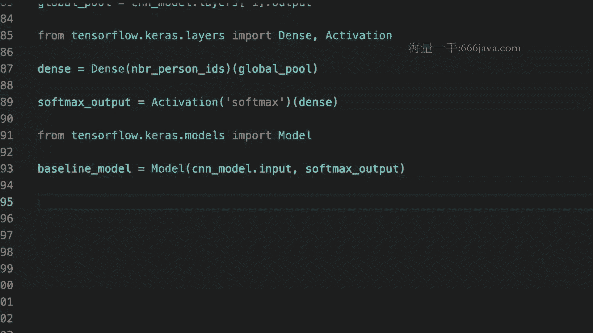

这样的话你就能够去得到额他的，我们刚才搭的这样一个model的这样一个detail，细节了，啊不信大家啊，回去可以试试，OK那接下来呢我们会啊有一些data的，loading的啊方面的一些冷知识。

然后接下来这部分内容呢，我们会放到下次的课程讲，然后今天大家看看有什么样的疑问吗，就对今天的内容，OK如果没有问题的话，那就啊我们今天的内容就先到这里，然后如果迟来或者没有听的同学啊。

请这个等孙老师上传我们的录播的课件的之后，尽快的来进行啊跟读和这个review啊，然后我们下一节课会接着我们今天的内容啊，继续讲好吗。

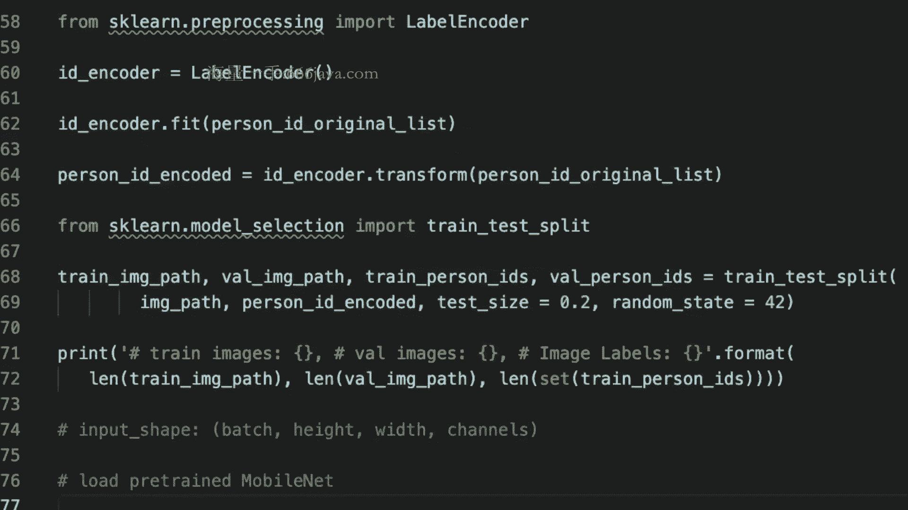

然后我们今天的内容就先这样啊。

