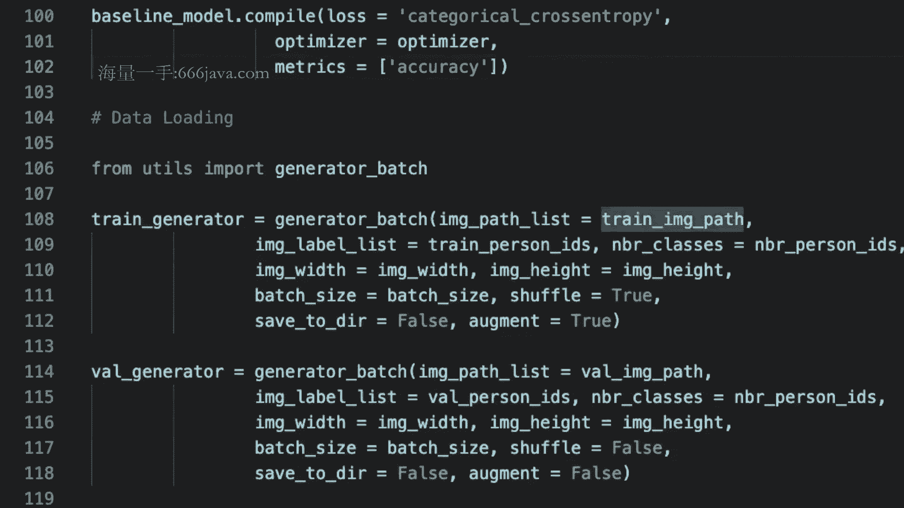

# 1447-七月在线-机器学习集训营15期 - P3：02-CV-2-行人重识别项目（ReID）跑通训练+评测流程 - 程序员技术手札 - BV1ASste6EuZ

好啊，各位同学大家晚上好，嗯那今天是我们的啊，COMMDIVISION里面的第二次的这个项目课程，然后在上一节课程里面中，我们其实是跟大家已经讲过了啊。

REIDENTIFICATION就是raid的这样一个任务的主要的背景，Background，以及啊它的作用啊，他能有什么样的应用的场景以及它的价值，我们可以回顾一下啊，我们说到id这件事情的本质。

它其实是图像啊，这个计算机视觉领域里面的图像搜索的问题，那特别的呢它其实是啊图像的以图搜图的问题，也就是我给定一个请求啊，query查询的一张图片，那我要求要求什么呢，要求我们在数据库里面去搜索一。

些相关的图片啊，其实本质上就是啊这个啊这样本的图片，然后呢返回出来，所以虽然我们的raid看上去它是一个识别的问题，对吧，它是识别的一个id也没错呀，如果你这么理解是非常的合理，但其实本质上呢。

它其实是通过我们检索的这样一个技术的手段，而去达到最终的这样一个recognition，识别的目的啊，所以大家一定要记住我这句话啊，我们要看透过现象看本质啊，看起来它是一个识别类的这样一个问题。

但其实呢它确实是一个这个检索的一个，技术手段来进行解决的，那么我们说了，在raid这样一个领域里面呢，嗯它很重要的是这个特征的提取嘛对吧，所以他会有一个特征库的概念。

也就是啊我们有一个底库database的这样一个概念，那这个底裤呢其实就是啊我们说是它是gallery，那它其实就是我需要事先啊知道哪些图像啊，哪些人的人体的图像，它关联了是什么样的身份的信息。

也就是我们的ID的信息啊，那只有这样的前提下，我才能通过检索的手段去达到识别的目的，不对对不对，还想想看，不然这个问题就不可解好，那你要通过检索的手段去达到识别的目的啊，没有问题，那么嗯对于特别的啊。

就是我们怎么能够通过啊这个技术的手段去解，刚才我们这个问题呢，那我们知道啊，所谓的图像的检索的问题，它本质上呢就是其实是需要知道一个图像的，这样一个特征的表达，那如果没有这个表达，我怎么去做检索。

怎么去做识别，其实都是一句空话，对不对，所以为此呢我们其实是需要什么呢，我们其实是需要知道每张图片他的feature是什么，OK所以我要知道这件事情，因为如果我一旦把database里面的图像。

和我们的查询匹配的，GARY里面的图像全部都表示成了特征向量啊，不管是feature map也好，还是fish vector也好，那么在我这个后台背后的这样一个啊计算呢。

那其实就会把它这个转化成feature和feature，之间的啊similarity的这样一个比对，那换句话说呢，其实就啊会是这个啊，你想想两个特征向量让你去算相似度，你能算吗，那肯定能算啊。

那你其实就把这两个向量的内积算一算啊，就结束了啊，就是它的相似度和相关性，对不对啊，如果是这样的话啊，那是不是问题就迎刃而解，那为了达到这样的一个目标，那我们该怎么做呢，那我们是不是需要对。

我们有一个特征提取的一个模块来搞定，这件事情，对不对，我们要有一个特征提取的模块来搞定，那这个特征提取的这个模块啊，now又是什么呢，那我们知道啊，就是在我们CN的课程里面。

是不是跟大家已经有过简单的这样一个勾兑啊，我们说特征提取的这样一个，特征提取的这样一个啊额模块，它其实本质上啊我们在CN那里面，我们可以把它抽象出来，把我们的呃那个分类的那一个head给它去掉对吧。

本身我的CNN的输入是一张图片，输出是一个soft max的概率分布图啊，概率分布，那如果我把最后的那个FCSPSS给去掉，那么我们是不是你想象一下在你的啊BGG也好，或者alex net也好。

是不是其实在你的卷积层之后会接两个啊，FC然后再接一个输出对吧，那中间的那两个2048的那个FC呢，其实就是你可以考虑到你作为这个latent，vector的这样一个表达。

就是你的这个特征的这样一个输出啊，所以如果是这样的看待这个问题的话，我们其实就已经啊知道了啊，我要去提取我们的一个图像的视觉的特征，那么我们就可以通过中间的FISHMAP，或者FC的这样一个抽出来。

那我其实就会得到他的这样一个特征表达了，所以这是一个非常显而易见的这样一个呃，思考的这样一个方式，那这个问题现在我们就转化成了，我们要去训练一个CN对吧，那这个CN后面我们要去不管是抽FC也好，抽啊。

feature map也好，那其实就是啊随我们的这样一个啊随心所欲了，所以现在的这样一个本质呢，我们就把它转换成要求解一个啊，训练一个啊特征向量啊，特征的这样一个向量，而特征向量呢其实就是一个CN对吧。

所以我们要train这么一个C，那我们怎么train呢，我们需要有类啊，标签有数据，对不对好，那我们说了，我们的REID的这个数据其实本质上是啥，本质上其实就我们说了，它是每张图像啊，他会对应一个id。

换句话说其实你应该知道的是啊，你这个id对应哪些图像对吧，比如说小明这个人啊，然后他啊今天走了一趟轨迹，那经过了这个七八个十字路口，那OK他可能就有七八张，这样一个被十字路口抓到的这样一张图像，对不对。

所以这个就是构成了我的训练数据，我就知道这若干张图像描述的是这个id，所以说如果说啊我们的啊，嗯如果说我们把每一个id，都当做一个class name的话啊，都当做一个新的一个类的话，那是不是。

其实这本质上就是一个图像分类的问题，所以再次呼应到了什么呢，前面我给大家总结的，我们的raid的这样一个问题的本质，它其实是虽然是识别的这样一个问题，但它的本质它其实是一个图像搜索的一个。

比对的一个技术手段，去来解决这么一个识别的问题，那图像搜索的技术的啊，图像搜索的这样一个比对的核心，其实就是特征对吧，刚才我们就说了，我们的这个CN，其实就是我们的这样一个训练的这样一个，核心目标。

那所以呢嗯我们现在就啊可以train这么一个，刚才我们说的这么一个CN，也就把他的id当做一个class啊，我们就可以处理出来，但这里值得注注意的是什么呢，我再提醒一下大家。

你千万不要认为所有的评测数据集的id的信息，都一定要出现在你的训练数据中啊，我再说一遍，刚才我说的这个意思，不要认为在raid这个任务任务里面嗯，或者说不要认为在图像搜索的这样一个，大类的问题里面。

你评测数据集的那些id class，就必须要出现在你的training data里面，这是一个非常非常啊容易混淆的一个误区，这是一个不切实际的啊，我再举上一次跟大家举过的这个例子。

试想一下你的IPHONE啊，或者其他的手机，有那个人脸识别和人脸解锁的一个功能，对不对，你有没有就是在你的这样一个使用的过程中，要把你的人脸的图像拍多张图像，上传给苹果的icon的服务器。

让它更新一个模型，然后再返回给你部署，你才能work，我们没有这样的功能，我没有这样的体验，对不对，我们唯一要求的体验是说，你当时在借你的face id那个隐私的时候啊，你会这个头转两下。

然后这个拍两张这样一个图像就OK了，但并没有说啊，我们可能有这么一个时间差，还要人家啊，美国的这样一个啊苹果总部串一个model为每个人，那这个代价就大了，去海了去了，对不对，就不切实际。

所以任何啊我们把这个技术点扩展一下，任何凡是未来你们在工作中或者在学习中，看到一种带库的，就是database啊的这样一个带库的，这种啊CB的这样一个任务啊，它其实的最大的好处就在于什么呢。

它的泛化性我们是预期它是足够好啊，因为我们不要求他训练，他只需要什么呢，往这个库内扔图片就OK了，大家想想看是不是这样对吧，甚至举例来说有些这个厂商啊，比如说b a at，它有很多的这种云上的这个。

开放人脸库的这样一个识别，比如说啊公众人脸库啊，或者明星人脸库或者政治人脸库，对吧啊，他有这么一个能力，那你们说假设他确认好了一个模型，那我们知道啊，就是我们现在有很多的这个途径对吧。

我们可能会会有新的一些呃，i it啊，不管是人明星也好，还是动漫也好，会层出不穷，对不对啊，哪天这个啊B站上的up主，哪天他的这个抖音上的一些呃，这个呃这个这个群演那火了。

那我可能百分百来不及训练了对吧，那我那很简单，对于产品和运营的同学来说，他搜集一些这些的case啊，百度一下，谷歌一下，然后往你的那个数据库里面一导对吧，那这样的话你模型马上就能够更新了，对不对。

我就能识别出新的这种IP的人脸信息，这就没有这个时间差，还要再训练了，所以大家记住刚才我这一点就是啊，在这样一个子任务里面啊，或者这样一个，一大类的问题你肯定不会预期什么呢。

你的测试的数据的样本必须要出现在训练数据，这是不合理的一个要求，对不对，显然就是一个不合理的要求，所以呢这你就能够理解了，在我们的testing data中，在我们的测试数据中可能会出现一些新的id。

那些新的id让你去识别，没有说让你去做分类去做识别啊，对不对啊，其实让你通过检索的目哎那个手段去做识别，所以这就很合理呀对吧，对于训练数据集，我给你1500个人啊，这个每一个人呢可能有啊几十张图片。

然后让你去train一个分类器，注意这个分类器的分类的head，classification的head，他只能分类1500个人呀，对不对，因为只有这些出现在你训练的样本好，那假设测试数据集来了。

新的50个人怎么办怎么办，这50个人的数据的图片呢，送到你这个CNN模型里去，显然他也可以走通走通一次这个前向的传递，对吧，走通一次inference，所以他最后的那个激活它的这个分类，它也会有信息的。

但是没有意义，对不对，因为它不是属于这1500个类，那我们要的是什么呢，我们要的是它中间的那个feature和特征嘛，所以我们知道他的FC或者feature map的输出，那有了这个输出。

然后我们再把这个testing data里面的那一些，它肯定会关联几个id，就塞到我的database里面去，那这样的话呢，你通过后续的vector之间的检索和比对。

和这啊这个testing data中的这样一个，数据集的检索比对，那你就有了新的这样一个啊，就是识别的这样一个结果啊，所以啊这就解释了刚才为什么啊，我一再强调说，千万不要认为testing类中。

也一定是要出现在trading数据中的，这个id是可以不overlap，甚至我们希望它不overlap，因为只有这样，你自己衬出来的模型才会觉得可信，对不对，你才会在未来的工作中有底气跟你的老板说。

我的这一套模型，这一套框架它是具有泛化性的啊，不然的话你自己心里肯定也会觉得啊，非常的这个不踏实对，所以这就是我们在review了，我们上节课的整体的这个思路啊，我们应该是已经对齐了啊，对齐了好了。

那我们来看一下，回顾一下我们上节课的这样一个代码哈，希望同学们就是在上节课之后，应该是有过一些的啊，复习和这个啊run过一遍了嗯，我们目标是要去构建我们的这样一个特征，向量的这样一个啊提取器。

所以呢我们现在的啊手段呢，其实就是训练一个CN的一个特征的抽取器，对不对，然后具体的backbone呢，我们在这里选取的是啊，任何的一个CN的backbone其实都是work的。

只不过为了让大家能够在你们的笔记本上，可能就能够快速串起来啊，如果比如说有一些GPU的时候，大家可能抢了或者有一些啊这个掉线了，那这里我考虑到这个原因，就给大家选了一个mobile net。

那事实上你选RESNET或者啊更这个啊，更heavy的一些啊，backbone啊，inception的系列的，我觉得也没有问题，啧，好，那么嗯前面是一些基本的一些超参数的一些，定义对吧。

比如说batch size啊，optimizer啊，优化迭代器啊，对吧啊，然后这里呢我们会加载我们的训练的数据啊，就是我们的这个啊image的这个data image path。

然后我们说了就在第54行里面呢，它其实是啊啊sorry，我们是在这个啊52行里面呢，啊我们上节课跟大家说过了，他的IE的信息可以通过他的name来进行解析的，对不对啊，所以这是一个啊很好的事情。

然后并且呢我们跟大家说了啊，我们有一个zip的这个命令能够帮助我去做啊，很好的一个啊解析，那解析出来这个id呢，它其实是这个啊一个字符串，那其实我们是需要在我们的嗯训练的框架里面。

我们希望我们的label是自然增增增长的对吧，01234啊，或者这个啊他是一个one hot编码的形式，所以我们就有一个label encoder，能够帮助我们干这件事情啊。

它可以通过sk learning的面里面的PREPROCESSING，可以去啊帮助我们去做这样一件事情的转换啊，非常方便，那转换完了之后，我们就可以去分五分割，分割我们的training的数据集。

使得有这个啊training data和validation的data对吧啊，能够去啊干这件事情，那我们可以通过SKN里面的try test，split这样一个函数去做这个test。

这样一个split啊，当然我们可以通过我们的test size，这样一个超参数呢来控制我的比例，比如说八二分还是好七三分，然后注意啊，我们这上节课也跟大家强调过了。

就是我们有一个random states，千万是要来进行设置的，为什么呢，是因为啧我希望我每次运行的时候，我的train test data它其实是一致的，那不然的话你每一次来进行调参。

你就不知道到底这个参数调整的好，是因为你的数据集变了，还是因为你的模型确实更好了啊对吧，然后有了之后呢，我们是不是就可以去加载我们的backbone。

我们backbone在这里选的是mobile net v2，那在之前的课程我们跟大家已经讲过了，就是这种lightweight的这种一个CN的这样一个优势，它其实是通过这种这个深度可分离卷积的。

这样一个嗯小技巧啊，能够帮助大量的减少我们的训练参数啊，如果我们的卷积核是3×3的，大家还有印象中它大概参数量能降低多少吗，还有印象吗，想想看在我们的上上节课，上上节课应该是有过啊，这个相关的讲解的啊。

我们是不是说了，它大概是K平方分之一啊，其中还有一个小的那一段呢是忽略不计是吧，所以如果我的kernel size是33的话，那我其实参数量就能够大概降低到这个啊，1/9嗯，OK我们继续。

那有了这个backbone呢，我们其实是啊这个超参数，我们选的pulling是max，所以这就意味着当然我们这个with是internet。

所以就代表着我们需要啊有一个image net pretraining，一个model，没关系，就是如果你第一次运行的话呢，啊，你的网络就会去去这个啊，服务器上自动的download这个参数。

然后呢通过pulling是max的话，给你输出一个啊max average pulling的啊，max那个global max pulling的一个feature vector。

然后后面你就会加个dance啊，就是FC的layer，因为你要去分类嘛，分类你的这个到底有多少个id，所以你会有一个经过soft max的输出，然后把整个model的输入输入，把它给接起来。

这就是你的baseline model，所以这大概就是我们整个的这个啊情况啊，整个的这样一个情况嗯，我们已经写到了这个baseline model了，对不对，所以后面的代码就非常的呃。

这个大家可以自己想象吧，所以是非常的这个直接，因为接下来呢我们就会啊可以来train这个模型，当然在train这个模型呢，我们需要有写一个data loader啊，这就是我们今天的一个重点。

当然我们先啊不用纠结这个这个工作，因为我们把整个high level的这个啊骨架，帮大家理清楚了，然后再去把它填充啊，这样大家会对整个东西啊，整个啊project整个项目会理解的更加的这个透彻。

所以我们假设我们有了一个啊这个data order啊，假设有一个data order，那这个data order大家想想看嗯，我们一般会用什么来实现呢，啊通常的大家的想法是说老师啊。

我知道我把所有的数据啊，class他的name，以及它对应的这个输入的图像都加载加载进来，没问题啊，就是你的training的data的X和Y的这样一对配啊，所有的pad都加进来，有什么问题吗。

啊没有问题啊，如果你的训练的数据，其实它是能够在被你的，显存和加载进来的情况下，内存加载进来的情况下完全没有问题，OK比如说EMINNEST的这种数据集，SA10这样的数据集。

但是大家别忘了在实际的工业界中啊，你恰恰是有大量的这种训练的数据，比如说十几万几10万的训练数据，那一下子加进来存不下你的显存呀对吧，所以你希望的是什么呢，你希望的是通过batch的形式，批量的形式。

从你的硬盘里面加载到你的显存里面去，然后训练完了之后呢，换下一批对吧，这样的话，那在我们的Python的这个啊数据结构里面呢，我们其实是要用一个叫generator的，这样一个迭代器来进行实现的啊。

希望大家应该是有一些印象，Ok，所以我们假设啊，我们的generator其实已经啊写好了，一会儿我们会啊会跟大家去写啊，假设我们已经写好了，对吧啊，有一个这个generator batch。

对于training data or而已，好假设我们有一个validation的，generator啊，然后是，啊回头，当然这里面有超三对吧，我们要来进行定义，有参数好，那有了之后呢。

呃我们还可以额对我们的这个模型啊啊，加一个checkpoint，也就是说我对每一轮呢我可能是需要什么呢，需要这个去存一下我的模型的这个位置，不然的话后面我再来呃，这个比如说追溯我当中的哪个模型好的话。

我就没有办法对吧，可能我们需要有一个checkpoint，啊来进行保存，那这个checkpoint呢我们其实可以通过啊这个，这个里面来TENSORFLOW里面的那个checkpoint的这个。

call backs来进行导入，OK那什么叫做call backs呢，还有印象的同学应该就知道，他其实也就是回调函数对吧，所谓的回调函数，你顾名思义嘛，就是从它的这个名字里也能知道啊。

他是在某种情况下来进行这个啊回调的啊，也就是你要run了某一个操作之后，它会来进行回调，那他在什么情况下回调呢，通常来说，他是在训练完一个这个epoch的数据集，下来进行，就整轮数据集结束之后。

一轮之后他会来啊回调，所以这里定义的话，比如说我们定义的一个存储的一个文件啊，然后这个monitor呢是监控的意思，监控的一个指标，那比如说我可以监控啊。

validation accuracy或者validation loss对吧，划一趟给大家，然后verbals，意思就是说啊，如果说啊，我当前的checkpoint要比之前的好啊。

然后并且我要保存下来的话，我可能会给你输出一行这个log啊，我说当前的这个参数会更好，还有一个这个save best only啊，我们可以把它设置成true，这个意思就是我每一轮在迭代完了之后呢。

我都会去看一下我是不是比之前的这个呃，在validation上，accuracy上这个指标来的更加的好，如果是的话，我就保存下来啊，就这个意思，所以这样的话我们就啊可以去train，我们的模型了。

啊fit，然后呢train generator啊，就是导入我们的这个训练数据集，然后呢，steps per epoch啊，你根据他的名字就知道了，那其实他在算那个什么呢。

number of iterations对吧，所以number of iterations是多少，是不是其实我有多少数据，然后呢去除以我的batch size对吧。

那我们的validation的这个data是什么呢，是不是就是我们的generator对吧，然后MALIDATION，那是不是其实就是number of，Wild d image pass，除以我的。

Bad size，然后我的白size就是我们的白size，然后我们的bub，刚才我们说了，可以打印出来，Shuffle，我们是不是需要啊，让我们的training data来进行一些random。

shuffling啊，问题可以，然后number of ebox，我们之前定义好了100个对吧，好然后我们的call backs，call back x呢，它其实可以有一个什么呢。

有一个list就是我会有一个列表，我都可以用啊这个回调函数来进行这个链接的，那通常来说呢啊在我们这里定义好的，我们可能定义了是一个啊checkpoint，就是去存在每一个训练的epoch，完了之后呢。

我们就会去存我们的啊，啧这个呃checkpoint就我们的model的weight，那大家想想看还有什么样的呃，可能的回调函数会存在这里呢，大家想想看，那我们在每一轮结束之后。

是不是有可能会要调整我们的学习率，比如说呃每十轮啊，或者每20轮，我可能会要降一下我的学习率对吧，这是很合理的一个啊调参的一个经验嘛，那所以对于调整学习率呢，啊这样的一个回调函数呢。

也可能是放在我们的什么呢，我们的这个呃call back x里面可以去进行实现，好啦，那这样的话就是我们整个框架已经搭完了对吧，架子都已经有了，那唯一的这个呢就是缺什么呢，generator啊。

缺generator好，那不着急啊不着急，我们就回到这个啊generator的这部分的这个代码，我们来把它实现完就OK了，好，大家有没有觉得在前面，我们的内容有什么样的问题。

我们给我们停大概半分钟的时间啊，没有同学问问题的话，我们就继续了，这块有没有一些疑问好，看起来暂时没有问题，OK很好，然后那我们就继续了啊，我们继续，好那我们定义好。

定义一下我们的generator的batch，那在定义的这个时候呢，大家想想看可能有哪些参数啊，我们会需要用到呢，那其中第一个参数非常容易想的两个，其实就是X和Y嘛。

其实这里的X不就是image pass list，情况就是image path list和image label的意思吗，诶不好意思，然后呢还有number of classes，吧我有多少类。

还有很合理的呢，那我的尺度吗，这两个对吧，batch size也很显而易见，比如说我们给他一个默认的32啊，我64shuffle啊，比如说我们也可以给他，然后呢，还有一个呢。

就是有时候啊我们可能需要去啊看一下哦，我们一会儿要用的数据扩增的一些数据，增强的中间的结果啊，或者存一些其他的东西，我们可以给一个目录啊，我们前面说过了，就是啊在计算机视觉领域里面啊。

在training的时候，我们通过数据扩增的方式呢，我们会去实现什么呢，去去降低我们过拟合的风险对吧，所以就是啊，这个呃我们一会快要来进行实现，那这里给大家啊两个例子啊。

就是这个image label list和image past list会长什么样子呢，啊我们预期是这样的，啊，那可能他长得这个样子呢是啊，比如说他的目录是可能杠home杠。

比如说data下面的一点JPG啊，然后他可能是长这个样子啊，一个pass list，然后这个image的，label list长什么样子呢，可能是七二十三八十等等等等啊，他可能会长这个样子。

那我们output是什么东西呢，大家想想看，For output，而对于这个generator generator的batch而言，我输出会是什么样子的，显然我肯定是都叫是一个batch的数据的加载了。

那我肯定是要加载什么呢，加载我们的，X batch，I batch，对吧，我肯定要加载这个嘛，那是不是我要return呢，是return这个吗，大家想想看，我最后一行就是我的这个函数的代码，的最后一行。

我是不是return这个，如果回答是return的同学呢，那就是啊这个编码的基础是稍微啊，我们在需要再好好回顾一下了啊，就对于generator迭代器而言，我们的关键词是yield。

啊不是return啊，好，那除了是返回x batch和y batch，这样的一个X和Y的这样一组配，那还会有什么样的形式呢，还会有什么样的形式，其实是取决于什么呢，取决于。

我们想要让我们的generator干什么，但我不想让他干什么，我们希望我们的generator batch的这个东西，不仅是能够在什么呢，在我们的训练的数据中会用到。

我们是不是在evaluation的时候，或者在inference时候也会要用到，因为我都要读数据啊，只不过在训练数据中啊，我们需要用到的X和Y，而对于做evaluation的时候。

或者做inference的时候，我们就没有了那个Y对吧，我们是要预测Y有X，大家想想看是不是这样子，所以这样的话啊，这样的话我们就希望什么呢，我们希望我们的这个这样一个函数，是能够兼容什么呢。

兼容我们的训练的过程，和我们的160ATION的过程，大家有没有get到啊，我的这样一个想法的布局啊，就是你在编码的时候呢，你就应该有这么一个想法了，因为这两个过程非常接近，只不过呢对于我们的呃啊。

只不过对于我们的这个呃influence的过程而言，我是少一点东西而已对吧，所以这两部分的代码是大部分啊，是很多程度上可以来复用的，所以如果你说老师啊，我就是想要新写一个函数，我就不让他们复用，可以吗。

哎可以的啊，没问题是OK的啊，就是功能上的这个实现完全没有问题啊，只不过啊你可能会显得，如果你的同事以后来review的代码，可能会对这部分好抽象的一个呢，这个可能会有些许的这个小小的这个建议啊。

就是这个意思啊，如果能精益求精啊会更好，所以呢我们也希望什么呢，我们能不仅能够返回这个XY啊，也干脆就返回我们的x batch也是OK的，那这个取决于什么呢，大家想想看。

是不是取决于你的image label list有没有提供啊，那如果我没有提供，那当然我就认为我是在influence阶段，没有任何的问题啊，啊如果我提供了，那OK我可能是在training的阶段啊。

所以这也很好理解对吧好，那么如果一旦有我们的这个啊，image label list和image这个pass list呢，其实我们大概率是希望什么呢，希望我们两者是啊就是啊划等号的对吧。

我们是希望这两者是一致的，好OK啦，所以我们可以先定义我们的这个batch size啊，大概有多少，其实就是我们的image path list了，好如果if shuffle，啊如果要shuffle。

那我就可以直接在image path list和image label list，直接shuffle，那注意就是这里的shuffle啊，你需要来保证什么呢。

shuffle前后的pass和label是要一一对应的，不然的话就有问题端，千万不要比较这个意思，这个想都没有想就开始什么呢，想都没有想就直接对什么呢，对呃先shuffle我们的label。

再shuffle，我们pass啊，那就有问题，你要带着他俩一起shuffle，那当然可以写一段这个自定义的函数，去干这件事情啊，只不过呢我们有一些这个能够帮助我们，就是啊。

有一些这个呃现成的函数能帮我们干这件事情，比如说，我们就可以用这个shuffle啊，来帮助我们去shuffle啊，同时shuffle这俩玩意，好他输入也很简单啊，就这两玩意，好让我们继续。

然后我们从设定一个index吧，我们从零开始，然后while true啊，这个是老套路了，因为我要去不断的循环我的啊，取我们的数据集嘛，在我们的batch里面来进行啊，循环好，While tru。

那我们来看看current的index在哪了啊，current index在哪在哪呢，是不是你当前的batch index去乘上什么呢，你的batch size，然后我们磨一下我们的大N。

啊就完了对吧啊，为什么要磨呢，因为有可能我们后面我们下一个迭代的时候，对吧，我超过了我的那个当前的这整个啊，depot的这样一个数据啊对吧，所以如果说if大N大于等于，Current index。

加上我的白痴size，那说明什么呢，说明我现在还没有到头啊对吧，所以我的current，C u r current，batch size就可以，为什么呢，我们的batch size没有问题。

嗯batch index加一就好了对吧，否则的话什么呢，Create by ch size，最后一个batch size就等于，对吧，因为我就等于他俩的差嘛，因为如果我再加上整个白痴size的话。

那我就超过了它啊，那我就是下一个轮迭代了，那下一轮迭代呢，那不就又置零了吗，对吧，又置零了，好所以这样的话额我们就写了这么一个啊循环，在这里啊就是我给大家提一个小小的思考，大家想想看。

就是后面这一点我处理，如果偷懒不处理，可不可以，可不可以，我们说是可以的，因为你想啊，就是你想想看是为什么，因为，如果说，我不处理的话，那无非就意味着什么呢，最后那一小撮数据。

它不出现在我当前的训练数据中而已，准确的说，我纠正一下，是并不出现在我当前1poke的数据中，唉这句话你承认了，你认可了，为什么我说是不出现在当前epoch的呢，有同学能想出来吗，为什么呢，因为什么呀。

因为刚才在我们training的那个文件里面，那个代码里面，我们写了一个回调函数，还记得吧，这个回调函数我们说了，他是做checkpoint的，对不对，但是在那个回调函数上面是不是还shuffle了。

对吧，我们还shuffle了，所以呢很简单，我当前可能不出现，但是不代表我以后不会出现了呀，因为我下一轮就shuffle了，那可能大概率啊，我本轮遗漏的那一小撮数据。

并且那一小撮数据还没到我的白痴size，对不对，这么一小数据，我觉得我下一个会出现，就算我下一轮不出现，我下下一轮也会出现，对不对，那你想想看你有多大的概率，你每次shuffle都没有sh不到任何一个。

那假设你有100轮的话，那你有二的100次方，你都没有杀不到这个，那这个概率就很小了，对不对啊，所以这个就啊解决大家疑惑了，甚至我就再给你算的严格一点，就算你有啊很小的概率都没有杀不到。

但是呢那又怎么样呢，我的数据集可能是十几万的数据集，我少那么几十个数据就不行了，你想想看不至于对吧啊不至于啊，所以从这两个观点呢就能解决，刚才啊我给大家提的这样一个小思考好了，现在呢就是啊总而言之。

我们就已经啊啧，由我们的这个啊当前的这个两个index，那么我们希望要做的是什么事情呢，我们希望是根据这些index能够读到什么呢，我的training的数据集X和当然批量的啊，分批的啊batch。

然后x batch和这个y batch，所以呢我希望有这么一个函数啊，叫load image batch，这个函数能够帮助我来加载啊，我的这些数据数据集，比如说。

我当前知道我的image的pass list对吧，我当前的index是current index对吧，那我要读到哪呢，我是不是要读到current index加上current batch size。

对吧，然后我的image label list是什么呢，是不是current index读到哪呢，current index加上current batch size。

当然我还希望有一些简单的其他的超参数对吧，可能可以来进行传递，Number of classes，以及你要读进来的image的wise和image的height，对吧，很合理吧。

所以我希望有这么一个函数，能够帮助我干这件事情好，那我们就回到前面来，我们来实现一下这个函数哈，它有什么样的啊，话筒，好啦，这个就是应该，嗯能够理解了啊，能够理解了，好我们把它的超参数写一下。

刚才我们写过了，那首先呢我们可以解析一下我们的batch size，为什么呢，因为这里面啊我都是load image batch，所以很显而易见就是我的，image pass list length啊。

其实就是我的当前的batch size，毫无疑问对吧，没有任何问题，然后呢，我们可以初始化一下x batch和y batch的形式来，expect的形式，答案是什么，是读入图像呀，对不对，读入图像。

那读入图像是不是，其实我们知道图像是三通道的一个cancer对吧，所以就是我们的bash size in height image base，还有一个什么呢，三呢对不对，RGB3通道呀，没问题吧。

YBH呢，200是什么，没大家想想看WIFH是啥，显然WIFH是，这玩意，后面怎么写，关键的来了，后面怎么写，是不是想想就知道应该是什么呢，Number of classes，为什么。

因为我希望我的label，是one hot in coding的形式，对不对，所以自然而然我们就有了，当然后面我们加一个，能想通不，是不是应能抢通，因为啊我需要one hot encoding。

那所以自然而然呢我number of classes啊，我就知道诶哪一个是一，哪一个其他是零，好了，那这样的话呢我们就有了x batch和y batch啊，它的初始的定义，那接下来的问题就在哪呢。

接下来的问题其实就在，我怎么把x batch和y batch给填满来，注意是正确的，填满来，那我的问题就解决了，因为这样的话，我就把我的data从黎从这个硬盘里面，加载在我的显存里面。

因为它我都已经读进来了，然后我就扔到我的深度学习的框架里面，让他去training就好了啊，我的任务就完成了啊，所以我整个逻辑呢就这么一个思路，大家看看这有什么问题啊，如果没有问题的话，我们就继续。

那接下来就是我们刚才说到对它进行填满对吧，那填满很简单啊，我写个for循环对吧，啊然后我们解析一下image的has就等于我们的，pass list i咯对吧。

好那接下来呢我们要去解析我的这个image path，读进来是不是就OK了，好那我们中间到时间休息一下，然后大家可以去喝点水上个厕所，然后迷惑回过头来继续写，好啊，那我们继续。

额如果我们要去解析这个pass的话，那我们其实会要用到open CV的一个命令啊，就是像CV two点immigrate，然后我用这个CV two点EMIRAID这个函数来读，进来的时候呢。

它的通道是BG2的通道啊，就是啊不是RGB的，所以这个需要需要大家给稍微留点啊，留心点，啊这个时候呢我们的image shape是这一个，128啊，6643，那如果什么呢。

如果说我的这个shape是不不是啊，就不等于我之前定义好的这个，那我肯定要resize一下，But hin uh resistar，这个，那我要把它再调回到RGB的话，我该怎么操作嘞。

因为我后面的一些normalization啊，或者一些啊这个先验的一些超参数啊，我可能都是根据RGB的对吧，最大想想该咋办呢，很简单，不要想复杂了，因为我的长和宽它是不动的对吧。

因为我只有depth的那个维度，是RGB到BG啊，RB加到RGB，那很简单，是不是直接让他反一反就好了对吧，这个就很简单了，然后呢，是不是就这个东西，我们就x batch的第I个就已经写完了对吧。

都已经写完了，可以吧，很合理啊很合理，那接下来呢我提醒大家，接下来我们可能要考虑一下，image label list这个东西了，大家想想看该怎么来处理，怎么来处理呢。

我们前面在刚开始的课程我们就讲过了，我们说我们希望我们写的这一坨函数，是能够同时满足于training和influence的，而对于inference而言，我的image label list是缺失的。

所以自然而然我们就希望什么呢，我们就希望我们可以通过image label list这个东西，来判断我到底现在是处在training的阶段，还是处于在inference阶段的对吧。

这样的话我的可操作性就强多了嘛，所以很简单啊，我就可以这样干了，所以if image的label，List is not n，那这样的话如果不是OK，那我就直接把我label list的第I个取过来了。

然后呢我要把我的why batch给赋值填充完了呀，对吧，也就是我的那个one hot encoding，那我该怎么写呢，因为我们的one hoencoding是只有一个一，其他都为零啊，那该咋写。

是不是其实很简单，直接就是一就好了，能想通吗，如果能想通的话，这个其实就是呃，这个其实就是我们的这个y batch，就把它给构造好了，好啦嗯，那接下来呢，接下来我们是不是就return了，对吧。

我们要到return什么呢，return x batch和y batch没问题，但对于这是对于training的情况下，那对于inference evaluation的情况下呢。

我是不是只需要return我的x batch就OK了就OK了，大家想想看是不是这回事情，所以如果是这个情况下，我们是不是要return x，batch和y batch，如果不是的情况下。

是不是我们就就直接return我们的x x batch结束了，想想看，这样的话，我们就把整个load image batch的这个函数写完了，我把它都放在这里啊，我把整个都放在这里。

大家来看看有没有问题，好有问题提出来没问题，一会我们继续走，上面的这些超参数都是传入的，不管是past list还是image able list，这个东西怎么来的，参看上一节课程对吧，我们已经说过了。

在上一节课程里面，我们是不是都已经解析好了，他的啊，class name啊啊past list，label list对吧啊，Training image，Pass，Original ideas。

这些我们都已经解析好了，那还有问题吗，看起来应该OK，好那看下OK的话，那我们就继续了啊，那load image啊，batch我们就已经有的话，那OK我们就可以回到我们前面。

我们这个中断的这个部分了对吧，就是x batch，Y batch，我们就可以好，回到这儿来了啊，回到这来了，然后我们通过刚才我们实现的这个load image batch，这个函数是不是就。

就可以读到我们的这两个X和Y的这样一，个数据集到数据了，好那我们已经快接入尾声了啊，接入尾声了啊，如果说我们前面argument的这个设置是true的，啊就在这里面，我们是不是有一个AUG写错了。

啊我们写了argument是true的，那我们其实是需要什么呢，需要做数据增强的，这个数据增强怎么做呢，啊我建议大家用这么一个包啊来做，就是在这个之前呢，你可能要做一个准备啊。

我建议大家用这个数据增强的报，好就是这个吧，你也应该可以通过pip install一下这个啊，问题不太大啊，问题不太大，所以也可以，然后呢嗯你进入这个，刚才我给你的这个链接的这个主页啊。

然后他就会给你嗯啊，这个给一个show的一个example的一个例子，然后你把那个例子啊拷贝下来就好了，这个例子就是他会给你设定一个sequence，这个sequence呢，啊他会给你这坨啊帮你写好啊。

比如说啊随机翻转啊，然后这个是不是要加一些这个椒盐噪声啊，然后是不是加一些旋转啊，会不会有一些，这个啊随机的一些平移呀啊等等啊，就是他会给你，你就直接用这些标准的操作啊，就OK了啊。

就他其实会定义很多的一些嗯，可能几十种，上百种的这样一个数据增强的一个操作，你进入这个主页，你看一下呃，你就呃非常的这个明确了啊，你就非常的就他的这个非常非常的多啊，好那我们就回到刚才我们的。

if augment啊，If augment，那首先就是啊，我们可以对batch这个数据呢确认一下，把它转成，Int，啊如果不做这个可能会报错啊，我只能说可能也许不会报错，如果报错了。

他可能就会提示你需要是INT8，刚才我们定义好的那个sequence，就是你从主页上可以啊，抄作业抄下来的，就OK了啊，它的使用操作非常的便捷啊，因为他都已经帮你啊，接口化了。

OK然后如果if safe，啊那刚才这里啊，你就直接去啊，用那个啊自己写了，就是你可以把当前的这个image给存下来了啊，就是直接下image点save什么东西啊，自己可以把它实现啊，或者不用啊。

如果你不想把它save下来，那你直接这个注释掉啊，没什么问题好，我们继续啊继续，呃X的batch好，我们说啊我们通常会做一些啊normalization对吧，比如说，除以二五，这很正常吧，啊。

然后事实上啊，通过我们对那个image net这个数据集的一些啊，经验啊，就是这是我们经验归纳出来的啊，就统计出来的，然后他有一个均值减去均值除以方差，然后这个统计的经验值呢，我们会把它放在这里。

所以大家后面不要再问了，就怎么来的，他就是统计大量的数据得到的，仅此而已，那直接就x batch，Y batch，那看看有没有什么问题，我来回的给大家切几遍啊，好那如果这里没有问题的话。

我们就可以回到我们今天课上啊，刚开始讲的最后的那个，就是我们就可以串起来了对吧，但只不过在这里呢，我们啊要把刚才那个generator啊，这个batch可以把它写完了，对我们要把它写完。

比如说我们就暂时不需要画了，这样的话我们就把我们的train generator，实现完AB了，大家看有没有问题，啊没有问题的话就很简单，那后面的validation的generator。

我们基本上很多参数是一致的对吧，为什么这里的argument是false，而上面的是true呢，大家想想看，为什么，是我写错了还是有意为之的，很显然，这里的false是，因为我们这个时候。

我们加载的的是validation的data，是我们的验证的数据集，那如果是验证的数据集，我们是不预期，并不预期它需要经过数据增强的东西，想想看是不是这一点，是不是我并不预期它会经过数据增强。

因为没有意义，因为我要知道我的每一次的好指标的上升，我的validation的评价的这个数据集是不变的，对吧，我要知道呃，我的数据是不变的，而是由于其他的这个带来的提升导致的。

这才证明我的参数是啊合理的，所以这样的argument我是要把它固定，而是固定住，是不要去动它的训练的，那这样的话呢，我们就把我们整个的训练的框架拉通了吧，完全可以run起来啊，我们再回扫一下，对吧。

数据读入，然后啊模型的构建修改，哦sorry，不好意思，差一步啊，我刚刚还好，我回扫一遍，差一个，大家有没有看出来我差哪里，他还不不能够站起来，它会报错，有没有看出来是在哪。

是不是我们还没有配置损失函数，想想看是不是这样，我并没有在哪里直，那个指明我们要用什么损失函数对，所以是在98行下面的这个我们需要有一个，baseline model点。

compile一下我们的loss，啊时间，啊这里的matrix指的是什么呢，就是你到底需要什么样的accurate，这个啊ACC啊或者accuracy啊，这样的指标，啊大概就这样。

所以这样的话我们就把我们的loss函数指定啊，这样是能够run起来的，好吧对，好然后下一节课呢我们就会啊，我们训练跑出来了，那理论上面有模型了对吧，有些模型我们怎么来进行评测呢，那下节课就是我们的重点。

OK嗯，大家看看对今天的内容还有什么样的问题吗，OK如果没有其他的问题的话，我们今天的内容就先到这。

