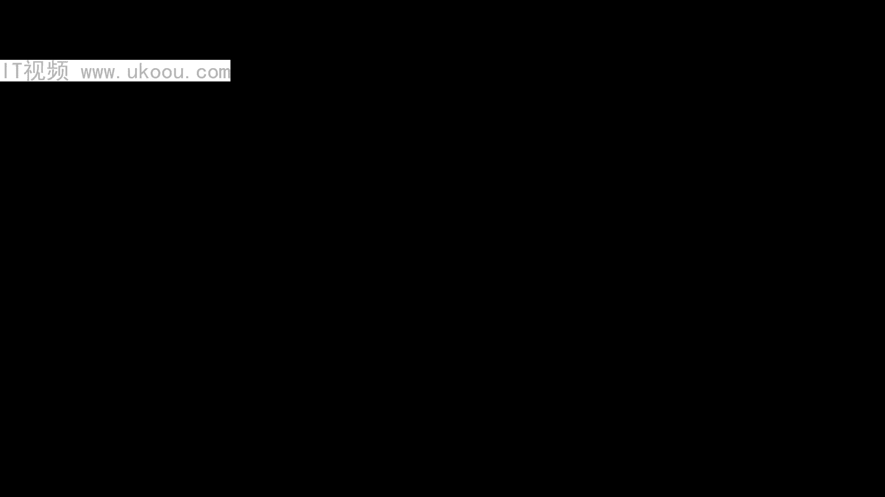
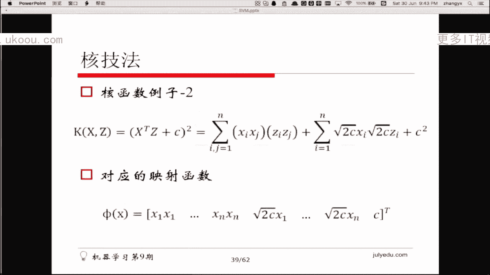
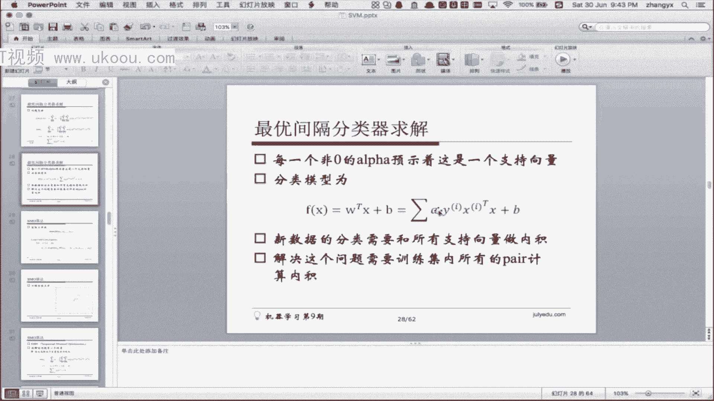
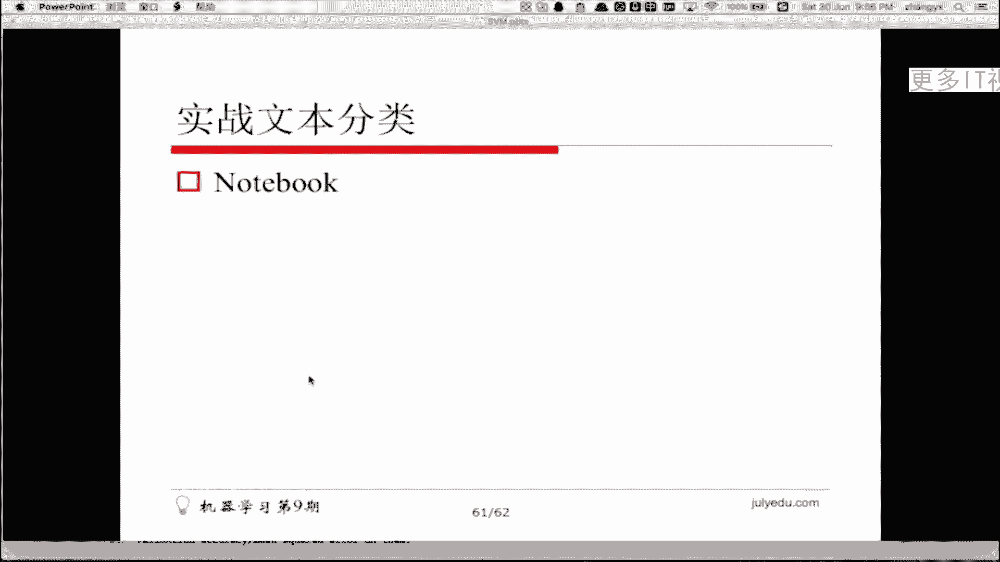
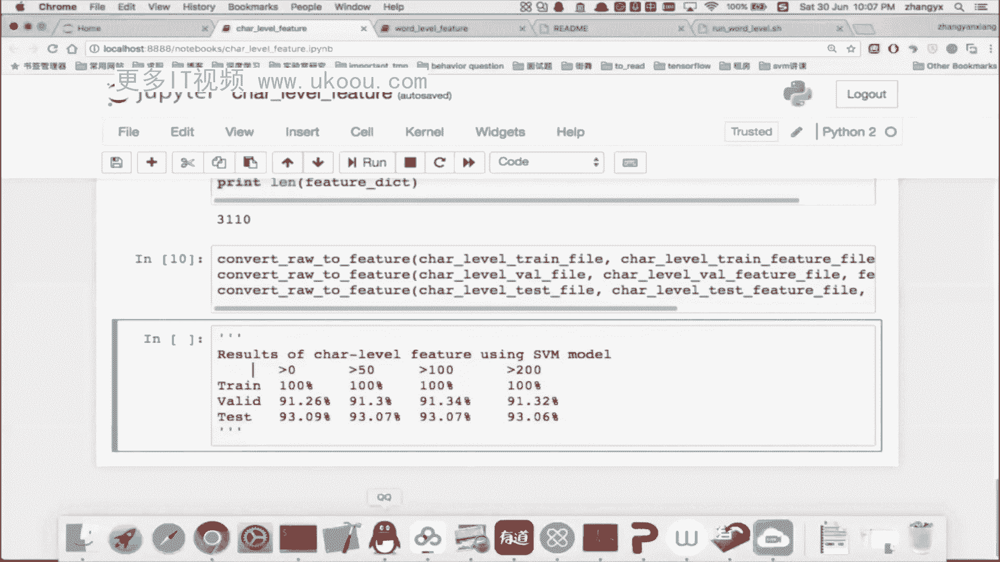
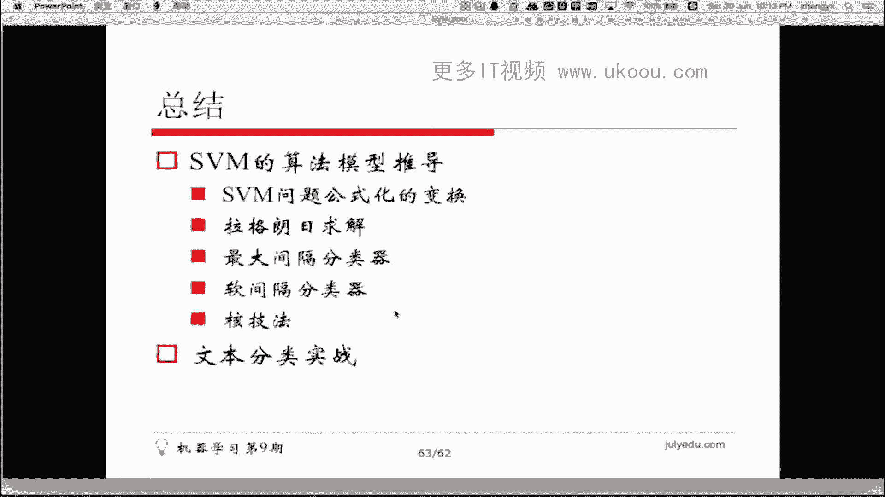
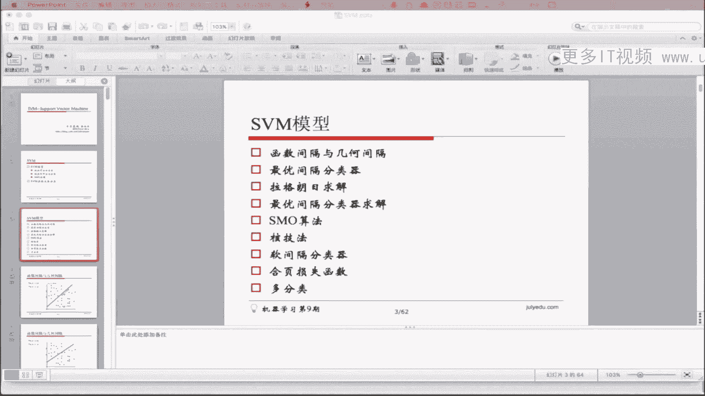

# 1447-七月在线-机器学习集训营15期 - P7：3-SVM与数据分类 - 程序员技术手札 - BV1ASste6EuZ

好那我们闲话不多说，然后我们就直接进入到我们今天的正题，就是SVM好，然后我们今天的主要内容是讲SVM的模型，然后主要会在在这个讲解过程中，会让大家了解到就是SM的模型的基本的推导。

然后嗯然后还有SVM的实战，然后在文在文本分类上的应用，然后在SM模型的推导过程中，会给大家讲解如下几个知识点，第一个就是一个线性可分的分类器，然后然后后面还有一个是线性不可分。

就是在线性不可分的数据上，我们的SM的模型是怎么样去构建的，然后还有就是SVM的求解呃，SM求解就是有一个叫做SMO算法，当然在讲解这个的过程中，我会把就是中间用到的一些数学知识，也都串起来。

那当然如果大家知道的话，我们可以跳过，如果不知道的话，我们可以过一遍，好然后今天的homework，然后会跟那个就是今天的实战文本分类相关，然后嗯对，然后但到后面我们会细说好。

我们再讲SVM的模型的构建的就是模型的嗯，构建过程中我们会讲到如下的知识点，就是第一个就是第一个是函数间隔和几何间隔，然后第二个就是自由间隔分类器，然后所有间隔分类器就涉及到我们把SVM去嗯。

把SM模型的建模就已经建出来了，然后在建在建模完成之后呃，他作为一个数学问题，我们会使用一个叫做拉格朗日方程的东西，去对它进行求解，所以说我们中间会补充一些呃高等数学的知识。

然后在在补充完这个数学知识之后，我们会去讲自由间隔分类器是如何求解的，嗯对然后再讲到呃，在讲到用拉格朗日的方法，对自由间隔分类器的求解做了一些变化之后，我们会介绍会引出SVSMO算法。

然后这个SMO算法就是呃去求解SVM的，一个比较呃比较直观的一个算法，然后然后在讲完前五个之后，其实SVM的模型就已经是，大家就已经有一个概念是SM模型，就是这样这样子的，然后在后面我们会介绍两个扩展。

一个叫做合计法，这个合计法就是SM里面一个常用的技巧，然后用来处理呃线性不可分的数据的，然后还有一个叫呃，还有一个是软件和分类器，它也是呃去求解啊，当数据线性不可分的情况的时候，SM是怎么求解的。

好了讲完这两个之后，我们会用另外一种方式，就是荷叶损失函数的一种方式，再去重新理解一下SVM，然后再到最后我们会会讲解到，SVM是如何去做多分类的，然后这个就是我们今天的。

这是一个主要的一个呃知识pass吧，就是知识路径，然后希望大家能跟上，就是说呃是这样的，因为今天的知识点比较多，公式推导也比较多，所以大家如果中间没有听懂的话，或者是没有呃，就是觉得我没有讲清楚的话。

可以那个随时打断，然后我我希望就是说因为知识点很多，所以我希望大家都能听懂，就是我们也不求多，只求那个我们能把每一步都听懂，好然后嗯如果还有同学没有那个没有进来的话，可以看一下。

就是嗯可以看一下丽娜在群，在群里面发的一个一个截图，然后可可能需要修改一下浏览器的设置，才可以进来对，然后如果没有声音的话，建议再重新嗯重新进一下，或者是重新换个浏览器试一下。

首先是那我们先介绍函数间隔和几何间隔好，那我们看到下面有一有一张图，这个图里面是一个数据集，当然它是一个二维的一个图形，然后黑点的话就就代表正一类，然后空心点的话就代表一类。

大家可以看到它其实是一个线性可分的，数据集嗯，因为因为我可以画一条直线，把这两个数据集完完全全的分开，当我画完这条直线的时候，我其实这条直线的方程是W乘以X加B等于零，就是在这条线上的所有点呃。

代入进去之后，W和B呃，带我到W和B中去，就会使得这就会使得最后的方程数是零，然后在这条线下面的的这些空心点，他们都是W乘以X加上B都是小于零的，当然在实心点都是W乘以X加上B是大于零的。

好对于一个线性的数据集来说，那我们可以随随便便的就可以画一条直线，就可以把它给区分开，当然我的线还可以这么画，还可以这么画，还可以这么画，那么问题就在于哪一条线是最好的。

好对于一个线性可分的数据数据集来说，那我们可以再画出来N多条线，画出来无数条线，然后这无数条线都可以把这个呃，都可以使得准确率能够达到百分之百，但是这无数条线里面总有一个是好的，总有一个是坏的。

比如说这个贴着两个点的，我就觉得应该不如在中间的某一条线好，那么该怎么样去衡量这个事情好，那我们用数学公式来表达一下，第一个那我们先建一个呃，建建一个模型，它的模型的参数是呃W和B。

然后呃它的表达式是W乘以X加上B，然后经过一个激活函数吧，然后这个激活函数也可以，大家也可以认为是一个只是函数啊，这只是函数里面，当里面的值是小于零的时候，就是一，当里面的值大于零，大于等于零的时候。

就是一好，已经有同学开始剧透了啊，可能大家已经有有用过那个SOM的，已经知道了是最小间隔最大的，这个对这个事情好，那我们还是照顾一下对S没有了解的同学，然后我们还是继续讲清楚，好那么对于对于这个分类。

对于这个数据来说，它的分类模型就是这样的，HWBX等于GWX加上B好，那么它的函数间隔是什么，它的函数间隔其实大家可以认为，就是把这个点带入进去之后，得到的得到的值就成为它的函，就成为它的函数间隔。

好那么我们可以看到把这个点代入进去之后，他为什么在前面乘以一个YI呢，因为我们刚才是讲过，就是说这条线我们可以看到，我们可以看到这条线可以使得那个可以使得嗯，可以使得那个整个数据集被区分开。

然后当我把这个值把实心点呃，代入到这个线的方程中去之后，那么它的值不是等于零，而是大于零的，然后当我把空心点的值代入进去之后，那么它的它的值是额是小于零的，而是小于零的，所以说当如果是空心点的时候。

那么W乘以X加上B的这个数是是那个负数，而负数是不能作为距离的这个度量的，所以说在我们这里用了一个取巧的办法，就是说我们把类别值给命名成正一和一，就作为它的符号，对于是负类的的，对于父类的数据集数据点。

我们乘以这个符号之后，它就变成了正数，好至于有同学问为什么是这个式子，那我们来看一下它的几何意义是啥，好我们我们可以看到画一条线，然后我们可以看到，我们比如说画一条比较简单的线，就是Y等于Y等于X。

然后在这条线里面，那么它的方程是什么，它的方程可能这个是Y这个呃也不能这么写，就是，相当于是我比如说我还是根据刚才那个数据，跟从那个数据，从刚才的那个数据集中来，然后在这里他的X其实是两个分量。

然后X1和X2，这个是X1，这个是X2，然后我画了一个线是比较呃比较简单的一个线，就是他经过原点，所以它没有截距啊，没有截距的话，B就是零，所以这个大家应该可以理解，那么这个线的方程其实是X1减X。

二等于零对吧，那么相当于是比如说我在这个线上的所有的值，比如说这个一一，这个值叫一一，那么代入到这个方程中去，1-1就等于零，那么比如说我有一个正，我有一个正类的数据点在这里，这个点是一二。

那么它带入进去之后，他代入进去，带入进去之后，对我们在这里可以变成X2减X1吧，他带你进去之后，那么2-1就等于一，那么它代表的含义是什么，它代表的含义其实是这段距离。

就是就是说从就是以跟Y轴跟Y轴是平行的，然后这个数据点到线上的，这个数据点到线上的距离就是一，这个就是啊函数函数间隔的几何意义，好那我们可以看到对于这个问题来说，我们要找到一个最好的。

我们要找到一个最好的直线，那么在最好的直线里面，就是说呃，我先我对于每个数据点都计算出来，它的函数间隔，然后然后，有同学说好像公式好像错了，但是其实不是这样的，因为我在这里计算的是几何，是函数间隔。

还不是几何间隔，所以呃后面会讲到几何间隔，好那么函数间隔是这样，然后那么我对于每一个每一个数据点，这都可以计算出来它的所有的函数间隔，然后呃对于一个值，对于对于一个直线来说，我可以计算出来所有的。

就是对于一个直线来说，我可以给它计算出来一个值，这个值叫做叫做最小函数间隔，这个最小函数间隔就可以代表的，就是就是说我可以去衡量说，这个这条直线到底跟这个数据集的一个，拟合程度。

对刚才有同学说我举的例子是X2减X1的，对，其实就是这样子，嗯好好，那么我们可以看到，那么我们就我们可以看到，如果是对于函数间隔来说，我只要把W和B，我只要把W和B成倍的去进行增大。

那么这个函数间隔就可以变得无限大，那么我们刚才介绍的这个最小函数间隔，其实就就没有什么意义，就是就是说呃，我我我只要成倍的把W和B进行增大之后，就可以使得这个最小函数间隔变得无限的大。

所以说这个函数间隔它的含义是呃就是没有，那么就是它是一个它并不能够代，并不能够完全的代表这条直线的一个好坏，所以说我们在这里又引入了一个几何间隔，这个几何间隔的含义，就是说他把这个值给设的。

也更加的就是做了一个normalize，然后做normalize的必要必要条件，就是说我把这个，我把这个W给设成一，好有同学，有有同学在表示说，函数间隔是指什么之间的间隔，函数间隔是指的是。

数据点和这条直线之间的距离，好有同学在问Y乘以WX1加上B呃，是和X2和X减X1是一个意思吗，在这里可能大家那个没有，就是可能大家没有没有没有那个正确的去理解，我刚才的说法是这样子，就是对于一个。

对于一个对一个二维空间X1和X2，那么我在这里其实X其实它是一个向量，就是它是X1和X和X2的一个向量，然后W也也是一个向量，所以在这里其实相当于是X1X2是一个向量，然后W1W2也也也也是一个向量。

然后B是一个标量，所以它比如说我刚才的这条直线，他是这样子，但是他其实是W1乘以X1，加上W2乘以X2加B等于零，不好意思啊，那个我的触摸板好像有点问题，然后导致他写出来的公式有点模糊。

在这里这条直线的含义其实是W1乘以X1，加上W2乘以X2，再加上B等于等于零，对，然后我我我把这条直线的，就是表达式给求出来之后，那么就变成了其实就变成了那个就是，在WZ在X1上的这个系数。

其实就相当于是负的负X1加X2，然后B因为我的这条直线是经过原点的，所以我的B应该它的结局是零，所以所以那个B是零，所以这条这条直线的方程是这样的，就是负X1加X2是零，然后对于一个一个点二一来说呃。

应该是一二，然后他带入进去之后就是一二，然后我代表我，我我想要它，我假设它是一个正类，所以说-1+2是一，就是W乘以X加上B的值是一，然后Y也是一，所以1×1，然后这个函数间隔就是一。

所以刚才的意思是这样子的，然后我们可以同时看到，除了这个W之后是什么样子的，我们可以看到，还是刚才的那个还是刚才的那个数，然后我们可以看到，其实他在这里他的W是一个向量，然后这个向量在在X1上的值是一。

在在那个在X2上的系数是一，他的W是这样子的，然后对于二一这个点，他们我们刚才计算出来的函数间隔是一对吧，然后然后他再他再把那个呃令令这个数是另，令这个这个系数是一是一，所以我们可以先先计算一下。

就是呃这个是W的，就是那个叫开平方的一个值啊，应该是二阶平方的二阶开方对，然后我们可以求求一下，我们可以先在这里先求一下它的，它的值就是一的平方，加一的平方等于呃等于二，然后相当于是他然后再开。

然后再开方之后就成了根号二，然后相当于是我们现在，W是等于根号二，然后我们令W是一，所以所以那我们就需要，那我们就需要在每个上面都开一个，就是都需要呃，需要使得W再乘以一个根号12。

就相当于是因为我现在是根号二嘛，然后我如果让他等于一的话，那我们需要除以根号二，所以我们在W的每个分量上都除以一，除以一个根号二，这样就就相当于是我计算出来的这个距离，就变得就就变得是一个呃。

是一个比较绝对的距离，其实它的几何含义就是这样子，就是我我在函数间隔上再除以一个根号二，就相当于是我把这个我把这个W的范数，然后二阶范数再除再除一下，其实就相当于是我这个点到到直线的一个呃。

一个就是最短距离，垂直距离，相当于是在在这个直线的法向量上，又求出来的一个距离好，然后这个是几何间隔的意义，几何间隔的意义就代表了，就是说这个点到直线的最短距离，好那我们介绍介绍完了这个几何间隔。

然后我们再往下看，好那我们如果介绍完几何间隔之后，那我们就可以下按键，就可以推导出来说哪一条直线是最好的，哪一条直线是最好的，那个直线最好的那个就是代表说的含义，就是说它的几何间隔是最大的。

然后它的几何呃，当然我们刚才也说了，就是一个直线的几何间隔，一个一个直线的函数间隔，就是一个直线的函数间隔，就是所有的数据点到这个线的，所有的函数间隔的最小值，那么同理，一个直线的几何间隔。

就是所有的数据点到这个直线的呃，所有几何间隔的最小值，所以一个最好的线，一个一个最好的分类，一个最好的分类线就是呃一个最好的分类线，就是呃几何间隔最大的一个分类线，有同学问为什么刚才除以根号二。

因为是这样的，就是刚才我的W我我我的W是呃，我的W是一个向量啊，这个向量是一一，就这个这个向量的值是一和一，一和一的二阶范数就是根号二，好，那我们刚才其实我刚才说的那一段比较长的话。

其实就是用这个公式可以可以表达出来，然后我们可以使得，就是因为我在这里另设了一个限制，叫做呃叫做大于等于一，所以我在这里呃，当W等于一的时候，我这个伽马其实就相当于是一个呃，是一个几何间隔。

然后我最大化这个几何间隔，使得所有的数据点，所有所有的数据点，所有的数据点都大于等于这个几何间隔，然后同时W还等于一，啊二阶范数就是L2就是欧式距离，欧式距离是两个点之间的呃，是两个点相减。

然后再求二阶范数，所以二阶范数跟跟欧式距离没有什么关系，就是你可能把这个概念给弄混了，就是二二阶范数是求欧式距离的一个手段吧，而二阶方式就是指对于一个向量来说，每个分量都求平方，然后再开根号。

然后把每个分量加起来，然后再求根号，有同学问呃，W的范数为什么是一，W的范数是一，就代表它是几何间隔，然后几何间隔相对于函数间隔来说，就是一个是一个比较绝对的数，因为如果是函数间隔的话。

我可以把W成倍的成倍的变大，然后就是就可以使得函数间隔也成倍的变大，所以它不是一个定值，为什么W垂直于直线，这就是那个呃就是怎么说呢，就是就是说这这可能就是在几何意义上。

就是说呃W的范数就代表着这个几何含义，就是它其实是一个法向量的一个一个求法，是，好，那么对于这个问题来说，我们可以看到它有很多个，为什么W等于一的条件下函数间隔最小呢，不是这样子的。

就是说函数间隔的大小，跟跟那个W等于E没有关系，就是你还可以把呃，就是说相当于是一个标准，就是我练W等于一，相当于是这个函数间隔就到了一个标准上，大家都是这样去计算的，当然因为如果不是这样的话。

你可以成倍的去调整W，然后使得函数间隔可以变大，可以变小，函数间隔不是在W点E的时候最小，而是说它是一个变化的值，而几何间隔因为W等，因为我设定了W等于一，所以它就是固定不变的。

好那我们可以看到其实我们刚才的问题的表达，就是说我要找到一个这样的分类面，我要找到一个这样的分类面，使得它在线性可分的时候，这条直线是最好的，然后SM的一个基本的一个核心思想。

就是说我要找到一个这样一个最好的这样的线，从而去去去个更好的去分类，然后大家可以理解的，就就是说因为大家可以看到就是这条线呃，这个点到到那个到分类界面的这个距离，我们可以其实可以把它理解成为执行度。

就是说呃当这个点离这个分类界面越远的时候，我认为就是说我可以直观的去去理解，我这个点被分类的置信度就会比较高，当然当它比较接近边缘的时候，那么我可能会认为说，这个点到这个点被分类的置信度。

不是那么的好好，那我们还看到呃呃最后的这个问题的表达，就在于我要找到一个最大的几何间隔，使得呃使得所有的数据中，所有的数据点都大于等于这个间隔，就是我们就是我们现在这个图上的，一个表达方式。

但是大家可以看到对于这样的一个问题来说，我们还没有特别直观的一个idea去去处理它，然后因为是这样的，就是就是说它有很多的条件，比如说有数据点的约束条件，然后因为它是一个线性表达式嘛。

所以它是一个凸性约束，然后呃对于这个W来说，它是一个非凸性的，然后所以比较容易达到局部最优，然后同时它的变量数是W乘和B，还有还有这个还有这个伽马，然后所以它的变量数也比较多。

然后我们可以通过一系列的变化，使得这个问题达到简化，好第一步将第一第一步的变化，就是就是说我们我们那个可以，可以通过那个可以通过除以W除以W的方式，来消除那个W的这个W的这个约束。

有同学问为什么W乘以X加上B是正一负一，因为我们PPT里面之前有讲，在这里就是有一个函数，这个函数它就是一个指数函数，当最小的时候是一，最大等于零的时候是正一，好大家可以，现在可以听到吗。

啊好可能刚才那个刚才网络有些问题，好，那我们可以看到就是我们在刚才有一个，这有一个这样的原始问题，然后我们在这里做一下简化，就是说我们把W等于一的那个限制给去掉，然后我们在在这里就是做个简化。

就是我们把W等，把W等于一限制给带到这个给带到这个限制，给带到这个约束条件中来，然后我们在这里两边都除以一个W，这样相当于是我wt除了这个W之后，除以了W的二二维就是二阶函数之后。

那么在这里整个它就是一个它就是一个呃，他就是一个在这里除以它，它之后，那么W的范数其实就是一了，然后同时我们做了一些我们那个在在这个呃，在不等式的两边都除以了W之后，那么伽马除以这个W其实就相当于是嗯。

是几何间隔呃，是这样的，就是就是说有同学问这个W不是一吗，这个W的范数不是一吗，我们在这里有有一个条件是是W范数等于一，然后我们先把这个W的W的范数等于一，给给调整到那个就是给去掉，然后给调整到那个。

给调整到给调整到函数表达式中去好，我们可以看到在这里，为什么去掉，然后去掉的原因就在于，我可以使得它这个问题变得更加简化，然后我在呃我们大家可以先不看最下面这一行。

我在上面两行的每一个地方都除以了一个W，多出一个都除以一个一个W的二阶范数，然后就，然后就相当于是我把W等于一的，这个条件给加进去了，相当于做对，有同学已经说了，相当于做了归一化，然后我在这里其实是。

因为我的两等式两边都除以了W，所以我还我还可以把这个W消掉，然后整个问题就变成了，我去max这个伽马除以除以W，其实相当于是相当于这个问题，就变成了一个这样的问题，就是伽马是函数间隔。

函数间隔除以W模之后，那么它就是几何间隔，对吧，就是我在这里，我本来伽马的含义是是函数间隔，然后除了W的二阶函数之后，就变成了几何间隔，然后在这里，我仍然我的条件仍然是那个大于等于伽马。

好因为我在表达式中，我在这个表达式中，W和B可以通过成倍的调整去呃，去使得呃去使得伽马可以变成一，所以我在这里又做了一个简化，就是说我直接把伽马给设成一，然后在这里相当于是我干妈等于一之后。

它就变成了W的二阶范数分之一了，然后最最大化这个函数，就其实就相当于是最小化最小化W的范数，所以我可以把这个最大化的问题，给变成一个最小化的问题，所以在这里就做了第二个变化好，那么最终问题就变成了呃。

调整W和B，使得WW的二阶范数的平方是是最小的，因为在这里大家可以看到我突然加了一个平方，然后然后这个平方的含义就是，因为W作为一个距离，他其实是那个什么，就是他呃加加上平方之后，其实是我自己设的。

然后1/2也有同学也说了，是是为了封面求导，然后最大化最小化W和最小化W的平方，其实是呃是是一个意思，就是说他们是叫什么叫正相关，所以在这里其实我在这里应该是最小化，最小化这个W。

然后为了便于后面的计算，所以我在这里加了一个平方，好，那么最终问题就变成了最小化二分之1W平方，然后使得我满足这些条件，好，那么这个问题其实就变成了一个呃，比较就是在数学上就可以解决问题。

然后相当相对于之前我们的呃，我们的公式，然后他减少了一个参数，就是伽马，我们把伽马在这里在之前给给生成了一对哦，我们现在的问题跟刚才的那个，跟刚才最开始那个PPT里面的那个问题是等价的。

然后在我们的高等数学里面，就有一个这样的函数和这样的方法，去解决这个问题，就是去去U去最小化一个东西，使得它能满足某些条件，好那么这个这个东西是什么，这个东西就是拉格朗日函数，然后这个拉格拉格朗日函数。

如果我没有记错的话，应该是在高等数学里面，可能是上一期的上上册里面，会有这个函数的解释，这个函数呃，我们先回顾一下拉格朗日函数，拉格朗日函数的意思，就是就是说我最小化一个FW。

使得呃使得它满足条件hi额hi w等于零，然后，有同学问为什么引入拉格朗日函数，拉引入拉格朗日函数的一函数，的目的是为了去求解这个问题，好那我们在这里就是我们的，我们可以先假设一个简单的问题。

简单的问题就是就是说最小化呃，FW使得他满足这些约束，HIW等于零，然后我们有L个这样的这样的啊，这样的这样的函数，这样的约束，然后我们构造一个拉杆式函数，这个拉杆朗日函数就是说呃除了W之外。

我再加一个贝塔的一个一个值，然后这个值就是说，我把那个约束条件都给添加到目标函数中来，对，然后再后面就是LW乘以LW贝塔就等于FW，然后后面是所有的所有的呃约束条件，然后我在这里我要求我要求解这个问题。

其实我要求解的问题是，最后的是那个呃FW的最小值，然后那我就让L就是这个LW贝塔，对所有的WI的偏导数都是零，然后那L对于所有的贝塔I的偏导数都是零，那么我们可以看它是什么含义呢。

我们可以看一下LWLW贝塔，它的它它对于那个他对于，呃我们现在可以先看LLL对贝塔的偏导，L对贝塔的偏导，其实就相当于是只跟那个只跟hi打不相关，然后在这里就相当于是呃，我令啊L对贝塔对贝塔的偏导。

其实就等于HIW，然后在这里我要求解它，我们到最后要达到一个这样的效果，就相当于是hi w等于零，那么我们先看哦，那我们再看L对呃，对WI的偏导，就相当于是FW对那个对对对，对那个WI的偏导。

然后再加上后面的这个hi贝塔，HIW对那个对对对那个对WI的偏导，然后其实最后达到的目的就是FW是最小的，好那我们这是拉格朗日函数，然后我们可以看到有一个叫有一个扩展，就说可能高等数学里面没有。

就是就是说高等数学里面讲的那个都是呃，它的约束都是相等的，然后然后在这里，我们在广义上面可以引入一个不等的一个呃，JW的函数，好呃那么这个函数我们可以看到，同样的我们还可以去构建一个拉格朗日方程。

然后这个拉格朗日方程，其实相当于是，我把两个优势和线都分别加入进来，都分别加入进来，然后对于对于那个等式的约束条件，我们用贝塔系数去做，然后对于那个不等式的右边，我们用阿尔法的基础去做好。

对于一个有不等式的，有不等式的拉格朗日方程来说，我们对它的求解，就比刚才只有等式约束条件的时候，就变得复杂了一些，它的复杂地方就在于哪，就在于我在这里JIW这个是一个是一个不等式。

所以我要求到FW的最小值的时候，我需要我需要去做一个，我需要去做一个最大最小的一个变化，有同学问为什么是加在这里，加其实只是一个通用的含义，在这里如果贝塔是负数的话，那么就相当于是减了。

好那我们可以先先做一个这样的一个呃，这样的一个变化叫做极小极大，首先我们我们先对这个拉格朗日的这个，所有的这个变化后的这个函数求极大值，我们可以看到我们在这里其实有两个设置。

第一个设置是阿尔法A是大于零的，然后贝塔贝塔是无所谓的，那么我们调整阿尔法贝塔，使得我们先不管FW，使得那个可以看它这个推塔W，它的值可以变得有多大，我们可以看到，如果大家注意啊，如果都满足条件的话。

那么HIW是零，那么GIW是小于等于零的，然后在这里不管我怎么调整阿尔法和贝塔，那么它的它的那个最大值都应该是零，这一步大家可以理解吗，好那么我们可以我们那我们可以再看，如果当当某个条件不允许的时候。

比如说HIW它它不等于零了，那么我可以通过调整贝塔，我我使得贝塔调整的特别大，然后就可以又可以使得那个它的，比如说我可以使得那个是贝塔，调整到一个特别大的数，然后他就是一个正无穷大。

对如果JI不满足条件，当然了，当然如果JI都满足的话，那么JI小于等于零的，然后阿尔法I是大于零的，所以阿尔法I乘以JI，永远都是一个小于等于零的数，但是如果JI是一个大于零的数。

那么阿尔法我们可以使得阿尔法特别大，然后同时就可以使得GI就变得特别大，对吧，然后大家可以可以理解，就在这就是对于这个公式，我们求求最大值，当这些条件都到这条不满足的时候，那么它的最大值就是一个贝塔。

我总可以调整调整阿尔法贝塔，使得使得使得这个CAPW是一个正无穷大，当然当他都满足的时候，那么它的值就是FW好，那么我们再对这个C3PW再再去求极小值，然后我们调整W让他求极小值。

相当于是如果所有条件都满足的话，那么我们对这个公式的求导就是FW的最小值，就是原问题的解，但是如果呃hi和GI有有某个条件不满足的话，那么我们求的这个最小值就其实就是正无穷大，所以它没有最小值。

所以我们就求不到FW的解，好这个是广义拉格朗日函数，好我们大家可以看到在这里我们设一个P星，就等于那个就是这个问题，就是极小极大问题的一个最一个最优解，我们在后面会不会用到好，那么它有一个队友问题。

队友问题其实其实很简单，我们就是把把这个把这个min和max给那个，给给那个翻转过来，就变成了max min，好，大家可以，那个就是可能看到这么多公式，会觉得比较比较比较生疏。

然后大家就是说对于一个知识点来说，我们知道他的目的是什么，就先足够了，然后我们可以可以先看到，我们可以先在中间，我们可以那个对于一些具体的细节，我们可以先记住，然后然后后面再慢慢理解。

好我们在这里讲对偶问题的，对偶问题的原因是什么，呃这个问题的原因就在于我对问题的一个简化，就是说我讲了这个对偶问题之后，相当于是我的目的，是为了把那个极小极大的问题就会转化成极大。

几给点给转化成极大极小的问题，这样我在求解上就可以，就是在求解LSSVM的时候，就可以变得比较简单，所以这是广义拉格朗日，我讲广义拉格朗日函数的一个目的好，那我们可以看到极大机问题。

就相当于是一个呃max命的一个问题，然后同时在求max的时候，我是调整阿尔法贝塔求命的时候，我是调整W，好在这里，然后在这里呃就是呃我们先下定义，就是就是说呃一般来说不是。

一般来说就是我们有一个严格的区间的，就是就是那个地星就是极大极小问题，极大极小的问题，是极小极大问题的一个对偶问题吗，然后它的最优解是地星，然后地星是小于等于P星的，好有有有同学表示。

那个有有同学表示这次有点听不太懂，就是这样的，就是这一部分广义大纲老师函数的这一部分嗯，大家是可能是需要记一下的，就是它相当于是一个数数学知识，然后我也不会给大家展开去讲，然后大家只要知道呃。

在这个地方可以去验证队友，可以把那个SVM的解释方法，求解方法给由那个对，给由极小极大问题变成极大极小的问题，好在这里1D星一般是小额，是小于等于P星的，地星是对偶问题的对偶问题的一个一个答案。

一个最优解，然后呃所谓的队伍问题就是极大极小问题，然后P型是极小极大问题的一个最优解好，那么当这些约束条件都满足如下条件的时候，就是约束不不等式G都是凸函数，然后再在这里，因为我们的呃。

因为我们在SVM中，它的约束条件都是线性的，所以线性函数都是凸函数，所以呃所以SVM的问题是满足这个条件的，然后第二个条件是约束等式，H都是反射函数，然后仿真函数其实和线性都是等价的。

然后在我们的SVM这个问题中，它的呃这这一条也也是可以满足的，然后不等式是严格执行的，然后在这里就被不等式时间段之前，就就代表就是那个不等G不等式，是肯定是有那么一到两个，有至少有一个是肯定小于零的。

而不是都是等于零的，好，这三个条件是就是就是说不是需要大家理解的，就是需要大家记住的，就是他是数学课本里面，可能是数学课本里面就提出来的好，那么在上述的这几个假设下，只要满足KKT条件。

然后就就使得那个对偶问题和原始问题，是是等价的，好好那我们来看一下KKT条件，KKT条件其实就是相当于是五个条件，我们再看一下，就就是我们刚才那个不等式和等式的右条件，都加到一般还是能去的。

一个最后的表达式是这样的，FW加上西格玛嗯，贝塔I乘以HI，再加上西格玛阿尔法乘以GI，在这里需要满足五个条件，然后满足了这五个条件之后，就使得对，就使得那个队友问题的最优解。

和原始问题的最优解是是那个等价的，这五个条件是分别是这样子的，大家可能在这里是要记一下，然后我们可以看一下，当然如果他是，我们可以看一下，当然当然如果这五天的含义分别是什么阿尔法，我们先看第三个阿尔法。

I乘以JI是等于零的，相当于是相当于是在在在这里，因为我们GI是一个不等式的表达式，那么当GI小于零的时候，我们就肯定就使得阿尔法的这个值是零，所以它才能等于零，当那个呃GI是小于小于零的时候。

那么当JS是那个等于零的时候，那么我们在这里阿尔法还可以不用是零，可以可以是任意值，然后他这个条件就可以满足了，然后同时GIW星是小于等于零的，就是不等式的条件，要满足，然后阿尔法星是大于等于零的等等。

对，有同学说，拉格老师和KKT当定理记住就可以了，对是的好，那我们在这里，因为它是需要我们记住的，所以就记住就好了，那我们在刚才的那个问题上，使用那个使用我们刚才讲的拉格朗日方程。

我们在这里就是我们把不等式的这个这个条件，相当于是变成了负的，就相当于是只有因为我们在原始问题里面，可能只有不等式的约束条件，所以在这里就就写出了就是这个的公式，就是我们原始问题可以变成这样的一个。

一个问题，然后再使用拉格朗日方程之后，就变成了一个这样的问题，变成了LWB和阿尔法，因为没有那个没有等式的约束条件，所以我们就只有嗯只有不等式约束条件，然后就变成了这样，好啊，有同学来表示。

那就是就是那个应该是这样，就是支持向量机，比较比较就是数学知识会比较多一点，所以可能大家理解上都会稍微有点嗯，就是一遍可能理解不透吧，有有同学表示这样的对，其实就是这样的，但是但是大家一定要坚持下去。

因为后面已经到了简单的部分，好那么我们刚才可以看到，其实我们把把这个问题，套入到拉格朗日方程中去之后，就得到了一个这样的表达式，然后这个表达式就是我们要求解的目标，我们要我们要求那个。

我们要求二分之1W2阶范数的最小值，然后我们使用对偶问题去去去求解，然后队友问题就是先先求极小啊，再后求极大，好在这里就是我们先固定，先固定阿尔法，然后对W和B进行求导，然后，其实就是我们对这个式子。

然后我们先固定阿尔法，阿尔法是不变的，我们先不管它，然后对对于那个W和B先去求偏导，然后我们可以看到，如果是对W求偏导的话，那么它就变成了是对这一项求偏导，然后然后再再再把这一项给，再对这项再求偏导。

好这一项，Sorry，在二分之1W的平方的这一项求偏导的时候，其实我们可以比较简单的，就是比如说我们之前对X的平方求偏导的时候，二分之1X的平方求偏导的时候，它其实它的偏导就是X在这里其实是一样的。

就是虽然他加了范数，我们也可以一栏把它当成是一个呃，当成是一个数就好了，然后在这里我们就可以让他就是二分之1W，二分之1W的平方求偏导就是二，其实就是W4级，然后在这里跟在这个西格玛里面跟W相关的。

其实就是就是这一项，这一项跟W相关，然后因为我们是对W求偏导，所以在这里只有一个W自己，所以我们把系数提取出来就好了，在这里就是其实就是西格玛，阿尔法A乘以YI然后再乘以xx，然后把这两项加起来。

就相当于是W减去它，相当于是这一步我们对W求偏导，其实就是这一步的W，还有这一步的阿尔法IYI乘以XI，加起来就就是W的偏导，然后如果是对B求偏导的话，因为我们在这里跟B相关的其实就这一项。

所以而且它是一个一次项，所以我们在这里就只需要把它的系数提取出来，就可以了，它的系数就是啊阿尔法I乘以Y，所以这是B的偏导，然后我们可以看到最后的求解就是这样子，就是呃这个LWB阿尔法对W求偏导。

就是W减去C干嘛，阿阿尔法IYI乘以XI等于零，又推出了W呃，就是我们在这个值最小的时候，我们就得到了W应该等于西格玛阿尔法，IYI乘以XI，然后同时那个对B求偏导，就是阿尔法IY我刚才就已经看到过了。

然后因为我们求出来这个之后，我们再把这两个式子，再再把这两个式子再代入到原始的，再带入到原始的这个这个表达式中去，然后我们就可以得到一个新的问题，我们可以看到这个是一个代入的过程，就是把把W的性质和和。

那个和和这个式子都代入进去之后，我们来看第一，第一步是这样代入的嗯，首先第一步是二分之1W的平方，我们可以写成这样，然后第二步我们把它先先展开，就是把这个西格玛的这个数字先展开。

第一步就是阿尔法I乘以Y乘以WT乘以XI，然后再减去再把B的这一项展开，就是阿尔法I乘以Y乘，再乘以B，然后再因为这里有一个负号，所以后面应该是一个加上西格玛阿尔法N，那么我们可以看到。

因为我们刚才看到了B在这里是一个标量，而阿尔法I乘以YI乘以西格玛的这一项，就这一项它其实是零，然后我们就可以把这一项就可以干掉，然后我们在这里，因为我们可以看到有一个W是等于一个数的。

所以所以我们把W这个数给带入进来，就成了这样，然后这一项也也也在这里，这一项其实跟那个跟这一项其实是一样的，就是就是说把W带入进来之后，那么投头里面的这个WT乘以W，跟这一项就是其实是一样的。

但是它后面它前面有一个系数是1/2，所以1/2的这个数，再减去它本来这个数其实就是-1/2，变成了-1/2，所以在这里是这样子，然后我们把西格玛阿尔法这个数再放到前面来，然后就成了一个一个这样的数。

然后就成为一个这样的视频，同时我们在这里看到还有一个wt，所以我们还可以把这个WT再替换掉，就成为了一个这样的是不好，然后最后我们可以看到我们把把那些把把W的，把W给替换掉，然后把AI乘以Y西格玛。

把西格玛AI乘以Y等于零，这个给带入进去之后，这个公式就变成了这样的一个公式，那在这个公式我们可以再做一个变化，就是说把这个西格玛的这一项提到前面去呃，呃也相当于是把阿尔法A乘以YI给提到后。

给给进给提到那个给放到西格玛函数中去，然后就得到了一个这样的式子，就是后面就变成了所有的式子都放在一起了，然后同时因为阿尔法I，阿尔法GYYG都是标量，所以他们都就是一个数，可以看成一个数。

然后后面XG和XI其实都是向量，所以可以把它看成是一个内积，然后所以最后的问题就变成了调整阿尔法，使得后面这个式子是最大的，然后同时我满足几个给我条件，就是阿尔法I是大于等于零的。

西格玛I等于1M阿尔法YI是等于零的，然后这个是我们上一步求出来的，所以到现在为止，我们的这个问题就变成了这样的一个问题，是我们刚才是最原始的那个问题，已经现在被我们被我们变换的，是就被我们变换的。

可能我们现在也完全不是特别认识了，就变成了这样的一个问题，好那么在这个问题里面之后，我们可以先直观的去理解一下，去去去理解一些，就是中间的一些值的概念的含义，第一步就是就是说和阿尔法。

阿尔法是大于等于零的，那么什么时候是大于零的，什么时候是等于零的，我们在这里大家可以先记住，就是说在求解完之后，每一个非零的阿尔法，就预示着它是它是支持向量，所谓的支持向量其实就是那个就是他在边界。

它在那个呃，他在边界点上的，他在边界上的一个一个向量，好，在这里给大家写一下支持向量，好比如说这个这条线是最，是那个我们的支持向量的分界面，然后然后同时我这条线平行的，往往两侧去去推展，那么在正力上。

在正力上我肯定会会遇到一些正立的数据集，然后在负利上肯定会遇到一些复利的数据集，复利的数据点，然后当然在边界之外，还有还有很多还有很多数据，那么当阿尔法等于零等于零的时候。

那么就就代表的就是说这个点是在这个，是在这个平行，是在这个跟分类界面平行的一个线上，然后是呃离就是说是是这个分类界面的，是这个分类界面平行的，往正面的方向推推到遇到第一个正题开始，然后就再停下。

然后就遇到了一个这样的知识向量，当然如果是阿尔法不等于零等于零的时候，那么就代表他不在这个线上，这是阿尔法的概念，然后第二个概念就是说，我把我的分类模型本来是FX等于呃，当然这在这里可能缺一个东西啊。

就是缺一个指示函数等于WX加上B，然后我们可以把W给带带入进去之后，然后就就成为了一个这样的一个函数，然后这个是我们最后使用的分类模型，那么在这里我们可以看到，它其实是对于训练数据。

训练数据集中的所有的点，就是R所有的点都在这个计算中去，都在这个计算中，所以当阿尔法就是对于支持向量来说，这个阿尔法是不等于零的，对于非支持向量来说，这个阿尔法还是等于零的，所以就相当于是新数据的分类。

需要和所有的知识向量去做内积，因为阿尔法不等于阿尔法等于零的时候，相当于是这个数据集，这个数据点就没有起作用好这是第二点，然后第三点就就就在于就是说我在训练的时候，我其实是用到了一个所有的一个。

一个数据点的一个内积，好这个是自由间隔分类器，我们带入拉高，我们带入了拉格朗日之后的一个求解过程，好，那么接下来我们可以看哦，那我们接下来再看这个函数，再去怎么这个问题再怎么去求解，就是调整阿尔法。

使得这个函数最大，使得这个这个目标函数最大，然后同时满足这些条件，那这条就比较简单了，已经不算是约约束了，所以在这里我们需要用到一种新的，我们需要遇到一种新的优化方法，叫做，SMO算法。

然后SMO算法跟之前的跟之前之前，可能大家在课上有学过那个梯度下降，还有牛牛顿推导等等的方法，然后SM方法跟他们是略有不同，然后呃我们可以看到它的基本思想是什么，首先我们可以先看一个简单版本。

就是叫坐标上升法，对于对于一个对于一个问题来说，就是我我的W，我有个W，然后这个W是个函数，这个可能是一个很复杂的函数，然后它有很多参数叫做阿尔法一，阿尔法二和阿尔法N，然后我该怎么样去求解这个函数呢。

然后这个这个这个时候用到的叫做坐标上升法，然后这个坐标上升法的基本的思想就在于，首先第一步是，我去不停的去执行下面的这个命令，然后在直到收敛为止，然后下面那个面是什么呢，就是说我对于每一个阿尔法来说。

我都去单独的去对它进行求解，而不是说去对每一个去求解，我们大家知道如果是如果是梯度下降的话，那么它会它会对所有的参数都求出来梯度，然后统一去更新这个梯度，在这里它的不同点就在于。

我在这里我先fix入其他的所有的参数，然后只优化这一个参数，然后把这在当前的参数状态下，我把这一个参数给优化到最好的时候，然后然后再去优化下一个参数，然后这个就是坐标上升法的一个基本的思想。

好那么有一个图示是这样去去去解决的，比如说在一个二维的情况下，再一个就是我们在这里是阿尔法一，到阿尔法N嘛，然后假如说只有阿尔法一和阿尔法二，那么我们就相当于是先先调整一个维度上的，比如说先调整这个呃。

竖竖着的这个位上的阿尔法值，使得它在目标函数上能够达到一个最优值，然后我再我再调整横坐标的，代表了这个这个分量的参数值，然后使得它在目标函数上达到最优值，然后然后我们再我们再去调整。

那个Y轴上的阿尔法值，然后使得它能达到最优值，然后然后再调整X轴上的这个这个过程，这个循环的过程其实就是呃，坐标上升法的这个一个计算过程，好有同学问这是随机推向上吗，就是它不是随机挑选项。

它跟我刚才也说了，就是说它跟随机梯度下降的区别，就在于随机梯度下降，它会同时更新所有参数，就是给所有参数都计算出来呃，都系统出来梯梯度值，然后去更新所有参数，而呃这个坐标上升法它是呃在一个一个状态下。

它只更新一个参数，然后是一下子把这个参数调整到，当前的参状态下，这个W的最优质的的这个这个地方，然后再去调整下一个参数，好，那我们那我们看到的就是这个这个方法，其实是一个比较简单的一个做个生存法的例子。

那么对于我们的这个问题该怎么样去去优化，首先我们再复习一下，我们刚才刚才优化后，就是刚才做过转化后的一个嗯一个问题，然后他的问题就在于求解这个这个问题，调整阿尔法，使得目标函数最大同时满足这几个条件吧。

然后但是在在这里有一个问题就在于阿尔法I，阿尔法I是有是有那个是有嗯限制条件的，阿尔法I乘以Y的西格玛值是等于零的，所以在这里，它并不能够像像普通的坐标相乘法那样，去去调整一个维度上的值。

使得它使得目标函数最大，因为他在这里有一个约约束条件，就是我更更改了一个阿尔法的值之后，我的我肯定会有另外一个肯定会需要调整，另外的阿尔法值，使得这个这个条件要在满足了才行。

所以说SM算法的基本核心思想，就是说我每次都去选择两个变量去进行优化，他跟那个普通的坐标成方法有一个区别，就是说因为他多了一个约束条件，所以他每次选择两个变量，然后因为一个变量变化。

我们再调整另外一个变量，肯定都能使得这个表达式的这个优势条件，肯定还可以继续满足，所以他要这样去解决好，那么我我的算法流程就变成了这样，就是重复上面的操作，直到直到那个直到收敛为止。

然后每次操作是什么呢，就是说我选择两我随机的去选择两个参数，阿尔法I和阿尔法G当然因为是两个嘛，所以I不等于G，然后我我去优化这个最后的目标函数，我去调整阿尔法和阿尔法G，其其实呃跳动阿法I和FID。

其实只只需要动一个，因为你动一个，另外一个可能会自动随着动的，因为它有约束条件的，他有约有约束条件在里面，所以我调整阿尔法I，使得在当前的参数来下W阿尔法是是最大的呃，是是最优的。

呃有同学问阿尔法IG是一个变量吗，不是阿尔法I是一个变量，阿尔法G是一个变量，但是因为有约束条件，阿尔法I乘以Y的西格玛等于零，所以所以比如说我在这里举了个例子，就是阿尔法一和阿尔法二吧。

其实我调整了阿尔法一，阿尔法二也应该跟着在一块变，所以在这里其实我选我虽然是选择了两个变量，但其实是只选择了一个变量好，这个就是SMO算法的一个基本的核心思想，就是坐标上升法的一个变种，然后对。

然后呃可能也是就是今天的今天的，可能今天的主要内容会比较的复杂，然后大家可以分块的去理解，就是就是说比如说呃，可能大家前面拉格朗日那块没有理解，那么我在这一部分SM算法就可以理解了。

那么也是就是比较好的，就是说呃，尽量把这个知识给分成一块一块的去理解，这样会比较快，对有同学说，单词相等式是不是只有阿尔法I和阿尔法G变，对，是的，在SMO算法里面就是这样子的好。

那我们现在已经经过了一个小时15分钟了，然后大家可以先休息一下，我们再讲后面的，然后经历了前面的很多公式推导之后，后面的内容会越讲越简单，希望大家不要走开，然后我们休息3分钟，然后9。18的开始。

然后大家有什么问题，可以在可以在那个在群里面提出来，好我看到里面有些问题啊，第一个问题就在于那个，单次调整时只有阿尔法和阿尔法G变啊，这个问题我已经回答过了，后面调整阿尔法I和阿尔法G的。

这一次是什么时候是停止条件的，停止条件就是呃，在这里有一个阿尔法，A是大于等于的约约束条件，然后这是第一个条件，第二个条件就是说它调整阿尔法I，使得这个函数使得目标函数最大。

啊对有人说是普通的坐标上方法是重复，每一个阿尔法都收敛吗，对是的，他是先有一个有一个最开始有一个阿尔法，就是所有的参数的一个状态，所有参数的一个状态，然后调整其中的一个参数，使得目标函数最优。

然后在这个基础上再去调整另外的参数，使得你把函数最优，等等，然后现在SOM用的多吗，嗯是这样的，就是现在很多问题上，其实都在转用转用deep learning的方法。

所以但是SOM作为一个比较强大的算法，就是他在之前很多年都曾经是呃，欺负那个地方呃，欺负神经网络算法的，所以现在在一些比较传统的问题上，还是有很多用处的，是让谁收敛。

就是让现在我就是现在这些PPT上的这个，目标函数收敛，然后老师现在是做什么工作的，然后我现在这边我是在google，然后我现在是在做呃，就是做两个方向吧，第一个就是就是算法，然后后面还有一个是安卓。

就是说现在相当于是前端和算法都会做，就是说有一个很奇怪的，有的就是很跟跟，可能跟大家的工作的公司不太一样，在google里面就是只要编程合格了，他他就认为你是啥都能做，然后所以虽然我是主。

我的主页是算法，但是也会做一些前端的事情，对有同学说SVM也可以在小M上用，就是有一些问题，比如说你的数据集是比较嗯，可能刚开始没有那么多，所以你可以用来做为M先快速的做一些，做一些实验，结果出来。

算法偏哪方面偏，deep learning就是循环神经网络吧，有同学问调整是不是让偏导都等于零，在这里这其实就没有就没有偏导的这个概念了，因为他看感觉看起来像是一个一个线性的问题。

所以你就直接能找到最大值就可以了，现在图像方面，基本上应该都是基于深度学习的吧，SVM主要文本处理主要在哪些方面嗯，可能用的最多的就是文本分类，好那我们时间差不多了。

然后我们开始继续继续我们的我们的课程，好那么正如我刚才所说，就是后面公式会越来越少了，我们的讲解会越来越清楚，好第一个，那么我们回想一下问题，就是我们刚才讲解问题的时候，所有的问题都在都在说。

都在提前说说这个数据集是线性可分的，那么当数据集不是线性可分的时候该怎么办，那么XYM还可以处理吗，好在这个时候我们可以看一下，其实是这样的，就是说当数据不是线性可分的话，你可以做一些做一些映射。

使得使得这个我们现有的数据，在当前空间下可能不可分，但是我们映射到一个新空间之后，可能就变得可分了，然后就我们就比如说一个二维的数据集，我们做了一个做了一个映射变换，把它把它映射到三维去。

然后就变成了一个这样的数据集，然后这样的数据集其实就变得就是可以区分了，其实呃，比较直观的就是它其实也可以在二维上做变化，比如说他现在是IPHONE11和X2嘛，我在每个数据集都都变成X11的平方。

加X2的平方，那么那么这这这些点，应该都会提升到第一象限中来，然后这些蓝色的点，都会集中到第三间的这个位置上来，所以这也是一种可能的变化，当然映射到三维空间上去，也是一种可以可以实现的变化。

就是说我经过空间变换之后，我可以使得这个数据集从不可分变得更加可分，所以这有一个空间变化的问题，然后空间变化就相当于是本来我做空间变换，就相当于是我对每一个数据点都做些，都做了一个做一个映射。

比如说我有一个函数嗯，比如说我有一个函数是是F，然后FX然后我们在新空间里面那个X6吧，都等于FX，然后做一个这样的变换，然后我再在这个X6的这个数据上，再可以再去构建一个。

再去构建一个SM的等model，然后去去运算就可以了，但是那么有什么方法可以可以，就是我们不显示的做这个做，做这个不显示的去对数据去做处理了，然后就直接在model里面就可以体现出来。

那正好我们也可以看到我们刚才ISOM呃，就是呃简化到最后它形成的问题是这样子的，在这里有有一个有一个续呃，有一个分量是XG和xi的一个内内积，那我们可以在这里就直接对啊，对XG和xi去做变换。

其实就可以了，这个就相当于是我我我本来就是我本来的步骤，是需要把呃X显示的做一个做一个变换，生成一个新的数据集，叫X6，然后在X6上再去做一个，再去做一个XM的model，但是因为我们到最后SM优化的。

最后是一个这样的表达式，所以在这里有一个X，在这里只有一个地方用到了X，所以我在这里直接做就可以了，就可以省掉那个省掉在硬盘上占用的空间，不用生成新数据集了，然后这个是第一第一个省掉的地方。

我们省掉了很多空间，然后第二个就是就是说因为XG和xi，我做了映射之后，可能投射到一个引入了一个叫做合计法，这个合计法其实它的概念就是这样子的，就是说我定义了一个核函数。

然后这个核函数我可以把它看成是两个，两个经过变化后的，两个经过经过空间变化后的向量的内积，然后这个就是核函数的一个概念，好那我们在这里引入引入了它的，我们因为它的定义就是和核函数。

它对应的是一种映射函数啊，这个映射函数可以使得呃，数据集从旧旧的空间映射到一个新的空间，然后为什么使用核函数就大，就就是就是说我映射后的向量，可能维度会非常的高，然后导致内机计算量比较大。

然后我用核函数，我可以比较省略的去计算这个和好，我们可以看一个和函数的例子，第一个，第一个和函数的例子就是呃，贺函数XZ就是在这里，Z是相当于是跟刚才大家看到的，也就是XY和XG吧。

在这里我用一个比较general的方式，就是X和Z，然后它的和函数是X乘以Z的平方，然后把这个式子给展开，相当于是，就相当于是嗯把这个式子展开，就等于就等于到最后的式子，然后我就不一一给大家去说了。

然后这个我们可以看到，我们可以看到它其实就相当于是，我把X和和和Z分别映射到了这样的一个空间，就是在在这里，它最后简化成的函数是X3XG，相当于是相当于是说我把X给变成了一个XI。

XG就相当于是枚举枚举两个分量，然后的乘积，然后那么它的映射函数就是X1X1，X1X2等等，一直到X乘以XN，那么这个对应的映射函数的，映射函数的长度就是N的平方，因为它是从里面任意选两个分量。

然后乘积，好那我们可以看第二个和函数的例子，第二个和这个例子其实就比较，跟刚才那个就稍微变化了一下，就加了一个C，然后相当于是我来这里需要嗯，需要把平方给展开，然后它的对应的函数其实就是这样子。

相当于是我在这里，也需要去对每个平方去做检查，然后然后再把根号2C的这个分量，也就给加到这那个加到里面了，同学们，这是常量吗，这不是常量，ZZ跟X是一样的，是一个是一个是一个向量，都是都是一个数据点。

好那我们我们可以看到就是在做了变换之后，那么这个对应的对应的应用函数，其实都是比原来的的维度要高很多，比如说呃，第一个它的运算函数的，最后的这个呃向量空间其实是N的平方，我们之前是比如说之前的维度是N。

现在就变成了N的平方，然后他的幅度比较大，然后我们就可以看到，和核函数其实是可以降低了计算量，然后另外的一个一个层面，就是就是说X1和X2，其实度量的，其实是在一个在一个对应的维度空间中的。

一个位置的一个一个度量，所以说我可以使用一些使用，使用一些那个其他的相似度的函数去做，比如说在这里就引入了一个叫做高斯函数啊，这个高次函数其实它也是就就算了，距离我我在这里高斯函数的呃。

输入同样是X和Z，然后它的它的表达式是X减Z的二维的平方，然后除以二的这个这个值，然后再求指数好，这个是一个比较常用的和，然后因为他也是去matrix距离的，同学说FX和Z没关系。

对FX和FX和FZ去去再计算，在计算内积，然后KXZ其实就相当于是FX和FZ做内积，好这个是和函数的一个基本的一个思想，然后什么样的和是，啊有同学说怎么样体现计算量的连接上，我们可以看看这个例子。

比如说我在这里，我去求这个和它相，当于是我在XT乘以Z，其实都是在在N维空间里面的，就是，XT其实是一个属于N维的，然后Z也是属于N维的，所以X乘以Z其实就相当于是，它的复杂度是ON对吧。

然后我们可以看到它对应的它对应的映射函数，对应映射函数之后，在映射函数过过变换之后，那么XT他就从一个N维空间，就变换到了一个N方，X6吧等就等于二的N方，等等于空间。

所以所以他在这里如果是XT的变化后的值，变换后的向量和ZT变换后的Z变换后的向量，它其实它的计算，内地的实验法都是ON的平方对，所以这就是它降低计算量的一个一个方法，就是从ON的平方降低成了ON。

当然对于不同的和它映射的空间是不一样的，比如说后面的这个，后面这个高斯和他其实是对应的，一个无限维的空间，然后再在这个时候嗯嗯就不是降低，否则降低计算量的问题，就是说是根本不能算的问题，好到这里。

就就是说呃高斯和对应无限的空间的这个概念，其实相当于是呃，因为对于一个E的指数次方来说，可以通过高数里面的那个叫做呃，叫做，泰勒泰勒展开的一个方法，然后去把它展开，所以是无限维的，好我们继续往下讲。

什么样的和是合法的，然后在这里有一个充分必要条件吧，就是一个定理，然后我就不给大家去去读书了，就是说对于一个数据集，然后它对应的合矩阵应该都是对称，半正定的矩阵。

然后这个嗯我可以说一下对应的和矩阵是什么，核心，就是比如说我有XN个呃，就我一个数据里面有N个数据，有N个数据，N个样本，然后我对每每两个样本去计算，通过这个和去计算一个值出来。

然后相当于是我有N的平方个，然后这N的平方就相当于可以组成一个矩阵，这个矩阵是一个叫做和矩阵，还有同学问增肥后一定会更好分吗，呃是这样的，就是你你作为一个数据集来说，可以这样理解。

就是增肥后不一定不一定马上，不一定肯定是线性可分的，但是肯定会有更大的概率是线性可分的，好，那么我们可以看到常用的核函数，就是一个是多项式，一个是高斯，还有一个是SIGMOID呃。

和矩阵的每个元素是不是常量和矩阵，每个元素都是一个值，都是一个标量嘛，不是常量，这应该应该叫标量，一个数叫标量，一个，标量向量矩阵，好你有多项式的核函数，高斯核函数和西格玛的核函数等等。

然后然后当然还有一个最基础的就是没有加，没有加任何的和，就是就直接算内积的那个那个叫线性核函数，好，那么如何选择和函数，其实其实在所有的核函数里面，其实一般使用频率就按经验来说。

使用频率最高的其实是高斯核和线性核，然后大家可以看到就是可以根据一些呃，从你的数据集上的一些特点可以选择，可以选择不同的和，比如说当你的特征数不很大，但是样本比较少。

然后在这个时候相当于是他的空间已经很很，他就是他的样本数比较少，但是它的空间维度很高，所以我们在这个时候，就一般认为说它很有可能是线性可分的，所以一般用线性盒就可以了，当你的特征数目很小。

然后但样本数目还可以吧，然后然后再在这个时候，我们认为它可能是一个比较空间，维度，是比较相对来说是比较小的，所以需要加一个高斯核，然后当然还有还有最后一种情况，就是当特征数目比较少。

但是你的样本数额特别大，这个时候你可能需要做一些特征工程的事情，然后当然还有一个就是说一个比较好的方法，就是说很多库里面集成了很多的，都集成了各种各样的盒，你可以你可以用交叉验证的方法。

比如说在一个小数据上去交叉验证，看看哪个核是最好的，比如说你拿到一个问题啊，这个问题有100万个数据呃，分成4000位，然后你可以先拿出来100类，然后然后取1万个变量先试一下，看看会不会比较好。

然后再去应用到应用到那个大数据上去，然后当然当然比较高端的玩家，会涉及自己的核的，好那我们可以看到就是SM的用法，正确的打开方式，其实相当于是我，我首先就是SM会帮我确定一个超平面，来进行分类。

但是呢如果他是如果就像我们刚才说的，就是说他在当前的空间，就是求不出来一个超平面，抽出来一个超频段，可以分开所有的类别，但是用它的高度空间的这个操作，S m，并不是说他直接去在每个样本上去去做转换的。

而是说他用了一个核函数的方法，然后既省略了去转换数据集的这个行为，然后又省略了，又省掉了计算量，好那么就是说我们就正如刚才所说，那么我仍然可能就是这个数据集还是不可分的，使得这个数据集变得线性可观。

但是可能他还是不可分的，那么这个时候该怎么办，就相当于是这样，就是他可能有一些噪音吧，就是说每个数据集里面都有噪音，就是说它可能是别的类里面的，然后是混进来这个类里面的特务是吧。

然后但是他他他仍然在其他的类上，相当于比如说这个时间点，你它映射之后还是在还是在这里，然后还是跟跟原来的数据，跟那个跟跟那个复利数据还是在一块，还是混在一块，你不管你头上到哪里，它可能都分不开。

因为它就是噪音的，它它本来就是噪音，所以这这种情况下，我们不能假设呃，我们拿到的数据一定是线性可分的，所以我们一定要考虑到这种情况，然后如何考虑这种情况呢，我们在目标函数上就加了一个加了一个乘法项。

就是说我们允许一些数据点小一，拥有小于一的几何间隔，但是其他数据点还是还是那个，还是大于一的几何间隔，但是这样的数据点是要受到惩罚的，比如说比如说我有一个数据点，它它是小于一的。

然后但是它小于小于小于到什么程度呢，小到一个叫做伊布斯的程度，然后有一个叫做伊布9I，然后这个1592是受到乘法的乘法呃，惩罚项其实比较类似于，如果大家如果大家之前有上过LR的话。

可能会讲到正则项正德画像，然后这个跟那个正常画像其实是比较类似的，相当于是一个多余的乘法，然后他加到目标函数中去，然后相当于是我最后的这个问题，就变成了一个这样的问题，然后这样的一个优化方法。

就是叫做软间隔分类器，就是说我在这里就是不要求，每个数据点都一定是是那个大大于等于的，几何间隔了，好同理，这样的一个东西经过拉格朗日方程，同理这样的一个这样的一个这样的一个问题，经过拉格拉格朗日方程。

然后我们去计算，然后我们就就得到了一个新的问题，然后在这个新的文件可以，大家可以看到，跟跟原来我们没有那个没有软件课的时候，它的区别就在于呃，阿尔法的限制变多了，阿尔法限制除了大于等于零之外。

还要小于等于C，然后这个C就是加在乘法向量的系数，然后然后cc也是SVM的一个比较重要的参数，那么经过了这个之后，那么我们可以看到，其实在SMO的算法它有了更多的约束之后，它其实也变得更加好算了。

就就是说我阿尔法的值，我阿尔法值得选界是有边界的，一个是C1个是零，这只是个示意图，大家可以以理解为主，好那么我们讲了刚才的软件和分类器之后，那么SVM的所有的推导的知识点，应该都已经讲完了。

然后可能就是因为SM的数学推导会非常的多，所以大家可能听起来比较那个比较比较混乱，然后因为我在这里，其实相当于是把每一个每一个SM理解，SM的每一个pass唱的每一个节点都分出来了。

就是最开始讲的那个大家，我希望大家可以分块的去去理解SVM，然后对于拉格朗日方程来说，你只需要记住他的一些条件，还有一些推导就可以了，然后其他部分其实大家用手推一下，其实就能知道呃。

呃其实就能知道最后的SM的推导是怎么样的，好其实后面的核函数还有那个软间隔，虽然推导上没有，没有之前对讲基础的时候那么多，但是他们其实是SM里面很重要的概念，呃有同学问为啥支持向量的线等于一和一。

不是等于其他值，是这样的，就就是如果它不等于一和一的话，那么那么我们可以等比例的调整，W和B使得它等于一和一，所以一和一是我们自己设的值，而不是说它是一个求出求出来的值好，那我们得到了SVM之后。

我们可以看到SYM的M，SVM的问题的数学特性，就是说它优化的是一个二分之1W平方，所以它是一个凸优化问题，肯定会有一个全局的最优解，然后它的特性就在于它可以处理高维数据。

比很高维的他只要算内地就可以了，嗯然后它的软间隔可以，其实也也可以起到一些过敏，降低过拟合的作用，然后嗯啊而且有个重要的重要的特点，就是它就是说它求解问完成后，它的它只有少数数据起作用的。

就是那些支持向量，就是阿尔法嗯，不等于零的那些向量，然后还有一点就是说它因为有核函数的概念，所以和核函数是可以设置很多的，就是你可以自定义和函数等等，你可以有无限的空间去选择合函数，然后有同学问。

有同学问管金额是为了增加模型，泛化能力和函数是为了更好的分类也对吗，对和函数其实就像有同就像下面同学说的，就是它还可以减少计算复杂度，对这两个都是，然后软软间隔主要是呃兼容那些就是不可分数。

预计的起作用的，其实和函数和软间隔也都有，那种就去兼容不可分数，去去解决不可分问题的，不可分数据集这样的问题的一个一个方法，有同学说得到了支持向量后，那其他向量就就没有作用了，其实是这样子的。

就之前我在那个有一个PPT上也讲过。

对在这个PPT上大家可以看到，其实因为我的不是非支持向量，它的阿尔法都是零，所以所以只有支持向量才会起到作用。

好那我们继续往后讲，其实除了刚才的那种方式之外，还有另外一种方式去理解SVM，然后这种方式就就叫做合一选择函数，然后我们可以直接去看这个损失函数是什么啊，就是它的损失函数其实是这样的。

就是对于对于一个数据点来说，如果它的如果它的几何间隔是那个是大于一的，那么它就是嗯那么我们就先不管它，如果它的几何间隔小于一的，那么我们就去调整参数，使得它的几个间隔变得大于一，这个恨直到这个回血。

等差数的意思就是这样子的，然后我们可以看到呃，其实主要的主要的精华就在于，一减去Y乘以W乘以乘以WX加B这一块，然后一大家可以看到Y乘以WX加B呃，其实就是就是那个就是几何间隔嘛。

然后就是几何间隔合一去做做减法，然后在这里有一个损失函数的一个变化，就是说呃有一个有一个函数吧，叫Z加，然后这个最佳，这个其实跟呃跟那个神经网络里面的软路函数，其实是一样的，就是当Z大于零的时候。

他就他就是他就是Z，当Z小于零的时候，它就是零，所以什么时候C小于零呢，就是说几何间隔是大于一的时候，一减去它就小于零了，然后当几何间隔小于一的时候，这个这个数就是正数。

然后这里面后面有一个W的二阶范数，然后这个二阶范数就相当相当于是一个呃，这个是一个正常画像，然后通过这个loss，我们去我们去那个我们去呃做梯度下降之类的，然后就可以去求解这个去求解呃，去求解SM。

然后这个是一个是SM，从损失函数的角度，然后去又得另另外一种理解方法，但是通过这个这样的理解的话，我们我们既引入不了和那个合计法，也引也引入不了软软结构分类器，所以它可以作为一种补充材料，放在后面。

放在这里，然后我们可以看到这个横着loss它的，它的它的方程是这样的，就是当，应该是当几何间隔了，对它下面的图是这样子的，就是还是说就是当当那个几何间隔，是是那个小学一的时候，我就去考虑它。

就是它相当于是他离分错就不是特别远，然后我就去考虑它的超算函数就是这样子的，然后它几何间隔是大于一的时候，它就是零，然后在这里有一个有一个另外的一个，就是真实的，就是最原始的那个零一损失函数。

其实是这样的，就是当X小于零的时候，它就是一，当X大于零的时候，他应该是零，所以相当于是这个函数是那个是零一损失的函，001损失函数的一个一个一种拟合手段，它跟那个西格玛的损失函数是类似的，好。

那么我们刚才讲的SVM，它其实都是支持的是二类分类，然后呃对于多类分类来说，他该怎么支持呢，其实有很多种方法，第一种第一种方法就是说对于N分类问题，然后我可以我可以用一对多的方式。

就是每个类和剩下的类去做去训练分类器，这样我需要训练N个分类器，然后然后去去得到那个最后是哪个是哪个类别，这是第一种方法，第二种方法是一对一的分类器，一对一的分类器，就相当于是我需要串出来。

二分之N乘以N减一个分类器，然后这样这样我就可以对每个分类器，我都去投票，然后相当于是到最后哪个类别得的票数多，就就属于哪个类别，第三个就是用层次，用层次的方法，就是就是说我把我首先把类别分成两个部分。

就是比如说我有100个类，然后就首先是这50个类和这50个类，相当于是呃把100个类分成两部分，50类和另外五之类，然后这是一个二分类器，然后对于这50来说，再再去做做二分，就是分成25个类和25个类。

然后再去训练一个分类器，这个是一个层次向量层次支持向量机，然后这个就需要log n个分拣器，然后在现实中，然后呃一般来说就是呃，在一般的SOM的开源库的实现，一般都会实现一对一和一对多的人理器层次。

知识分类器好像用的不是特别多，好那我们后面就到那个实战环节，然后啊对可能有的同学说的对，就是时间占的太多了，前面安排的内容比较多，所以后面到实战的时候嗯，时间比较少，你可以看到呃，我们解决一个经典问题。

就是SVM需要呃可以去解决的一个经典问题，就是文本分类，然后之前在我记得我上学的时候，应该SM解决文本分类，还是一个比较经典的比较主流的算法，然后再在那个时候大家都用SVM去做分类。

然后基本的方法就是课程工程加上分类，就是特征工程，就是说我先把文本给给表达，成向量的向量的样子，然后再去用SM去做分类，然后就可以解决这个问题了，但是现在比较主流的方法就是用深度学习。

就是直接把文本输入到神经网络中去，然后直接得到一个分类结果，也不用提取太多的特征，但是两个各有优势啊，不是说生命机会一定好，然后SM它也有表现好的是吗，好这个是我之前参加过的一个文本分类的比赛。

然后是在13年的，然后他的基本问题就是1000万条33类，然后去去去做分类，然后但是会要求算法基还都不去实现，然后我得到的结果是97。65，然后当时比一等奖就是整整差1%吧，然后是因为特征向量没有做够。

特征工程没有做够，后面会讲特征工程在哪里没有做够，首先文本分类的主要流程，因为时间不多了，我就直接简单给大家过一下，就是第一就是分词，当然大家可能也都了解，就是对于中文来说。

所有的NLP任务都需要下分词，才能做到一些比较好的效果，然后就是特征筛选，特征筛选有两步，第一步是去除停用词，就是把一些没有没有那个没有真实意义的，比如说语语气词和助词。

比如说像的像呃阿妈爸这样这样子的，以及助词什么的都去掉，第二个就是我可以去计算特征的重要程度，就是有很多特别选择的方法，然后可以去给每个特征去计算一下，然后把特征程度比较低的给删掉啊。

然后在大家使用SM的时候，特征选择也是一个比较重要的topic，然后就是我把分词的结果，然后经过筛选之后，然后会有一个新的新的结果，然后这些结果呃，再去给每一个词分配一个id，然后把它表示成一个向量。

就是相当于是每一个每一每一个文本，到最后都转化成是一个向量，这个向量里面，每个分量就代表的是这个词出现了多少次，或者是这个词的重要程度是什么，然后再输入到HSVM中去做训练，好这是特征选择的几种方法。

大家可以去了解一下，好那我们就直接看到，就是我当时调参的一个呃对SM调对整个项目，对整个比赛的问题，调仓的结果，第一第一个就是就是说，因为我是33分类的嘛，然后我是那个我最后是用的一个组分类的方法。

就是说就类似于嗯，类似于那个层次知识摄像机做多分类，但是我把很多类分成多个组，就是比如说33类，然后每四个是一组，分成八组，然后这样再去一对一的去训练分类器，然后再去投票。

然后然后就是分词上面有两种分词方法，一种是细粒度分词，一种是就是粗粒度分词和细粒度分词，之前用这种的，用这种的时候，虽然感觉分词分的还可以，但是呃用细粒度分词之后，确实是可以提取出来更多的特征。

所以用细粒度分词可以提升0。8%，然后最开始的时候我是用的嗯用的那个瓷瓶，作为那个作为向量的嗯，作为向量的值，后来把词频替换成权重，权重就是可能是TFIDF，然后可以提升0。02。

然后FM的参数你可以去尝试各种盒，然后嗯各种设置，然后可以提升0。2%，然后去除填充词，可以提升0。04%哦，有同学问我多大保密，好大家可以看到，其实我已经做了很多的挑战的工作，但是其实还没有做到位。

因为确确实实，第一名的方案跟我的就是在模型的，在模型和实现上其实没有什么区别，但是他在那个他在他在特征提取上，确实能能做到比较好的效果，然后他可能提取出来是比我用的更细粒度的。

比如说他对于一个词它会提取，它会提示各种各样的嗯子特征，第一个就是有生日蛋糕，它可能会在对这个词再做一些组合，有生日蛋蛋糕，就是还有生日这样的词都提取出来，然后还有就是他做了一个engram t组合。

就是就是说比如说分成代词，就天津天津新开河，天津新开新开河街房价，然后他会把天津新开河街，还有天津房价，新开新开河街房价都都做，都做组合，然后最后到最后它的特征数目是非常大的，一个数是750万的一个数。

然后我在这里提出来的特征应该是不到30万，所以它的特征数是远大于我的，所以他能够得到第一名的效果好，然后这个就是后面的一个实现，然后还都不实现，然后我就不给大家再细过了。

好我们直接看一下今天的那个实战代码，有同学问模型效率怎么样，是这样的，当时是在海图上去实现的，然后都在set up上，所以应该最后实现的虽然是1000万条，但是训练时间应该也只有不到一个小时吧。

好那我们看一下，就是今天的，你可以看下今天的这些内容，在在这个文件夹下，其实还有一些那个还有一些IOSTM和，CNN的一些一些model去串文本分类，然后这个就不是就不是我们课程的范畴了。

那就先看一下我们的数据是什么样的，然后怎么样去用到SVM中去，第一步就是就是说，我先我们先看看我们的现有的数据，其实数据都是这样子的，就是我是，我现在是用了一个一个新闻分类的一个数据集。

然后这个数据里面有十个类，然后分别是体育啊，政治啊之类的，然后他的他的数据是这样子，大家可以看到啊，就是第一个是label，Label，后面跟个tab键，tab键之后是新闻的，新闻的内容。

然后我在这里有一个有一个文件，去去对它进行分词，对在这里有一个文件叫generate word level data，那我去先去对它去进行分词，然后分词之后分词我在这里是用的结巴分词。

然后因为之前我相当于是我的数据都是create level的，但是没有分词的，所以我的我把它命名成create level，哦然后在这里有一个函数。

然后这个函数generate generate wordfile，输入和输出文件，然后在里面调用接调用结巴分词，把它分词成一个呃，分割成一个分分词后的结果，然后再把它写入到一个文件里去。

得到分词后的结果，有同学问J8是什么，J8其实就是一个分词的库，叫结巴分词，是个Python库，大家可以去装一下，当然大家也可以用中科院的那个HTCLCS也哭，好这样我就得到了。

这样我就我就得到了分词后的结果，就是每一个相当于是在这里对他都进，都进行了分词，然后分词之后，上次之后我还有一个生成词表的过程，为什么要生成词表嗯，因为是这样。

就是呃我们到最后需要输入到SVM中去的模型，是那个什么，是呃输入进的SM中去的数据其实是向量，所以所以我需要给每一个词都呃，都分配一个ID，所以我需要一个词表，然后这个词表这个词表里面能喷一个。

就是保持一个映射，这个映射是词语到id的一个映射，然后呃到最后，所以说到最后每一个文本，它对应的是一个是一个向量，这个向量的长度是词表的大小，然后里面那个相当于是一个文本，然后比如说他有有某个词。

我们对吧，由于这个词，然后我们这个词在词表中它的id是15，然后那么这个向量这个这个长度为，比如说我们有此表个数是1万，然后这个长度为1万的向量，就是在15的那个地方是一有对。

如果我们如果是以次评为为那个为值的话，那就是一，如果如果我们出现两次的话，那就是二，所以在这里生成生成一个词表，然后生成完词表之后，生成忘词表之后。

我会用这个word level feature的这个Python notebook，然后去去把每一个，去把每一个每一个分词后的结果都转换成向量，在这里我会，我会把词表都读进来。

然后成为一个就是给他每个都上一个id，然后这是dict在这里，然后然后把这个feature DK传进来，对于对于那个对于后面的每一个文本，就是对于那个分词后的每个文本我都去查找，说这个词有没有出现过呢。

如果出现过，我就给他个id，然后把把value也也写进去，然后就会生成一个生成一个呃，乘上一个id id号，然后value的一个值，好这个是这个函数的作用，然后我们可以看一下最后生成的结果。

作胜的结果是这样子的，就是说我对于每一个类，然后它出现过的，就是所有的不为零的值都要显示出来，好有同学已经问了两次了，就是说海杜普和spark推荐哪个啊，现在来说。

海杜普和就是分布式的机器学习已经成为主流，所以肯定是要学一个，还还都还是要学一个，那个分布式的文件管理系统，然后还有一个是分布式的机器学习算法，所以呃但是对于分布式机器学算法来说。

海德博斯SPK其实都被证明了，是不是不太适合去实现分布式计算法，所以推荐大家使用那个就是学那个parameter server，他们的server叫就简称PS，然后嗯然后它是一种分布式的机器学习框架。

然后在TENSORFLOW里面会有集成，所以可以去学TENSORFLOW，然后对于文件系统来说的话，其实学海图谱应该就够了，所以不太我，因为我从来没用过，没用过spark。

然后当时我用过map reduce，所以推荐大家去学海德堡和tc flow好，这个是生成的最后的文件，那么生成的最后文件，是怎么样输入到那个SVM中去的，我们可以看这样，我们在这里有一个。

就是我下载了一个lib s v m的一个包，然后在这个包里面它会生成很多个，它它有那个sm predict和sm train，然后这两个是那个是用来串model和做predict。

所以我写了一个bus脚本，然后这个拍脚本，可以把刚才我们生成的那个下载的文件，可以做处理，然后做完处理之后，然后去用SVM去做，去做做训练，在这里可以看到，其实我趁用了很多参数。

杠S杠C杠T杠G杠E等等，然后大家可以看它的各个参数的含义是什么，在这里其实可以在这个read me file里面，其实大家可以看到很多，比如说杠S其实就是SM的type，然后gt就是核函数。

so ym tab可能就是不同的实现吧，比如说它多多类的的实现，然后还有那个呃两两类分类器实现，然后核函数的话，他现在支持线性和多项式和，还有那个镜像积函数，就是高斯函数，然后还有SIGMOID等等吧。

然后还支持自定义盒，然后好，下面这些杠D杠，G杠二都都是那个都是上面不同的和，就是不同的盒会有不同的参数，然后下面有一堆，然后有一个杠，有一个杠C，杠C其实就是我们讲的那个软件的分类器。

里面的那个那个就是对于错误的分类，就是噪音的数据，它不是有惩罚项吗，惩罚项有个系数是C，然后这个C就是那个的参数好，所以在这里是有这些的的函数，然后通过我的这个这个脚本就可以去冲。

然后这个是我给大家实现了一个，实现了一个用脚本计算的方式，所以我们今天的homework，其实是那个是是要求大家是导入到，因为lip s v m它有一个Python的包。

所以今天homework就是希望大家能去呃，能导入那个Python的包，然后用Python代码去实现今天的分类结果，然后呃今天的那个数据上的分类，然后数据其实我都已经帮大家处理好。

大家可以直接在直接在那个数据上，直接导入那个数据，然后去进行串就好了，然后我这边串出来的结果，我可以跟大家展示一下，在word level上，在word level上，我那个什么我我有不同的参数。

就是这个大于20，大于100，大于200是什么意思，就是说我对于视频做了一个filter，因为我之前不是用了很多种方法吗，就是呃跟大家讲了很多特征选择的方法，然后我在这里用了一种比较简单的。

就是就是视频呃，用spin去filter呃，小于出现小于24个，然后就直接filter掉，然后可以看到它的它的效果是是百分之test，94啊，value的值是92，大家看到其实把四把这个数调大一点。

其实可能对分裂结果也没有太大的影响，都是92和94点多，然后同时我到这里还冲出来一个create来，我就是我们之前不是说分词吗，然后如果不分词，把每一个值都当成是一个，把每一个字符都当成是一个特征的话。

那么它的结果是这样的，就是91和93，这边是92和94，对然后大概的结果是这样，然后也希望大家写code去实现的结果，应该应该也能达到这个也能达到这个预期，然后有同学问其他库可以吗。

其实这些库都比较都比较类似，所以我还是建议你用LIBSVM，或者或者还有一个可选的，就是你可以用live la，是live s o m对线性盒的一个优化版。

我之前那个做比赛就是用的live lander那个库，好然后这个是今天的notebook。

好因为时间已经超了，然后后面的这些我就简单的给大家介绍一下，就是说在文本分类领域，然后有一个很很什么的问题，就是很很流行的问题，就是不平衡，根本分类这个其实很常见，就比如说呃我之前在腾讯的时候有做过嗯。

色情文本就不是色情嘛，就是不讲文本分类吧，不一定是色情的，就是有色情的，还有那些就是，骂人的话等等都是需要FS掉的，所以但是这些话相对于腾讯的所有数据来说，他是一个很少量的。

所以说他对于这种分类是一个是一个很强大的，就是一个不平衡性很强的一个文学分类问题，好然后对于这个问题，其实我们需要做很多种方法去去去优化它，第一个就是说对于不对于那个不平衡问题来说。

就是不仅仅是文本分类上，对于其他问题上所有的不平衡分类问题来说，都有很都有很多种通用的解决方法，第一种是重采样，就是说呃可能对多数样本去去做降采样，就是去选一些样本，对少数样本去做上采样。

上海那就是说我把样本复制很多份，把少数类的样本复制很多份，形，形成一个跟多数类样本差不多的一个，一个那个一个比例，然后还有一个叫smooth算法，smoke算法，其实跟其他的下载量和下载量差不多。

但是它是自己生成样本的一种方式，就是说它会通过训练数据集里面已经有的样本，去再重新生成新的样本，这个是数据层面，我会做这样的一些事情啊，对当然还有一个就是训练集划分，就是我把大类划分成划分成很多子类。

很多子子集，比如说比如说正常的样本，我可以分成十份啊，像这样的话，这个样本数这个，然后这个样本比例，就相当于是降低了原来的1/10了嘛，然后然后我再把少少数类的样本。

和每一个大类子样本都去训练一个分类器，然后这样这样再去到最后再去做投票，那么这是训练集层层面的一个一个建模，还有一个就是在传统在算法层面，大家可以用用一些，比如说在算法领域可以对少数类去加权。

在损失函数里面就说如果少数类分错的话，那么我可以使得它的惩罚变大一些，这也是在算法层面中的一些改动，还有一些就是就是多层分类，嗯还有到后面就是规则，机场就是到最后可能你拿到的一个最后的的model。

是不仅仅是由你的分类分类model在里面，可能还会有一些规则在里面，比如说有很多很明显的filter，就是很很多敏感的，这个是一个很重要的一个，第一个事情是宁可错杀100，不能放过一个的一个事情。

所以说可能到最后的model，还会有一些规则进行的东西，大概是大概对于不平衡，不平衡的分类问题，大概有这么有这么多的解决方法，然后啊在这里因为不是本节课的主题，所以就给大家简单的带过一下好。

那我们总结一下今天的今天的嗯，今天的主题第一个就是我们推导了SVM，然后呃，重要的一个就是SVM公式化的一个一个变化，就是说这个问题，从刚开始的一个简单的函数间隔呃，要求函数间隔最大值的一个问题。

转化成到最后是一个很奇怪的一个表达式的，一个中间的一个的转换啊，大家要理解中间的转换到底是哪一步，是为什么可以这样做等等，然后然后为了求解最后变换后的那个问题，我们引入了拉格朗日的一个数学知识。

然后这个数学知识，然后可能大家不是特别理解，然后记住就可以了啊，然后嗯然后我们讲了最大线性可分的，最大间隔的分类器，还有软间隔的分类器，然后同时还给大家讲了合计法，然后应该这些就已经把SOM的。

所有的东西都讲全了，但是可能今天那个就是呃SM内容比较多，然后时间比较少吧，然后可能有一些没有给大家讲清楚啊，在这里也非常呃给大家嗯很抱歉，然后呃但是本来就是这样，就是SM作为一个复杂的算法。

可能就是大家一次也可能也理解不了，需要大家看很多次才可以好，然后最后我们带大家做了一个文本分类的实战，用live s v m去处理一个十类的新闻数据集。

然后呃然后呃用命令行的方式去运行live s o m，得到了分类结果，然后homework就是希望大家能够用那个用引入Python code，Import in python code。

然后用Python code去实现这个算法，然后希望能达到92%到94的一个，一个分类的效果，然后大概是这样，然后嗯对就像我刚才说的，其实SM的理解不是，也不是说一朝一夕就能理解的。

然后死背也不是一个特别好的方法。

然后希望大家就像我刚才说的，就是就是我在最开始的时候列了一个，列了一个就是pass，然后这个pass就是各种知识点，然后大家可以分类，就是每一个每一个知识点都理解了，就是去去去一个一个的去去去解决。

你不理解的地方，然后嗯然后试着自己手动推导一下，应该到最后应该就能理解了，好然后今天的课程基本上就是这样，然后现在是超过了13分钟，然后嗯大家可以再提一些问题，然后可以再回答一下，然后回答完之后。

大家拿好这门课就可以到此结束了，啊好看，大家还有没有什么问题，啊对现在是在雇佣中国啊，如果有兴趣来面试的话，欢迎发奖励给我，但是google的面试可能不会问太多机器学习的code。

耳机学习的东西可能更多的是偏向于代码实现，就是呃面试比较比较那个比较偏算法，然后实战代码在没有在群文件，我之前有发过一个百度网盘的link，然后呃后面我会把，后面我会把那个数据集也传到那个群文件中去。

拉格朗日是哪两个条件内积，怎么切换这个函数的一个一个解决，是这样，就是内机怎么切换成横函数，就是你直接把这个放在一部分，用这个KXZ给替换掉就可以了，Sorry，给替换掉就可以了，就是把三对一的部分。

就直接用和函数的值给替换掉，因为这里算内积，它其实也得到的是一个数嘛，然后KXZ他得到的也是一个数，直接替换掉就行，然后拉格朗日是哪两个条件，拉格朗日有有两种条件，第一个条件就是说。

它的约束条件是要求是凸函数和反制函数在后，然后在这里，然后在这里，然后除了这两条件之外，然后还需要满足一个叫KKT条件，KKT的条件就是最优解要满足KKT条件，然后才能使得对偶问题和原始问题是等价的。

SM的基础呃，是这样，我见过的最全的一个基础，就是李航的那本统计学习方法上SVM的讲解，所以如果大家如果大家想要去完整的去了解，SM的推导的话，可能看你行，那本书会比较好，然后第四集的图优化。

我觉得也可以去看一下，但是我没有看过，不知道它里面讲的都是些什么，HW和GW都是HW和TW，都是都是那个约束条件，HW等于零，GW小于等于零，都是都是约束条件，然后一个算法团队怎么分工啊。

我之前在百度做的时候嗯，这个创作团队一般都会分成model，团队和特征工程的团队，model呢就就负责实现就是怎么使得model更SCALABLE，然后然后加一些模型的改进等等，特征工程的部分。

就很显然就是大家去提特征什么的和函数，其实也不需要去讲数学知识，因为它没有数学知识，它只是一个替换，对问题是这样的，就是说SM的求解，它其实是使用那个，使用极大极小的这种方式能够能够才能够求解。

极小极大的方式是不能够求解的，所以说我需要使得那个我，我我需要在求解SM的时候，使得他这个最小极小极大问题，变成极大极小问题，所以说这个是对我问题的一个目的，就是然后恰好SVM它它它能够使得他的是SM。

它恰好能够使得最优解能够满足KKT条件，然后所以就能够使得那个SM，能够使能够使用对偶问题求解出来，用来训练的特征，其实就是我刚才说的嗯，很多种方法，文本分类里面TFIDF视频文档频率等等。

这个是文本分类的特征选择方法，如果是对于其他问题的话，就要具体问题具体分析了，比如说有有有很多做特征工程的一些呃，一些经验吧，可能，为什么支持向量的阿尔法大于零呢，这个是在求解之后才能去得到的。

阿尔法阿尔法大于大于零，是指的就是在求解完之后，大家发现就是阿尔法呃，大于零的地方就是支持向量的地方，但是在理论上来说就是说呃从理解上来说，就是对于几何间隔最大化，这个也是就是就是说呃。

其实对于不在那条线上的呃，不单单不单单向导数据数据，它其实对于那个整个分类界面的确定，其实也没有呃，没有没有贡献，基本上，所以只有在在那个只有知识向量，才会对那个对分类界面的确定呃，会起作用。

所以这也是阿尔法大于零的一个从问题，从问题的角度去理解的一个思路吧，对偶是用来优化目标函数的，是的就是我们讲对偶问题，就就是为了要用那个要用那个队友后的，队友后的解决方法，去去求解那个SVM最后变化的。

最后转化后的那个问题嗯，好然后关于SVM，我在我的博客中，然后会有三篇是介绍SVM的，然后大家如果感兴趣的话，可以去看一下，当然是比较早期的的播客，为啥先求极大，就不可以，因为先求极大的话。

应该是先求极大，大家就发现就已经抽不出来了吧，好啊，大家看看还有没有其他问题，如果没有其他问题的话，那我们这次课就暂时到这里，然后嗯SM在那个什么在实际使用中，可能现在是呈现一个。

就是逐渐会被define取代的过程，但是他在面试中也确实像很多同学说的，面试过程中肯定呃有很多会被问到，所以希望大家能对这方面的知识也有所理解，但是呃也不一定就是上不上上不转的，山不转水转。

然后之前是SM嗯比较高调，然后现在deep人就上来了，然后也说不定什么时候，又一种SM的扩展方法才可以杀回来，所以理解这方面的知识，也会对大家学习学习也会有很多的帮助，现在SM的嗯应该没有那么多了。

之前比较多，我我13年的时候，我见大家还普遍还在用SVM，那在那个时候我面试的时候不问SVM，简直要逆天了，但是很奇怪的就是说现在DEFI经这么火了，大家还在问SUV，这也是我觉得比较奇怪的地方。

好然后看大家也没有什么问题了哦，对还有一些问题，google招聘侧重编程算法，对google招聘确实侧重编程算法，然后怎么提高这种能力呃，数据结构算法，然后去去刷题吧，去刷这个扣子。

然后如果能刷过两遍的话，可以把简历交给我，当然也不只是刷题，就是就是说可能更关注的还是要那个什么要嗯，八个free的代码，就是说你用用在一个在一个text上，再一个就是在一个文档里面可以直接扣的。

然后扣出来一个基本上没有没有bug的代码，我刷了多少题，我刷的题比较少，我只刷了100多万，model是怎么上线的，model其实是这样的，就是嗯对于很多模型来说，它都有一个线上的服务。

然后这个线上的服务呢是部署在很多机器上，然后如果你要替换model的话，就是呃会是一个机器一个机器的去替换，然后当然还需要做a b test，就是来证明你的model是有效的，然后证明了这个之后才会。

比如说modetest a b test是在10%的用户上，然后那model在这个上面证明了是有效的，然后再逐渐的push到30%，50%，其实model的更新就是你在勾起了server之后。

然后相当于是更新的时候，只要把model替换掉，数据文件替换掉就可以了，想用开告来想来作为项目经验面试可以，如果你的拍照项目排名比较好的话，应该应该可以。

一般招聘对depending方面的职位会有啥要求，我们现在呃不知道其他公司，google的话，AI center招聘发件方面就必须有一篇顶会paper，至少一篇，但是其他很多公司应该不要求这个。

只要项目有就可以了，机器学习会饱和吗，我目前认为应该不会，但是我说的应该也不太准，但是嗯怎么说呢，就是说现在这个行业应该是属于刚刚兴起，所以我觉得缺口还会很大，所以学这个是嗯还是很有必要的，回归中国。

这个我也不知道，我希望他能回来，但是我不知道中国的新学期处于睡眠水平，什么意思，其实是这样的，就是孙楠转行的多，但是呢呃但是合格的人比较少，其实各大家去找工作什么的，各行各业都是这样。

就是就是说嗯可能竞争很大，但是呢但是就是合格的人比较少，尤其是呃就在我们在我们这个行业，不管是做去做编码还是去做研究嗯，都是都还是挺需要那种就是合格的人才的，所以不用担心大家。

只要只要能够保证自己是优秀的，然后肯定就不用担心明天的课程，大家去课本上看一下，我给大家看一下，明天是最大商em什么的，但是明天就不是我讲的，是其他老师讲，好然后看大家没有太多问题了。

然后后面我们有有时间再在QQ群里面再继续聊，然后好，那么今天的课程就到这里，感谢大家，已经过了半小时了，还在这里听我唠叨。

